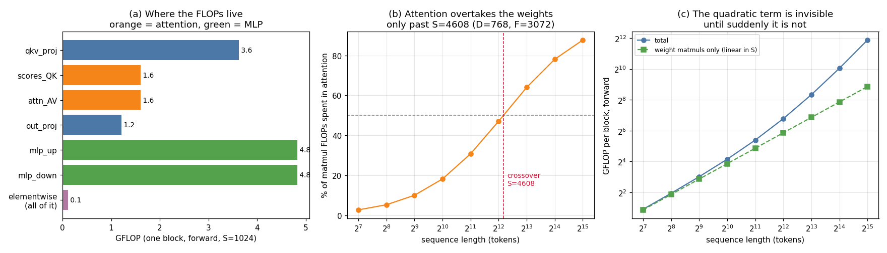

# Hand-counted FLOPs

---

> A profiler tells you what happened. A hand count tells you what *should* have happened. You need both, and the second one is free.

---

## Key Insight

Counting [FLOPs](/shared/glossary/#flops) by hand reveals where the computational weight of a [transformer](/shared/glossary/#transformer) block actually lies. Six [matrix multiplications](/shared/glossary/#matmul) carry **99.36%** of the arithmetic; every [softmax](/shared/glossary/#softmax), [GELU](/shared/glossary/#gelu) and [layer normalization](/shared/glossary/#layer-normalization) in the block adds up to the remaining 0.64%. But those same cheap operations account for **62% of the bytes moved** — which is why the thing that costs almost no arithmetic is often the thing that costs you time.

## Why This Matters

Once you can write down a model's FLOP count from its shapes alone, you can answer questions before you own the hardware: how long a training run will take, whether a GPU is a reasonable purchase, whether the number in a paper is plausible. And when a profiler disagrees with your count, one of you is wrong — this project shows a case where the profiler is.

---

**This is project 1.**

### The words first

- **[FLOP](/shared/glossary/#flops)** stands for **FL**oating-point **OP**eration: one arithmetic
  step on a decimal number. One addition is one FLOP. One multiplication is one FLOP.
  Note the two spellings you will see everywhere: **FLOPs** (no slash) is a *count* of
  operations — a property of the work. **FLOP/s** (with a slash) is operations *per
  second* — a property of the machine. Mixing them up is the single most common
  confusion in this field.
- **[Arithmetic intensity](/shared/glossary/#ai-arithmetic-intensity)** is FLOPs divided by
  bytes moved. It answers "how much maths do I get out of each byte I fetch?"
- A **[transformer](/shared/glossary/#transformer) block** is the repeating unit of a modern
  language model. GPT-2 small stacks 12 identical copies of it; a large model stacks 80+.
  Count one block and you can multiply.
- **[Attention](/shared/glossary/#attention)** is the part of the block where every token looks at
  every other token. **[MLP](/shared/glossary/#mlp)** (multi-layer perceptron) is the part where
  each token is processed on its own, through a wide hidden layer and back down.

### Why 2·M·N·K, and not M·N·K

Every FLOP count in this project rests on one rule, so it is worth deriving once.

Multiply an **M×K** matrix by a **K×N** matrix. The result has **M·N** entries. Each
entry is a *dot product* of one row (length K) with one column (length K): you multiply
K pairs together and then add those K products up.

```
K multiplies + (K-1) additions  ~=  2K FLOPs per output entry
M·N output entries              ->  2·M·N·K FLOPs total
```

The "−1" is dropped because K is large in practice and nobody rounds a billion to a
billion-minus-one. **This factor of 2 is not a convention you can choose** — it is the
reason peak-performance numbers are quoted as `cores × 2 × clock`, because the hardware's
[fused multiply-add](/shared/glossary/#fma-fused-multiply-add) instruction genuinely does one
multiply *and* one add per cycle.

### The six matmuls in a block

With **B** = batch, **S** = sequence length (tokens), **D** = model width,
**H** = [heads](/shared/glossary/#heads), **F** = MLP hidden width, and *d = D/H* the size of one head:

| # | What | Shapes | FLOPs |
|---|---|---|---|
| 1 | Q, K, V projections | (B·S, D) @ (D, D), three times | `6·B·S·D²` |
| 2 | scores `Q @ Kᵀ` | per head: (S, d) @ (d, S) | `2·B·S²·D` |
| 3 | values `A @ V` | per head: (S, S) @ (S, d) | `2·B·S²·D` |
| 4 | output projection | (B·S, D) @ (D, D) | `2·B·S·D²` |
| 5 | MLP up | (B·S, D) @ (D, F) | `2·B·S·D·F` |
| 6 | MLP down | (B·S, F) @ (F, D) | `2·B·S·F·D` |

Two of these six — rows 2 and 3 — have **S²** in them instead of S. That single
difference is the whole story of long-context models, and section 4 measures exactly when
it starts to hurt.

> **Where did the heads go in rows 2 and 3?** Per head the cost is `2·B·S²·d`, and there
> are H heads, so the total is `2·B·S²·d·H = 2·B·S²·D` because `d·H = D` by definition.
> Splitting D into H heads does not change the FLOP count at all — it only changes which
> numbers are allowed to interact. Beginners often assume multi-head attention is more
> expensive than single-head. It is exactly the same price.

---

## Running it

```bash
python run.py          # about 2 seconds, CPU only, no GPU required
```

A FLOP count does not care what hardware you own — that is the point of the exercise.

> **About the numbers.** Everything quoted below comes from the committed
> [`outputs/findings.json`](outputs/findings.json) and
> [`outputs/findings.csv`](outputs/findings.csv), produced by one run of `run.py`.
> These are *exact integer counts*, not timings, so re-running reproduces them digit for
> digit on any machine.



---

## 1. One block, counted

Reference shape: **GPT-2 small**, one block, batch 1, 1024 tokens
(B=1, S=1024, D=768, H=12, F=3072).

| Operation | GFLOP | Share of matmul FLOPs |
|---|---:|---:|
| MLP up | 4.832 | 27.3% |
| MLP down | 4.832 | 27.3% |
| Q/K/V projections | 3.624 | 20.5% |
| scores `Q @ Kᵀ` | 1.611 | 9.1% |
| values `A @ V` | 1.611 | 9.1% |
| output projection | 1.208 | 6.8% |
| **matmul total** | **17.717** | 100% |
| everything else (softmax, GELU, 2× layernorm, residuals, scaling) | 0.115 | — |

**The MLP is the biggest single consumer at 54.6%**, not attention. This surprises
people, because attention is the part of the architecture everyone talks about. At this
shape attention's two quadratic matmuls are only **18.2%** of the arithmetic.

The non-matmul operations total **0.64%** of all FLOPs. Hold on to that number; section 6
turns it upside down.

---

## 2. Checking the count against PyTorch

Here is the fair objection: **PyTorch ships a FLOP counter. Why count by hand at all?**

Because they answer different questions. `FlopCounterMode` reports what the ops it
recognises *did report*, for the shapes you actually ran. The hand formula predicts what
*any* shape will cost, on hardware you have not bought, for a model you have not built —
and, as we are about to see, it also catches the counter when the counter is wrong.

`run.py` builds a real transformer block in PyTorch and counts it two ways:

| Source | GFLOP |
|---|---:|
| hand formula (matmuls) | 17.717 |
| `FlopCounterMode`, attention written out as matmul + softmax | **17.717** |
| `FlopCounterMode`, attention via `F.scaled_dot_product_attention` | **14.496** |

The first two agree **exactly** — the hand formula is verified, to the last integer.

The third row is the interesting one. Both blocks compute the same function on the same
shapes. Swapping the explicit `(q @ k.T).softmax() @ v` for the fused
[`F.scaled_dot_product_attention`](/shared/glossary/#fscaled_dot_product_attention) makes
**3.221 GFLOP — 18.2% of the block — disappear from the report.**

Nothing got faster. The counter simply has no formula registered for the fused
[kernel](/shared/glossary/#kernel) on this build (PyTorch 2.11, CPU), so it scores it as zero.

**The practical consequence:** if you profile a modern model that uses
[FlashAttention](/shared/glossary/#flashattention) and compute "achieved FLOP/s = reported
FLOPs ÷ time", you will *understate* your hardware utilisation, and the error grows with
sequence length — precisely where attention matters most. A hand count is what tells you
the tool is lying.

---

## 3. Two rules of thumb, verified

### Backward costs 2× forward

| Pass | GFLOP | Ratio |
|---|---:|---:|
| forward | 17.717 | 1.00× |
| forward + backward | 53.150 | **3.00×** |

Exactly 3.00, not approximately. The reason is mechanical: for `Y = X @ W`, the
[backward pass](/shared/glossary/#backward-pass) needs *two* matmuls of the same size —
one for the gradient with respect to the input (`dX = dY @ Wᵀ`) and one for the gradient
with respect to the weights (`dW = Xᵀ @ dY`). Two extra matmuls per one forward matmul
gives 1 + 2 = 3.

This is where the famous **"training costs 6·N·D FLOPs"** rule comes from: 2·N·D for the
forward pass ([section 3b](#the-2n-rule)), tripled.

### The 2N rule {#the-2n-rule}

For a model with **N** [parameters](/shared/glossary/#parameters), one forward pass over one token
costs about **2·N** FLOPs. Why 2? Because every parameter is a weight in some matrix, and
each weight is used exactly once per token, in one multiply and one add — the factor of 2
from the derivation above.

| Quantity | Value |
|---|---:|
| parameters in this block | 7.081 M |
| matmul FLOPs per token | 17.302 M |
| ratio (all matmuls) | 2.443 |
| ratio (weight matmuls only, excluding attention's S² terms) | **1.9991** |

The 1.9991 is the rule confirmed to four digits. (It is not exactly 2.0000 because the
two layernorms contribute 4·D = 3,072 parameters that do no matmul work at all.)

The 2.443 is the rule *breaking*: attention's `Q @ Kᵀ` and `A @ V` multiply activations by
other activations, not by weights, so they add FLOPs without adding parameters. **The 2N
rule silently under-counts by 22% at 1024 tokens, and gets worse as context grows.**
Every "training FLOPs" estimate you see quoted for a frontier model has this error baked
in unless the author was careful.

---

## 4. When does attention take over?

Attention grows as **S²**, everything else grows as **S**. So the crossover exists, and
we can solve for it exactly instead of guessing:

```
attention  = 4·B·S²·D                 (rows 2 and 3 of the table)
everything = 8·B·S·D² + 4·B·S·D·F     (rows 1, 4, 5, 6)

set them equal, cancel 4·B·S·D:

        S  =  2·D + F
```

For GPT-2 small (D=768, F=3072) that is **S = 4,608 tokens**. `run.py` plugs 4,608 back
into the full formula and gets a ratio of exactly 1.0000 — the algebra checks out.

| Sequence length | Attention's share of matmul FLOPs | Arithmetic intensity |
|---:|---:|---:|
| 128 | 2.7% | 80.5 |
| 512 | 10.0% | **109.4** ← peak |
| 1,024 | 18.2% | 90.7 |
| 4,096 | 47.1% | 49.2 |
| 4,608 | 50.0% ← crossover | — |
| 8,192 | 64.0% | 38.4 |
| 32,768 | **87.7%** | 29.4 |

Two things worth reading slowly:

**At 128 tokens, attention is a rounding error.** If your intuition is "attention is the
expensive part of a transformer", that intuition was formed on long contexts. At short
ones you would barely notice if it were free.

**The arithmetic intensity has a maximum, and then falls.** This is the non-obvious one.
Going from 512 to 32,768 tokens makes the block *worse* at using the hardware — 109.4 down
to 29.4 FLOPs per byte, a 3.7× decline. The reason: attention's intermediate score matrix
has S² entries, so beyond a certain length you are generating bytes faster than you are
generating arithmetic to justify them. Long context is not just "more compute"; it is
compute that is *harder to feed*. [Project 2](../02-roofline-by-hand/README.md) shows what
that costs on real silicon.

---

## 5. The same block, counted in bytes

FLOPs are only half of a performance model. `run.py` also counts the bytes that must cross
the [memory](/shared/glossary/#memory-bandwidth) bus if every operation runs as its own
[kernel](/shared/glossary/#kernel) — each one reading its inputs from memory and writing its
output back.

At S=1024 in bf16 (2 bytes per number):

| | MB |
|---|---:|
| activations (read + written between operations) | 182.5 |
| weights (read once) | 14.2 |
| **total** | **196.6** |

Arithmetic intensity = 17.83 GFLOP ÷ 196.6 MB = **90.7 FLOPs per byte**.

Remember that number. On an H100 you need roughly 295 FLOPs per byte before the compute
units become the limit. **An unfused transformer block, at the shape that made GPT-2
famous, is memory-bound on modern hardware** — three times below the line.

---

## 6. The 0.64% that is 62% of the problem

This is the result worth taking away from the whole project.

| | Share of FLOPs | Share of bytes |
|---|---:|---:|
| the six matmuls | 99.36% | 37.6% |
| softmax, GELU, layernorms, residuals | **0.64%** | **62.4%** |

The operations that do almost none of the arithmetic move almost two-thirds of the data.

The reason is structural, not accidental. A matmul reads `D²` weights and does `S·D²` work
with them — it *reuses* every byte S times. An [elementwise
operation](/shared/glossary/#elementwise-operation) like GELU reads a number, does one cheap
thing to it, and writes it straight back: zero reuse, and it must pay for a read *and* a
write. Chain ten of those together and you have read and written the entire tensor twenty
times to perform ten operations that a single pass could have done.

**This is the entire economic argument for [kernel fusion](/shared/glossary/#kernel-fusion)**,
and it is why fusing "cheap" operations produces speedups that look impossible if you are
still thinking in FLOPs. You are not saving arithmetic. You never were. You are saving
trips to memory.

---

## What to take away

1. **`2·M·N·K` per matmul is the only formula you need**, and the 2 comes from the hardware's
   multiply-add instruction, not from a convention.
2. **The MLP is bigger than attention** until the sequence gets long — 54.6% versus 18.2%
   at 1024 tokens. The crossover is at `S = 2D + F`, and you can compute it for your own
   model in one line.
3. **Backward is exactly 2× forward**, because each matmul needs two gradient matmuls.
   Hence the 6·N·D training rule.
4. **A profiler can be confidently wrong.** Fused attention reported 18.2% fewer FLOPs than
   it performs. Your hand count is the control that catches it.
5. **FLOPs are not the cost.** The cheapest 0.64% of the arithmetic moves 62.4% of the
   bytes, and on real hardware bytes are what you wait for.

## Files

| File | What it is |
|---|---|
| [`run.py`](run.py) | the hand formulas, the PyTorch cross-check, the sweep, the plot |
| [`outputs/findings.json`](outputs/findings.json) | every number quoted above |
| [`outputs/findings.csv`](outputs/findings.csv) | per-operation breakdown and the sequence sweep |
| [`outputs/flops_breakdown.png`](outputs/flops_breakdown.png) | the three panels shown above |

## Next

[Project 2 — Roofline by hand](../02-roofline-by-hand/README.md) takes the FLOPs-and-bytes
pair computed here and turns it into a prediction of *time*, then checks that prediction
against a real GPU.
