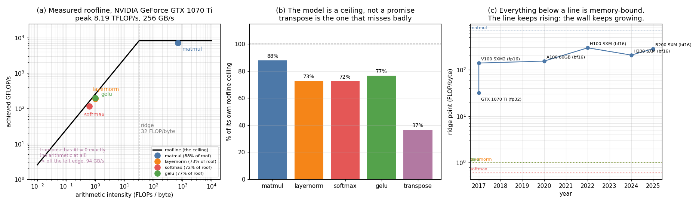

# Roofline by Hand

---

> The roofline model does not predict how fast your code will run. It tells you which of two things to stop worrying about.

---

## Key Insight

Applying the [roofline](/shared/glossary/#roofline) model by hand clarifies whether an operation is limited by [memory bandwidth](/shared/glossary/#memory-bandwidth) or by arithmetic. For five operations — [matmul](/shared/glossary/#matmul), [layernorm](/shared/glossary/#layer-normalization), [softmax](/shared/glossary/#softmax), [GELU](/shared/glossary/#gelu), transpose — we compute [arithmetic intensity](/shared/glossary/#ai-arithmetic-intensity) on paper, predict which are memory-bound, and then run all five on a real [GPU](/shared/glossary/#gpu). Four of the five land within 12–28% of the prediction. The fifth misses by 2.7×, and *that* is the most instructive result in the project.

## Why This Matters

Almost every "we made deep learning faster" paper of the last decade — [FlashAttention](/shared/glossary/#flashattention), mixed precision, [kernel fusion](/shared/glossary/#kernel-fusion), gradient checkpointing — is a roofline argument wearing different clothes. Once you can place an operation on the diagram yourself, you can tell in about thirty seconds whether a proposed optimisation can possibly help.

---

**This is project 2.**

### The words first

- The **[roofline](/shared/glossary/#roofline)** is a graph with [arithmetic
  intensity](/shared/glossary/#ai-arithmetic-intensity) (FLOPs per byte) on the x-axis and
  achieved speed (FLOP/s) on the y-axis. It is named for its shape: a sloped line that
  rises and then flattens, like the roof of a house seen from the side.
- The sloped part is the **memory roof** — its height is `bandwidth × arithmetic
  intensity`. The flat part is the **compute roof** — the chip's peak FLOP/s.
- The corner where they meet is the **[ridge point](/shared/glossary/#ridge-point)**,
  also called the knee. It equals `peak FLOP/s ÷ peak bytes/s`. Left of the ridge you are
  [memory-bound](/shared/glossary/#memory-bound); right of it you are compute-bound.
- **Bound by** means *limited by*. "Memory-bound" does not mean the operation uses a lot
  of memory. It means the arithmetic units are sitting idle waiting for data.

### Why this model is worth learning when you could just measure

A fair beginner's objection: **why compute a ceiling when you can time the code?**

Because a measurement gives you a number and no explanation. If your kernel runs in 1.4 ms
you have learned nothing about whether 1.4 ms is good. The roofline converts that number
into a verdict — *this operation is at 73% of the fastest it could possibly go on this
chip, and the thing stopping it is bandwidth* — which tells you what to do next, and
just as importantly what **not** to do. Adding FLOPs to a memory-bound kernel is wasted
work, and the model tells you that before you write the code.

The model also works on hardware you do not own. Section 3 places these five operations on
an A100, an H100 and a B200 without renting any of them, because the ridge point is one
division.

---

## Running it

```bash
python run.py        # ~15 s: compiles bench_ops.cu with nvcc, runs it, plots
```

The prediction half is pure arithmetic and needs nothing. The measurement half needs
`nvcc`. On this machine the GPU is a **GTX 1070 Ti** — a 2017 consumer card that the
installed PyTorch build refuses to use (its `sm_61` architecture was dropped from recent
CUDA builds), but which the system `nvcc` (CUDA 12.0) compiles for perfectly. Writing the
[kernels](/shared/glossary/#kernel) in CUDA C++ sidesteps the framework entirely.

> **About the numbers.** Everything below comes from the committed
> [`outputs/findings.json`](outputs/findings.json). The counts are exact; the timings are
> best-of-5-rounds and move a percent or two between runs.



---

## 1. Counting bytes, which is harder than counting FLOPs

FLOPs are unambiguous. Bytes require you to decide what "moved" means, so state the
assumption: **each operation is a separate kernel that reads its inputs from memory and
writes its output back.** No fusion, no cache reuse between operations.

| Operation | Shape | FLOPs | Bytes | AI (FLOP/byte) |
|---|---|---:|---:|---:|
| matmul | 4096³, fp32 | 137.44 G | 201.3 MB | **682.67** |
| layernorm | 8192 × 4096 | 0.27 G | 268.4 MB | 1.000 |
| softmax | 8192 × 4096 | 0.17 G | 268.4 MB | 0.625 |
| GELU | 33.5 M elements | 0.27 G | 268.4 MB | 1.000 |
| transpose | 8192², fp32 | **0** | 536.9 MB | **0.000** |

Two of these deserve comment.

**Matmul is the outlier by three orders of magnitude.** Its bytes grow as N² (three
matrices) while its FLOPs grow as N³, so its arithmetic intensity grows *linearly with
N*: AI = ⅔·N/bytes-per-element. Make the matrix bigger and it becomes more compute-bound.
Nothing else in deep learning behaves this way, and it is the reason hardware vendors
optimise for matmul and everything else is a compromise.

**Transpose has an arithmetic intensity of exactly zero.** It performs no arithmetic at
all — it only moves numbers to different addresses. That is not a degenerate case to be
embarrassed about; it is the clean limit of the memory-bound end, and it means the
roofline's verdict is unconditional: *no chip, at any clock speed, in any year, can make
this faster except by moving bytes faster.*

> **Does the exact FLOP convention matter?** For layernorm I counted ~8 FLOPs per element;
> a stricter reading might say 5, a looser one 10. That would move its AI from 1.00 to
> between 0.63 and 1.25 — and change nothing, because the ridge point is 32. **When an
> operation is 30× below the line, arguing about a factor of 1.6 is pointless.** This is
> the model being forgiving where it can afford to be.

---

## 2. The ridge point of the GPU in this machine

The script does not look up a spec sheet. It computes both peaks from what the driver
reports, so it gives the right answer on any card:

```
peak FLOP/s = SMs × cores-per-SM × 2 × clock
            = 19 × 128 × 2 × 1.683 GHz  =  8.19 TFLOP/s

peak bytes/s = memory clock × 2 × bus width
             = 4.004 GHz × 2 × (256/8) bytes  =  256.3 GB/s

ridge point = 8.19e12 / 256.3e9  =  31.9 FLOPs per byte
```

The **× 2** appears in both lines for two completely different reasons, which is a classic
source of confusion:

- In the FLOPs line it is the [fused multiply-add](/shared/glossary/#fma-fused-multiply-add):
  one instruction, two arithmetic operations.
- In the bytes line it is the "**D**ouble **D**ata **R**ate" in
  [GDDR](/shared/glossary/#gddr): the memory transfers on both the rising and the falling edge
  of each clock tick.

With the ridge at 31.9, the predictions write themselves: **matmul (682.67) is
compute-bound; the other four are memory-bound**, by margins of 32×, 51×, 32× and infinity.

---

## 3. The same five operations on hardware we do not have

The ridge point is one division, so we can do this for any chip whose spec sheet we trust.
All figures are *dense* peaks (no structured-sparsity doubling), so they are comparable:

| GPU | Year | Peak | Bandwidth | Ridge point |
|---|---:|---:|---:|---:|
| GTX 1070 Ti | 2017 | 8.2 TFLOP/s (fp32) | 256 GB/s | **32.0** |
| V100 SXM2 | 2017 | 125 TFLOP/s (fp16) | 900 GB/s | 138.9 |
| A100 80GB | 2020 | 312 TFLOP/s (bf16) | 2,039 GB/s | 153.0 |
| H100 SXM | 2022 | 989 TFLOP/s (bf16) | 3,350 GB/s | **295.3** |
| H200 SXM | 2024 | 989 TFLOP/s (bf16) | 4,800 GB/s | 206.1 |
| B200 SXM | 2025 | 2,250 TFLOP/s (bf16) | 8,000 GB/s | 281.2 |

Layernorm, softmax, GELU and transpose are memory-bound on **every single one**. There is
no GPU you can buy that changes this, and there is unlikely ever to be one.

**The ridge point grew 9.2× from the 2017 consumer card to the H100.** Read that as a
statement about your code, not about the hardware: an operation at 100 FLOPs/byte was
comfortably compute-bound on a 1070 Ti and is 3× *under* the line on an H100. The same
kernel, unchanged, changed category. Vendors add arithmetic faster than they add
bandwidth, so the memory-bound region keeps swallowing more of the workload — this is the
[memory wall](/shared/glossary/#memory-wall), quantified.

**The one row that goes the other way is worth pausing on.** The H200 has *identical*
compute to the H100 and 1.43× the bandwidth, so its ridge point *falls* from 295 to 206.
That is what the H200 is: not a faster chip, but the same chip with the wall pushed back
30%. If you ever wondered why a product with no extra FLOPs was worth releasing, the ridge
point is the answer.

---

## 4. Prediction versus measurement

Predicted time is `max(FLOPs ÷ peak FLOP/s, bytes ÷ peak bytes/s)` — the operation cannot
finish before it has done its arithmetic, and it cannot finish before its data has
arrived, so it takes at least the longer of the two.

| Operation | AI | Bound by | Predicted | Measured | % of its roof | Achieved |
|---|---:|---|---:|---:|---:|---|
| matmul (cuBLAS) | 682.67 | compute | 16.79 ms | 19.10 ms | **87.9%** | 7,197 GFLOP/s |
| GELU | 1.00 | memory | 1.05 ms | 1.37 ms | 76.5% | 196.1 GB/s |
| layernorm | 1.00 | memory | 1.05 ms | 1.44 ms | 72.7% | 186.2 GB/s |
| softmax | 0.63 | memory | 1.05 ms | 1.45 ms | 72.4% | 185.5 GB/s |
| transpose | 0.00 | memory | 2.09 ms | 5.74 ms | **36.5%** | 93.6 GB/s |

**Every classification was correct**, and four of the five times were predicted within
12–28% by a model with two inputs. For a back-of-envelope calculation done before writing
any code, that is remarkable.

Some details worth noticing:

- **[cuBLAS](/shared/glossary/#cublas) reaching 87.9% of theoretical peak** is the number to
  keep in your head when someone claims a hand-written matmul beats it. This is a
  nine-year-old card with no [Tensor Cores](/shared/glossary/#tensor-core), and NVIDIA's
  library still extracts 7.20 of a possible 8.19 TFLOP/s.
- **The three memory-bound kernels all land at 72–77% of peak bandwidth**, despite doing
  quite different arithmetic (a two-pass reduction, a three-pass reduction, a pure
  elementwise map). Once you are memory-bound, *what* you compute stops mattering — the
  operations converge to the same speed because they are all just moving 268 MB.
  Their achieved FLOP/s differ by 1.7× while their achieved GB/s differ by 6%.

---

## 5. Where the model fails, and why that is useful

Transpose reached **36.5%** of its own ceiling — the model was off by 2.7×.

The model is not wrong. It said *this operation is limited by memory bandwidth*, and it
is. What it cannot know is that this particular kernel does not **get** peak bandwidth:

```cuda
y[col * N + row] = x[row * N + col];
//  ^ writes jump N floats apart      ^ reads are adjacent
```

Neighbouring threads read neighbouring addresses (good) but write addresses 32 KB apart
(catastrophic). The GPU fetches memory in [cache lines](/shared/glossary/#cache-line) of
32–128 bytes; a write that uses 4 bytes of each line wastes the rest. This is
[memory coalescing](/shared/glossary/#memory-coalescing), and the same three kernels that hit
186–196 GB/s show what the hardware *can* do when access is contiguous.

So the honest formulation is:

> **The roofline is a ceiling, not a forecast.** It tells you which resource you are
> spending and the best you could possibly do with it. Closing the gap to that ceiling is
> a separate skill.

And the gap is diagnostic. A memory-bound kernel at 75% of the memory roof is *finished* —
stop optimising, you have at most 33% left and it will be painful. A memory-bound kernel
at 36% has an access-pattern bug, and finding it is worth 2×. **The percentage tells you
whether to keep working.** [Project 11](../11-coalesced-vs-non-coalesced/README.md)
dissects exactly this failure.

---

## 6. Reading the diagram

Panel (a) plots each measured operation on the roofline. Everything lives in one of two
places:

- **Matmul sits on the flat part**, just under the compute roof. To speed it up you need
  more FLOP/s — a bigger GPU, lower precision, Tensor Cores. Reducing its memory traffic
  would achieve nothing; it is only using 10.5 GB/s of the 256 available.
- **Everything else is pinned against the sloped part.** Reducing their arithmetic would
  achieve nothing. The only lever is bytes: fuse them together, use bf16 instead of fp32,
  or recompute instead of storing.

Transpose cannot be plotted at all — its AI of 0 is off the left edge of a log axis. It is
the purest possible memory-bound operation, annotated separately at 93.6 GB/s.

---

## What to take away

1. **The ridge point is one division** and it decides everything: `peak FLOP/s ÷ peak
   bytes/s`. 32 on this card, 295 on an H100.
2. **Four of the five ops are memory-bound on every GPU ever made**, from a 2017 gaming
   card to a B200. That is a property of the operations, not of the hardware.
3. **The model predicted the winner correctly every time**, and the time within 12–28% for
   four of five, from two spec-sheet numbers.
4. **The one failure was informative**: 36.5% of the roof meant "you have an access-pattern
   bug", and it was right.
5. **The ridge point rises with every generation**, so operations migrate into the
   memory-bound region over time without anyone touching them. The H200's *falling* ridge
   point shows the counter-move: buying bandwidth instead of FLOPs.

## Files

| File | What it is |
|---|---|
| [`run.py`](run.py) | hand counts, ridge points, compiles and runs the benchmark, plots |
| [`bench_ops.cu`](bench_ops.cu) | the five CUDA kernels, timed with CUDA events |
| [`outputs/findings.json`](outputs/findings.json) | every number quoted above |
| [`outputs/findings.csv`](outputs/findings.csv) | per-operation predicted vs measured |
| [`outputs/ridge_points.csv`](outputs/ridge_points.csv) | the six-GPU ridge table |
| [`outputs/roofline.png`](outputs/roofline.png) | the three panels shown above |

## Next

[Project 3 — Bandwidth measurement](../03-bandwidth-measurement/README.md) attacks the
denominator of the ridge point directly: how many bytes per second can this GPU *really*
move, and how far is that from the number on the box?
