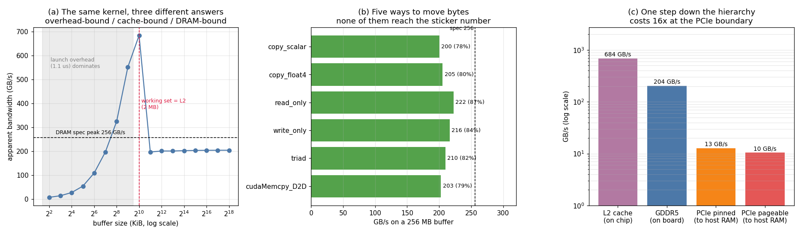

# Bandwidth Measurement

---

> The same copy kernel measured 6.9 GB/s, 684 GB/s, and 204 GB/s on the same GPU in the same run. All three numbers are correct. Only one of them is about memory.

---

## Key Insight

Measuring the achieved [memory bandwidth](/shared/glossary/#memory-bandwidth) of a simple copy [kernel](/shared/glossary/#kernel) exposes the gap between the number on the box and what you can actually get. This GPU's spec sheet says **256.3 GB/s**; the best a real kernel reached was **222.5 GB/s (86.8%)**, and a plain copy managed **205.4 GB/s (80.2%)**. More useful than either figure: the measurement only means anything once you know which part of the [memory hierarchy](/shared/glossary/#cpu-cache-hierarchy) the data was in, and a buffer-size sweep makes that visible as a 3.5× cliff.

## Why This Matters

Every memory-bound kernel you ever write is competing against the number measured here. If a copy gets 205 GB/s, your fused [layernorm](/shared/glossary/#layer-normalization) is not going to get 250 — so "how close am I to a plain copy?" is the only meaningful efficiency score for a memory-bound operation.

---

**This is project 3.**

### The words first

- **Bandwidth** is bytes per second. **[Latency](/shared/glossary/#latency)** is the delay
  before the first byte arrives. They are different things and improve independently — a
  freight train has enormous bandwidth and terrible latency.
- **Spec peak** is `memory clock × 2 × bus width`, where the ×2 is the
  "double data rate" in [GDDR](/shared/glossary/#gddr): data moves on both the rising and the
  falling edge of every clock tick.
- **[L2 cache](/shared/glossary/#l2-cache)** is a small pool of fast memory on the GPU die
  itself, shared by all [SMs](/shared/glossary/#sm). This card has 2 MB. If your data fits, you
  never touch DRAM at all.
- **[PCIe](/shared/glossary/#pcie)** is the cable between the GPU and the host computer's RAM.
  It is the narrowest link in the chain by a wide margin.
- **Effective bandwidth** = *useful* bytes ÷ time. For a copy you count the read and the
  write: copying 256 MB moves 512 MB.

### Why measure at all, when the spec sheet exists

The spec number is an upper bound derived from clock rates. It assumes every cycle
transfers data, no refresh, no protocol overhead, no partially-used
[cache lines](/shared/glossary/#cache-line). Reality is 70–90% of it — and the gap is not
constant, it depends on what your kernel does. Knowing your card gets 205 GB/s on a copy
converts "my kernel takes 1.4 ms" into "my kernel is at 73% of the practical ceiling",
which is the only form of the statement you can act on.

---

## Running it

```bash
python run.py        # ~10 s: compiles bandwidth.cu with nvcc, runs it, plots
```

Hardware: **GTX 1070 Ti**, 19 [SMs](/shared/glossary/#sm), 8 GB [GDDR](/shared/glossary/#gddr)5,
2 MB [L2](/shared/glossary/#l2-cache), on PCIe 3.0 ×16.

> **About the numbers.** All figures come from the committed
> [`outputs/findings.json`](outputs/findings.json) and
> [`outputs/findings.csv`](outputs/findings.csv). Timings are best-of-4-rounds and move
> ~1% between runs.



---

## 1. The spec number, computed rather than looked up

```
peak = memory clock × 2 × bus width / 8
     = 4.004 GHz × 2 × 256 / 8 bytes
     = 256.3 GB/s
```

Both inputs come from `cudaGetDeviceProperties`, so this works on any card without a
web search. The result matches NVIDIA's published 256 GB/s exactly — a good sign that you
have understood the formula rather than memorised a number.

---

## 2. Five ways to move 256 MB

Each kernel runs over a 256 MB buffer, far larger than the 2 MB L2, so DRAM is genuinely
involved.

| Kernel | Bytes counted | GB/s | % of spec peak |
|---|---|---:|---:|
| `read_only` (sum an array) | reads only | **222.5** | **86.8%** |
| `write_only` (fill an array) | writes only | 216.5 | 84.5% |
| `triad` (`a = b + s·c`) | 2 reads + 1 write | 209.7 | 81.8% |
| `copy_float4` (16 bytes/thread) | 1 read + 1 write | 205.4 | 80.2% |
| `cudaMemcpy` device→device | 1 read + 1 write | 202.7 | 79.1% |
| `copy_scalar` (4 bytes/thread) | 1 read + 1 write | 200.3 | 78.2% |

Three things here are worth more than the headline:

**Reading is faster than writing, and pure streams beat mixed ones.** 222 GB/s reading
versus 205 GB/s for a copy. A copy has to interleave reads and writes on the same bus, and
DRAM pays a penalty when it switches direction — like a single-track railway that must
clear the line before a train can go the other way. This is why the honest ceiling for a
*copy-shaped* kernel is ~205, not 256.

**`cudaMemcpy` is not magic.** NVIDIA's own device-to-device copy achieved 202.7 GB/s; the
four-line kernel in [`bandwidth.cu`](bandwidth.cu) achieved 205.4 — **1.3% faster**. For
straight-line data movement there is no secret sauce in the library. (For anything with
structure — [matmul](/shared/glossary/#matmul), convolution — the opposite is emphatically
true; see [project 2](../02-roofline-by-hand/README.md), where cuBLAS hit 88% of peak
compute.)

**Vectorised loads bought almost nothing: 1.025×.** This deserves a paragraph, because
"use `float4` for coalesced 16-byte loads" is standard advice.

---

## 3. Two optimisations that did nothing (and why)

### `float4` versus `float`: 1.025×

Loading 16 bytes per thread instead of 4 issues one quarter as many memory instructions.
It bought **2.5%**.

The advice is not wrong; it is *conditional*. Wider loads help when you are limited by the
number of memory requests in flight — too few threads, or an instruction-issue bottleneck.
Here the DRAM bus is already saturated at 78% of its theoretical peak, and no
reorganisation of the requests can make the memory chips respond faster. **You cannot
optimise your way past the resource you have already exhausted.** When the roofline says
memory-bound and you are *at* the memory roof, you are done.

### Block size: 1.008× across a 32× range

| Threads per block | 32 | 64 | 128 | 256 | 512 | 1024 |
|---|---:|---:|---:|---:|---:|---:|
| GB/s | 203.4 | 202.7 | 202.4 | 203.7 | 204.0 | 204.0 |

Total spread: **0.8%**. Block-size tuning is one of the first knobs every CUDA tutorial
introduces, and for a bandwidth-bound kernel with a
[grid-stride loop](/shared/glossary/#grid-stride-loop) it is worth essentially nothing. The
reason is that the grid-stride form already launches enough
[warps](/shared/glossary/#warp) to saturate the bus regardless of how they are grouped into
blocks. Block size starts to matter when [occupancy](/shared/glossary/#occupancy) is limited
by [registers](/shared/glossary/#registers) or [shared memory](/shared/glossary/#shared-memory)
— which a copy uses none of. [Project 8](../08-occupancy-study/README.md) builds a case
where it matters.

**The general lesson:** an optimisation is only worth its complexity if it relieves the
resource that is actually binding. Both of these relieve resources that were not.

---

## 4. The same kernel, three different answers

Now the sweep. Identical code, identical instructions — only the buffer size changes.

| Buffer | Working set | Time | Apparent GB/s | Launch overhead | Fits in 2 MB L2? |
|---:|---:|---:|---:|---:|---|
| 4 KiB | 8 KiB | 1.19 µs | 6.9 | 93% | yes |
| 64 KiB | 128 KiB | 1.21 µs | 108.4 | 92% | yes |
| 256 KiB | 512 KiB | 1.62 µs | 323.8 | 68% | yes |
| 1 MiB | 2 MiB | 3.07 µs | **683.9** | 36% | yes (exactly) |
| 2 MiB | 4 MiB | 21.35 µs | **196.5** | 5% | **no** |
| 8 MiB | 16 MiB | 83.6 µs | 200.6 | 1% | no |
| 256 MiB | 512 MiB | 2633 µs | 203.9 | 0% | no |

("Working set" is read buffer + write buffer — that is what has to fit in cache.)

### Region 1: the measurement is measuring itself

Below ~256 KiB the time barely changes, because it is not the memory that is being timed.
An **empty kernel launch on this machine costs 1.11 µs**, and a 4 KiB copy took 1.19 µs.
93% of that measurement is the cost of *asking* the GPU to do something.

The reported 6.9 GB/s is not a bandwidth. It is 8,192 bytes divided by a fixed overhead,
and it would double if you doubled the buffer no matter how slow the memory was. **Any
GPU benchmark that does not report its launch overhead cannot be trusted at small sizes.**

### Region 2: the cache, briefly

At a 1 MiB buffer the working set is 2 MiB — exactly the L2 capacity — and the kernel
reports **684 GB/s, which is 2.67× the DRAM spec peak**. The data never reached DRAM.
Subtracting the 1.11 µs launch cost puts the true figure near 1,070 GB/s.

### Region 3: the cliff

Doubling the buffer from 1 MiB to 2 MiB — one step past L2 — drops throughput from
**684 to 196 GB/s, a 3.5× collapse, with no change to the code**. From there it is flat
at ~204 GB/s forever.

This is the single most important shape in performance engineering, and it explains why
"tiling" is the answer to almost everything. A tiled [matmul](/shared/glossary/#matmul) is not
clever arithmetic; it is an arrangement that keeps the working set on the left side of that
cliff. [FlashAttention](/shared/glossary/#flashattention) is the same trick applied to
attention. [Project 13](../13-tile-size-sweep/README.md) does it deliberately.

**And the warning:** benchmark a kernel on a small input, get 684 GB/s, ship it, watch it
run at 196 GB/s in production. Nothing changed except the size of the data.

---

## 5. Leaving the card: the PCIe cliff

| Path | GB/s |
|---|---:|
| L2 cache (on-die) | 684 |
| GDDR5 (on-board) | 204 |
| PCIe host→device, [pinned](/shared/glossary/#pinned-memory) | 12.7 |
| PCIe host→device, pageable | 10.4 |
| PCIe device→host, pinned | 12.8 |
| PCIe device→host, pageable | 8.3 |

**The GPU reads its own memory 16.1× faster than it can be fed from host RAM.** Every
design decision about where data lives descends from this ratio. It is also why
[project 5](../05-gpu-vs-cpu-bake-off/README.md) finds that a small matmul is *slower* on
the GPU than on the CPU: the maths finished long before the data finished arriving.

### Why "pinned" is worth 1.2–1.6×

Ordinary host memory is **pageable**: the operating system may relocate it at any moment,
so the GPU's DMA engine cannot be given its physical address. The driver works around this
by copying your data into a hidden staging buffer that *is* fixed, then transferring from
there — you pay for two copies and only see one.

[Pinned memory](/shared/glossary/#pinned-memory) (`cudaMallocHost`) is memory the OS has
promised not to move, so the transfer goes directly. Measured: **1.22× faster
host→device, 1.55× device→host**.

Note the asymmetry in the pageable row: 10.4 GB/s out, 8.3 GB/s back. The two directions
use different code paths in the driver, and the return trip is the slower one. Pinning
erases the difference (12.7 vs 12.8) — evidence that the gap was never the hardware.

The catch, which is why pinning is not the default: pinned memory cannot be swapped out,
so allocating a lot of it takes RAM away from the whole system, and `cudaMallocHost`
itself is slow. Pin the buffers you reuse; do not pin everything.

---

## What to take away

1. **80% of spec is a good copy. 87% is about the ceiling.** Compute your card's spec peak
   from device properties, then measure — the ratio is your kernel's real scoreboard.
2. **Reads beat writes beat copies** (222 / 216 / 205 GB/s). Mixed direction costs ~8%.
3. **Two textbook optimisations bought 2.5% and 0.8%** here, because the bus was already
   saturated. Optimise the binding resource or do not bother.
4. **A hand-written copy matched `cudaMemcpy` to within 1.3%.** For pure movement there is
   nothing to lose to the library.
5. **The size sweep is the real result:** 6.9 → 684 → 204 GB/s for identical code.
   Overhead-bound, cache-bound, DRAM-bound. Always report which one you measured.
6. **Crossing PCIe costs 16×.** Data that lives on the GPU should stay on the GPU.

## Files

| File | What it is |
|---|---|
| [`bandwidth.cu`](bandwidth.cu) | copy/read/write/triad kernels, the sweeps, PCIe transfers |
| [`run.py`](run.py) | compiles it, parses the CSV, computes percentages, plots |
| [`outputs/findings.json`](outputs/findings.json) | headline numbers |
| [`outputs/findings.csv`](outputs/findings.csv) | every kernel, block size, buffer size and PCIe path |
| [`outputs/bandwidth.png`](outputs/bandwidth.png) | the three panels shown above |

## Next

[Project 4 — AVX-512 study](../04-avx-512-study/README.md) crosses to the other side of
the PCIe cable and asks the same question of the CPU: how much of its arithmetic
throughput can you actually reach, and what stops you?
