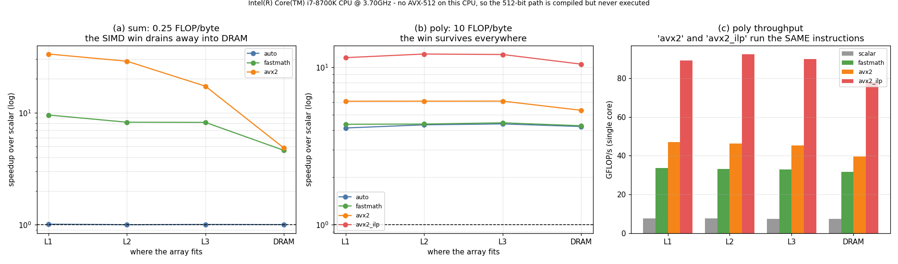

# AVX-512 Study

---

> The same eight-lane instruction is worth 33× in L1 and 5× in DRAM. The instruction did not change. The distance to the data did.

---

## Key Insight

Writing a vector sum in scalar, autovectorized and hand-written intrinsic form shows how [SIMD](/shared/glossary/#simd) speeds up element-wise work on a [CPU](/shared/glossary/#cpu) — and, more usefully, where it stops helping. Two kernels with the same instructions but different [arithmetic intensity](/shared/glossary/#ai-arithmetic-intensity) behave completely differently: the memory-bound one loses **6.9× of its SIMD advantage** as the array moves from L1 cache out to DRAM, while the compute-bound one keeps essentially all of it. Along the way, plain `-O3` turns out **not** to vectorize a float sum at all, and the "unsafe" reordering that makes it possible turns out to be **805× more accurate** than the careful version.

## Why This Matters

SIMD is the CPU's version of the same bargain a [GPU](/shared/glossary/#gpu) offers: many lanes, one instruction. Understanding when the lanes go idle on a CPU — where you can inspect every instruction — is the cheapest way to build the intuition you will need when the same thing happens on a GPU, where you cannot.

---

**This is project 4.**

### The words first

- **[SIMD](/shared/glossary/#simd)** = **S**ingle **I**nstruction, **M**ultiple **D**ata. One
  instruction operates on several numbers at once, held side by side in one wide register.
- **[AVX2](/shared/glossary/#avx2)** gives 256-bit registers (`ymm`) = **8** float32 lanes.
  **[AVX-512](/shared/glossary/#avx-512)** gives 512-bit registers (`zmm`) = **16** lanes. The
  numbers in the names are the register width in bits.
- **Intrinsics** are C functions that map one-to-one onto machine instructions
  (`_mm256_add_ps` *is* `vaddps`). They let you write assembly without writing assembly.
- **[Autovectorization](/shared/glossary/#vectorization)** is the compiler doing this for you.
- **[FMA](/shared/glossary/#fma-fused-multiply-add)** = fused multiply-add, `a*b+c` as one
  instruction. It is why peak FLOP/s counts 2 operations per lane per cycle.
- **ILP** = instruction-level parallelism: how many independent instructions the CPU can
  keep in flight at once. Section 4 is entirely about this.

### The two kernels, and why there are two

| Kernel | Work per element | Bytes per element | Arithmetic intensity |
|---|---:|---:|---:|
| `sum` — add up an array | 1 FLOP | 4 | **0.25 FLOP/byte** |
| `poly` — evaluate a degree-20 polynomial, then sum | 40 FLOPs | 4 | **10 FLOP/byte** |

One kernel alone would give a misleading answer. Benchmark only `sum` and you conclude
SIMD is useless on large data; benchmark only `poly` and you conclude it is a free 12×.
Both conclusions are wrong, and having both kernels is what makes the real rule visible.

`poly` uses **Horner's rule** — named after William George Horner, who published it in
1819 — which rewrites `c₀x²⁰ + c₁x¹⁹ + …` as nested multiply-adds:
`((c₀·x + c₁)·x + c₂)·x + …`. Twenty FMAs, no powers to compute. Its other property
matters more here: each FMA needs the previous one's answer, making it a perfectly
**serial chain**. Section 4 shows what that costs.

### Five variants of each

| Variant | How it is built |
|---|---|
| `scalar` | `__attribute__((optimize("no-tree-vectorize")))` — vectorization switched off |
| `auto` | plain `-O3`, compiler free to vectorize |
| `fastmath` | `__attribute__((optimize("fast-math")))` |
| `avx2` | hand-written 8-lane intrinsics |
| `avx512` | hand-written 16-lane intrinsics |

All five live in **one file** compiled with **one command**. GCC's per-function attributes
mean the only difference between variants is the flag named on the function, so nothing
else can drift.

---

## Running it

```bash
python run.py        # ~30 s: builds vecsum.c, benchmarks, disassembles, plots
```

**A necessary confession about the title.** This machine's CPU is an **Intel i7-8700K**,
which has AVX2 but **no AVX-512** — `/proc/cpuinfo` lists no `avx512*` flag, and
`__builtin_cpu_supports("avx512f")` returns 0. AVX-512 was a datacenter feature that
appeared briefly in consumer chips and was then removed again, so this is the common case,
not an unlucky one. The AVX-512 code is still written, still compiled, and still checked —
section 6 shows exactly what happens when it runs, which turns out to teach more than a
sixth row in a table would have.

> **About the numbers.** All figures come from the committed
> [`outputs/findings.csv`](outputs/findings.csv), best-of-5-rounds, single-threaded.



---

## 1. `-O3` did not vectorize the sum

`run.py` disassembles the binary and counts what each function actually contains:

| Function | Widest register | Scalar adds | Packed adds | Packed FMAs |
|---|---|---:|---:|---:|
| `sum_scalar` | xmm | 3 | **0** | 0 |
| `sum_auto` (plain `-O3`) | xmm | 15 | **0** | 0 |
| `sum_fastmath` | ymm | 3 | 8 | 0 |
| `sum_avx2` | ymm | 22 | 7 | 0 |
| `sum_avx512` | **zmm** | 32 | 10 | 0 |
| `poly_auto` | ymm | 9 | 0 | 1 |
| `poly_fastmath` | ymm | 1 | 4 | 1 |
| `poly_avx2_ilp` | ymm | 16 | 4 | 5 |

**`sum_auto` contains zero packed adds.** With full optimisation, on a CPU whose vector
units the compiler knows all about, it unrolled the loop and then added the floats one at
a time. It times identically to the version with vectorization explicitly disabled:
1.840 µs versus 1.864 µs.

The reason is not a compiler weakness. It is a promise the compiler is keeping.

**Floating-point addition is not associative.** `(a + b) + c` and `a + (b + c)` can give
different answers, because each addition rounds. Vectorizing a sum means computing eight
partial sums and combining them at the end — a *different order*, therefore possibly a
different result. `-O3` is not permitted to change your program's output, so it declines.

`-ffast-math` is exactly the permission to change it, and the moment it is granted the
compiler emits 8 packed adds and runs **9.5× faster**.

**Compare `poly_auto`: 1 packed FMA but 9 scalar adds.** Plain `-O3` *did* vectorize the
polynomial — evaluating 8 elements' polynomials side by side needs no reordering, since
they are independent — and then, faced with the final `s += p`, extracted the 8 lanes and
added them one by one in the original order. You can see the compiler drawing the line
precisely where the standard puts it. That is why `poly_auto` gets 4.12× while `sum_auto`
gets 1.00×.

**The practical rule:** if a loop contains a running sum (or min, max, dot product — any
reduction) and you have not passed `-ffast-math`, `#pragma omp simd reduction`, or written
the intrinsics yourself, **it is not vectorized**, regardless of `-O3`. This is one of the
most common silent performance losses in numerical C code.

---

## 2. `sum`: the SIMD advantage drains away

Speedup over `scalar`, by where the array fits:

| Array is in | `auto` | `fastmath` | `avx2` | GB/s reached by `avx2` |
|---|---:|---:|---:|---:|
| L1 (8 KiB) | 1.01× | 9.54× | **33.38×** | 146.7 |
| L2 (128 KiB) | 1.00× | 8.23× | 28.79× | 122.4 |
| L3 (4 MiB) | 1.01× | 8.20× | 17.25× | 72.0 |
| DRAM (128 MiB) | 1.00× | 4.62× | **4.84×** | 19.8 |

**The same instructions lose 6.9× of their advantage** (33.38 → 4.84) purely by moving the
data further away. Nothing about the code changed.

The explanation is the [roofline](/shared/glossary/#roofline) from
[project 2](../02-roofline-by-hand/README.md), now on a CPU. At 0.25 FLOP/byte this kernel
is far into the memory-bound region, so its speed is set by how fast bytes arrive:
146.7 GB/s from L1, 19.8 GB/s from DRAM — a 7.4× difference that almost exactly accounts
for the 6.9× loss of speedup. The vector units were never the bottleneck; they simply
became a *less irrelevant* bottleneck when the data was close.

**And the punchline for anyone weighing intrinsics against compiler flags:** in DRAM,
hand-written AVX2 beat one `-ffast-math` flag by **1.05×**. All of that work bought 5%.

> Why is *scalar* only 4.4 GB/s even in L1, when L1 can do 146? Because a scalar float
> sum is a serial dependency chain: each `vaddss` waits ~4 cycles for the previous one.
> 2,048 additions × 4 cycles ≈ 8,200 cycles ≈ 1.86 µs — which is the measurement, to
> within a couple of percent. The scalar version is not limited by memory *or* by
> throughput. It is limited by latency, and section 4 is about the fix.

---

## 3. `poly`: the advantage survives everywhere

| Array is in | `auto` | `fastmath` | `avx2` | `avx2_ilp` |
|---|---:|---:|---:|---:|
| L1 | 4.12× | 4.35× | 6.09× | **11.53×** |
| L2 | 4.31× | 4.36× | 6.10× | 12.16× |
| L3 | 4.37× | 4.44× | 6.10× | 12.07× |
| DRAM | 4.21× | 4.26× | 5.34× | **10.49×** |

At 10 FLOPs per byte this kernel is compute-bound, so where the data lives barely matters:
**12.16× in L2, 10.49× from DRAM** — a 14% loss, against `sum`'s 86% loss.

Put the two side by side and the rule falls out:

> **SIMD multiplies your arithmetic throughput. If arithmetic is not what you are short
> of, it multiplies nothing.**

This is the same statement as "adding FLOPs to a memory-bound kernel is wasted" from
project 2, arrived at from the other direction, on entirely different hardware.

---

## 4. Width was the smaller half of the win

`poly_avx2` and `poly_avx2_ilp` run **the same instructions on the same data**. The only
difference is that the second keeps four independent Horner chains in flight instead of
one:

| Array is in | 1 chain | 4 chains | Gain |
|---|---:|---:|---:|
| L1 | 47.1 GFLOP/s | 89.1 GFLOP/s | 1.89× |
| L2 | 46.3 | 92.3 | 1.99× |
| L3 | 45.4 | 89.8 | 1.98× |
| DRAM | 39.7 | 78.0 | 1.97× |

Why: an FMA has a **latency** of ~4 cycles (how long until its answer is ready) but a
**throughput** of 2 per cycle (how many can start each cycle). Horner is serial — FMA
*k+1* needs FMA *k*'s output — so a single chain issues one FMA and then waits. Most
issue slots go empty.

Four independent chains give the scheduler something to do during those gaps. Same
instruction count, same memory traffic, ~2× the work per second.

Decomposing the total win over the compiler's own vector code at L1:

- 8 lanes of width: **1.40×**
- 4 independent chains: **1.89×**
- together: **2.65×**

**Instruction-level parallelism was worth more than vector width here.** That inverts the
usual mental model, in which SIMD is *the* optimisation and everything else is detail. It
also explains a common disappointment: someone rewrites a loop in intrinsics, expects 8×,
measures 2×, and concludes SIMD is overrated. The lanes were fine. The dependency chain
was starving them.

At 92.3 GFLOP/s the 4-chain version is at roughly **61–67% of this core's single-thread
AVX2 peak** (8 lanes × 2 FLOPs × 2 FMA ports × ~4.3–4.7 GHz).

---

## 5. The "unsafe" version is the accurate one

Summing 33.5 M positive floats. The exact value, accumulated in `double`, is
**256,288.7**:

| Variant | Returned | Relative error |
|---|---:|---:|
| `scalar` | 217,280.4 | **15.2204%** |
| `auto` | 217,280.4 | 15.2204% |
| `fastmath` | 259,691.9 | 1.3279% |
| `avx2` | 256,240.2 | **0.0189%** |

The vectorized version is **805× more accurate** than the strictly-ordered scalar one.

This inverts the folklore. `-ffast-math` is documented as *may change your results*, and
is usually discussed as a precision hazard. Here the strictly correct, IEEE-ordered,
compiler-approved version is the one that is **15% wrong**.

The mechanism is [float32](/shared/glossary/#float32)'s 24-bit significand. Once a running
sum reaches ~200,000, the smallest change it can represent is about 0.015. Adding a value
of 0.001 to it produces exactly the same number back — the addition is *silently
discarded*. The scalar version does this millions of times in a row.

Vectorizing splits the work across 8 (or 32, with four accumulators) partial sums. Each
stays smaller for longer, so each keeps absorbing small terms. The reordering the compiler
was forbidden to perform was not just harmless — it was the fix.

**The general lesson:** "bitwise reproducible" and "correct" are different properties, and
for reductions over long arrays they often point in opposite directions. If accuracy is
what you want, the answer is not to forbid reordering but to use pairwise or Kahan
summation — which is exactly what [NumPy](/shared/glossary/#numpy)'s `sum` does, and why it
disagrees with a naive Python loop.

---

## 6. What 512-bit code does on a CPU that has none

The binary contains a fully valid `sum_avx512` using `zmm` registers — the disassembly in
section 1 proves it. GCC compiled it happily. This CPU cannot execute a single instruction
of it.

`run.py` calls it deliberately, skipping the runtime check:

```
$ ./vecsum --force-avx512
#calling sum_avx512 without checking the CPU...
return code: -4  (killed by signal 4 = SIGILL, illegal instruction)
```

**Compiling is not the same as running.** There is no warning, no graceful degradation,
no slow fallback — the CPU hits an opcode it does not implement and the kernel kills the
process. A user who downloads your binary sees an instant crash with no message.

This is why every real numerical library ships *all* the variants and chooses at run time.
The dispatch in [`vecsum.c`](vecsum.c) is the whole mechanism, in one line:

```c
if (variant.needs_avx512 && !__builtin_cpu_supports("avx512f")) { /* skip */ }
```

`__builtin_cpu_supports` compiles to a cached `CPUID` query. NumPy, oneDNN, OpenBLAS and
PyTorch all do a more elaborate version of this at startup. It is also why
`-march=native` is dangerous for anything you distribute: it builds for *this* machine and
produces exactly this crash on any older one.

---

## What to take away

1. **`-O3` does not vectorize reductions.** Float addition is not associative and the
   compiler refuses to reorder your arithmetic. Measured: 1.00× from `-O3`, 9.54× from
   `-ffast-math`, on the same source.
2. **SIMD's value depends on arithmetic intensity, not on the instruction.** 33.4× in L1
   and 4.8× in DRAM for the memory-bound kernel; ~12× everywhere for the compute-bound one.
3. **Instruction-level parallelism beat vector width** — 1.89× versus 1.40× — for the same
   instructions. A serial dependency chain starves the lanes.
4. **The reordered sum was 805× more accurate.** Strict ordering is not the same as
   correctness.
5. **AVX-512 code compiles on machines that cannot run it** and dies with SIGILL. Runtime
   dispatch is not optional.

## Files

| File | What it is |
|---|---|
| [`vecsum.c`](vecsum.c) | both kernels × five variants, the timing harness, the forced-AVX-512 path |
| [`run.py`](run.py) | builds, benchmarks, disassembles, checks accuracy, plots |
| [`outputs/findings.csv`](outputs/findings.csv) | every variant × kernel × size |
| [`outputs/findings.json`](outputs/findings.json) | the disassembly counts and headline numbers |
| [`outputs/simd.png`](outputs/simd.png) | the three panels shown above |

## Next

[Project 5 — GPU vs CPU bake-off](../05-gpu-vs-cpu-bake-off/README.md) puts this CPU,
running at its best, against the GPU from projects 2 and 3 — and asks at what problem
size the GPU actually wins once you pay to get the data there.
