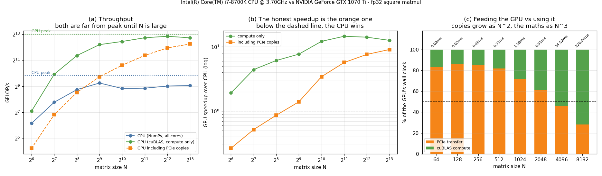

# GPU vs CPU Bake-off

---

> At 64×64 the GPU is four times *slower* than the CPU. At 8192×8192 it is nine times faster. Same GPU, same CPU, same operation.

---

## Key Insight

Comparing [matrix multiplication](/shared/glossary/#matmul) on a [CPU](/shared/glossary/#cpu) with [NumPy](/shared/glossary/#numpy) against a [GPU](/shared/glossary/#gpu) with [cuBLAS](/shared/glossary/#cublas) shows the trade-off between [latency](/shared/glossary/#latency) and [throughput](/shared/glossary/#throughput) as a single measured crossover point. The GPU's advantage on paper is **9.1×**; on compute alone it delivers up to **14.6×**; and once the [PCIe](/shared/glossary/#pcie) transfer is included it ranges from **0.26× to 9.09×** depending only on the size of the problem.

## Why This Matters

"Is the GPU faster?" is not a question with a number for an answer. This project produces the shape of the answer — a crossover size, a transfer share, and an efficiency percentage — which is the form you need when deciding whether to move any particular workload to an accelerator.

---

**This is project 5.**

### The words first

- **[Latency](/shared/glossary/#latency)** is how long one job takes. **[Throughput](/shared/glossary/#throughput)**
  is how many jobs finish per second. A CPU is built for the first, a GPU for the second.
- **[GEMM](/shared/glossary/#gemm)** = **GE**neral **M**atrix **M**ultiply, the standard name
  for `C = A × B`. **SGEMM** is the single-precision (float32) version — the `S` is the
  same letter used in old Fortran [BLAS](/shared/glossary/#blas) names.
- **[cuBLAS](/shared/glossary/#cublas)** is NVIDIA's BLAS implementation. NumPy's `@` calls a
  CPU BLAS (OpenBLAS here) that is just as carefully tuned.
- **H2D / D2H** = host-to-device / device-to-host: copying over
  [PCIe](/shared/glossary/#pcie) into or out of GPU memory.
- **% of peak** = achieved FLOP/s ÷ theoretical peak FLOP/s. It is the score that makes
  two very different chips comparable.

### The two peaks, computed rather than quoted

```
CPU:  6 cores × 8 lanes × 2 (multiply+add) × 2 FMA ports × 4.7 GHz  =  0.90 TFLOP/s
GPU:  19 SMs × 128 cores × 2 (multiply+add)          × 1.683 GHz   =  8.19 TFLOP/s

paper ratio = 9.07×
```

Both formulas contain the same **× 2** for the
[fused multiply-add](/shared/glossary/#fma-fused-multiply-add), which is the operation matmul
is made of. (Honest caveat: 4.7 GHz is the i7-8700K's *single-core* turbo. With six cores
busy it clocks lower, so the CPU peak above is a few percent optimistic and the CPU's
efficiency scores below are correspondingly pessimistic.)

Note what these chips are: a **GTX 1070 Ti** from 2017 with no
[Tensor Cores](/shared/glossary/#tensor-core), against a 6-core desktop CPU from 2017. A 9×
paper gap is *modest* by modern standards — an H100 against the same CPU is roughly 1,000×
on paper. Everything below therefore *understates* the modern picture, which makes the
places where the CPU still wins more interesting, not less.

---

## Running it

```bash
python run.py        # ~60 s: NumPy sweep, then compiles gemm.cu and runs the GPU sweep
```

Both sides use pinned host memory and best-of-5-rounds timing. The GPU side is CUDA C++
because this card's `sm_61` architecture is no longer supported by current PyTorch builds
— the system `nvcc` (CUDA 12.0) still supports it.

> **About the numbers.** All figures come from the committed
> [`outputs/findings.json`](outputs/findings.json). Timings move a few percent between
> runs; the shape of the curves does not.



---

## 1. The full table

| N | CPU ms | CPU GFLOP/s | GPU ms | GPU GFLOP/s | GPU % of peak | GPU+copies ms | Speedup (compute) | Speedup (honest) |
|---:|---:|---:|---:|---:|---:|---:|---:|---:|
| 64 | 0.0073 | 71.6 | 0.0038 | 137.5 | 1.7% | 0.028 | 1.92× | **0.26×** |
| 128 | 0.0191 | 219.5 | 0.0043 | 971.1 | 11.9% | 0.037 | 4.42× | 0.52× |
| 256 | 0.0781 | 429.4 | 0.0127 | 2,631.8 | 32.1% | 0.091 | 6.13× | 0.86× |
| 512 | 0.440 | 610.6 | 0.057 | 4,705.7 | 57.5% | 0.315 | 7.71× | **1.40×** |
| 1,024 | 4.702 | 456.7 | 0.386 | 5,567.7 | 68.0% | 1.369 | 12.19× | 3.43× |
| 2,048 | 37.02 | 464.1 | 2.533 | 6,782.3 | 82.9% | 6.484 | 14.61× | 5.71× |
| 4,096 | 264.8 | 519.0 | 18.72 | 7,341.8 | **89.7%** | 34.73 | 14.15× | 7.62× |
| 8,192 | 2,054 | 535.3 | 162.7 | 6,759.4 | 82.6% | 225.9 | 12.63× | **9.09×** |

Read the last two columns as two different honest answers to "how much faster is the GPU":
**up to 14.6× if the data is already there, and between 0.26× and 9.1× if it is not.**

---

## 2. The crossover, and why there are two of them

**On compute alone the GPU wins from the very first row** (1.92× at N=64). That is the
version of the comparison used in most marketing.

**Including both PCIe copies, the GPU does not win until N=512.** Below that, the CPU
finishes the entire job before the GPU has finished being handed its inputs. At N=64 the
GPU is **3.8× slower**.

The mechanism is visible in the last column of this table:

| N | Transfer ms | Compute ms | Transfer's share of GPU wall clock |
|---:|---:|---:|---:|
| 64 | 0.019 | 0.0038 | **83.0%** |
| 256 | 0.072 | 0.013 | 84.9% |
| 1,024 | 0.997 | 0.386 | 72.1% |
| 2,048 | 3.98 | 2.53 | 61.1% |
| 4,096 | 15.8 | 18.7 | **45.8%** |
| 8,192 | 63.4 | 162.7 | 28.0% |

**Transfer stops being the majority of the work only at N = 4,096.** Below that, this GPU
spends more time being fed than computing.

That crossover is predictable from two numbers, without running anything. Transfers grow
as N² (three matrices of N² floats) and the multiply grows as N³:

```
transfer time = 12·N² bytes / 12.6 GB/s        (three N×N fp32 matrices over PCIe)
compute time  =  2·N³ FLOPs / 6.8 TFLOP/s

equal when N = 12 × 6.8e12 / (2 × 12.6e9)  =  3,192
```

Predicted 3,192; measured between 2,048 (61%) and 4,096 (46%). The estimate lands inside
the measured bracket.

**This is the single most useful thing in the project.** Any time you consider offloading
something to a GPU, you can do that division in your head. If the arithmetic is not at
least cubic-ish in the data you have to ship, the cable eats the win. It is also why real
frameworks work so hard to keep tensors resident on the device across many operations —
a chain of ten GPU operations pays the PCIe cost once, not ten times.

---

## 3. Two chips, two very different efficiency curves

**The GPU starts terribly and improves.** 1.7% of peak at N=64, 89.7% at N=4,096. A
64×64 matmul is 524 kFLOP of work spread over 2,432 CUDA cores — most of the machine has
nothing to do, and what work exists is dominated by the ~5 µs of launching a
[kernel](/shared/glossary/#kernel) at all. The GPU is not "slow at small problems"; it is
*empty* at small problems.

**The CPU starts well and stays flat**, between 71 and 610 GFLOP/s, reaching **59% of its
peak** at the largest size. Six cores are easy to fill.

There is one non-monotonic detail worth catching. The CPU peaks at **610 GFLOP/s at
N=512** and then *drops* to 457 at N=1,024. Three 512² fp32 matrices are 3.1 MB and fit in
this chip's 12 MB L3 cache; three 1024² matrices are 12.6 MB and do not. That is the same
cache cliff [project 3](../03-bandwidth-measurement/README.md) found on the GPU's L2, on
the other side of the PCIe cable, and it is why blocked/tiled matmul exists on both.

The GPU's own dip at N=8,192 (89.7% → 82.6%) is the same story one level up: three 8192²
matrices are 768 MB, far past the 2 MB L2, so more of the traffic reaches GDDR.

---

## 4. Why the measured speedup beats the paper ratio

The paper ratio is 9.07×. The measured compute speedup peaks at **14.61×**.

The GPU did not exceed its own peak — it reached 82.9% of it while the CPU reached only
51% of its own at that size. **The GPU is easier to saturate on this workload than the
CPU is.** Whenever you see a benchmark where an accelerator beats its theoretical
advantage, this is usually why: the comparison is not peak-vs-peak, it is
achieved-vs-achieved, and the two chips are not equally easy to fill.

The reverse also happens, and it is the same effect: at N=64 the GPU reached 1.7% of peak
while the CPU reached 8%, so the GPU's 9× paper advantage collapsed to 1.9×.

---

## 5. Latency versus throughput, in two lines

```
One    64×64 matmul: CPU     7.3 µs   GPU    27.6 µs (with copies)  -> CPU wins 3.8×
One 8192×8192 matmul: CPU  2,054 ms   GPU     226 ms (with copies)  -> GPU wins 9.1×
```

This is the [SIMT](/shared/glossary/#simt)-versus-latency-optimised distinction from the
phase's concept list, reduced to two measurements. The CPU has deep pipelines, large
caches, branch prediction and out-of-order execution, all of which exist to finish *one*
chain of work quickly. The GPU has thousands of simple cores and a scheduler that hides
memory stalls by switching between them, which does nothing for one small job and
everything for a large one.

Neither chip is better. They are optimised for different questions, and the crossover in
section 2 is where the question changes.

**The practical corollary for machine learning:** this is exactly why serving a model to
one user at a time is so inefficient. A single-token [decode](/shared/glossary/#decode) step
is the N=64 row — a tiny amount of arithmetic on a machine sized for the N=8192 row. The
industry's answer is [batching](/shared/glossary/#batching): make the matrices bigger so the
GPU has something to fill itself with. Phase 8 of this guide is largely about that.

---

## What to take away

1. **There is no single speedup number.** Compute-only: 1.9× to 14.6×. Including
   transfers: 0.26× to 9.1×. Always ask which one is being quoted.
2. **The honest crossover was N=512 here**, and it is set by the PCIe cable, not by
   the GPU.
3. **Transfers are N², arithmetic is N³.** The predicted balance point (N=3,192) matched
   the measurement. You can do this division before writing any code.
4. **The GPU needs to be full to be fast**: 1.7% of peak at N=64, 89.7% at N=4,096. Small
   problems do not make the GPU slow, they make it idle.
5. **A cache cliff exists on both sides** — CPU L3 at N=512, GPU L2 much earlier — and
   tiling is the answer on both.

## Files

| File | What it is |
|---|---|
| [`gemm.cu`](gemm.cu) | cuBLAS SGEMM timed three ways: compute, transfers, whole job |
| [`run.py`](run.py) | NumPy sweep, GPU sweep, crossover analysis, plots |
| [`outputs/findings.json`](outputs/findings.json) | peaks, crossovers and every row |
| [`outputs/findings.csv`](outputs/findings.csv) | the full table above |
| [`outputs/bake_off.png`](outputs/bake_off.png) | the three panels shown above |

## Next

Phase 1 ends here. You can now count a model's FLOPs from its shapes
([project 1](../01-hand-counted-flops/README.md)), decide whether an operation is
memory- or compute-bound ([project 2](../02-roofline-by-hand/README.md)), measure what
your memory system really delivers ([project 3](../03-bandwidth-measurement/README.md)),
see where parallel lanes stop paying ([project 4](../04-avx-512-study/README.md)), and
size a workload against a GPU before renting one.

[Phase 2](../../README.md#phase-2-gpu-architecture-inside-out) opens the GPU up and asks
*why* it behaves this way: [SMs](/shared/glossary/#sm), [warps](/shared/glossary/#warp),
[Tensor Cores](/shared/glossary/#tensor-core) and [occupancy](/shared/glossary/#occupancy).
