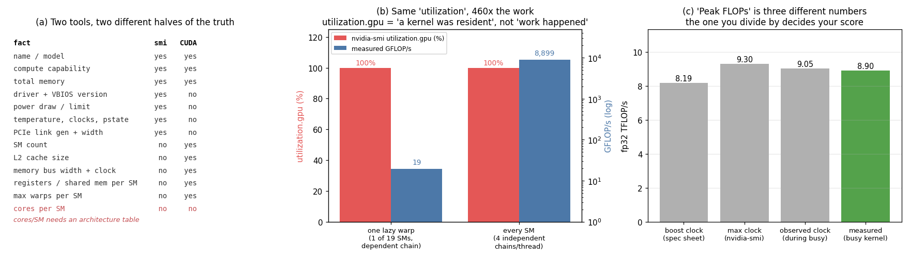

# nvidia-smi Deep Dive

---

> Two kernels. One did 460 times more arithmetic than the other. `nvidia-smi` reported both at **100% utilization**.

---

## Key Insight

`nvidia-smi` is a *management* tool, not an architecture tool. It knows the driver
version, the temperature, the power draw and the [PCIe](/shared/glossary/#pcie) link
state — and it does **not** know how many [SMs](/shared/glossary/#sm) your
[GPU](/shared/glossary/#gpu) has, how big its [L2 cache](/shared/glossary/#l2-cache) is,
or how wide its memory bus is. Those come from the CUDA runtime. And one crucial number
— **CUDA cores per SM** — is published by neither, so you cannot compute your GPU's peak
[FLOPs](/shared/glossary/#flops) from either tool alone.

## Why This Matters

Every performance claim you will ever make is a fraction: *achieved / peak*. If you
cannot assemble the denominator correctly you cannot say whether your kernel is good.
This project builds that denominator from scratch, and then shows that even "peak"
turns out to be three different numbers depending on which clock you use.

---

**This is project 6.**

### The words first

- **[nvidia-smi](/shared/glossary/#nvidia-smi)** — "NVIDIA **S**ystem **M**anagement
  **I**nterface". It talks to the *driver*, the piece of software that owns the GPU on
  behalf of the operating system. Its job is administration: who is using the card, how
  hot is it, is it about to throttle.
- **`cudaGetDeviceProperties`** — a function in the CUDA *runtime*, the library your
  program links against. Its job is to tell a program what the hardware can do, so the
  program can size itself accordingly.
- **[Compute capability](/shared/glossary/#compute-capability)** — NVIDIA's version
  number for GPU *features*, written like `6.1` or `9.0`. It is not a speed rating; it
  says which instructions and data types exist. `6.1` = Pascal, `7.0` = Volta,
  `8.0` = Ampere, `9.0` = Hopper, `10.0` = Blackwell.
- **[SM](/shared/glossary/#sm)** — Streaming Multiprocessor, the GPU's actual core. All
  the [CUDA cores](/shared/glossary/#cuda-core), [registers](/shared/glossary/#registers)
  and [shared memory](/shared/glossary/#shared-memory) live inside one.
- **[Boost clock](/shared/glossary/#boost-clock)** — the highest speed the GPU will run
  at when power and heat allow, as opposed to the base clock it always guarantees.
- **[TDP](/shared/glossary/#tdp)** — Thermal Design Power: the sustained heat, in watts,
  the cooler must remove. It is the ceiling that pulls the boost clock back down.

### Why two tools, when one of them already prints the GPU's name?

A fair question — `nvidia-smi` opens with a big table containing the model, the memory
size and the utilization, so it looks complete. It is not, and the reason is worth
understanding rather than memorising.

The two tools sit on different sides of a boundary. `nvidia-smi` reports **the state of
a device on this machine right now**: which driver is loaded, what the fans are doing,
which processes have memory allocated. Those facts change second to second and are
identical in kind for every GPU ever made, so the tool is generic.
`cudaGetDeviceProperties` reports **the architecture of the chip**: 19 SMs, a 2 MB L2, a
256-bit memory bus, 65,536 registers per SM. Those never change, and there is one such
answer per GPU model.

The gap this creates is concrete. You cannot compute peak FLOPs without the SM count
(CUDA runtime only). You cannot compute [memory bandwidth](/shared/glossary/#memory-bandwidth)
without the bus width (CUDA runtime only). You cannot tell whether the card is
thermally throttling without the clock and power (nvidia-smi only). Ask each tool the
question it is built for.

And there is a third source: **cores per SM is in neither**. It is a property of the
architecture generation, and you look it up from the compute capability in a table —
the same table that lives inside NVIDIA's own `helper_cuda.h` sample header. Pascal
GP10x has 128, Volta and Ampere GA100 have 64, Ada and Hopper have 128. Get this wrong
and every efficiency number you compute afterwards is wrong by 2x.

---

## Running it

```bash
python run.py        # ~10 s: reads both tools, then runs two 4-second load kernels
```

Hardware here: **GTX 1070 Ti**, compute capability 6.1, 19 SMs, 8 GB
[GDDR](/shared/glossary/#gddr)5, on PCIe 3.0 x16.

> **About the numbers.** Everything below comes from the committed
> [`outputs/findings.json`](outputs/findings.json). Clocks and power move a little
> between runs; the ratios do not.



---

## 1. Splitting the facts by source

| Fact | `nvidia-smi` | CUDA runtime |
|---|---|---|
| model name, compute capability, total memory | yes | yes |
| driver version, VBIOS version | **yes** | no |
| power draw and limit, temperature, performance state | **yes** | no |
| current and maximum clocks | **yes** | no |
| PCIe link generation and width | **yes** | no |
| `utilization.gpu`, `utilization.memory` | **yes** | no |
| SM count | no | **yes** |
| L2 cache size | no | **yes** |
| memory bus width and memory clock | no | **yes** |
| registers and shared memory per SM | no | **yes** |
| max threads / max warps per SM | no | **yes** |
| async copy engines, concurrent-kernel support | no | **yes** |
| **CUDA cores per SM** | **no** | **no** |

Two small surprises in the raw output worth pausing on:

**Total memory disagrees with itself.** `nvidia-smi` says 8192 MiB (8.59 GB);
`cudaGetDeviceProperties` says 8,500,871,168 bytes (8.50 GB). The difference is memory
the driver has reserved for itself. The CUDA number is the one your program can
actually allocate from, so it is the one to plan against.

**The PCIe link reports generation 1 of 3.** The card is a Gen3 x16 device sitting in a
Gen3 x16 slot, but while idle the link drops to Gen1 to save power and negotiates back
up under load. If you sample `pcie.link.gen.current` on an idle machine and conclude
your slot is misconfigured, you have measured a power-saving feature.

---

## 2. Building "peak" from parts

```
peak fp32 FLOP/s = SMs x cores per SM x 2 x clock

                 = 19 x 128 x 2 x 1.683 GHz
                 = 8.19 TFLOP/s
```

The `2` is FLOPs per [fused multiply-add](/shared/glossary/#fma-fused-multiply-add): one
FMA instruction does a multiply *and* an add, and the convention counts both. That is
the whole formula — every headline TFLOPs figure NVIDIA prints is this product.

```
memory bandwidth = memory clock x 2 x bus width / 8

                 = 4.004 GHz x 2 x 256 bits / 8
                 = 256.3 GB/s
```

The `2` here is different: it is the **double data rate** in GDDR — data moves on both
the rising and the falling edge of each clock tick.

```
ridge point = 8.19 TFLOP/s / 256.3 GB/s = 31.9 FLOP per byte
```

The [ridge point](/shared/glossary/#ridge-point) is the [arithmetic
intensity](/shared/glossary/#ai-arithmetic-intensity) at which the GPU stops being
starved for data and starts being limited by arithmetic. Below it, only moving fewer
bytes will help; above it, only doing fewer FLOPs will. On this 2017 consumer card it is
32 FLOP/byte. On an H100 it is 295. [Project 10](../10-spec-compare/README.md) walks
that number forward through eight GPUs.

---

## 3. Topology, on a machine with one GPU

```
        GPU0    CPU Affinity    NUMA Affinity   GPU NUMA ID
GPU0     X      0-11            0               N/A
```

`nvidia-smi topo -m` prints a matrix of how every pair of GPUs is connected. With one
GPU there is no pair, so the whole answer is `X` ("this is me"). `nvidia-smi nvlink -s`
prints nothing at all, because consumer Pascal has no [NVLink](/shared/glossary/#nvlink).

That is not a wasted exercise — the legend is the part worth learning, because on a real
multi-GPU box this matrix decides your training throughput:

| Symbol | What the traffic crosses | Roughly |
|---|---|---|
| `NV#` | a bonded set of # NVLinks | 25–50 GB/s per link, the best case |
| `PIX` | one PCIe bridge | full PCIe speed, GPUs are neighbours |
| `PXB` | several PCIe bridges | still below the CPU |
| `PHB` | the PCIe host bridge (i.e. through the CPU) | slower, CPU is in the path |
| `NODE` | bridges within one NUMA node | slower again |
| `SYS` | the CPU-to-CPU interconnect between sockets | worst case in a node |

The ordering `NV# > PIX > PXB > PHB > NODE > SYS` is the whole point. NCCL reads this
same topology and picks its collective algorithm from it, which is why "the same 8-GPU
job is 2x faster on box A than box B" is usually answered by this one command. The two
useful columns are still meaningful with one GPU: **CPU affinity `0-11`** tells you which
CPU cores are electrically closest to the card, so pinning your data-loader threads there
avoids a needless hop across the memory interconnect.

---

## 4. The result: `utilization.gpu` does not measure work

Two kernels, both run for about 4 seconds while `nvidia-smi` was polled 20 times a
second:

- **lazy** — *one* [warp](/shared/glossary/#warp) (32 threads) on *one* of the 19 SMs,
  running a single dependent FMA chain. Every multiply-add must wait for the previous
  one, so even that one warp is mostly idle.
- **busy** — every SM filled, four independent FMA chains per thread so the arithmetic
  pipeline never stalls.

| | `utilization.gpu` | SM clock | power | temp | measured GFLOP/s | % of 8.19 TFLOP/s peak |
|---|---:|---:|---:|---:|---:|---:|
| lazy | **100.0%** | 1873 MHz | 41.7 W | 53 °C | **19.3** | 0.2% |
| busy | **100.0%** | 1860 MHz | 122.8 W | 60 °C | **8,899** | 108.7% |

**Identical utilization. 460x the arithmetic.**

This is not a bug. NVIDIA's documentation defines `utilization.gpu` as *the percentage
of the sample period during which at least one kernel was executing*. It is a duty-cycle
measurement, not a work measurement. A single thread doing nothing keeps the counter
pinned at 100% just as effectively as 38,912 threads doing everything.

**What to watch instead:** power. 41.7 W versus 122.8 W — a **2.9x gap** that lines up with
reality, because arithmetic burns watts and idling does not. Power is the cheapest
honest signal you have from outside the process. (It is not proportional to useful work
either — a memory-bound kernel burns power in the memory controller — but it will never
tell you a dead kernel is busy.)

**The practical consequence.** "My GPU shows 100% utilization so it must be the
bottleneck" is one of the most common wrong diagnoses in ML engineering. The number is
compatible with a training loop stalled on a Python data loader, a kernel with 3%
[occupancy](/shared/glossary/#occupancy), and a perfectly tuned matmul. To distinguish
them you need achieved FLOP/s or GB/s — which means measuring, which is what
[project 7](../07-tensor-core-utilization/README.md) does.

---

## 5. "Peak FLOPs" is three numbers, and you get to choose your own grade

Both loads above were timed with the same GPU, on the same day. The card reports:

| Where the clock came from | Clock | Implied peak | `busy` scores |
|---|---:|---:|---:|
| `cudaGetDeviceProperties.clockRate` (the spec-sheet boost clock) | 1683 MHz | 8.19 TFLOP/s | **108.7%** |
| `nvidia-smi --query-gpu=clocks.max.sm` | 1911 MHz | 9.30 TFLOP/s | 95.7% |
| measured during the run itself | 1860 MHz | 9.05 TFLOP/s | 98.4% |

A benchmark reporting "108.6% of peak" is obviously reporting against the wrong peak —
you cannot exceed the speed of light. The spec-sheet boost clock is a *guarantee*, not a
limit: NVIDIA's GPU Boost pushes past it whenever power and temperature allow, and this
card idles cool enough to do so.

**The rule that follows:** state which clock your peak used, and prefer the clock you
observed *during the measurement*. It is the only one the hardware actually agreed to.
Every "we reach 92% of peak" claim in a paper is silently making this choice, and the
range here is 13 percentage points wide.

---

## What to take away

1. **Neither tool knows everything, and neither knows cores per SM.** Peak FLOPs needs
   three sources: nvidia-smi, the CUDA runtime, and a compute-capability table.
2. **`utilization.gpu` means "a kernel was resident", not "work happened."** Two kernels
   460x apart in real throughput both read 100%.
3. **Power draw is the honest cheap signal** — 41 W versus 123 W on those same two
   kernels.
4. **"Peak" is three different numbers** (8.19 / 9.30 / 9.05 TFLOP/s) depending on which
   clock you multiply by. Always say which.
5. **Compute the ridge point once and keep it.** 31.9 FLOP/byte for this card is the
   number that decides whether any future kernel is worth optimising for FLOPs or for
   bytes.
6. **`nvidia-smi topo -m` is a multi-GPU tool worth learning before you have multi-GPU**,
   because its `NV# > PIX > PXB > PHB > NODE > SYS` ordering is what NCCL routes on.

## Files

| File | What it is |
|---|---|
| [`devprops.cu`](devprops.cu) | prints every `cudaDeviceProp` field; also holds the two load kernels |
| [`run.py`](run.py) | queries nvidia-smi, diffs the two sources, samples during load, plots |
| [`outputs/findings.json`](outputs/findings.json) | every raw field from both tools plus the derived numbers |
| [`outputs/topology.txt`](outputs/topology.txt) | `nvidia-smi topo -m` as captured |
| [`outputs/gpu-facts.png`](outputs/gpu-facts.png) | the three panels above |

## Next

[Project 7 — Tensor core utilization](../07-tensor-core-utilization/README.md) takes the
peak number built here and asks what fraction of it a real matmul reaches — and what a
dedicated matrix instruction is worth when you finally get one.
