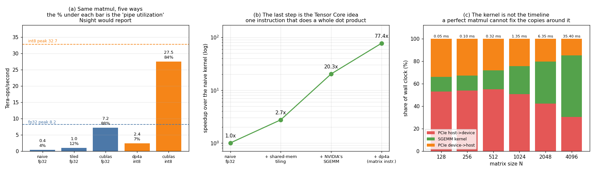

# Tensor Core Utilization

---

> This GPU has no Tensor Cores. It still shows you exactly what they do — because Pascal shipped a four-element version of the same idea, and it is worth **3.8x**.

---

## Key Insight

"Tensor core utilization" is a fraction: *arithmetic actually delivered ÷ arithmetic the
hardware could deliver*. That is all Nsight's `pct_of_peak_sustained` counters report,
and you can compute it yourself with two timers. Doing so here gives an uncomfortable
answer: a hand-written tiled [matmul](/shared/glossary/#matmul) reached **11.9%** of this
GPU's fp32 peak while [cuBLAS](/shared/glossary/#cublas) reached **88.1%** — a 7.4x gap
using *the same instructions*. Switching to the hardware's dedicated matrix instruction
then bought another **3.8x** on top. Having the fast instruction is worth much less than
knowing how to feed it.

## Why This Matters

Every "Tensor Cores are 10x faster" claim you read is really two claims stacked: the
instruction is wider, *and* someone wrote a kernel good enough to keep it fed. This
project separates them and puts a number on each.

---

**This is project 7.**

### The words first

- **[Tensor Core](/shared/glossary/#tensor-core)** — a hardware unit that multiplies two
  small matrices and adds a third, in one instruction. Introduced in
  [Volta](/shared/glossary/#volta) ([compute capability](/shared/glossary/#compute-capability)
  7.0, 2017).
- **[FMA](/shared/glossary/#fma-fused-multiply-add)** — fused multiply-add, `a*b + c` in
  one instruction. The ordinary [CUDA core](/shared/glossary/#cuda-core)'s unit of work:
  2 FLOPs.
- **[DP4A](/shared/glossary/#dp4a)** — "**D**ot **P**roduct of **4** **A**-type
  elements". One instruction that multiplies four pairs of 8-bit integers and sums all
  four products into a 32-bit accumulator: **8 operations** where an FMA does 2.
  Introduced in Pascal, compute capability 6.1 — the generation immediately before
  Tensor Cores.
- **[WMMA](/shared/glossary/#wmma)** — "**W**arp **M**atrix **M**ultiply-**A**ccumulate",
  the CUDA C++ interface to Tensor Cores. The name states the unit of work: a whole
  [warp](/shared/glossary/#warp) cooperates on one small matrix multiply, accumulated
  into an existing tile.
- **[SASS](/shared/glossary/#sass)** — the real machine code an NVIDIA GPU executes
  ("Shader ASembly"). Read it with `cuobjdump -sass`. It is the only place you can
  confirm which instructions the compiler actually emitted.
- **Pipe utilization** — achieved ops/sec ÷ peak ops/sec. The number this project is about.

### Why measure a "tensor core" project on a GPU with no tensor cores?

Because the interesting question is not "does my card have the feature" but "what is a
matrix instruction actually worth, and what does it cost you to use one". Both are
answerable here, and answerable *more cleanly* than on a modern card, because Pascal
gives you a small, legible version of the same mechanism.

DP4A is not a metaphor for Tensor Cores. It is the same architectural move, one
generation earlier and four times narrower: replace many narrow multiply-accumulates
with one wide instruction that does a whole little dot product. A Tensor Core takes the
same step much further — a 16x16 tile instead of a 4-element row — which is why it is
worth a bigger multiple. Everything you learn here about layout constraints, about
libraries beating hand-written code, and about the difference between having an
instruction and using it well, transfers directly.

The project also does the thing the guide asks for and reports honestly what happens:
it runs `ncu` and `nsys`, and prints their failure messages.

---

## Running it

```bash
python run.py        # ~8 s: compiles bench.cu, probes the profilers, benchmarks, plots
```

Hardware: **GTX 1070 Ti**, compute capability 6.1, 19 [SMs](/shared/glossary/#sm) at
1683 MHz.

```
peak fp32 = 2432 cores x 2 FLOP x 1.683 GHz =  8.19 TFLOP/s
peak int8 = 2432 cores x 8 OP   x 1.683 GHz = 32.74 TOP/s     (dp4a = 4 MACs)
```

> **About the numbers.** All figures come from the committed
> [`outputs/findings.json`](outputs/findings.json). Timings are best-of-5 at N=2048 and
> move about 1% between runs.



---

## 1. The compile-time gate

Before measuring anything, [`wmma_probe.cu`](wmma_probe.cu) — the smallest possible
Tensor Core program — is compiled twice:

```
nvcc -arch=sm_61  ->  FAILS: error: name must be a namespace name
nvcc -arch=sm_70  ->  compiles
```

The failure is not "unsupported instruction at runtime". It is a **parse error**. Below
compute capability 7.0, `mma.h` defines nothing at all, so the `nvcuda` namespace that
`using namespace nvcuda;` refers to does not exist.

That has a design consequence worth stating plainly: you cannot write a runtime
capability check around WMMA and fall back gracefully. The code does not compile, so it
cannot be in the same translation unit as your fallback. Real libraries solve this by
compiling separate object files per architecture and selecting at load time — which is
exactly what `nvcc -gencode arch=...,code=...` repeated several times is for.

---

## 2. What happened when we ran the profilers

The guide asks for `nsys` and `ncu`. Both are installed. Neither works here:

```
ncu : ==ERROR== ERR_NVGPUCTRPERM - The user does not have permission to access
      NVIDIA GPU Performance Counters on the target device 0.
nsys: Importer error status: The importer binary and its dependencies were not found.
```

**`ncu`'s problem is a security setting, not a bug.** Since 2019 the NVIDIA driver
restricts hardware performance counters to root by default, because the counters can
leak information between processes sharing a GPU. Fixing it means writing
`options nvidia NVreg_RestrictProfilingToAdminUsers=0` into
`/etc/modprobe.d/`, rebuilding the initramfs and rebooting — a root action on a shared
machine, so this project does not do it. On your own machine, do.

**`nsys`'s problem is a broken install** — the packaged binary is missing the helper
that converts a raw capture into a report.

Rather than skip the measurement, everything below computes the same quantity directly.
When Nsight reports `sm__pipe_tensor_cycles_active.avg.pct_of_peak_sustained_active`, it
is reporting *cycles the tensor pipe was busy ÷ cycles it could have been busy*. With a
CUDA-event timer and a known peak, `achieved ÷ peak` is the same ratio, obtained from
the outside. The profiler's advantage is that it can attribute the number to individual
instructions inside one kernel; for a whole-kernel figure, arithmetic is enough.

---

## 3. Five matmuls, one shape (N = 2048, 17.2 G ops each)

| Kernel | ms | Tera-ops/s | against peak | **pipe utilization** | what it uses |
|---|---:|---:|---:|---:|---|
| `naive_fp32` | 48.4 | 0.36 | 8.19 | **4.3%** | FMA, every operand from global memory |
| `tiled_fp32` | 17.7 | 0.97 | 8.19 | **11.9%** | FMA, operands staged in [shared memory](/shared/glossary/#shared-memory) |
| `cublas_fp32` | 2.38 | 7.21 | 8.19 | **88.1%** | FMA, NVIDIA's own SGEMM |
| `dp4a_int8` (ours) | 7.05 | 2.44 | 32.74 | **7.4%** | DP4A, our tiled kernel |
| `cublas_int8` | **0.63** | **27.5** | 32.74 | **83.9%** | DP4A, NVIDIA's own IGEMM |

Verification, so none of this rests on a broken kernel: the DP4A result matched a CPU
reference exactly (**0 mismatches**), and both fp32 variants matched the naive kernel
**bit for bit** (max absolute difference 0.000e+00).

Four separate lessons live in that table.

### 3.1 Tiling is worth 2.7x — and that is the *small* win

Moving operands into shared memory before the inner loop takes the naive kernel from
4.3% to 11.9% of peak. It is the first optimisation every CUDA course teaches, it is
real, and it gets you about an eighth of the way to the library.

### 3.2 cuBLAS beats our best fp32 kernel by 7.4x using *the same instructions*

Both kernels issue `FFMA`. There is no secret hardware here. The 7.4x is register-level
blocking (each thread computing a small tile of outputs rather than one), double
buffering, vectorised loads, and an inner loop scheduled to hide every latency.

Compare this with [project 3](../03-bandwidth-measurement/README.md), where a four-line
copy kernel **beat `cudaMemcpy` by 1.3%**. Straight-line data movement has nothing to
optimise; a matmul has an enormous amount. That contrast is the actual guidance: write
your own kernel when the operation has no structure to exploit or when you are fusing
something the library cannot see, and call the library when the operation is a GEMM.

### 3.3 The matrix instruction is worth 3.8x — this is the Tensor Core effect

`cublas_int8` at 27.5 Tera-ops/s versus `cublas_fp32` at 7.21 TFLOP/s. Both are
NVIDIA's own code, both saturating the machine (84% and 88% of their respective peaks).
The entire difference is that one issues `IDP.4A` and the other issues `FFMA`.

That is the whole Tensor Core argument in one row: **at equal engineering quality, a
wider instruction is worth its width.** An H100's Tensor Core is ~30x an FMA rather than
4x, which is where the "Tensor Cores are 10-20x faster" figures come from.

The SASS confirms the instruction is really there, rather than the compiler having
quietly rewritten it:

```
cuobjdump -sass outputs/bench   ->   24 IDP.4A.S8.S8 instructions, 61 FFMA
```

`IDP.4A.S8.S8` reads as *Integer Dot Product, 4 elements, Signed 8-bit by Signed 8-bit*.

### 3.4 The honest inversion: our DP4A kernel is **11.3x slower than cuBLAS's**

Our hand-written DP4A kernel reaches 7.4% of the int8 peak. cuBLAS reaches 83.9%.

Read those two rows together and the headline of the project falls out: **switching to
the fast instruction bought us 2.6x; being bad at using it cost us 11.3x.** A team that
ports a kernel to Tensor Cores and reports "2x faster!" may well have left 10x on the
floor — the instruction change is the easy part.

There is also a hidden cost in that row that the ops-count cannot show. DP4A reads its
four operands as a single 32-bit word, so all four `k` values must be *adjacent in
memory for both matrices*. Our kernel therefore takes `B` pre-transposed. Every matrix
instruction imposes a layout like this, Tensor Cores included, and satisfying it may
mean an extra pass over your data that the FLOP count never mentions.

---

## 4. The kernel is not the timeline

Even a perfect matmul only helps with the part of the wall clock it occupies. Timing the
[PCIe](/shared/glossary/#pcie) copies around a cuBLAS SGEMM:

| N | copy in | compute | copy out | total | **compute's share** |
|---:|---:|---:|---:|---:|---:|
| 128 | 0.026 ms | 0.007 ms | 0.017 ms | 0.050 ms | **13%** |
| 256 | 0.052 | 0.013 | 0.032 | 0.097 | 13% |
| 512 | 0.174 | 0.053 | 0.089 | 0.316 | 17% |
| 1024 | 0.686 | 0.336 | 0.332 | 1.354 | 25% |
| 2048 | 2.683 | 2.378 | 1.287 | 6.348 | 37% |
| 4096 | 10.73 | 19.40 | 5.28 | 35.40 | **55%** |

At N = 128, a kernel running at 100% pipe utilization would improve the wall clock by
**13%**. The reason is [Amdahl's law](/shared/glossary/#amdahls-law) — your speedup is
capped by the fraction you sped up — and the reason the fraction is small is arithmetic:
copying grows as N², computing grows as N³, so compute only takes over once N is large.

This is the question `nsys` exists to answer, and it is the one to ask *first*. Reaching
for `ncu` to micro-optimise a kernel that is 16% of your runtime is the most common
misuse of a profiler. Look at the timeline, find the biggest bar, then zoom in.

---

## What to take away

1. **Pipe utilization = achieved ÷ peak.** You do not need a profiler to compute it, and
   computing it by hand forces you to know your peak, which is more than half the value.
2. **Tiling: 2.7x. cuBLAS over our tiled kernel: 7.4x. Same instructions both times.**
   Kernel quality dominates instruction choice on the fp32 path.
3. **The matrix instruction is worth 3.8x** at equal engineering quality (cuBLAS int8 vs
   cuBLAS fp32). That is the Tensor Core effect, measured on hardware that predates them.
4. **Our DP4A kernel was 11.3x off cuBLAS's.** Adopting a wide instruction and getting a
   2x is not a success story; it may be a 10x miss.
5. **Every matrix instruction dictates its operand layout.** DP4A needed `B`
   pre-transposed. The rearrangement cost never appears in a FLOP count.
6. **WMMA is a compile-time gate, not a runtime check.** Below cc 7.0 the header defines
   nothing, so a graceful in-source fallback is impossible.
7. **At N = 128 the matmul was 13% of the wall clock.** Profile the timeline before the
   kernel.

## Files

| File | What it is |
|---|---|
| [`bench.cu`](bench.cu) | the five matmuls, the correctness checks, the timeline sweep |
| [`wmma_probe.cu`](wmma_probe.cu) | the smallest Tensor Core kernel, used only to see it fail to compile |
| [`run.py`](run.py) | compiles, probes `ncu`/`nsys`, computes peaks and utilizations, reads SASS, plots |
| [`outputs/findings.json`](outputs/findings.json) | every timing, peak, ratio and profiler message |
| [`outputs/pipe-utilization.png`](outputs/pipe-utilization.png) | the three panels above |

## Next

[Project 8 — Occupancy study](../08-occupancy-study/README.md) asks why the naive kernel
was slow in the first place, and finds that the metric everyone reaches for —
occupancy — is right about a third of the time.
