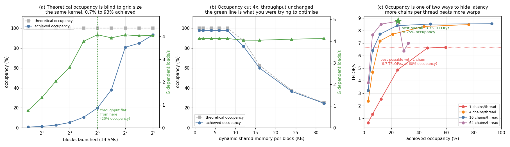

# Occupancy Study

---

> The fastest configuration in this project ran at **25% occupancy**. The kernel that pushes occupancy to the top with one operation in flight per thread was **24% slower**. Cutting occupancy 4x in a separate test changed throughput by **0.0%**.

---

## Key Insight

[Occupancy](/shared/glossary/#occupancy) — how many [warps](/shared/glossary/#warp) are
resident on an [SM](/shared/glossary/#sm) versus how many could be — is the most-quoted
and least-understood GPU metric. Four sweeps here show why. Block size moved throughput
by **1.008x** across a 32x range. Grid size, which the occupancy calculator cannot see
at all, moved it **5x**. Shared memory throttled occupancy 4x for **no** cost. And
giving each thread more independent work beat giving the SM more warps, decisively.

## Why This Matters

"Increase occupancy" is the first advice every GPU tutorial gives, and it is right only
while occupancy is the binding constraint — which, measured here, is up to about 20%
and no further. Knowing where that threshold sits for your kernel is the difference
between a real optimisation and a week spent shaving registers for nothing.

---

**This is project 8.**

### The words first

- **[Warp](/shared/glossary/#warp)** — 32 threads that execute in lockstep. The unit an
  SM actually schedules.
- **[Occupancy](/shared/glossary/#occupancy)** — resident warps ÷ the SM's maximum. This
  GPU holds up to **64 warps (2048 threads) per SM**, so 32 resident warps = 50%.
- **Theoretical occupancy** — an upper bound computable *before* the kernel runs, from
  three things only: [registers](/shared/glossary/#registers) per thread, shared memory
  per [block](/shared/glossary/#block), and block size.
  `cudaOccupancyMaxActiveBlocksPerMultiprocessor` returns it.
- **Achieved occupancy** — the time-average of what really happened. Lower whenever you
  did not launch enough blocks to fill the machine.
- **[Warp scheduler](/shared/glossary/#warp-scheduler)** — the hardware that picks which
  resident warp issues an instruction each clock. This is *why* occupancy matters.
- **[Latency hiding](/shared/glossary/#latency-hiding)** — the whole reason a GPU keeps
  many warps resident: it cannot make a memory access finish sooner, so it arranges to
  have something else to run meanwhile.
- **[Instruction-level parallelism (ILP)](/shared/glossary/#instruction-level-parallelism)**
  — how many *independent* operations one thread has in flight. The other way to hide the
  same latency.
- **[Pointer chasing](/shared/glossary/#pointer-chasing)** — a loop where each address is
  the value you just loaded (`p = next[p]`). The standard way to isolate memory latency.

### Why measure occupancy ourselves when Nsight reports it?

For the same reason as [project 7](../07-tensor-core-utilization/README.md): Nsight
Compute cannot read this machine's hardware counters (`ERR_NVGPUCTRPERM`, a root-only
kernel-module setting). But there is a better reason than necessity — writing the
measurement forces you to confront what "achieved occupancy" actually *means*, which is
a time integral, not a snapshot:

```
achieved = sum over blocks (warps in block x block's lifetime in cycles)
           / sum over SMs (SM busy cycles x max warps per SM)
```

Each block records the SM it landed on (via the `%smid` special register, reachable only
through inline [PTX](/shared/glossary/#ptx)) and how long it lived, then adds
`lifetime x warps` to that SM's total. This is the same definition Nsight uses. Where
our numbers land within 2–3% of the theoretical bound, that is the measurement
validating itself.

---

## Running it

```bash
python run.py        # ~3 s: compiles occ.cu, runs four sweeps, plots
```

Hardware: **GTX 1070 Ti**, 19 SMs, max 64 warps (2048 threads) per SM, 64K registers per
SM, 96 KB shared memory per SM (48 KB max per block).

Throughput in sweeps A–C is **billions of dependent random loads per second**. Each
thread walks a random cycle — `p = next[p]` — so no prefetcher and no cache can help,
and a thread can never have two of its own loads in flight. Only having more warps can.
That makes it the cleanest possible test of what occupancy is for.

> **About the numbers.** All figures come from the committed
> [`outputs/findings.json`](outputs/findings.json) and
> [`outputs/findings.csv`](outputs/findings.csv).



---

## A. Block size: a 32x range, worth 1.008x

| threads/block | theoretical | achieved | G loads/s |
|---:|---:|---:|---:|
| 32 | **50%** | 48.8% | **4.08** |
| 64 | 100% | 97.5% | 4.10 |
| 128 | 100% | 97.6% | 4.11 |
| 256 | 100% | 97.7% | 4.12 |
| 512 | 100% | 97.6% | 4.12 |
| 1024 | 100% | 98.1% | 4.11 |

Total spread: **0.8%**.

The 32-thread row is the interesting one. Its theoretical occupancy is capped at 50%
because this SM will host at most **32 blocks**, and 32 blocks x 1 warp = 32 of the
possible 64 warps. Half the occupancy — and **100% of the best throughput**. Thirty-two
warps were already more than enough to keep the memory system saturated; the next
thirty-two had nothing left to do.

(This matches [project 3](../03-bandwidth-measurement/README.md), where block size moved
a bandwidth-bound copy by 1.008x. Two very different kernels, same null result.)

---

## B. Grid size: the thing the calculator cannot see

Now hold block size at 256 — so theoretical occupancy is pinned at 100% and *cannot
move* — and vary only how many blocks are launched.

| blocks | blocks/SM | theoretical | achieved | G loads/s |
|---:|---:|---:|---:|---:|
| 1 | 0.05 | 100% | **0.7%** | **0.75** |
| 2 | 0.11 | 100% | 1.3% | 1.33 |
| 4 | 0.21 | 100% | 2.6% | 2.04 |
| 8 | 0.42 | 100% | 5.2% | 2.66 |
| 16 | 0.84 | 100% | 10.5% | 3.79 |
| 32 | 1.68 | 100% | **19.8%** | **4.08** |
| 64 | 3.37 | 100% | 38.1% | 3.94 |
| 128 | 6.74 | 100% | 80.8% | 4.08 |
| 256 | 13.47 | 100% | 84.8% | 4.04 |
| 512 | 26.95 | 100% | **93.2%** | 4.04 |

**Theoretical occupancy said 100% for every single row.** Achieved occupancy went from
0.7% to 93.2%, and throughput went 0.75 → 4.04 G loads/s, a **5.4x** range.

At one block, one SM out of 19 is doing anything and it holds 8 warps out of 64:
8/(64x19) = 0.7%. The calculator has no idea, because grid size is not one of its
inputs — it answers "how many blocks *could* fit on an SM", not "how many did you
supply".

**And then it stops mattering.** By 32 blocks (1.68 per SM, 19.8% achieved occupancy)
throughput is within 3% of the best it will ever reach. Everything from 20% to 93%
occupancy buys nothing.

That number — **the useful range of occupancy for this kernel ends at about 20%** — is
the single most useful thing in this project. It is not universal; a kernel with more
memory parallelism per thread saturates even earlier, one with less needs more. But
*there is always such a threshold*, and finding it takes one sweep.

**The practical rule:** if a profile shows achieved occupancy far below theoretical,
check your grid size before you touch a single register. And if a profile shows low
occupancy at all, first check whether this kernel cares.

---

## C. Shared memory: occupancy cut 4x, cost 0.0%

Same kernel again, same arithmetic, same block size. The only change is a block of
dynamic [shared memory](/shared/glossary/#shared-memory) that the kernel barely touches —
a pure occupancy throttle, because an SM has only 96 KB to hand out.

| KB/block | theoretical | achieved | blocks/SM | G loads/s |
|---:|---:|---:|---:|---:|
| 1 – 8 | 100% | 97.7% | 8 | 4.12 |
| 12 | 88% | 81.8% | 7 | 4.05 |
| 16 | 62% | 59.9% | 5 | 4.04 |
| 24 | 38% | 36.4% | 3 | 4.09 |
| 32 | **25%** | 24.5% | 2 | **4.12** |

Occupancy fell **4x**. Throughput changed by **0.0%**.

Notice how faithfully achieved tracks theoretical here (97.7 vs 100, 24.5 vs 25) — that
is the measurement working. Notice also that it does not move in a smooth curve but in
*steps*, because blocks are indivisible: at 12 KB exactly 7 fit in 96 KB, at 16 KB
exactly 5 (allowing for a little static overhead). Occupancy always changes in
staircases, which is why shaving one register can be worth nothing or worth 25%
depending on where you were standing.

The lesson is not "shared memory is free". It is that **the cost of an occupancy
reduction is zero until occupancy becomes the binding constraint**, and here it never
did — 16 warps was already plenty. On a kernel that needs 40 warps to saturate, the same
sweep would fall off a cliff.

---

## D. The result: more work per thread beats more threads

Now a compute-bound kernel and the second way to hide latency.

An [FMA](/shared/glossary/#fma-fused-multiply-add) takes about 6 cycles to produce its
result. If the next instruction needs that result, the core waits. So a core needs
roughly 6 independent FMAs in flight to stay busy — and those can come from **6
different warps** (occupancy) or from **6 independent chains inside one thread**
([ILP](/shared/glossary/#instruction-level-parallelism)):

```
1 chain  (ILP 1):   a = a*b+c;  a = a*b+c;  a = a*b+c;      // each waits for the last
4 chains (ILP 4):   a = a*b+c;  d = d*b+c;  e = e*b+c;  f = f*b+c;   // none wait
```

Sweeping both at once, in TFLOP/s (peak is 8.19):

| warps/SM requested | 1 chain | 4 chains | 16 chains | 64 chains |
|---:|---:|---:|---:|---:|
| 2 | 0.64 | 2.38 | 3.21 | 3.83 |
| 4 | 1.32 | 4.69 | 6.41 | 7.66 |
| 8 | 2.53 | 7.17 | 7.72 | 8.52 |
| 16 | 4.87 | 7.72 | 8.39 | **8.75** |
| 32 | 6.61 | 8.33 | 8.52 | 6.36 |
| 64 | **6.67** | 8.48 | **8.55** | 7.00 |
| *registers/thread* | *21* | *21* | *28* | *72* |
| *occupancy ceiling* | *100%* | *100%* | *100%* | *44%* |

Three findings, in increasing order of how much they should change your behaviour.

**One chain per thread never reaches peak, at any occupancy.** It plateaus at about 6.6
TFLOP/s (81%) from 32 warps onward and stays there. No amount of occupancy fixes a
thread that has nothing independent to do — the warps take turns being stalled.

**Sixty-four chains at 6.2% occupancy (7.66 TFLOP/s) beats one chain at 59.6% occupancy
(6.67 TFLOP/s).** A configuration with **9.6x less occupancy** was 15% *faster*.

**The best result in the entire table is at 24.9% achieved occupancy: 8.75 TFLOP/s.**
That is 107% of the 8.19 nominal peak, because the card boosts above its rated clock
(see [project 6](../06-nvidia-smi-deep-dive/README.md) on why "peak" is three different
numbers). The highest-occupancy configurations run at 6.67–8.55.

This is Vasily Volkov's "Better Performance at Lower Occupancy" (GTC 2010) reproduced on
2017 hardware, and it still holds.

### Where registers finally bite

The 64-chain column is the one place registers become the limiter: 72 registers per
thread against 65,536 per SM caps residency at 44%. And it shows — 64 chains is fastest
at 16 warps/SM (8.75) but *drops to 6.36* at 32 warps, because past the ceiling the
scheduler is fighting for register file space rather than gaining from it. That is the
real shape of the trade-off: ILP is free until it is not, and the turn is sharp.

---

## What to take away

1. **Theoretical and achieved occupancy are different numbers, and grid size is the
   usual reason they differ.** Same kernel, same 100% theoretical bound, achieved 0.7%
   to 93%.
2. **Occupancy stopped buying anything at ~20% for this kernel.** Sweep once, find your
   threshold, then stop optimising for it.
3. **Block size across a 32x range was worth 1.008x.** The first knob every tutorial
   teaches did nothing here, and did nothing in project 3 either.
4. **Shared memory cut occupancy 4x for 0.0%.** An occupancy reduction is free until
   occupancy is the binding constraint.
5. **Occupancy changes in staircases, not curves,** because blocks are indivisible. One
   register can be worth 0% or 25%.
6. **The fastest configuration ran at 25% occupancy** and the one-chain kernel never
   reached peak at any occupancy. Give each thread independent work before you give the
   SM more threads.
7. **Two knobs, one goal.** Occupancy and ILP both exist to keep the pipeline fed. They
   trade against each other through the register file, and neither is the objective.

## Files

| File | What it is |
|---|---|
| [`occ.cu`](occ.cu) | the `%smid` occupancy sampler, the pointer-chase kernel, the ILP kernel, all four sweeps |
| [`run.py`](run.py) | compiles, runs, formats the tables, plots |
| [`outputs/findings.json`](outputs/findings.json) | headline ratios plus every raw sweep point |
| [`outputs/findings.csv`](outputs/findings.csv) | every measurement, one row each |
| [`outputs/occupancy.png`](outputs/occupancy.png) | the three panels above |

## Next

[Project 9 — Divergence demo](../09-divergence-demo/README.md) keeps occupancy fixed and
attacks the other way a warp can waste itself: 32 threads that disagree about where to
go.
