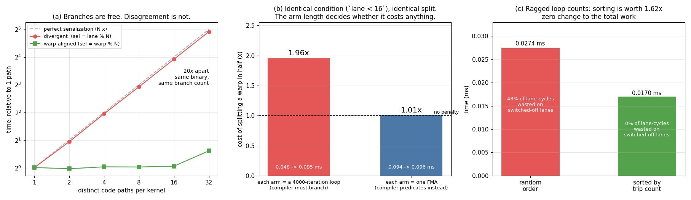

# Divergence Demo

---

> The same binary, the same 32 branch targets, the same work per thread. Change *what the branch depends on* and it runs **19.8x** faster.

---

## Key Insight

[Divergence](/shared/glossary/#divergence) is not caused by having branches. It is caused
by the 32 [threads](/shared/glossary/#thread) of one [warp](/shared/glossary/#warp)
*disagreeing* about which branch to take. Branching on a lane index cost **30.2x**;
branching on a warp index cost **1.5x** — from identical source, with the same fraction
of threads down each path. And the counter-lesson matters just as much: the exact same
half-warp split cost **1.01x** when the arms were short enough for the compiler to
[predicate](/shared/glossary/#predication) them away.

## Why This Matters

A divergence experiment that shows only one slow kernel proves nothing — the kernel
might be slow for any reason. Every measurement here is paired with a control that has
the same instruction count and the same branch count and differs only in whether the
warp agrees. That is what turns "divergence is bad" into a number you can act on.

---

**This is project 9.**

### The words first

- **[Warp](/shared/glossary/#warp)** — 32 threads sharing **one** instruction pointer.
  Not 32 independent threads that happen to run together: one instruction stream, 32
  sets of data. This is the [SIMT](/shared/glossary/#simt) model.
- **Lane** — a thread's position 0–31 inside its warp (`threadIdx.x & 31`).
- **[Divergence](/shared/glossary/#divergence)** — when lanes in one warp need different
  paths. The hardware runs path A with the B-lanes switched off, then path B with the
  A-lanes switched off. The *work* adds up; the *parallelism* does not.
- **[Predication](/shared/glossary/#predication)** — running both arms of an `if` with no
  jump at all, each instruction tagged with a per-thread on/off bit. The compiler's way
  of making a small branch cost nothing extra.
- **[SASS](/shared/glossary/#sass)** — the real machine code. `BRA` is a branch;
  `@P0 FFMA` is a predicated instruction. This is where you check what the compiler did.

### Why "the warp shares one instruction pointer" is the whole story

It is tempting to picture a warp as 32 workers who could each go their own way if only
the hardware were smarter. It is closer to 32 hands on one machine: there is a single
program counter for all of them, and each cycle it fetches one instruction. When lanes
need different instructions, the only mechanism available is to fetch one path's
instructions while masking off the lanes that do not want them, then fetch the other's.

Two consequences follow immediately, and both are measured below:

1. The cost is **the number of distinct paths taken within one warp**, up to 32x — not
   the number of `if` statements in your source.
2. If all 32 lanes agree, there is nothing to serialise, and the branch is free no
   matter how many branches exist in the program.

---

## Running it

```bash
python run.py        # ~3 s: compiles diverge.cu, runs four experiments, reads SASS, plots
```

Hardware: **GTX 1070 Ti**, compute capability 6.1, 19 [SMs](/shared/glossary/#sm),
32 threads per warp.

> **About the numbers.** All figures come from the committed
> [`outputs/findings.json`](outputs/findings.json). The binary spins the GPU up before
> measuring — a card idling at 164 MHz takes tens of milliseconds to reach its
> [boost clock](/shared/glossary/#boost-clock), and without that warm-up whichever
> experiment ran first would look slow for a reason unrelated to branching. With it,
> repeat runs agree to within 0.5%.



---

## 1 + 2. The same code, branching per-lane versus per-warp

One kernel, one binary, `WAYS` possible paths. Each path runs an identical-length loop
with different constants (so the compiler cannot merge two paths into one). The only
thing that changes between the two columns is what the path selector depends on:

```cuda
int sel = (mode == 0) ? (lane % WAYS)   // divergent: one warp splits WAYS ways
                      : (warp % WAYS);  // aligned:   all 32 lanes agree
```

Both layouts send **the same fraction of all threads** down each path. Only the grouping
differs.

| paths | divergent | warp-aligned | ratio | useful TFLOP/s (div vs aligned) |
|---:|---:|---:|---:|---|
| 1 | 0.058 ms | 0.057 ms | 1.0x | 5.39 vs 5.43 |
| 2 | 0.110 | 0.056 | **2.0x** | 2.84 vs 5.57 |
| 4 | 0.222 | 0.059 | 3.8x | 1.40 vs 5.31 |
| 8 | 0.437 | 0.058 | 7.5x | 0.71 vs 5.33 |
| 16 | 0.869 | 0.060 | 14.5x | 0.36 vs 5.21 |
| 32 | **1.731** | **0.087** | **19.8x** | 0.18 vs 3.57 |

- Going from 1 to 32 **divergent** paths cost **30.2x**. The ceiling is 32x — one pass
  per path — and 30.2 out of 32 means the model is essentially exact.
- Going from 1 to 32 **warp-aligned** paths cost **1.52x**. (Not 1.00x: 32 distinct loop
  bodies is a lot of instruction cache, and the compare chain that selects among them
  grows too. Neither is divergence.)
- At 32 paths the two are **19.8x apart, from the same binary**.

The "useful TFLOP/s" column is the same fact stated as waste. It counts only the FLOPs
someone asked for. At 32-way divergence, 0.18 of a possible 5.39 TFLOP/s survived —
**97% of the machine's lane-slots went to switched-off lanes.**

### The machine code says the branches were always there

```
cuobjdump -sass outputs/diverge
  32-path kernel: 288 BRA instructions
   1-path kernel:  11 BRA instructions
```

Those 288 branches exist in the divergent *and* the warp-aligned run — it is one binary,
executed twice with different data. **Nothing about the code changed. Only which lanes
agreed.**

### What this means when you write kernels

Branch on something constant across a warp and divergence disappears without removing a
single branch. In practice that means a block index, a warp index, or a tile id:

```cuda
if (blockIdx.x % 2)     ...   // free: whole warps agree
if (threadIdx.x / 32 % 2) ... // free: warp-aligned by construction
if (threadIdx.x % 2)    ...   // 2x: lanes 0,2,4... disagree with 1,3,5...
```

The first and third lines send exactly half the threads down each path. One is free.

---

## 3. The branch that costs nothing, because it is not a branch

Same condition — `lane < 16`, splitting every warp exactly in half, maximally divergent
by any definition — but now each arm is a **single FMA** instead of a 4000-iteration
loop.

| | time | ratio |
|---|---:|---:|
| warp-uniform condition | 0.1080 ms | — |
| half-warp split | 0.1090 ms | **1.01x** |

Zero cost. And the [SASS](/shared/glossary/#sass) explains why:

```
84 predicated instructions (@P0 FFMA, @!P0 FFMA), 11 branches
```

The compiler did not branch at all. It emitted **both** arms and attached a predicate
register — a per-thread on/off switch — to each. Every thread issues both instructions;
the one whose predicate is false writes nothing. Cost: 2 instructions instead of 1, not
2 passes over the warp.

Why does the compiler choose differently for the two experiments? Because it is a
straightforward trade. Running both arms unconditionally costs `len(A) + len(B)`
instructions for every thread; branching costs a jump plus `len(A) + len(B)` for a
divergent warp but only `len(A)` for a uniform one. When the arms are one instruction
each, predication wins outright. When they are 4000 iterations, no compiler would
consider it. The switchover happens silently, with no flag and no warning.

**The trap this creates, stated plainly:** write a divergence benchmark with a small
`if`, measure 1.01x, and conclude divergence is folklore. It is not — your branch was
deleted. The identical condition on the identical GPU cost **1.96x** with long arms and
**1.01x** with short ones. Check the SASS before believing any null result about
branching.

---

## 4. The version you will actually meet: ragged loop counts

No `if` anywhere in this kernel. Each thread simply loops a different number of times
(8 to 2007, drawn at random):

```cuda
int t = trip[tid];
for (int i = 0; i < t; ++i) a = fmaf(a, c, k);
```

A loop *is* a branch. The warp keeps going until its **slowest** lane is done, with the
finished lanes switched off. Then the same data, sorted so that threads with similar
trip counts share a warp:

| layout | time | iterations asked for | iterations the warps ran |
|---|---:|---:|---:|
| random | 0.0315 ms | 39,278,768 | **75,860,480** |
| sorted | **0.0195 ms** | 39,278,768 | **39,309,920** |

**Identical total work. Sorting was worth 1.62x.**

The last column is the mechanism. What the hardware actually runs is, for each warp, its
*maximum* trip count times 32 lane-slots. In random order that is nearly twice the work
anyone asked for — **48% of every warp-cycle went to lanes sitting switched off**. After
sorting, each warp's 32 members have near-identical trip counts, so the maximum is
barely above the average and the waste falls to **0.08%**.

Predicted from those counts: 1.93x. Measured: 1.62x. The gap is the tail — sorting
groups all the longest threads into the final few warps, which run on after the rest of
the machine has gone idle. (Real implementations sort into *buckets* and schedule the
big buckets first, which recovers most of that difference.)

### This is not a toy

Two production techniques are exactly this measurement:

- **LLM serving sorts requests into length buckets** before batching. Sequences of wildly
  different lengths in one batch means every short sequence's lanes idle while the
  longest finishes.
- **[Mixture-of-Experts](/shared/glossary/#moe) kernels group tokens by expert** before
  the [matmul](/shared/glossary/#matmul). Tokens routed to different experts in the same
  warp would take different paths through different weight matrices; grouping them first
  makes each warp uniform.

Neither changes the amount of arithmetic. Both rearrange it so warps agree.

---

## What to take away

1. **Divergence is disagreement inside a warp, not the presence of branches.** 288 `BRA`
   instructions cost 30x or 1.5x depending only on the data.
2. **N-way divergence costs N passes**, and the measurement hit 30.2 of a possible 32x.
   The model is not approximate.
3. **Branch on a block, warp, or tile index and it is free.** `threadIdx.x % 2` and
   `blockIdx.x % 2` split threads identically; one costs 2x and one costs nothing.
4. **Short arms get predicated and cost 1.01x.** Same condition, same split, 1.96x
   versus 1.01x depending only on arm length — so a null divergence result usually means
   the compiler removed your branch.
5. **Ragged loop counts diverge without any `if`.** Random trip counts wasted 48% of all
   lane-cycles; sorting recovered 1.62x with zero change to the total work.
6. **Read the SASS.** `BRA` versus `@P0` settles in seconds what a benchmark cannot.

## Files

| File | What it is |
|---|---|
| [`diverge.cu`](diverge.cu) | the WAYS-path kernel with its per-lane/per-warp switch, the predication kernel, the ragged-loop kernel |
| [`run.py`](run.py) | compiles, runs, counts `BRA` and predicated instructions in the SASS, plots |
| [`outputs/findings.json`](outputs/findings.json) | every timing, ratio and SASS instruction count |
| [`outputs/findings.csv`](outputs/findings.csv) | one row per measurement |
| [`outputs/divergence.png`](outputs/divergence.png) | the three panels above |

## Next

[Project 10 — Spec compare](../10-spec-compare/README.md) closes Phase 2 by zooming all
the way out: eight GPUs across eight years, with every headline number recomputed from
its own inputs.
