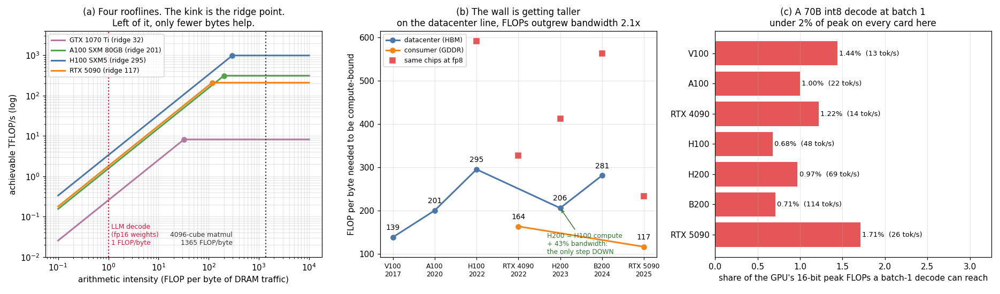

# Spec Compare

---

> An H100 generating tokens from a 70B model at batch size 1 can reach **0.68%** of its 16-bit peak FLOPs. That is not a bug in the software. It is arithmetic you can do on a spec sheet.

---

## Key Insight

Every headline GPU number is a product of two or three primitive facts, and recomputing
it teaches you more than reading it. Doing that for eight GPUs across eight years gives
a trend the marketing never states: from V100 to H100, 16-bit FLOPs grew **7.9x** while
[memory bandwidth](/shared/glossary/#memory-bandwidth) grew **3.7x**, so the
[ridge point](/shared/glossary/#ridge-point) — the arithmetic-per-byte you need before
the FLOPs are reachable at all — rose from **139 to 295**. The wall that
[FlashAttention](/shared/glossary/#flashattention) and kernel fusion climb is getting
taller, not shorter.

## Why This Matters

Spec sheets are how you choose hardware, and they are written to be read
uncritically. Two numbers that both grew impressively can still describe a machine that
got *harder* to use well. The ridge point is the number that says so, and nobody prints it.

---

**This is project 10.**

### The words first

- **Peak FLOP/s** — cores x 2 x clock. The `2` is FLOPs per
  [fused multiply-add](/shared/glossary/#fma-fused-multiply-add): one instruction, one
  multiply and one add, both counted.
- **Dense vs sparse TFLOPs** — vendors often quote the number achievable with 2:4
  *structured sparsity*, where half the weights in every group of four are zero. Sparse
  is exactly 2x dense and only applies to models that were trained for it. This project
  uses **dense** throughout; where the guide's table says the RTX 4090 is "~330", that
  is the sparse figure and the dense one is 165.2.
- **[Ridge point](/shared/glossary/#ridge-point)** — peak FLOP/s ÷ peak bytes/s. The
  [arithmetic intensity](/shared/glossary/#ai-arithmetic-intensity) at which a GPU stops
  being memory-starved. Below it a kernel is [memory-bound](/shared/glossary/#memory-bound);
  above it, [compute-bound](/shared/glossary/#compute-bound).
- **[HBM](/shared/glossary/#hbm) vs [GDDR](/shared/glossary/#gddr)** — two ways to reach a
  bandwidth target. GDDR uses a narrow bus at a furious per-pin rate; HBM uses a slow but
  enormous bus, which only works if the memory sits on the same package as the die.
- **[TDP](/shared/glossary/#tdp)** — the sustained watts the cooling must remove.
- **[Prefill and decode](/shared/glossary/#prefill)** — the two phases of LLM inference.
  Prefill processes the whole prompt at once; decode emits one token at a time. Their
  arithmetic intensities differ by orders of magnitude, which is why they behave like
  different workloads on the same hardware.

### Why recompute numbers that are already printed on the datasheet?

Because a derived number that you never check against its own inputs is a number you
cannot reason about — and the checks fail informatively.

[`gpus.csv`](gpus.csv) stores only *primitive* facts: SM count, cores per SM, boost
clock, memory pin rate, bus width, published peaks. Nothing derived is stored. Then
[`run.py`](run.py) recomputes peak FLOPs and bandwidth and compares them to what the
vendor published. Three things fall out that you cannot get any other way:

1. It **validates the input row**. If cores x 2 x clock does not match the published
   TFLOPs, one of your four numbers is wrong. All eight rows here match to within 0.2%,
   so the table is trustworthy.
2. It **exposes down-binning**. Two rows come out *above* the published bandwidth — which
   is not an arithmetic error but a real signal (see below).
3. It **lets you derive things nobody publishes**, like how wide one SM's matrix pipeline
   is, and what fraction of a GPU a specific workload can reach.

---

## Running it

```bash
python run.py        # ~1 s: pure arithmetic, no GPU required
```

The one card on this machine — a GTX 1070 Ti — is included so that at least one row can
be checked against real measurements from
[project 3](../03-bandwidth-measurement/README.md) and
[project 7](../07-tensor-core-utilization/README.md). `run.py` reads those projects'
`findings.json` files if they exist.

> **About the numbers.** Spec inputs are vendor datasheet values, recorded in
> [`gpus.csv`](gpus.csv) with a note on each column. Everything derived lands in
> [`outputs/derived.csv`](outputs/derived.csv).



---

## 1. Recomputing the headline FLOP number

| GPU | SMs | cores/SM | cores | GHz | calc TF | spec TF | match |
|---|---:|---:|---:|---:|---:|---:|---:|
| GTX 1070 Ti | 19 | 128 | 2,432 | 1.683 | 8.2 | 8.2 | 100.0% |
| Tesla V100 SXM2 | 80 | 64 | 5,120 | 1.530 | 15.7 | 15.7 | 99.8% |
| A100 SXM 80GB | 108 | 64 | 6,912 | 1.410 | 19.5 | 19.5 | 100.0% |
| RTX 4090 | 128 | 128 | 16,384 | 2.520 | 82.6 | 82.6 | 100.0% |
| H100 SXM5 | 132 | 128 | 16,896 | 1.980 | 66.9 | 67.0 | 99.9% |
| H200 SXM | 132 | 128 | 16,896 | 1.980 | 66.9 | 67.0 | 99.9% |
| B200 SXM | – | – | – | – | – | 80.0 | n/a |
| RTX 5090 | 170 | 128 | 21,760 | 2.407 | 104.8 | 104.8 | 100.0% |

Note the **cores/SM** column: 64 on the datacenter Volta and Ampere GA100 parts, 128
everywhere else. Get that wrong and every number after it is out by 2x. It is published
in neither `nvidia-smi` nor `cudaGetDeviceProperties` — see
[project 6](../06-nvidia-smi-deep-dive/README.md).

The B200 row is blank because NVIDIA has not published a per-die SM count or clock for
it. That is worth noticing rather than guessing at: a spec sheet is a marketing document
and vendors omit what they prefer not to discuss.

---

## 2. Recomputing bandwidth, and what the mismatch tells you

```
bandwidth = per-pin data rate x number of pins / 8 bits per byte
```

| GPU | type | Gb/s per pin | pins | calc GB/s | spec GB/s | match |
|---|---|---:|---:|---:|---:|---:|
| GTX 1070 Ti | GDDR5 | 8.01 | 256 | 256 | 256 | 100.1% |
| Tesla V100 | HBM2 | 1.76 | 4,096 | 900 | 900 | 100.0% |
| A100 | HBM2e | 2.43 | 5,120 | 1,555 | 1,555 | 100.0% |
| RTX 4090 | GDDR6X | 21.00 | 384 | 1,008 | 1,008 | 100.0% |
| H100 | HBM3 | 5.23 | 5,120 | 3,347 | 3,350 | 99.9% |
| H200 | HBM3e | 6.40 | 6,144 | 4,915 | 4,800 | **102.4%** |
| B200 | HBM3e | 8.00 | 8,192 | 8,192 | 8,000 | **102.4%** |
| RTX 5090 | GDDR7 | 28.00 | 512 | 1,792 | 1,792 | 100.0% |

Two rows come out **above** the published figure. That is not the formula failing — it
means those parts **clock their memory below what the HBM stacks are rated for**, for
power or yield reasons. A mismatch in that direction is real information about the
product, so the cross-check is worth keeping rather than deleting.

The two memory technologies are visible in the shape of the table. GDDR7 reaches
1,792 GB/s from a **512-bit** bus at **28 Gb/s per pin**. HBM3e reaches 8,000 GB/s from an
**8,192-bit** bus at **8 Gb/s per pin**. Sixteen times the wires, a third of the speed
per wire. You cannot route 8,192 signal traces across a circuit board at any speed, which
is why HBM has to be stacked beside the die on the same package — and why it costs so
much more, and why only three companies in the world make it.

---

## 3. Reverse-engineering the matrix pipeline

Nobody publishes "FLOPs per SM per clock". But you can divide:

```
16-bit FLOPs per SM per clock = headline TFLOP/s / (SMs x clock)
```

| GPU | 16-bit TF | FLOP/SM/clk | nearest 2ⁿ | off by |
|---|---:|---:|---:|---:|
| Tesla V100 | 125.0 | 1021.2 | 1024 | -0.3% |
| A100 | 312.0 | 2048.9 | 2048 | +0.0% |
| RTX 4090 | 165.2 | 512.2 | 512 | +0.0% |
| H100 | 989.4 | **3785.6** | 4096 | **-7.6%** |
| H200 | 989.4 | **3785.6** | 4096 | **-7.6%** |
| RTX 5090 | 209.5 | 512.0 | 512 | -0.0% |

Four land within a fraction of a percent of an exact power of two, which is what you
expect from silicon: the pipeline is a whole number of fixed-size multiply-accumulate
blocks. You have just read a hardware design parameter off a marketing page.

**H100 and H200 do not.** Their published 16-bit peak is not (SMs x power-of-two width x
boost clock) for any width, which means the headline number assumes some clock other than
the published 1980 MHz — and NVIDIA does not say which. (A plausible reason: Tensor Core
work draws far more power than ordinary FMAs, so the card cannot hold its full
[boost clock](/shared/glossary/#boost-clock) while doing it. That is the same effect
[project 6](../06-nvidia-smi-deep-dive/README.md) measured from the other direction, where
"peak" turned out to be three different numbers.)

Either way, the lesson generalises: **a vendor peak is a number chosen for a datasheet,
not a formula you can invert with confidence.**

---

## 4. The ridge point, and the trend nobody prints

```
ridge point = peak FLOP/s / peak bytes/s
```

| GPU | year | 16-bit TF | GB/s | ridge fp32 | **ridge 16-bit** | ridge fp8 |
|---|---:|---:|---:|---:|---:|---:|
| GTX 1070 Ti | 2017 | – | 256 | 32 | – | – |
| Tesla V100 | 2017 | 125.0 | 900 | 17 | **139** | – |
| A100 | 2020 | 312.0 | 1,555 | 13 | **201** | – |
| RTX 4090 | 2022 | 165.2 | 1,008 | 82 | 164 | 328 |
| H100 | 2022 | 989.4 | 3,350 | 20 | **295** | 591 |
| H200 | 2023 | 989.4 | 4,800 | 14 | **206** | 412 |
| B200 | 2024 | 2,250.0 | 8,000 | 10 | **281** | 562 |
| RTX 5090 | 2025 | 209.5 | 1,792 | 58 | 117 | 234 |

**V100 → H100: 16-bit FLOPs x7.9, bandwidth x3.7, ridge point 139 → 295 (2.1x).**

Both grew. Compute grew twice as fast. So the *fraction of workloads that can reach the
FLOPs* shrank, generation over generation. Every technique that reduces memory traffic —
[kernel fusion](/shared/glossary/#kernel-fusion), FlashAttention,
[activation checkpointing](/shared/glossary/#activation-checkpointing), lower precision —
is worth **more** on newer hardware, not less. That is the opposite of the intuition
"newer GPUs are faster so optimisation matters less", and it is the single most useful
thing in this project.

### The exception: H200

Same compute as H100. 1.43x the bandwidth. Ridge point **fell** from 295 to 206 — the only
step down in the table. A refresh that added nothing but memory moved the number that
actually constrains most kernels, which is why the H200 outperforms the H100 on
inference by far more than its zero-percent compute increase suggests.

### And what lower precision does to it

On the H100, the **fp8 ridge point is 591 — double the 16-bit one.** Halving the bits
doubles the FLOPs and does nothing whatsoever for the memory bus, so a low-precision GPU
is *relatively even more memory-starved*.

This is worth stating carefully, because it is easy to draw the wrong conclusion.
[Quantization](/shared/glossary/#quantization) is still a large win — but the win comes
from **halving the bytes you move**, not from the extra FLOPs. A workload's arithmetic
intensity and the machine's ridge point both double, so their ratio is unchanged; what
changes is that you now read half as much memory to do the same job. Anyone selling you
FP4 on the strength of its FLOP number is quoting the half of the story that does not
apply to inference.

---

## 5. One real workload: 70B decode at batch size 1

Generating one token reads **every weight exactly once** and does two FLOPs per weight.
So the arithmetic intensity is fixed by the weight format alone, regardless of model
size:

```
fp16 weights -> 2 FLOP / 2 bytes = 1.0 FLOP/byte
int8 weights -> 2 FLOP / 1 byte  = 2.0 FLOP/byte
int4 weights -> 2 FLOP / 0.5 byte = 4.0 FLOP/byte
```

Against ridge points of 117–295, the verdict is not close:

| GPU | GB/s | ridge | AI @ int8 | **max % of peak** | **70B int8 tok/s** | fits? |
|---|---:|---:|---:|---:|---:|---:|
| Tesla V100 | 900 | 139 | 2.0 | 1.44% | 13 | no |
| A100 | 1,555 | 201 | 2.0 | 1.00% | 22 | no |
| RTX 4090 | 1,008 | 164 | 2.0 | 1.22% | 14 | no |
| H100 | 3,350 | 295 | 2.0 | **0.68%** | 48 | no |
| H200 | 4,800 | 206 | 2.0 | 0.97% | 69 | yes |
| B200 | 8,000 | 281 | 2.0 | 0.71% | 114 | yes |
| RTX 5090 | 1,792 | 117 | 2.0 | 1.71% | 26 | no |

("fits?" allows 15% on top of the weights for the [KV cache](/shared/glossary/#kv-cache),
activations and the CUDA context. Weights alone is not a real answer.)

**A batch-1 decode reaches 0.68%–1.71% of the tensor cores you paid for.** Nothing is
broken. The job simply has almost no arithmetic in it relative to the bytes it must read,
and the roofline says so before you write a line of code.

Note the direction of the H100 row: it has the *most* FLOPs of the pre-Blackwell parts
and the *worst* utilisation ceiling, because a high ridge point is bad news for a
low-intensity workload. Peak FLOPs and usable FLOPs can move in opposite directions.

The tokens/s column is a **hard ceiling**, not an estimate: you cannot emit a token
faster than you can read the weights once. If a vendor claims 200 tok/s single-stream on
a 70 GB model on an H100, either the model is smaller, the weights are more quantized, or
[speculative decoding](/shared/glossary/#speculative-decoding) is in play — you can check
the claim with one division.

Everything in modern LLM serving exists to move that percentage up.
[Continuous batching](/shared/glossary/#continuous-batching) amortises one weight read
across many sequences; speculative decoding verifies several tokens per read; paged KV
caches let you batch more. All of them are the same move: raise arithmetic intensity so
the workload climbs toward the ridge point.

---

## 6. Reality check against the one card we can measure

| | spec | measured | ratio |
|---|---:|---:|---:|
| bandwidth | 256 GB/s | 205 GB/s | **80%** |
| fp32 matmul | 8.19 TFLOP/s | 7.20 TFLOP/s | **88%** |
| ridge point | 32.0 FLOP/byte | 35.1 FLOP/byte | 1.10x |

Measured figures from [project 3](../03-bandwidth-measurement/README.md) and
[project 7](../07-tensor-core-utilization/README.md).

Both land within 15% of the derived numbers. That is the honest accuracy of this whole
exercise: **spec arithmetic tells you the shape of a machine, not its performance.**
Every ridge point in the tables above would move by 10–20% if computed from achievable
rather than peak figures — and would move in the *same* direction for every GPU, so the
comparisons and the trend survive intact.

---

## What to take away

1. **Store primitive facts, derive everything else.** All eight rows reproduce their
   published FLOPs to within 0.2%, which is what makes the table trustworthy.
2. **Recomputation catches things reading cannot.** Two rows exceed their published
   bandwidth — real evidence that those parts run their memory below its rating.
3. **You can read a hardware design parameter off a marketing page.** Four of six GPUs
   land on an exact power-of-two FLOPs-per-SM-per-clock; the H100 does not, which is
   itself a finding.
4. **The ridge point rose 139 → 295 from V100 to H100.** Memory-traffic optimisations are
   worth more on newer hardware, not less.
5. **H200 is the only step down**, achieved with zero extra compute. Bandwidth was the
   binding constraint all along.
6. **Lower precision raises the ridge point.** Quantization pays because it halves the
   bytes, not because it doubles the FLOPs.
7. **A batch-1 70B decode reaches under 2% of peak on every GPU here**, and the tokens/s
   ceiling follows from one division. Learn to do that division before believing a
   throughput claim.

## Files

| File | What it is |
|---|---|
| [`gpus.csv`](gpus.csv) | eight GPUs, primitive facts only, one comment per column |
| [`run.py`](run.py) | the six derivation steps, the cross-checks, the plots |
| [`outputs/derived.csv`](outputs/derived.csv) | every computed column, per GPU |
| [`outputs/findings.json`](outputs/findings.json) | the same, plus the headline ratios |
| [`outputs/spec-compare.png`](outputs/spec-compare.png) | the three panels above |

## Next

Phase 2 ends here. [Phase 3](../../README.md#phase-3-the-memory-hierarchy--where-your-time-actually-goes)
takes the ridge point seriously and spends five projects on the left-hand side of it:
[coalescing](/shared/glossary/#memory-coalescing),
[bank conflicts](/shared/glossary/#bank-conflict), [tiling](/shared/glossary/#tiling), and
saturating memory bandwidth — the only optimisations that help a memory-bound kernel.
