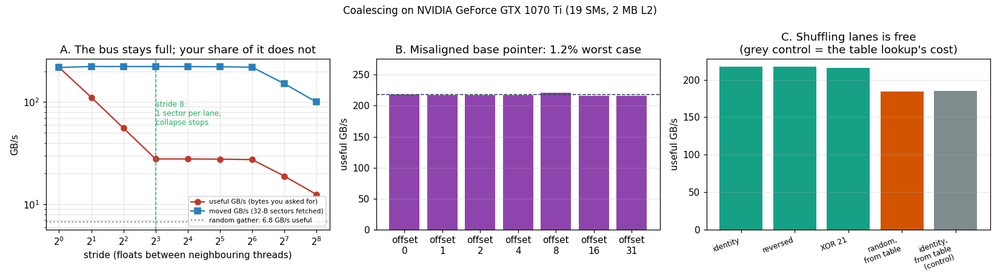

# Coalesced vs Non-coalesced

---

> A stride of 8 costs **7.8x**. A stride of 64 also costs 7.8x — the penalty stops growing, and the reason is a number nobody quotes. Meanwhile the memory bus was running at **full speed the whole time**: 219–222 GB/s, at every stride. Nothing was ever slow. You were just throwing away 7 bytes out of every 8.

---

## Key Insight

Everyone learns "make your memory accesses [coalesced](/shared/glossary/#memory-coalescing)". Almost nobody learns *what the hardware actually merges*, and so the rule gets applied as superstition. This project measures the merging rule directly, and three of the four experiments come out against the folklore: a misaligned pointer costs **1.2%**, shuffling which lane reads which address costs **0.2%**, and an array-of-structs is **exactly as fast** as a struct-of-arrays when you read the whole struct.

## Why This Matters

The single number that predicts all of it is the **32-byte sector** — the smallest chunk of memory this GPU will ever fetch. Once you know that, you can predict a kernel's bandwidth on paper before writing it, and you stop optimising things that were never costing anything.

---

**This is project 11.**

### The words first

- **[Warp](/shared/glossary/#warp)** — 32 threads that execute one instruction together. When a warp executes a load, the hardware sees **32 addresses at once** and has to fetch them. "Coalescing" is entirely about what happens to those 32 addresses. *("Warp" comes from weaving: the warp is the set of parallel threads held on a loom while the weft passes across them. NVIDIA borrowed the image of many threads moving as one.)*
- **[Memory coalescing](/shared/glossary/#memory-coalescing)** — *coalesce* means "to merge into one". The memory system merges the warp's 32 addresses into as few memory requests as it can.
- **[Sector](/shared/glossary/#memory-transaction)** — the smallest unit the memory system will ever fetch: **32 bytes** here. Ask for 4 bytes, and 32 bytes travel. This is the number the whole project turns on.
- **[Cache line](/shared/glossary/#cache-line)** — 128 bytes on this GPU, made of **four 32-byte sectors**. Most tutorials say "a warp reads a 128-byte line", which is why they predict a 32x penalty. The hardware is finer-grained than that, and the real answer is 7.8x.
- **Stride** — the gap between the addresses two neighbouring threads read. Stride 1 = next door. Stride 8 = eight floats apart. From Old English *strīdan*, to step: it is literally the size of the step between one thread and the next.
- **[Global memory](/shared/glossary/#dram)** — the big off-chip memory (8 GB here). Slow (~400 cycles) and shared by everything.
- **AoS / SoA** — *array of structs* (`particle[i].x`) vs *struct of arrays* (`x[i]`). The same data, two layouts.

### The rule, in one line

```
sectors a warp touches = min(32, 4 x stride_in_floats)
```

Why: the warp's 32 lanes each want 4 bytes, spread over `32 x 4 x stride` bytes of address space, chopped into 32-byte sectors. And it can never exceed 32, because 32 lanes cannot ask for more than 32 different places.

| stride | span of the warp's addresses | sectors fetched | bytes fetched | bytes used | efficiency |
|---:|---:|---:|---:|---:|---:|
| 1 | 128 B | 4 | 128 | 128 | **100%** |
| 2 | 256 B | 8 | 256 | 128 | 50% |
| 4 | 512 B | 16 | 512 | 128 | 25% |
| 8 | 1024 B | **32** | 1024 | 128 | 12.5% |
| 16 | 2048 B | 32 *(capped)* | 1024 | 128 | 12.5% |
| 64 | 8192 B | 32 *(capped)* | 1024 | 128 | 12.5% |

**The cap at stride 8 is the prediction.** Past that point every lane already has a sector to itself, and the waste cannot get any worse. Experiment A tests it.

### Why measure this at all — doesn't the compiler handle it?

A fair question, because `nvcc` really does optimise memory access: it will merge adjacent loads into wider `LDG.128` instructions, reorder them, and keep many in flight. But every one of those optimisations works on **the addresses you wrote**. The compiler cannot change `particle[i].x` into `x[i]` — that would mean re-laying-out your data in memory, which is your decision, not its. Coalescing is a *data layout* property, and data layout is the one thing the compiler is not allowed to touch. That is exactly the gap this project measures.

---

## Running it

```bash
python run.py       # ~5 s: compiles coalesce.cu, runs 4 experiments, plots
```

Hardware: **GTX 1070 Ti**, 19 [SMs](/shared/glossary/#sm), 2 MB [L2](/shared/glossary/#l2-cache), 256.3 GB/s peak [bandwidth](/shared/glossary/#memory-bandwidth) (see [project 3](../03-bandwidth-measurement/README.md), where a read-only kernel reached 222 GB/s = 87% of peak — that is the realistic ceiling for every number below).

The buffer is **256 MB, 128x the L2**, so nothing can be cached and every access is a genuine trip to [DRAM](/shared/glossary/#dram). Every kernel is read-only, folding its loads into a value that is stored back only on a condition that never happens — that stops the compiler deleting the load without adding any write traffic to the measurement.

> **About the numbers.** All figures come from the committed
> [`outputs/findings.json`](outputs/findings.json) and
> [`outputs/findings.csv`](outputs/findings.csv).



---

## A. The stride sweep: the collapse, and where it stops

Two bandwidths are reported for each row, and the difference between them is the whole story:

- **useful GB/s** — bytes your kernel actually asked for, divided by time. What you get.
- **moved GB/s** — bytes the memory system actually shipped (sectors x 32), divided by time. What the bus did.

| stride | sectors/warp | useful GB/s | vs stride 1 | moved GB/s |
|---:|---:|---:|---:|---:|
| 1 | 4 | **217.71** | 1.00x | 217.71 |
| 2 | 8 | 111.25 | 1.96x | 222.50 |
| 4 | 16 | 55.62 | 3.91x | 222.47 |
| 8 | 32 | **27.78** | **7.84x** | 222.27 |
| 16 | 32 | 27.78 | 7.84x | 222.21 |
| 32 | 32 | 27.67 | 7.87x | 221.33 |
| 64 | 32 | 27.39 | 7.95x | 219.13 |
| 128 | 32 | 18.88 | 11.53x | 151.02 |
| 256 | 32 | 12.50 | 17.42x | 99.97 |
| **random** | 32 | **6.76** | **32.21x** | 54.12 |

**The prediction holds exactly.** Useful bandwidth halves every time the stride doubles — 218 → 111 → 55.6 → 27.8 — and then **stops falling**. Strides 8 through 64 differ by 1.014x, i.e. not at all. That is an 8x range of stride with no change in performance, which makes no sense until you know about the 32-byte sector, and is obvious once you do.

**And look at the `moved` column: 218–222 GB/s for every row from stride 1 to 64.** The memory system never slowed down by even 2%. It was shipping bytes at full speed the entire time. This is the sentence worth carrying away:

> A non-coalesced kernel is not a kernel with slow memory. It is a kernel that pays full price for bytes it throws away.

### Why 128 and 256 fall further

Past stride 64 the sector count cannot grow — but `moved` starts dropping too (222 → 151 → 100). A second mechanism has arrived. DRAM is organised in **rows** of a few KB; opening a new row costs time, and reading more from an already-open row is nearly free. At stride 128 (512 bytes apart) consecutive warps stop landing in the same DRAM row, so the memory controller spends its time opening rows instead of streaming from them. The address-translation hardware (which maps addresses to physical pages in 4 KB–2 MB chunks) starts missing for the same reason.

The fully random gather is the endpoint of that trend: **6.76 GB/s useful, 32.2x below coalesced**, and only 54 GB/s of sectors moved — a quarter of what an ordered stride-256 kernel achieves *with the identical sector count*. Randomness costs on top of scatter.

This matters directly for real models: embedding lookups, mixture-of-experts routing, and gather/scatter in sparse attention are all random gathers. Now you know their price tag on this hardware — about **1/32 of streaming bandwidth**.

---

## B. Alignment: the 1.2% problem

Textbook advice says to align your buffers to 128 bytes or lose half your bandwidth. Shifting the base pointer by 1 to 31 floats:

| shift | useful GB/s | change |
|---:|---:|---:|
| +0 | 218.26 | — |
| +1 | 216.90 | −0.62% |
| +2 | 216.94 | −0.60% |
| +4 | 216.96 | −0.60% |
| +8 | 220.69 | +1.11% |
| +16 | 215.66 | **−1.19%** |
| +31 | 215.91 | −1.08% |

**Worst case 1.2%.** Not 2x, not 30%.

The reason is the sector again. A misaligned warp straddles one extra sector: it needs 5 sectors instead of 4, which is 25% more *for that warp*. But a real kernel runs millions of warps back to back over one long buffer, and the extra sector at the end of one warp's range is the sector the next warp needs anyway — it is already in [L2](/shared/glossary/#l2-cache) by then. The overhead is one extra sector per **kernel**, not per warp.

(Note that `cudaMalloc` already returns 256-byte-aligned pointers, so you have to work to create this problem. The realistic version is an offset *view* into a tensor — `x[:, 1:]` — and now you know it costs about 1%.)

---

## C. Does it matter which lane reads which address?

A common mental image of coalescing is "thread 0 reads element 0, thread 1 reads element 1, …". That is a *sufficient* condition, not the actual rule. The rule only cares about **which sectors the warp touches**, not which lane wants which byte. Test: keep the warp reading the same contiguous 128-byte window, but scramble the lanes inside it.

| lane mapping | useful GB/s | change |
|---|---:|---:|
| identity (lane *i* → *i*) | 217.20 | — |
| reversed (lane *i* → 31−*i*) | 217.30 | +0.05% |
| XOR 21 (lane *i* → *i* ^ 21) | 216.24 | −0.44% |
| random permutation, read from a table | 184.65 | **−14.99%** |
| identity, read from the same kind of table **[control]** | 184.94 | **−14.85%** |

The first three are a tie. Reversing all 32 lanes — the most scrambled ordering imaginable inside the window — costs *nothing*, because the warp still touches the same four sectors.

The fourth row looks like the exception, and this is where the **control** earns its place. Mode 3 gets its lane mapping from a lookup table in memory, so it does two loads instead of one. Was the 15% from the scrambling, or from the extra load? Mode 4 answers it: the *same* table lookup, but the table contains the identity, so the access pattern is perfectly ordered. It costs 14.85% too.

**Reordering the lanes is therefore worth 0.2%. The other 14.9% is the price of the extra load.** Without the control, this project would have reported a false 15% penalty for lane scrambling — and it is exactly the kind of mistake that turns into folklore.

---

## D. AoS vs SoA: the layout question, answered properly

A 16-byte particle `{float x, y, z, w;}`, 16 million of them:

| layout | useful GB/s | moved GB/s | time (ms) |
|---|---:|---:|---:|
| AoS, read 1 of 4 fields | 55.66 | 222.63 | 1.206 |
| SoA, read 1 of 4 arrays | **217.34** | 217.34 | **0.309** |
| AoS, read all 4 fields | 222.53 | 222.53 | 1.206 |
| SoA, read all 4 arrays | 222.57 | 222.57 | 1.206 |

Reading **one** field: SoA is **3.90x** faster. Reading **all four**: SoA is **1.00x** faster — a dead tie, to three digits.

`particle[i].x` puts consecutive threads 16 bytes apart, which is stride 4, which the table at the top of this page says is 25% efficient. The measurement says 55.66/222.63 = 25.0%. The model is not approximately right; it is right.

But the last two rows are the ones that should change how you think. **"AoS is slow" is false.** When a kernel consumes the entire struct, the AoS layout moves exactly the bytes it needs and hits the same 222 GB/s ceiling. The real rule is:

> The cost is not the layout. The cost is the *fraction of each fetched sector that you use*.

So the design question is never "AoS or SoA?" — it is "which fields do my hot kernels read together?". Group those; split the rest. This is the same reasoning behind splitting a wide dataframe by column, and behind storing keys and values separately in a [KV cache](/shared/glossary/#kv-cache) when only one of them is read in a given phase.

---

## What to take away

1. **The unit of merging is a 32-byte sector, not a 128-byte line.** That is why the penalty caps at 7.8x rather than 32x, and why the cap arrives at stride 8.
2. **`min(32, 4 x stride)` predicted every measurement**, including 25.0% efficiency at stride 4 to three significant figures.
3. **A non-coalesced kernel runs on a fully saturated bus.** 219–222 GB/s moved at every stride from 1 to 64. You are not waiting on slow memory; you are discarding 7/8 of what arrives.
4. **Misalignment costs 1.2%,** because the extra sector is amortised across the whole kernel.
5. **Lane order inside the warp is worth 0.2%** — and the control was what proved it. A measured penalty with no control is a guess.
6. **Random gather is 32.2x worse than streaming**, and worse than an ordered stride with the same sector count, because DRAM rows and address translation punish disorder on top of scatter. Price your embedding lookups accordingly.
7. **AoS and SoA tie when you read the whole struct.** Optimise for the fraction of each sector you consume, not for a layout name.

## Files

| File | What it is |
|---|---|
| [`coalesce.cu`](coalesce.cu) | the four experiments: stride, alignment, lane permutation, AoS/SoA |
| [`run.py`](run.py) | compiles, runs, prints the tables, plots, writes the findings |
| [`outputs/findings.json`](outputs/findings.json) | headline ratios plus every raw measurement |
| [`outputs/findings.csv`](outputs/findings.csv) | one row per measurement |
| [`outputs/coalescing.png`](outputs/coalescing.png) | the three panels above |

## Next

[Project 12 — Bank conflict demo](../12-bank-conflict-demo/README.md) asks the same question one level up the hierarchy. Global memory is divided into sectors; [shared memory](/shared/glossary/#shared-memory) is divided into 32 **banks**, and it has its own, different, rule for what a warp can do in one shot.
