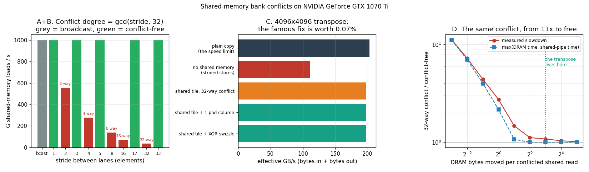

# Bank Conflict Demo

---

> A 32-way bank conflict costs **28.7x** in isolation. The same conflict, inside the textbook matrix transpose it is famous for, costs **0.07%** — the padding trick every CUDA tutorial teaches bought nothing here. Both numbers are correct, and one formula predicts when you get which.

---

## Key Insight

[Shared memory](/shared/glossary/#shared-memory) is not one memory — it is 32 small memories called **banks** working in parallel. A [warp](/shared/glossary/#warp)'s 32 lanes are served in one shot if they land on 32 different banks, and serialised if several want *different rows of the same bank*. That is a [bank conflict](/shared/glossary/#bank-conflict), and its degree is exactly `gcd(stride, 32)`.

But the cost of a conflict is not a property of the conflict. It is a property of **what else the kernel is waiting for**. This project measures the same conflict at every point from 11x to free.

## Why This Matters

Bank conflicts are the most enthusiastically taught GPU micro-optimisation and one of the least often worth fixing. Learning both the rule *and* the condition under which it stops mattering saves you from the two opposite mistakes: ignoring a conflict that costs 11x, and rewriting a kernel to remove one worth 0.07%.

---

**This is project 12.**

### The words first

- **[Shared memory](/shared/glossary/#shared-memory)** — a small, fast, software-managed scratchpad *inside* each [SM](/shared/glossary/#sm) (96 KB per SM here, at most 48 KB per [block](/shared/glossary/#block)). About 30 cycles away, versus 400+ for [DRAM](/shared/glossary/#dram).
- **Bank** — one of 32 independent sub-memories, each 4 bytes wide. They are interleaved, so consecutive elements sit in consecutive banks:

  ```
  element:  0  1  2  ... 31 | 32 33 ... 63 | 64 ...
  bank:     0  1  2  ... 31 |  0  1 ... 31 |  0 ...

  bank of element i = i % 32          (for 4-byte elements)
  ```

  The name comes from banking: 32 tellers serving one queue each. Thirty-two customers at thirty-two windows finish together; thirty-two customers at *one* window queue up.
- **[Bank conflict](/shared/glossary/#bank-conflict)** — *k* lanes wanting different addresses in the same bank. That bank serves them one at a time, so the whole warp's access takes *k* times as long: a "*k*-way conflict".
- **Broadcast** — the exception. If lanes want the **same address**, there is no conflict: the bank reads the value once and hands the same copy to everyone. Same bank ≠ conflict; same *bank, different row* = conflict.
- **`gcd`** — greatest common divisor. `gcd(stride, 32)` is the conflict degree because lane *L* reads bank `(L x stride) % 32`, and as *L* runs 0…31 that expression takes exactly `32/gcd(stride,32)` distinct values, so `gcd(stride,32)` lanes share each one. Odd strides are always conflict-free, because an odd number shares no factor with 32.
- **[Padding](/shared/glossary/#padding)** — adding an unused column so the row length becomes odd (32 → 33), which shifts every row's banks by one and breaks the collision.
- **Swizzle** — from the drink: to stir things around. Store element (*r*,*c*) at column `c XOR r`. Same effect as padding, using **zero** extra memory.

### Isn't shared memory just a cache? Why manage it by hand?

On this GPU shared memory and the [L1 cache](/shared/glossary/#l2-cache) are literally the same silicon, split between the two roles. The difference is who decides what lives there. L1 decides by itself, using a policy you cannot see or steer; shared memory does exactly what you say. That control is the entire point — a [tiled](/shared/glossary/#tiling) matmul needs a specific 32x32 block to stay resident for a specific number of iterations, and "hopefully the cache keeps it" is not a plan. The price of that control is that you also inherit responsibility for the access pattern, which is what a bank conflict is.

---

## Running it

```bash
python run.py       # ~7 s: compiles banks.cu, runs 4 experiments, plots
```

Hardware: **GTX 1070 Ti**, 19 SMs, 48 KB shared memory per block, 2 MB [L2](/shared/glossary/#l2-cache).

> **About the numbers.** All figures come from the committed
> [`outputs/findings.json`](outputs/findings.json) and
> [`outputs/findings.csv`](outputs/findings.csv). Timings vary by a few tenths of
> a percent between runs; the sub-1% results below are all inside that noise,
> which is the point being made about them.



---

## A + B. The rule, measured

Each lane reads `shared[lane * stride + …]`, four independent streams deep so we measure throughput rather than one load's latency. Only the stride changes.

| stride | conflict | G loads/s | slowdown |
|---:|:--|---:|---:|
| **0 (broadcast)** | **broadcast** | **1003.3** | **1.00x** |
| 1 | none | 1002.1 | 1.00x |
| 2 | 2-way | 557.2 | 1.80x |
| 3 | none | 1002.1 | 1.00x |
| 4 | 4-way | 278.9 | 3.59x |
| 5 | none | 1001.9 | 1.00x |
| 8 | 8-way | 139.6 | 7.18x |
| 16 | 16-way | 69.8 | 14.35x |
| 17 | none | 1003.0 | 1.00x |
| 32 | **32-way** | **34.9** | **28.69x** |
| 33 | none | 1002.7 | 1.00x |

**`gcd(stride, 32)` predicts every row.** Strides 3, 5, 17 and 33 are odd, share no factor with 32, and run at full speed — stride 33 is as fast as stride 1 despite looking far more scattered. Strides 2, 4, 8, 16, 32 are powers of two and each halves the number of banks in play.

The 32-way case is **28.7x, not 32x** — 90% of the theoretical ceiling. (Compare [project 9](../09-divergence-demo/README.md), where 32-way [divergence](/shared/glossary/#divergence) hit 30.2x of a 32x ceiling.) The gap is the fixed per-instruction overhead that does not serialise: address arithmetic, issue slots, the loop itself. Serialisation multiplies only the part that serialises.

### The broadcast: 28.7x faster than the conflict it looks like

Stride 0 puts all 32 lanes on **one address**. A naive reading of "same bank = conflict" predicts the worst possible case, 32-way. The measurement says **1003.3 G loads/s — 28.7x faster than the 32-way conflict**, and 0.1% *above* the conflict-free stride-1 rate. It is not merely "not a conflict"; it is the fastest thing shared memory does.

The hardware detects that the lanes want identical data, reads it once, and broadcasts. This is not a corner case: it is the mechanism that makes a scalar shared by a whole [block](/shared/glossary/#block) — a bias, a scale factor, a softmax denominator — free to read from shared memory. If broadcast did not exist, half of every reduction kernel would be a bank conflict.

> **The precise rule:** conflict = same bank, *different* row. Same bank and same row is a broadcast, and it is free.

---

## C. The famous transpose, and the fix that did nothing

Transposing a matrix is the canonical bank-conflict lesson. A direct transpose has to read rows and write columns, and one of the two must be strided in [global memory](/shared/glossary/#memory-coalescing) — exactly the 32x waste from [project 11](../11-coalesced-vs-non-coalesced/README.md). The fix is to stage a 32x32 tile through shared memory: read rows (coalesced), write rows (coalesced), and do the transposition inside the fast scratchpad. But the column read of that tile, `tile[threadIdx.x][c]`, puts all 32 lanes in bank `(tx*32 + c) % 32 = c` — the same bank, different rows. A textbook 32-way conflict.

4096x4096 floats, 128 MB moved:

| implementation | ms | GB/s | vs the copy limit |
|---|---:|---:|---:|
| plain copy (the speed limit) | 0.661 | 202.96 | 100.0% |
| no shared memory (strided stores) | 1.204 | 111.48 | 54.9% |
| shared tile, **32-way conflict** | 0.679 | 197.61 | 97.4% |
| shared tile + 1 pad column | 0.679 | 197.75 | 97.4% |
| shared tile + XOR swizzle | 0.678 | 197.95 | 97.5% |

The "plain copy" row is the honest reference: a kernel that moves the same 128 MB without transposing anything. Nothing that touches this much data can beat it, so it is the ceiling — quoting a transpose's GB/s without it tells you nothing.

**Staging through shared memory is worth 1.77x** (111 → 198 GB/s) and takes the transpose to 97.4% of the copy limit. That optimisation is real and large.

**Removing the 32-way bank conflict is worth +0.07%** — inside the run-to-run noise. The famous fix, applied to the famous example, on a kernel already at 97.4% of its ceiling.

### Why it is zero, in one calculation

From experiment A, a 32-way conflicted read runs at 35.5 G/s. The transpose does 16.8M of them:

```
shared-memory pipe time   = 16.8M / 34.9 G/s  = 0.480 ms
DRAM time (already spent) =                     0.679 ms
```

**0.480 < 0.679.** The two pipes run at the same time, so the conflict costs nothing until it exceeds the DRAM time — and it does not. Fixing the conflict shrinks 0.480 ms to 0.017 ms of a budget nobody was spending.

This is the [roofline](/shared/glossary/#roofline) idea from [project 2](../02-roofline-by-hand/README.md), applied to a pipe further up the hierarchy: a kernel's time is the **max** of what each pipe needs, not the sum. Optimise the pipe that is the max.

(The XOR swizzle ties with padding and is worth knowing anyway: padding grows the tile from 4096 to 4224 bytes, and shared memory is the resource that sets [occupancy](/shared/glossary/#occupancy) in steps — see [project 8](../08-occupancy-study/README.md). At a bigger tile size the 3% extra can cost you a whole resident block. The swizzle never can.)

---

## D. The same conflict, from 11x to free

If the cost depends on the surrounding DRAM work, then sweeping that ratio should sweep the cost. One knob: **DRAM bytes moved per conflicted shared read**.

| DRAM B / read | measured slowdown | max(DRAM, shared) model |
|---:|---:|---:|
| 32.0 | **1.01x** | 1.00x |
| 16.0 | 1.04x | 1.00x |
| 8.0 | 1.08x | 1.00x |
| 4.0 | 1.12x | 1.00x |
| 2.0 | 1.47x | 1.07x |
| 1.0 | 2.73x | 2.16x |
| 0.5 | 4.41x | 4.01x |
| 0.25 | 7.21x | 7.00x |
| 0.125 | **11.23x** | 11.12x |

**Identical conflict, identical hardware, 1.01x to 11.23x.** The only thing that changed is how much DRAM traffic surrounds each conflicted access. The transpose sits at 8 bytes per read, on the flat part — which is why its result was 1.00x, and why that result was predictable before running it.

The model plotted alongside is just `max(DRAM time, shared-pipe time)`, with the shared-pipe rate taken from experiment A. It is **exact at both ends** and up to **27% optimistic in the middle**. That is the known failure mode of any max() model: at the crossover the two pipes contend for issue slots and cache ports instead of overlapping perfectly, so reality is worse than the better of the two. Useful as a lower bound on time, not as a promise.

---

## What to take away

1. **`gcd(stride, 32)` is the conflict degree** and predicted all eleven rows. Odd strides are always free — stride 33 is exactly as fast as stride 1.
2. **A 32-way conflict costs 28.7x in isolation**, 90% of the 32x ceiling; the missing part is overhead that does not serialise.
3. **Broadcast is not a conflict.** 32 lanes on one address run 28.7x faster than 32 lanes on one bank. Conflict needs the same bank *and different rows*.
4. **Staging a transpose through shared memory is worth 1.77x.** That is the optimisation that matters, and it is about [coalescing](/shared/glossary/#memory-coalescing) global memory, not about banks.
5. **Removing the transpose's 32-way conflict is worth 0.07%,** because 0.480 ms of conflicted shared-memory time hides under 0.679 ms of DRAM time.
6. **A bank conflict has no fixed price.** The same one measured 1.01x to 11.23x across this project. Ask what the kernel is waiting for before you fix it.
7. **Always measure against a limit kernel.** "198 GB/s" means nothing; "97.4% of what a plain copy achieves" tells you to stop optimising.
8. **Prefer the XOR swizzle to padding** when shared memory is tight — same speed, zero extra bytes, and shared memory buys [occupancy](/shared/glossary/#occupancy) in indivisible steps.

## Files

| File | What it is |
|---|---|
| [`banks.cu`](banks.cu) | the stride sweep, the broadcast case, four transposes, the context sweep |
| [`run.py`](run.py) | compiles, runs, applies the max() model, prints tables, plots |
| [`outputs/findings.json`](outputs/findings.json) | headline ratios plus every raw measurement |
| [`outputs/findings.csv`](outputs/findings.csv) | one row per measurement |
| [`outputs/bank_conflicts.png`](outputs/bank_conflicts.png) | the three panels above |

## Next

[Project 13 — Tile size sweep](../13-tile-size-sweep/README.md) uses shared memory for what it is really for: holding a tile of a matrix so it can be read many times instead of once. It turns out that a shared-memory tile alone **cannot** make a matmul compute-bound on this GPU, and the reason is a number you already computed in project 2.
