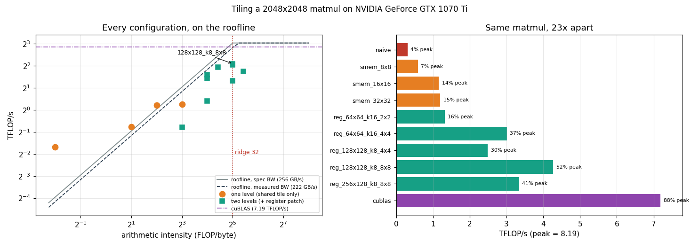

# Tile Size Sweep

---

> The best tile is **not the biggest one**. Going from a 128x128 tile to a 256x128 tile raises arithmetic intensity by 33% and makes the matmul **1.28x slower**. And a shared-memory tile on its own can never make this matmul compute-bound — not because of tuning, but because the tile that would be needed does not fit and could not be launched.

---

## Key Insight

[Tiling](/shared/glossary/#tiling) is the one optimisation that creates [arithmetic intensity](/shared/glossary/#ai-arithmetic-intensity) out of nothing. A [matmul](/shared/glossary/#matmul) has plenty of maths per element *available*; a naive kernel just refuses to collect it, re-reading each element thousands of times. A tile loads a block once and reuses it — and the tile's size sets exactly how much reuse you get.

This project sweeps that size across 13 configurations from 0.31 to 4.27 TFLOP/s and puts each one on the [roofline](/shared/glossary/#roofline). Three things fall out: where the sweet spot is, why it exists, and why one level of tiling is provably not enough on this GPU.

## Why This Matters

"Use shared memory" is where most CUDA courses stop. The measurement here says that gets you to **15% of peak**, and that the remaining 3.5x comes from a second level of tiling that lives in [registers](/shared/glossary/#registers). Knowing which level is missing is the difference between a 1.20 TFLOP/s kernel and a 4.27 TFLOP/s one.

---

**This is project 13.**

### The words first

- **Tile** — a small square block of a matrix, copied into fast memory and reused. From tiling a floor: you cover a big surface with small identical pieces.
- **[Arithmetic intensity (AI)](/shared/glossary/#ai-arithmetic-intensity)** — FLOPs performed per byte read from memory. High = you are allowed to be fast.
- **[Ridge point](/shared/glossary/#ridge-point)** — the AI at which a kernel stops being limited by memory and starts being limited by arithmetic. On this GPU (from [project 2](../02-roofline-by-hand/README.md)) it is **8.19 TFLOP/s ÷ 256.3 GB/s = 32 FLOP/byte**. Below 32, more FLOPs are free and more bytes are not.
- **[Occupancy](/shared/glossary/#occupancy)** — resident [warps](/shared/glossary/#warp) ÷ the maximum. See [project 8](../08-occupancy-study/README.md) for why maximising it is the wrong goal.
- **Register tiling** (also "thread tiling") — each thread computes a small **TM x TN patch** of the output instead of a single element, keeping the partial sums in registers.
- **BM, BN, BK** — the block tile's height, width, and depth. Shared memory holds `(BM + BN) x BK` elements per step; the register patch is `TM x TN` per thread.
- **cuBLAS** — NVIDIA's hand-tuned linear-algebra library. Here it is the reference, not a competitor: it says how much of the machine is actually reachable.

### The arithmetic that decides everything

For a `T x T` shared tile with **one output per thread**:

```
FLOPs per output tile        = 2 * T * T * N
bytes read from DRAM         = 2 * T * N * 4
arithmetic intensity         = T / 4     FLOP/byte
```

Each row of A gets read once per tile-column instead of once per output — that is the reuse. Doubling *T* doubles the reuse and doubles AI.

For **two levels** (a `BM x BN` block tile plus a `TM x TN` register patch), only the block tile touches DRAM:

```
arithmetic intensity = BM * BN / (2 * (BM + BN))
```

For BM = BN = 128 that is **32 FLOP/byte — exactly the ridge point**. And it needs only `(128+128) x 8 x 4 = 8 KB` of shared memory, because BK (the depth of one step) is independent of BM and BN.

### Wait — if a shared tile already caches the data, why add a register tile?

This is the question the whole project answers, and the honest answer is that **the two tiles solve different problems**.

The shared tile fixes *DRAM* traffic: it stops the same row of A being fetched from [global memory](/shared/glossary/#dram) a thousand times. It works, and [project 12](../12-bank-conflict-demo/README.md) showed shared memory doing exactly this job in a transpose.

But it creates a second problem. With one output per thread, every single [FMA](/shared/glossary/#fma-fused-multiply-add) needs **two shared-memory reads** (one from A's tile, one from B's tile). Shared memory runs at about 1000 G loads/s (measured in project 12), so 2 loads per FMA caps you near **1.2 TFLOP/s no matter how big the tile is**. You have moved the bottleneck from DRAM to the shared-memory pipe, and made it invisible, because "I'm using shared memory" sounds like the job is done.

The register patch fixes *that*. A thread holding an 8x8 patch loads 8 values of A and 8 of B — 16 shared reads — and does 64 FMAs with them. **4 FMAs per shared read instead of 0.5: an 8x reduction in shared-memory traffic per FLOP.** And registers are the one level of the hierarchy that costs no shared memory, which matters because shared memory is the resource that ran out.

---

## Running it

```bash
python run.py       # ~9 s: compiles tiles.cu, runs 14 configurations, plots
```

2048x2048 fp32 matmul (17.2 GFLOP). Hardware: **GTX 1070 Ti**, peak **8.19 TFLOP/s**, 48 KB shared memory per block, 2 MB [L2](/shared/glossary/#l2-cache).

> **About the numbers.** All figures come from the committed
> [`outputs/findings.json`](outputs/findings.json) and
> [`outputs/findings.csv`](outputs/findings.csv).



---

## Every configuration, worst to best

| configuration | AI | shared | threads | occupancy | ms | TFLOP/s | % peak | roofline | % of roofline |
|---|---:|---:|---:|---:|---:|---:|---:|---:|---:|
| naive | 0.2 | 0 K | 256 | 100% | 55.58 | 0.31 | 4% | 0.06 | **559%** |
| reg_32x32_k32_1x1 | 8.0 | 8 K | 1024 | 50% | 29.66 | 0.58 | 7% | 1.78 | 33% |
| smem_8x8 | 2.0 | 0 K | 64 | 100% | 29.09 | 0.59 | 7% | 0.44 | 133% |
| smem_16x16 | 4.0 | 2 K | 256 | 100% | 14.87 | 1.16 | 14% | 0.89 | 131% |
| smem_32x32 | 8.0 | 8 K | 1024 | 100% | 14.35 | 1.20 | 15% | 1.78 | 68% |
| reg_64x64_k16_2x2 | 16.0 | 8 K | 1024 | 50% | 13.04 | 1.32 | 16% | 3.55 | 37% |
| reg_128x128_k8_4x4 | 32.0 | 8 K | 1024 | 50% | 6.91 | 2.49 | 30% | 7.10 | 35% |
| reg_64x64_k8_4x4 | 16.0 | 4 K | 256 | 50% | 6.41 | 2.68 | 33% | 3.55 | 75% |
| reg_64x64_k16_4x4 | 16.0 | 8 K | 256 | 50% | 5.70 | 3.01 | 37% | 3.55 | 85% |
| reg_256x128_k8_8x8 | 42.7 | 12 K | 512 | 25% | 5.15 | 3.34 | 41% | 8.19 | 41% |
| reg_128x64_k8_8x4 | 21.3 | 6 K | 256 | 38% | 4.48 | 3.83 | 47% | 4.74 | 81% |
| reg_128x128_k16_8x8 | 32.0 | 16 K | 256 | 25% | 4.20 | 4.10 | 50% | 7.10 | 58% |
| **reg_128x128_k8_8x8** | 32.0 | 8 K | 256 | **25%** | **4.02** | **4.27** | **52%** | 7.10 | 60% |
| cuBLAS (reference) | — | — | — | — | 2.39 | **7.19** | 88% | — | — |

**23x** separates the naive kernel from cuBLAS, and **13.8x** separates it from the best hand-written one. Every kernel matches cuBLAS's answer bit-for-bit — they all accumulate *k* in ascending order using FMA, so there is nothing left to round differently. (A split-k kernel, which divides the sum across blocks, would *not* match, and that is the usual reason two "correct" matmuls disagree in the last digits.)

### The rows over 100% of their roofline

Naive scores **559% of what the roofline allows**, and the small shared tiles 131–133%. This is not a broken measurement; it is the roofline model's assumption failing. The AI column counts every tile load as a trip to DRAM, but the 2 MB **[L2 cache](/shared/glossary/#l2-cache)** silently serves a large share of them — the whole B matrix is 16 MB, and the columns one block reads are the columns its neighbours read a moment later.

Notice which rows benefit: the *low*-AI ones. A kernel that re-reads data 1000 times gives L2 a thousand chances to help; a kernel that reads each element once gives it none. So the naive kernel is the biggest liar about its own memory traffic. [Project 15](../15-l2-hit-rate-analysis/README.md) measures this hit rate directly.

---

## A. One level of tiling: the sweet spot is 16, and 32 buys 3%

| tile | AI | roofline says | measured | share of roofline |
|---|---:|---:|---:|---:|
| 8x8 | 2 | 0.44 | 0.59 | 133% |
| 16x16 | 4 | 0.89 | 1.16 | 131% |
| 32x32 | 8 | 1.78 | 1.20 | 68% |

Doubling the tile from 16 to 32 doubles arithmetic intensity — and buys **+3.4%**.

That flattening is the diagnosis. Up to 16x16, the kernel is still limited by memory and doubling reuse doubles speed. At 32x32 it has stopped being memory-bound and become **shared-memory-pipe-bound**: 2 shared reads per FMA against a ~1000 G loads/s pipe puts the ceiling right around the 1.2 TFLOP/s observed. Making the tile bigger cannot help, because the tile is not what is limiting it any more.

This is a general shape worth recognising. When a knob stops paying, the bottleneck has moved. Turning it harder is wasted effort; find the new bottleneck.

---

## B. The wall: one level of tiling *cannot* reach the ridge point

To be compute-bound, a one-level tile needs `T/4 ≥ 32`, so **T = 128**. Can we build it?

| tile | shared memory needed | threads needed | verdict |
|---|---:|---:|---|
| 32x32 | 8 KB | 1024 | fine |
| 64x64 | 32 KB (fits) | **4096** | max is 1024 → **launch fails** |
| 128x128 | **128 KB** | 16384 | max is 48 KB → **does not compile** |

The program actually attempts the 64x64 launch and reports what CUDA says:

```
T=64  needs 32 KB shared (fits) but 4096 threads/block, and the limit is 1024.
      Actually launching it: "invalid configuration argument"
```

**This is an architectural ceiling, not a tuning problem.** No amount of cleverness makes one output per thread reach the ridge point on this GPU. That reframes the second level of tiling: it is not a nice extra optimisation, it is the only route past a hard wall. And the reason it works is that a register patch raises reuse **without** consuming either of the two resources that ran out — shared memory stays at 8 KB, and threads per block go *down*, not up.

---

## C. Two levels: the sweet spot, and why it is interior

| configuration | AI | shared | occupancy | TFLOP/s |
|---|---:|---:|---:|---:|
| reg_32x32_k32_1x1 | 8.0 | 8 K | 50% | 0.58 |
| reg_64x64_k16_2x2 | 16.0 | 8 K | 50% | 1.32 |
| reg_128x128_k8_4x4 | 32.0 | 8 K | 50% | 2.49 |
| reg_64x64_k8_4x4 | 16.0 | 4 K | 50% | 2.68 |
| reg_64x64_k16_4x4 | 16.0 | 8 K | 50% | 3.01 |
| reg_256x128_k8_8x8 | **42.7** | 12 K | 25% | 3.34 |
| reg_128x64_k8_8x4 | 21.3 | 6 K | 38% | 3.83 |
| reg_128x128_k16_8x8 | 32.0 | 16 K | 25% | 4.10 |
| **reg_128x128_k8_8x8** | 32.0 | 8 K | **25%** | **4.27** |

**Best: 128x128 block tile, 8x8 register patch — 4.27 TFLOP/s, 52% of peak, 59% of cuBLAS, at 25% occupancy.**

Three things in this table are worth more than the winner itself.

**1. Bigger is worse.** `reg_256x128_k8_8x8` has the highest arithmetic intensity in the whole project (42.7, comfortably past the ridge point) and is **1.28x slower** than the winner. Its roofline says 8.19 TFLOP/s; it delivers 3.34. Past 128x128, the block tile stops paying:

- occupancy falls to 25% and the tile is now large enough that a single block cannot keep the SM busy through its own load phase;
- the grid shrinks to 8x16 = 128 blocks for 19 SMs, so the tail — the last incomplete wave of blocks — becomes a real fraction of the runtime;
- more shared memory per block means fewer blocks per SM to overlap the `__syncthreads()` stalls with.

**The sweep therefore has an interior maximum** — that is the "sweet spot" the project is named for. It is not at the biggest tile that fits, and it is not at the highest AI. It is where the DRAM traffic has just been reduced enough and the other costs have not yet grown.

**2. The best configuration runs at 25% occupancy** and beats every 50%-occupancy configuration in the table. Exactly the [project 8](../08-occupancy-study/README.md) result, arriving from a completely different direction: the 8x8 patch needs many registers, registers cap residency — and it wins anyway, because [instruction-level parallelism](/shared/glossary/#instruction-level-parallelism) (64 independent FMAs per thread per step) hides latency better than extra warps do.

**3. The control that stops the whole story being a coincidence.** `reg_32x32_k32_1x1` is the *same 32x32 tile* as `smem_32x32`, just expressed through the general two-level code with TM = TN = 1. It scores **0.58 vs 1.20 TFLOP/s — 2.07x slower.** Identical tiling, identical memory traffic, half the speed.

That gap is pure overhead: the generic loading loops, the index arithmetic, the extra registers, and the 50%-vs-100% occupancy that follows. It is the honest price of the two-level structure, and it means the register patch does not start earning until TM x TN is large enough to pay it back. At 1x1 it loses; at 2x2 it barely breaks even (1.32 vs 1.20); at 4x4 it is 2.5x ahead; at 8x8, 3.6x. **A more sophisticated kernel is not automatically a faster one.**

---

## What to take away

1. **AI is not a free parameter.** The tile sets it, and shared memory plus the 1024-thread limit set the tile. Compute the ceiling before you write the kernel.
2. **One level of tiling cannot make this matmul compute-bound.** T=128 is required and impossible — 128 KB of shared memory against a 48 KB budget. The wall is architectural.
3. **The register patch attacks a different bottleneck than the shared tile.** Shared memory cuts DRAM traffic; the patch cuts *shared-memory* traffic, from 2 reads per FMA to 0.25.
4. **When a knob stops paying, the bottleneck moved.** 16→32 doubled AI for +3.4% because the limit was no longer DRAM.
5. **The sweet spot is interior.** The highest-AI configuration (42.7) is 1.28x slower than the winner (32.0). Bigger tiles buy reuse and cost occupancy, wave quantisation, and overlap.
6. **The winner runs at 25% occupancy,** confirming project 8 from a new angle.
7. **Sophistication has a price.** The same tile through the general two-level path is 2.07x slower at TM=TN=1. Measure the machinery, not just the idea.
8. **Rows over 100% of their roofline are L2 doing unmodelled work** — and the worst kernels benefit most, because they re-read the most.

## Files

| File | What it is |
|---|---|
| [`tiles.cu`](tiles.cu) | naive, one-level `k_smem<T>`, two-level `k_reg<BM,BN,BK,TM,TN>`, the wall test, cuBLAS |
| [`run.py`](run.py) | compiles, runs, places everything on the roofline, prints tables, plots |
| [`outputs/findings.json`](outputs/findings.json) | headline ratios plus every configuration |
| [`outputs/findings.csv`](outputs/findings.csv) | one row per configuration |
| [`outputs/tiling.png`](outputs/tiling.png) | the roofline scatter and the ranking |

## Next

[Project 14 — HBM saturation](../14-hbm-saturation/README.md) goes to the opposite extreme: a kernel with *no* reuse to find, where the only question is how close to the memory roof you can get and what it takes to get there.
