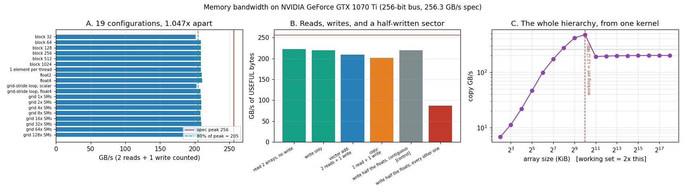

# HBM Saturation

---

> The brief was "tune until you exceed 80% of peak bandwidth". The textbook one-line vector add hit **81.4% before any tuning at all**, and 19 configurations later the best was **82.2%**. Every knob in the project — vector width, block size, grid size, grid-stride loops — is worth **1.047x in total**. The interesting findings turned out to be somewhere else entirely.

---

## Key Insight

A vector add has an [arithmetic intensity](/shared/glossary/#ai-arithmetic-intensity) of 0.083 FLOP/byte against a [ridge point](/shared/glossary/#ridge-point) of 32 — it is **400x** into memory-bound territory. Its runtime is therefore a direct readout of [memory bandwidth](/shared/glossary/#memory-bandwidth) and nothing else, which makes it the standard instrument for asking what the memory system will actually give you.

The answer here: everything, immediately, as long as the accesses are [coalesced](/shared/glossary/#memory-coalescing). What *does* move the number is subtler — **whether you mix reads with writes** (10%), and **whether your stores fill whole sectors** (2.53x).

## Why This Matters

Most deep-learning operations that are not matmuls are exactly this kernel wearing a different name: elementwise add, GeLU, dropout, LayerNorm's normalisation pass, optimiser updates. Knowing that they run at the memory roof the moment they are coalesced tells you where *not* to spend a week, and knowing that the only remaining lever is **fusing them so there are fewer passes** tells you where to spend it.

---

**This is project 14.**

### The words first

- **[HBM](/shared/glossary/#hbm)** — *High Bandwidth Memory*: DRAM dies stacked vertically and connected to the GPU by thousands of tiny vertical wires through the silicon, giving a very wide bus (1024 bits per stack, several stacks). An H100 gets 3350 GB/s this way.
- **[GDDR](/shared/glossary/#gddr)** — the older, cheaper approach: ordinary DRAM chips soldered around the GPU on a narrower bus, clocked very fast. **This GPU has GDDR5 at 256 GB/s** — 13x less than an H100. Every technique and every failure mode in this project is identical on both; the same DRAM physics is simply behind a narrower bus. Where the text says "HBM saturation", read "off-chip memory saturation".
- **[DRAM](/shared/glossary/#dram)** — *dynamic* RAM: each bit is a tiny capacitor that leaks and must be refreshed thousands of times a second. Cheap and dense, but reading it means activating a whole **row** of thousands of bits at once — which is why access patterns matter so much.
- **Bus turnaround** — the wires between the chip and memory carry data *both* ways, so the bus has to be switched from "reading" to "writing" and back. The switch costs idle cycles. Section B measures the price.
- **Sector** — the 32-byte unit from [project 11](../11-coalesced-vs-non-coalesced/README.md). It applies to stores too, and section B shows what that costs.
- **[Grid-stride loop](/shared/glossary/#grid-stride-loop)** — instead of one thread per element, launch a fixed grid and have each thread walk the array in steps of the whole grid. Works for any input size with one launch configuration.

### Peak bandwidth, computed rather than looked up

```
memory clock 4004 MHz  x  2 (DDR: data on both clock edges)  x  256 bits / 8
= 256.26 GB/s
```

That is where every "% of peak" below comes from. **DDR** = *double data rate*: the memory transfers on both the rising and the falling edge of the clock, hence the factor of 2. The bus width, 256 bits, is the number of wires — this is the number HBM makes enormous.

---

## Running it

```bash
python run.py       # ~9 s: compiles hbm.cu, runs 3 experiments, plots
```

Five 256 MB arrays. Hardware: **GTX 1070 Ti**, 19 [SMs](/shared/glossary/#sm), 256-bit GDDR5 bus, 2 MB [L2](/shared/glossary/#l2-cache).

> **About the numbers.** All figures come from the committed
> [`outputs/findings.json`](outputs/findings.json) and
> [`outputs/findings.csv`](outputs/findings.csv).



---

## A. Tuning: 19 configurations, 1.047x apart

Bytes are counted as 2 reads + 1 write = 768 MB per launch.

| variant | GB/s | % of peak | vs textbook |
|---|---:|---:|---:|
| 1 element per thread (textbook) | 208.67 | **81.4%** | 1.000x |
| float2 (8 B per instruction) | 210.14 | 82.0% | 1.007x |
| float4 (16 B per instruction) | **210.69** | **82.2%** | 1.010x |
| grid-stride loop, scalar | 202.25 | 78.9% | 0.969x |
| grid-stride loop, float4 | 208.24 | 81.3% | 0.998x |

| block size | GB/s | % of peak |
|---:|---:|---:|
| 32 | 201.18 | 78.5% |
| 64 | 208.90 | 81.5% |
| 128 | 208.85 | 81.5% |
| 256 | 208.64 | 81.4% |
| 512 | 208.70 | 81.4% |
| 1024 | 208.65 | 81.4% |

| grid size | GB/s | % of peak |
|---:|---:|---:|
| 19 blocks (1/SM) | 209.12 | 81.6% |
| 152 blocks (8/SM) | 208.27 | 81.3% |
| 2432 blocks (128/SM) | 209.82 | 81.9% |

**Every configuration is between 78.5% and 82.2% of peak.** Total spread: **1.047x**.

The 80% target was met by the four-line kernel a beginner writes first, and the entire tuning exercise then moved it by **0.8 percentage points**.

This is worth sitting with, because it inverts the usual advice:

- **`float4` vectorised loads: 1.010x.** The classic "always use float4" tip. (Project 3 measured 1.025x on a copy; project 8 measured 1.008x for block size on a pointer chase. Three independent measurements, same verdict.)
- **Block size across a 32x range: 1.038x**, and everything from 64 upward is a tie. Only 32 threads/block loses, and mildly.
- **Grid size across 128x: 1.007x.** One block per SM is as good as 128.
- **The grid-stride loop is 3% *slower*** in its scalar form. It is a portability idea — one launch configuration for any input size — not a performance one, and here it costs a little.

The reason all of these are null is the same: **on a kernel with no reuse to find, the DRAM bus is the only bottleneck, and it is already saturated.** These knobs all adjust how instructions are issued, and the memory system is not waiting on instructions. Project 8 found the identical thing for occupancy: past the point where the machine is fed, more of the same buys nothing.

*(Why 82% and not 100%? DRAM refresh, [bus turnaround](#b-what-does-a-byte-cost) between the reads and the write, and row activation overhead. 80–85% is the practical ceiling for a mixed read/write kernel on any GPU. If someone reports 95%+, check whether they are counting bytes the [L2](/shared/glossary/#l2-cache) served.)*

---

## B. What does a byte cost?

If tuning is a dead end, what *does* change the number? Two things, and neither is in the usual checklist.

| kernel | ms | useful GB/s |
|---|---:|---:|
| read 2 arrays, no write | 2.412 | **222.55** |
| write only | 1.220 | 220.00 |
| vector add: 2 reads + 1 write | 3.859 | 208.66 |
| copy: 1 read + 1 write | 2.667 | 201.29 |
| write half the floats, contiguous **[control]** | 0.611 | 219.72 |
| write half the floats, every other one | 1.545 | **86.89** |

### 1. Writes are cheap. Mixing is not.

Reads alone: 222.6 GB/s. Writes alone: 220.0 GB/s — **98.9% as fast**. So a store is not intrinsically expensive, which is already worth knowing (on a CPU it often is, because a partial write triggers a fetch of the line first).

But one read plus one write is **201.3 GB/s, 10% below read-only**. Nothing about the access pattern changed; both halves are perfectly coalesced. What changed is that the bus now has to keep reversing direction.

Sweeping the ratio:

| reads per write | GB/s | % of peak |
|---|---:|---:|
| 1 : 1 | 201.32 | 78.6% |
| 2 : 1 | 208.64 | 81.4% |
| 3 : 1 | 208.76 | 81.5% |
| 4 : 1 | 209.10 | 81.6% |
| read-only | **222.55** | 86.8% |

**The penalty saturates immediately.** Going from 1:1 to 2:1 recovers most of it; 2:1 to 4:1 recovers 0.2%. One write in the mix costs nearly the whole 6%; more reads barely dilute it.

Practical consequence: fusing two elementwise ops (so you write once instead of twice) helps mostly by **halving the total bytes**, not by improving the ratio — the ratio is nearly free past 2:1. Count bytes, not directions.

### 2. The half-written sector: 2.53x for the same data

Writing every *other* float takes **1.545 ms**; writing the same *number* of floats contiguously takes **0.611 ms**. That control matters — without it, "strided stores are slow" could just mean "half as many threads ran".

Two hypotheses for what the hardware does with a half-filled 32-byte sector, and the arithmetic kills one of them:

| hypothesis | traffic | required bandwidth | verdict |
|---|---|---:|---|
| read-modify-write: fetch the sector, merge, store it | 2x = 512 MB | **348 GB/s** | **impossible** — above the 256 GB/s bus |
| write the whole sector with byte enables | 1x = 256 MB | 174 GB/s | plausible (79% of the write-only rate) |

So this GPU does **not** fetch a sector in order to partially overwrite it — no read-for-ownership. But it still moves the **entire sector**, so half of your write bandwidth is spent shipping bytes you never touched. That is [project 11](../11-coalesced-vs-non-coalesced/README.md)'s lesson exactly, now on the store side: the sector is the quantum in both directions.

This is a real measurement of an architectural property, made with a stopwatch and a subtraction, on a machine where the hardware counters are locked. It is worth noticing that the *impossible* hypothesis is what ruled itself out — a required bandwidth above the physical bus is a proof, not an estimate.

---

## C. The whole memory hierarchy, drawn by one copy kernel

Same kernel, array size from 4 KiB to 256 MiB. The working set is 2x the array (one in, one out).

| array | working set | ms | GB/s |
|---:|---:|---:|---:|
| 4 K | 8 K | 0.0012 | 6.78 |
| 64 K | 128 K | 0.0013 | 99.04 |
| 256 K | 512 K | 0.0019 | 277.02 |
| 512 K | 1024 K | 0.0025 | 415.40 |
| **1024 K** | **2048 K** | 0.0044 | **475.43** ← L2 capacity |
| **2048 K** | **4096 K** | 0.0220 | **191.03** |
| 8192 K | 16384 K | 0.0850 | 197.40 |
| 65536 K | 131072 K | 0.6706 | 200.14 |
| 262144 K | 524288 K | 2.6818 | 200.19 |

**One doubling of the array size costs 2.5x the bandwidth** — 475 GB/s down to 191 — and it happens at exactly the point where the working set stops fitting in the 2 MB L2. Not near it, at it. ([Project 3](../03-bandwidth-measurement/README.md) measured the same cliff at the same place — 684 GB/s at a 2 MiB working set, 196 GB/s at 4 MiB — with a different kernel; this is the independent reproduction.)

Two things to read off this table.

**475 GB/s is 1.9x the DRAM chips' spec peak.** No law was broken: those bytes never went near the DRAM chips. This is the practical definition of a cache hit, expressed in the only unit you can measure without a profiler. It is also a warning about benchmarks — quote a bandwidth number without the working-set size and it means nothing.

**The tiny sizes are not measuring memory at all.** 4 KiB "achieves" 6.78 GB/s, which looks catastrophic until you notice the time: 1.2 microseconds, which is the [kernel launch overhead](/shared/glossary/#kernel-launch-overhead) measured in [project 3](../03-bandwidth-measurement/README.md) (1.11 µs). Below about 256 KiB you are timing the launch, not the copy. Any bandwidth benchmark that starts at small sizes and reports a rising curve is partly plotting its own overhead.

---

## What to take away

1. **The textbook vector add already runs at 81.4% of peak.** The whole tuning sweep — 19 configurations — spans 1.047x. Check before you optimise.
2. **`float4` bought 1.010x, block size 1.038x, grid size 1.007x.** Three of the most-repeated GPU tips, all null on a bandwidth-bound kernel, matching projects 3 and 8.
3. **The grid-stride loop is a portability tool, not a speed tool** — 3% slower here.
4. **Writes cost the same as reads (98.9%); mixing them costs 10%,** because the DRAM bus has to reverse direction. The penalty saturates past a 2:1 ratio.
5. **A half-filled store sector costs 2.53x for the same data.** Sectors are the quantum for stores as well as loads.
6. **Read-for-ownership was ruled out by arithmetic:** it would have required 348 GB/s on a 256 GB/s bus. You can measure architecture without a profiler if you can find a number that is physically impossible.
7. **The L2 cliff is 2.5x for one doubling,** exactly at capacity — and a 475 GB/s "bandwidth" is 1.9x the memory chips' peak, because it never reached them.
8. **Below ~256 KiB you are timing kernel launches**, not memory.
9. **The only real lever left on this class of kernel is fewer passes.** You cannot make a pass faster, so fuse them. That is what [project 20](../20-fused-layernorm/README.md) does.

## Files

| File | What it is |
|---|---|
| [`hbm.cu`](hbm.cu) | five vector-add variants, the read/write cost kernels, the size sweep |
| [`run.py`](run.py) | compiles, runs, tests the two sector hypotheses, prints tables, plots |
| [`outputs/findings.json`](outputs/findings.json) | headline ratios plus every raw measurement |
| [`outputs/findings.csv`](outputs/findings.csv) | one row per measurement |
| [`outputs/bandwidth.png`](outputs/bandwidth.png) | the three panels above |

## Next

[Project 15 — L2 hit rate analysis](../15-l2-hit-rate-analysis/README.md) picks up the loose thread from section C. The L2 cliff proves the cache is doing work; the next project measures **how much**, for a real attention kernel, without any hardware counters — by turning the cliff itself into a measuring instrument.
