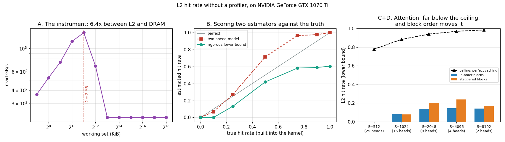

# L2 Hit Rate Analysis

---

> The tool this project was supposed to use — Nsight Compute — **cannot run on this machine**. So the hit rate had to be measured with a stopwatch instead. Building the instrument turned out to be more instructive than reading the number would have been: the obvious estimator **overstates the hit rate by 0.22**, and the one that survives is a bound with no model in it at all. Applied to attention, it says L2 captures **0.14 of a possible 0.97** — and that reordering blocks, changing nothing about how many bytes are read, is worth **12.4%**.

---

## Key Insight

An [L2](/shared/glossary/#l2-cache) hit and a [DRAM](/shared/glossary/#dram) hit arrive at very different speeds — 1414 vs 221 GB/s here, a **6.4x** gap. That gap is a measuring instrument: a kernel's achieved bandwidth sits somewhere inside it, and where it sits tells you how often it hit. The catch is that *how* you convert bandwidth into a hit rate matters enormously, and this project tests two conversions against a kernel whose hit rate is known in advance.

## Why This Matters

Two lessons, and the second is the bigger one. First: **you can measure architecture without a profiler**, which matters on locked-down cloud instances and shared machines far more often than tutorials admit. Second: **an estimator you have not validated is a guess**. The plausible-looking model here was wrong by 0.22, and the only way to find that out was to build a kernel whose answer was known.

---

**This is project 15.**

### The words first

- **[L2 cache](/shared/glossary/#l2-cache)** — a 2 MB memory on the GPU chip, shared by all [SMs](/shared/glossary/#sm), that holds recently used data so a second read does not have to go to DRAM. Unlike [shared memory](/shared/glossary/#shared-memory), you do not control it: it decides what to keep.
- **Hit rate** — the fraction of memory requests served by the cache instead of DRAM. "Hit" as in hitting the target; a "miss" goes all the way to memory.
- **[Working set](/shared/glossary/#working-set)** — the bytes a kernel is actively re-reading at a given moment. If it fits in the cache, the hit rate is high. If it is one byte too big, everything can be evicted before it is reused.
- **Compulsory traffic** — the bytes a kernel *must* read at least once, no matter how perfect the cache is. Perfect caching means the hit rate is `1 − compulsory / asked`, and that is a ceiling nothing can beat.
- **[Nsight Compute](/shared/glossary/#nsight-compute)** — NVIDIA's kernel profiler. It reports `l2_tex_hit_rate` directly, from hardware counters. It fails here with `ERR_NVGPUCTRPERM`: since 2019 the counters are root-only by default (see [project 6](../06-nvidia-smi-deep-dive/README.md)).
- **Attention** — for each query, score it against every key, softmax the scores, and take that weighted average of the values. The memory-relevant fact: **every query block reads all of K and V**, so K and V are read over and over. That is a lot of reuse available for a cache to capture.

### Why bother measuring by hand — wouldn't the profiler just tell us?

On a machine where it runs, yes, and you should use it. But three things make the hand-built version worth doing even then.

**It is often unavailable.** Counter access needs a kernel-module setting and a reboot. On shared clusters, managed notebooks, and most cloud instances you will not get it.

**A profiler reports the hit rate; it does not tell you whether the hit rate is the problem.** Section C finds a hit rate of 0.14 against a ceiling of 0.97, which looks like a disaster — and section D then shows that fixing it moves the *real* kernel by 2.8%, because attention is not memory-bound. The profiler number alone would have sent you optimising the wrong thing.

**Building the instrument forces you to define what you are measuring.** Section B is the whole project: two reasonable ways to turn a bandwidth into a hit rate, scored against the truth, and one of them is badly wrong.

---

## Running it

```bash
python run.py       # ~5 s: compiles l2.cu, calibrates, validates, measures
```

Hardware: **GTX 1070 Ti**, 19 SMs, **2 MB L2**, 221 GB/s DRAM read bandwidth.

The attention kernel is a real one — FlashAttention-style streaming with an online softmax — and is checked against a CPU reference at S=256: **max absolute error 5.8e-08**.

> **About the numbers.** All figures come from the committed
> [`outputs/findings.json`](outputs/findings.json) and
> [`outputs/findings.csv`](outputs/findings.csv).



---

## A. Calibration: the instrument

One kernel, reading a working set that grows from 128 KiB to 256 MiB.

| working set | GB/s |
|---:|---:|
| 128 K | 365.21 |
| 512 K | 740.45 |
| 1024 K | 1167.72 |
| **2048 K** | **1414.26** ← L2 capacity |
| 4096 K | 680.33 |
| 8192 K | 220.61 |
| 262144 K | 220.52 |

**1414 GB/s from L2, 221 GB/s from DRAM: a 6.4x gap**, and the fall is one doubling wide, centred exactly on the 2 MB capacity. ([Project 3](../03-bandwidth-measurement/README.md) and [project 14](../14-hbm-saturation/README.md) found the same cliff at the same place with different kernels — three independent confirmations.)

Note the small sizes are *slower*, not faster: below 512 KiB there is not enough work to fill the machine, so the measurement drifts toward [kernel launch overhead](/shared/glossary/#kernel-launch-overhead) rather than cache speed. The instrument only works in the middle of its range — which is itself worth knowing before you trust it.

---

## B. Validation: two estimators, one truth

The temptation is to take the two anchors and interpolate. Before doing that on a real kernel, test it on one whose answer is already known.

**The test kernel.** Each [warp](/shared/glossary/#warp) decides, per iteration, to read either a **512 KB hot buffer** (small enough to live in L2 permanently) or a **256 MB cold buffer** (far too big). The decision is warp-uniform and the 32 lanes always read 32 consecutive floats, so both paths are equally [coalesced](/shared/glossary/#memory-coalescing) — **the only thing that varies is locality**. The true hit rate is the hot fraction, by construction.

**Estimator 1 — the two-speed model.** If a kernel spends its time doing hits at `B_L2` and misses at `B_DRAM`, the times add up:

```
1 / achieved = h / B_L2 + (1 − h) / B_DRAM
```

**Estimator 2 — the rigorous lower bound.** No model at all, just one fact: DRAM cannot deliver more than `B_DRAM`. So in time *t*, at most `B_DRAM × t` bytes came from DRAM, and everything else came from cache:

```
h ≥ 1 − B_DRAM / achieved
```

| true hit rate | GB/s | two-speed model | error | lower bound | valid? |
|---:|---:|---:|---:|---:|:--|
| 0.00 | 211.02 | 0.000 | +0.000 | 0.000 | yes |
| 0.10 | 220.34 | 0.068 | −0.032 | 0.000 | yes |
| 0.25 | 254.01 | 0.272 | +0.022 | 0.132 | yes |
| 0.50 | 379.37 | **0.714** | **+0.214** | 0.419 | yes |
| 0.75 | 528.70 | **0.966** | **+0.216** | 0.583 | yes |
| 0.90 | 537.50 | 0.977 | +0.077 | 0.590 | yes |
| 1.00 | 557.88 | 1.000 | +0.000 | 0.605 | yes |

**The two-speed model is wrong by up to 0.22, always in the same direction: it overstates.** A kernel that truly hits half the time is reported as hitting 71% of the time. If you had trusted it, you would have concluded your cache was working well and stopped optimising.

The reason is in the assumption. The model says hit time and miss time **add up**, i.e. that the two happen one after another. They do not: while a warp waits on a DRAM miss, other warps are being served from L2. The two paths **overlap**, so a mixed kernel is faster than the model predicts — and the model reads that extra speed as extra hits. (Project 12 hit the same wall from the other side: a `max()` model there was *optimistic* by 27% in the crossover, for the mirror-image reason. Overlap always sits between "add" and "max", and neither endpoint is right.)

**The lower bound was never violated on any row,** and it needs no assumption about overlap because it is not a model of anything — it is a statement about what DRAM is physically capable of. Its price is that it is loose: at a true 1.00 it only claims 0.605.

That trade is the right one here. A bound that is true and loose beats an estimate that is tight and wrong by 0.22, because you can act on the first and not on the second. **The rest of this project uses the bound.**

---

## C. Attention: 0.14 of a possible 0.97

Each block streams the whole of K and V past its 64 queries, so K and V are read once *per query block*. With `S/64` query blocks per head, that is a large amount of re-reading — exactly what a cache exists for.

| S | heads | blocks | K+V per head | asked | ceiling | GB/s | h ≥ | TFLOP/s |
|---:|---:|---:|---:|---:|---:|---:|---:|---:|
| 512 | 29 | 232 | 0.26 MB | 68 MB | 0.778 | 218.35 | **0.000** | 1.19 |
| 1024 | 15 | 240 | 0.52 MB | 134 MB | 0.882 | 239.65 | 0.080 | 1.27 |
| 2048 | 8 | 256 | 1.05 MB | 277 MB | 0.939 | 255.81 | 0.138 | 1.37 |
| 4096 | 4 | 256 | 2.10 MB | 545 MB | 0.969 | 257.61 | **0.144** | 1.38 |
| 8192 | 2 | 256 | 4.19 MB | 1082 MB | 0.984 | 256.70 | 0.141 | 1.39 |

"Ceiling" is what a perfect cache would achieve: `1 − compulsory / asked`. Every configuration has 0.78–0.98 of its traffic available to be cached. **L2 delivers at least 0.14 of it, and the true value is somewhere between that and the ceiling.**

The obvious hypothesis is capacity — K and V per head are only 0.26 MB at S=512, comfortably inside a 2 MB L2, so why doesn't it all fit? Because *one head's* K/V is not the working set. About 114 blocks are resident at once (6 blocks per SM x 19 SMs), and those blocks span several heads:

| S | resident blocks span | live K/V | vs 2 MB L2 |
|---:|---:|---:|---|
| 512 | 14 heads | 3.67 MB | over |
| 1024 | 7 heads | 3.67 MB | over |
| 2048 | 3 heads | 3.15 MB | over |
| 4096 | 1 head | 2.10 MB | over |
| 8192 | 1 head | 4.19 MB | over |

**The live working set is 2.1–4.2 MB at every sequence length, and barely depends on S at all.** Short sequences have small per-head K/V but many heads in flight; long sequences have one head with large K/V. The product is roughly constant, because it is really `resident_blocks × BQ × 2 × D × 4` — a property of **how many blocks the GPU keeps resident**, not of the sequence length.

That is a genuinely useful thing to know, and it is not what the intuitive story ("long sequences blow the cache") predicts. It also says what the fix would be: fewer resident blocks, or a launch order that keeps co-resident blocks inside the same head. Which is section D.

---

## D. Same bytes, same footprint, different order — and the prediction was wrong

`stagger` makes block *b* start its sweep at tile *b* instead of tile 0. Every block still reads every tile of K and V. The byte count, the footprint, and the instruction count are all **identical**; only the order changes.

The prediction going in was that **in-order should win**: if every block marches through the tiles together, they all want the same tile at the same moment, and one copy in L2 serves everyone.

| S | in-order GB/s | staggered GB/s | change | h ≥ in-order | h ≥ staggered | real kernel |
|---:|---:|---:|---:|---:|---:|---:|
| 512 | 218.35 | 218.07 | −0.1% | 0.000 | 0.000 | +0.0% |
| 1024 | 239.65 | 239.12 | −0.2% | 0.080 | 0.078 | +0.1% |
| 2048 | 255.81 | 277.47 | +8.5% | 0.138 | 0.205 | +2.1% |
| 4096 | 257.61 | **289.57** | **+12.4%** | 0.144 | **0.238** | +2.8% |
| 8192 | 256.70 | 265.76 | +3.5% | 0.141 | 0.170 | +0.1% |

**Staggering wins, by up to 12.4%.** The opposite of the prediction.

Why perfect synchrony loses: when 114 blocks demand the same tile in the same instant, they queue. The L2 is physically split into slices addressed by memory address, so one hot tile lives on one slice and every request funnels through it; behind it, one set of DRAM banks serves the miss. Staggered blocks spread their requests across all the slices and all the banks. **Parallelism in the memory system beats locality here, because the locality was so extreme it became a hotspot.**

Two guards on this conclusion. First, the improvement is measured by a *bound*, so those extra bytes really did come from cache — this cannot be explained away as DRAM getting luckier, because a bound of 0.238 means at least 23.8% of the traffic did not touch DRAM at all. Second, the effect vanishes at S=512 and S=8192: at 512 the tiles are so small that everything is a hotspot either way, and at 8192 one head's K/V is 4.19 MB, so blocks drift apart on their own and staggering adds little.

### And the number that keeps this honest

On the **real** kernel — the one that also does the softmax arithmetic — the same 12.4% memory-side win is worth **2.8%**.

Attention is running at 1.39 TFLOP/s against an 8.19 TFLOP/s peak and is spending most of its time on FMAs, not waiting for memory. A memory optimisation pays only in proportion to the share of runtime that was memory. This is [Amdahl's law](/shared/glossary/#amdahls-law) in its most practical form, and it is exactly the check a bare `l2_hit_rate = 14%` from a profiler would not have prompted you to make.

---

## What to take away

1. **A 6.4x speed gap between L2 and DRAM is a measuring instrument.** You do not need hardware counters to measure a cache; you need a calibrated stopwatch.
2. **Validate your estimator against a known answer before you trust it.** Building a kernel with a hit rate of exactly 0.50 costs twenty lines and is the only reason the next point is known.
3. **The two-speed model overstates the hit rate by up to 0.22,** because hits and misses overlap rather than queueing. It is exactly right at both endpoints, which is what makes it so convincing and so misleading in the middle.
4. **Prefer the bound.** `h ≥ 1 − B_DRAM/achieved` assumes nothing, was never violated, and is enough to act on.
5. **Attention's L2 working set is set by residency, not by sequence length.** 2.1–4.2 MB across a 16x range of S, because short sequences run more heads at once.
6. **L2 captured at least 0.14 of an available 0.97.** Most of attention's reuse is not being caught by the cache — which is precisely why [FlashAttention](../21-mini-flashattention/README.md) moves that reuse into [shared memory](/shared/glossary/#shared-memory), where it is *managed* instead of hoped for.
7. **Block order is worth 12.4% with the byte count held fixed** — and in the opposite direction from the prediction. Perfect synchrony makes a hotspot; spreading requests uses more of the memory system.
8. **The same change is worth 2.8% on the real kernel.** Always ask what fraction of the runtime the thing you improved was responsible for.
9. **An unusable profiler is not a blocked project.** Every measurement in this phase — [occupancy](../08-occupancy-study/README.md), [pipe utilisation](../07-tensor-core-utilization/README.md), sector traffic, and now hit rate — was recovered from timings, and understanding them is better for it.

## Files

| File | What it is |
|---|---|
| [`l2.cu`](l2.cu) | the calibration kernel, the known-hit-rate kernel, the attention kernel and its memory twin, the CPU check |
| [`run.py`](run.py) | compiles, calibrates, scores both estimators, applies the bound, plots |
| [`outputs/findings.json`](outputs/findings.json) | anchors, headline numbers, every raw measurement |
| [`outputs/findings.csv`](outputs/findings.csv) | one row per measurement |
| [`outputs/l2_hit_rate.png`](outputs/l2_hit_rate.png) | the three panels above |

## Next

Phase 3 ends here. Every project in it has said the same thing from a different angle: **the bytes decide.** [Phase 4](../../README.md#phase-4-cuda-triton-and-writing-real-kernels) starts writing kernels that act on it — beginning with [project 16](../16-cuda-vector-add/README.md) and building to [project 21](../21-mini-flashattention/README.md), which takes attention's reuse away from the L2 cache measured here and puts it in shared memory, where you control it.
