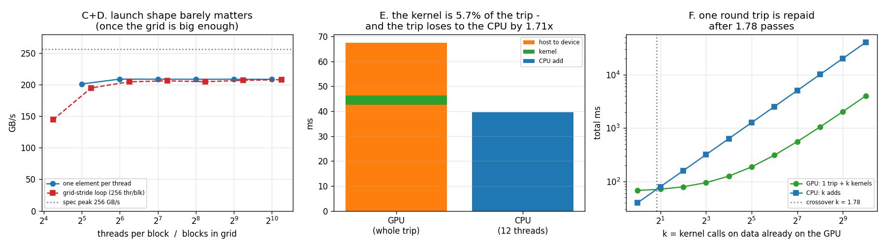

# CUDA Vector Add

---

> The "Hello World" of [GPU](/shared/glossary/#gpu) programming, run honestly end to end. The [kernel](/shared/glossary/#kernel) itself is excellent — **208.8 GB/s, 81% of this card's peak, with zero tuning**. It is also **5.7% of the time the program actually takes**, and the whole GPU trip is **1.71x slower than just adding the two vectors on the CPU**. Along the way: a stopwatch that reports the kernel as **228x faster than it is**, a block-size sweep that moves nothing (**1.038x across a 32x range**), and a missing bounds check that the runtime reports as **`cudaSuccess`**.

---

## Key Insight

Writing the kernel is the easy part, and this project shows you the whole of it in nine lines. The hard part is everything around the kernel: getting the data there, knowing when it finished, and noticing that the *reason* to use a GPU is not "this operation is faster" but "this operation is faster **and the data is already there**." A vector add is the cleanest possible way to see that, because its kernel is perfect and it still loses.

## Why This Matters

Almost every beginner's first CUDA program is this one, and almost every beginner concludes one of two wrong things from it: either "wow, GPUs are 50x faster" (they timed the launch, not the work) or "GPUs are a scam, mine was slower" (they timed the round trip and never reused the data). Both mistakes are measured here, with the numbers that explain them. The habits that fix them — synchronise before you read a clock, count the transfers, ask how many passes the data will get — are the habits every later project in this phase depends on.

---

**This is project 16.**

### The words first

- **[Kernel](/shared/glossary/#kernel)** — the function that runs on the GPU. The name comes from the mathematical/engineering sense of "kernel" as the innermost part of something: it is the small piece of code at the centre of a loop, and the GPU runs it for every element instead of you writing the loop.
- **Thread / [block](/shared/glossary/#block) / [grid](/shared/glossary/#grid)** — one *thread* runs the kernel once. Threads are grouped into *blocks* (they can talk to each other through [shared memory](/shared/glossary/#shared-memory) and synchronise). Blocks are grouped into a *grid*. You choose the block size and the grid size at every launch; that pair is the **launch configuration**.
- **[Warp](/shared/glossary/#warp)** — 32 threads that execute in lockstep on NVIDIA hardware. Blocks are cut into warps by the hardware, which is why block sizes are always multiples of 32.
- **[SM](/shared/glossary/#sm) (Streaming Multiprocessor)** — one of the GPU's independent processors. This card has 19. Blocks are handed out to SMs; a **wave** is one full round of blocks across all SMs.
- **[SIMT](/shared/glossary/#simt)** — Single Instruction, Multiple Threads. NVIDIA's name for the way one instruction is issued to all 32 lanes of a warp at once. It is why you write code that looks single-threaded and get thousands of threads.
- **[Pinned (page-locked) memory](/shared/glossary/#pinned-memory)** — host memory the operating system has promised never to move or swap out. "Pinned" as in nailed to a fixed physical address.
- **[PCIe](/shared/glossary/#pcie)** — the cable-in-a-slot connecting the GPU to the rest of the computer. Everything that crosses between CPU memory and GPU memory crosses this.
- **[Grid-stride loop](/shared/glossary/#grid-stride-loop)** — a kernel where each thread handles element `i`, then `i + total_threads`, then `i + 2*total_threads`, and so on. "Stride" is the step size it jumps by, and the step is the size of the whole grid — hence the name.
- **[Occupancy](/shared/glossary/#occupancy)** — how many warps are resident on an SM compared to the maximum it could hold. High occupancy gives the [warp scheduler](/shared/glossary/#warp-scheduler) more warps to switch to while others wait on memory.

### Why measure any of this — isn't a vector add obviously right?

The kernel is obviously right. The *program* is where all four of the following live, and each one is a bug that will not announce itself:

**The clock lies by default.** A kernel launch is [asynchronous](/shared/glossary/#cuda-stream): the CPU queues the work and immediately moves on. If you take a host-side timestamp on either side of the launch, you have timed the queueing, not the computing. Section B measures the size of that lie.

**The error check does not check what you think.** `cudaGetLastError()` immediately after a launch reports only whether the *launch* was accepted. A thread writing past the end of an array is an execution-time fault, and you will not see it until the next synchronisation — if you see it at all. Section G shows one out-of-bounds kernel returning `cudaSuccess` twice.

**The transfers are the program.** Section E times them: 63.7 ms of PCIe traffic wrapped around 3.9 ms of arithmetic.

**The tuning advice is mostly folklore at this size.** "Tune your block size" is standard first-project advice. Section C tunes it across a 32x range and gets 1.038x, which is worth knowing before you spend an afternoon on it.

---

## Running it

```bash
python run.py       # ~6 s: compiles vecadd.cu, runs it twice, tabulates, plots
```

Hardware: **GTX 1070 Ti**, 19 SMs, 8 GB GDDR5, spec peak [memory bandwidth](/shared/glossary/#memory-bandwidth) **256.3 GB/s**, PCIe 3.0 x16.

Problem size: **n = 67,108,864 floats** (64 Mi, 256 MB per array). One pass moves 805 MB — two arrays read, one written.

The out-of-bounds section runs in a **separate process**, because an illegal memory access destroys the CUDA context: every later CUDA call in that process fails, including the ones that would have printed your results.

> **About the numbers.** Every figure below comes from the committed
> [`outputs/findings.json`](outputs/findings.json) and
> [`outputs/findings.csv`](outputs/findings.csv).



---

## The kernel, in full

```cuda
__global__ void vadd(const float *a, const float *b, float *c, int n) {
    int i = blockIdx.x * blockDim.x + threadIdx.x;
    if (i < n) c[i] = a[i] + b[i];
}
```

Three ideas and nothing else:

1. `__global__` means "callable from the CPU, runs on the GPU."
2. `blockIdx.x * blockDim.x + threadIdx.x` turns *which thread am I* into *which element do I own*. This is the only address arithmetic in the file, and it is the reason the access is [coalesced](/shared/glossary/#memory-coalescing): thread 0 reads `a[0]`, thread 1 reads `a[1]`, and so the 32 threads of a warp ask for 32 adjacent floats, which the memory system serves as a handful of transactions instead of 32.
3. `if (i < n)` — the bounds check, and the part beginners delete.

### Why the bounds check, when the grid was sized from `n`?

Because it cannot be sized from `n` exactly. Launches come in whole blocks, so with 256 threads per block you launch `ceil(n / 256)` blocks, and unless `n` is a multiple of 256 the last block has leftover threads with no element to own. With n = 1000 and 256-thread blocks you launch 4 blocks = 1024 threads, and 24 of them have nothing to do. Without the check, they write 24 floats past the end.

The runtime's reaction to that is section G, and it is not what you would hope.

---

## A. Correctness first

Max absolute difference between the GPU result and a CPU `double` reference over all 67 million elements: **5.960e-08**.

That is not zero, and it should not be. Both sides compute in `float`; the CPU reference accumulates in `double`, so the difference is a single rounding of a `float` addition (~1.2e-07 relative near 1.0). A *bitwise* match would actually be the surprising result here. Getting into the habit of checking against a reference — and of knowing what error is acceptable — is what makes every later project in this phase trustworthy.

---

## B. The stopwatch trap: 228x

The same kernel, timed two ways with a plain host clock:

| how it was timed | reported |
|---|---:|
| host clock, launch only, no synchronise | **0.0170 ms** |
| host clock, launch + `cudaDeviceSynchronize()` | **3.8731 ms** |

**A factor of 228.** The first number is how long it took the CPU to *ask* for the work. The GPU had not started.

This is the single most common way a GPU benchmark is wrong, and it always errs in the flattering direction, which is why it survives review. Two fixes:

- `cudaDeviceSynchronize()` before reading the clock, as above; or
- **CUDA events**, which are timestamps recorded *in the GPU's own work queue*. That is what the rest of this project uses. Events are better because they measure only the GPU's execution, without the host's queueing jitter, and because they cost nothing extra — you are not stopping the pipeline to measure it.

Note also: 0.0170 ms ≈ 17 µs is not the [launch overhead](/shared/glossary/#kernel-launch-overhead) either. [Project 3](../03-bandwidth-measurement/README.md) measured the real floor at **1.11 µs** for an empty kernel. 17 µs here is the first-call cost of this particular launch; the point stands that neither number is the kernel.

---

## C. Block size: a 32x range, worth 1.038x

One element per thread, sweeping the block size from the minimum useful value to the hardware maximum:

| threads/block | blocks | ms | GB/s |
|---:|---:|---:|---:|
| 32 | 2,097,152 | 4.0009 | 201.28 |
| 64 | 1,048,576 | 3.8537 | **208.97** |
| 128 | 524,288 | 3.8562 | 208.83 |
| 256 | 262,144 | 3.8572 | 208.78 |
| 512 | 131,072 | 3.8573 | 208.77 |
| 1024 | 65,536 | 3.8590 | 208.68 |

**Spread from best to worst: 1.038x**, and everything from 64 upward is within 0.15% of everything else.

Two things to take from this. First, **208.8 GB/s is 81.5% of the 256.3 GB/s spec peak, with no tuning at all** — the naive kernel is essentially as good as this operation gets (see [project 14](../14-hbm-saturation/README.md), which spent an entire project trying to beat exactly this number and moved it by 4.7%).

Second, the only configuration that loses is 32 threads per block, and it loses for a structural reason: one block is one warp, and the hardware caps how many *blocks* an SM can hold (32 on this card) independently of how many warps. At 32 threads per block you hit the block limit at 32 warps and cannot fill the SM, so there are fewer warps available to hide memory latency. The fix is not "tune harder", it is "do not use one-warp blocks."

[Project 8](../08-occupancy-study/README.md) reached the same conclusion from the other direction and put a number on it: throughput was flat above 19.8% achieved occupancy. Block size mostly moves occupancy, and occupancy mostly does not move a memory-bound kernel that already has enough warps.

---

## D. The grid-stride loop: what it is actually for

```cuda
__global__ void vadd_gridstride(const float *a, const float *b, float *c, int n) {
    int stride = gridDim.x * blockDim.x;
    for (int i = blockIdx.x * blockDim.x + threadIdx.x; i < n; i += stride)
        c[i] = a[i] + b[i];
}
```

Instead of one thread per element, launch a fixed number of threads and let each one loop. "Waves" below means blocks per SM: 1 wave = 19 blocks, one per SM.

| waves | blocks | ms | GB/s |
|---:|---:|---:|---:|
| 1 | 19 | 5.5664 | 144.67 |
| 2 | 38 | 4.1282 | 195.07 |
| 4 | 76 | 3.9344 | 204.69 |
| 8 | 152 | 3.9050 | 206.23 |
| 16 | 304 | 3.9311 | 204.86 |
| 32 | 608 | 3.8902 | 207.01 |
| 64 | 1,216 | 3.8697 | 208.10 |

**It never beats one-element-per-thread (208.78 GB/s).** The best grid-stride configuration is 0.3% *slower*.

### So why does every CUDA tutorial teach it?

Not for speed. Three real reasons, none of which is visible in this table:

- **The grid size stops depending on `n`.** You launch a grid sized to the *machine* and the kernel handles any input length. That matters when `n` is decided at runtime, or when it exceeds what a grid can address.
- **Per-thread setup gets amortised.** If a thread has to compute something expensive before its element — a base pointer, a random number generator state, a set of loop-invariant coefficients — the loop pays for it once instead of once per element. A vector add has no setup, so it gains nothing.
- **The launch shape becomes tunable independently of the problem.** You can pick the grid size that fills the machine and leave it there.

And one thing the table does show: at 1 wave the kernel loses 31% of its bandwidth. 19 blocks × 256 threads = 4,864 threads is not enough outstanding memory traffic to keep the memory system busy. You need several waves before the loads from one warp overlap the loads from another — this is [latency hiding](/shared/glossary/#latency-hiding), and it is the reason "more parallelism" helps a memory-bound kernel even when the total work is unchanged.

---

## E. The whole trip: the kernel is 5.7% of it

Now the honest program: copy both inputs to the GPU, add them, copy the result back. Host memory is [pinned](/shared/glossary/#pinned-memory), which is the *fast* case for PCIe.

| stage | ms | rate |
|---|---:|---:|
| host → device (512 MB) | 42.574 | 12.61 GB/s over PCIe |
| **kernel** | **3.857** | **208.79 GB/s in GPU memory** |
| device → host (256 MB) | 21.080 | 12.73 GB/s over PCIe |
| **total** | **67.511** | kernel is **5.7%** |
| CPU, 1 thread | 48.341 | 16.66 GB/s |
| CPU, 12 threads | 39.581 | 20.35 GB/s |

**The GPU round trip is 1.71x slower than doing nothing clever on the CPU.**

The arithmetic behind that is worth staring at, because it is not about the GPU being slow:

- The GPU's own memory runs at **208.8 GB/s**. The CPU's runs at **20.4 GB/s**. The GPU is 10.3x faster at the actual job.
- But the wire between them runs at **12.6 GB/s** — *slower than the CPU's own memory*. Every byte you ship to the GPU costs more time than the CPU would have spent reading it.

That is the whole result in one sentence: **for a single pass over data that starts in CPU memory, the GPU can never win, no matter how good its kernel is.** Not "on this card" — this is structural, and it is why the operations that get moved to GPUs are the ones with a lot of arithmetic per byte, or the ones that are part of a long chain that keeps the data resident.

### The CPU's own lesson, for free

12 threads are only **1.22x** faster than 1 thread. Adding two arrays is pure memory traffic; a single core can already ask for close to all the bandwidth the CPU's memory controller can deliver, so eleven more cores have nothing left to buy. This is the **memory wall** from [Phase 1](../../README.md#phase-1-how-a-modern-computer-computes) in its smallest possible form, and it is the same reason the GPU kernel's block size barely mattered in section C. Both processors are waiting on memory, not on arithmetic.

---

## F. The reuse crossover: 1.78 passes

If the data stays on the GPU and you run the kernel `k` times, the GPU pays the round trip once:

```
GPU:  h2d + k × kernel + d2h  =  63.65 + 3.86 k  ms
CPU:  k × 39.58 ms
```

Setting them equal gives **k = 1.78**. Round up: **from the second pass onward, the GPU wins**, and it keeps winning by a widening margin — at k = 64 it is 8.3x ahead.

This is the actual rule for when to use a GPU, and it is not "is my operation parallel?" It is:

> **Does the data get used enough times, once it is over there, to repay the trip?**

Real deep-learning workloads pass this test enormously: model weights are uploaded once and used for millions of forward passes; activations are produced and consumed on the GPU and never come back. The crossover being at k = 1.78 for the *worst possible* operation — one arithmetic operation per 12 bytes — is why in practice nobody thinks about it. But it is why `.cpu()` in the middle of a training loop is a performance bug, and why frameworks work so hard to keep tensors resident.

---

## G. The missing bounds check: `cudaSuccess`

Delete the `if (i < n)` and launch a grid that overshoots. Two cases:

| case | array | threads launched | past the end | error at launch | error at synchronise |
|---|---:|---:|---:|---|---|
| slack | 1,000 | 1,024 | **24** | `cudaSuccess` | **`cudaSuccess`** |
| far | 1,000 | 1,049,600 | 1,048,600 | `cudaSuccess` | `cudaErrorIllegalAddress` |

**Writing 24 floats past the end of an array is reported as complete success.** `cudaMalloc` hands out memory in large aligned chunks, so a 4,000-byte request owns a region much bigger than 4,000 bytes; the stray writes land inside that slack and nothing notices. The program is wrong, gives right answers, passes its tests, and ships.

It stops being silent only when the overshoot is big enough to leave the allocation entirely, at which point the GPU's memory management unit faults — and by then you have a kernel that has been "working" for months.

Two details in that table are load-bearing:

- **`cudaSuccess` at launch in both rows.** The launch check can only tell you the launch was *accepted* — the configuration was legal and the arguments fit. What the threads then do is discovered later. `cudaGetLastError()` right after a launch is necessary and nowhere near sufficient.
- **A fault kills the context, not just the kernel.** Once `cudaErrorIllegalAddress` happens, every subsequent CUDA call in that process fails with the same error. There is no recovery; you must exit and restart. That is exactly why this section runs as its own process — and why, when you see a wall of identical CUDA errors, you should look for the *first* one.

**The tools that catch this:** `compute-sanitizer ./yourprogram` (ships with the CUDA toolkit) checks every access and reports the exact line, at roughly 10-50x slowdown. It is the CUDA equivalent of `valgrind`, and it catches the "slack" row that the runtime does not.

---

## What to take away

1. **The kernel is nine lines and already at 81.5% of peak bandwidth.** For memory-bound elementwise work, the naive version is close to optimal — [project 14](../14-hbm-saturation/README.md) found the remaining headroom is 4.7%.
2. **Synchronise before you read a clock, or use CUDA events.** The unsynchronised number was 228x too good, and it flatters you rather than warning you.
3. **Block size is worth 1.038x here.** Avoid one-warp blocks; past that, stop tuning and go look at the memory traffic instead.
4. **The grid-stride loop is a portability and setup-amortisation tool, not a speed tool.** It was 0.3% slower. Learn it for the right reason.
5. **You need several waves of blocks to saturate memory.** One block per SM lost 31% — parallelism buys [latency hiding](/shared/glossary/#latency-hiding), not just throughput.
6. **The kernel was 5.7% of the program.** The other 94.3% was PCIe. Profile the trip, not the kernel.
7. **PCIe (12.6 GB/s) is slower than the CPU's own memory (20.4 GB/s).** A single pass over host-resident data can never be worth shipping. This is arithmetic, not a property of this card.
8. **The GPU wins from the second pass onward** (crossover k = 1.78). "Is it parallel?" is the wrong question; "does the data stay?" is the right one.
9. **A missing bounds check can return `cudaSuccess`.** Check with `compute-sanitizer`, not with hope, and remember that a launch-time error check cannot see execution-time faults.

## Files

| File | What it is |
|---|---|
| [`vecadd.cu`](vecadd.cu) | the kernel, its check-free twin, the grid-stride variant, and all the timing |
| [`run.py`](run.py) | compiles, runs both processes, tabulates, plots |
| [`outputs/findings.json`](outputs/findings.json) | every measurement, plus the derived rates and crossover |
| [`outputs/findings.csv`](outputs/findings.csv) | one row per measurement |
| [`outputs/vector_add.png`](outputs/vector_add.png) | the three panels above |

## Next

[Project 17](../17-cuda-tiled-matmul/README.md) changes the one number that mattered here: [arithmetic intensity](/shared/glossary/#ai-arithmetic-intensity). A vector add does one add per 12 bytes and is therefore stuck at the memory roof forever. A [matmul](/shared/glossary/#matmul) can be reorganised to do thousands of operations per byte — and the whole project is about how to actually get there, from a naive kernel to something that holds its own against [cuBLAS](/shared/glossary/#cublas).
