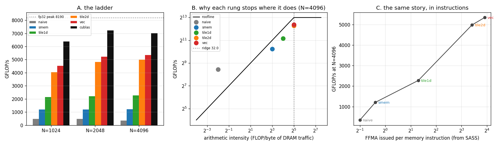

# CUDA Tiled Matmul

---

> Five kernels, one idea each, from **348 GFLOP/s to 5,342 GFLOP/s** — a **15.4x** climb that ends at **76.3% of [cuBLAS](/shared/glossary/#cublas)** and 65% of the card's fp32 peak. The rung that matters most is the one that puts the *second* level of tiling in registers instead of [shared memory](/shared/glossary/#shared-memory), which is exactly what [project 13](../13-tile-size-sweep/README.md) proved a single level could never do. The winning kernel runs at **25% [occupancy](/shared/glossary/#occupancy)**, and every kernel here — including the naive one — agrees with cuBLAS **bit for bit**.

---

## Key Insight

A [matmul](/shared/glossary/#matmul) does `2N³` operations on `3N²` numbers, so there is an enormous amount of reuse available — but only if you organise the loops so that each number, once loaded, is used many times before it is thrown away. Every rung on this ladder is the same move applied at a different level of the memory hierarchy: **load once, use many times, at DRAM → [L2](/shared/glossary/#l2-cache) → shared memory → registers.** The performance number at each rung is just a readout of how many multiply-adds you managed to do per memory instruction.

## Why This Matters

You should not write your own SGEMM for production — cuBLAS beat this one by 31% and NVIDIA has spent two decades on it. You should write one *once*, because the pattern is the whole of high-performance GPU programming and it does not stay in matmul. [FlashAttention](/shared/glossary/#flashattention) is this pattern applied to [attention](/shared/glossary/#attention) ([project 21](../21-mini-flashattention/README.md)). Fused normalisation is this pattern applied to elementwise work ([project 20](../20-fused-layernorm/README.md)). Once you have felt where the 15x comes from, you can spot the same missing reuse in code that has nothing to do with matrices.

---

**This is project 17.**

### The words first

- **SGEMM** — the BLAS name for this operation. **S** = single precision (fp32), **GE** = general (no special structure like symmetric or triangular), **MM** = matrix multiply. The whole BLAS library is named this way, which is why you will also meet `dgemm` (double), `hgemm` (half) and `gemv` (matrix × vector).
- **[Tile](/shared/glossary/#tiling)** — a rectangular block of a matrix, small enough to fit somewhere fast. Tiling means restructuring the loops so you work tile by tile instead of element by element. The name is literal: you are covering the matrix with tiles.
- **[Arithmetic intensity](/shared/glossary/#ai-arithmetic-intensity)** — floating-point operations per byte fetched from [DRAM](/shared/glossary/#dram). This is the single number that decides whether you are limited by compute or by memory.
- **[Ridge point](/shared/glossary/#roofline)** — the arithmetic intensity where the two limits cross. Below it you are memory-bound; above it, compute-bound. On this card it is `8190 GFLOP/s ÷ 256.3 GB/s` = **32.0 FLOP/byte**.
- **[Thread tiling / register tiling](/shared/glossary/#thread-coarsening)** — giving one thread several output elements instead of one, so the values it loads into registers get reused across all of them. Also called *thread coarsening*: each thread is made "coarser", doing more work, so there are fewer, chunkier threads.
- **FFMA / LDS / LDG** — the machine instructions you will see in the [SASS](/shared/glossary/#sass): **F**loating **F**used **M**ultiply-**A**dd (`d = a*b + c` in one instruction, rounded once), **L**oa**D** from **S**hared memory, **L**oa**D** from **G**lobal memory.
- **`float4`** — a 16-byte vector type. One `float4` load is one instruction that fetches four consecutive floats.
- **[Occupancy](/shared/glossary/#occupancy)** — resident [warps](/shared/glossary/#warp) per [SM](/shared/glossary/#sm), as a fraction of the maximum. Often described as something to maximise. Section D is a counterexample.

### Why write this when cuBLAS exists — and why shared memory when there is already a cache?

Two fair objections, and the answers are different.

**"cuBLAS already does this."** It does, and section A shows it doing it 31% better than the best kernel here. Write this one anyway, once, for the same reason you implement a sort once: the ladder in this project *is* the mental model. Every one of the five rungs is a technique you will apply later to an operation cuBLAS has never heard of.

**"The GPU already has an L2 cache — why stage tiles in shared memory by hand?"** Because a cache is a hope and shared memory is a promise. The [L2](/shared/glossary/#l2-cache) does capture reuse automatically, and section B shows it doing so dramatically — the naive kernel achieves **542% of the bandwidth-roofline** it would have if every read went to DRAM, purely because L2 caught most of them. But you cannot control *what* it keeps or for *how long*: [project 15](../15-l2-hit-rate-analysis/README.md) measured a real [attention](/shared/glossary/#attention) kernel capturing only **0.14 of an available 0.97** of its reuse from L2, because unrelated blocks kept evicting each other. Shared memory is the same silicon speed with a different contract — *you* decide what is in it and it stays until you overwrite it. The naive kernel gets lucky; the tiled kernel is correct by construction.

---

## Running it

```bash
python run.py       # ~7 s: compiles sgemm.cu, runs the ladder, reads the SASS, plots
```

Hardware: **GTX 1070 Ti**, 19 SMs, fp32 peak **8,190 GFLOP/s**, memory **256.3 GB/s**, 48 KB shared memory per block, 64K registers per SM.

Reference: **system cuBLAS 12**. (PyTorch's bundled cuBLAS 13 refuses this card with `CUBLAS_STATUS_ARCH_MISMATCH` — CUDA 13 dropped Pascal. The system toolkit's CUDA 12 still supports it, which is what every CUDA project in this guide compiles against.)

> **About the numbers.** Every figure comes from the committed
> [`outputs/findings.json`](outputs/findings.json) and
> [`outputs/findings.csv`](outputs/findings.csv).



---

## A. The ladder

At N = 4096 (137 GFLOP of work):

| rung | idea added | ms | GFLOP/s | % of peak | % of cuBLAS | max err vs cuBLAS |
|---|---|---:|---:|---:|---:|---:|
| naive | one output per thread | 395.12 | 347.8 | 4.2% | 5.0% | **0.000e+00** |
| smem | 32×32 shared tile | 113.65 | 1,209.3 | 14.8% | 17.3% | 0.000e+00 |
| tile1d | +8 outputs per thread | 60.40 | 2,275.5 | 27.8% | 32.5% | 0.000e+00 |
| tile2d | +8×8 outputs per thread | 27.60 | 4,980.4 | 60.8% | 71.1% | 0.000e+00 |
| vec | +`float4` loads, transposed A | **25.73** | **5,342.2** | **65.2%** | **76.3%** | 0.000e+00 |
| cuBLAS | — | 19.62 | 7,006.2 | 85.5% | 100% | — |

The same shape holds at N = 1024 and N = 2048 (see [`findings.csv`](outputs/findings.csv)); the gap to cuBLAS narrows as N grows, from 70.9% at 1024 to 76.3% at 4096, because the fixed costs of our kernel amortise better over a bigger problem.

**Every kernel matches cuBLAS to the last bit.** That is not luck and it is not a sign of low precision — it means all six implementations accumulate the `K` products in the same ascending order with the same fused multiply-add. Change the order (split the `k` loop across threads and add partial sums, as a "split-K" kernel does) and the last few bits move. It is a useful sanity check to know you *should* expect here, so that when it fails you know something reordered.

---

## The rungs, one at a time

### 1. Naive — 0.25 FLOP/byte

```cuda
int col = blockIdx.x * blockDim.x + threadIdx.x;
int row = blockIdx.y * blockDim.y + threadIdx.y;
float acc = 0.0f;
for (int k = 0; k < K; ++k) acc += A[row * K + k] * B[k * N + col];
C[row * N + col] = acc;
```

One output per thread, both operands read from global memory every iteration: two loads (8 bytes) per multiply-add (2 FLOP) = **0.25 FLOP/byte**. That is 128x below the ridge point, so on paper this kernel can never exceed `0.25 × 256.3` = **64 GFLOP/s**. It gets **348**. Section B explains why.

Note the indexing: `threadIdx.x` is mapped to the *column*, so the 32 lanes of a warp read 32 adjacent floats of `B` and write 32 adjacent floats of `C`. Swapping `row` and `col` here is the classic first bug — it costs about 8x and produces identical results, which is why [project 11](../11-coalesced-vs-non-coalesced/README.md) exists.

### 2. Shared-memory tile — 8 FLOP/byte

Load a 32×32 tile of A and of B into shared memory, `__syncthreads()`, then every thread reads its operands from there. Each element loaded from global is now used by 32 threads instead of 1, so global traffic falls 32x and arithmetic intensity rises to `T/4` = **8 FLOP/byte**.

`__syncthreads()` is a barrier for the whole block: no thread proceeds until every thread has arrived. It is needed twice per tile — once after filling the tile (nobody may read before everyone has written) and once after using it (nobody may overwrite before everyone has finished reading). Forgetting the second one is a race that usually still gives the right answer on small inputs.

Result: 3.5x faster than naive. But look at the instruction mix in section C: **0.76 FFMA per load**. Every multiply-add still needs roughly one shared-memory load to feed it. We moved the bottleneck from DRAM to the shared-memory pipe; we did not remove it.

### 3. 1D thread tiling — 16 FLOP/byte

Each thread now owns **8 outputs stacked in a column**. One value of `B`, loaded into a register, feeds all 8 of them:

```cuda
for (int d = 0; d < BK; ++d) {
    float b = Bs[d * BN + threadCol];          // one shared load ...
    for (int i = 0; i < TM; ++i)               // ... feeds eight FMAs
        acc[i] += As[(threadRow * TM + i) * BK + d] * b;
}
```

FFMA per load rises to **2.46**, throughput to 2,275 GFLOP/s.

### 4. 2D thread tiling — 32 FLOP/byte, and the point of the whole project

Each thread owns an **8×8 square** of C. It loads 8 values of A and 8 of B into registers, then does 64 multiply-adds with them:

```cuda
for (int i = 0; i < TM; ++i) regM[i] = As[(threadRow * TM + i) * BK + d];
for (int j = 0; j < TN; ++j) regN[j] = Bs[d * BN + threadCol * TN + j];
for (int i = 0; i < TM; ++i)
    for (int j = 0; j < TN; ++j) acc[i * TN + j] += regM[i] * regN[j];
```

**16 shared-memory loads produce 64 FMAs.** That ratio — `(TM×TN) / (TM+TN)` — is the entire trick, and it is the same trick as the shared-memory tile one level down. Throughput doubles again, to 4,980 GFLOP/s.

#### Why this is the answer to [project 13](../13-tile-size-sweep/README.md)'s dead end

[Project 13](../13-tile-size-sweep/README.md) swept tile sizes on a *one-level* tiled matmul — a `T×T` tile of A and of B, one output per thread — and proved something discouraging. Reaching the ridge point of 32 FLOP/byte needs `T = 128`, and at `T = 128` that scheme asks for two 128×128 float tiles = **128 KB of shared memory** against a 48 KB budget, and 128×128 = **16,384 threads per block** against a hardware limit of 1,024. Even `T = 64` died at launch with `invalid configuration argument` (4,096 threads). One level of tiling cannot get there; the sweep's best configuration sat in the interior with the ridge point out of reach.

Two-level tiling dissolves that. The block tile *is* 128×128 — arithmetic intensity 32.0, exactly at the ridge — but each of the 256 threads owns 64 outputs, so the thread count is `128×128 / 64` = 256, comfortably legal. The second level of reuse lives **in registers**, which is a completely separate budget from shared memory: 64K registers per SM versus 48 KB of shared memory per block, allocated by a different mechanism and limited by a different rule.

That is the general lesson, and it is worth more than the number: **when one resource blocks you, look for reuse in a different resource, not for a better setting of the one you are stuck on.**

### 5. Vectorised loads — same tiles, fewer instructions

Two changes, no change to the tiling:

- Global loads move 16 bytes at a time (`float4`) instead of 4.
- The A tile is stored **transposed** in shared memory (`As[k][m]` rather than `As[m][k]`), so the inner loop's 8 consecutive reads of A are contiguous and can also be issued as `float4`.

Worth **+7.3%** (4,980 → 5,342 GFLOP/s). The [SASS](/shared/glossary/#sass) in section C shows where it came from: global load instructions per thread drop from **8 to 2**.

#### "The loads were already coalesced — what does vectorising add?"

Different things, easy to confuse:

- **[Coalescing](/shared/glossary/#memory-coalescing)** is about *which addresses the 32 lanes of a warp touch together*. If they are adjacent, the hardware merges them into a few wide [memory transactions](/shared/glossary/#memory-transaction). Both kernels are fully coalesced, so both move the same number of bytes in the same number of transactions.
- **Vectorising** is about *how many instructions one thread issues to move those bytes*. Four scalar loads and one `float4` load fetch identical data; the second is one instruction instead of four.

So vectorising does not help bandwidth at all — it reduces instruction issue, and the reason it is worth 7% here is that this kernel is no longer memory-bound. When the machine is issue-limited, deleting instructions is the optimisation. (The transposed A tile also removes strided shared-memory reads, which is separately good for [bank](/shared/glossary/#bank-conflict) behaviour — see [project 12](../12-bank-conflict-demo/README.md).)

---

## B. Roofline accounting: why each rung stops where it does

| rung | block tile | AI (FLOP/byte) | roofline ceiling | achieved | % of its own ceiling |
|---|---|---:|---:|---:|---:|
| naive | 1×1 | 0.25 | 64 | 348 | **543%** |
| smem | 32×32 | 8.00 | 2,050 | 1,209 | 59% |
| tile1d | 64×64 | 16.00 | 4,101 | 2,275 | 55% |
| tile2d | 128×128 | 32.00 | 8,190 | 4,980 | 61% |
| vec | 128×128 | 32.00 | 8,190 | 5,342 | 65% |

Read the first row again: the naive kernel is **5.4x faster than its own roofline says is possible**. Nothing is broken — the model is wrong for that kernel. The roofline assumes every byte comes from DRAM, and most of the naive kernel's bytes do not: all 32 lanes of a warp read the *same* element of A (a broadcast, served once) and B's tile stays hot in the 2 MB L2 for a long time. ([Project 13](../13-tile-size-sweep/README.md) measured the identical effect and got 559%.)

The lesson is not that the roofline is useless — it is that **the roofline is a model of the traffic you assumed, so a kernel beating it is telling you your traffic assumption was wrong**, which is exactly the kind of feedback you want from a model.

Rows 2 through 5 sit at 55-65% of their ceilings, and the last two are the interesting ones: their ceiling is the *compute* roof, not the memory roof, because AI 32.0 lands right at the ridge point. From there on, more tiling buys nothing. The remaining 35% is pure instruction efficiency — which is what section C measures and what cuBLAS is better at.

---

## C. The same story, in instructions

Straight from `cuobjdump -sass`, counting the whole kernel body:

| rung | FFMA | LDS | LDG | FFMA per load |
|---|---:|---:|---:|---:|
| naive | 29 | 0 | 58 | **0.50** |
| smem | 32 | 40 | 2 | 0.76 |
| tile1d | 64 | 24 | 2 | 2.46 |
| tile2d | 512 | 40 | 8 | 10.67 |
| vec | 512 | 32 | 2 | **15.06** |

This table is the performance table with the timing removed. The naive kernel's 0.50 is exactly the theoretical minimum — one multiply-add per two loads, as the source says. The climb to 15.06 is the same 15.4x as the throughput climb, near enough to notice.

A GPU can issue roughly one instruction per cycle per warp scheduler. If half of your instructions are loads, then at best half your peak FLOP rate is reachable no matter how fast memory is. **Counting instructions in the SASS predicts performance about as well as any memory model does**, and it needs no profiler — which matters here, since [Nsight Compute cannot read this machine's counters](../06-nvidia-smi-deep-dive/README.md).

Note also `tile2d`'s 512 FFMA: `TM × TN × BK` = 8 × 8 × 8 exactly. The compiler fully unrolled both the 8×8 output square and the 8-deep `k` loop, which is why the accumulators can live in registers at all — an un-unrolled loop with a runtime index would have to spill `acc[]` to local memory and the whole scheme would collapse. This is why the tile sizes are compile-time template parameters rather than kernel arguments.

---

## D. What each rung costs — and the 25%-occupancy winner

| rung | threads/block | registers/thread | shared mem | blocks per SM | occupancy |
|---|---:|---:|---:|---:|---:|
| naive | 1024 | 32 | 0 | 2 | **100%** |
| smem | 1024 | 28 | 8,192 | 2 | 100% |
| tile1d | 512 | 58 | 4,096 | 2 | 50% |
| tile2d | 256 | 128 | 8,192 | 2 | **25%** |
| vec | 256 | 122 | 8,192 | 2 | 25% |

**The fastest kernel has the lowest occupancy, and it is 15.4x faster than the one with the highest.**

The mechanism is visible in the same table: `tile2d` uses 128 registers per thread, and 2 blocks × 256 threads × 128 registers = 65,536 = the SM's entire register file. Occupancy is *low because the registers went into the optimisation*. Those registers are the 64 accumulators plus the operand staging — the reuse itself.

This reproduces the classic result from [project 8](../08-occupancy-study/README.md), where the best configuration ran at 24.9% occupancy and a 59.6%-occupancy configuration was 24% slower. Occupancy is a means to [latency hiding](/shared/glossary/#latency-hiding); once you have enough warps in flight to cover your memory latency, more warps buy nothing, and spending registers on [instruction-level parallelism](/shared/glossary/#instruction-level-parallelism) instead buys a lot. Treat "maximise occupancy" as a hypothesis to test, not a rule.

---

## E. The last 23.7%: what cuBLAS knows that this does not

Our best is 5,342 GFLOP/s; cuBLAS is 7,006. That gap is not one missing trick, it is a stack of them:

- **Double buffering / software pipelining.** We `__syncthreads()`, load the next tile, `__syncthreads()`, compute. cuBLAS loads tile *k+1* into a second shared buffer *while* computing on tile *k*, so the DRAM latency hides under the arithmetic instead of stalling in front of it.
- **Warp-level tiling.** An intermediate level between block tile and thread tile that arranges which warp owns which sub-rectangle, improving shared-memory access patterns and register reuse.
- **A kernel per shape.** cuBLAS ships hundreds of pre-tuned variants and picks one from `(M, N, K)`, data type and architecture at call time. We have one kernel with one hard-coded tile shape.
- **Hand-written assembly for the inner loop** in some paths, avoiding compiler register-allocation choices entirely.

Each is worth a few percent, and together they are worth 31%. This is the honest reason the guide's advice is *"compete with cuBLAS on matmul only if you have a very good reason"* — the reasons that qualify are usually a fused epilogue (matmul + bias + activation in one kernel, saving a whole read-write of C), an unusual data type, or a shape cuBLAS handles badly, not raw matmul speed.

---

## What to take away

1. **15.4x from five ideas, all of them the same idea.** Load once, use many times — at DRAM, then L2, then shared memory, then registers.
2. **Two-level tiling reaches the ridge point that one level provably could not.** Registers and shared memory are different budgets; when one blocks you, look for reuse in the other.
3. **Arithmetic intensity is a design parameter, not a property of the algorithm.** The same 2N³ FLOPs ran at 0.25 and at 32.0 FLOP/byte depending only on loop structure.
4. **A kernel that beats its roofline has caught your traffic assumption out.** The naive kernel hit 543% of its ceiling because L2 served what the model charged to DRAM.
5. **The instruction mix predicts the performance.** FFMA per load went 0.50 → 15.06 while throughput went 348 → 5,342. Read the SASS; it needs no profiler.
6. **The fastest kernel ran at 25% occupancy** and used the entire register file to get there. "Maximise occupancy" is a hypothesis, not a rule.
7. **Vectorising is not coalescing.** One moves the same bytes in fewer instructions; the other decides how many transactions the bytes cost. Ours were already coalesced, and vectorising was still worth 7%.
8. **We reached 76.3% of cuBLAS and that is a good place to stop.** The remaining 31% is double buffering, warp tiling, and a kernel per shape — worth knowing about, rarely worth reimplementing.
9. **Bit-for-bit agreement with cuBLAS is the expected result here,** because everything accumulates `k` in the same order. When that check fails, something reordered your sum.

## Files

| File | What it is |
|---|---|
| [`sgemm.cu`](sgemm.cu) | the five kernels, the cuBLAS reference, the timing harness |
| [`run.py`](run.py) | compiles, runs, reads the SASS with `cuobjdump`, tabulates, plots |
| [`outputs/findings.json`](outputs/findings.json) | every measurement, the roofline accounting and the instruction mix |
| [`outputs/findings.csv`](outputs/findings.csv) | one row per (size, kernel) |
| [`outputs/tiled_matmul.png`](outputs/tiled_matmul.png) | the three panels above |

## Next

[Project 18](../18-triton-softmax/README.md) writes the same class of kernel in [Triton](/shared/glossary/#triton) instead of CUDA C — where the tiling is expressed in blocks rather than threads, and the compiler places things in shared memory and registers for you. The interesting question is what you give up. [Project 19](../19-triton-matmul/README.md) answers it directly by putting a Triton matmul next to the CUDA kernels measured here.
