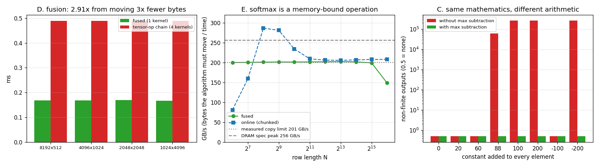

# Triton Softmax

---

> An eight-line [Triton](/shared/glossary/#triton) kernel that reaches **201 GB/s — 99.8% of this card's measured copy limit** — and beats the four-kernel tensor-op version by **2.91x** while running at the *same* bandwidth, because fusion does not make memory faster, it removes memory. Also: the one line that everybody's softmax has and nobody explains, shown failing in three different ways (**262,144 NaNs**, **23.6% NaNs**, and a silent **140x** loss of accuracy). And the environment result that unlocks this whole phase: **PyTorch cannot run a single kernel on this GPU, and Triton runs fine.**

---

## Key Insight

Softmax reads each number once and writes each number once. There is no reuse to exploit and no arithmetic worth optimising — which means the *only* thing that can be optimised is **how many times the data crosses the memory bus**. Writing it as one kernel instead of four is worth 2.91x, and that number is exactly the ratio of bytes moved. Everything else you might tune — block size, warp count, row length — moves it by less than 4%.

## Why This Matters

This is the first project in the phase written in Triton rather than [CUDA](/shared/glossary/#cuda) C, and the contrast is the point: [project 17](../17-cuda-tiled-matmul/README.md) needed 200 lines of index arithmetic to express tiling, and this kernel expresses the same class of idea in eight lines with no thread indices at all. It is also where the "safe softmax" trick stops being folklore you copy and becomes a thing you have watched break, which matters because the identical trick is the load-bearing part of [FlashAttention](/shared/glossary/#flashattention) in [project 21](../21-mini-flashattention/README.md).

---

**This is project 18.**

### The words first

- **[Softmax](/shared/glossary/#softmax)** — turns a row of arbitrary numbers into positive numbers that sum to 1: `softmax(x)ᵢ = exp(xᵢ) / Σⱼ exp(xⱼ)`. The name is "a **soft** version of **max**": a hard max would give the largest element 1 and everything else 0; softmax gives the largest element the biggest share but leaves everyone something. How soft depends on the spread of the inputs.
- **[Triton](/shared/glossary/#triton)** — a Python-flavoured language for writing GPU kernels. You write code that operates on whole *blocks of data* at a time; the compiler decides how to spread that block across threads, what goes in [shared memory](/shared/glossary/#shared-memory), and how to vectorise the loads.
- **Program** — Triton's word for one instance of your kernel. `tl.program_id(0)` is its index. It is the same thing CUDA calls a thread block, but the vocabulary is deliberately different because you never see the threads inside it.
- **"Block" in Triton means a tile of data, not a group of threads.** This collision trips everyone. `BLOCK: tl.constexpr` is how many *elements* one program handles. The number of *threads* is `num_warps × 32`, set separately.
- **`tl.load(ptr, mask=..., other=...)`** — load where `mask` is true, and substitute `other` where it is not. This is how Triton handles sizes that are not powers of two: you always process a power-of-two block and mask off the tail.
- **`num_warps`** — how many [warps](/shared/glossary/#warp) the compiler uses to execute one program. It is a tuning knob, not a correctness knob.
- **[Register spilling](/shared/glossary/#register-spilling)** — when a kernel needs more registers than the hardware has, the compiler moves some to "local memory", which despite the name lives out in [DRAM](/shared/glossary/#dram). Section E catches this happening and shows what it costs.
- **[Subnormal](/shared/glossary/#underflow) numbers** — floats smaller than the smallest "normal" value (1.18e-38 for fp32) are still representable down to 1.4e-45, but with progressively fewer significant bits. They are the last stop before zero, and section C lands in them.
- **Online algorithm** — one that processes its input as it arrives and can produce a valid answer at any point, without needing to see the whole input first. "Online" here has nothing to do with networks; it is the computer-science sense, as in "online sorting".

### Why write a softmax kernel at all — doesn't PyTorch have one?

Three answers, in increasing order of importance.

**On this machine, no it doesn't.** Section A measures it: PyTorch's installed build supports sm_75 and newer, this card is sm_61, so `a + b` on two CUDA tensors raises `no kernel image is available for execution on the device`, and its bundled cuBLAS refuses the card entirely. Triton, meanwhile, compiles its own PTX for whatever it finds and runs. That asymmetry is why every remaining project in this phase is Triton rather than PyTorch.

**`torch.softmax` is *already* a fused kernel, and the comparison in section D is not against it.** Section D compares against what you get when you write softmax as a chain of tensor operations — `m = x.max(-1)`, `e = (x - m).exp()`, `s = e.sum(-1)`, `e / s` — which is how any operation the library has *not* pre-fused actually behaves. Four kernels, four full trips to memory. The 2.91x is what a library author earns you by fusing, measured, and it is what you will have to earn yourself the moment your operation is not in the library.

**The kernel is the vehicle, the max subtraction is the lesson.** Section C is the part you cannot get from reading the library source, because in the library the trick is already there and looks pointless.

---

## Running it

```bash
python run.py       # ~6 s: environment check, correctness, numerics, fusion, sweeps
```

Hardware: **GTX 1070 Ti** (sm_61), 19 SMs. Software: **torch 2.11.0+cu130, triton 3.6.0**.

Reference values used as anchors, all measured in [project 3](../03-bandwidth-measurement/README.md): read-only **222 GB/s**, one-read-one-write copy **201 GB/s**, DRAM spec peak **256.3 GB/s**.

> **About the numbers.** Every figure comes from the committed
> [`outputs/findings.json`](outputs/findings.json) and
> [`outputs/findings.csv`](outputs/findings.csv).



---

## A. The environment result: Triton runs where PyTorch cannot

| what | works here? | what it says |
|---|---|---|
| PyTorch eager on GPU (`a + b`) | **no** | `CUDA error: no kernel image is available for execution on the device` |
| PyTorch's cuBLAS (`a @ b`) | **no** | `CUBLAS_STATUS_ARCH_MISMATCH when calling cublasCreate(handle)` |
| **a Triton kernel** | **yes** | max error vs a float64 CPU reference: **2.52e-08** |

Worth understanding, because it is not a contradiction. PyTorch ships **precompiled** kernels for a fixed list of architectures, chosen when the wheel was built; sm_61 (Pascal, 2016) is no longer on that list, and CUDA 13 dropped Pascal support from cuBLAS entirely. Triton **compiles at run time**, for the card it actually finds, so it targets sm_61 the moment it sees one.

The practical rules that follow, and which [`gpu.py`](gpu.py) wraps for every later project:

- **Allocate** with `torch.empty(..., device="cuda")` — that is a `cudaMalloc`, no kernel involved, so it works.
- **Fill** by copying from the CPU (`.cuda()`) — a `cudaMemcpy`, also kernel-free.
- **Compute** with Triton.
- **Check** on the CPU (`.cpu()`), in float64.

A small consolation prize: being unable to fall back on PyTorch means every reference answer in this phase is computed independently, in a different precision, on a different processor. That is a *better* test than comparing two GPU kernels to each other.

---

## B. Correctness

Against a float64 CPU reference:

| shape | fused | online | multipass | \|row sum − 1\| |
|---|---:|---:|---:|---:|
| 4 × 7 | 1.78e-08 | 1.78e-08 | 1.78e-08 | 4.10e-08 |
| 128 × 129 | 2.00e-08 | 1.30e-08 | 2.00e-08 | 1.27e-07 |
| 1024 × 512 | 8.61e-09 | 8.11e-09 | 8.61e-09 | 1.45e-07 |
| 512 × 4096 | 1.41e-09 | 1.56e-09 | 1.41e-09 | 1.36e-07 |

All at the level of fp32 rounding (~1.2e-07 relative), as they should be. The odd sizes (7, 129) are deliberate: they exercise the `mask` path, where the block is a power of two and the row is not. A masking bug typically shows up *only* at non-power-of-two sizes, which is why a test suite of 512s and 1024s can pass a broken kernel.

---

## The kernel

```python
@triton.jit
def _fused_kernel(X, Y, stride_x, stride_y, N, BLOCK: tl.constexpr):
    row = tl.program_id(0)
    cols = tl.arange(0, BLOCK)
    mask = cols < N
    x = tl.load(X + row * stride_x + cols, mask=mask, other=float("-inf"))
    x = x - tl.max(x, axis=0)
    e = tl.exp(x)
    y = e / tl.sum(e, axis=0)
    tl.store(Y + row * stride_y + cols, y, mask=mask)
```

One program per row. The whole row is loaded into registers, the whole computation happens there, and the result is written once. Note what is *absent* compared to [project 17](../17-cuda-tiled-matmul/README.md)'s CUDA: no `threadIdx`, no `__shared__` declaration, no `__syncthreads()`, no manual tiling of the reduction. `tl.max` and `tl.sum` reduce across the whole block and the compiler generates whatever tree of shuffles and shared-memory steps that needs.

The `other=float("-inf")` matters: padding lanes must lose the maximum (so they cannot corrupt it) and must contribute `exp(-inf) = 0` to the sum. Using `other=0.0` here would be a bug that only shows up when a row's true values are all negative.

---

## C. The one line: `x = x - tl.max(x)`

In mathematics this line does **nothing**. Softmax is shift-invariant:

```
exp(xᵢ + c) / Σ exp(xⱼ + c)  =  eᶜ·exp(xᵢ) / (eᶜ·Σ exp(xⱼ))  =  exp(xᵢ) / Σ exp(xⱼ)
```

The `eᶜ` cancels exactly. So the identical answer is expected for every row of this table — and the "without" column is what fp32 actually produces:

| constant added | without max subtraction | with max subtraction |
|---:|---|---|
| 0 | fine, err 6.3e-09 | fine, err 5.7e-09 |
| +20 | fine, err 7.6e-08 | fine, err 4.6e-08 |
| +60 | fine, err 2.2e-07 | fine, err 1.5e-07 |
| **+88** | **61,764 of 262,144 outputs are NaN** | fine, err 1.3e-07 |
| +100 | **all 262,144 NaN** | fine, err 1.3e-07 |
| +200 | **all 262,144 NaN** | fine, err 2.7e-07 |
| **−100** | **finite, but err 1.8e-05** | fine, err 1.3e-07 |
| −200 | **all 262,144 NaN** | fine, err 2.7e-07 |

Three distinct failures, and the middle one is the dangerous one.

**Overflow (+88 and above).** fp32's largest value is 3.4e38, and `exp(88.7)` is 3.4e38, so anything above ~88.7 becomes `inf`. Then `inf / inf` = NaN. At +88 exactly, whether an element overflows depends on its own value, so **23.6% of the outputs are NaN and the rest are fine** — a partially-poisoned tensor, which is far harder to debug than a completely poisoned one.

**Underflow to zero (−200).** `exp(−200)` = 1.4e-87, far below anything fp32 can hold, so every term becomes exactly 0. The sum is 0. `0 / 0` = NaN. The stub's warning about [underflow](/shared/glossary/#underflow) is this row.

**Silent precision loss (−100).** `exp(−100)` = 3.7e-44. That is not zero — fp32 keeps going below its smallest *normal* value (1.18e-38) into **subnormal** numbers, down to 1.4e-45. But subnormals trade significant bits for range: near 3.7e-44 there are only about 5 bits of precision left, not 24. The result is finite, plausible, sums to 1, and is wrong in the 5th decimal place — **140x worse than the safe version**. No exception, no NaN, no warning. This is the row that survives your unit tests.

**What subtracting the max guarantees.** After `x - max(x)`, the largest element is exactly 0, so the largest `exp` is exactly 1 — overflow is impossible. And the denominator contains that 1, so the sum is at least 1 — division by zero is impossible. The cost is one extra pass over the row (already in registers, so effectively free) and the benefit is that *no* input can break it. That is why every softmax you will ever read has this line, and why it is worth having watched it fail once.

---

## D. Fusion: 2.91x, and it is not because the fused kernel is faster

| shape | fused (1 kernel) | tensor-op chain (4 kernels) | speedup |
|---|---:|---:|---:|
| 8192 × 512 | 0.168 ms @ 200.2 GB/s | 0.489 ms @ 205.8 GB/s | 2.92x |
| 4096 × 1024 | 0.168 ms @ 200.2 GB/s | 0.489 ms @ 205.8 GB/s | 2.92x |
| 2048 × 2048 | 0.169 ms @ 198.4 GB/s | 0.488 ms @ 206.3 GB/s | 2.89x |
| 1024 × 4096 | 0.167 ms @ 200.9 GB/s | 0.489 ms @ 205.8 GB/s | **2.93x** |

Look at the bandwidth columns before the speedup column. **The slow version is running slightly faster than the fast version** — 206 GB/s against 200. Both are at the memory system's limit; neither is wasting a cycle.

The entire difference is in how many bytes each one has to move, and that is countable by hand:

```
fused:   read x, write y                                  = 2 passes
chain:   max: read x
         subtract+exp: read x, write tmp
         sum: read tmp
         divide: read tmp, write y                        = 6 passes
```

**3.0x the traffic, 2.9x the time.** The 0.1x discrepancy is the four launches instead of one plus a small L2 benefit on the intermediates.

This is the sentence to keep: **fusion does not make memory faster, it removes memory.** Every "fused X" kernel you will ever meet — fused LayerNorm ([project 20](../20-fused-layernorm/README.md)), FlashAttention ([project 21](../21-mini-flashattention/README.md)), fused optimisers — is this same accounting. Count the passes over the data before and after; that ratio is your speedup, and no amount of tuning will beat it or fall much short of it on a memory-bound operation.

It also tells you when *not* to bother: if an operation has only one intermediate and it is small, fusing it saves one pass out of three, not four out of six.

---

## E. Bandwidth against row length — flat, until the registers run out

Total elements held at roughly 8M so the comparison is fair:

| N | M | fused | registers | spilled | online (chunked) |
|---:|---:|---:|---:|---:|---:|
| 64 | 131,072 | 199.9 GB/s | 14 | 0 | 80.8 GB/s |
| 128 | 65,536 | 200.6 | 17 | 0 | 159.4 |
| 256 | 32,768 | 201.0 | 24 | 0 | **286.5** |
| 512 | 16,384 | 201.4 | 24 | 0 | 281.1 |
| 1024 | 8,192 | 201.4 | 24 | 0 | 234.2 |
| 2048 | 4,096 | 201.6 | 24 | 0 | 209.4 |
| 4096 | 2,048 | 201.9 | 26 | 0 | 206.0 |
| 8192 | 1,024 | 202.5 | 32 | 0 | 205.5 |
| 16384 | 512 | 201.7 | 59 | 0 | 206.6 |
| 32768 | 256 | 199.1 | 106 | 0 | 207.7 |
| **65536** | 128 | **148.7** | **128** | **68 B** | 207.9 |

**Flat at ~200 GB/s across a 512x range of row lengths.** Softmax does not care about shape; it cares about total bytes. 201 GB/s against [project 3](../03-bandwidth-measurement/README.md)'s measured copy limit of 201 GB/s is **99.8%** — this kernel is finished, and no tuning in section F will find anything.

**Then it falls off a cliff at N = 65,536, and the compiler tells you exactly why.** The register count climbs 14 → 24 → 59 → 106 → 128, hits the hardware's per-thread ceiling of 128, and 68 bytes per thread **spill** into local memory — which is DRAM wearing a different name. Extra DRAM traffic that the byte count above does not include, hence the apparent drop from 201 to 149 GB/s. Triton reports `n_regs` and `n_spills` on every compiled kernel, so this diagnosis costs one line of Python and no profiler.

### Two numbers above the DRAM peak, and what they mean

The chunked kernel reports **286 GB/s at N = 256**, above the card's 256.3 GB/s spec peak. That is not an error and not a broken card: the chunked kernel reads each row *twice* (once to find the max and sum, once to write the answer), and the byte count charges both reads to DRAM. At N = 256 the row is 1 KB and is still in [L2](/shared/glossary/#l2-cache) when the second pass asks for it, so the second read never reaches DRAM. [Project 15](../15-l2-hit-rate-analysis/README.md) turned exactly this effect into a hit-rate measurement; here it is enough to notice that **an "impossible" bandwidth is a cache telling you your traffic model is wrong**, which is the same lesson [project 17](../17-cuda-tiled-matmul/README.md)'s naive kernel taught by scoring 542% of its roofline.

### Why have a chunked version at all when the fused one is faster everywhere?

Because "faster everywhere" is true only over the range where the fused one *fits*. The fused kernel holds an entire row in registers, so its cost grows with `N` until it spills — the last row of the table is that limit arriving. The chunked kernel holds `BLOCK = 1024` elements at a time regardless of `N`, so its register use is constant and it never spills.

The mechanism it uses to get away with that is the interesting part:

```python
m_new = tl.maximum(m, tl.max(x, axis=0))            # the new running maximum
l = l * tl.exp(m - m_new) + tl.sum(tl.exp(x - m_new))   # rescale, then add
m = m_new
```

It keeps a running maximum `m` and a running sum `l` that is *always expressed relative to the current maximum*. When a later chunk contains a bigger value, the sum accumulated so far is corrected by multiplying by `exp(m_old − m_new)` — a single multiply that retroactively rebases everything already added. This is **online softmax** (Milakov & Gimelshein, 2018), "online" in the sense of processing data as it streams past rather than needing it all at once.

Remember this block of three lines. In [project 21](../21-mini-flashattention/README.md) the exact same rescaling — applied not just to a running sum but to a running weighted *average of value vectors* — is the whole of FlashAttention. The reason it is worth meeting here first is that in isolation it is three lines of arithmetic you can check by hand, whereas inside an attention kernel it arrives tangled up with tiling and masking.

---

## F. num_warps: 1.03x

| num_warps | ms | GB/s |
|---:|---:|---:|
| 1 | 0.167 | 200.9 |
| 2 | **0.166** | **201.9** |
| 4 | 0.167 | 200.8 |
| 8 | 0.168 | 199.8 |
| 16 | 0.172 | 195.1 |

**A 16x range of thread counts, worth 3.5%.** Which is the expected answer for a kernel already at 99.8% of the copy limit — there is nothing left to win, so no knob can win it.

This is the same shape of result as [project 16](../16-cuda-vector-add/README.md)'s block-size sweep (1.038x) and [project 8](../08-occupancy-study/README.md)'s (1.008x). The general rule is worth stating plainly: **before tuning a knob, compute the ceiling. If you are within a few percent of it, the knob cannot help you and the only remaining move is to change how many bytes you touch** — which is what section D did, for 2.91x.

---

## What to take away

1. **Triton compiles at run time and PyTorch ships prebuilt kernels**, which is why Triton works on this card and PyTorch does not. That is an architectural difference, not a bug in either.
2. **The fused kernel hits 99.8% of the measured copy limit in eight lines.** For a memory-bound elementwise operation, the obvious kernel is the finished kernel.
3. **Fusion is worth 2.91x and the fused version is not faster.** Both run at ~200 GB/s; one just has 3x fewer bytes to move. Count the passes, that is your speedup.
4. **Subtracting the row max changes nothing mathematically and everything numerically.** It fails three ways without it: all-NaN, partially-NaN (23.6%, harder to debug), and — worst — finite-but-140x-wrong in the subnormal range.
5. **A shift of +88 is enough to break fp32 softmax.** Attention logits at scale routinely reach that; this is not a theoretical risk.
6. **Register spilling is measurable without a profiler.** `kernel.n_regs` and `kernel.n_spills` from the compiled Triton kernel located the exact row length where bandwidth dropped 26%.
7. **A bandwidth above DRAM peak means the cache served you and your byte count was wrong.** 286 GB/s on a 256 GB/s bus is information, not an error.
8. **Online softmax is three lines and it is the seed of FlashAttention.** Keep a running max, rescale the running sum by `exp(m_old − m_new)` whenever the max moves.
9. **Knobs cannot beat a ceiling.** num_warps across a 16x range: 1.035x. Compute the roof first, then decide whether tuning is worth an afternoon.

## Files

| File | What it is |
|---|---|
| [`gpu.py`](gpu.py) | shared helpers for all the Triton projects: allocation that avoids PyTorch kernels, the warm-up spin, event-based timing, the card's measured constants |
| [`softmax.py`](softmax.py) | the four kernels — fused, unsafe, online, multipass — plus the byte counts |
| [`run.py`](run.py) | the six sections, tabulation and plots |
| [`outputs/findings.json`](outputs/findings.json) | every measurement |
| [`outputs/findings.csv`](outputs/findings.csv) | one row per measurement |
| [`outputs/triton_softmax.png`](outputs/triton_softmax.png) | the three panels above |

## Next

[Project 19](../19-triton-matmul/README.md) takes Triton somewhere much harder: a [matmul](/shared/glossary/#matmul), where there is real reuse to exploit and the CUDA kernels from [project 17](../17-cuda-tiled-matmul/README.md) are waiting as a scoreboard. The question is what Triton's compiler does with the two-level tiling that took 200 lines by hand — and what [autotuning](/shared/glossary/#autotuning) finds when you let it search.
