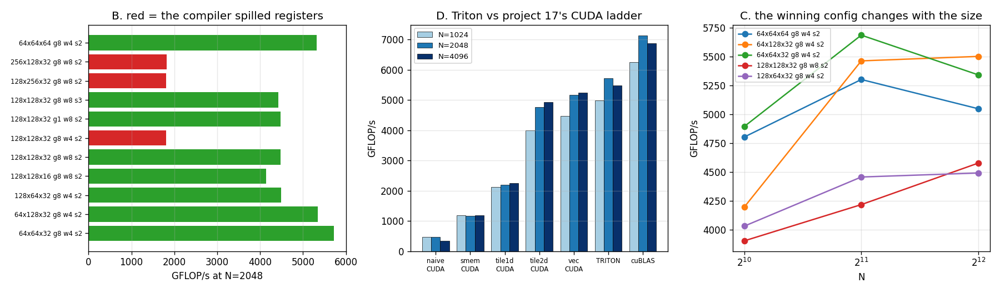

# Triton Matmul

---

> Thirty lines of [Triton](/shared/glossary/#triton) reach **80% of [cuBLAS](/shared/glossary/#cublas)** and beat the 200-line hand-written [CUDA](/shared/glossary/#cuda) kernel from [project 17](../17-cuda-tiled-matmul/README.md) by **1.04–1.12x**. The configuration sweep spans **3.17x**, and the split is not subtle: every configuration where the compiler spilled registers landed at 1,802–1,822 GFLOP/s and every configuration where it did not landed at 4,134–5,716, with **nothing in between**. The winner has an [arithmetic intensity](/shared/glossary/#ai-arithmetic-intensity) of 16 — **half** what the [roofline](/shared/glossary/#roofline) says is needed — and the same tile shape runs at **1,802 or 4,476** GFLOP/s depending only on `num_warps`.

---

## Key Insight

Triton lets you write the *block* algorithm and hands the compiler everything below it: which thread holds which register, what goes in [shared memory](/shared/glossary/#shared-memory), how loads are vectorised. That trade is a good one — the result here is faster than the hand-written version — but it moves the failure mode. In CUDA you get slow code when you write the wrong loop. In Triton you get slow code when you pick a tile the compiler cannot fit into registers, and the only warning is a number in the compiled kernel's metadata.

## Why This Matters

Triton is how most new GPU kernels are written in 2026, and this project is the shape of that work: write the block algorithm once, then search the configuration space. What makes the search worth understanding rather than automating away is that the *reason* configurations fail is legible — 12 configurations here, and every one of their outcomes is explained by two compiler-reported numbers. Once you know to look at spills and shared-memory use, [autotuning](/shared/glossary/#autotuning) stops being a black box you run overnight and becomes a search you can bound in advance.

---

**This is project 19.**

### The words first

- **`tl.dot(a, b)`** — Triton's block-level matrix multiply. Give it a `BLOCK_M × BLOCK_K` block and a `BLOCK_K × BLOCK_N` block and it produces a `BLOCK_M × BLOCK_N` block. On hardware with [tensor cores](/shared/glossary/#tensor-core) it emits tensor-core instructions; on this Pascal card it emits ordinary fused multiply-adds. Either way, you never write the inner loop.
- **`num_warps`** — how many [warps](/shared/glossary/#warp) execute one program. It is not just a parallelism knob: it decides how the block is *divided*, so it decides how many registers each thread needs. Section B shows it moving throughput 2.48x.
- **`num_stages`** — how deep a software pipeline the compiler should build, i.e. how many `k` iterations ahead it should start loading. On newer GPUs this uses an asynchronous copy instruction (`cp.async`) that fetches into shared memory without occupying registers. Pascal has no such instruction, which is why section B finds `num_stages` worth nothing here.
- **`GROUP_M`** — the order in which output blocks are visited. Purely a scheduling choice; it cannot change the answer.
- **[Register spilling](/shared/glossary/#register-spilling)** — the compiler needed more registers than a thread has, so some values live in "local memory", which is [DRAM](/shared/glossary/#dram) with a friendly name. Triton reports the byte count as `kernel.n_spills`.
- **[Autotuning](/shared/glossary/#autotuning)** — compiling the same kernel under many configurations, timing each, and caching the winner per input shape.
- **Masking** — `tl.load(..., mask=..., other=0.0)` lets a block run partly off the end of a matrix by substituting zeros. It is how one kernel handles a 1000×1000 matrix with 128-wide tiles.

### Wait — we just wrote a fast matmul in CUDA. Why write it again?

Three things this version answers that [project 17](../17-cuda-tiled-matmul/README.md) could not.

**How much of the 200 lines was necessary?** [Project 17](../17-cuda-tiled-matmul/README.md)'s kernel needed explicit two-level tiling, hand-written `float4` loads, a transposed shared tile, and index arithmetic for all of it. Triton needs none of that — no `threadIdx`, no register tile, no vectorisation code — and section D shows it coming out **ahead**. That is a measurement of how much of hand-written CUDA is essential and how much is bookkeeping the compiler can do.

**What happens when the shape is not a nice power of two?** [Project 17](../17-cuda-tiled-matmul/README.md)'s kernel launches `grid = (N/128, N/128)`. For a 1000×1000 matrix that is 7×7 blocks covering 896 of 1000 rows: **10% of the output is never written, and nothing reports an error**. For a 64-row matrix the grid is zero blocks and the kernel does nothing at all. Section E runs those shapes in Triton, where the masks handle them.

**What does the tuning space actually look like?** [Project 17](../17-cuda-tiled-matmul/README.md) had one hard-coded configuration. Twelve configurations here span 3.17x, one fails to compile, and the pattern in the failures is the most useful thing in this project.

---

## Running it

```bash
python run.py       # ~30 s: compiles ~12 kernel variants, sweeps, and re-runs
                    # project 17's binary so the comparison is same-session
```

Hardware: **GTX 1070 Ti** (sm_61), 19 SMs, fp32 peak **8,190 GFLOP/s**, 48 KB shared memory per block. Software: **triton 3.6.0**.

The CUDA and cuBLAS columns in section D are produced by *running [project 17](../17-cuda-tiled-matmul/README.md)'s binary during this run*, not by copying its committed numbers, so both sides see the same card in the same thermal state.

> **A note on measurement.** Every timing call re-runs a short spin kernel first. The card idles at 164 MHz and boosts under load, so a measurement taken right after a stretch of CPU work (building a float64 reference, compiling the next variant) reads several percent slow. An earlier version of this project warmed up only once at start-up and produced a `GROUP_M` result that appeared to flip sign with matrix size; with per-measurement re-warming, the effect is a consistent 2–6% in one direction. **The apparent finding was the clock, not the kernel.**

> **About the numbers.** Every figure comes from the committed
> [`outputs/findings.json`](outputs/findings.json) and
> [`outputs/findings.csv`](outputs/findings.csv).



---

## The kernel

```python
offs_m = pid_m * BLOCK_M + tl.arange(0, BLOCK_M)
offs_n = pid_n * BLOCK_N + tl.arange(0, BLOCK_N)
offs_k = tl.arange(0, BLOCK_K)
a_ptrs = A + offs_m[:, None] * sam + offs_k[None, :] * sak
b_ptrs = B + offs_k[:, None] * sbk + offs_n[None, :] * sbn

acc = tl.zeros((BLOCK_M, BLOCK_N), dtype=tl.float32)
for k in range(0, tl.cdiv(K, BLOCK_K)):
    k_left = K - k * BLOCK_K
    a = tl.load(a_ptrs, mask=(offs_m[:, None] < M) & (offs_k[None, :] < k_left), other=0.0)
    b = tl.load(b_ptrs, mask=(offs_k[:, None] < k_left) & (offs_n[None, :] < N), other=0.0)
    acc += tl.dot(a, b, input_precision="ieee")
    a_ptrs += BLOCK_K * sak
    b_ptrs += BLOCK_K * sbk
```

Compare this with [project 17](../17-cuda-tiled-matmul/README.md)'s `sgemm_tile2d`. The block tile is there (`BLOCK_M × BLOCK_N`), the `k` slabs are there (`BLOCK_K`), and the **register tile is not written down anywhere**. `tl.dot` is handed two blocks and the compiler decides that thread 0 will hold this 8×8 sub-square in these registers, that the A block should be staged in shared memory transposed, and that these four loads can be merged into one 16-byte load. Every one of those decisions was a hand-written line in [project 17](../17-cuda-tiled-matmul/README.md).

The strides (`sam`, `sak`, …) are passed in rather than assumed, so the kernel works on transposed or non-contiguous inputs without a rewrite. That is worth doing even in a toy: assuming `stride(1) == 1` is the single most common reason a hand-written kernel silently produces garbage when someone passes it a view.

---

## A. Correctness

| M × N × K | max absolute error | relative |
|---|---:|---:|
| 512 × 512 × 512 | 1.153e-04 | 1.125e-06 |
| **700 × 900 × 1100** | 2.126e-04 | 1.273e-06 |
| 64 × 4096 × 4096 | 8.617e-04 | 2.805e-06 |

Relative errors of ~1e-06 against a float64 CPU reference. That is the expected size for summing `K` fp32 products: error grows roughly as `√K × ε`, and with `K` = 512 and `ε` = 6e-08 that predicts ~1.4e-06.

Note what this is *not*: [project 17](../17-cuda-tiled-matmul/README.md)'s kernels matched cuBLAS **bit for bit**, because they all accumulated `k` in the same ascending order. Triton's `tl.dot` accumulates blockwise, so the additions happen in a different order and the last bits differ. Neither is more correct; they are two valid summations of the same numbers. The lesson from [project 17](../17-cuda-tiled-matmul/README.md) holds in the other direction here — **when bit-exactness disappears, something reordered your sum**, and here we know exactly what did.

The 700 × 900 × 1100 case has no power of two anywhere, so every dimension exercises the mask path. That is deliberate: a masking bug hides perfectly behind test sizes of 512 and 1024.

---

## B. The sweep: 3.17x, and one line explains it

Twelve configurations at N = 2048, with what the compiler reported for each:

| BM×BN×BK, GROUP, warps, stages | ms | GFLOP/s | regs | spilled | shared | AI |
|---|---:|---:|---:|---:|---:|---:|
| **64×64×32 g8 w4 s2** | **3.006** | **5,716** | 124 | 0 | 16 KB | 16.0 |
| 64×128×32 g8 w4 s2 | 3.214 | 5,346 | 168 | 0 | 24 KB | 21.3 |
| 64×64×64 g8 w4 s2 | 3.230 | 5,319 | 164 | 0 | 32 KB | 16.0 |
| 128×64×32 g8 w4 s2 | 3.828 | 4,488 | 211 | 0 | 24 KB | 21.3 |
| 128×128×32 g8 w8 s2 | 3.838 | 4,476 | 196 | 0 | 32 KB | 32.0 |
| 128×128×32 g1 w8 s2 | 3.840 | 4,474 | 196 | 0 | 32 KB | 32.0 |
| 128×128×32 g8 w8 s3 | 3.878 | 4,430 | 196 | 0 | 32 KB | 32.0 |
| 128×128×16 g8 w8 s2 | 4.155 | 4,134 | 178 | 0 | 16 KB | 32.0 |
| 256×128×32 g8 w8 s2 | 9.431 | **1,822** | 255 | **32 B** | 48 KB | 42.7 |
| 128×256×32 g8 w8 s2 | 9.526 | **1,804** | 255 | **34 B** | 48 KB | 42.7 |
| **128×128×32 g8 w4 s2** | 9.533 | **1,802** | 255 | **46 B** | 32 KB | 32.0 |
| 128×128×64 g8 w8 s2 | — | **did not compile** | — | — | 64 KB needed | 32.0 |

Four things worth extracting.

**Spilling is a cliff, not a slope.** The three spilling configurations landed at 1,802–1,822 GFLOP/s. The eight clean ones landed at 4,134–5,716. **The two groups do not overlap, and the gap is 2.27x.** As little as 32 spilled bytes per thread costs more than half the performance, because every one of those bytes is an extra DRAM round trip inside the innermost loop.

**The same tile shape is worth 1,802 or 4,476 depending on one keyword.** Rows 5 and 11 are both `128×128×32 g8 s2`. The only difference is `num_warps`: 8 versus 4. With 4 warps the same block is divided among half as many threads, so each thread needs twice the registers, so it spills — **2.48x from a knob that looks like it should only affect parallelism.** This is the Triton-specific trap: `num_warps` is a *register allocation* decision wearing a parallelism costume.

**The best configuration has half the arithmetic intensity the roofline asks for.** The ridge point of this card is 32.0 FLOP/byte and the winner sits at 16.0, while three configurations *at or above* the ridge are the slowest in the table. [Project 17](../17-cuda-tiled-matmul/README.md) reached 5,347 GFLOP/s by getting AI up to 32; here the same target ruins the kernel. Both are true: **the roofline tells you what is necessary to stop being memory-bound, not what is sufficient to be fast.** Once you clear the memory constraint enough for the caches to cope, the binding constraint becomes registers, and the roofline has nothing to say about registers.

**`num_stages` is worth nothing here.** Rows 5 and 7 differ only in `s2` versus `s3`, and 4,476 versus 4,430 is inside the noise. A deeper pipeline works by starting the next tile's load before the current tile's arithmetic finishes, which on Ampere and later uses `cp.async` to move data into shared memory without tying up registers. Pascal has no `cp.async`, so a deeper pipeline just needs more registers to hold data in flight — all cost, no benefit. **A tuning knob that is famously important can be exactly zero on the hardware in front of you**, which is the whole argument for measuring rather than copying a config from a blog post.

---

## C. The best configuration changes with the size

| N | best configuration | GFLOP/s | one fixed configuration gives | % of best |
|---:|---|---:|---:|---:|
| 1024 | 64×64×32 | 4,893 | 4,802 | 98.1% |
| 2048 | 64×64×32 | 5,684 | 5,300 | 93.2% |
| 4096 | **64×128×32** | 5,500 | 5,047 | 91.8% |

The winner is not the same at every size, which is the argument for autotuning — and the honest size of that argument is **8%**, not the order of magnitude the sweep in section B might suggest. Section B's 3.17x is the cost of picking *badly*; section C's 8% is the cost of picking one *reasonable* configuration and using it everywhere.

That distinction matters for how you spend your time. Avoiding the spill cliff is worth 2.27x and takes one glance at `n_spills`. Chasing the last 8% requires compiling and timing a dozen variants per shape, which is what `@triton.autotune` exists to automate — and why it caches per shape, since the answer genuinely differs per shape.

Why does a bigger matrix prefer a wider tile? At N = 4096 there are 4096/64 = 64 block-rows, so even 64-wide tiles produce thousands of programs and the machine is saturated either way; the wider 128-column tile then wins on reuse. At N = 1024 the wider tile produces fewer, fatter programs and the tail — the last partly-empty *wave* of blocks, one round of blocks across all 19 [SMs](/shared/glossary/#sm) — is a bigger fraction of the total.

---

## D. The scoreboard

All measured in one session on one card. The first five columns are [project 17](../17-cuda-tiled-matmul/README.md)'s CUDA kernels.

| N | naive | smem | tile1d | tile2d | vec (best CUDA) | **Triton** | cuBLAS |
|---:|---:|---:|---:|---:|---:|---:|---:|
| 1024 | 476 | 1,179 | 2,120 | 3,996 | 4,466 | **4,986** | 6,262 |
| 2048 | 464 | 1,168 | 2,198 | 4,772 | 5,163 | **5,730** | 7,133 |
| 4096 | 345 | 1,193 | 2,244 | 4,931 | 5,245 | **5,478** | 6,884 |

| N | Triton as % of cuBLAS | Triton vs the hand-written CUDA |
|---:|---:|---:|
| 1024 | 79.6% | **1.12x** |
| 2048 | **80.3%** | 1.11x |
| 4096 | 79.6% | 1.04x |

**Triton clears the project's 70%-of-cuBLAS target at every size, and beats the hand-written CUDA kernel at every size.**

That result deserves care, because "Triton beats CUDA" is not a general truth. What it means here is: *this particular* hand-written kernel, at *this particular* level of effort ([project 17](../17-cuda-tiled-matmul/README.md)'s five rungs, one hard-coded tile shape), loses to a Triton kernel whose configuration was searched. A CUDA kernel with double buffering, warp-level tiling and its own configuration search would win again — that is essentially what cuBLAS is, and it is 25% ahead of both.

The fair summary is about effort, not language: **Triton got 80% of a two-decade-old vendor library from thirty lines and a twelve-point search.** The remaining 20% is the same list from [project 17's section E](../17-cuda-tiled-matmul/README.md) — double buffering, warp tiling, a kernel per shape, hand-written assembly — and it is not reachable from Triton on this hardware at all, because the instructions it needs (`cp.async`, tensor cores) do not exist on Pascal.

---

## E. Shapes

| M × N × K | GFLOP/s | best config | padded work | programs | [project 17](../17-cuda-tiled-matmul/README.md)'s kernel |
|---|---:|---|---:|---:|---|
| 4096 × 4096 × 4096 | 5,459 | 64×128×32 | 1.000x | 2,048 | ok |
| 1024 × 1024 × 1024 | 4,996 | 64×64×32 | 1.000x | 256 | ok |
| **1000 × 1000 × 1000** | **3,372** | 128×128×32 | 1.049x | 64 | **cannot run** |
| 64 × 4096 × 4096 | 4,738 | 64×64×32 | 1.000x | 64 | **cannot run** |
| 4096 × 64 × 4096 | 4,644 | 64×64×32 | 1.000x | 64 | **cannot run** |
| 4096 × 4096 × 64 | 4,760 | 64×64×32 | 1.000x | 4,096 | ok |
| 8192 × 8192 × 128 | 5,294 | 64×64×32 | 1.000x | 16,384 | ok |

"Cannot run" is not an exaggeration and not a compile error, which is the dangerous part. [Project 17](../17-cuda-tiled-matmul/README.md)'s kernel computes its grid as `(N/128, N/128)` with integer division:

- at 1000×1000 that is 7×7 blocks covering 896 rows and columns — **10.4% of the output matrix is never written**, and the remaining 89.6% is correct;
- at M = 64 it is **zero blocks**, so the kernel launches successfully, runs nothing, and returns whatever was in the output buffer.

Neither raises an error. Triton's masks are what make the same source handle all seven rows, and the price of that generality is visible in the third row.

**The 1000³ case costs 33% for 4.9% more arithmetic.** Rounding 1000 up to 8 tiles of 128 means computing 1024² outputs instead of 1000² — 4.9% waste. The measured loss is 33%. The extra 28% is not padding, it is **wave quantisation**: 64 programs on 19 SMs is 3.37 waves, and the machine runs 4, so the last wave is two-thirds empty. Round `M` and `N` up to a multiple of your tile size *and* check that the resulting program count is a comfortable multiple of the SM count — this is why real libraries pad activations to friendly sizes rather than trusting the kernel to cope.

---

## F. GROUP_M: 2–6%, and why it is not zero

`GROUP_M` changes only the order in which output blocks are computed. Same blocks, same bytes, same answer.

| N | g=1 | g=2 | g=4 | g=8 | g=16 | spread |
|---:|---:|---:|---:|---:|---:|---:|
| 1024 | 4,415 | 4,423 | 4,368 | 4,317 | 4,353 | 1.024x |
| 2048 | 5,139 | 5,371 | 5,446 | 5,326 | 5,294 | **1.060x** |
| 4096 | 5,220 | 5,429 | 5,448 | 5,451 | 5,464 | 1.047x |

With `GROUP_M = 1`, programs are numbered along a row of the output: programs 0…63 all want the *same* 64 rows of A and *64 different* column-blocks of B, so the resident set is 1 tile of A and 64 of B. With `GROUP_M = 8`, the same 64 programs form an 8×8 square: 8 row-blocks of A and 8 column-blocks of B, so **16 tiles instead of 65** — roughly a 4x smaller [L2](/shared/glossary/#l2-cache) working set for the same work.

That reasoning predicts a win, and at N ≥ 2048 there is one, worth 5–6%. At N = 1024 it is worth nothing (1.024x, with `g=1` nominally best) because the whole of A and B is 8 MB and the tiles being re-read are already resident in L2 regardless of order.

Compare with [project 15](../15-l2-hit-rate-analysis/README.md), which found block *staggering* worth 12.4% on an attention kernel — in the opposite direction, because there the problem was too much synchrony creating an L2-slice hotspot, whereas here the problem is too little sharing. **Block ordering is worth single-digit percentages either way, and which way depends on whether your kernel's problem is contention or capacity.** It is the last thing to tune and the first thing to check when a kernel is slower than its byte count says it should be.

---

## What to take away

1. **Thirty lines of Triton reached 80% of cuBLAS and beat a hand-written CUDA kernel by 1.04–1.12x.** The register tile, the vectorised loads and the transposed staging buffer were all written by the compiler.
2. **Register spilling is a cliff.** 32 spilled bytes cost 2.27x, and the spilling and non-spilling configurations form two disjoint clusters with nothing in between.
3. **`num_warps` is a register-allocation knob.** The same tile shape ran at 1,802 or 4,476 GFLOP/s depending on it alone — 2.48x.
4. **Check `n_regs` and `n_spills` before you tune anything else.** They are two attributes on the compiled kernel, they need no profiler, and they explain the whole sweep.
5. **The winning tile has half the arithmetic intensity the roofline demands.** The roofline says what is necessary to escape the memory roof, not what is sufficient to be fast — past that point, registers decide.
6. **A famous knob can be worth exactly zero on your hardware.** `num_stages` needs an asynchronous copy instruction Pascal does not have.
7. **Autotuning is worth ~8%; not picking a catastrophic configuration is worth 2.27x.** Spend your attention accordingly.
8. **Masks are why one Triton kernel runs seven different shapes.** The fixed-tile CUDA kernel silently leaves 10.4% of a 1000×1000 output unwritten and does nothing at all for 64 rows — with no error either time.
9. **Padding to your tile size is not enough; check the wave count too.** 1000³ cost 33% for 4.9% extra arithmetic, and the difference was 64 programs landing on 19 SMs.
10. **Warm the clocks before every measurement, not once.** A single warm-up produced an apparent `GROUP_M` result that reversed with matrix size and did not exist.

## Files

| File | What it is |
|---|---|
| [`matmul.py`](matmul.py) | the kernel, the twelve configurations, and the compile-metadata helper |
| [`run.py`](run.py) | the six sections; also builds and runs [project 17](../17-cuda-tiled-matmul/README.md)'s binary for the scoreboard |
| [`outputs/findings.json`](outputs/findings.json) | every measurement, including per-configuration registers and spills |
| [`outputs/findings.csv`](outputs/findings.csv) | one row per measurement |
| [`outputs/triton_matmul.png`](outputs/triton_matmul.png) | the three panels above |

Shared helpers come from [`../18-triton-softmax/gpu.py`](../18-triton-softmax/gpu.py).

## Next

[Project 20](../20-fused-layernorm/README.md) stops competing with libraries and does the thing libraries cannot do for you: **fuse two operations that the framework will always keep apart.** A normalisation followed by a linear layer is two kernels and one round trip through memory; making it one kernel removes the round trip. The interesting part is that this is worth a great deal in one regime and almost exactly nothing in another, and the boundary is predictable from the shapes alone.
