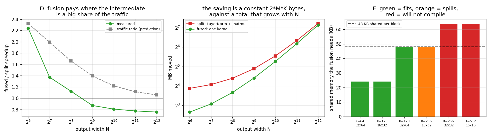

# Fused LayerNorm

---

> Fusing a [LayerNorm](/shared/glossary/#layer-normalization) into the [linear layer](/shared/glossary/#linear-layer) after it is worth **2.24x** — and **0.76x**. Same code, same card; the only thing that changes is how wide the output is. The [traffic](/shared/glossary/#memory-bandwidth) model predicts a win at every width and is wrong at four of seven, because fusion buys fewer bytes at the price of a worse [matmul](/shared/glossary/#matmul) (**3,072 vs 4,171 GFLOP/s**). Also here: the variance formula from every statistics textbook producing **47% NaN**, and a fusion that **cannot compile at all** for any real model width, because it needs 4x more [shared memory](/shared/glossary/#shared-memory) than the card has.

---

## Key Insight

[Kernel fusion](/shared/glossary/#kernel-fusion) is usually taught as a free win: two kernels become one, the intermediate never reaches memory, everybody is happy. It is not free. Fusing forces both operations into a single kernel's resource budget, and the constraint that binds is almost always the *second* operation's — here, the matmul's tile shape. The saving is a **fixed** number of bytes; the cost is a **proportional** loss of throughput. Which one wins is arithmetic you can do before writing any code.

## Why This Matters

"Fuse it" is the standard advice when a model is slow, and it is right often enough that nobody checks. This project gives you the check: **saved bytes ÷ bandwidth, against lost throughput × work.** It also shows the two failure modes people hit when they try — the fused kernel silently becoming a bad matmul, and the fusion simply not fitting for any realistic hidden size. Both are visible before you benchmark anything, from two numbers the compiler will hand you.

---

**This is project 20.**

### The words first

- **[LayerNorm](/shared/glossary/#layer-normalization)** — for each row of a matrix, subtract that row's mean and divide by that row's standard deviation, then scale and shift by learned per-column parameters `γ` and `β`. "Layer" because it normalises across the features of one layer for one example (as opposed to [BatchNorm](/shared/glossary/#batch-normalization), which normalises across the batch for one feature). It is in every transformer block, twice.
- **[Linear layer](/shared/glossary/#linear-layer)** — a matmul against a weight matrix plus a bias: `y = x·W + b`. The operation that immediately follows nearly every LayerNorm in a transformer.
- **[Kernel fusion](/shared/glossary/#kernel-fusion)** — computing two operations in one [kernel](/shared/glossary/#kernel) so the intermediate result never leaves the chip.
- **Intermediate** — the array between two operations. Here it is the normalised `x`, the same size as the input: `M × K` floats that get written by one kernel and read straight back by the next.
- **`ε` (epsilon)** — the small constant added inside the square root, `1/√(var + ε)`. It exists so that a row of identical values (variance exactly 0) does not divide by zero. Typical value 1e-5.
- **[Catastrophic cancellation](/shared/glossary/#catastrophic-cancellation)** — subtracting two nearly equal floating-point numbers. The leading digits cancel, and what is left is made mostly of the rounding error that was hiding in the last digits. Section B is a demonstration.
- **Shared memory budget** — this card gives a [thread block](/shared/glossary/#block) at most **48 KB** of shared memory. `tl.dot` stages both of its operands there, so a fused kernel's tile sizes are bounded by that number.

### Doesn't `torch.compile` already do this? And doesn't PyTorch already have a fast LayerNorm?

Both true, and both leave this project's territory untouched.

**PyTorch's `F.layer_norm` is already one fused kernel.** Section C measures what that buys — **3.02x** over the same LayerNorm written as a chain of tensor operations. That gap is the value a library author already handed you, and it is why you should never hand-write `(x - x.mean(-1, keepdim=True)) / ...` in a hot loop. But it is a fusion *within* LayerNorm.

**`torch.compile` fuses [elementwise](/shared/glossary/#elementwise-operation) operations around a matmul, not into it.** [TorchInductor](/shared/glossary/#torchinductor) will happily fuse a `+ bias` and a `relu` into a matmul's epilogue, because those are cheap per-element transformations of the output. LayerNorm before a matmul is different: it is a *reduction along the same axis the matmul contracts*, so fusing it means restructuring the matmul's tiling around it. General-purpose compilers do not do this, which is exactly why hand-written fused kernels still exist.

**And the reason the fusion is worth understanding rather than just applying:** section D finds it *losing* in four of seven configurations. A tool that fused this automatically and unconditionally would make your model slower most of the time.

---

## Running it

```bash
python run.py       # ~17 s: correctness, numerics, three fusion experiments
```

Hardware: **GTX 1070 Ti** (sm_61), 19 SMs, **48 KB shared memory per block**. Software: **triton 3.6.0**.

Problem: **M = 8192 rows, K = 128 model width**, output width N swept from 64 to 4096. The fused kernel's tile is **BLOCK_M = 32, BLOCK_N = 64**. Section E explains why K is 128 and not 768.

The "split" baseline is `layernorm()` followed by [project 19](../19-triton-matmul/README.md)'s tuned matmul — i.e. two good kernels with the intermediate written to memory between them, which is exactly what eager PyTorch runs.

> **About the numbers.** Every figure comes from the committed
> [`outputs/findings.json`](outputs/findings.json) and
> [`outputs/findings.csv`](outputs/findings.csv).



---

## A. Correctness

| path | relative error vs float64 CPU |
|---|---:|
| `layernorm` (one kernel) | 1.195e-07 |
| `layernorm_chain` (four kernels) | 1.195e-07 |
| LayerNorm + Linear fused, 1D grid | 4.706e-07 |
| LayerNorm + Linear fused, 2D grid | 4.706e-07 |

All at fp32 rounding. The fused paths are 4x looser simply because they include the matmul, which sums 128 products.

---

## B. The variance formula that fails

Every statistics course teaches `Var(x) = E[x²] − E[x]²`, and it is genuinely attractive for a GPU kernel: it needs **one** pass over the row (accumulate `Σx` and `Σx²` together) instead of two (find the mean, then go back and accumulate `Σ(x−μ)²`). One pass means half the loads.

Here it is, against the two-pass centred version, on identical data shifted by a constant. LayerNorm subtracts the mean, so **the shift cannot change the correct answer at all**:

| row mean | centred (two-pass) | one-pass `E[x²] − E[x]²` |
|---:|---:|---|
| 0 | 1.196e-07 | 1.173e-07 |
| 100 | 2.190e-06 | **9.043e-04** (413x worse) |
| 1,000 | 1.962e-05 | **6.749e-02** (3,440x worse) |
| 10,000 | 3.202e-04 | **NaN** — 15,360 of 32,768 outputs |
| 100,000 | 2.310e-03 | **NaN** — 15,488 of 32,768 outputs |

**A row mean of 100 is enough to lose four decimal digits. A row mean of 10,000 produces NaN in 47% of the outputs.**

The mechanism, concretely, at a mean of 10,000 with a true variance of 1:

- `E[x²]` ≈ 100,000,001 and `E[x]²` ≈ 100,000,000.
- fp32 has about 7 significant decimal digits, so near 1e8 the spacing between representable numbers is **about 8**. Both quantities are rounded to a multiple of ~8 before the subtraction happens.
- Subtracting them gives an answer that is entirely made of that rounding — it can come out as 0, or 8, or −8. **A negative variance**, and `rsqrt` of a negative number is NaN.

That last step is why the failure is NaN rather than merely inaccurate: the formula can produce a variance that is *impossible*, and nothing downstream can recover.

The two-pass version subtracts the mean **first**, so every number it squares is already around 1, and there are no large quantities to cancel. It costs one extra pass over data that is already in registers — effectively free.

**Why this matters beyond the toy:** transformer activations do drift away from zero mean, and the "one-pass" formula is exactly what you would reach for if you were writing a fused kernel for rows too long to hold at once (you cannot make two passes over data you are streaming). The correct answer there is **Welford's algorithm**, which updates the mean and the centred sum-of-squares together in one pass without ever forming a large `E[x²]` — the same idea as the running-maximum rescaling in [project 18](../18-triton-softmax/README.md), applied to a different statistic.

---

## C. LayerNorm alone: 3.02x for free

| | ms | GB/s | passes over the data |
|---|---:|---:|---:|
| one kernel (`F.layer_norm`'s shape) | 0.0435 | 193.0 | 2 |
| four kernels (mean, centre, variance, scale) | 0.1317 | 191.1 | 6 |

**3.02x faster, with 3x less traffic, and both running at the same 191–193 GB/s.**

Exactly the pattern from [project 18](../18-triton-softmax/README.md)'s softmax: fusion did not make memory faster, it removed memory. Both kernels are at the memory system's limit; one simply has one third of the work to do. This is the baseline PyTorch already gives you, and everything after this section is about going one step further than the library does.

---

## D. LayerNorm + Linear: 2.24x, then 0.76x

| N | LayerNorm ms | matmul ms | split ms | fused ms | measured | traffic model predicted |
|---:|---:|---:|---:|---:|---:|---:|
| 64 | 0.0515 | 0.0777 | 0.1366 | 0.0610 | **2.24x** | 2.33x |
| 128 | 0.0448 | 0.0844 | 0.1385 | 0.1009 | 1.37x | 1.99x |
| 256 | 0.0440 | 0.1486 | 0.2020 | 0.1796 | 1.12x | 1.66x |
| 512 | 0.0440 | 0.2760 | 0.3292 | 0.3777 | **0.87x** | 1.40x |
| 1024 | 0.0445 | 0.5320 | 0.5844 | 0.7236 | 0.81x | 1.22x |
| 2048 | 0.0451 | 1.0445 | 1.0980 | 1.4165 | 0.78x | 1.12x |
| 4096 | 0.0440 | 2.0593 | 2.1115 | 2.7959 | **0.76x** | 1.06x |

The model predicts a win everywhere. **The measurement says fusion loses from N = 512 onward, and by 24% at the widest.**

### Why the model is right about the bytes and wrong about the time

Count what fusion removes. The intermediate is `M × K` floats, written by the LayerNorm and read by the matmul, so fusion saves `2 × M × K × 4` = **8.4 MB**, regardless of N. At ~200 GB/s that is a **fixed saving of about 0.042 ms** — and look at the LayerNorm column: 0.044 ms, near enough, every row.

Now count what fusion costs, which the traffic model has no way to see:

| N | matmul GFLOP/s (split path) | fused kernel GFLOP/s |
|---:|---:|---:|
| 128 | 3,181 | 2,661 |
| 512 | 3,891 | 2,843 |
| 1024 | 4,036 | 2,968 |
| 4096 | 4,171 | **3,072** |

**The fused kernel is a 26% worse matmul**, and that penalty is proportional to the matmul's own runtime, so it grows without limit as N grows. Two fixed sums, one constant and one proportional — the crossover is inevitable and its location is arithmetic:

```
fusion wins while    0.042 ms   >   0.26 × matmul_ms
i.e. while                          matmul_ms < 0.16 ms
```

which is between N = 256 (0.149 ms) and N = 512 (0.276 ms) — precisely where the measurement crosses 1.0.

### Why the fused kernel is a worse matmul

Because fusion took away its freedom to choose a tile. A standalone matmul picks whatever `BLOCK_M × BLOCK_N × BLOCK_K` is fastest — [project 19](../19-triton-matmul/README.md) found 64×64×32, using 16 KB of shared memory. The fused kernel **must** hold the whole width `K` at once, because that is what the LayerNorm reduction needs, so `BLOCK_K = K = 128` is not negotiable. That single constraint costs it 48 KB of shared memory (see section E), which allows only one block per SM, and forces a tile shape nobody would choose for a matmul alone.

The general statement is worth keeping: **fusion is a constraint on the resource allocation of both operations at once.** The one with the bigger appetite loses, and it is normally the matmul.

### Where the win at N = 64 comes from

At N = 64 the fused kernel is not merely cheaper on traffic — it is a *better* matmul too (2,201 vs 1,728 GFLOP/s). A 8192×128×64 matmul is memory-bound on its own; both kernels are limited by bytes, and the fused one has fewer. Fusion is at its best when neither half of the fused pair was compute-bound to begin with, which is exactly the regime where **elementwise chains** live — and why fusing a chain of pointwise operations is nearly always right, while fusing something into a matmul needs this calculation.

---

## E. The 48 KB wall: why K is 128 and not 768

`tl.dot` stages both operands in shared memory. This fusion holds `BLOCK_M × K` of normalised input and `K × BLOCK_N` of weights simultaneously, so it needs:

```
(BLOCK_M × K  +  K × BLOCK_N) × 4 bytes
```

| K | BLOCK_M × BLOCK_N | needs | result |
|---:|---|---:|---|
| 64 | 32 × 64 | 24 KB | fits, 60 registers, no spilling |
| 128 | 16 × 32 | 24 KB | fits, 48 registers, no spilling |
| **128** | **32 × 64** | **48 KB** | **fits exactly** — 80 registers, no spilling |
| 256 | 16 × 32 | 48 KB | compiles, but **spills 540 bytes per thread** |
| 256 | 32 × 32 | 64 KB | **does not compile**: `out of resource: shared memory` |
| 512 | 16 × 16 | 64 KB | **does not compile** |

**K = 128 with a 32×64 tile lands exactly on the 48 KB limit.** That is the largest usable configuration, and it is why every measurement above uses K = 128.

Now put that next to reality. GPT-2 small has K = 768. Llama-3 8B has K = 4096. **This style of fusion needs 6x to 32x more shared memory than the card has, for any model anyone would actually train.** It is not a tuning problem; the resource does not exist.

### So how do real fused kernels work?

By **never holding a whole row.** The way out is to chunk the reduction axis too, which means:

1. computing the LayerNorm statistics in a streaming pass that never needs the whole row at once (Welford, as in section B), then
2. looping over `K` in `BLOCK_K` chunks inside the matmul, re-normalising each chunk on the fly from the already-computed mean and variance.

That costs an extra read of `x` and gives up part of the saving, but it makes the shared-memory requirement `(BLOCK_M × BLOCK_K + BLOCK_K × BLOCK_N) × 4` — independent of `K`.

Notice what that structure is: **hold a small tile, keep running statistics, rescale as you go.** That is precisely [FlashAttention](/shared/glossary/#flashattention), and it is [project 21](../21-mini-flashattention/README.md). The reason FlashAttention is famous is not that fusing attention was a new idea — it is that it found the tiling that makes the fusion fit, which is the exact obstacle this section just ran into.

---

## F. The experiment that measured the wrong thing

The fused kernel can be organised two ways:

- **1D grid** — one program per row block, which normalises its rows once and then walks the entire output width in a loop. 256 programs, LayerNorm computed once per row.
- **2D grid** — one program per (row block, column block). More programs to fill the machine with, but each one re-normalises the same rows. At N = 4096 that is 64 programs doing identical LayerNorm work.

The prediction was a trade: the 2D version wastes work but has more parallelism, so it should win when there are too few programs and lose when the recomputation dominates.

| N | 1D | 2D | LayerNorm recomputed | ratio |
|---:|---:|---:|---:|---:|
| 256 | 0.183 ms (256 programs) | 7.086 ms (1,024) | 4x | **38.8x** |
| 1024 | 0.725 ms (256) | 28.225 ms (4,096) | 16x | 38.9x |
| 4096 | 2.797 ms (256) | 112.767 ms (16,384) | 64x | **40.3x** |

Doing 4x the work cannot cost 38.8x. The compiler metadata says what actually happened:

| variant | registers | spilled bytes |
|---|---:|---:|
| 1D | 80 | **0** |
| 2D | 32 | **638** |

**The 2D kernel spills 638 bytes per thread.** The ratio is flat at ~39x across a 16x range of recomputation factors, which is the signature of a fixed per-access penalty rather than a work difference — every innermost-loop value is making a round trip to DRAM.

So this experiment does not measure recomputation versus parallelism. It measures a register-allocation decision the compiler made differently for two kernels that look almost identical in source. **That is the finding**, and it is the same one [project 19](../19-triton-matmul/README.md) reached from a different direction: in Triton, an A/B test between two kernel structures is not valid until you have checked `n_spills` on both. Otherwise you will publish a result about your algorithm that is really a result about the register allocator.

---

## What to take away

1. **Fusion has a price, and the price is the fused kernel's freedom to tune itself.** Here it cost 26% of matmul throughput.
2. **The saving is fixed, the cost is proportional.** Saved bytes ÷ bandwidth versus lost throughput × work — do this arithmetic before writing the kernel. It predicted the crossover to within one step of the sweep.
3. **2.24x and 0.76x, same code.** "Fuse it" is not advice, it is a hypothesis about your shapes.
4. **A traffic-only model over-predicts fusion.** It is right about the bytes and blind to what the fusion did to the arithmetic.
5. **Fusing pointwise chains is nearly always right; fusing into a matmul needs the calculation.** The N = 64 row wins on both counts precisely because nothing there was compute-bound.
6. **`Var = E[x²] − E[x]²` fails at a row mean of 100 and NaNs at 10,000.** It can return a negative variance, which is not an approximation error but an impossible answer.
7. **This fusion cannot compile for any real model width.** 48 KB of shared memory caps K at 128; GPT-2 needs 768. The fix is to chunk the reduction axis, which is what FlashAttention is.
8. **Check `n_spills` before believing any Triton A/B result.** A 39x "recomputation cost" was 638 spilled bytes.
9. **The library's fusion is worth 3.02x on its own.** Never hand-write LayerNorm as a chain of tensor operations.

## Files

| File | What it is |
|---|---|
| [`layernorm.py`](layernorm.py) | LayerNorm four ways, the fused LayerNorm+Linear kernels (1D and 2D grid), and the byte counts |
| [`run.py`](run.py) | the six sections, tabulation and plots |
| [`outputs/findings.json`](outputs/findings.json) | every measurement, including per-variant registers and spills |
| [`outputs/findings.csv`](outputs/findings.csv) | one row per measurement |
| [`outputs/fused_layernorm.png`](outputs/fused_layernorm.png) | the three panels above |

Shared helpers come from [`../18-triton-softmax/gpu.py`](../18-triton-softmax/gpu.py); the matmul baseline is [`../19-triton-matmul/matmul.py`](../19-triton-matmul/matmul.py).

## Next

[Project 21](../21-mini-flashattention/README.md) takes the obstacle section E ran into head-on. [Attention](/shared/glossary/#attention) has an intermediate that is not `M × K` but `S × S` — quadratic in sequence length, and far too large to keep. FlashAttention's answer is to tile *both* axes and carry running statistics across the tiles, which is the [online softmax](/shared/glossary/#online-softmax) from [project 18](../18-triton-softmax/README.md) doing real work. The result is a fusion that gets more valuable as the problem gets bigger, rather than less.
