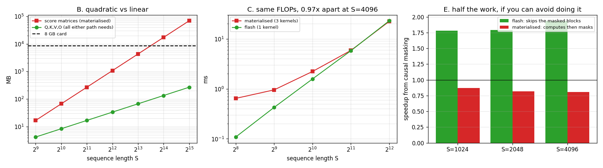

# Mini FlashAttention

---

> A [FlashAttention](/shared/glossary/#flashattention)-style kernel in ~40 lines of [Triton](/shared/glossary/#triton), matching a float64 reference to **4.1e-07**. It is **5.9x** faster than the textbook three-kernel version at S = 256 — and **0.97x** at S = 4096, because on this card [attention](/shared/glossary/#attention) is not [memory-bound](/shared/glossary/#memory-bandwidth). What it *is*, unambiguously, is **256x smaller**: at S = 16,384 the materialised path asks for **8 GiB for one intermediate and dies**, while the same kernel that ran at S = 256 finishes in 354 ms using 134 MB, at **exactly the same GFLOP/s**. And causal masking, which speeds the flash kernel up **1.93x**, makes the materialised one **19% slower**.

---

## Key Insight

FlashAttention is usually sold as a speed trick, and its speed comes from a memory-traffic argument that is true on the hardware it was designed for and *not* true here. What survives on every machine is the structural claim: **the S × S attention matrix never has to exist.** That converts attention's memory cost from quadratic to linear in sequence length, and no amount of extra [HBM](/shared/glossary/#hbm) makes a quadratic term go away. Long context exists because of this, not because of the speedup.

## Why This Matters

This project is where three earlier ideas become one kernel. The running-maximum rescale from [project 18](../18-triton-softmax/README.md) is here doing real work; the two-level tiling from [project 17](../17-cuda-tiled-matmul/README.md) is what makes the blocks fit; and the shared-memory wall that stopped [project 20](../20-fused-layernorm/README.md)'s fusion is dissolved by tiling the reduction axis instead of holding it. It is also the project where a famous result **fails to reproduce on this hardware for a reason worth understanding**, which is a more useful thing to have measured than another confirmation.

---

**This is project 21.**

### The words first

- **[Attention](/shared/glossary/#attention)** — for each query vector, score it against every key vector, [softmax](/shared/glossary/#softmax) the scores into weights, and return that weighted average of the value vectors. With S queries and S keys the score matrix is **S × S**.
- **Materialised** — "made into a material thing", i.e. actually built in memory as an array. The textbook implementation materialises the S × S scores and then the S × S probabilities.
- **[FlashAttention](/shared/glossary/#flashattention)** — the same mathematics, reorganised so that the S × S matrix is produced one small tile at a time inside the [SM](/shared/glossary/#sm) and never written out. Dao et al., 2022.
- **[Online softmax](/shared/glossary/#online-softmax)** — computing a softmax while the data streams past, keeping a running maximum and a running sum and correcting both whenever the maximum moves. Introduced in [project 18](../18-triton-softmax/README.md), section E.
- **Causal mask** — in a language model, position *i* may only attend to positions ≤ *i*. "Causal" as in *cause precedes effect*: the future must not influence the past. It zeroes out the upper triangle, which is half the work.
- **[Ridge point](/shared/glossary/#roofline)** — the [arithmetic intensity](/shared/glossary/#ai-arithmetic-intensity) at which a machine stops being memory-bound and starts being compute-bound. This card: **32 FLOP/byte**. An A100: **156**. Section C is entirely about that difference.

### If the two versions do the same arithmetic, what is there to gain?

They do exactly the same arithmetic — the FLOP counts are identical and the answers agree to 4e-07. What differs is **what has to exist at once**:

| | S × S matrix in memory? | extra memory | at S = 16,384 |
|---|---|---|---|
| materialised | yes, twice (scores, then probabilities) | `2 · H · S² · 4` bytes | **8 GiB per buffer — will not allocate** |
| flash | never | 0 | 134 MB total, runs in 354 ms |

The reason it can be avoided is not obvious, and it is the whole idea. Softmax looks like it needs the entire row before it can produce any output: you cannot divide by a sum you have not finished computing. FlashAttention's answer is to compute the output *anyway*, with the sum-so-far, and then **retroactively correct it** each time a new block changes the running maximum:

```python
m_new = tl.maximum(m_i, tl.max(s, axis=1))     # has the row maximum moved?
alpha = tl.exp(m_i - m_new)                    # by how much is the old total wrong?
l_i   = l_i * alpha + tl.sum(p, axis=1)        # fix the running sum ...
acc   = acc * alpha[:, None] + tl.dot(p, v)    # ... and the running output
m_i   = m_new
```

The first three lines are [project 18](../18-triton-softmax/README.md)'s online softmax verbatim. **The fourth line is FlashAttention.** The same scalar `alpha` that rescales the running sum also rescales the running weighted average of value vectors — because both are sums of terms of the form `exp(sᵢ − m)·something`, and changing `m` multiplies every term by the same constant.

That is the entire trick, and everything else in the kernel is tiling.

### Isn't this just [project 20](../20-fused-layernorm/README.md)'s fusion again?

Same family, opposite outcome, and the difference is instructive. [Project 20](../20-fused-layernorm/README.md) fused a reduction into a matmul by holding a whole row of width `K`, and that hit a wall: 48 KB of [shared memory](/shared/glossary/#shared-memory) caps `K` at 128, so the fusion cannot compile for any real model width.

FlashAttention does not hold a whole row. It holds a `BLOCK_M × D` query tile and streams `BLOCK_N × D` key and value tiles past it, so its shared-memory requirement depends on the **block sizes**, never on S. That is why this fusion scales to S = 16,384 and [project 20](../20-fused-layernorm/README.md)'s does not scale to K = 256. **The lesson [project 20](../20-fused-layernorm/README.md) ended on — "chunk the reduction axis" — is what this kernel does, and section B is what it buys.**

---

## Running it

```bash
python run.py       # ~14 s: correctness, memory, speed, causal, tiles
```

Hardware: **GTX 1070 Ti** (sm_61), 19 SMs, **8 GB**, fp32 peak 8,190 GFLOP/s, 256.3 GB/s, ridge point 32 FLOP/byte.

Problem: **8 heads, head dimension D = 64**, sequence length swept. The flash kernel's tile is `BLOCK_M = 64`, `BLOCK_N = 32`, 8 [warps](/shared/glossary/#warp).

The materialised baseline is built from the *other projects' kernels*: [project 19](../19-triton-matmul/README.md)'s tuned matmul for both `QKᵀ` and `PV`, and [project 18](../18-triton-softmax/README.md)'s fused softmax in between. It is not a strawman — each of its three kernels is the best version this phase has produced.

> **About the numbers.** Every figure comes from the committed
> [`outputs/findings.json`](outputs/findings.json) and
> [`outputs/findings.csv`](outputs/findings.csv).



---

## A. Correctness

| S | causal | flash | materialised |
|---:|---|---:|---:|
| 128 | no | 5.147e-07 | 5.326e-07 |
| 128 | yes | 2.059e-07 | 2.833e-07 |
| 256 | no | 4.144e-07 | 4.508e-07 |
| 256 | yes | 2.284e-07 | 2.412e-07 |

Both paths land at fp32 rounding against a float64 CPU reference, and **the flash kernel is very slightly the more accurate of the two** on every row. That is not noise: the materialised path rounds to fp32 twice more than the flash kernel does — once when it stores the scores and once when it stores the probabilities — while the flash kernel keeps everything in fp32 registers from the score to the output.

Worth stating plainly because the intuition often runs the other way: the incremental rescaling *looks* like it should accumulate error, and it does not. Every rescale multiplies by `exp(m_old − m_new)`, which is ≤ 1 and exact to within one rounding, and the running maximum only ever grows, so nothing is ever scaled up.

---

## B. The result that does not depend on the hardware

| S | Q, K, V, O | score matrices | ratio | fits in 8 GB? |
|---:|---:|---:|---:|---|
| 512 | 4.2 MB | 16.8 MB | 4.0x | yes |
| 1024 | 8.4 MB | 67.1 MB | 8.0x | yes |
| 2048 | 16.8 MB | 268.4 MB | 16.0x | yes |
| 4096 | 33.6 MB | 1,073.7 MB | 32.0x | yes |
| 8192 | 67.1 MB | 4,295.0 MB | 64.0x | barely |
| **16384** | **134.2 MB** | **17,179.9 MB** | **128.0x** | **no** |
| 32768 | 268.4 MB | 68,719.5 MB | 256.0x | no |

And not as a prediction — the run actually tries it:

```
at S=16384: materialised score matrix -> OutOfMemoryError: CUDA out of memory.
                                         Tried to allocate 8.00 GiB.
at S=16384: flash ran in 354.2 ms (1552 GFLOP/s), using 134.2 MB
```

**1,552 GFLOP/s at S = 16,384 is the same rate the kernel achieved at S = 256.** The flash kernel does not notice the sequence getting 64 times longer; it just runs longer. The materialised path does not get slower — it stops existing.

This is the part of FlashAttention that is not a hardware-dependent optimisation. Everything in section C could reverse on a different card. **The `H · S² ` term cannot be reduced by buying more memory; it can only be removed by not writing it down.** Long-context models are downstream of that sentence.

---

## C. Speed: 5.9x, then 0.97x

| S | materialised | flash | speedup | materialised MB moved | flash MB moved | flash GFLOP/s |
|---:|---:|---:|---:|---:|---:|---:|
| 256 | 0.6440 ms | 0.1086 ms | **5.93x** | 10.5 | 5.2 | 1,236 |
| 512 | 0.9527 | 0.4251 | 2.24x | 37.7 | 18.9 | 1,263 |
| 1024 | 2.2229 | 1.5750 | 1.41x | 142.6 | 71.3 | 1,363 |
| 2048 | 5.8632 | 5.7797 | 1.01x | 553.6 | 276.8 | 1,486 |
| 4096 | 22.3373 | 23.0078 | **0.97x** | 2,181.0 | 1,090.5 | 1,493 |

Flash moves exactly **half** the bytes at every size, and by S = 2048 that is worth nothing.

### Why the traffic saving stops paying

Both paths converge on the same throughput: at S = 4096 the materialised path does 34.4 GFLOP in 22.34 ms = **1,539 GFLOP/s**, and flash does the same 34.4 GFLOP in 23.01 ms = **1,493 GFLOP/s**. Neither is anywhere near a memory limit — the materialised path's 2,181 MB in 22.3 ms is **97.7 GB/s**, less than half of the 200 GB/s this card sustains.

**They are not competing on memory at all. They are both stuck at the same compute rate, and it is 18% of the card's fp32 peak.**

The cause is the shape of attention's matmuls. `QKᵀ` contracts over **D = 64** and `PV` produces only **64** columns; [project 19](../19-triton-matmul/README.md) measured 5,700 GFLOP/s on a square matmul and this is nothing like a square matmul. A skinny contraction gives each loaded value far less reuse, exactly as [project 17](../17-cuda-tiled-matmul/README.md)'s early rungs showed.

An independent check that this is the workload and not a weak kernel: [project 15](../15-l2-hit-rate-analysis/README.md) wrote a completely separate FlashAttention-style kernel in **CUDA C** for a different purpose, and measured **1.39 TFLOP/s**. Two implementations, two languages, the same ceiling.

### Why the paper's result is real anyway

FlashAttention's headline speedups were measured on an A100, and the relevant number is the [ridge point](/shared/glossary/#roofline) — the arithmetic intensity above which a machine is compute-bound:

| card | peak (the precision used) | bandwidth | ridge point |
|---|---:|---:|---:|
| GTX 1070 Ti (here) | 8.2 TFLOP/s fp32 | 256 GB/s | **32 FLOP/byte** |
| A100 | 312 TFLOP/s fp16 tensor core | 2,039 GB/s | **153 FLOP/byte** |

The materialised path's arithmetic intensity here is 34.4 GFLOP / 2.18 GB = **15.8 FLOP/byte**. On this card that is only 2x below the ridge, so halving the traffic moves you a little way along a roof you are not standing on. On an A100 it is **10x** below the ridge, squarely in memory-bound territory, and halving the traffic is close to halving the time.

**A card with tensor cores has a much higher ridge point, which makes far more operations memory-bound.** That is the single most important consequence of the tensor-core era, and it is why memory-traffic optimisations went from "nice" to "the entire field" after 2020. This card is from 2017 and has not had that happen to it. ([Project 10](../10-spec-compare/README.md) computed ridge points across eight generations and found the same trend: 139 on a V100, 295 on an H100.)

**The honest summary:** on this hardware FlashAttention is a memory-capacity win, not a speed win. On the hardware people run models on, it is both. Neither statement contradicts the other, and knowing which regime you are in is the difference between a useful optimisation and a wasted week.

---

## E. Causal masking: 1.93x, or −19%

| S | flash full → causal | flash | materialised full → causal | materialised |
|---:|---|---:|---|---:|
| 1024 | 1.616 → 0.907 ms | **1.78x faster** | 2.219 → 2.551 ms | **0.87x — slower** |
| 2048 | 5.780 → 3.226 ms | 1.79x faster | 5.862 → 7.175 ms | 0.82x — slower |
| 4096 | 22.934 → 11.860 ms | **1.93x faster** | 22.334 → 27.677 ms | **0.81x — slower** |

Causal masking removes half the work. The flash kernel collects nearly all of it; the materialised path is made *worse* by it.

**Why flash wins.** The mask is a property of the *tile*, known before any of its work begins: a query block covering rows 128-191 cannot attend to a key block covering columns 512-543, so the loop simply stops early:

```python
hi = (pid_m + 1) * BLOCK_M if CAUSAL else S
for start_n in range(0, hi, BLOCK_N):
```

Skipped blocks cost nothing — no loads, no `tl.dot`, no exp. The measured 1.93x approaches the theoretical 2x; the shortfall is the diagonal blocks, which are half-masked and must be computed in full anyway.

**Why the materialised path loses.** It computes the whole S × S score matrix before it can mask anything, then runs an *extra kernel* over all S² entries to write `−inf` into the upper triangle, then softmaxes all S² of them. It does 100% of the work, plus a full extra pass, to produce an answer that needed 50%. Hence 0.81x: **the mask is pure cost when you cannot use it to avoid work.**

This is the sharpest illustration in the project of what "reorganising the loops" actually buys. Nothing about the mask changed; what changed is whether the implementation was in a position to act on it. In a real language model every attention layer is causal, so this factor is not a special case — it is the normal case.

---

## F. Tile shapes

At S = 2048:

| BLOCK_M | BLOCK_N | warps | GFLOP/s | registers | spilled | shared |
|---:|---:|---:|---:|---:|---:|---:|
| 32 | 32 | 4 | 1,466 | 96 | 0 | 24.0 KB |
| 64 | 32 | 4 | 1,410 | 255 | **22 B** | 32.2 KB |
| 64 | 32 | 8 | 1,478 | 116 | 0 | 32.2 KB |
| 64 | 64 | 4 | 1,452 | 191 | 0 | 48.0 KB |
| 64 | 64 | 8 | **1,480** | 255 | **2 B** | 48.0 KB |
| 128 | 32 | 8 | — | **did not compile** — needs 56.5 KB | | |

**A 1.05x spread across everything that compiles.** After [project 19](../19-triton-matmul/README.md)'s 3.17x sweep this looks disappointing, and it is the correct result: that sweep's spread was almost entirely the spill cliff, and here even the spilling configurations barely spill (22 and 2 bytes, versus 32–46 there). When a kernel is limited by the shape of its arithmetic rather than by its resource use, the resource knobs have nothing to move.

Note the shared-memory arithmetic, which is what stops `BLOCK_M = 128`: the kernel holds a query tile plus a key tile plus a value tile, `(BLOCK_M + 2 · BLOCK_N) · D · 4` bytes, and 128 rows of queries needs 56.5 KB against a 48 KB budget. **Crucially, S is not in that formula** — which is the whole reason this kernel scales and [project 20](../20-fused-layernorm/README.md)'s did not.

---

## What to take away

1. **The S × S matrix never has to exist.** That is the part of FlashAttention no hardware can take away, and it is what long context is built on.
2. **The trick is four lines.** Keep a running maximum; when it moves, multiply the running sum *and the running output* by `exp(m_old − m_new)`. The output rescale is the only thing added to [project 18](../18-triton-softmax/README.md)'s online softmax.
3. **5.93x at S = 256, 0.97x at S = 4096.** On this card attention is compute-bound at ~1,500 GFLOP/s, so halving the traffic buys nothing at large S.
4. **Both paths hit the same 1,500 GFLOP/s**, 18% of peak, because attention's matmuls contract over only 64. An independent CUDA kernel in [project 15](../15-l2-hit-rate-analysis/README.md) measured 1.39 TFLOP/s — same ceiling, different implementation.
5. **Tensor cores are why memory optimisations took over the field.** They raise the ridge point from 32 to 153 FLOP/byte, which moves attention from "slightly memory-bound" to "badly memory-bound". This 2017 card never had that happen.
6. **At S = 16,384 the materialised path asks for 8 GiB and dies; flash uses 134 MB and holds its throughput exactly.** Capacity, not speed, is the argument that always holds.
7. **Causal masking: 1.93x for flash, 0.81x for materialised.** Half the work is only a saving if your loop structure lets you skip it — otherwise the mask is an extra pass over data you then discard.
8. **The flash kernel is slightly *more* accurate**, because it rounds to fp32 twice fewer times. Incremental rescaling does not accumulate error when every rescale factor is ≤ 1.
9. **Tile knobs are worth 1.05x here.** When the binding constraint is the shape of the arithmetic, resource knobs have nothing to move — and knowing that saves you the sweep.

## Files

| File | What it is |
|---|---|
| [`flash.py`](flash.py) | the flash kernel, the materialised path, and the FLOP and byte counts |
| [`run.py`](run.py) | the six sections, including the out-of-memory test |
| [`outputs/findings.json`](outputs/findings.json) | every measurement |
| [`outputs/findings.csv`](outputs/findings.csv) | one row per measurement |
| [`outputs/mini_flashattention.png`](outputs/mini_flashattention.png) | the three panels above |

Shared helpers come from [`../18-triton-softmax/gpu.py`](../18-triton-softmax/gpu.py); the materialised baseline reuses [`../18-triton-softmax/softmax.py`](../18-triton-softmax/softmax.py) and [`../19-triton-matmul/matmul.py`](../19-triton-matmul/matmul.py).

## Next

[Project 22](../22-custom-op-registration/README.md) closes the phase by answering the question every kernel in it has been avoiding: **how does a hand-written kernel become something a framework can actually use?** A Triton kernel called directly from Python is invisible to [autograd](/shared/glossary/#autograd), invisible to [torch.compile](/shared/glossary/#torchcompile), and silently wrong under a few common transformations. Registering it as a [custom op](/shared/glossary/#custom-op) fixes all three — and the project measures exactly what breaks without each piece.
