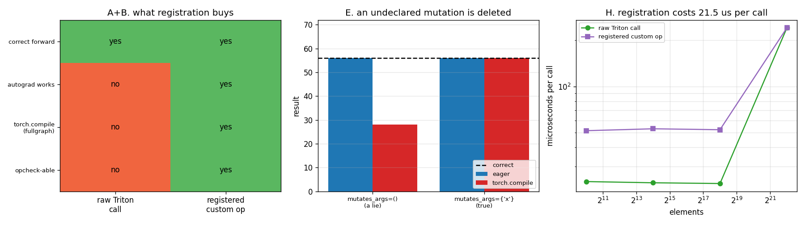

# Custom Op Registration

---

> A correct [Triton](/shared/glossary/#triton) kernel called directly from Python **silently switches off [autograd](/shared/glossary/#autograd)** — the output comes back with `requires_grad = False` and the error surfaces later, somewhere else. Registering it as a [custom op](/shared/glossary/#custom-op) fixes that, makes it a single node in a compiled graph, and costs **~29 µs per call** (100% overhead on a small tensor, 0.1% on a large one). Getting the declaration wrong is worse than not registering: an undeclared mutation makes [torch.compile](/shared/glossary/#torchcompile) return **28.0 where the answer is 56.0**, with no warning. And the closing irony of the phase: PyTorch's Triton-based compiler **refuses this GPU as too old for Triton**, on a card where every hand-written Triton kernel in projects 18–21 ran fine.

---

## Key Insight

A kernel is a function; an **operator** is a function plus a set of promises about it — what shapes it returns, what it modifies, what its derivative is. PyTorch does not need those promises to *call* your kernel; it needs them to reason about it. Every framework feature that looks like magic — autograd, `torch.compile`, [fake-tensor](/shared/glossary/#fake-tensor) tracing, `vmap`, distributed sharding — is reasoning about operators. A kernel that has not made the promises is invisible to all of it, and a kernel that has made *wrong* promises is worse than invisible.

## Why This Matters

Projects 16 through 21 wrote kernels. This is where a kernel becomes something a model can contain. The failure modes are the point: not one of them is a crash at the site of the mistake. The autograd loss shows up as a missing gradient in a training run; the undeclared mutation shows up as a wrong number under `torch.compile` and the right number in eager, which is the single most painful class of bug in the framework. Both are prevented by two lines of declaration and caught by one line of testing.

---

**This is project 22.**

### The words first

- **Operator (op)** — an entry in PyTorch's registry of functions, with a **schema** (name, argument types, return types) and one implementation per device. `torch.relu` is an operator; a Python function that happens to call a kernel is not.
- **[Dispatcher](/shared/glossary/#dispatcher)** — the layer that looks at an operator call and decides which implementation to run: the CUDA kernel, the CPU kernel, the autograd wrapper, the fake-tensor rule, and so on. It is the mechanism that lets one name mean different things in different contexts.
- **[Fake tensor](/shared/glossary/#fake-tensor)** (also **[meta tensor](/shared/glossary/#meta-tensor)**) — a tensor with a shape, dtype and device but **no data**. Compilers trace through fake tensors so they can work out shapes without running anything. "Fake" is literal: nothing is allocated and nothing is computed.
- **`register_fake`** — the function you supply that says what shape/dtype your op returns, given only the shapes/dtypes of its inputs. Without it, nothing can trace your op.
- **`mutates_args`** — the declaration of which arguments your op writes into. Section E is about what happens if you get it wrong.
- **[Graph break](/shared/glossary/#graph-break)** — when the compiler meets something it cannot represent, it stops, runs that part in the interpreter, and starts a new graph. Optimisations do not cross a graph break.
- **`fullgraph=True`** — tells `torch.compile` to raise instead of breaking, so graph breaks become visible rather than merely expensive.
- **AOT** in `aot_eager` — **A**head-**O**f-**T**ime: the backward graph is built when the forward is traced, rather than lazily as the forward runs. `aot_eager` builds the graphs and then runs them with ordinary eager kernels, which makes it the right backend for testing *tracing* separately from *code generation*.
- **[TorchInductor](/shared/glossary/#torchinductor)** — the default `torch.compile` backend. It generates Triton for GPUs and C++ for CPUs. Section G is about it refusing to run here.

### The kernel

`silu(a) * b` — the SwiGLU activation, from the feed-forward block of every Llama-family model. It is a genuine fused kernel: written as tensor operations it produces two full-size intermediates (`sigmoid(a)` and `a·sigmoid(a)`), and one kernel produces none.

### "It already computes the right answer — what is registration *for*?"

That is the question this project exists to answer, and the honest form of it is: *the forward pass is the easy part.* Section A shows a raw call getting the forward exactly right and failing at everything else:

| | raw Triton call | registered op |
|---|---|---|
| correct forward | **yes** (max error 1.431e-06) | yes (identical) |
| output carries `requires_grad` | **no** | yes |
| `.backward()` works | **no** | yes |
| `torch.compile(fullgraph=True)` | **no** | yes |
| testable with `opcheck` | **no** | yes |

The reason is mechanical rather than mysterious. Autograd is implemented *in the dispatcher*: when you call `torch.mul`, the dispatcher intercepts it, runs the multiply, and attaches a `grad_fn` to the result recording how to differentiate it. Your Triton launch never goes through the dispatcher — it writes into a tensor you allocated with `torch.empty_like` and hands it back. That tensor is exactly as new and as history-free as any other freshly allocated tensor.

**Registration is not wrapping. It is telling the dispatcher your function exists**, in a form it can attach all of its machinery to.

---

## Running it

```bash
python run.py       # ~15 s: eight sections, several of which are meant to fail
```

Hardware: **GTX 1070 Ti** (sm_61). Software: **torch 2.11.0+cu130, triton 3.6.0**.

Most of the compile tests use `backend="aot_eager"` rather than the default `"inductor"`, because on this card inductor refuses to run at all — section G, which turns out to be the most interesting thing in the project.

> **About the numbers.** Every figure comes from the committed
> [`outputs/findings.json`](outputs/findings.json) and
> [`outputs/findings.csv`](outputs/findings.csv).



---

## A. The naked kernel

```
forward is correct:            max error 1.431e-06
input requires grad:           True
output requires grad:          False   <- silently dropped
.backward():                   RuntimeError: element 0 of tensors does not
                               require grad and does not have a grad_fn
torch.compile(fullgraph=True): Unsupported: torch.* op returned non-Tensor
```

Read the third and fourth lines together, because the gap between them is the whole hazard. **The kernel did not complain.** It accepted a tensor that required gradients, produced a correct answer, and returned it with the history detached. The error came later, from `.backward()`, and it names a tensor rather than a kernel.

In a real model that gap is much wider. If your custom op sits on one branch of a network and other branches still produce gradients, `.backward()` will not raise at all — it will simply compute nothing for the parameters upstream of your kernel. **The layer stops learning and the training run completes normally.**

---

## B. Registration

```python
@torch.library.custom_op("aihw::silu_mul", mutates_args=())
def silu_mul(a: torch.Tensor, b: torch.Tensor) -> torch.Tensor:
    o = torch.empty_like(a)
    _silu_mul_fwd[(triton.cdiv(a.numel(), 1024),)](a, b, o, a.numel(), BLOCK=1024)
    return o

@silu_mul.register_kernel("cpu")
def _(a, b):
    return F.silu(a) * b

@silu_mul.register_fake
def _(a, b):
    return torch.empty_like(a)
```

Three declarations and the same kernel:

```
forward is correct:            max error 1.431e-06   (identical)
torch.compile(fullgraph=True): compiled, max error vs eager 0.000e+00
the captured graph contains:   aihw.silu_mul.default, <built-in function mul>
```

That last line is the point of the whole exercise. The compiler captured the whole function into one graph, and our kernel is **a single node in it** — a first-class operation sitting next to a built-in multiply. Whatever the compiler does to the graph (reordering, fusing the neighbours, building a backward pass, sharding it across devices) it now does around a node it understands the contract of.

The **type annotations are load-bearing**, not documentation: `torch.library.custom_op` reads them to build the operator's schema. Change `-> torch.Tensor` to `-> list[torch.Tensor]` and the registered signature changes with it.

The **CPU kernel** is not just politeness. It makes the op runnable in tests and on machines without a GPU — and section F needs it, because `opcheck` compares your op against itself across dispatch paths and cannot do that on a card whose eager kernels do not run.

The **name** `aihw::silu_mul` has two parts: a *namespace* and an *operator name*. The namespace prevents your `silu_mul` from colliding with a library's; use your project's name and nothing else.

---

## C. The fake kernel

| | what happens |
|---|---|
| no `register_fake` at all | `TorchRuntimeError: RuntimeError when making fake tensor call` |
| a `register_fake` that returns the wrong shape | **compiles anyway**, returns shape `(8,)` — the same as eager |

The first is the expected failure: a compiler tracing with fake tensors reaches your op, has no rule for it, and cannot continue. Loud, immediate, easy to fix.

**The second is the interesting one, and it is a warning about how you test.** A fake implementation that claims half the input length was accepted, and in this small graph the compiled result came out with the right shape regardless — because `aot_eager` in this simple case did not need to rely on the claim. So "I compiled it and it worked" proved nothing. In a larger graph, where a downstream operation's shapes are computed from the traced shape, the same lie produces a shape mismatch far from its cause, or a silently wrong stride.

This is exactly why section F exists: `opcheck` catches it immediately, by running your op on both fake and real tensors and comparing the metadata.

**What the fake implementation is really for:** every compiler pass that runs *before* execution — shape propagation, memory planning, deciding whether two tensors can share storage — needs to know your op's output shape without running it. `register_fake` is that knowledge, and it must be derivable from shapes alone. An op whose output shape depends on its input *values* (like `nonzero`) needs extra machinery for exactly this reason.

---

## D. Autograd

```python
def _setup_context(ctx, inputs, output):
    a, b = inputs
    ctx.save_for_backward(a, b)

def _backward(ctx, grad):
    a, b = ctx.saved_tensors
    g = silu_mul_bwd(a, b, grad.contiguous())      # a second Triton kernel
    return g[0], g[1]

silu_mul.register_autograd(_backward, setup_context=_setup_context)
```

| | |
|---|---|
| output `grad_fn` | `GeneratedBackwardFor_aihw_silu_mul_defaultBackward` |
| `d/da` max error vs CPU reference | **7.153e-07** |
| `d/db` max error vs CPU reference | 4.768e-07 |

The split into `setup_context` and `backward` is not decoration. `setup_context` runs during the forward and is the *only* place allowed to stash tensors, which is what lets the compiler know — while tracing the forward — exactly which tensors the backward will need. A single combined function would hide that, and the backward graph could not be built ahead of time.

Note also that the backward is **itself a registered custom op**, not a plain function. That is deliberate: the backward pass gets traced and compiled too, so it needs its own schema and fake implementation for the same reasons the forward does.

`grad.contiguous()` is there because an incoming gradient may be a non-contiguous view, and the kernel indexes flat memory. Skipping it produces wrong gradients on some graphs and correct ones on others — the kind of bug that only appears once your op is used somewhere new.

---

## E. `mutates_args`: 56.0 in eager, 28.0 compiled

Two operators, identical bodies, one declaration apart:

```python
@torch.library.custom_op("aihw::double_lie", mutates_args=())      # a lie
def double_lie(x: torch.Tensor) -> None:
    x.mul_(2.0)

@torch.library.custom_op("aihw::double_honest", mutates_args={"x"})  # true
def double_honest(x: torch.Tensor) -> None:
    x.mul_(2.0)
```

Called as `y = x.clone(); double_*(y); return y.sum()`, on `x = [0..7]`, where the correct answer is 56.0:

| | eager | `torch.compile` |
|---|---:|---:|
| `mutates_args=()` (a lie) | 56.0 | **28.0 — wrong, silently** |
| `mutates_args={"x"}` (true) | 56.0 | 56.0 |

**The compiler deleted the call.** Its reasoning is impeccable: an operator that mutates nothing and returns nothing has no effect, so nothing downstream depends on it, so it can be removed. The declaration said the op was pure; the compiler took it at its word.

Three things make this the worst bug in the project:

- **Eager is right.** You will develop, test and review in eager and see 56.0 every time.
- **There is no error, no warning, and no NaN.** 28.0 is a perfectly plausible number.
- **It is exactly the kind of kernel people hand-write.** In-place operations — an optimiser step, a KV-cache write, an in-place activation — are where fused kernels pay off most, and they are precisely the ones that must declare what they touch.

The honest declaration turns the mutation into part of the contract: the compiler then knows the call has an effect, orders it correctly with respect to every other use of `y`, and keeps it.

---

## F. `opcheck`

| operator | result |
|---|---|
| `aihw::silu_mul` | **PASS** |
| `aihw::relu_badfake` | `OpCheckError: test_faketensor failed ... Shapes torch.Size([8]) and torch.Size([4]) are not equal!` |

`torch.library.opcheck(op, args)` runs your operator through the dispatch paths a compiler would use and checks they agree with each other: the real kernel against the fake one, the autograd registration against a numerical gradient, the schema against what the function actually does. It caught the wrong shape in section C — the one that "compiled fine" — in one line.

**Put it in your test suite.** It is the only tool here that finds these mistakes at the place they were made rather than three layers downstream. The one caveat on this machine: it must run on CPU tensors, because it internally uses ordinary PyTorch operations to compare results and those cannot run on this GPU. That is a good reason to register a CPU kernel even when you only care about GPU performance.

---

## G. The inductor gate, and the irony that closes the phase

```
torch.compile(backend="inductor") on this GPU:
  GPUTooOldForTriton: Found NVIDIA GeForce GTX 1070 Ti which is too old to be
  supported by the triton GPU compiler, which is used as the backend.
  Triton only supports devices of CUDA Capability >= 7.0

the same Triton kernel, called by hand on the same GPU:
  ran fine, max error 4.768e-07

torch.compile(backend="inductor") on the CPU:
  compiled, max error 0.000e+00
```

**PyTorch refuses to compile for this card on the grounds that Triton does not support it, while Triton supports it.** Projects 18 through 21 wrote five substantial Triton kernels — softmax, matmul, fused LayerNorm, FlashAttention — and every one of them compiled and ran here.

The explanation is that these are two different claims:

- **Triton's compiler** targets whatever architecture it finds. Its NVIDIA backend still emits PTX for sm_61, and the features these projects used (`tl.dot`, reductions, atomics) all lower to instructions Pascal has.
- **TorchInductor's generated Triton** is written against a newer baseline. It assumes primitives such as the asynchronous copy instruction `cp.async` and tensor-core `mma` shapes that appeared with Volta (CC 7.0). Rather than emit code that would fail at compile time in a confusing way, inductor checks the capability up front and refuses.

So `GPUTooOldForTriton` is a **policy floor in PyTorch, not a limit of Triton**, and both projects are right about their own scope. It is worth having seen once, because the general lesson generalises far beyond this card: *a framework's supported-hardware list is a decision about what its maintainers will generate code for, and it is usually stricter than what the hardware can do.* When a tool tells you your hardware is unsupported, "the hardware cannot" and "this tool will not" are different sentences.

It also explains the shape of this whole phase. Every kernel in projects 18–21 had to be hand-written in Triton rather than obtained from `torch.compile`, and the results were better teaching material for it.

The CPU line shows the other side: on CPU, inductor compiles the graph happily and treats `aihw::silu_mul` as an **opaque node**. It will fuse the operations around it and never into it — which is the standing trade of a custom op. You get a kernel the compiler could not have written; the compiler gets a box it cannot see into.

---

## H. What registration costs

| elements | raw Triton call | registered op | overhead | ratio |
|---:|---:|---:|---:|---:|
| 1,024 | 23.95 µs | 51.47 µs | **27.52 µs** | 2.15x |
| 16,384 | 23.52 µs | 52.96 µs | 29.44 µs | 2.25x |
| 262,144 | 23.26 µs | 52.23 µs | 28.97 µs | 2.25x |
| 4,194,304 | 241.51 µs | 241.71 µs | **0.21 µs** | 1.00x |

**A flat ~29 µs per call**, which is 125% overhead on a small tensor and 0.1% on a large one. That is the dispatcher walking its key set, the autograd layer deciding whether to record, and the schema being matched against the arguments — real work, done on the CPU, once per call regardless of tensor size.

Two things worth noticing.

**The raw call is already 24 µs, and none of that is the GPU.** [Project 3](../03-bandwidth-measurement/README.md) measured the hardware's kernel-launch floor at **1.11 µs**. Everything above that is Python: argument handling, Triton's cache lookup, grid computation. At n = 1024 the GPU finishes long before Python can ask for the next launch — **the card is idle and the interpreter is the bottleneck**, which is the real reason CUDA Graphs and `torch.compile`'s launch batching exist.

**The overhead vanishes exactly when it stops mattering.** By 4M elements the kernel takes 242 µs and the 29 µs of dispatch has been absorbed into the queue: Python submits the next launch while the GPU is still busy with the last. There is no regime where registration is both expensive and important — which is the honest answer to "should I register my kernel?" **Yes.**

---

## What to take away

1. **A raw kernel call silently detaches gradients.** The output has `requires_grad = False`, nothing complains, and in a multi-branch model `.backward()` will not even raise — a layer just stops learning.
2. **Registration is telling the dispatcher your function exists.** Autograd, tracing, compilation, and `vmap` are all implemented there; a function that never enters it gets none of them.
3. **A registered op becomes one node in the compiled graph.** The compiler optimises around a contract it understands, rather than giving up.
4. **The type annotations are the schema.** They are read, not decorative.
5. **A wrong fake implementation can compile fine and prove nothing.** Trust `opcheck`, not "it worked when I tried it."
6. **Lying about mutation gets your call deleted:** 56.0 in eager, 28.0 compiled, no warning. In-place kernels are exactly the ones people hand-write, so this is a live hazard, not a curiosity.
7. **Register the backward as its own custom op**, and stash tensors only in `setup_context`, so the backward graph can be built ahead of time.
8. **Register a CPU kernel even if you only care about the GPU.** It is what makes the op testable, and `opcheck` needs it.
9. **`GPUTooOldForTriton` is a policy floor, not a hardware limit.** Inductor's generated Triton assumes CC ≥ 7.0 primitives; hand-written Triton compiled and ran on this sm_61 card throughout the phase.
10. **Registration costs a flat ~29 µs and disappears above ~1M elements.** And 24 µs of the "raw" call was Python, against a 1.11 µs hardware launch floor — at small sizes the interpreter, not the GPU, is the bottleneck.

## Files

| File | What it is |
|---|---|
| [`customop.py`](customop.py) | the Triton kernels, the registered operator with its CPU/fake/autograd pieces, and the deliberately-broken operators |
| [`run.py`](run.py) | the eight sections, several of which are supposed to fail |
| [`outputs/findings.json`](outputs/findings.json) | every result, including the exact error messages |
| [`outputs/findings.csv`](outputs/findings.csv) | one row per finding |
| [`outputs/custom_op.png`](outputs/custom_op.png) | the three panels above |

Shared helpers come from [`../18-triton-softmax/gpu.py`](../18-triton-softmax/gpu.py).

## Next

Phase 4 ends here. Seven projects that started with a nine-line vector add and finished with an attention kernel a framework can call. The thread running through all of them is the one [project 16](../16-cuda-vector-add/README.md) opened with — **the kernel is rarely the program** — and it holds at every scale: 5.7% of the time in a vector add, 26% of the throughput in a fused LayerNorm, and 29 µs of dispatcher on every call.

[Phase 5](../../README.md#phase-5-tpus-npus-and-alternative-accelerators) leaves NVIDIA. Everything measured here — [coalescing](/shared/glossary/#memory-coalescing), [occupancy](/shared/glossary/#occupancy), shared-memory budgets, the [ridge point](/shared/glossary/#roofline) — was a property of *this* architecture, and the useful question is which of those ideas survive on a TPU's systolic array, an Apple GPU's unified memory, or an [FPGA](/shared/glossary/#fpga). Most of the vocabulary changes. The accounting does not.
