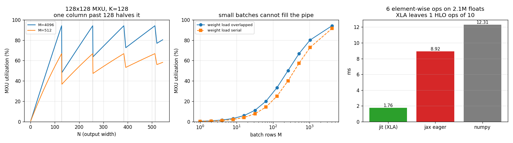

# Run a TPU Notebook

---

> There is no [TPU](/shared/glossary/#tpu) on this machine. There is, however, the *compiler* that makes a TPU usable — [XLA](/shared/glossary/#xla) runs perfectly well on a CPU — and the *arithmetic unit* that makes a TPU fast can be simulated cell by cell and checked bit-exactly. So this project splits into the half that is real (XLA turns **10 operations into 1 kernel** and beats NumPy by **7.0x** on the same six lines of maths) and the half that is exact simulation (a **128×128** [systolic array](/shared/glossary/#systolic-array) whose output matches `X @ W` to the last bit). Findings: one extra output column past 128 costs **1.96x**; a batch of 1 uses **0.39%** of the array; and the famous "pad your vocabulary from 50257 to 50304" advice is worth **1.0007x** here, while merging 8 [attention](/shared/glossary/#attention) heads into one matmul is worth **3.33x**.

---

## Key Insight

Everything that makes TPU programming feel different from GPU programming comes from two places, and they pull in opposite directions. **The compiler** wants to see your whole computation at once, so it can fuse it — which is why you write `@jax.jit` and why your Python body runs exactly once no matter how many times you call it. **The [MXU](/shared/glossary/#mxu)** is a fixed 128×128 grid of multipliers, so it wants every dimension of every matrix to be a multiple of 128 and every batch to be large — which is why "just use whatever shape your data happens to be" quietly throws away half your chip.

## Why This Matters

You are unlikely to buy a TPU. You are quite likely to read a paper, a framework, or a job posting that assumes you know why TPU code is written the way it is: static shapes, huge batches, `jit` everywhere, dimensions padded to multiples of 128. Those are not style preferences. Each one is a direct consequence of a hardware fact, and this project derives every one of them from a simulator you can read in 100 lines — instead of asking you to memorise a rule.

It also sets up the rest of the phase. [Project 26](../26-compare-accelerators/README.md) compares XLA on the CPU against [Triton](/shared/glossary/#triton) on the GPU as two genuinely different compilers, and [project 27](../27-tenstorrent-dev/README.md) reuses the "count the cycles of an idealised array" method for a completely different architecture.

---

**This is project 23.**

### The words first

- **[TPU](/shared/glossary/#tpu) (Tensor Processing Unit)** — Google's custom AI chip. It is not a GPU with a different badge: it has no shader cores, no [warps](/shared/glossary/#warp), and no [CUDA](/shared/glossary/#cuda)-like language. You reach it only through a compiler.
- **[MXU](/shared/glossary/#mxu) (Matrix Multiply Unit)** — the [systolic array](/shared/glossary/#systolic-array) at the heart of a TPU, typically 128×128 cells. It is the *only* thing on the chip that does matrix multiplication, and its fixed size is the source of most TPU performance rules.
- **[Systolic](/shared/glossary/#systolic-array)** — from *systole*, the medical word for a heartbeat. Data is *pumped* through the grid in rhythmic pulses instead of being fetched from memory by each cell. That name is a description of the mechanism, not decoration.
- **Weight-stationary** — one of several ways to organise a systolic array. The weights are loaded into the cells and then stay put; the activations flow past them. The alternative (*output-stationary*) keeps the running sums in place and flows both inputs. TPUs are weight-stationary, which is why loading new weights is a distinct, costly event.
- **[XLA](/shared/glossary/#xla) (Accelerated Linear Algebra)** — the compiler. It takes a graph of array operations and emits one optimised program. Everything TPU-shaped in [JAX](/shared/glossary/#jax) and PyTorch/XLA goes through it.
- **[HLO](/shared/glossary/#hlo) (High Level Operations)** — XLA's internal instruction list, the thing you read when you want to know what the compiler actually decided. "High level" is relative: it is above machine code but below your Python.
- **[JIT](/shared/glossary/#jit) (just-in-time) compilation** — compile at run time, once you know the exact shapes and types, instead of ahead of time. `@jax.jit` is the marker that says "compile this".
- **Tracing** — how `jit` finds out what your function does: it runs the Python body once with *fake* values that record operations instead of computing them. This has consequences, and section B measures them.
- **[Fusion](/shared/glossary/#kernel-fusion)** — merging several operations into a single pass over the data, so intermediate results never leave the chip's fast memory. The reason `jit` is worth anything.
- **Utilization** — here, "of all the multiply-add slots the array offered during this matmul, what fraction did real work?" A 128×128 array running for 1000 cycles offers 16,384,000 slots. If your matmul only needs 8 million multiplies, utilization is 49%, and the other 51% were cells multiplying padding by zero.

### "Why simulate an MXU? Doesn't a GPU already do matrix multiplication?"

It does, and this is exactly the kind of thing that looks redundant until you see the difference. A GPU's [tensor cores](/shared/glossary/#tensor-core) are *small* matrix units (4×4 or 16×16 fragments) scattered across ~100 independent [SMs](/shared/glossary/#sm), each with caches, [shared memory](/shared/glossary/#shared-memory), and a scheduler that can move work around. A TPU has *one* huge 128×128 array and nowhere to hide an awkward shape. On a GPU, a matmul with `N = 129` is 129 columns of work spread over whatever tiles the library picks — mildly annoying. On a TPU it is two full passes of a 128-wide array, the second of which is 127/128ths empty. Section E measures that as a **1.96x** loss.

So simulating the MXU is not re-doing what the GPU already does. It is isolating the *one* structural difference — a single fixed-size array instead of many flexible small ones — and pricing it.

### "And why simulate at all, instead of just quoting the rules?"

Because the rules as usually quoted are a mix of true, exaggerated, and stale. Section E finds that one of the most-repeated ones ("pad your vocabulary size to a multiple of 128") is worth **0.07%**, while a much less-discussed one (batch your attention heads into a single wide matmul) is worth **233%**. You only learn which is which by counting.

---

## Running it

```bash
python run.py       # ~3 s: XLA behaviour, then the MXU simulation
```

Requires `jax` (CPU build is enough: `pip install "jax[cpu]"`). Software here: **jax 0.11.0**, numpy 2.4.4, on an **Intel i7-8700K** (6 cores / 12 threads).

> **About the numbers.** Every figure below comes from the committed
> [`outputs/findings.json`](outputs/findings.json) and
> [`outputs/findings.csv`](outputs/findings.csv).



---

## A. What is actually here

| | |
|---|---|
| `jax.devices()` | `[cpu:0]` |
| platform | `cpu` |
| XLA available | **yes** — this is the same compiler a TPU uses |
| MXU available | **no** — simulated in [`systolic.py`](systolic.py) |

This is the honest framing for the whole phase: the *software* half of "alternative accelerators" is available to anyone, because compilers run everywhere. The *hardware* half is not, so it gets simulated, and the simulation is verified rather than asserted.

---

## B. `jit` runs your Python once, on values that are not numbers

| what | result |
|---|---|
| calls to the jitted function | 5 |
| times the Python body actually ran | **1** |
| type of the argument inside the body | `DynamicJaxprTracer` |
| `if x.sum() > 0:` inside a jitted function | raises `TracerBoolConversionError` |
| `jax.lax.cond(...)` instead | works |

This is the single biggest conceptual jump from PyTorch. When you call a jitted function, JAX does **not** run your code. It runs it *once*, feeding in placeholder objects called tracers that have a shape and a dtype but no values, and records every operation they are used in. That recording is the program that gets compiled. From then on, your Python is never executed again — the compiled program is.

Two consequences follow immediately, and they explain most beginner bug reports:

- **`print` inside a jitted function fires once and then never again.** It is not broken; the body genuinely does not run any more.
- **A Python `if` on the data cannot work.** `if x.sum() > 0` asks "is this value positive?" at *trace* time, when there is no value — only a promise that a number of shape `()` will exist later. Python needs a real `True`/`False` to pick a branch, cannot get one, and raises `TracerBoolConversionError`. The fix, `jax.lax.cond`, does not answer the question either; it records *both* branches into the program so the choice can be made at run time on the hardware.

Why does a compiler impose this? Because the TPU has no way to ask Python a question mid-kernel. Every decision that depends on data has to be *in* the compiled program. Tracing is how JAX guarantees that.

---

## C. A new shape is a new compile

| measurement | value |
|---|---|
| compile time, one shape | **14.7 ms** |
| run time, same shape | **0.318 ms** |
| runs needed before compiling pays for itself | **46** |
| 8 ragged shapes (1000, 1037, 1074, …) | **8 compiles**, 650 ms total |
| the same 8 inputs padded up to a multiple of 2048 | **1 compile**, 66 ms total |
| speed-up from bucketing | **9.9x** |
| arithmetic wasted on padding | 44.9% |

A tracer carries a shape, so the traced program is only valid for that shape. Give the same function a different-length array and JAX has to trace and compile again. Eight slightly different sequence lengths therefore cost eight compilations.

The fix is the one every TPU serving stack uses: **round every input up to one of a small set of bucket sizes** and pad the rest with zeros. Here that turns 8 compiles into 1 and the whole loop gets 9.9x faster — *even though 44.9% of the numbers being processed are padding that gets thrown away*. That trade (do 1.8x more arithmetic, avoid 7 compilations) is the non-obvious part, and it is why production TPU inference has a fixed list of allowed sequence lengths instead of handling any length you like.

> **On the size of these numbers.** 14.7 ms is a cheap compile because this is XLA's CPU backend on a tiny program. A real TPU compilation of a transformer layer is *seconds*, and a full model can be minutes. The ratio in the table (46 runs to break even) is what to carry forward; the absolute milliseconds are not.

---

## D. Fusion: 10 operations in, 1 kernel out

The test function is six lines of ordinary array maths:

```python
def chain(a, b, c):
    t = a * b
    t = t + c
    t = jnp.tanh(t)
    t = t * 0.5
    t = t - c
    return jnp.exp(-t * t)
```

| stage | instructions |
|---|---|
| StableHLO handed to the compiler | **10** (`multiply`, `add`, `tanh`, `constant`, `broadcast_in_dim`, `subtract`, `negate`, `exponential`) |
| HLO after optimisation, in the entry program | **1** |
| what that one instruction is | `%multiply_exponential_fusion` |

And the cost, on 2.1M float32 elements:

| how | time | vs XLA |
|---|---:|---:|
| **`jax.jit(chain)`** | **1.76 ms** | 1.00x |
| JAX without `jit` (one op at a time) | 8.92 ms | 5.06x slower |
| plain NumPy | 12.31 ms | **6.99x slower** |

Read the mechanism, not just the ratio. NumPy executes each line as a separate loop over 2.1M elements and allocates a fresh 8 MB temporary array for each one: it makes six full trips across the memory bus. XLA reads `a`, `b`, `c` once, does all six operations on each element while it is still in a register, and writes the answer once — four trips instead of about fourteen. The measured 19.0 GB/s for the fused version is essentially this machine's DRAM speed, which is the sign that there is nothing left to win.

The name `multiply_exponential_fusion` is XLA telling you what it merged: the fusion starts at the first `multiply` and ends at the `exponential`.

> **Why is un-jitted JAX slower than NumPy is fast?** Because without `jit`, JAX dispatches each operation to XLA separately, paying compilation lookup and buffer-management costs per operation on top of the same memory traffic NumPy pays. JAX without `jit` is the worst of both worlds. This is worth knowing because it is a very common way to "benchmark JAX" and conclude, wrongly, that it is slow.

---

## E. The MXU, simulated cell by cell

[`systolic.py`](systolic.py) is a real simulator, not a cost formula. Every cycle it shifts activations one column to the right, shifts partial sums one row down, and has every cell do one multiply-add. The check that this is honest:

| shape | array | output matches `X @ W` exactly? | cycles | utilization |
|---|---|---|---:|---:|
| 4×3 · 3×2 | 4×4 | **yes** | 8 | 18.8% |
| 8×8 · 8×8 | 8×8 | **yes** | 23 | 34.8% |
| 5×7 · 7×3 | 8×4 | **yes** | 14 | 23.4% |
| 48×16 · 16×16 | 16×16 | **yes** | 79 | 60.8% |

Bit-exact, including the deliberately awkward 5×7·7×3 case where neither dimension fills the array. (Integers are used so "exact" means exact and not "within rounding".)

### E1. The 128 cliff

With `M = 4096`, `K = 128`, on a 128×128 array:

| N (output width) | tiles | utilization |
|---:|---:|---:|
| 128 | 1 | **94.1%** |
| **129** | **2** | **48.1%** |

**One extra output column costs 1.96x.** Nothing subtle happens: 129 columns do not fit in a 128-wide array, so the work is split into a full tile and a tile using 1 of its 128 columns — and that second tile occupies the entire array for its whole run regardless. This is the sawtooth in the left panel of the figure, and it is why TPU users talk about shapes in multiples of 128 the way GPU users talk about multiples of 32.

Note the two curves in that panel. At `M = 512` the peaks only reach 66.7%; at `M = 4096` they reach 94.1%. The gap is pipeline *fill*: the first activation has to walk 128 rows down and 128 columns across before the first result falls out, and those `K + N - 2` cycles are dead time amortised over `M` rows. Small batches pay it in full.

### E2. Batch size is not a hyperparameter here, it is a hardware requirement

| batch rows M | utilization (weights preloaded) | utilization (weights loaded serially) |
|---:|---:|---:|
| 1 | **0.39%** | 0.26% |
| 8 | 3.0% | 2.1% |
| 64 | 20.1% | 14.3% |
| 128 | 33.4% | 25.1% |
| 512 | 66.8% | 57.2% |
| 4096 | **94.1%** | 91.5% |

A batch of 1 uses **0.39%** of the array. Not 39%, not 3.9%. The reason is the same fill cost: 256 cycles of walking the data through the grid to produce a single row of output.

Translated into a plain consequence: **a TPU is a terrible latency device and a superb throughput device**, and this table is why. It is also why single-user, batch-size-1 LLM generation — the case [project 24](../24-amd-mi300-inference/README.md) is about — is not where TPUs are pitched, and why Groq built an entirely different architecture to attack exactly that case.

The second column shows what happens when weight loading cannot be hidden. TPUs have a weight FIFO that lets the next tile's weights stream in while the current one computes, so in practice the first column is the right one — *provided* you reuse each set of weights for enough rows. At `M = 1` even that does not help.

### E3. Two folk rules, priced

| shape | tiles | utilization |
|---|---:|---:|
| GPT-2 qkv projection, 768 → 2304 | 108 | 66.75% |
| Llama-ish MLP, 4096 → 11008 | 2752 | 66.75% |
| vocabulary head, 768 → 50257 | 2358 | 66.70% |
| **the same, padded to 50304** | 2358 | 66.75% |
| one attention head, K=64, N=64 | 1 | **20.03%** |
| **8 heads merged into K=512, N=512** | 16 | **66.75%** |

Two results, and the widely-repeated one is the weaker:

- **Padding the vocabulary from 50257 to 50304 is worth 1.0007x** — seven hundredths of one percent. The ragged edge is one tile out of 2358, so it is diluted almost to nothing. The advice is not *wrong*, it is just far less important than its fame suggests, and on a TPU-sized workload it is noise. (It matters more on GPUs for a different reason: tile quantisation across SMs, measured in [project 19](../19-triton-matmul/README.md) as a 33% effect.)
- **Merging 8 attention heads into one 512-wide matmul is worth 3.33x.** A single head is 64 wide and 64 deep, so it fills a quarter of the array in each direction and reaches 20%. This is the *real* rule, and it is the reason every transformer implementation stores `q`, `k`, `v` for all heads in one fused tensor rather than as a list of per-head matrices.

The general form: **the MXU punishes narrow dimensions, and 128 is the width of "narrow".** Ragged tails on a wide dimension barely register.

---

## F. dtypes: the downgrade nobody announces

| | |
|---|---|
| NumPy array dtype | `float64` |
| the same array after `jnp.asarray` | **`float32`** |

JAX silently demotes float64 to float32 unless you set `jax.config.update("jax_enable_x64", True)`. This is deliberate — accelerators are built for 32 bits and below, and a float64 that silently worked would silently be 30x slower on a GPU and unsupported on a TPU — but it means a script ported from NumPy can lose 8 digits of precision without a single warning.

Matmul error against a float64 reference, 256×256:

| inputs | max relative error |
|---|---:|
| float32 | 5.9e-07 |
| [bfloat16](/shared/glossary/#bfloat16) | 3.1e-03 |
| [float16](/shared/glossary/#float16) | 4.3e-04 |

**bfloat16 is 5253x less accurate than float32 here, and 7.3x worse than float16** — which is the point of the format, not a flaw in it. bfloat16 spends its 16 bits on 8 [exponent](/shared/glossary/#exponent) bits and 7 [mantissa](/shared/glossary/#mantissa) bits; float16 spends them on 5 and 10. So bfloat16 buys the *range* of float32 (it will not overflow where float32 would not) at the cost of precision, and float16 does the reverse. Training cares about range, because gradients span many orders of magnitude and an overflow is fatal while a rounding error is not. That is why TPUs standardised on bfloat16 and why the whole industry followed.

---

## What to take away

1. **The compiler is the interface.** On a TPU you do not write kernels, you write array maths and hand it to XLA. Everything odd about the programming model — tracing, static shapes, `lax.cond` — falls out of that one fact.
2. **`jit` is worth 5-7x on ordinary element-wise code**, and the mechanism is memory traffic, not cleverness: 10 operations become 1 pass over the data.
3. **Compilation is not free, and shapes are the currency.** 46 runs to break even here; bucketing 8 shapes into 1 was worth 9.9x despite wasting 45% of the arithmetic.
4. **The MXU's fixed 128×128 shape sets the rules.** One column past 128 costs 1.96x. A batch of 1 gets 0.39% of the chip. Merge your narrow matmuls; do not lose sleep over ragged tails on wide ones.
5. **A simulator you can verify beats a rule you have to trust.** Two pieces of standard advice were checked here and came out 4700x apart in value.

---

## Next

- [Project 24 — AMD MI300 inference](../24-amd-mi300-inference/README.md): the other big non-NVIDIA option, where the difference is the *software stack* rather than the arithmetic unit.
- [Project 26 — Compare accelerators](../26-compare-accelerators/README.md): XLA-on-CPU from this project measured head to head against Triton-on-GPU.
- [Project 27 — Tenstorrent dev](../27-tenstorrent-dev/README.md): a third architectural bet, and the same cycle-counting method applied to it.
