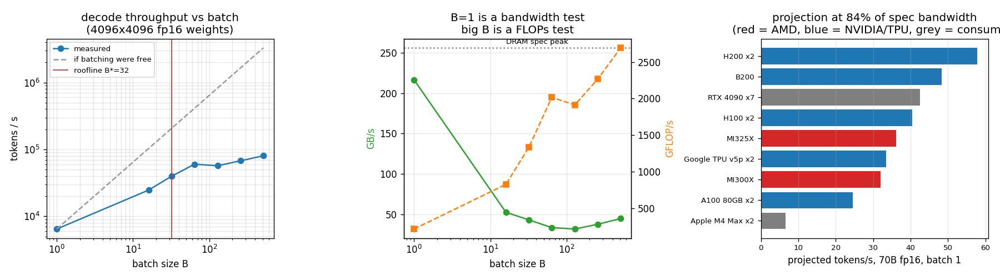

# AMD MI300 Inference

---

> No [MI300X](/shared/glossary/#amd-instinct-mi300x) here either. So this project does the two things that *can* be done honestly: it **ports every [CUDA](/shared/glossary/#cuda) file in this guide to [HIP](/shared/glossary/#hip)** — 3,565 lines, **644 token substitutions**, **88.1% of lines untouched** — and then proves the port is faithful by compiling it *back* through a HIP→CUDA shim and requiring identical output. Then it measures the operation MI300X is actually bought for. Findings: a batch-1 [decode](/shared/glossary/#decode) step runs at **216.7 GB/s = 84.5% of this card's spec [bandwidth](/shared/glossary/#memory-bandwidth)**, confirming decode is pure memory; the rename leaves **112 landmines** that compile fine and behave differently on AMD, one of which is measured at **1.93x**; and the headline comparison inverts twice — **2×H100 is 1.26x faster than 1×MI300X and 1.60x worse per dollar**, while MI300X's much-advertised **1.31x [FLOPs](/shared/glossary/#flops) advantage is worth exactly nothing** at batch 1.

---

## Key Insight

AMD's problem was never the silicon. On the number that decides single-stream LLM generation — memory bandwidth — an MI300X has beaten an H100 by **1.58x** since 2023, and it holds a 70B model in fp16 on one chip where NVIDIA needs two. What it lacked was the software stack, and the way to *see* the size of that gap is to try the port yourself: **88% of lines need no change at all, and the 12% that do include every line that made the kernel fast in the first place.**

## Why This Matters

"Just port it to ROCm" and "ROCm is not ready" are both things people say without numbers. This project produces the numbers. It also builds the decode-throughput model that [project 25](../25-apple-silicon-llm/README.md) and [project 26](../26-compare-accelerators/README.md) both reuse — a model validated on hardware that *is* here before it is pointed at hardware that is not.

---

**This is project 24.**

### The words first

- **[ROCm](/shared/glossary/#rocm)** — AMD's whole GPU compute stack: driver, runtime, compiler, libraries. The counterpart to CUDA. The name is from "Radeon Open Compute"; unlike CUDA it is open source, which is its main selling point and not much help when a library is missing.
- **[HIP](/shared/glossary/#hip) (Heterogeneous-compute Interface for Portability)** — a C++ API deliberately shaped like the CUDA runtime API, so CUDA code can be mechanically renamed into it. HIP code compiles for *both* AMD and NVIDIA; that is the "portability" in the name.
- **hipify** — AMD's tool that does the renaming. [`hipify.py`](hipify.py) here is a small readable version of the same idea.
- **Wavefront** — AMD's name for a [warp](/shared/glossary/#warp): the group of threads that execute one instruction together. NVIDIA's warp is **32** threads; an AMD wavefront is **64**. Both words are weaving metaphors — threads running side by side — and the two numbers being different is the single most common source of silently-slower ported kernels.
- **[Decode](/shared/glossary/#decode)** — the phase of LLM inference that generates one token at a time, as opposed to [prefill](/shared/glossary/#prefill), which processes the whole prompt at once. Decode reads every weight in the model to produce a single token, which is why it is memory-bound.
- **[Arithmetic intensity](/shared/glossary/#ai-arithmetic-intensity)** — [FLOPs](/shared/glossary/#flops) per byte moved. The x-axis of the [roofline](/shared/glossary/#roofline).
- **Ridge point / `B*`** — the arithmetic intensity where a device stops being memory-bound and starts being compute-bound. Because decode's intensity is `2B / bytes_per_weight`, the ridge point translates directly into a *batch size*, which is what makes it actionable.
- **API-compatible vs ABI-compatible** — API-compatible means the *source* works after recompiling. ABI-compatible would mean the compiled binary works. hipBLAS is the first and not the second, so you must rebuild, not just relink.

### "If HIP is just CUDA with a different prefix, why does porting have a reputation?"

This is the question the whole project exists to answer, and the answer is a ratio. Section A shows the rename really is that simple: 644 substitutions across 3,565 lines and **88.1% of lines are byte-identical**. Section B proves the ported source is not just plausible but *equivalent*. So far so easy.

Section C is where it goes wrong. The rename produces **112 constructs that compile cleanly on AMD and mean something different there** — chiefly the number 32 hard-coded as the warp size (46 occurrences), calls into [cuBLAS](/shared/glossary/#cublas) whose hipBLAS equivalents differ in enum names (39), and [tensor-core](/shared/glossary/#tensor-core) `wmma` code that has no drop-in AMD equivalent (14). None of these is a compile error. They are *performance* and *correctness* errors that appear at run time.

So the reputation is earned, but not by the part people expect. The port is easy; the *tuning* is a rewrite.

### "Why measure decode on a 2016 gaming GPU to say anything about a 2026 datacentre chip?"

Because the thing being measured is a ratio, not an absolute. Section D establishes that a batch-1 decode step reaches **84.5% of the card's spec bandwidth** — i.e. this operation is bandwidth-bound and a well-written kernel gets most of the bandwidth the spec sheet advertises. That efficiency factor is what section E carries onto the MI300X, and it is the only part of the projection that needs measuring; the rest is division. Using a made-up efficiency number would make the projection worthless, and quoting someone else's would make it unverifiable.

What this cannot tell you: anything about ROCm's *actual* achieved efficiency, which is the very thing AMD is criticised for. Section E therefore reports what MI300X would do *if its software were as good as this Triton kernel*, which is an upper bound and is labelled as one.

---

## Running it

```bash
python run.py       # ~14 s: port, verify, landmines, decode sweep, projection
```

Needs `nvcc` for sections B and C (the CUDA toolkit; PyTorch's bundled one is not enough) and `triton` for section D. Hardware: **GTX 1070 Ti** (sm_61), 19 SMs, PCIe 3.0 ×16. Reference constants from [project 3](../03-bandwidth-measurement/README.md): spec DRAM peak **256.3 GB/s**, measured read-only **222 GB/s**.

> **About the numbers.** Everything below comes from the committed
> [`outputs/findings.json`](outputs/findings.json) and
> [`outputs/findings.csv`](outputs/findings.csv).



---

## A. The port, measured

[`hipify.py`](hipify.py) applies 17 substitution rules to every `.cu` file in this guide.

| | |
|---|---:|
| CUDA files | 16 |
| lines of source | 3,565 |
| token substitutions | **644** |
| lines changed | 424 |
| **lines untouched** | **88.1%** |

Per file, the range is instructive:

| file | lines | changed | untouched |
|---|---:|---:|---:|
| `07-tensor-core-utilization/wmma_probe.cu` | 30 | 0 | **100.0%** |
| `14-hbm-saturation/hbm.cu` | 274 | 15 | 94.5% |
| `12-bank-conflict-demo/banks.cu` | 266 | 18 | 93.2% |
| `17-cuda-tiled-matmul/sgemm.cu` | 390 | 37 | 90.5% |
| `16-cuda-vector-add/vecadd.cu` | 247 | 46 | 81.4% |
| `07-tensor-core-utilization/bench.cu` | 244 | 55 | 77.5% |
| `05-gpu-vs-cpu-bake-off/gemm.cu` | 112 | 28 | **75.0%** |

The pattern is exactly what you would guess once you see it: files that are mostly *kernel* code barely change, because `__global__`, `threadIdx`, `blockIdx`, `__shared__`, `__syncthreads` and the `<<<grid, block>>>` launch syntax are all **identical in HIP**. Files that are mostly *host* code change a lot, because every line of host code is a runtime API call and every runtime API call gets renamed. `gemm.cu` is 75% changed because it is dominated by [cuBLAS](/shared/glossary/#cublas) calls.

Almost every rename is a plain prefix swap (`cudaMalloc` → `hipMalloc`). Exactly one common type is not: **`cudaDeviceProp` → `hipDeviceProp_t`**. AMD added the `_t` suffix that CUDA's type is missing. It is a one-line rule in the table and a two-hour debugging session if you write the table yourself.

---

## B. Proving the port did not change the program

A rename that *looks* right is not evidence. So [`hipshim/hip/hip_runtime.h`](hipshim/hip/hip_runtime.h) maps every HIP name straight back onto its CUDA original, and the ported file is compiled with `nvcc -I hipshim -x cu`.

| | |
|---|---|
| substitutions applied to `warpsize.cu` | **29** |
| ported file includes `hip/hip_runtime.h` | yes |
| any `cuda` token left in the ported file | **no** |
| ported file compiles through the shim | **yes** |
| device properties printed by both binaries | **identical** |
| structure of all 10 output lines | **identical** |

Two source files that share no API names at all produce the same program. That is what "HIP is a rename" means, made checkable.

This is not a hypothetical arrangement, incidentally — it is exactly how HIP achieves portability in production. AMD's real `hip_runtime.h` compiles down to ROCm on an AMD card and down to CUDA on an NVIDIA one, so a single HIP source builds for both. The 40-line file here is that idea with the NVIDIA half filled in.

---

## C. What a rename cannot fix

| landmine | occurrences | why it survives the rename |
|---|---:|---|
| **32 hard-coded as the warp size** (`% 32`, `& 31`, `>> 5`, `WARP_SIZE`) | **46** | it is just a number; an AMD wavefront is 64 |
| cuBLAS calls | 39 | hipBLAS is API-compatible, not ABI-compatible — rebuild, do not relink |
| `wmma::` tensor-core fragments | 14 | NVIDIA-specific; AMD's equivalent is rocWMMA, with different fragment shapes |
| `warpSize` built-in | 8 | compiles on both, evaluates to **32** on NVIDIA and **64** on AMD |
| warp shuffle / vote (`__shfl_*`, `__ballot_*`) | 4 | the thread mask is a 32-bit integer on NVIDIA and 64-bit on AMD |
| inline PTX (`asm volatile`) | 1 | PTX is NVIDIA machine code; AMD needs GCN/RDNA assembly |
| **total** | **112** | none of these is a compile error |

### C1. The warp-size one, measured

[`warpsize.cu`](warpsize.cu) splits threads into alternating groups of `G`; even groups take one branch, odd groups take the other. Both branches do identical arithmetic, and `G` is a run-time argument so the compiler cannot cheat. If a warp contains threads from both groups, the hardware runs **both** branches and masks off the wrong threads — so that warp pays twice.

| G (group size) | time vs G=256 |
|---:|---:|
| 1 | 1.95x |
| 2 | 1.94x |
| 4 | 1.94x |
| 8 | 1.95x |
| **16** | **1.94x** |
| **32** | **1.01x** |
| 64 | 1.01x |
| 128 | 1.01x |
| 256 | 1.00x |

The step is at exactly 32, which is exactly `warpSize` on this card. Below it, every warp is mixed and costs 1.93x more than at 32. At and above it, every warp is pure and costs nothing.

**Now read the consequence for the port.** A kernel written and tuned on NVIDIA so that its branches align to groups of 32 sits safely on the flat part of this table. Move that same source to an MI300X, where a wavefront is 64 threads, and `G = 32` lands on the *left* half: every wavefront now contains both branches. Nothing in the source changed, no warning was printed, and the kernel is about 1.9x slower.

This is what "the port is easy, the tuning is a rewrite" means in one measurement. And note the direction of the trap: it is the *carefully optimised* kernel that breaks. Code that never thought about warp boundaries was already paying the 1.93x and loses nothing.

---

## D. Decode, measured

The operation is `y = x @ W.T` with `W` a 4096×4096 fp16 weight matrix — one projection out of a transformer layer. During generation, the model reads **every** weight to produce **one** token per sequence, so:

```
bytes read   ~  (number of weights) x (bytes per weight)   -- fixed, whatever B is
FLOPs        ~  2 x (number of weights) x B                -- grows with the batch
```

Accuracy first: max relative error against a float64 CPU reference is **1.7e-06**, i.e. fp16 rounding.

| B | ms | weight passes | GB/s | GFLOP/s | tokens/s | arithmetic intensity |
|---:|---:|---:|---:|---:|---:|---:|
| **1** | 0.155 | 1 | **216.7** | 217 | 6,453 | 1.0 |
| 16 | 0.649 | 1 | 52.5 | 827 | 24,659 | 15.8 |
| 32 | 0.806 | 1 | 43.0 | 1,333 | 39,728 | 31.0 |
| 64 | 1.064 | 1 | 33.5 | 2,018 | 60,128 | 60.2 |
| 128 | 2.247 | 2 | 31.7 | 1,912 | 56,978 | 113.8 |
| 256 | 3.790 | 4 | 37.6 | 2,267 | 67,551 | 204.8 |
| 512 | 6.378 | 8 | 44.7 | 2,694 | 80,277 | 341.3 |

### D1. Batch 1 is a pure bandwidth test, and it passes

**216.7 GB/s = 84.5% of the 256.3 GB/s spec peak, and 97.6% of the 222 GB/s this card actually achieves on a read-only stream.** There is essentially nothing left on the table. Decode at batch 1 is not "a matmul that happens to be slow" — it is a memory copy with some arithmetic attached, and its speed is the memory bus, full stop.

This single number is what makes the whole serving industry make sense. It is why weight [quantization](/shared/glossary/#quantization) helps decode enormously (half the bytes, half the time) and barely helps [prefill](/shared/glossary/#prefill). It is why H200 exists — same compute as H100, 1.43x the bandwidth. It is why MI300X was a credible threat.

### D2. The roofline promises more than the kernel delivers

The [ridge point](/shared/glossary/#ridge-point) here is **32 FLOPs/byte** (8,190 GFLOP/s ÷ 256.3 GB/s). With 2-byte weights, arithmetic intensity is `2B/2 = B`, so the roofline says: **batching should be free up to B = 32**, because until then you are still bandwidth-limited and the extra FLOPs ride along for nothing.

| | tokens/s at B=32 |
|---|---:|
| what "free batching" would give (32 × the B=1 rate) | 206,452 |
| what actually happens | **39,728** |
| **shortfall** | **5.2x** |

The roofline is not wrong; the kernel is. A matmul with only 32 rows cannot use this GPU well — the best FLOP rate seen anywhere in the sweep is 2,694 GFLOP/s, which is **32.9%** of the card's peak, and at B=32 it is only 16%. The roofline is an upper bound on what the *hardware* permits, not a promise about what your *kernel* achieves, and a thin matmul is the classic place where the two diverge. (This is the same shape of result as [project 23](../23-run-a-tpu-notebook/README.md)'s MXU: narrow dimensions waste the machine. It is also why [project 19](../19-triton-matmul/README.md)'s tile sweep spanned 3.17x.)

Two more things visible in the table:

- **Weight passes.** From B=128 the kernel's batch tile is smaller than the batch, so it walks the entire weight matrix more than once — 8 times at B=512. The `GB/s` column counts those repeats, which is why it *rises* again at large B while the ideal traffic keeps falling. A serving engine's batch tile has to be at least its batch, or it silently pays for the weights again.
- **B=128 is slower than B=64.** Two batch tiles over 19 SMs is a bad fit — wave quantisation, the same effect [project 19](../19-triton-matmul/README.md) measured as a 33% cost.

### D3. What continuous batching is worth here

| | time for 64 tokens |
|---|---:|
| 64 separate batch-1 decode steps | 10.01 ms |
| one batched step with B=64 | **1.06 ms** |
| **speed-up** | **9.4x** |

That 9.4x is the entire economic case for [continuous batching](/shared/glossary/#continuous-batching) and for [vLLM](/shared/glossary/#vllm)-style serving. It is also *less* than the 64x that would follow from "the weights are read once either way", for the reason in D2 — so even here, the textbook argument overstates the win by 6.8x.

---

## E. Projection: MI300X against the field

Model: a 70B-parameter LLM, batch 1, single stream, plus ~8 GB for [KV cache](/shared/glossary/#kv-cache) and activations. The efficiency factor is the **84.5%** measured in D1. Multi-GPU rows assume the weights are split evenly and the aggregate bandwidth adds — an optimistic assumption that ignores tensor-parallel communication, and it is optimistic *in NVIDIA's favour*, which matters below.

| accelerator | GB/s | GB | needs | tokens/s | tokens/s per $ | batch B\* |
|---|---:|---:|---:|---:|---:|---:|
| **AMD MI300X** | 5,300 | 192 | **1 GPU** | 32.0 | **10.7** | 245 |
| AMD MI325X | 6,000 | 256 | 1 GPU | 36.3 | 9.1 | 217 |
| NVIDIA H100 SXM | 3,350 | 80 | **2 GPUs** | **40.4** | 6.7 | 296 |
| NVIDIA H200 SXM | 4,800 | 141 | 2 GPUs | 58.1 | 5.8 | 206 |
| NVIDIA B200 SXM | 8,000 | 192 | 1 GPU | 48.4 | 6.0 | 281 |
| NVIDIA A100 80GB | 2,039 | 80 | 2 GPUs | 24.7 | 8.2 | 153 |
| Google TPU v5p | 2,765 | 95 | 2 chips | 33.5 | 4.0 | 166 |
| NVIDIA RTX 4090 | 1,008 | 24 | 7 GPUs | 42.7 | 3.0 | 164 |
| Apple M4 Max | 546 | 96 | 2 machines | 6.6 | — | 31 |

Four results worth stating plainly.

**1. The MI300X wins on capacity and loses on speed — to a pair of chips.** One MI300X holds the whole model; an H100 cannot, so it needs two. Two H100s have 6.7 TB/s between them against one MI300X's 5.3 TB/s, so **the H100 pair is 1.26x faster** — and costs twice as much, making **MI300X 1.60x better per dollar**. Both of those are true at once and people quote whichever suits them.

**2. The FLOPs number AMD leads with is irrelevant here.** MI300X has 1.31x the [FLOPs](/shared/glossary/#flops) of an H100 and 1.58x the bandwidth. At batch 1 the FLOPs contribute **nothing** — the `B*` column says you would need a batch of **245** before an MI300X becomes compute-bound at all. Spec-sheet FLOPs are a prefill and training number that gets quoted in inference arguments.

**3. Quantization moves more than hardware does.** Dropping the same 70B model to int4 (0.56 bytes/parameter including scales):

| | fp16 | int4 | gain |
|---|---:|---:|---:|
| MI300X | 32.0 tok/s on 1 GPU | **114.2 tok/s on 1 GPU** | **3.6x** |
| H100 | 40.4 tok/s on 2 GPUs | 72.2 tok/s on **1** GPU | 1.8x, and one fewer GPU |

Going from an H100 to an MI300X is worth 1.58x of bandwidth. Going from fp16 to int4 is worth **3.6x** and costs nothing but accuracy you can measure — which is the subject of [Phase 7](../../README.md#phase-7-numeric-formats-and-quantization). Choose your format before you choose your vendor.

**4. `B*` is a warning label.** The rightmost column is the batch size at which each device stops being bandwidth-bound. B200 needs a batch of **281**; the M4 Max needs **31**. A chip with enormous FLOPs and merely large bandwidth is a chip that is *idle* unless you keep it fed — so the more powerful the accelerator, the more your serving stack, not your model, decides whether you get what you paid for.

### What this projection is not

It assumes ROCm's kernels are as good as the Triton kernel measured in D1. They are, in 2026, close for the big [attention](/shared/glossary/#attention) and matmul paths in [vLLM](/shared/glossary/#vllm) and further behind on everything else. So treat every AMD row as an **upper bound**, and treat the gap between this table and a benchmark you run yourself as a measurement of the software stack — which is precisely the quantity that this whole comparison has always been about.

---

## What to take away

1. **The port is a rename**: 88.1% of lines untouched, and a round-trip through a shim proves the ported source is the same program.
2. **The rename leaves 112 landmines**, none of which fail to compile. The warp-size one costs a measured **1.93x**, and it specifically punishes kernels that were carefully tuned.
3. **Decode at batch 1 is a memory copy**: 84.5% of spec bandwidth, 97.6% of achievable. This one fact explains H200, MI300X, quantization, and continuous batching all at once.
4. **The roofline is an upper bound, not a plan.** It promised free batching to B=32; the measurement delivered 5.2x less, because a 32-row matmul cannot fill a GPU.
5. **MI300X's real advantage is capacity per chip, and its real number is bandwidth, not FLOPs.** 1.26x slower than 2×H100, 1.60x cheaper per token, and 245 sequences away from its FLOPs mattering at all.

---

## Next

- [Project 25 — Apple Silicon LLM](../25-apple-silicon-llm/README.md): the same capacity-vs-bandwidth trade, pushed to its extreme by [unified memory](/shared/glossary/#unified-memory) — and measured for real by making this card stream weights over PCIe.
- [Project 26 — Compare accelerators](../26-compare-accelerators/README.md): three real backends, same workloads, and what happens to the ranking when the arithmetic intensity changes.
