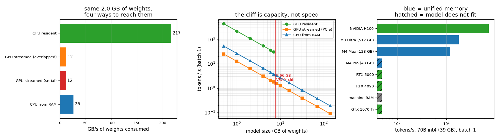

# Apple Silicon LLM

---

> There is no Mac here. But the thing [Apple Silicon](/shared/glossary/#apple-silicon) is famous for — [unified memory](/shared/glossary/#unified-memory) — is defined by what it *removes*, and this machine still has the thing being removed: a discrete GPU on the far side of a [PCIe](/shared/glossary/#pcie) link. So the copy can be timed. Measured here: GPU DRAM **216.9 GB/s**, system RAM **27.6 GB/s**, PCIe **12.6 GB/s** pinned. Once the [weights](/shared/glossary/#weights) no longer fit in the 8 GB of VRAM — and **7.66 GB is where that happens**, exactly — the GPU has to stream them across that link every token, and it drops to **12.5 GB/s: 17.3x slower than the same GPU with the same weights resident, and 2.11x slower than not using the GPU at all.** Overlapping the copy with compute recovers **1.07x**. That gap is what unified memory deletes, and it is why a Mac with 128 GB runs a model that a faster 24 GB card cannot run at all.

---

## Key Insight

Unified memory is not a speed feature. It is a **capacity** feature that *costs* speed: an M4 Max's single pool runs at 546 GB/s, where an RTX 4090's dedicated VRAM runs at 1,008 GB/s — **1.85x faster**. The Mac wins exactly one contest, and it is the only one that matters when the model is big: the 4090 has 24 GB and the Mac has 96 GB usable, so a 39 GB model runs on one and *does not exist* on the other. Below the capacity line the discrete card wins by 1.85x. Above it, the discrete card's number is not "slower" — it is **zero**, or it is 12.5 GB/s of PCIe, which as this project measures is worse than having no GPU.

## Why This Matters

"Why is a Mac Studio a serious local-LLM machine when its GPU is 30x weaker than an H100?" is one of those questions where the answer sounds like a dodge until you see the numbers. It is not a dodge. This project builds the whole argument out of three measured bandwidths and one measured capacity cliff, and every step can be re-run.

It also completes a set. [Project 24](../24-amd-mi300-inference/README.md) showed capacity-per-chip deciding an AMD-vs-NVIDIA comparison; this one pushes the same axis to its limit, where capacity is not an advantage but the entire product.

---

**This is project 25.**

### The words first

- **[Unified memory](/shared/glossary/#unified-memory)** — one physical pool of RAM addressed by both the CPU and the GPU. A tensor written by the CPU is *already* visible to the GPU: no copy, no second allocation, no `.to("cuda")`. Apple's M-series, game consoles, and phone chips all work this way.
- **Discrete GPU** — the opposite: the GPU has its own memory (VRAM) on its own board, and anything the CPU produced must be copied there first. "Discrete" as in *separate*, contrasted with "integrated".
- **[VRAM](/shared/glossary/#vram)** — video RAM, the discrete GPU's private memory. The name is a leftover from graphics; for us it is just "the pool the GPU can reach at full speed".
- **[PCIe](/shared/glossary/#pcie) (Peripheral Component Interconnect Express)** — the bus connecting the GPU board to the rest of the computer. This machine has PCIe 3.0 ×16, whose theoretical ceiling is ~15.75 GB/s each way.
- **[Pinned (page-locked) memory](/shared/glossary/#pinned-memory)** — host memory the operating system promises never to move or swap out. The GPU's copy engine can read it directly; ordinary ("pageable") memory has to be copied into a hidden staging buffer first, which is why pinned is faster. Measured here: **12.6 vs 10.5 GB/s**.
- **[MLX](/shared/glossary/#mlx)** — Apple's own array framework, built around unified memory: arrays have no `.device`, because there is only one place to be.
- **[llama.cpp](/shared/glossary/#llama-cpp)** — the portable C++ inference engine most people actually run models with on a Mac, via [GGUF](/shared/glossary/#gguf) quantized files.
- **Streaming / offloading** — keeping weights in system RAM and pulling each layer across PCIe as it is needed. What `--n-gpu-layers` in llama.cpp is really controlling.

### "If the model does not fit, why not just stream it? PCIe is fast."

It is fast compared to a disk. Section B measures it against the two things that matter, and it loses to both:

| path | GB/s of weights consumed |
|---|---:|
| GPU, weights resident in VRAM | **216.8** |
| CPU, weights in system RAM, no GPU at all | **26.4** |
| GPU, weights streamed over PCIe (copy overlapped with compute) | 12.5 |
| GPU, weights streamed over PCIe (copy then compute) | 11.7 |

**Using the GPU is 2.11x slower than not using the GPU**, once the GPU has to fetch its weights over PCIe. This is not a subtle effect and it is not a tuning failure — the arrow of causation is arithmetic. [Decode](/shared/glossary/#decode) reads every weight once per token (established in [project 24](../24-amd-mi300-inference/README.md)), so the speed of decode is the speed of whatever pipe the weights come down. The CPU's pipe is its DRAM at 26.4 GB/s. The streaming GPU's pipe is PCIe at 12.5 GB/s. The GPU's enormous 216.8 GB/s is behind that pipe and cannot help; it just idles waiting.

### "Then why not overlap the copies with the compute?"

Do it and measure it: **1.07x**. [`unified.py`](unified.py)'s streamed path prefetches layer *i+1* on a second [CUDA stream](/shared/glossary/#cuda-stream) while layer *i* computes, which is the best a discrete GPU can do.

The reason the gain is so small is worth internalising, because it is the general rule for overlapping anything. Overlap hides the *smaller* of two costs behind the *larger*. Here the copy is 172 ms and the compute is 10 ms, so hiding the compute behind the copy saves at most 10 ms out of 182 — about 5%, and 1.07x is what came out. **Overlap turns `copy + compute` into `max(copy, compute)`, and when one term is 17x the other, `max` is barely different from `+`.** Software cannot fix a bandwidth deficit; it can only stop wasting time on top of it.

---

## Running it

```bash
python run.py       # ~37 s: pools, paths, the VRAM cliff, isolation, what fits
```

Hardware: **GTX 1070 Ti**, 8 GB VRAM, PCIe 3.0 ×16; **Intel i7-8700K**, 6 cores / 12 threads, 31 GB RAM. This is a shared machine, so CPU numbers are best-of-3 and still move a few percent between runs.

> **About the numbers.** Everything below comes from the committed
> [`outputs/findings.json`](outputs/findings.json) and
> [`outputs/findings.csv`](outputs/findings.csv).



---

## A. The three pools this machine has

| pool | measured | ratio to PCIe |
|---|---:|---:|
| GPU VRAM (the GPU reading its own memory) | **216.9 GB/s** | 17.2x |
| system RAM (the CPU reading its own memory) | **27.6 GB/s** | 2.19x |
| PCIe 3.0 ×16, host → device, **pinned** | **12.6 GB/s** | 1.00x |
| PCIe 3.0 ×16, host → device, pageable | 10.5 GB/s | 0.83x |

Two things to notice.

**PCIe is the narrowest pipe in the machine by a wide margin** — 17.2x narrower than the memory the GPU is trying to feed itself from. Every architecture diagram draws it as one thin line between two big boxes, and that picture is accurate.

**Pinned memory is worth 1.20x for free.** Ordinary host memory can be relocated by the operating system at any moment, so the driver cannot hand its address to the GPU's copy engine; it copies your data into a hidden pinned buffer first and transfers *that*. Asking for `pin_memory=True` skips the double copy. The cost is that pinned pages can never be swapped out, so pinning many gigabytes will make the rest of the system unhappy. On a unified-memory machine this entire concept does not exist, because nothing is ever copied to anywhere.

---

## B. Four ways to reach the same 2 GB of weights

Same weights, same maths, same answer — only the route differs.

| path | ms per pass | GB/s | vs streaming |
|---|---:|---:|---:|
| GPU, resident in VRAM | 9.9 | **216.8** | **17.3x faster** |
| CPU, from system RAM | 81.5 | 26.4 | **2.11x faster** |
| GPU, streamed over PCIe (overlapped) | 171.5 | 12.5 | 1.00x |
| GPU, streamed over PCIe (serial) | 184.1 | 11.7 | 0.93x |

**The ranking is the whole point of the project, and the middle row is the surprise.** A 2016 gaming GPU with the weights already loaded is 17.3x faster than the same GPU with the weights one PCIe hop away. And a CPU with no accelerator at all beats the streaming GPU by 2.11x, because system RAM is more than twice as wide as PCIe.

The practical rule this produces: **"partial offload" is often worse than no offload.** If you are choosing `--n-gpu-layers` in llama.cpp and only some layers fit, the layers that fit are worth having (they run at 217.5) but the ones you stream are worth *less than leaving them on the CPU*. Better to fit fewer layers fully than to stream many.

---

## C. Where the cliff is, exactly

Allocating 32 MB layers until the card says no:

| | |
|---|---:|
| VRAM reported by the driver | 7.92 GB |
| free at the start of the test | 7.65 GB |
| **weights successfully held** | **7.66 GB** (245 layers) |
| fraction of nameplate VRAM usable | **96.7%** |
| what happens next | `OutOfMemoryError`: *"Tried to allocate 32.00 MiB. GPU 0 has a total capacity of 7.92 GiB of which 24.50 MiB is free"* |

96.7% is unusually high because nothing else is running on this card and no framework is holding activation buffers. In a real inference server you also need the [KV cache](/shared/glossary/#kv-cache), activations, and workspace, so the practical figure is more like 70-80%.

Combining C with B gives the curve in the middle panel of the figure — tokens per second against model size, for all three paths:

| model size | GPU resident | GPU streamed | CPU from RAM |
|---:|---:|---:|---:|
| 1 GB | **216.8** | 12.5 | 26.4 |
| 4 GB | **54.2** | 3.1 | 6.6 |
| 7 GB | **31.0** | 1.8 | 3.8 |
| 8 GB | *does not fit* | 1.6 | 3.3 |
| 16 GB | *does not fit* | 0.8 | 1.7 |
| 140 GB | *does not fit* | 0.09 | 0.19 |

The green line does not bend down at 7.66 GB. **It stops.** That vertical wall is what unified memory is sold to remove, and the whole Apple argument is that a wall you cannot climb is worse than a slope you can.

---

## D. Two pools or one? The control

If the CPU and GPU shared a memory pool, hammering the pool from the CPU would slow the GPU down. Here they do not share, so it should not. Testing it makes the unified-memory claim falsifiable instead of decorative.

Eleven CPU threads are set to copy 64 MB buffers in a loop while a single 2 GB GPU kernel runs:

| measurement | quiet machine | 11 CPU threads busy | ratio |
|---|---:|---:|---:|
| GPU, device clock (CUDA events) | 220.9 GB/s | 219.3 GB/s | **1.007x** |
| GPU, wall clock | 220.6 GB/s | 217.3 GB/s | 1.02x |

**Nothing happens: 1.007x.** The discrete GPU's VRAM is physically a different set of chips, and no amount of CPU traffic touches it. That is the *advantage* of the separate-pools design, and it is the half of the trade-off that Apple coverage tends to skip.

> **A measurement trap found on the way.** An earlier version of this test used 24 small kernels instead of one big one, and reported the GPU running **1.8x slower** under CPU load — a completely false result. With 24 µs of launch overhead per kernel, a chain of small launches spends much of its time in the *host* thread issuing them, and a busy CPU starves that thread. CUDA events do not save you: they timestamp the GPU's queue, so host-side gaps between kernels fall *inside* the measured window. Making the work one large kernel removed the artefact. The general lesson for any A/B test on a shared machine: **if your benchmark launches many small kernels, you are partly benchmarking the CPU.**

And the other side of the trade, measured on the pool this machine *does* share — system RAM between CPU cores:

| threads | GB/s |
|---:|---:|
| 1 | 20.4 |
| 2 | 25.1 |
| 4 | 26.8 |
| **6** | **27.6** |
| 12 | 24.7 |

Going from 1 core to 6 buys **1.35x**, not 6x, and going to 12 threads is **1.12x worse than 6** — the extra threads contend for one bus (and this CPU's 12 "threads" are 6 physical cores with hyperthreading, which adds no memory ports at all). **A shared pool has one total, and everyone drawing from it divides that total.**

Now apply that to a Mac. On an M4 Max the CPU cores, the GPU cores, and the Neural Engine all draw from the *same* 546 GB/s. A busy CPU on that machine genuinely does take bandwidth away from the GPU — the interference this section measured as 1.007x on a discrete card is real on a unified one. Unified memory removes the copy and, in exchange, makes every other consumer your competitor.

There is a second, more practical catch specific to macOS: the GPU's share of unified memory is capped by `iogpu.wired_limit_mb`, and the default leaves roughly 75% of RAM available to the GPU. A "128 GB" Mac is a ~96 GB inference machine unless you change that setting.

---

## E. What actually fits

A 70B model at [int4](/shared/glossary/#int4) is **39.2 GB** of weights (0.56 bytes per parameter, including the [per-group](/shared/glossary/#per-group-quantization) scales). Projected at the 85% bandwidth efficiency measured in [project 24](../24-amd-mi300-inference/README.md):

| machine | pool | GB/s | 70B int4 fits? | tokens/s |
|---|---:|---:|---|---:|
| NVIDIA H100 | 80 GB VRAM | 3,350 | yes | **72.6** |
| Apple M3 Ultra (512 GB) | 384 GB unified | 819 | yes | 17.8 |
| **Apple M4 Max (128 GB)** | **96 GB unified** | **546** | **yes** | **11.8** |
| RTX 5090 | 32 GB VRAM | 1,792 | **no** | (38.9 if it fitted) |
| RTX 4090 | 24 GB VRAM | 1,008 | **no** | (21.9 if it fitted) |
| Apple M4 Pro (48 GB) | 36 GB unified | 273 | **no** | (5.9 if it fitted) |
| this machine, system RAM | 31 GB | 24 | **no** | — |
| this GTX 1070 Ti | 8 GB VRAM | 256 | **no** | — |

Read the 4090 row carefully, because it is the entire argument in one line. **The 4090 is 1.85x faster per byte than an M4 Max and would produce 21.9 tokens/s — if the model fitted. It does not fit.** So its real number is either 0, or the streaming rate that section B measured as worse than using no GPU at all. Meanwhile the Mac, with 4.0x the usable capacity and 0.54x the bandwidth, produces 11.8 tokens/s that actually exist.

Note also that unified memory does not make Apple *win*, it makes Apple *eligible*. An H100 has both the capacity and the bandwidth and is 6.2x faster than the M4 Max. The Mac's case is price, power, and the fact that you can own one.

---

## What to take away

1. **Unified memory is a capacity feature bought with bandwidth.** 546 GB/s versus a 4090's 1,008 GB/s, for 4x the pool.
2. **The copy it removes is real and it is the narrowest pipe in the machine**: 12.6 GB/s pinned, 17.2x below the GPU's own memory and 2.19x below the CPU's.
3. **Streaming weights over PCIe is worse than not using the GPU** — 2.11x worse here. Fit fewer layers fully rather than streaming many.
4. **Overlapping the copy recovers 1.07x**, because overlap turns `a + b` into `max(a, b)` and one term is 17x the other. No amount of software fixes a bandwidth deficit.
5. **Separate pools mean isolation (1.007x under a hammered CPU); a shared pool means contention** (1 → 6 cores buys 1.35x, not 6x). Both halves of that trade are measurable, and only one of them gets discussed.
6. **The capacity cliff is a wall, not a slope.** 7.66 GB fit; 7.70 GB raises `OutOfMemoryError`. Every "which GPU should I buy for LLMs" argument is really an argument about where that wall sits.

---

## Next

- [Project 26 — Compare accelerators](../26-compare-accelerators/README.md): three real backends measured on the same workloads, and what a fair comparison between different hardware even means.
- [Project 27 — Tenstorrent dev](../27-tenstorrent-dev/README.md): an architecture that answers the same memory problem by putting the weights *on the chip* — and the arithmetic showing how far that gets you.
