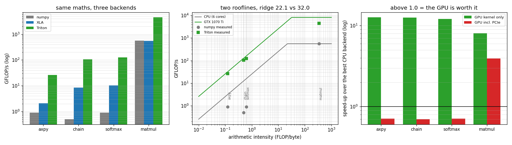

# Compare Accelerators

---

> Four workloads, three *real* backends on this machine — NumPy/OpenBLAS, [XLA](/shared/glossary/#xla) on the CPU, [Triton](/shared/glossary/#triton) on the GPU — and one question: which accelerator is faster? The answer is that the question is malformed, and here is the evidence. On kernel time the GPU wins everything by **8.1x to 12.7x**. Count the [PCIe](/shared/glossary/#pcie) transfer and **it loses three of the four**, at 0.70-0.71x. Measured as a fraction of each device's *own* [roofline](/shared/glossary/#roofline) the order inverts again: the GPU wins the [matmul](/shared/glossary/#matmul) by 8.1x while using **55.0%** of itself, and the CPU loses it while using **99.7%**. And the same six-operation chain costs NumPy **6.2x** more than a single multiply-add while costing the GPU **nothing at all** (1.271 ms against 1.273 ms) — because on the GPU both are memory, and memory does not care how much arithmetic you hide inside it.

---

## Key Insight

There is no ordering of accelerators, only an ordering *per [arithmetic intensity](/shared/glossary/#ai-arithmetic-intensity), per boundary you draw around the measurement*. Change the workload's FLOPs-per-byte and the winner changes. Include or exclude the data transfer and the winner changes. Ask "fastest" or "most efficient" and the winner changes. Every accelerator benchmark you will ever read has made these three choices, usually silently, and usually in a direction that suits whoever published it.

## Why This Matters

This is the project that makes the previous three legible. [Project 23](../23-run-a-tpu-notebook/README.md) showed a compiler's effect, [24](../24-amd-mi300-inference/README.md) a bandwidth-bound operation, [25](../25-apple-silicon-llm/README.md) a capacity wall — and each was one device at a time. Putting them on the same axes shows that they were all instances of one thing: **the workload's position on the roofline decides everything, and every device has a different roofline.**

---

**This is project 26.**

### The words first

- **Backend** — the thing that actually executes your array maths. Here: NumPy (calls OpenBLAS and its own C loops), XLA (compiles a fused program for the CPU), Triton (compiles a kernel for the GPU). NumPy and XLA run on the *same silicon*, which is what makes their difference purely a software difference.
- **[Arithmetic intensity](/shared/glossary/#ai-arithmetic-intensity) (AI)** — FLOPs performed per byte moved. Low = memory-bound, high = compute-bound. The x-axis of every roofline plot.
- **[Roofline](/shared/glossary/#roofline)** — for a given device, the maximum achievable FLOPs/s at each arithmetic intensity: `min(peak FLOPs, bandwidth × AI)`. The shape is a slope that flattens into a ceiling, hence the name.
- **[Ridge point](/shared/glossary/#ridge-point)** — where the slope meets the ceiling, i.e. `peak FLOPs ÷ peak bandwidth`. Workloads to its left are memory-bound; to its right, compute-bound. It is the single number that characterises a device's *balance*.
- **`axpy`** — the classic name (from the BLAS library) for `a·x + y`: one multiply and one add per element. Here it is `d = a*b + c`. It is the standard stand-in for "the least arithmetic you can do while still touching memory".
- **Efficiency** — measured GFLOP/s divided by the device's own roofline at that AI. This is the only cross-device number that means the same thing on both.

### "If NumPy and XLA run on the same CPU, why compare them? Isn't one of them redundant?"

They are the same hardware and a completely different *strategy*, and the size of that difference is the point. NumPy executes one operation at a time: each line of your Python is a full pass over the data, into a freshly allocated temporary array. XLA compiles the whole function first and emits one loop that does all six operations per element while it is in a register.

Section B measures the gap between them at **15.4x on the six-operation chain** and only **2.4x on the single-operation `axpy`** — because with one operation there is nothing to fuse, and what is left is just XLA using all 6 cores where NumPy's element-wise loop uses one. The gap grows with the number of operations there are to merge. Having *both* backends in the table is what separates "the GPU is faster" from "compilation is what you were missing"; without the XLA column you would attribute all of the GPU's chain win to the hardware, and section B shows that most of it was software.

### "And why put a 2016 gaming GPU next to an H100 in section E?"

Section E does not benchmark an H100 — it cannot. It computes each device's **ridge point** from published FLOPs and bandwidth, which is arithmetic, not measurement, and then asks a purely structural question: for a given workload, which side of the ridge does it land on? That question has a real, checkable answer for every device, and section E finds a workload whose answer *differs* between an M4 Max and an H100. That is a claim about architecture, not about speed, and it is the useful thing you can say about hardware you do not have.

---

## Running it

```bash
python run.py       # ~11 s
```

Needs `jax` (CPU build) and `triton`. Hardware: **Intel i7-8700K** (6 cores, 12 threads; CPU work pinned to 6 threads, the peak measured in [project 25](../25-apple-silicon-llm/README.md)) and a **GTX 1070 Ti** on PCIe 3.0 ×16.

Correctness is checked before anything is timed. Max absolute difference from the NumPy reference: XLA ≤ 5.5e-04 (matmul; different summation order), Triton ≤ 4.8e-06 element-wise and 2.5e-06 relative on the matmul.

> **About the numbers.** Everything below comes from the committed
> [`outputs/findings.json`](outputs/findings.json) and
> [`outputs/findings.csv`](outputs/findings.csv).



---

## A. Each device's own roofline, measured

| | CPU (i7-8700K, 6 threads) | GPU (GTX 1070 Ti) | ratio |
|---|---:|---:|---:|
| peak FLOPs (best 2048³ fp32 matmul) | **558 GFLOP/s** | 8,190 GFLOP/s | **14.7x** |
| peak bandwidth | **25.2 GB/s** | 256.3 GB/s | **10.2x** |
| **ridge point** | **22.1 FLOP/byte** | **32.0 FLOP/byte** | 1.45x |

The CPU peak is the better of the two CPU backends (NumPy 520, XLA 558 GFLOP/s) — using the slower library's number would flatter every efficiency figure later, so the roof is set by the silicon's best showing, not by one library's.

The two ridge points are close (22.1 vs 32.0) because this GPU is a *balanced* old part: it has 14.7x the FLOPs and 10.2x the bandwidth. Modern accelerators are not balanced at all — section E finds an H100 at **295.5**, because FLOPs have grown far faster than memory. Keep that in mind whenever a result from this machine is generalised.

---

## B. The bake-off

Four workloads, chosen to span three orders of magnitude of arithmetic intensity.

| workload | FLOPs/byte | what it is |
|---|---:|---|
| `axpy  d = a*b + c` | 0.125 | 16.8M floats, one multiply-add each |
| `chain 6 ops` | 0.500 | the same arrays, six chained element-wise ops |
| `softmax rows` | 0.625 | [softmax](/shared/glossary/#softmax) over 4096×1024 |
| `matmul 2048³` | 341.3 | one square fp32 matrix multiply |

Times in milliseconds (lower is better):

| workload | NumPy | XLA (CPU) | **Triton (GPU)** |
|---|---:|---:|---:|
| axpy | 39.33 | 16.09 | **1.273** |
| chain 6 ops | 245.43 | 15.98 | **1.271** |
| softmax rows | 24.57 | 2.04 | **0.168** |
| matmul 2048³ | 30.87 | 31.24 | **3.816** |

### B1. On the GPU, five extra operations were free

**`axpy` takes 1.2726 ms and the six-operation chain takes 1.2709 ms.** Four times the arithmetic, and the chain is if anything a hair *faster* — a difference of 0.13%, i.e. noise. Both run at **211 GB/s**, which is 95% of this card's measured read ceiling.

That is what "memory-bound" means, stated as a measurement instead of a definition: the GPU was never doing arithmetic, it was waiting for memory, and filling the waiting with more arithmetic changed nothing. The same experiment on NumPy costs **6.2x** (39.33 → 245.43 ms), because NumPy really does make six separate passes over 67 MB arrays with six fresh temporaries.

XLA sits between them and much closer to the GPU: 16.09 → 15.98 ms, i.e. **no cost at all** for the extra five operations. It fused them too. **So the 193x gap between NumPy and Triton on this workload is roughly 15.4x of compiler and 12.6x of hardware**, and reporting only the product would credit the GPU with work the compiler did.

### B2. Efficiency, the only fair cross-device number

Percentage of each device's own roofline at that workload's arithmetic intensity:

| workload | NumPy | XLA (CPU) | Triton (GPU) |
|---|---:|---:|---:|
| axpy | 28.6% | 66.7% | **82.4%** |
| chain 6 ops | **4.0%** | 66.7% | 82.4% |
| softmax rows | 5.7% | 65.4% | 78.0% |
| matmul 2048³ | **99.7%** | 98.5%\* | **55.0%** |

\* The CPU's compute roof is the best matmul either backend managed in section A. The two CPU backends are effectively tied here — both call an optimised BLAS — which is why they read 99.7% and 98.5% rather than one of them defining 100%.

**Read the matmul row and the chain row together.** On the matmul the GPU is 8.1x faster than the CPU *while using 55.0% of what it could do*, and the CPU loses *while using 99.7% of what it could do*. On the chain the positions are reversed: the GPU is at 82.4% and NumPy at 4.0%.

So "which device is more efficient?" also has no answer without a workload. What the table does say clearly is where the *fixable* losses are: NumPy at 4.0% on the chain is not a hardware limit, it is a missing compiler, and XLA collects 15.4x of it on the same silicon.

---

## C. Who wins, and by how much

| workload | AI | winner | vs NumPy | XLA vs NumPy | GPU vs NumPy |
|---|---:|---|---:|---:|---:|
| axpy | 0.125 | Triton | 30.9x | 2.4x | 30.9x |
| chain 6 ops | 0.500 | Triton | **193.1x** | 15.4x | 193.1x |
| softmax rows | 0.625 | Triton | 146.5x | 12.1x | 146.5x |
| matmul 2048³ | 341.3 | Triton | **8.1x** | 1.0x | 8.1x |

The GPU's advantage over NumPy spans **8.1x to 193.1x** — a factor of 24 between the workload it helps least and the one it helps most, on the same two pieces of hardware. Anyone quoting "GPUs are Nx faster" has picked a point on this range.

Note which end is which, because it is the opposite of the intuition. The GPU's *smallest* win is on the matrix multiply — the workload GPUs are famous for — and its *largest* is on a chain of trivial element-wise operations. The reason is that the CPU is at 99.7% of its roofline on the matmul (there is nothing left to take) and at 4.0% on the chain (there is almost everything left to take).

---

## D. Now count the transfer

Every GPU number above is kernel time. The data has to get there first — over the PCIe link measured at **12.6 GB/s pinned** in [project 25](../25-apple-silicon-llm/README.md), or 5.383 ms per 67 MB array.

| workload | kernel | transfer | end-to-end | kernel share | best CPU | **kernel-only** | **end-to-end** |
|---|---:|---:|---:|---:|---:|---:|---:|
| axpy | 1.27 | 21.53 | 22.80 | 5.6% | 16.09 | 12.7x | **0.71x** |
| chain 6 ops | 1.27 | 21.53 | 22.80 | 5.6% | 15.98 | 12.6x | **0.70x** |
| softmax rows | 0.17 | 2.69 | 2.86 | 5.9% | 2.04 | 12.1x | **0.71x** |
| matmul 2048³ | 3.82 | 4.04 | 7.85 | 48.6% | 30.87 | 8.1x | **3.93x** |

**Three of four wins become losses.** On the memory-bound workloads the kernel is **5.6% of the trip** and the other 94% is PCIe — so the GPU spends seventeen times longer receiving the data than working on it, and ends up 0.70-0.71x the speed of just doing it on the CPU. (This is the same conclusion [project 16](../16-cuda-vector-add/README.md) reached for vector add, at 1.71x, and [project 25](../25-apple-silicon-llm/README.md) for streamed weights, at 1.95x. Three independent routes to the same wall.)

The matmul survives because of the shape of the arithmetic: transferring N² elements buys N³ operations, so the transfer is amortised over N times more work. **That ratio — work per byte transferred — is the actual criterion for "should this run on the GPU?", and it is arithmetic intensity again, one level up.**

The honest caveat: real programs do not transfer their data for every operation. They upload once and run hundreds of kernels. The row that matters for you is whichever matches your data's lifetime — and the point of the table is that both rows are true, so a benchmark that shows you only one has made a choice on your behalf.

---

## E. The zoo, and the workload that changes sides

Ridge points, computed from published specs:

| device | GFLOP/s | GB/s | ridge (FLOP/byte) |
|---|---:|---:|---:|
| this i7-8700K (6 cores) | 558 | 25.2 | **22.1** |
| Apple M4 Max | 17,000 | 546 | 31.1 |
| this GTX 1070 Ti | 8,190 | 256 | 32.0 |
| NVIDIA A100 80GB | 312,000 | 2,039 | 153.0 |
| Google TPU v5p | 459,000 | 2,765 | 166.0 |
| AMD MI300X | 1,300,000 | 5,300 | 245.3 |
| NVIDIA B200 SXM | 2,250,000 | 8,000 | 281.2 |
| NVIDIA H100 SXM | 990,000 | 3,350 | **295.5** |

**A 13.4x spread.** And it has a direction: the newer and more expensive the accelerator, the *higher* its ridge point, because FLOPs have grown much faster than memory bandwidth. An H100 needs 295 FLOPs per byte to be busy; this 2016 GPU needs 32; a CPU needs 22.

Now the structural consequence. Take the fp16 [decode](/shared/glossary/#decode) step from [project 24](../24-amd-mi300-inference/README.md), whose arithmetic intensity is exactly the batch size:

| workload | AI | i7-8700K | M4 Max | 1070 Ti | A100 | TPU v5p | MI300X | B200 | H100 |
|---|---:|---|---|---|---|---|---|---|---|
| axpy | 0.125 | memory | memory | memory | memory | memory | memory | memory | memory |
| softmax | 0.625 | memory | memory | memory | memory | memory | memory | memory | memory |
| **decode, batch 32** | **32** | **compute** | **compute** | **compute** | memory | memory | memory | memory | memory |
| **decode, batch 256** | **256** | compute | compute | compute | **compute** | **compute** | **compute** | memory | memory |
| matmul 2048³ | 341 | compute | compute | compute | compute | compute | compute | compute | compute |

**A batch-32 decode step is compute-bound on an M4 Max and memory-bound on an H100.** Same operation, same numbers, opposite classification — and therefore opposite optimisation advice. On the Mac you would reach for cheaper arithmetic (lower precision maths, fewer operations); on the H100 that would buy nothing and you would reach for fewer bytes ([weight quantization](/shared/glossary/#quantization), [KV-cache](/shared/glossary/#kv-cache) compression, [fusion](/shared/glossary/#kernel-fusion)).

This is why kernels do not port. Not because the languages differ — [project 24](../24-amd-mi300-inference/README.md) showed the language is a rename — but because the *right answer* differs. And the two workloads at the extremes (`axpy`, `matmul`) agree across every device in the table, which is exactly why they are useless for telling accelerators apart, and exactly why they dominate marketing benchmarks.

---

## What to take away

1. **"Which accelerator is faster" is not a question.** The GPU's advantage here ranges from 8.1x to 193.1x depending only on the workload.
2. **Where you draw the boundary decides the answer.** Kernel time: the GPU wins 4 of 4. End-to-end with PCIe: it wins 1 of 4, and the kernel is 5.6% of the trip on the other three.
3. **Efficiency and speed rank devices differently.** The GPU won the matmul at 55.0% of its roofline; the CPU lost it at 99.7% of its own.
4. **Compilation is a large part of what people call "hardware".** XLA is worth 15.4x over NumPy on the same silicon; separating that from the GPU's 12.6x is the difference between understanding and folklore.
5. **On a memory-bound kernel, extra arithmetic is free** — 0.13% for four times the FLOPs, which is less than the run-to-run noise. That single fact is the entire justification for [kernel fusion](/shared/glossary/#kernel-fusion), [FlashAttention](/shared/glossary/#flashattention), and most of Phase 4.
6. **Ridge points span 13.4x and are still rising**, so the same operation is compute-bound on one accelerator and memory-bound on another, and the correct optimisation is the opposite one in each case.

---

## Next

- [Project 27 — Tenstorrent dev](../27-tenstorrent-dev/README.md): the last architecture in the phase, and one that attacks the memory side of the roofline directly by trying to keep the weights on the chip.
