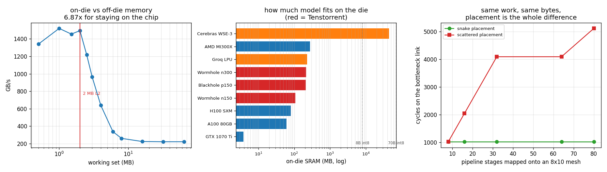

# Tenstorrent Dev

---

> No [Tenstorrent](/shared/glossary/#tenstorrent) card, and this project says so first rather than last. What it does instead: **measure** the architecture's central bet on the nearest thing this machine has (memory on the die is **6.9x** faster than memory off it — 1,521 GB/s against 221, with the fast plateau ending exactly at the 2 MB L2 size), **simulate** the [network-on-chip](/shared/glossary/#network-on-chip) that makes the programming model what it is (placement alone is worth **4.0x** on the same work with the same bytes), and **do the arithmetic** that the marketing does not (a 70B model at [int8](/shared/glossary/#int8) needs **325 Wormhole n300 cards** to live on-die, or **305 Groq chips**, or **2 Cerebras wafers**). Plus one finding that inverts the obvious rule: **the placement with 1.87x more hops is exactly as fast as the shortest one**, because a mesh is limited by its busiest *link*, not by distance.

---

## Key Insight

Every architecture in this phase is an answer to the same question — *the weights are too far away, what do we do?* — and Tenstorrent's answer is the most literal: **put the memory next to the arithmetic and make the programmer move the data explicitly.** No cache, no [warp](/shared/glossary/#warp) scheduler, no hardware guessing what you will need. That buys the **6.9x** measured in section B, and it costs you the thing section D measures: with explicit movement, *where you put your work* becomes a performance decision, and getting it wrong is worth 4x.

## Why This Matters

This closes the phase's argument. [Project 23](../23-run-a-tpu-notebook/README.md) simplified the compute unit ([TPU](/shared/glossary/#tpu)), [24](../24-amd-mi300-inference/README.md) attacked the software stack (AMD), [25](../25-apple-silicon-llm/README.md) merged the memory pools (Apple). Tenstorrent attacks the *distance*. Section C then does the arithmetic that applies to all of them at once, and gets an answer that is uncomfortable for every vendor including NVIDIA.

---

**This is project 27.**

### The words first

- **[Tenstorrent](/shared/glossary/#tenstorrent)** — an AI chip company (led for a while by Jim Keller, the architect behind AMD's Zen and Apple's A-series) whose cards you can actually buy, whose software stack is open source, and whose architecture is genuinely different from a GPU's.
- **Tensix core** — Tenstorrent's unit of compute. Each one contains a matrix engine, a vector engine, ~1.5 MB of local [SRAM](/shared/glossary/#sram), and **five small [RISC-V](/shared/glossary/#risc-v) processors** that do nothing but issue instructions and move data. A Wormhole chip has 72 of them; Blackhole has 140.
- **[RISC-V](/shared/glossary/#risc-v)** — an open, royalty-free instruction set. "RISC" = Reduced Instruction Set Computer, a 1980s design philosophy: few, simple instructions that each run fast. The "V" is just the fifth version from Berkeley. It matters here only because it is free to use, which is why a startup can put five CPUs in every core without paying licence fees.
- **[Network-on-chip (NoC)](/shared/glossary/#network-on-chip)** — the cores are wired as a 2D grid and data travels between them as *routed packets*, exactly like a small computer network shrunk onto one die. Hence the name.
- **[SRAM](/shared/glossary/#sram) vs [DRAM](/shared/glossary/#dram)** — SRAM (Static RAM) holds a bit in a latch of ~6 transistors: fast, no refreshing, and physically large, so you get megabytes. DRAM (Dynamic RAM) holds a bit as charge on a tiny capacitor that leaks and must be refreshed: slower and off-chip, but you get gigabytes. "Static" and "dynamic" refer to whether the stored bit stays put on its own. Every architecture in this project is a different answer to "how much of each?".
- **Circular buffer (CB)** — a fixed-size queue in a core's SRAM that one kernel writes and another reads. Called "circular" because when the writer reaches the end it wraps back to the start, so a small buffer can carry an unbounded stream.
- **Dataflow architecture** — one where the program is a *graph* of operations and data flows along its edges, rather than a sequence of instructions a processor steps through. Tenstorrent maps model graphs onto the physical grid this way.

### "A GPU also has fast on-chip memory. What is actually different?"

A fair challenge, and the difference is *who decides* and *how much*.

On a GPU, the on-die memory is mostly a **cache**: hardware decides what to keep, using a fixed policy you cannot see, and it silently evicts things. You get some control via [shared memory](/shared/glossary/#shared-memory) (~228 KB per SM on an H100), but the L2 is not yours to manage. On a Tensix core, **all 1.5 MB is yours**, addressed directly; there is no cache and nothing is ever evicted behind your back. The consequence is that a Tenstorrent compiler can *guarantee* that a layer's weights stay on-chip for the whole run, and a GPU compiler can only hope.

The second difference is quantity. Section C: an H100 has ~80 MB of on-die memory; a Wormhole n300 has **216 MB — 2.7x more** — on a much smaller and cheaper part. Tenstorrent spent transistors on SRAM that NVIDIA spent on [tensor cores](/shared/glossary/#tensor-core).

### "Why simulate a NoC at all? Isn't 'send data between cores' a solved problem?"

On a GPU it is *invisible*, which is not the same as solved. Blocks are assigned to SMs by hardware, in an order you do not control, and they communicate through [L2](/shared/glossary/#l2-cache) and [HBM](/shared/glossary/#hbm) — a shared pool that every SM reaches at roughly the same cost. There is no notion of two SMs being "near" each other.

On a mesh there is. Two adjacent cores talk in one hop; two opposite corners take 16. Section D measures what that geometry costs, and finds something that would not occur to you from the GPU model: **the number of hops is almost irrelevant, and link sharing is everything.**

---

## Running it

```bash
python run.py       # ~2 s
```

The Triton part needs a CUDA GPU; the simulator parts are pure Python. Hardware: **GTX 1070 Ti**, 19 SMs, **2 MB L2**.

> **What is measured, what is simulated, what is arithmetic.** This distinction is kept explicit throughout, because a project about hardware you do not own is only worth reading if it is honest about which is which.
>
> | section | status |
> |---|---|
> | B — on-die vs off-die bandwidth | **measured** on this GPU |
> | C — on-die capacity vs model size | **arithmetic** from published specs |
> | D, E — mesh routing and placement | **simulated** ([`noc.py`](noc.py)), with the ideal case checked against an analytic lower bound |
> | the tt-metal programming model | **shown as source, not executed** — there is no `tt-metal` runtime here, and `import ttnn` raises `ModuleNotFoundError` |

> **About the numbers.** Everything below comes from the committed
> [`outputs/findings.json`](outputs/findings.json) and
> [`outputs/findings.csv`](outputs/findings.csv).



---

## A. The programming model, written out

This is what a tt-metal kernel triple looks like. It is not run here; it is included because the *shape* of it is the architecture, and reading it takes two minutes.

```cpp
// ---- reader kernel: runs on one of the core's RISC-V "baby" cores ----
void kernel_main() {
    uint32_t src_addr   = get_arg_val<uint32_t>(0);
    uint32_t n_tiles    = get_arg_val<uint32_t>(1);
    constexpr uint32_t cb_in = tt::CB::c_in0;

    for (uint32_t i = 0; i < n_tiles; ++i) {
        cb_reserve_back(cb_in, 1);                  // wait for a free slot
        uint32_t l1 = get_write_ptr(cb_in);         // where in MY SRAM it goes
        noc_async_read(src_addr + i * TILE, l1, TILE);   // pull it over the NoC
        noc_async_read_barrier();                   // it has landed
        cb_push_back(cb_in, 1);                     // tell the compute kernel
    }
}

// ---- compute kernel: runs on the core's matrix/vector engine ----
void MAIN {
    for (uint32_t i = 0; i < n_tiles; ++i) {
        cb_wait_front(cb_in, 1);                    // a tile is ready
        cb_reserve_back(cb_out, 1);
        tile_regs_acquire();
        matmul_tiles(cb_in, cb_weights, 0, 0, 0, false);
        tile_regs_commit();
        pack_tile(0, cb_out);
        cb_push_back(cb_out, 1);
        cb_pop_front(cb_in, 1);                     // slot is free again
    }
}

// ---- writer kernel: another baby core, pushing results onward ----
void kernel_main() {
    for (uint32_t i = 0; i < n_tiles; ++i) {
        cb_wait_front(cb_out, 1);
        noc_async_write(get_read_ptr(cb_out), dst_addr + i * TILE, TILE);
        noc_async_write_barrier();
        cb_pop_front(cb_out, 1);
    }
}
```

Three things to take from it.

**You write three programs, not one.** Reading, computing and writing are separate kernels on separate processors inside the same core, and they run *at the same time*: while the compute engine works on tile *i*, the reader is already fetching tile *i+1* and the writer is shipping tile *i-1*. On a GPU this pipelining is something you hope the warp scheduler achieves for you; here it is the structure of the source.

**`cb_reserve_back` / `cb_push_back` / `cb_wait_front` / `cb_pop_front` is a queue.** The reader blocks if the buffer is full; the compute kernel blocks if it is empty. That back-pressure is the whole synchronisation mechanism — there is no `__syncthreads()`, no barrier across cores, no atomics. If your pipeline is unbalanced, the queue tells you where, by being permanently full on one side and empty on the other.

**`noc_async_read` names the mechanism.** You are not dereferencing a pointer into a global address space; you are asking the on-chip network to fetch bytes from somewhere else and put them in *your* SRAM at an address you chose. Every byte's journey is in your source code. That is the price of never being surprised by a cache miss.

---

## B. What "on the die" is worth, measured

[`onchip.py`](onchip.py) reads a buffer repeatedly and reports the bandwidth. A buffer smaller than the 2 MB L2 stays on the die; a larger one does not.

| working set | passes | GB/s |
|---:|---:|---:|
| 0.5 MB | 512 | 1,340 |
| **1 MB** | 256 | **1,521** |
| 1.5 MB | 170 | 1,456 |
| **2 MB** | 128 | **1,495** |
| 2.5 MB | 102 | 1,219 |
| 3 MB | 85 | 966 |
| 4 MB | 64 | 640 |
| 6 MB | 42 | 337 |
| 8 MB | 32 | 260 |
| 16 MB | 16 | 224 |
| 64 MB | 4 | **221** |

**The fast plateau runs from 0.5 MB to 2 MB and stops there — exactly this card's L2 size — and it is 6.9x the off-die rate.** Within the plateau the readings (1,340–1,521 GB/s) differ by more than the sizes do; that spread is run-to-run noise on a shared machine, and the shape is what matters, not any single point in it. The plateau also brackets the 1,414 GB/s that [project 3](../03-bandwidth-measurement/README.md) measured independently with a different kernel, which is the check that this is a real cache effect and not an artefact of the loop.

Read the decay between 2 MB and 8 MB rather than skipping it: it is gradual, not a step, because a working set slightly larger than the cache still gets *some* hits — 2.5 MB is already 20% down, 4 MB is 58% down. By 8 MB there is nothing left and the number is DRAM's.

Two measurement traps had to be dealt with, and both are general:

- **Re-reading by re-launching the kernel does not work.** A 1 MB buffer at 1,500 GB/s takes 0.7 µs to read, and a kernel launch costs about 1.2 µs, so a loop of launches measures the launch. The first version of this test reported **68 GB/s** for the *fastest* configuration — slower than DRAM — for exactly this reason. The passes have to happen inside the kernel.
- **Repeating the same addresses lets the compiler delete the repetition.** If every pass loads the same values in the same order, the loads are loop-invariant and can be hoisted out, leaving one real pass and 511 empty ones. Each pass here starts at a rotated offset so the addresses genuinely differ. (This is the same class of bug as [project 18](../18-triton-softmax/README.md)'s warm-up kernel, which was deleted entirely because its only store was masked off.)

**So Tenstorrent's bet is real and it is worth about 7x on this machine.** The question section C asks is how much of a model you can actually keep there.

---

## C. How much model fits on the die

At [int8](/shared/glossary/#int8), one parameter is one byte, so megabytes of on-die SRAM read directly as millions of parameters.

| accelerator | on-die SRAM | off-die memory | params on-die (int8) | chips to hold 70B on-die |
|---|---:|---:|---:|---:|
| GTX 1070 Ti (this card) | 3.8 MB | 8 GB | 3.8 M | 18,306 |
| NVIDIA A100 80GB | 60.7 MB | 80 GB | 60.7 M | 1,153 |
| NVIDIA H100 SXM | 80.1 MB | 80 GB | 80.1 M | 874 |
| Tenstorrent Wormhole n150 | 108 MB | 12 GB | 108 M | 649 |
| Tenstorrent Blackhole p150 | 210 MB | 32 GB | 210 M | 334 |
| **Tenstorrent Wormhole n300** | **216 MB** | 24 GB | 216 M | **325** |
| Groq LPU | 230 MB | **none** | 230 M | **305** |
| AMD MI300X | 275.5 MB | 192 GB | 275.5 M | 255 |
| **Cerebras WSE-3** | **44,000 MB** | none | **44 B** | **2** |

(GPU rows count L2 plus per-SM shared memory; the rest count core-local SRAM.)

### C1. Nobody's chip holds a frontier model

**A Wormhole n300 holds 216 million parameters on-die. An 8B model needs 37 of them; a 70B model needs 325.** The 2.7x SRAM advantage over an H100 is real and it does not change the conclusion, because the gap to be closed is a factor of 300, not 3.

So a single Tenstorrent card running a 7B model is *also* streaming weights from its GDDR6, exactly like a GPU streaming from [HBM](/shared/glossary/#hbm). The architecture does not escape the memory wall; it moves the wall from 80 MB to 216 MB. That is worth having and it is not a revolution.

### C2. The two architectures that took it seriously

**Groq has no DRAM at all.** 230 MB of SRAM and nothing else, which means a model that does not fit *cannot run* — you add chips until it does. 305 chips for a 70B at int8, and Groq's public deployments are indeed hundreds of chips per model. That is not a flaw in the design, it is the design: they traded capacity-per-chip for the fact that every weight access is SRAM-speed, which is why their per-user token rates are extraordinary and their capital cost per model is enormous.

**Cerebras made the chip the size of a wafer** and got 44 GB. Even that does not hold a 70B at int8 (70 GB needed, 44 GB available) — it takes two — though at [int4](/shared/glossary/#int4) a 70B fits on one with room to spare. A whole 46,000 mm² of silicon buys you *one* frontier-ish model on-chip.

**The honest closing on the whole phase:** every accelerator streams weights for a large model. TPU, GPU, Tenstorrent, Groq, Cerebras — all of them. What differs is only *how far the weights travel and how often*, and that is why [arithmetic intensity](/shared/glossary/#ai-arithmetic-intensity), [quantization](/shared/glossary/#quantization) and batching keep turning out to matter more than the badge on the chip.

---

## D. Placement, on a mesh

[`noc.py`](noc.py) models an 8×10 mesh with dimension-order XY routing (travel along the row first, then the column — the standard scheme because it can never deadlock and needs no routing tables). A 32-stage pipeline is mapped onto it; each stage hands 32 KB of activations to the next.

| placement | mean hops | links used | bottleneck link | cycles |
|---|---:|---:|---:|---:|
| **snake** (stage *i+1* adjacent to *i*) | **1.00** | 31 | 32 KB | **1,024** |
| row-major | 1.68 | 52 | 32 KB | **1,024** |
| column-major | **1.87** | 58 | 32 KB | **1,024** |
| **scattered** (no placement pass) | 5.61 | 125 | **128 KB** | **4,096** |

### D1. The inversion: hops are not the cost

Column-major routes its data **1.87x further** than the snake, uses 58 links instead of 31 — and finishes at exactly the same time. Only the scattered placement is slower, and it is slower by 4.0x.

The reason is that a mesh is limited by its **busiest link**, not by total distance. As long as no two flows want the same link at the same time, extra hops are extra *latency* on a pipeline that is already deep, and they cost nothing in *throughput*. Scattered placement is bad not because its routes are long but because 32 flows crossing the middle of the mesh at random end up sharing links — four flows on the worst one, hence 4x.

**So "minimise the distance" is the wrong objective and "avoid sharing a link" is the right one.** That is not obvious, it is the opposite of the natural guess, and it is why a NoC compiler's placement pass is a congestion problem rather than a shortest-path problem.

### D2. Checking the simulator against something it cannot fake

An unvalidated simulator tells you what you programmed into it. The check available here: with every stage on its own core and each hand-off crossing at least one link, the bottleneck link can never carry less than **one hand-off's worth of bytes = 32,768**. The snake placement measures exactly **32,768**. It is optimal, provably, and the simulator agrees with the proof.

### D3. How the gap grows

| stages | snake | scattered | ratio |
|---:|---:|---:|---:|
| 8 | 1,024 | 1,024 | **1.0x** |
| 16 | 1,024 | 2,048 | 2.0x |
| 32 | 1,024 | 4,096 | 4.0x |
| 64 | 1,024 | 4,096 | 4.0x |
| 80 | 1,024 | 5,120 | **5.0x** |

The snake is flat: adding stages adds cores, and each new hand-off gets its own private link, so the bottleneck never grows. Scattered placement gets steadily worse as more flows pile onto the same central links.

At 8 stages they are identical — an 8×10 mesh is empty enough that even random placement rarely collides. **Placement does not matter until the chip is full**, which is precisely when you start caring about it, and precisely why a small benchmark will not reveal the problem.

---

## E. The pattern a mesh is worst at

All 80 cores send 4 KB to one core — an [all-reduce](/shared/glossary/#allreduce)'s final gather, or a [softmax](/shared/glossary/#softmax) denominator being collected. Total bytes identical to a neighbour hand-off pattern for comparison.

| pattern | total bytes | total hops | bottleneck link | cycles |
|---|---:|---:|---:|---:|
| gather to a **corner** (0,0) | 324 KB | 640 | 288 KB | **9,216** |
| gather to the **centre** (5,4) | 324 KB | 360 | 160 KB | **5,120** |
| neighbour hand-offs | 324 KB | 79 | 4 KB | **128** |

**The same 324 KB costs 40x more as a gather than as neighbour hand-offs**, and moving the destination from a corner to the centre is worth **1.8x** on its own. The reason is visible in the numbers: every one of the 79 flows must cross the last link into the destination, so that link carries 288 KB while most of the mesh sits idle. A corner is worse than the centre because a corner has only two links attached to it, and a central core has four.

This is what a mesh is structurally bad at, and it is why architectures like this favour *pipeline* parallelism (each stage talks only to its neighbour) over *data* parallelism (everyone must eventually reduce with everyone). It is the on-chip version of the same argument [Phase 6](../../README.md#phase-6-interconnects-multi-gpu-and-multi-node) makes about cluster topologies — and it is the same argument in the other direction from [project 25](../25-apple-silicon-llm/README.md), where a *shared* pool meant everyone contended: here, a *distributed* memory means everyone contends for the links to it instead. There is no arrangement that removes contention; there are only arrangements that move it somewhere your workload does not go.

---

## What to take away

1. **On-die memory is worth about 7x**, measured, with the fast plateau ending exactly at the L2 size. That is the entire justification for Tenstorrent's design.
2. **It is not worth enough.** 216 MB against a 70 GB model: **325 cards** to hold it on-die. Every architecture streams weights for a large model; only the distance differs.
3. **The programming model is three kernels and a queue** — reader, compute, writer, connected by circular buffers — and the pipelining that a GPU leaves to its scheduler is written out by hand.
4. **On a mesh, hops are nearly free and shared links are not.** A placement with 1.87x more distance tied with the shortest one; the placement that shared links lost 4.0x.
5. **Congestion appears only when the chip is full.** Identical at 8 stages, 5.0x apart at 80.
6. **Gathers are what meshes are worst at**: 40x the cost of the same bytes moving between neighbours, and 1.8x of that is just the destination's position.

---

## Phase 5, closed

Five projects, one shape. A [TPU](/shared/glossary/#tpu) simplifies the arithmetic unit and pays for it in shape rigidity ([project 23](../23-run-a-tpu-notebook/README.md): 1.96x for one extra column, 0.39% of the array at batch 1). AMD matches the silicon and pays for it in software ([project 24](../24-amd-mi300-inference/README.md): 88.1% of lines port, 112 landmines survive). Apple merges the memory pools and pays for it in bandwidth ([project 25](../25-apple-silicon-llm/README.md): 546 vs 1,008 GB/s, for 4x the capacity). Tenstorrent moves the memory onto the die and pays for it in capacity and in placement (this project: 6.9x, but 325 cards). And [project 26](../26-compare-accelerators/README.md) is why none of these has a single answer: **the ranking depends on where the workload sits on the roofline, and every device's roofline is in a different place** — ridge points spanning 13.4x, with the same decode step compute-bound on one accelerator and memory-bound on another.

Next: [Phase 6 — Interconnects, Multi-GPU, and Multi-Node](../../README.md#phase-6-interconnects-multi-gpu-and-multi-node), where the same distance-and-contention arguments scale from one die to a rack.
