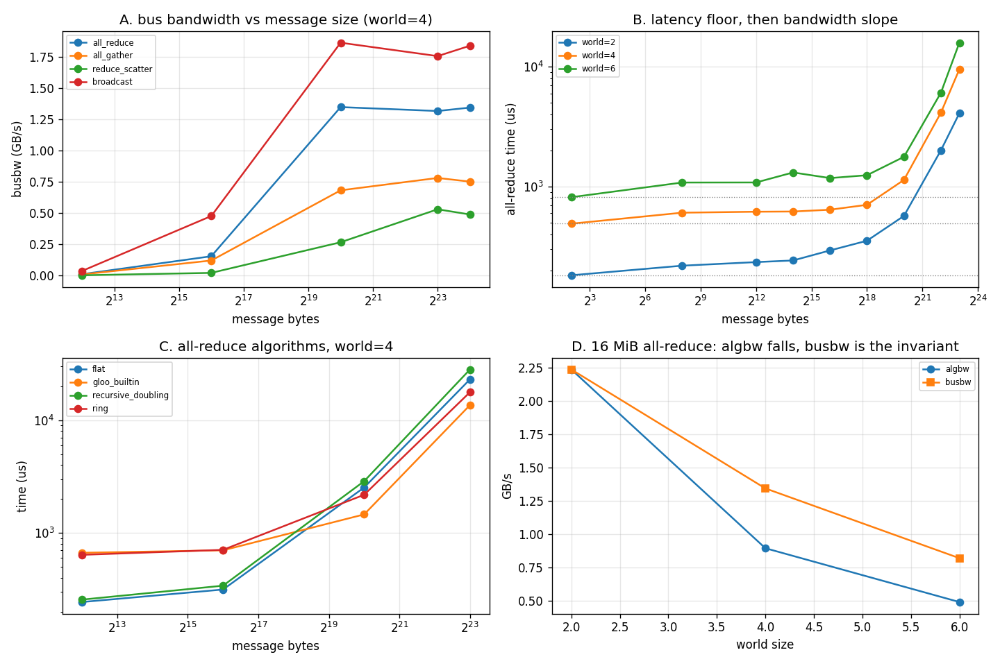

# NCCL Tests

---

> [NCCL](/shared/glossary/#nccl) cannot run on this machine — the probe in section A captures the exact refusal — so this project rebuilds `nccl-tests` on the only transport available: 6 processes on 12 CPU cores talking [gloo](/shared/glossary/#gloo) over [TCP](/shared/glossary/#tcp) loopback. The methodology is the real one, and it produces real results. A 4-byte [all-reduce](/shared/glossary/#allreduce) and a 256 KiB all-reduce **cost the same**, because everything below **~350 KiB** is pure fixed cost. Three all-reduce algorithms, written by hand and verified bit-for-bit against gloo's own, **swap places**: the [ring](/shared/glossary/#ring-all-reduce) is **2.6x slower** than the dumbest possible algorithm at 4 KiB and **1.59x faster** at 8 MiB. And gloo's own library implementation, which wins by **1.30x** at 8 MiB, **loses 2.73x** at 4 KiB to twelve lines of Python.

---

## Key Insight

`nccl-tests` prints two bandwidth columns, and the second one — **busbw** — exists because the first one is not comparable across [world sizes](/shared/glossary/#world-size). Our measured [algorithm bandwidth](/shared/glossary/#algbw) for the same 16 MiB all-reduce moves **4.53x** between 2 and 6 ranks; the same measurement converted to [bus bandwidth](/shared/glossary/#busbw) moves **2.72x**. On a real fabric with independent links the second number is nearly flat, which is exactly what makes it the number you compare against your hardware's spec sheet. On this machine it is *not* flat, and section E explains why the difference is itself informative.

## Why This Matters

Everything in [Phase 6](../../README.md#phase-6-interconnects-multi-gpu-and-multi-node) is downstream of one question: how long does it take a group of accelerators to agree on a sum? [Project 29](../29-multi-gpu-ddp/README.md) spends that time inside a training step, [project 30](../30-fsdp-scaling/README.md) pays 1.5x of it to save memory, and [project 31](../31-multi-node-setup/README.md) asks what happens when one of the links is slow. This project measures the primitive itself, so the later numbers have a floor to be compared against.

---

**This is project 28.**

### The words first

- **[Collective operation](/shared/glossary/#collective-operation)** — an operation that *all* participants take part in together, as opposed to a point-to-point send from one rank to one other rank. "Collective" is used here in its ordinary English sense: done as a group.
- **[all-reduce](/shared/glossary/#allreduce)** — "reduce" is the functional-programming word for folding many values into one with an operator (sum, max, ...). A *reduce* leaves the answer on one rank. An **all**-reduce leaves the answer on **all** of them. It is exactly what data-parallel training needs: every replica must end up with the same averaged gradient.
- **[all-gather](/shared/glossary/#allgather)** — everyone contributes a piece, and everyone ends up with all the pieces concatenated. Nothing is summed.
- **[reduce-scatter](/shared/glossary/#reduce-scatter)** — the sum is computed but then *scattered*: rank *i* keeps only slice *i* of it. An all-reduce is literally a reduce-scatter followed by an all-gather, which is why the two appear together everywhere in this phase.
- **[broadcast](/shared/glossary/#broadcast)** — one rank has the data, everyone else needs a copy.
- **[rank](/shared/glossary/#rank)** — the integer identity of one process in the group (0, 1, 2, ...). **[World size](/shared/glossary/#world-size)** is how many there are.
- **[NCCL](/shared/glossary/#nccl)** — "NVIDIA Collective Communications Library", pronounced "nickel". It implements these collectives over [NVLink](/shared/glossary/#nvlink)/[PCIe](/shared/glossary/#pcie)/[InfiniBand](/shared/glossary/#infiniband-ib) and picks the algorithm for you.
- **[gloo](/shared/glossary/#gloo)** — the CPU-side equivalent that ships with PyTorch. It speaks plain TCP, so it works anywhere, and it is slow enough that the effects we want to see are large.
- **loopback** — the fake network interface (`lo`, address `127.0.0.1`) that a machine uses to talk to itself. The packets never reach a cable; the kernel copies them between two sockets.
- **[algbw / busbw](/shared/glossary/#busbw)** — the two bandwidth columns explained in section E.

### "If PyTorch already has `dist.all_reduce`, why write three of my own?"

Because a library call answers *how fast*, and only a re-implementation answers *why that fast*. `dist.all_reduce` is one line, and it hides the choice that costs you a factor of 2.6 in section D: how many messages, how big, and in what order. Writing the ring, the [recursive doubling](/shared/glossary/#recursive-doubling) and the naive "everyone sends to rank 0" versions puts that choice back in your hands, and then the measurement tells you which one gloo picked and where its choice is wrong.

The hand-written versions are not toys, either: section D checks all three against gloo's result and they agree to 9.5e-07 in fp32 — a difference that comes only from summing in a different order, not from a mistake.

### "Isn't measuring a collective on loopback pointless if there is no network?"

It measures a *slower* network, not a *fake* one. Every effect this project reports — the latency floor, the crossover between algorithms, the definition of busbw — is a property of the algorithm and the [alpha-beta](/shared/glossary/#alpha-beta-model) structure of any link, not of Ethernet in particular. What loopback does *not* give you is the absolute numbers (2.2 GB/s here, ~230 GB/s [busbw](/shared/glossary/#busbw) on a real DGX) or the topology effects, which is why [project 32](../32-topology-study/README.md) treats topology separately and arithmetically.

---

## Running it

```bash
python run.py       # ~35 s
```

Needs `torch` only. Hardware: **Intel i7-8700K** (6 cores / 12 threads), one thread per rank, and one **GTX 1070 Ti** that is only used to prove it cannot be used.

> **About the numbers.** Everything below comes from the committed
> [`outputs/findings.json`](outputs/findings.json),
> [`outputs/findings.csv`](outputs/findings.csv) and
> [`outputs/run.log`](outputs/run.log).



---

## A. The refusal, measured

| what | value |
|---|---|
| GPUs visible | 1 (GTX 1070 Ti) |
| compute capability | **sm_61** |
| architectures in this PyTorch build | sm_70, sm_75, sm_80, sm_86, sm_90, sm_100, sm_120 |
| `torch.distributed.is_nccl_available()` | **True** |
| NCCL actually runs | **False** |
| error | `CUDA error: no kernel image is available for execution on the device` |

Read the third and fourth rows together: **PyTorch reports NCCL as available and NCCL still cannot run a single collective**. `is_nccl_available()` only says "this build was compiled with NCCL support". It knows nothing about whether the GPU in the machine has kernels in the binary. The card is from 2017 and PyTorch stopped shipping sm_61 kernels; the first collective that tries to launch one fails.

Two GPUs would be needed for the interesting cases anyway, and there is one. So: gloo, over loopback, for the rest of the project.

---

## B. The sweep

For each collective, each message size and each world size: time it, then convert to bandwidth. World = 4:

| bytes | all-reduce | all-gather | reduce-scatter | broadcast |
|---:|---:|---:|---:|---:|
| 4 KiB | 622 µs | 385 µs | **2,285 µs** | 115 µs |
| 64 KiB | 640 µs | 412 µs | 2,400 µs | 138 µs |
| 1 MiB | 1,167 µs | 1,154 µs | 2,960 µs | 563 µs |
| 8 MiB | 9,558 µs | 8,061 µs | 11,878 µs | 4,777 µs |
| 16 MiB | 18,727 µs | 16,753 µs | 25,790 µs | 9,122 µs |

Two things jump out.

**Broadcast is 5.4x faster than all-reduce at 4 KiB and 2.05x at 16 MiB.** That is the correct shape: a broadcast moves each byte outward once, an all-reduce has to move it in *and* back out, and at small sizes the extra round of messages is pure latency.

**gloo's `reduce_scatter` is 3.7x slower than its `all_reduce` at 4 KiB**, which is backwards — a reduce-scatter is *half* of an all-reduce. This is a library artefact, not a law: gloo implements `reduce_scatter` as a reduce followed by a scatter instead of as a single fused pass. Worth knowing, because [project 30](../30-fsdp-scaling/README.md) shows FSDP leaning on exactly this primitive.

At 16 MiB, across world sizes:

| world | all-reduce time | algbw | busbw |
|---:|---:|---:|---:|
| 2 | 7.51 ms | 2.234 GB/s | 2.234 GB/s |
| 4 | 18.73 ms | 0.896 GB/s | 1.344 GB/s |
| 6 | 34.04 ms | 0.493 GB/s | 0.821 GB/s |

---

## C. Below ~350 KiB, the message size does not matter

Time of one all-reduce against message size (world = 4):

| bytes | 4 | 256 | 4 Ki | 16 Ki | 64 Ki | 256 Ki | 1 Mi | 4 Mi | 8 Mi |
|---|---:|---:|---:|---:|---:|---:|---:|---:|---:|
| µs | 489 | 605 | 616 | 618 | 640 | 703 | 1,136 | 4,135 | 9,534 |

**A 4-byte all-reduce takes 489 µs. A 16,384-byte all-reduce takes 618 µs.** Four thousand times the data, 1.26x the time. The bytes are free; the *round trips* are not.

That is the [alpha-beta model](/shared/glossary/#alpha-beta-model): `T(n) = α + n/B`, where α ("alpha", the fixed cost per message) and B (the streaming bandwidth) are properties of the link. The name is just the two Greek letters conventionally used for the two terms — α for the constant, β for the per-byte slope (`β = 1/B`).

| world | α (fixed cost) | B (bandwidth) | crossover = α·B |
|---:|---:|---:|---:|
| 2 | 181.5 µs | 2.009 GB/s | **356 KiB** |
| 4 | 489.4 µs | 0.777 GB/s | **371 KiB** |
| 6 | 814.3 µs | 0.428 GB/s | **340 KiB** |

The **crossover** is the message size at which the transfer term finally equals the fixed cost. Below it you are paying for latency, above it for bandwidth. All three world sizes land within 10% of each other (~350 KiB) even though α grows 4.5x and B falls 4.7x — the two effects cancel, because both are dominated by the same per-message overhead of the same transport.

**The practical consequence**: if your gradients arrive in 100 KiB pieces, merging them into one 1 MiB message is nearly free in bytes and saves you *n* whole fixed costs. That is precisely what gradient [bucketing](/shared/glossary/#gradient-bucketing) does, and [project 29](../29-multi-gpu-ddp/README.md) measures it at **1.9x**.

α also grows with the world size (181 → 489 → 814 µs) because a collective is only finished when its *slowest* participant is finished, and more participants means more chances for one of them to be late.

---

## D. Three algorithms, and the crossover between them

All three compute the same sum. They differ only in the shape of the message traffic.

| algorithm | latency steps | bytes each rank sends | the idea |
|---|---:|---:|---|
| **ring** | 2(n−1) | 2(n−1)/n · N | pass chunks around a circle; sum on the way round, copy on the way back |
| **recursive doubling** | log₂ n | log₂ n · N | swap the *whole* buffer with a partner at distance 1, then 2, then 4 ... |
| **flat** | 2 | N | everyone sends to rank 0; rank 0 sums and sends back |

*"Recursive doubling" is named for what the distance does*: your partner is the rank whose id differs from yours in bit 0, then bit 1, then bit 2. The distance doubles each round, and after log₂ n rounds every rank has seen every other rank's contribution. *"Ring"* is named for the shape of the communication graph — each rank only ever talks to its two neighbours in a circle.

Measured (world = 4), max error against gloo's answer 9.5e-07:

| bytes | ring | recursive doubling | flat | gloo built-in |
|---:|---:|---:|---:|---:|
| 4 KiB | 640 µs | **256 µs** | **244 µs** | 667 µs |
| 64 KiB | 708 µs | 341 µs | **315 µs** | 701 µs |
| 1 MiB | 2,181 µs | 2,877 µs | 2,530 µs | **1,460 µs** |
| 8 MiB | 17,729 µs | 28,172 µs | 23,031 µs | **13,615 µs** |

**The ring is the worst algorithm at 4 KiB (2.6x slower than flat) and the best hand-written one at 8 MiB (1.59x faster than recursive doubling).** Nothing about the ring changed; the message size did. At 4 KiB every step is one full α, and the ring takes 6 steps where flat takes 2. At 8 MiB the steps are all bandwidth, and the ring is the only one of the three whose *bytes* stay near optimal: recursive doubling sends log₂(4)·N = 2N bytes, and flat funnels 3N bytes through one unlucky rank.

This is exactly why NCCL does not have "an all-reduce algorithm" — it has several and picks by message size and topology. Our measurement reproduces the reason for that design from scratch.

**And the honest one: gloo's own implementation loses 2.73x at 4 KiB** (667 µs vs our 244 µs flat). The library is tuned for the case that matters to it and is beaten by the naivest possible code in the case that does not. At 8 MiB it wins by 1.30x over our best. Library code is not automatically the fast path — it is the fast path *in the regime its authors cared about*.

(All four numbers include one `clone()` of the input buffer, so the comparison is fair; at 8 MiB that clone is under 1 ms of the total.)

---

## E. Why `nccl-tests` prints busbw

`nccl-tests` reports two columns and beginners routinely quote the wrong one.

- **algbw ("algorithm bandwidth") = message bytes ÷ time.** How fast *your data* moved. It is what you feel.
- **busbw ("bus bandwidth") = algbw × factor(n).** How fast *the slowest link* was driven. It is what you compare to the hardware spec.

The factor is not a fudge. It comes from counting how many bytes each rank must actually push through its outgoing link:

| collective | factor | why |
|---|---|---|
| all-reduce | 2(n−1)/n | reduce-scatter (each rank sends (n−1)/n of the buffer) **plus** all-gather (again) |
| all-gather, reduce-scatter | (n−1)/n | each rank sends its piece to the other n−1 ranks, i.e. everything except its own share |
| broadcast, reduce | 1 | each byte crosses each link once |

So for a 16 MiB all-reduce on 4 ranks, each rank pushes 2·(3/4)·16 MiB = 24 MiB even though the user only asked about 16 MiB. Dividing by the same time gives the number that should match the link.

| world | algbw | busbw |
|---:|---:|---:|
| 2 | 2.234 GB/s | 2.234 GB/s |
| 4 | 0.896 GB/s | 1.344 GB/s |
| 6 | 0.493 GB/s | 0.821 GB/s |
| **spread (max/min)** | **4.53x** | **2.72x** |

**The correction cuts the spread from 4.53x to 2.72x and does not remove it**, and the leftover is the honest part of this project. On a real cluster busbw is nearly constant across world size because each GPU has its *own* NVLink port — adding GPUs adds links. Here, adding ranks adds no links at all: all six processes share one kernel, one loopback interface and 12 cores. The formula assumes the fabric grows with the world, and this "fabric" does not.

Which is the useful way to read any busbw table you are given: **if busbw falls as you add ranks, something is shared that you thought was parallel.** Oversubscribed switch ports, a single NIC per node, two GPUs behind one PCIe switch — the symptom is identical to what this machine shows.

---

## What to take away

1. **`is_nccl_available()` is a build flag, not a capability.** It returned True on a machine where the first NCCL collective dies immediately.
2. **Below ~350 KiB, message size is irrelevant** — 4 bytes and 16 KiB cost within 26% of each other. Merge small messages; the bytes are free.
3. **The best all-reduce algorithm depends on the message size**, measured: ring loses 2.6x at 4 KiB and wins 1.59x at 8 MiB against the same competitors.
4. **The library is not automatically fastest.** gloo lost 2.73x to twelve lines of Python at 4 KiB.
5. **busbw is the comparable column**, and when it *still* changes with world size, you have found something shared.

---

## What to try next

- Add a **tree** all-reduce (reduce up a binary tree, broadcast down) and see whether it beats recursive doubling at 4 KiB — NCCL's small-message path is a double binary tree.
- Re-run with `GLOO_SOCKET_IFNAME` pointing at a real NIC and a second machine; the α should jump by roughly the network's round-trip time and the crossover with it.
- Take the α and B from section C into the [project 31](../31-multi-node-setup/README.md) model and check whether it predicts the hierarchical/flat crossover there.

Next: [project 29 — Multi-GPU DDP](../29-multi-gpu-ddp/README.md), which spends these collectives inside a real training step.
