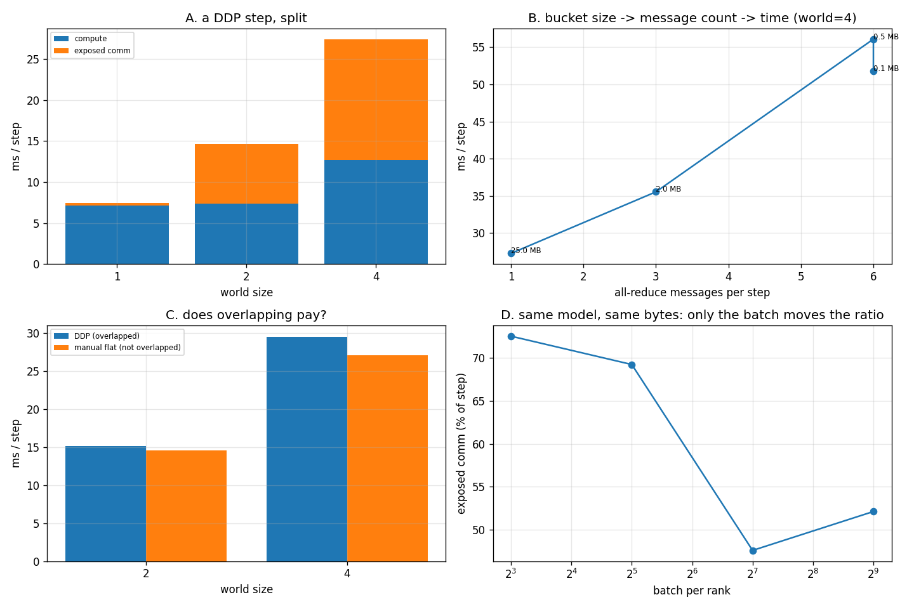

# Multi-GPU DDP

---

> A [DDP](/shared/glossary/#ddp) step is one [all-reduce](/shared/glossary/#allreduce) wrapped in a training loop, and this project takes a stopwatch to every part of it. The gradients that four replicas produce match a single process on the whole batch to **4.2e-09**. The [bucketing](/shared/glossary/#gradient-bucketing) knob that nobody tunes is worth **1.90x** (6 messages/step → 1). And DDP's celebrated trick — overlapping communication with the backward pass — comes out at **0.92x** here: with one bucket there is nothing left to overlap, and the machinery costs more than it saves. The one lever that genuinely moves the communication share is the least glamorous: **batch size**, which takes exposed communication from **72.5% to 52%** of the step.

---

## Key Insight

Data parallelism does not care how big your model is; it cares about the **ratio** of compute per step to bytes per step. For an [MLP](/shared/glossary/#mlp) that ratio is `batch x d²` FLOPs against `d²` parameter-bytes — so **widening the model changes both sides equally and changes nothing**, while raising the batch per rank changes only the numerator. That is the entire reason large-batch training scales and small-batch training does not, and section E measures it.

## Why This Matters

[Project 28](../28-nccl-tests/README.md) measured the collective on its own. Here it is embedded in a real optimiser step, where three things can hide it (overlap, bucketing, more compute) and one thing can expose it (more ranks). The numbers that come out are the ones you actually have to reason about when a training job scales badly.

---

**This is project 29.**

### The words first

- **[Data parallelism](/shared/glossary/#data-parallelism)** — every device holds a *complete copy* of the model and a *different slice* of the batch. After the backward pass the copies must be made identical again, which is what the all-reduce is for.
- **[DDP](/shared/glossary/#ddp) (DistributedDataParallel)** — PyTorch's implementation. It wraps your module, watches gradients appear during `backward()`, and averages them across ranks behind your back.
- **[Gradient bucketing](/shared/glossary/#gradient-bucketing)** — instead of one message per parameter tensor, DDP packs gradients into fixed-size "buckets" (`bucket_cap_mb`) and sends one message per full bucket. A *bucket* here is just a staging buffer that several tensors are copied into.
- **Overlap** — issuing a bucket's all-reduce as soon as that bucket is full, so the network works while the rest of the backward pass is still computing. Hiding one cost behind another.
- **Comm hook** (`register_comm_hook`) — the documented place to replace what DDP does with a bucket. We use it as a stopwatch and a byte counter, because from the outside a step is one opaque number.
- **Exposed communication** — the part of the communication that is *not* hidden behind compute, i.e. `ddp_step_time − local_step_time`. The only part you can actually feel.

### "The replicas all compute the same model. Why does averaging the gradients need a network operation at all — can't each replica just use its own gradient?"

It can, and then it is no longer training the same model. Rank 0 would step its weights using only its 64 samples, rank 1 using its own different 64, and after one step the four "copies" are four different models — every later gradient would be computed from different weights, and the run would no longer be equivalent to anything. Data parallelism's whole promise is *"batch 256 on four devices behaves exactly like batch 256 on one"*, and section A shows that promise is exact to 4.2e-09 — but only because of the all-reduce.

### "If DDP already averages the gradients, why does the loss have to be a *mean* and not a *sum*?"

Because the all-reduce sums across ranks and then divides by the world size, while the loss reduction divides by the *local* batch. `mean` on each rank of B samples, then averaged over n ranks, equals the mean over all nB samples — the two divisions compose correctly. Use `sum` and you get n times the gradient you wanted, which shows up as a learning rate that is silently n times too big. This is the single most common data-parallel bug, and section A is the test that catches it.

### "Why a comm hook? Can't I just time the step?"

Timing the step gives you one number that contains compute, communication, the optimiser, and any overlap between them — and you cannot separate them afterwards. The hook is called *inside* the machinery, once per bucket, so it can report the two facts that a stopwatch outside cannot: **how many messages** and **how many bytes**. It replaces DDP's default averaging with the identical operation plus counters, so the model still trains correctly (section A verifies exactly that, with the hook installed).

---

## Running it

```bash
python run.py       # ~36 s
```

Needs `torch` only. Hardware: **Intel i7-8700K** (6 cores / 12 threads). Each rank is pinned to **2 threads**, so 4 ranks use 8 of the 12 threads and each rank's *compute* stays roughly constant as the world grows — otherwise "communication got worse with more ranks" would be indistinguishable from "each rank got fewer cores".

The model is 6 × (512 → 512) linear layers plus a head: **1.58 M parameters = 6.32 MB of fp32 gradients per step.** Small enough to run in seconds, big enough that one all-reduce is a real message.

> **About the numbers.** Everything below comes from the committed
> [`outputs/findings.json`](outputs/findings.json),
> [`outputs/findings.csv`](outputs/findings.csv) and
> [`outputs/run.log`](outputs/run.log).



---

## A. The invariant that makes data parallelism legitimate

Four ranks × batch 32, compared against one process doing the whole batch of 128 with no communication at all:

| world | max &#124;DDP − single-process&#124; gradient | gradient norm | messages/step | bytes/step |
|---:|---:|---:|---:|---:|
| 2 | **7.5e-09** | 0.138 | 1 | 6.32 MB |
| 4 | **4.2e-09** | 0.097 | 1 | 6.32 MB |

The difference is ~10⁻⁸ against a gradient of ~10⁻¹, i.e. **eight orders of magnitude below the signal** — pure fp32 summation-order noise, not an algorithmic difference. This is the check worth writing first in any distributed code you touch: if it fails, everything measured afterwards is measuring the wrong program.

Note the last column: **6.32 MB per step regardless of world size.** Each rank sends the whole gradient buffer into the collective no matter how many peers there are. What grows with the world is the *wire* traffic (2(n−1)/n × 6.32 MB, per [project 28](../28-nccl-tests/README.md)'s bus-bandwidth factor), not the user-visible message.

---

## B. Where the step time goes

Same model, batch 64 per rank:

| world | local step (no DDP) | DDP step | time inside all-reduce | exposed comm | exposed share |
|---:|---:|---:|---:|---:|---:|
| 1 | 7.15 ms | 7.47 ms | 0.13 ms | 0.33 ms | **4.4%** |
| 2 | 7.35 ms | 14.67 ms | 3.27 ms | 7.32 ms | **49.9%** |
| 4 | 12.67 ms | 27.35 ms | 9.53 ms | 14.69 ms | **53.7%** |

Three readings, in order of how surprising they are.

**World size 1 already costs 0.33 ms.** There is nobody to talk to and DDP still runs its reducer, copies gradients into a bucket, and calls a one-rank all-reduce. That is the price of the abstraction, and it is small — but it is not zero, which is why single-GPU code should not be wrapped in DDP "just in case".

**Exposed communication (7.32 ms at world 2) is larger than the time spent inside the all-reduce (3.27 ms).** That looks impossible and is not: the hook's clock only covers the collective itself, while the extra time also includes flattening gradients into the bucket, the reducer's bookkeeping, and — the big one here — four processes competing for the same memory bandwidth and cores. On a real cluster with independent GPUs, this gap is where "my scaling is bad and the profiler says the network is idle" comes from.

**Local compute itself rose from 7.15 to 12.67 ms between world 1 and world 4** even though each rank does identical work on 2 threads. That is the shared machine showing through, and it is the honest limit of measuring multi-GPU behaviour on one CPU. Every ratio in this project is computed against a same-world baseline for that reason.

---

## C. Bucketing is worth 1.90x

`bucket_cap_mb` sets how much gradient DDP packs into one message. World = 4, batch 64:

| bucket cap | messages/step | step time | time inside all-reduce\* |
|---:|---:|---:|---:|
| 0.1 MB | 6 | 51.75 ms | 134.59 ms |
| 0.5 MB | 6 | 56.07 ms | 131.06 ms |
| 2.0 MB | 3 | 35.54 ms | 41.84 ms |
| **25.0 MB** | **1** | **27.27 ms** | 8.36 ms |

\* This column sums *concurrent* messages, so it can exceed the step time — six overlapping all-reduces each measured from issue to completion add up to more wall-clock than actually elapsed. It is a measure of message count and congestion, not of elapsed time.

**One message per step is 1.90x faster than six.** Each extra message costs one full α (~490 µs at world 4, from [project 28](../28-nccl-tests/README.md) section C) and the payload is unchanged, so the extra messages buy nothing.

**0.1 MB and 0.5 MB give the identical 6 messages**, because DDP will not split a single tensor across buckets and each 512×512 weight is already 1.05 MB. Below one tensor's size the knob stops doing anything — the layout saturates at "one message per weight matrix". Knowing that saves you from tuning a parameter that has no effect in your range.

The reason the default is 25 MB and not infinity is the next section.

---

## D. The honest inversion: overlap bought nothing here

DDP's headline feature is that it fires each bucket's all-reduce *during* the backward pass. Compare it against a manual implementation that waits for the whole backward, flattens every gradient into one buffer, and sends exactly one message:

| world | DDP (overlapped, 1 message) | manual flat (1 message, no overlap) | ratio |
|---:|---:|---:|---:|
| 2 | 15.10 ms | 14.56 ms | **0.96x** |
| 4 | 29.51 ms | 27.07 ms | **0.92x** |

**DDP is 4–8% slower than the naive version.** This is not a bug in DDP, and it is not a reason to stop using it. It is a measurement of what overlap requires:

1. **Something to overlap with.** At `bucket_cap_mb=25` this model produces exactly one bucket, and one bucket cannot be sent early — it is only full when the backward pass has finished. DDP's advantage needs several buckets, and section C shows several buckets cost more than they save *on this transport*.
2. **A transport that runs independently of the compute.** On a GPU, the [NCCL](/shared/glossary/#nccl) collective runs on its own stream and copy engine while the SMs keep computing. Here, gloo's progress happens on the same CPU cores that are running the backward pass, so "overlap" mostly means "take turns".

So the 0.92x is the cost of the machinery with none of its benefit — a clean statement of the condition under which DDP's design pays off, obtained by removing that condition. On 8 H100s with a 7B model and 100+ buckets, the same comparison is a large win in the other direction, for reasons this table makes precise.

---

## E. The only knob that changes the ratio

World = 4, same model, same 6.32 MB per step, only the batch per rank changes:

| batch/rank | compute | step | exposed comm | throughput |
|---:|---:|---:|---:|---:|
| 8 | 7.06 ms | 25.69 ms | **72.5%** | 1,245 samples/s |
| 32 | 8.63 ms | 28.06 ms | **69.2%** | 4,562 samples/s |
| 128 | 17.09 ms | 32.61 ms | **47.6%** | 15,703 samples/s |
| 512 | 32.55 ms | 67.98 ms | **52.1%** | 30,128 samples/s |

The communication is *byte-for-byte identical* in every row — the gradient buffer does not know how many samples produced it. Only the compute grows, so the ratio shifts: **from 72.5% communication at batch 8 to about 50% at batch 128–512, and throughput rises 24x.**

(The last row nudging back up from 47.6% to 52.1% is this machine, not the model: at batch 512 four ranks are moving enough activation memory to contend with each other. The trend of the first three rows is the reliable part.)

The non-obvious consequence: **making the model wider will not fix a communication-bound data-parallel job.** Both the FLOPs and the parameter bytes of a linear layer scale as d², so the ratio is unchanged. Bigger batches, gradient accumulation (several backward passes per all-reduce), or a different parallelism strategy are the levers that exist. This is why "increase the batch size" is the first advice for poor scaling, and why gradient accumulation is the poor-cluster version of the same idea.

---

## What to take away

1. **Verify the invariant first**: 4 ranks × 32 equals 1 × 128 to 4.2e-09. If that fails, tune nothing.
2. **The loss must be a mean**, or the all-reduce's division by world size double-counts and your effective learning rate is n times too large.
3. **Bucketing is worth 1.90x** and stops working below one tensor's size (0.1 MB and 0.5 MB both gave 6 messages).
4. **Overlap needs several buckets *and* an independent transport.** With one bucket on gloo it measured 0.92x — a loss.
5. **Only the batch moves the comm:compute ratio for an MLP** — 72.5% → ~50%, while the bytes never changed.
6. **DDP costs 0.33 ms/step even at world size 1.**

---

## What to try next

- Add **gradient accumulation**: 4 backward passes per all-reduce should divide exposed communication by ~4 with the same effective batch. It is the cheapest fix for a slow link.
- Re-run section D with `bucket_cap_mb=2` (3 buckets) and see whether overlap turns positive once there is something to overlap.
- Swap the MLP for a [transformer](/shared/glossary/#transformer) block and recompute the ratio: [attention](/shared/glossary/#attention) FLOPs grow with sequence length while its parameter bytes do not, which moves the ratio in a way the MLP cannot.

Next: [project 30 — FSDP scaling](../30-fsdp-scaling/README.md), where the model no longer fits and the trade turns into memory against bandwidth.
