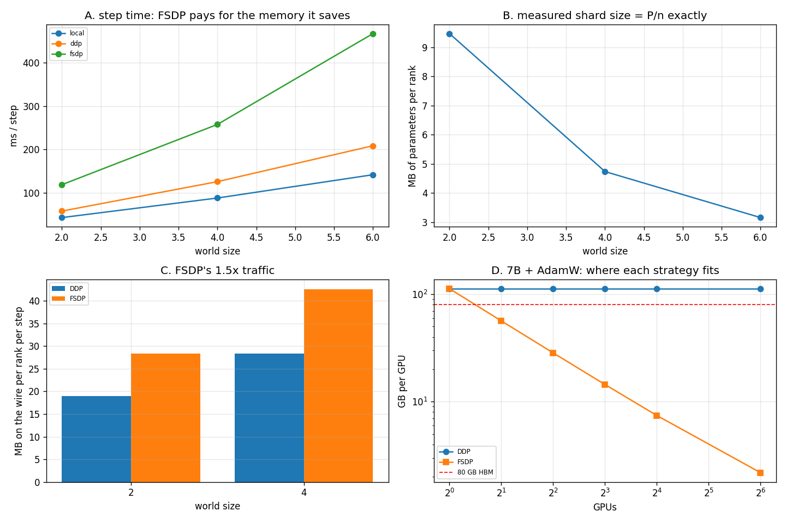

# FSDP Scaling

---

> [FSDP](/shared/glossary/#fsdp) shards the model instead of replicating it, and this project measures both halves of that bargain on the same machine. The memory side is exact: every rank physically holds **1/n** of every parameter (9.46 MB at n=2, 4.73 MB at n=4, from a 18.93 MB model) and **1/n of the [Adam](/shared/glossary/#adam) state** (37.86 → 18.93 → 9.47 MB), while [DDP](/shared/glossary/#ddp) holds all of it on every rank. The bill is exact too: **1.50x** the bytes on the wire, measured, and **1.70x–2.32x** the step time. One flag (`reshard_after_forward=False`) halves the [all-gathers](/shared/glossary/#allgather) — 18 per step down to 9 — and buys **1.46x**, by keeping the memory FSDP just finished saving.

---

## Key Insight

FSDP does not make training faster. It makes training *possible*, and then charges you for it. The arithmetic in section E is the whole argument: a 7B model with [AdamW](/shared/glossary/#adamw) needs **112 GB per GPU** under DDP and therefore does not fit on an 80 GB H100 **at any world size**; the same model under FSDP fits on **2 GPUs** at 56.4 GB each. The correct question is never "is FSDP faster" but "does the thing fit, and what does fitting cost".

## Why This Matters

[Project 29](../29-multi-gpu-ddp/README.md) assumed the model fits on one device. Every model people actually care about does not. FSDP (and [ZeRO](/shared/glossary/#zero), its ancestor) is how that constraint is dissolved, and the cost is paid in exactly the currency [project 28](../28-nccl-tests/README.md) measured: collectives.

---

**This is project 30.**

### The words first

- **[Sharding](/shared/glossary/#sharding)** — cutting one tensor into n pieces and giving each rank one piece. The word is from databases: a "shard" is a fragment of something that used to be whole.
- **[FSDP](/shared/glossary/#fsdp) (Fully Sharded Data Parallel)** — data parallelism where parameters, gradients *and* optimiser state are sharded. "Fully" distinguishes it from sharding only the optimiser state ([ZeRO](/shared/glossary/#zero) stage 1) or only the state and gradients (stage 2); FSDP is stage 3.
- **`fully_shard`** — the FSDP2 API. It replaces each parameter with a [DTensor](/shared/glossary/#dtensor) (a tensor that knows it is one shard of a bigger logical tensor) laid out over a [device mesh](/shared/glossary/#device-mesh).
- **All-gather / reduce-scatter** — see [project 28](../28-nccl-tests/README.md). FSDP is built from these two and never uses an all-reduce.
- **`reshard_after_forward`** — after the forward pass has used a gathered layer, throw the gathered copy away (True) or keep it for the backward pass (False). Memory versus one all-gather.
- **Transient memory** — the temporary, *unsharded* copy of one layer that has to exist while that layer is computing. Sharding cannot remove it: you cannot multiply by a matrix you only own a quarter of.

### "If every rank has to all-gather the full layer before using it, hasn't the memory saving been undone?"

No, and this is the point people miss. The gathered copy exists **for one layer at a time and is freed immediately**. A model with 32 blocks under FSDP holds 1/n of *all 32 blocks* plus one whole block; DDP holds all 32 blocks whole. Section E prices this: at 7B parameters the permanent shard at n=8 is 14 GB and the transient block is 0.44 GB. **The saving is the ratio of "one layer" to "the whole model"** — which is why FSDP works well for deep stacks of identical blocks and poorly for a model that is one giant layer.

### "DDP does one all-reduce. FSDP does two all-gathers and a reduce-scatter. Why is that only 1.5x and not 3x?"

Because an all-reduce is *itself* built from two halves. In [bus-bandwidth](/shared/glossary/#busbw) terms (project 28, section E) an all-reduce moves 2(n−1)/n bytes per rank, while an all-gather or a reduce-scatter moves (n−1)/n. So DDP's one all-reduce = 2 units, FSDP's three collectives = 3 units, and 3/2 = **1.50x** — which is precisely what section B measures rather than assumes.

### "Why measure the bytes at all if the formula gives 1.5x?"

Because the formula only holds if FSDP issues the collectives you think it does. Section B counts them: **18 all-gathers and 9 reduce-scatters per step** for 9 sharded groups, i.e. exactly two gathers (forward and backward) and one scatter each. Had FSDP prefetched differently, or had our wrapping produced one group instead of nine, the counter would have said so. The formula is a prediction; the counter is the test.

---

## Running it

```bash
python run.py       # ~46 s
```

Needs `torch` only. Hardware: **Intel i7-8700K**, 2 threads per rank, gloo over loopback.

`CUDA_VISIBLE_DEVICES=""` is set at the top of the script: FSDP2 otherwise notices the GTX 1070 Ti, builds an [NCCL](/shared/glossary/#nccl) process group and dies on the first kernel launch. Sharding is device-agnostic, so the CPU [device mesh](/shared/glossary/#device-mesh) (`init_device_mesh("cpu", (world,))`) runs the identical code path.

The model is 8 × (768 → 768) linear layers plus a head: **4.73 M parameters = 18.93 MB**.

> **About the numbers.** Everything below comes from the committed
> [`outputs/findings.json`](outputs/findings.json),
> [`outputs/findings.csv`](outputs/findings.csv) and
> [`outputs/run.log`](outputs/run.log).



---

## A. Sharding, verified rather than assumed

| world | parameters per rank, FSDP | parameters per rank, DDP | Adam state, FSDP | Adam state, DDP |
|---:|---:|---:|---:|---:|
| 2 | **9.46 MB** (1/2.0) | 18.93 MB | **18.93 MB** | 37.86 MB |
| 4 | **4.73 MB** (1/4.0) | 18.93 MB | **9.47 MB** | 37.86 MB |

Read as it is measured: the local shard is `p.to_local()`, the tensor actually allocated on this rank, not a logical view. Adam keeps two moments per element, so its state is 2x the parameters — and under FSDP it is 2x the *shard*, which is where most of the saving lives in practice (an fp32 Adam state is 8 bytes per parameter against 2 for a bf16 weight).

One trap worth naming, because it silently produces a wrong answer: **a DTensor reports the global `numel()`, not the local one.** Summing `v.numel()` over the optimiser state gives 37.86 MB for FSDP too — identical to DDP, and completely wrong. The measurement only becomes correct after asking each tensor for its local shard.

---

## B. The bill, counted message by message

Per step, per rank:

| | messages | user bytes | bytes on the wire\* |
|---|---|---:|---:|
| **DDP** | 2 all-reduce | 18.93 MB | 28.40 MB (world 4) |
| **FSDP** | **18 all-gather + 9 reduce-scatter** | 56.79 MB | 42.59 MB (world 4) |
| ratio | | 3.00x | **1.50x** |

\* wire bytes apply the bus-bandwidth factors from [project 28](../28-nccl-tests/README.md): 2(n−1)/n for all-reduce, (n−1)/n for the other two.

The 18/9 split is the mechanism made visible. Nine parameter groups (8 hidden layers + the head), each of which is:

1. **all-gathered in the forward pass** — you cannot compute with a quarter of a weight matrix,
2. **all-gathered again in the backward pass** — because the forward's copy was thrown away,
3. **reduce-scattered** at the end — each rank keeps the summed gradient for the slice it owns, and no other.

Notice what is *not* there: **no all-reduce anywhere.** FSDP never needs every rank to have the whole gradient, because no rank owns the whole parameter. The optimiser step is local, on the shard.

(DDP shows 2 messages rather than 1 because its first bucket has a smaller default cap of 1 MB; the remaining 17.9 MB fits in the second.)

---

## C. What the memory costs in time

| world | plain (no parallelism) | DDP | FSDP | FSDP / DDP | params per rank |
|---:|---:|---:|---:|---:|---:|
| 2 | 42.82 ms | 69.32 ms | 118.03 ms | **1.70x** | 9.46 MB |
| 4 | 91.22 ms | 125.45 ms | 266.78 ms | **2.13x** | 4.73 MB |
| 6 | 170.83 ms | 205.16 ms | 475.12 ms | **2.32x** | 3.16 MB |

FSDP is slower than DDP at every world size, and the gap widens. 1.50x of that is the extra bytes; the rest is the extra *messages* — 27 collectives per step against 2, each paying the ~490 µs fixed cost measured in [project 28](../28-nccl-tests/README.md).

This ordering is not universal — on a fast fabric with a model that DDP cannot hold, FSDP's step time is the only step time there is — but the *shape* is: **FSDP trades bandwidth and message count for capacity.** Anyone reaching for FSDP on a model that fits comfortably under DDP is paying this bill for nothing.

(The plain column climbing from 42.82 to 170.83 ms is contention on one shared CPU, not a property of the algorithms. All the ratios above are computed within a world size for that reason.)

---

## D. `reshard_after_forward`: the flag that undoes half the sharding

World = 4:

| setting | all-gathers/step | all-gather bytes | step time |
|---|---:|---:|---:|
| `True` (default) | 18 | 37.87 MB | 273.34 ms |
| `False` | **9** | **18.94 MB** | **187.34 ms** |

**Keeping the gathered parameters between forward and backward is worth 1.46x** and removes exactly the second all-gather — 18.94 MB per step of traffic that existed only to re-create something the process had already had and deliberately deleted.

The cost is the thing FSDP was for. With `False`, every gathered layer stays resident from its forward until its backward, so peak memory approaches the unsharded model. The right way to read the flag is as a dial between DDP (`False` everywhere: fast, fat) and full FSDP (`True` everywhere: slow, thin) — and real recipes set it per layer, keeping the small early blocks gathered and resharding the big ones.

---

## E. The arithmetic that decides it, for a model nobody here can hold

7B parameters, AdamW, standard mixed precision: bf16 parameters (2 B) + bf16 gradients (2 B) + fp32 master weights (4 B) + fp32 Adam m and v (4 B each) = **16 bytes per parameter = 112 GB**. FSDP additionally needs one unsharded block in bf16; at 32 blocks that is 0.44 GB.

| GPUs | DDP per GPU | fits 80 GB? | FSDP per GPU | fits 80 GB? |
|---:|---:|---|---:|---|
| 1 | 112.0 GB | **no** | 112.4 GB | **no** |
| 2 | 112.0 GB | **no** | **56.4 GB** | yes |
| 4 | 112.0 GB | **no** | 28.4 GB | yes |
| 8 | 112.0 GB | **no** | 14.4 GB | yes |
| 16 | 112.0 GB | **no** | 7.4 GB | yes |
| 64 | 112.0 GB | **no** | 2.2 GB | yes |

**The DDP column is a constant, and that is the entire point.** Adding GPUs to a replicated job adds throughput and not one byte of capacity: a model that does not fit on one H100 does not fit on a thousand of them. The FSDP column falls as 1/n and crosses the 80 GB line at n=2.

Two consequences that are easy to miss:

- **Most of the 112 GB is not the model.** The weights are 14 GB; the optimiser and master copies are 84 GB. This is why optimiser-state sharding ([ZeRO](/shared/glossary/#zero) stage 1) captures most of the benefit for the least communication, and why 8-bit optimisers exist.
- **The transient 0.44 GB does not shrink**, so the curve flattens: past a few dozen ranks you are paying full communication cost to save memory you no longer need. FSDP's sharding is usually capped at one node's worth of ranks for exactly this reason, with plain data parallelism above it ("hybrid sharding").

---

## What to take away

1. **The shard is real and exact**: 1/n of the parameters and 1/n of the Adam state, measured on the local tensors.
2. **A DTensor lies about `numel()`** — it reports the global size. Ask for `to_local()` or your memory accounting will silently report DDP's numbers for FSDP.
3. **FSDP's traffic is 1.50x DDP's**, predicted from the bus-bandwidth factors and then confirmed by counting: 18 all-gathers + 9 reduce-scatters, no all-reduce at all.
4. **Time cost here: 1.70x–2.32x**, and it grows with world size because message *count* grows, not just bytes.
5. **`reshard_after_forward=False` is worth 1.46x** and gives back the memory — the flag is a dial between DDP and FSDP, not a free optimisation.
6. **DDP's per-GPU memory is constant in the world size.** 112 GB for a 7B model, forever. That is the wall FSDP exists to remove.

---

## What to try next

- Set `reshard_after_forward=True` only for the largest layers and `False` for the rest; the mixed setting is what production recipes use.
- Shard only the optimiser state (ZeRO-1) by hand — each rank steps 1/n of the parameters and broadcasts the result — and compare the traffic against FSDP's 3 units.
- Add [activation checkpointing](/shared/glossary/#gradient-checkpointing) and watch the transient term in section E change while the sharded term does not.

Next: [project 31 — Multi-node setup](../31-multi-node-setup/README.md), where the links stop being equal to one another.
