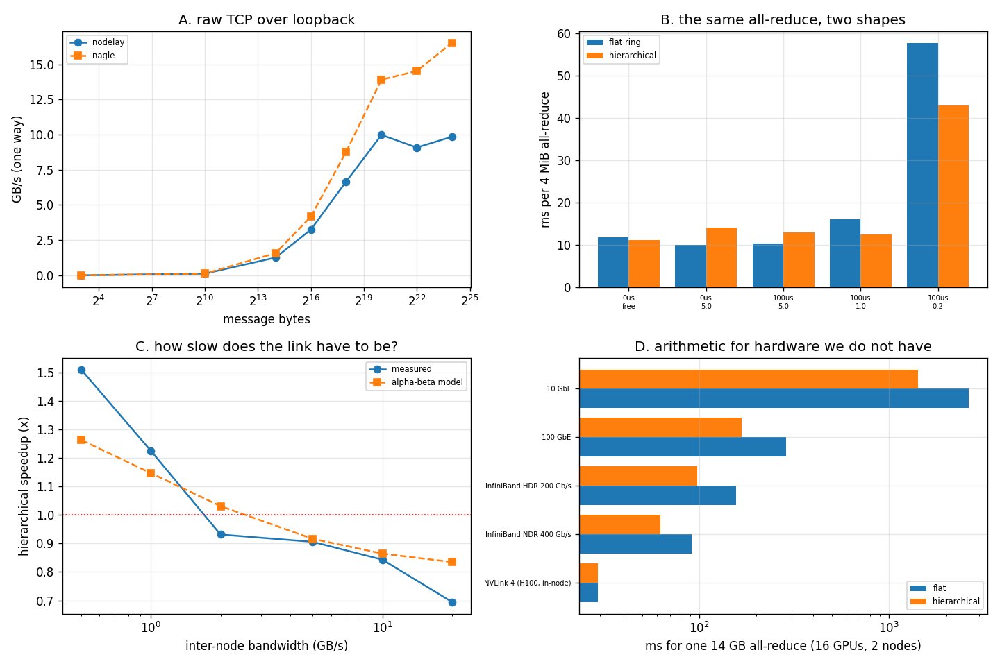

# Multi-Node Setup

---

> There is one machine here, so "two nodes" means two groups of ranks with a deliberately slow link between them. What survives the missing hardware is the lesson that matters: **the same all-reduce, same FLOPs, same result, is 1.51x faster when the algorithm knows where the node boundary is** — and **0.71x slower when it does not need to know**. Underneath it, a raw [TCP](/shared/glossary/#tcp) measurement finds the single most expensive default in networking: two small writes per round trip cost **35.5 µs** with `TCP_NODELAY` and **41,334 µs** without it. That is **1,166x**, and it is one socket option.

---

## Key Insight

A cluster is not a bag of GPUs; it is a hierarchy of links whose speeds differ by 10x at every level. An algorithm that treats all links as equal spends its time on the slowest one. The [hierarchical all-reduce](/shared/glossary/#hierarchical-all-reduce) in section C is the entire idea of "topology-aware collectives" in twenty lines: **do the cheap traffic inside the node, and let only 1/g of the data cross the boundary.** Section E prices it on real fabrics — worth nothing (1.00x) inside an [NVLink](/shared/glossary/#nvlink) node, worth **1.47x** across [InfiniBand](/shared/glossary/#infiniband-ib) NDR, worth **1.86x** across 10 GbE.

## Why This Matters

[Projects 28–30](../28-nccl-tests/README.md) all assumed one flat pool of equal peers. Every real cluster above 8 GPUs violates that assumption, and the violation is not small: [the bandwidth table in the guide](../../README.md#phase-6-interconnects-multi-gpu-and-multi-node) puts in-node NVLink at 900 GB/s and cross-node InfiniBand at 50 GB/s — a factor of 18. This project is where that factor stops being trivia and starts changing which algorithm you should run.

---

**This is project 31.**

### The words first

- **Node** — one physical machine. GPUs inside a node talk over [NVLink](/shared/glossary/#nvlink) or [PCIe](/shared/glossary/#pcie); GPUs in different nodes talk over a network card.
- **[Rendezvous](/shared/glossary/#rendezvous)** — how processes on different machines find each other before any training starts. One agreed address and port (`MASTER_ADDR`, `MASTER_PORT`); everyone connects there, announces its [rank](/shared/glossary/#rank), and receives the list of peers. The French word means "meeting point", which is exactly its job.
- **[torchrun](/shared/glossary/#torchrun)** — the launcher that starts one process per GPU and fills in the rank/world environment variables for you.
- **Ping-pong** — send a message, wait for the reply, measure the round trip and halve it. The only way to measure one-way [latency](/shared/glossary/#latency) without two synchronised clocks.
- **[Nagle's algorithm](/shared/glossary/#nagles-algorithm)** — a 1984 TCP rule that holds back a small write until the previous one is acknowledged, to avoid flooding a network with tiny packets. `TCP_NODELAY` turns it off. See section A for what it costs.
- **Flat ring** — one [ring](/shared/glossary/#ring-all-reduce) over all ranks, ignoring which node each is on.
- **Hierarchical** — reduce-scatter inside each node → all-reduce between nodes on 1/g of the data → all-gather inside each node.
- **g** — ranks per node (2 here; 8 on a DGX).

### "There is one machine. In what sense is any of this a two-node measurement?"

In one specific and stated sense: **the link is emulated, the algorithm is not.** Before any message that would cross between the two rank groups, the sender sleeps for `latency + bytes/bandwidth`. Everything else is real — real processes, real sockets, real [gloo](/shared/glossary/#gloo) sends, real reductions, a real wall clock, and a correctness check against gloo's own all-reduce that passes at **9.5e-07**.

What that buys is the *shape* of the answer: which algorithm wins, at what link speed the winner changes, and whether the [alpha-beta](/shared/glossary/#alpha-beta-model) model predicts the crossover (section D says it does, within the noise). What it cannot give you is an absolute number for your cluster. Section E is where the real link speeds come back in, as arithmetic.

### "If the hierarchical version does more steps, how can it be faster?"

It does more *total* steps and fewer *expensive* ones. Section C counts both: the flat ring crosses the boundary **12 times carrying 12.58 MB**, the hierarchical version **4 times carrying 8.39 MB**. That is only 1.5x fewer bytes — but the flat ring's crossings are spread over six lockstep rounds, so each one sits on the critical path one after another, while the hierarchical version's crossings all happen in a single stage. When the boundary is cheap this extra structure is pure overhead (0.71x); when it is expensive, it is 1.51x.

### "Why measure raw TCP in section A when gloo already gives me an all-reduce time?"

Because gloo's number is the sum of everything, and when it is bad you need to know whether to blame your algorithm, your library, or the socket underneath. Section A is the floor: **11.9 µs one way for 8 bytes, ~10 GB/s streaming**. Any collective slower than that per hop has overhead worth hunting. And the Nagle result is the case in point — a 1,166x defect that lives entirely below the level any ML profiler can see.

---

## Running it

```bash
python run.py       # ~28 s
```

Needs `torch` only. Hardware: **Intel i7-8700K** (6 cores / 12 threads); 4 ranks arranged as 2 nodes × 2 ranks; message size 4 MiB.

> **About the numbers.** Everything below comes from the committed
> [`outputs/findings.json`](outputs/findings.json),
> [`outputs/findings.csv`](outputs/findings.csv) and
> [`outputs/run.log`](outputs/run.log).



---

## A. The floor: raw TCP, no PyTorch involved

Two processes, one socket, `sendall` / `recv`:

| measurement | value |
|---|---:|
| 8-byte one-way latency | **11.9 µs** |
| peak streaming bandwidth (loopback) | **9.98 GB/s** |
| 16.8 MB message | 9.85 GB/s |
| 8-byte ping-pong, Nagle vs `TCP_NODELAY` | 0.75x (no penalty) |
| **two 4-byte writes per round trip, `TCP_NODELAY`** | **35.5 µs** |
| **two 4-byte writes per round trip, Nagle (default)** | **41,334 µs** |
| **penalty** | **1,166x** |

The two Nagle rows are the same socket, the same bytes, and one option flipped.

**Why the ping-pong shows nothing and the two-write test shows 1,166x.** Nagle's rule is: *do not send a small packet while an earlier small packet is still unacknowledged.* A ping-pong never has two small writes outstanding — it waits for the reply before writing again — so the rule never fires. Split the same 8 bytes into two `sendall` calls and it fires immediately: the second write is held until the first is acknowledged, and the receiver's own delayed-acknowledgement timer (which waits ~40 ms hoping to piggyback the ACK on returning data) supplies exactly the delay measured. The two defaults are individually reasonable and pathological together — a famous interaction, reproduced here in 40 lines.

**The transferable lesson is about benchmarking, not about TCP**: a benchmark can only measure an effect it lets happen. The first version of this section reported "Nagle costs nothing" and was wrong, not because the measurement was inaccurate but because the *pattern* could not expose the effect. Any time a known problem measures as zero, check that your test can produce it at all.

(This is also why every RPC and collective library sets `TCP_NODELAY`. gloo does. If you write your own parameter server one day, this is the line you will forget.)

---

## B. The rendezvous

Four ranks, mapped as node 0 = {0,1} and node 1 = {2,3}; baseline 4 MiB all-reduce with no link penalty: **5.13 ms**.

For two real machines, the entire difference is these two commands:

```bash
# on node 0 (10.0.0.1)
torchrun --nnodes=2 --nproc_per_node=2 --node_rank=0 \
         --master_addr=10.0.0.1 --master_port=29500 train.py

# on node 1
torchrun --nnodes=2 --nproc_per_node=2 --node_rank=1 \
         --master_addr=10.0.0.1 --master_port=29500 train.py
```

Three things break this on a first attempt, in order of frequency:

1. **`--master_addr` must be reachable from the other node** and the port must be open. Rank 0's own view of its address is irrelevant; every other node has to dial it.
2. **Interface selection.** A machine with several NICs (a fast one and a management one) will happily pick the wrong one. `GLOO_SOCKET_IFNAME` / `NCCL_SOCKET_IFNAME` name the interface explicitly. Choosing the 1 GbE management port instead of the 100 GbE data port is a 100x error that produces no error message.
3. **All nodes must agree on `--nnodes` and world size**, or the rendezvous blocks forever with no output — the failure mode is a hang, not a crash.

---

## C. The same all-reduce, two shapes

4 MiB, 4 ranks, 2 per node. Correctness checked against gloo's all-reduce every time: **max error 9.5e-07**.

| inter-node link | flat ring | hierarchical | speedup | crossings (flat / hier) | crossed bytes |
|---|---:|---:|---:|---:|---:|
| free (no boundary) | 11.75 ms | 11.10 ms | 1.06x | 0 / 0 | 0 / 0 |
| 5 GB/s, 0 µs | **9.98 ms** | 14.08 ms | **0.71x** | 12 / 4 | 12.58 / 8.39 MB |
| 5 GB/s, 100 µs | **10.29 ms** | 12.89 ms | **0.80x** | 12 / 4 | 12.58 / 8.39 MB |
| 1 GB/s, 100 µs | 16.08 ms | **12.47 ms** | **1.29x** | 12 / 4 | 12.58 / 8.39 MB |
| 0.2 GB/s, 100 µs | 57.70 ms | **42.97 ms** | **1.34x** | 12 / 4 | 12.58 / 8.39 MB |

**The winner changes.** At 5 GB/s the flat ring wins by 1.41x (hierarchical is 0.71x); at 0.2 GB/s the hierarchical version wins by 1.34x. Nothing about the two algorithms changed between those rows — only the link did.

The mechanism is in the last two columns and is worth stating plainly: **the flat ring crosses the boundary 12 times, the hierarchical version 4.** The flat ring does not know a boundary exists, so 2 of its 4 ring links happen to be the expensive ones and every one of its 6 lockstep rounds pays for them. The hierarchical version puts all its crossing into one stage, on 1/g = 1/2 of the data.

And the top row is the control that makes this a real result rather than a tautology: **with no boundary at all, the extra structure costs, it does not pay.** A topology-aware algorithm run on a topology that does not need it is just a slower algorithm.

---

## D. Where the crossover is, and whether the model saw it coming

Inter-node latency fixed at 50 µs, bandwidth swept:

| inter-node bandwidth | measured speedup | alpha-beta model |
|---:|---:|---:|
| 20 GB/s | 0.69x | 0.83x |
| 10 GB/s | 0.84x | 0.86x |
| 5 GB/s | 0.91x | 0.92x |
| 2 GB/s | 0.93x | 1.03x |
| **1 GB/s** | **1.23x** | **1.15x** |
| **0.5 GB/s** | **1.51x** | **1.26x** |

The model is `T = steps × (α + bytes/B)` with each stage charged at its own link's α and B — no fitting, no free parameters, written before the measurement. It gets the **crossover in the right place** (between 2 and 1 GB/s in both columns) and tracks the middle of the range to within 0.02–0.10x. It underestimates the win at 0.5 GB/s (1.26x predicted, 1.51x measured), because the model assumes a rank's sends are perfectly pipelined and in reality the flat ring's crossings serialise worse than that.

**What this is for**: you can compute this table for a cluster you have not bought yet. Given your model's gradient size, your node size and your network's advertised bandwidth, the alpha-beta model tells you whether topology-aware collectives are worth enabling before you spend a day enabling them.

---

## E. The arithmetic for real fabrics

A 7B model's gradients in bf16 = **14 GB per all-reduce**, on 16 GPUs arranged as 2 nodes × 8:

| link between the nodes | bandwidth | flat ring | hierarchical | speedup |
|---|---:|---:|---:|---:|
| NVLink 4 (H100, in-node) | 900 GB/s | 29.2 ms | 29.2 ms | **1.00x** |
| InfiniBand NDR 400 Gb/s | 50 GB/s | 91.2 ms | 62.2 ms | **1.47x** |
| InfiniBand HDR 200 Gb/s | 25 GB/s | 156.8 ms | 97.2 ms | **1.61x** |
| 100 GbE | 12.5 GB/s | 288.0 ms | 167.2 ms | **1.72x** |
| 10 GbE | 1.25 GB/s | 2,650.5 ms | 1,427.2 ms | **1.86x** |

Read the first and last rows together. **On a single NVLink domain the hierarchical algorithm is worth exactly nothing** — every link is the same, so there is no boundary to respect. On 10 GbE it is worth 1.86x, and the all-reduce itself has grown to **2.65 seconds**, which for most models is longer than the step that produced the gradients. That is the whole economics of AI networking in one column: past a certain link speed you are not training, you are waiting.

It also explains the [NVL72](/shared/glossary/#nvlink)-style design direction. If the fix for a slow boundary is "have fewer boundaries", the logical end point is a rack that presents 72 GPUs as one NVLink domain — at which point the top row applies to the whole rack and the hierarchical algorithm becomes unnecessary again.

---

## What to take away

1. **`TCP_NODELAY` is worth 1,166x** on the access pattern that triggers Nagle, and 1.00x on the one that does not. Set it, and design benchmarks that can expose the bug you are looking for.
2. **Topology-aware collectives are not universally better**: 0.71x with a fast boundary, 1.51x with a slow one, measured on the same code.
3. **What matters is crossings on the critical path**, not just bytes: 1.5x fewer bytes produced up to 1.51x less time because the crossings were also collapsed into one stage.
4. **The alpha-beta model predicts the crossover** (between 2 and 1 GB/s) with no fitted parameters, so you can do this arithmetic for a cluster you do not own.
5. **A misconfigured interface is a silent 100x.** `NCCL_SOCKET_IFNAME` deserves to be in your launch script, not in your memory.
6. **On 10 GbE, one 7B all-reduce is 2.65 seconds.** Network choice is not a detail of large-scale training; it is the design.

---

## What to try next

- Set `g = 4` and world 8 (2 nodes × 4) and check that the crossing count drops to 1/4 of the data as the formula says.
- Add a third node and confirm the inter-node stage still works — the code snapshots each rank's contribution before exchanging precisely so that 3+ nodes do not double-count.
- Re-run section D with the α and B measured in [project 28](../28-nccl-tests/README.md) section C substituted for the intra-node link, and see whether the model's accuracy improves.

Next: [project 32 — Topology study](../32-topology-study/README.md), which asks where those boundaries are in the first place.
