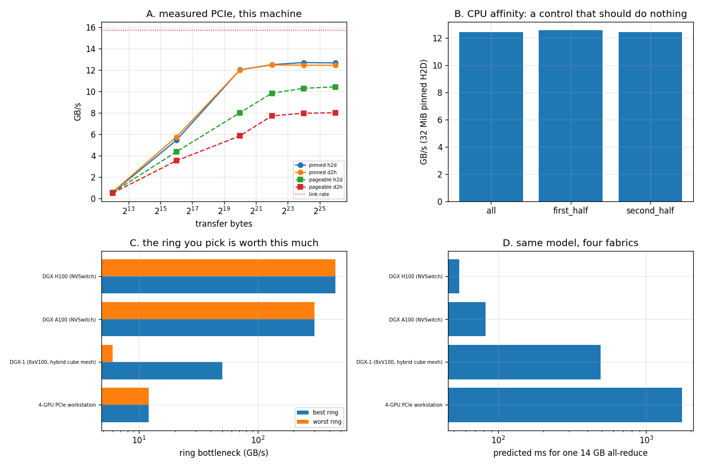

# Topology Study

---

> `nvidia-smi topo -m` on this machine prints one cell, because there is one GPU. So this project does the two things that still have real answers: it **measures the link that does exist**, and it **turns published topology matrices into predictions** with a ring-finder. The measurement catches the operating system lying — sysfs reports the [PCIe](/shared/glossary/#pcie) link as **2.5 GT/s (Gen 1, 4.0 GB/s)** while the same link is measured moving **12.67 GB/s**, which is **3.2x its stated capability**. The prediction finds that on a DGX-1 the **best ring is 8.33x the worst**, and that the same 14 GB [all-reduce](/shared/glossary/#allreduce) takes **1,750 ms** on a PCIe workstation and **54 ms** on a DGX H100.

---

## Key Insight

A topology matrix is a table of link *types*; performance needs link *bandwidths* and then one number: **the slowest hop on the ring your library will build.** A [ring](/shared/glossary/#ring-all-reduce) runs in lockstep, so every rank waits for the worst link in it — which means a single badly-connected pair sets the speed of all eight GPUs. That is why [NCCL](/shared/glossary/#nccl) spends startup time detecting topology, and why "the two GPUs that share a PCIe switch" is a sentence with a price attached.

## Why This Matters

[Project 31](../31-multi-node-setup/README.md) showed what a slow link does to an algorithm. This one is about finding out *where the slow links are* before you are surprised by them — from a `topo -m` matrix you can read in ten seconds on any rented machine.

---

**This is project 32.**

### The words first

- **[Network topology](/shared/glossary/#network-topology)** — who is connected to whom, and how fast. "Topology" is the branch of mathematics about which things are connected to which, ignoring distance; the word is used here in exactly that sense.
- **Root complex / host bridge** — the CPU's own PCIe controller. Traffic between two devices that do not share a switch has to climb up to it and back down.
- **[NUMA](/shared/glossary/#numa) (Non-Uniform Memory Access)** — on a multi-socket machine, each CPU has its own memory, and reaching the *other* CPU's memory is slower. "Non-uniform" is the whole claim: not all of your RAM is equally far away.
- **[Pinned memory](/shared/glossary/#pinned-memory)** — host memory the OS has promised never to move or swap out ("page-locked"), which is what lets the GPU's DMA engine read it directly. Ordinary "pageable" memory must be copied into a staging buffer first.
- **GT/s** — giga-transfers per second, the raw signalling rate of a PCIe lane. Gen 3 is 8 GT/s per lane, and after the 128b/130b line code that is ~0.985 GB/s of payload per lane, so ×16 lanes ≈ 15.76 GB/s one way.
- **Hamiltonian cycle** — a path that visits every node exactly once and returns to the start. A collective ring *is* a Hamiltonian cycle over the GPUs; the ring-finder in `topo.py` searches all of them (2,520 for 8 GPUs) and keeps the one whose worst edge is best.

### "There is one GPU here. Isn't a topology study meaningless?"

The *measurement* half is not: a single GPU still has a link to the host, and sections B and C measure it, catch a lie in the operating system's own report of it, and run a control that proves the method can detect a null result. The *prediction* half deliberately does not need hardware — it takes topology matrices of the same form `nvidia-smi topo -m` prints, applies bandwidths per link type, and computes the ring bottleneck. That is arithmetic on a graph, and it is correct whether or not the machine is in the room. Section D says which systems those matrices describe; none of the numbers there is presented as measured.

### "Why re-read the link speed while copying? The file already said what the link is."

Because it said something false. A PCIe link drops to its slowest gear when idle to save power, so `current_link_speed` on a quiet machine reports a *power state*, not a *capability* — like reading a parked car's rev counter and concluding the engine is slow. Section B re-reads the same file from a background thread while a copy is running and watches it change from **2.5 GT/s to 8.0 GT/s**. Without that step, this project would have computed every efficiency figure against a ceiling 3.9x too low and reported the GPU exceeding its own link by 3.2x.

---

## Running it

```bash
python run.py       # ~3.4 s
```

Needs `torch` and `nvidia-smi`. Hardware: **GTX 1070 Ti** on **PCIe 3.0 ×16**, **Intel i7-8700K**, one NUMA node.

> **About the numbers.** Everything below comes from the committed
> [`outputs/findings.json`](outputs/findings.json),
> [`outputs/findings.csv`](outputs/findings.csv),
> [`outputs/nvidia_smi_topo.txt`](outputs/nvidia_smi_topo.txt) and
> [`outputs/run.log`](outputs/run.log).



---

## A. What this machine actually reports

```
        GPU0    CPU Affinity    NUMA Affinity   GPU NUMA ID
GPU0     X      0-11            0               N/A
```

| property | value |
|---|---|
| GPUs | 1 |
| link speed, cold (from sysfs, before anything touches the driver) | **2.5 GT/s PCIe** |
| link speed after `nvidia-smi` ran | 2.5 GT/s PCIe |
| max link speed × width | **8.0 GT/s × 16 = 15.76 GB/s** one way |
| NUMA node reported by sysfs | −1 (unknown) |
| NUMA nodes on the machine | 1 |
| CPUs | 12 |

The matrix has one cell (`X`, meaning "self"), which is the honest state of this machine. The `CPU Affinity 0-11` column is the useful part even here: it tells you which cores are electrically closest to the card, and on a two-socket box that column is the difference between a fast copy and a slow one.

`numa_node = -1` is common on desktop hardware: with only one node there is nothing to distinguish, so the kernel does not bother. Section C uses that as an opportunity rather than a limitation.

---

## B. The link, measured — and the OS caught out

**Link speed cold: 2.5 GT/s. Under load: 8.0 GT/s.** Same file, same link, 0.4 s apart, with a copy running in a background thread during the second read.

64 MiB transfers:

| | bandwidth | % of the 15.76 GB/s link |
|---|---:|---:|
| pinned, host → device | **12.67 GB/s** | **80.4%** |
| pinned, device → host | 12.45 GB/s | 79.0% |
| pageable, host → device | 10.44 GB/s | 66.2% |
| pageable, device → host | 8.01 GB/s | 50.8% |

**Pinned memory is worth 1.21x host→device and 1.55x device→host.** The asymmetry is the mechanism showing: a pageable copy has to pass through a staging buffer that the driver owns, so the data is copied twice, and the direction that has to *wait* for that intermediate copy before the DMA can start is penalised more.

**80.4% of the link rate is a good result** — 70–80% is the normal ceiling for PCIe once protocol overhead, TLP headers and flow control are counted. The number worth carrying away is not 12.67 GB/s, it is the ratio: if your measured host↔device bandwidth is far below 70% of the theoretical link rate, the cause is usually pageable memory, a link that trained down to fewer lanes, or a device sitting behind a slower switch.

And the fixed cost: **a 4 KiB pinned copy takes 7.5 µs**, of which essentially none is transfer (4 KiB at 12.67 GB/s is 0.3 µs). Same lesson as [project 28](../28-nccl-tests/README.md) section C, one level down the hierarchy: small transfers are all overhead, so batch them.

---

## C. A control that is supposed to do nothing, and does

Bind the process to different CPU sets, re-measure a 32 MiB pinned copy:

| affinity | CPUs | bandwidth |
|---|---:|---:|
| all | 12 | 12.45 GB/s |
| first half | 6 | 12.57 GB/s |
| second half | 6 | 12.46 GB/s |
| **spread** | | **1.010x** |

**1.010x is a null result, and it is the correct one**: one socket, one NUMA node, so every core is equally far from the card. Reporting it matters for two reasons.

First, it shows the method works. The same three lines on a two-socket machine — where the GPU hangs off one CPU's root complex and half the cores are across the inter-socket link — routinely produce 1.3–2x, and that is the standard explanation for "the same job is slower on some nodes of the cluster". A measurement that cannot produce a null result where a null is correct cannot be trusted where the answer is unknown.

Second, it bounds the noise. Everything else in this project that claims a difference has to beat 1.010x to be a difference at all.

---

## D. Reading a topology as a graph

`topo.py` assigns a bandwidth to each link type, then brute-forces every ring and reports the one with the best worst-hop. 14 GB is one 7B model's gradients in bf16; the all-reduce time is `2(n−1)/n × bytes ÷ bottleneck`.

| system | GPUs | best ring | worst ring | ratio | predicted 14 GB all-reduce |
|---|---:|---:|---:|---:|---:|
| 4-GPU PCIe workstation | 4 | 12.0 GB/s | 12.0 GB/s | 1.00x | **1,750 ms** |
| DGX-1 (8×V100, hybrid cube mesh) | 8 | 50.0 GB/s | 6.0 GB/s | **8.33x** | 490 ms |
| DGX A100 (NVSwitch) | 8 | 300.0 GB/s | 300.0 GB/s | 1.00x | 81.7 ms |
| DGX H100 (NVSwitch) | 8 | 450.0 GB/s | 450.0 GB/s | 1.00x | **54.4 ms** |

Three readings.

**The DGX-1 row is the reason NCCL detects topology.** Its GPUs are wired in a "hybrid cube mesh": most pairs have NVLink, some pairs have none and must fall back to PCIe and the CPU-to-CPU link. Order the ring badly and you include one of those fallback hops, and the whole 8-GPU collective runs at 6 GB/s instead of 50 — **8.33x slower, from nothing but the order the ranks were arranged in.** A library that assigned ranks alphabetically would hit this regularly.

**The two NVSwitch rows have a ratio of exactly 1.00x**, and that is the product being sold. When every pair is connected at full bandwidth, ring order stops mattering, topology detection stops mattering, and the performance stops depending on luck. NVSwitch is not only faster than a mesh; it is *uniform*, and uniformity is what removes an entire class of mysterious 8x regressions.

**The PCIe workstation is 32x slower than the DGX H100** on the same work (1,750 ms vs 54.4 ms). If you are choosing between four consumer cards in one box and renting time on an 8-GPU node, this row is the argument — for data-parallel training of a large model, the interconnect is the purchase.

---

## E. The legend, decoded

What each code in `nvidia-smi topo -m` means, and what to do about it:

| code | meaning | what it implies |
|---|---|---|
| `X` | self | — |
| `NV#` | # NVLink lanes between the pair | the fast path; put the heaviest traffic (tensor parallelism) here |
| `PIX` | same PCIe switch | peer-to-peer DMA works, the host is not involved |
| `PXB` | multiple PCIe switches, still below the host bridge | good; a little further |
| `PHB` | up through the host bridge (the CPU's PCIe root) | traffic reaches the CPU; expect PCIe speeds |
| `NODE` | across PCIe host bridges within one NUMA node | slower again |
| `SYS` | across the CPU–CPU link (UPI/QPI) or between NUMA nodes | the worst case; avoid putting a collective across it |

The practical procedure on any machine you rent, in three steps: run `nvidia-smi topo -m`; look for the *worst* code appearing anywhere among the GPUs you intend to use; and if it is `SYS` or `PHB`, expect your all-reduce to run at that link's speed and not at NVLink's — then either pick a different subset of GPUs, or use the hierarchical shape from [project 31](../31-multi-node-setup/README.md) with the slow pair treated as the boundary.

The bandwidths this project assumes per code are listed in [`outputs/findings.json`](outputs/findings.json) so you can substitute your own; they are reasonable representative values, not measurements from those machines.

---

## What to take away

1. **`current_link_speed` reports a power state, not a capability** — 2.5 GT/s cold, 8.0 GT/s under load. Read it while the link is busy or your ceiling is 3.9x too low.
2. **80.4% of the PCIe link rate is what a good copy looks like.** Below ~70%, suspect pageable memory or a downgraded link.
3. **Pinned memory is worth 1.21x one way and 1.55x the other**, and the asymmetry tells you the staging buffer is real.
4. **A control that correctly measures nothing (1.010x) is what licenses the measurements that claim something.**
5. **On a DGX-1 the ring order alone is worth 8.33x.** On NVSwitch it is worth 1.00x — uniformity is the feature.
6. **Same 14 GB all-reduce: 1,750 ms on a PCIe workstation, 54.4 ms on a DGX H100.** For data-parallel training, you are buying the interconnect.

---

## What to try next

- Feed your own `nvidia-smi topo -m` output through `parse_nvidia_smi_topo` and run the ring-finder on a machine that has more than one GPU.
- Extend the ring-finder to find *several disjoint* rings (NCCL runs multiple rings in parallel to use more links at once) and see how much the DGX-1's number improves.
- Compare the predicted all-reduce time against a real `nccl-tests` busbw on a rented 8-GPU node — the gap between them is what topology detection, protocol choice and chunking are worth.

---

## Phase 6, closed

Five projects, one argument. [Project 28](../28-nccl-tests/README.md) measured the primitive and found that below ~350 KiB the message size is irrelevant and the best algorithm swaps places by 2.6x. [Project 29](../29-multi-gpu-ddp/README.md) put it inside a training step: bucketing worth 1.90x, overlap worth 0.92x when there is nothing to overlap, and only the batch size moving the comm:compute ratio. [Project 30](../30-fsdp-scaling/README.md) traded 1.50x the bytes for 1/n of the memory, and showed a 7B model that fits on no number of GPUs under DDP. [Project 31](../31-multi-node-setup/README.md) made the links unequal and found the winner changes — 0.71x to 1.51x for the same code. And this project asked where the inequality is, and found that on the wrong topology the *order of your ranks* is worth 8.33x.

The through-line: **at every level of the hierarchy — chunk, bucket, node, rack — the cost is the number of times you cross the slowest boundary, and every technique in this phase is a way of crossing it less.**

Next: [Phase 7 — Numeric Formats and Quantization](../../README.md#phase-7-numeric-formats-and-quantization), where the bytes themselves get smaller.
