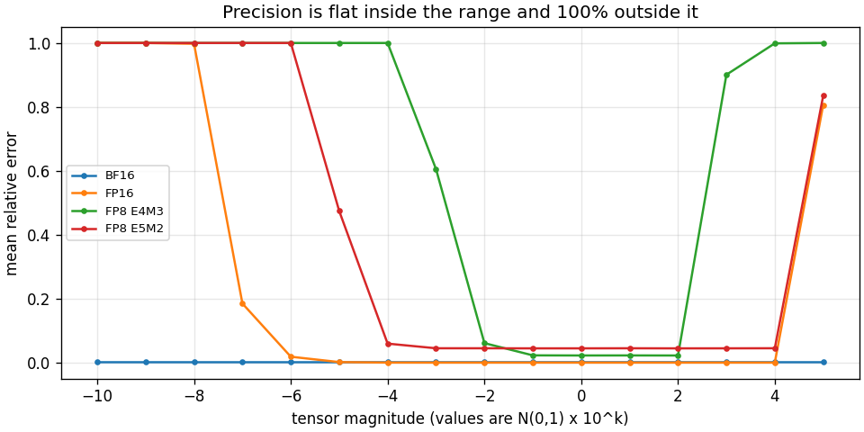
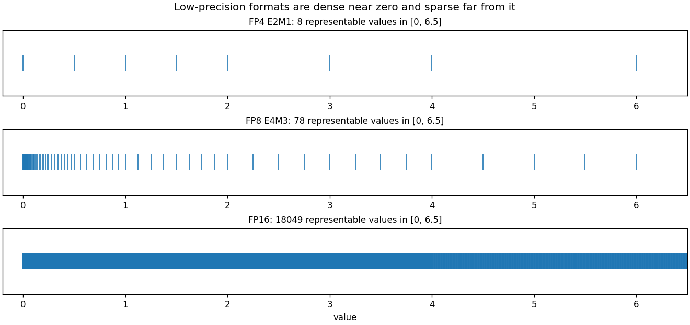
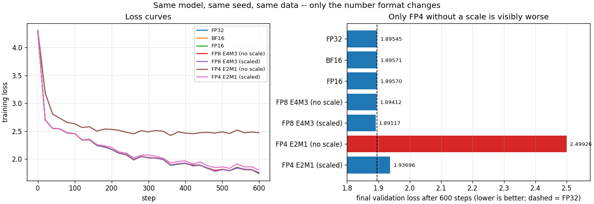

# Format Sweep

---

> Every format in the guide's table — [FP32](/shared/glossary/#float32), [TF32](/shared/glossary/#tf32), [BF16](/shared/glossary/#bfloat16), [FP16](/shared/glossary/#float16), [FP8](/shared/glossary/#fp8) E4M3 and E5M2, [FP4](/shared/glossary/#fp4) E2M1 — rebuilt from its bit layout by one 20-line function, and checked against PyTorch's own casts: **0 mismatches in 150,000 values**, for all four formats PyTorch can cast to. Then the same tiny transformer is trained seven times, once per format. The results are not the ones the marketing slides suggest. On this CPU, [bfloat16](/shared/glossary/#bfloat16) matmul is **466x slower** than fp32, not faster. Seven mantissa bits cost nothing: FP32, BF16, FP16 and FP8 all finish within **0.24%** of each other. And the thing that actually breaks low precision is not precision at all — it is **range**: FP8 E4M3 silently flushes **93.3% of this model's gradients to zero**, and one multiplication by 1024 brings that to 0.27%.

---

## Key Insight

A float format has two independent budgets, and they are spent on different failures. [Mantissa](/shared/glossary/#mantissa) bits buy *precision* — how finely you can distinguish two nearby numbers — and running out of them costs you a few percent of relative error, everywhere, gracefully. [Exponent](/shared/glossary/#exponent) bits buy *range* — how large and how small a number can be at all — and running out of them costs you **100%** of the value, instantly, as an [underflow](/shared/glossary/#underflow) to zero or an [overflow](/shared/glossary/#overflow) to NaN. Section B measures exactly this: over 15 orders of magnitude the relative error of every format is a flat line with cliffs at both ends. That single shape explains why BF16 replaced FP16 as the training default, why FP8 needs a [scaling factor](/shared/glossary/#scaling-factor) bolted to every tensor, and why [loss scaling](/shared/glossary/#loss-scaling) exists.

## Why This Matters

This is the phase's foundation project. Everything after it is about integers — [INT8](/shared/glossary/#int8), [INT4](/shared/glossary/#int4), [NF4](/shared/glossary/#nf4) — and integers are what you reach for once you have understood *why* a float's exponent field is a luxury you can sometimes replace with a single shared [scaling factor](/shared/glossary/#scaling-factor) per group. [Project 34](../34-quantize-a-small-llm/README.md) takes that step for real on a 0.5B language model.

---

**This is project 33.**

### The words first

- **[Mantissa](/shared/glossary/#mantissa)** (also *significand*) — the digits of the number. Latin for "makeshift addition"; it is the leftover fractional part after the exponent has said where the binary point goes. More mantissa bits = finer steps between representable values.
- **[Exponent](/shared/glossary/#exponent)** — the power of two the mantissa is multiplied by. More exponent bits = a wider span between the smallest and the largest number you can write at all.
- **[bfloat16](/shared/glossary/#bfloat16)** — "brain float", from Google Brain, where it was designed. It is [FP32](/shared/glossary/#float32) with 16 mantissa bits deleted, so the exponent field is untouched and the *range* is identical to fp32's.
- **E4M3 / E5M2** — literally "4 exponent bits, 3 mantissa bits" and "5 and 2". Two [FP8](/shared/glossary/#fp8) variants: one leans on precision, the other on range.
- **[Subnormal](/shared/glossary/#subnormal-number) number** — a value below the format's smallest *normal* value, kept representable by giving up the implicit leading 1 and losing significant digits. The last gentle slope before a number underflows to 0.
- **[Underflow](/shared/glossary/#underflow) / [overflow](/shared/glossary/#overflow)** — a value too small (becomes 0) or too large (becomes ∞ or NaN) for the format.
- **[Loss scaling](/shared/glossary/#loss-scaling)** — multiply the loss by a constant before the backward pass so every gradient is multiplied by the same constant, cast, then divided out. It moves the gradients *up* into the part of the format that has resolution. See section F.
- **[Straight-through estimator (STE)](/shared/glossary/#straight-through-estimator)** — rounding has a derivative of exactly zero almost everywhere, so training through it would stop dead. STE pretends the rounding was the identity function during the backward pass. Every [quantization-aware training](/shared/glossary/#quantization-aware-training) recipe uses it.
- **[GFLOP/s](/shared/glossary/#flops)** — billions of floating-point operations per second. A matmul of two n×n matrices is 2·n³ operations.

### "PyTorch already has `torch.bfloat16`. Why write your own caster?"

Two reasons, and neither is that PyTorch's is wrong.

First, **PyTorch does not have all of them.** There is no `torch.float4_e2m1` and no `torch.float32_tf32` you can cast a tensor to. If you want to see what [FP4](/shared/glossary/#fp4) does to a weight — and section E trains a model in it — you have to build the format yourself.

Second, **a cast is a black box and a bit layout is not.** `x.to(torch.bfloat16)` gives you an answer, not an explanation. The version in `formats.py` is parameterised by (exponent bits, mantissa bits, overflow policy), which turns "seven different formats" into "one function with seven settings" — and makes it obvious that the *only* thing separating BF16 from FP16 is where the split between the two fields falls.

The two are then checked against each other, which is the point: section A casts 150,000 values through both and finds **zero** disagreements on BF16, FP16, E4M3 and E5M2. That agreement is what licenses trusting the hand-built E2M1 and TF32, which have no reference to check against.

### "If low precision is what makes modern GPUs fast, why is BF16 slower here?"

Because "the format is smaller" and "the hardware has an instruction for it" are different claims, and only the second one makes anything fast.

A GPU with [tensor cores](/shared/glossary/#tensor-core) has dedicated silicon that multiplies BF16 matrices natively — that is where the headline TFLOP numbers come from. This machine's CPU is an Intel i7-8700K with [AVX2](/shared/glossary/#avx-512) and no 16-bit floating-point instruction of any kind. When PyTorch is asked for a bf16 matmul it has to emulate: unpack each value to fp32, multiply, repack. Section D measures the result — a **470x slowdown** — and it is the single most useful thing in this project to remember, because the same trap appears in [PyTorch Deep Dive project 25](../../../pytorch-deep-dive/projects/25-amp-speedup-study/README.md), where automatic mixed precision on this same CPU is 58x slower than doing nothing.

The practical rule: **before adopting a format, check that the chip has the instruction.** A narrower format on hardware that cannot execute it is strictly worse than a wider one — smaller *and* slower.

### "If the model trains fine in every format, what was the point?"

That is the honest result of section E, and it deserves stating plainly rather than hiding: at this scale, FP32, BF16, FP16 and even FP8 all land within a fraction of a percent of each other. A 400k-parameter transformer on Shakespeare does not have enough going on for a few mantissa bits to matter.

What that *tells* you is where the danger actually lives. It is not in the precision of the numbers you are training; it is at the edges of the range, which is why:

- section B's magnitude sweep is flat in the middle and vertical at both ends,
- section E's two FP4 rows — the same format, with and without a scale — differ enormously, and
- section F finds a format that flushes 94.6% of the gradients to zero while the *forward pass* looked perfectly healthy.

Low precision does not usually degrade a model gently. It works, and works, and then a tensor drifts out of range and something becomes exactly zero.

---

## Running it

```bash
python run.py       # ~6 min
```

Needs `torch` and `matplotlib`; downloads tiny-shakespeare (1.1 MB) on first run. Hardware: **Intel i7-8700K** (6 cores / 12 threads), no usable GPU.

`formats.py` is standalone and worth reading on its own — it is the whole format zoo in about 120 lines.

> **About the numbers.** Everything below comes from the committed
> [`outputs/findings.json`](outputs/findings.json) and
> [`outputs/run.log`](outputs/run.log).

---

## A. The from-scratch caster agrees with the hardware

150,000 values spanning three magnitudes, cast both ways:

| format | values tested | mismatches vs `torch` |
|---|---:|---:|
| BF16 | 150,000 | **0** |
| FP16 | 150,000 | **0** |
| FP8 E4M3 | 150,000 | **0** |
| FP8 E5M2 | 150,000 | **0** |

Including the awkward cases. `torch.round` implements round-half-to-even (banker's rounding) and so does the IEEE default, so the ties agree too.

---

## B. The format zoo, measured rather than quoted

| | bits | 1+E+M | max | min normal | eps (gap at 1.0) | steps in [1, 2) |
|---|---:|---|---:|---:|---:|---:|
| FP32 | 32 | 1+8+23 | 3.4e38 | 1.18e-38 | 1.19e-07 | 8,388,608 |
| TF32 | 19 | 1+8+10 | 3.4e38 | 1.18e-38 | 9.77e-04 | 1,024 |
| BF16 | 16 | 1+8+7 | 3.39e38 | 1.18e-38 | 7.81e-03 | 128 |
| FP16 | 16 | 1+5+10 | 6.55e04 | 6.10e-05 | 9.77e-04 | 1,024 |
| FP8 E4M3 | 8 | 1+4+3 | 448 | 1.56e-02 | 0.125 | 8 |
| FP8 E5M2 | 8 | 1+5+2 | 5.73e04 | 6.10e-05 | 0.25 | 4 |
| FP4 E2M1 | 4 | 1+2+1 | 6 | 1 | 0.5 | 2 |

Two rows to stare at. **BF16 and FP16 are both 16 bits**, and they trade one against the other exactly: BF16 keeps fp32's entire range (1e-38 to 1e38) and has 128 steps between 1 and 2; FP16 has 1,024 steps but its maximum is 65,504, a number a single un-normalised activation can exceed.

And **FP4 E2M1 has eight positive values in the whole format**, which we can just print:

```
0.0, 0.5, 1.0, 1.5, 2.0, 3.0, 4.0, 6.0
```

That is the entire number system. Anything a 4-bit float represents is one of those eight magnitudes times a sign.

### The edges of E4M3

| input | BF16 | FP16 | FP8 E4M3 | FP8 E5M2 |
|---:|---:|---:|---:|---:|
| 0.3 | 0.300781 | 0.300049 | 0.3125 | 0.3125 |
| 0.0001 | 0.000100136 | 0.000100017 | **0** | 0.000106812 |
| 448 | 448 | 448 | 448 | 448 |
| 500 | 500 | 500 | **NaN** | 512 |

E4M3's maximum is 448, and 500 does not become infinity — it becomes **NaN**. The "fn" in PyTorch's `float8_e4m3fn` stands for "finite": the format spends the encoding that IEEE reserves for infinity on ordinary numbers instead, so there is no ∞ left to overflow into. A NaN propagates through every subsequent operation, so one out-of-range activation poisons the whole tensor.

### Precision is flat inside the range and 100% outside it

Mean relative error of the same N(0,1) tensor multiplied by 10^k:

| magnitude | 1e-10 | 1e-8 | 1e-6 | 1e-4 | 1e-2 | 1e0 | 1e2 | 1e4 | 1e5 |
|---|---:|---:|---:|---:|---:|---:|---:|---:|---:|
| BF16 | 0.001 | 0.001 | 0.001 | 0.001 | 0.001 | 0.001 | 0.001 | 0.001 | 0.001 |
| FP16 | 1.000 | 0.998 | 0.019 | 0.000 | 0.000 | 0.000 | 0.000 | 0.000 | 0.806 |
| FP8 E4M3 | 1.000 | 1.000 | 1.000 | 1.000 | 0.061 | 0.023 | 0.022 | 0.999 | 1.000 |
| FP8 E5M2 | 1.000 | 1.000 | 1.000 | 0.060 | 0.045 | 0.045 | 0.045 | 0.045 | 0.835 |



**BF16 is a flat line across fifteen orders of magnitude.** Its 8 exponent bits mean there is no magnitude in this sweep it cannot reach, and its 7 mantissa bits give the same 0.1% relative error everywhere. That flatness *is* the reason BF16 replaced FP16 for training: you never have to think about where your tensors sit.

**FP8 E4M3 is only usable between about 1e-2 and 1e2** — four orders of magnitude, at 2.3% error in the flat part and already 6.1% at the low edge. Outside that band it is not "less accurate", it is **wrong by 100%**. A real FP8 training run therefore keeps a scaling factor next to every tensor whose only job is to slide the values into that band. That is what [dynamic scaling](/shared/glossary/#dynamic-scaling) in NVIDIA's [Transformer Engine](/shared/glossary/#transformerengine) does automatically, and section E measures what happens without it.

Note that for a *float* format, a per-tensor scale buys nothing in the flat middle — multiplying every value by 100 shifts every exponent by the same amount and the relative error is unchanged. Scaling a float is purely a range operation. (This is the opposite of an [integer](/shared/glossary/#int8) format, where the scale is the only thing giving the values magnitude at all — which is why the rest of this phase is so obsessed with where the scales come from.)

---

## C. Where the values actually are



Notice the spacing: dense near zero, and the gap doubling at every power of two. This is *why* floats are used for weights at all — weights cluster near zero, so a float spends its resolution exactly where the data is. FP16 has 1,024 values between 1 and 2; E4M3 has 8; E2M1 has 2. It is also the observation [NF4](/shared/glossary/#nf4) pushes further in [project 38](../38-qlora-fine-tune/README.md), by fitting the grid to the *measured* distribution of weights rather than to powers of two.

---

## D. What the silicon actually does

1024×1024×1024 matmul, one dtype at a time:

| dtype | time | throughput | vs fp32 |
|---|---:|---:|---:|
| `torch.float32` | 4.14 ms | **518.7 GFLOP/s** | 1.00x |
| `torch.bfloat16` | 1,928.80 ms | 1.1 GFLOP/s | **0.0021x (466x slower)** |
| `torch.float16` | 2,185.01 ms | 1.0 GFLOP/s | 0.0019x (528x slower) |

Half the bits, **466x slower**. This CPU has AVX2 (256-bit fp32 [SIMD](/shared/glossary/#simd)) and no 16-bit float instruction of any kind, so PyTorch falls back to an emulation path: widen each value to fp32, multiply, narrow, repack, per element.

Everything in Phase 7 about "narrower formats are faster" is a statement about *hardware that implements them*. On an H100, BF16 through the [tensor cores](/shared/glossary/#tensor-core) is roughly 15x fp32 through the CUDA cores. On this box the same line of code costs a factor of 466 in the other direction. The format is not fast; the *instruction* is fast.

---

## E. The same model, seven numeric formats

Same seed, same batches, same 600 steps. Weights and layer inputs are pushed through the format on every forward pass, with a [straight-through estimator](/shared/glossary/#straight-through-estimator) so the backward pass still has gradients to work with.

| format | val loss | val perplexity | vs FP32 | wall clock |
|---|---:|---:|---:|---:|
| FP32 | 1.89545 | 6.66 | — | 18.5 s |
| BF16 | 1.89571 | 6.66 | +0.01% | 48.0 s |
| FP16 | 1.89570 | 6.66 | +0.01% | 46.4 s |
| FP8 E4M3 (no scale) | 1.89412 | 6.65 | −0.07% | 48.9 s |
| FP8 E4M3 (scaled) | 1.89117 | 6.63 | −0.23% | 56.4 s |
| **FP4 E2M1 (no scale)** | **2.49926** | **12.17** | **+31.9%** | 46.3 s |
| FP4 E2M1 (scaled) | 1.93696 | 6.94 | +2.19% | 51.8 s |



**Sixteen bits, eight bits — nothing happens.** BF16, FP16 and both FP8 runs land within 0.24% of fp32, and the two FP8 runs are *below* it, which is noise rather than improvement. Seven mantissa bits are enough to train this model. Do not read this as "FP8 training is solved" — a 400k-parameter model on Shakespeare is an easy problem, and real FP8 training runs need per-tensor scaling and careful handling of the backward pass. Read it as: **at this scale precision is not the binding constraint**, so if something breaks, look at the range.

**Four bits break, and a scale fixes most of it.** These two rows are the same format, on the same seed, differing only in whether the tensor is rescaled before the cast:

- *no scale*: 2.49926
- *scaled*: 1.93696

The gap is 0.56 nats, and the reason is in section B's table. E2M1's smallest normal value is **1.0** and its subnormal step is 0.5. A typical weight in this model is around 0.05. Without a scale, essentially every weight rounds to 0 or to ±0.5 — the network is being trained through a near-total wipe. [`scaled_cast`](formats.py) multiplies the tensor so its largest element lands on 6 (E2M1's maximum), casts, and divides the scale back out. Suddenly the eight available magnitudes sit *across* the weight distribution instead of above it.

That is also why the FP8 pair barely moves: E4M3's usable band already contains this model's numbers, so sliding them around inside it changes nothing. **For a float format, a scale is a range fix, not a precision fix.** For an integer format it is the only thing giving values magnitude at all — which is the subject of the next five projects.

The wall-clock column is emulation overhead (2.5–3x), not a property of the formats. See section D.

---

## F. Gradient underflow, and why FP16 shipped with a loss scaler

Take one real training step, look at every gradient in the model, and count how many become exactly zero when cast:

| loss scale | BF16 | FP16 | FP8 E4M3 |
|---:|---:|---:|---:|
| 1 (none) | 0.000% | 0.008% | **93.339%** |
| 1024 | 0.000% | 0.000% | 0.271% |

The smallest non-zero gradient in this step is **3.57e-10**. Compare that with each format's smallest representable value:

| format | smallest [subnormal](/shared/glossary/#subnormal-number) |
|---|---:|
| BF16 | 9.18e-41 |
| FP16 | 5.96e-08 |
| FP8 E4M3 | 1.95e-03 |

BF16 can represent a gradient 10³⁰ times smaller than the smallest one that occurred, which is why its column is all zeros. FP16's floor is 5.96e-08 — above 3.57e-10, so a small tail of gradients dies. FP8 E4M3's floor is 0.00195, and **93.3% of the gradients in this model are below it.**

A [loss scaler](/shared/glossary/#loss-scaling) is the fix, and it is almost embarrassingly simple. Multiply the loss by 1024 before calling `backward()`; by the chain rule every gradient is multiplied by 1024 too; store them; divide by 1024 before the optimizer step. Nothing about the mathematics changes — the gradients are just *parked* 10 binades higher up, where the format has resolution. One constant takes FP8's casualty rate from 93.3% to 0.27%.

Two things follow.

**This is why BF16 replaced FP16 as the training default.** FP16 needs a [GradScaler](/shared/glossary/#gradscaler) with dynamic adjustment, skipped steps when it overflows, and a warm-up period. BF16 needs none of it, and pays for that with 3 fewer mantissa bits — which section E just showed costs 0.01%.

**And this is why an FP8 tensor always travels with a scale.** [Hopper](/shared/glossary/#hopper)'s [Transformer Engine](/shared/glossary/#transformerengine) keeps a running amax per tensor and rescales continuously; that machinery exists entirely to keep the numbers inside the four-orders-of-magnitude window section B measured.

Note the shape of this failure: the forward pass in section E was completely healthy in FP8, and the gradients were 93% destroyed at the same time. **Low precision does not degrade gently — something becomes exactly zero, silently.**

---

## What to take away

1. **One function with two parameters (E, M) reproduces every format in the zoo**, bit for bit against PyTorch's own casts on all four it supports — 0 mismatches in 150,000 values.
2. **Range and precision fail differently.** Running out of mantissa costs a few percent everywhere; running out of exponent costs 100%, instantly.
3. **BF16's relative error is a flat 0.1% across fifteen orders of magnitude.** FP8 E4M3 is usable across about four. That single comparison is the whole argument for BF16 as the training default.
4. **A narrower format is only faster if the chip has the instruction.** Here bf16 is 466x *slower* than fp32.
5. **At small scale, precision does not break training** — FP32 through FP8 all land within 0.24%. What breaks is range.
6. **For a float format, a per-tensor scale is a range fix, not a precision fix** — worth 0.56 nats at FP4 (where the values fall off the bottom) and nothing at FP8 (where they do not).
7. **FP8 E4M3 flushes 93.3% of gradients to zero, and multiplying the loss by 1024 makes it 0.27%.** That is what a loss scaler is, and why FP8 tensors are never stored without a scale.
8. **FP8 E4M3 overflows to NaN, not infinity** — the "fn" variant has no infinity encoding, so one out-of-range value poisons everything downstream.

---

## What to try next

- Add a *dynamic* loss scaler: start at 2¹⁶, halve it whenever a gradient overflows to inf/NaN, double it after 2,000 clean steps. That is exactly what `torch.amp.GradScaler` does, in about fifteen lines.
- Make the FP8 scale *per-channel* rather than per-tensor (`scaled_cast(..., per_tensor=False)` is already there) and see whether it closes the FP4 gap further.
- Train a model large enough that BF16 and FP16 actually separate. The claim "precision does not matter at this scale" comes with a scale attached; finding where it stops being true is a good afternoon.
- Implement E3M4 or E2M3 — formats nobody ships — and see where they land between E4M3 and E5M2 on the section-B magnitude sweep.

---

Next: [project 34 — Quantize a small LLM](../34-quantize-a-small-llm/README.md), which drops the exponent field entirely and gives a whole group of weights one shared scale.
