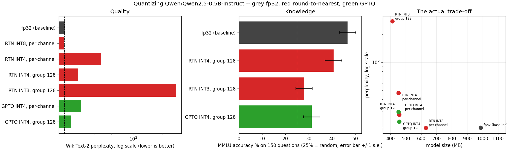
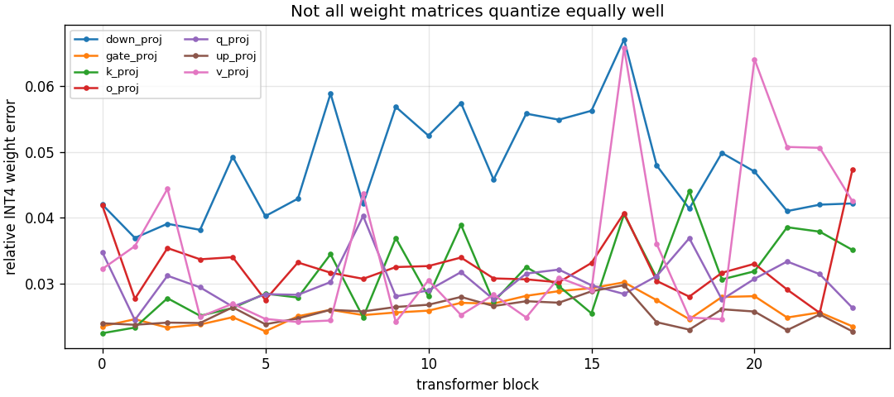

# Quantize a Small LLM

---

> [GPTQ](/shared/glossary/#gptq) written from scratch, run on a real modern LLM (Qwen2.5-0.5B-Instruct), scored on real [WikiText-2](/shared/glossary/#wikitext-2) [perplexity](/shared/glossary/#perplexity) and 150 real [MMLU](/shared/glossary/#mmlu) questions. Plain [round-to-nearest](/shared/glossary/#round-to-nearest-rtn) at [INT4](/shared/glossary/#int4) takes perplexity from **19.93 to 46.80**. Changing one number — the group size — takes it back to **27.44** without changing the algorithm at all, and *beats* GPTQ run at the coarse granularity (**29.40**). GPTQ at the same group size wins outright at **23.14**. And then the twist: on MMLU that best-perplexity model scores **31.3%**, while the model it beat by 4.3 perplexity scores **40.7%**. The metric everyone reports and the metric you actually care about disagree.

---

## Key Insight

Two knobs decide how much [quantization](/shared/glossary/#quantization) hurts, and they are not the ones you expect. The first is **granularity** — how many [weights](/shared/glossary/#weights) share one [scaling factor](/shared/glossary/#scaling-factor) — and it is worth more here (46.80 → 27.44, a 1.71x improvement) than switching from the dumbest algorithm to a state-of-the-art one at fixed granularity (46.80 → 29.40, 1.59x). The second is **what you measure**. GPTQ tunes weights to reproduce the activations produced by its [calibration](/shared/glossary/#calibration) text; when that text is WikiText, WikiText perplexity is exactly what improves, and knowledge the calibration set never exercised can quietly get worse.

## Why This Matters

This is the project where the phase stops being about bit layouts and starts being about a decision you will actually make: someone hands you a model that does not fit, and you have to shrink it. Everything after this is a refinement of the same pipeline — [project 35](../35-kv-cache-quantization/README.md) quantizes what the model *remembers* instead of what it *knows*, [project 36](../36-calibration-data-study/README.md) attacks the calibration set that caused the MMLU surprise here, [project 37](../37-per-channel-vs-per-tensor/README.md) turns the granularity knob all the way in both directions, and [project 38](../38-qlora-fine-tune/README.md) trains on top of a quantized model instead of just serving it.

---

**This is project 34.**

### The words first

- **[Quantization](/shared/glossary/#quantization)** — storing a number in fewer bits. Here: replacing each 32-bit weight with a 4-bit integer plus a shared scale, so the value you get back is `q × scale` instead of the original.
- **[Round-to-nearest (RTN)](/shared/glossary/#round-to-nearest-rtn)** — the obvious method. Divide by the scale, round, done. No data required. Every other method exists to beat this one.
- **[GPTQ](/shared/glossary/#gptq)** — "GPT Quantization", though it works on any transformer. It quantizes one column of the weight matrix at a time and then *edits the columns it has not done yet* so they cancel part of the error it just made. Details in section D.
- **[Hessian](/shared/glossary/#hessian)** — the matrix of second derivatives. GPTQ needs to know how sensitive a layer's output is to each weight, and for a linear layer that sensitivity is exactly `H = 2·XᵀX`, where `X` is the stack of inputs the layer sees. Named after Ludwig Otto Hesse, the 19th-century mathematician who introduced it.
- **[Calibration data](/shared/glossary/#calibration)** — the sample inputs used to build that `X`. No labels, no gradients: the model is just *run*, and the activations are watched.
- **[Per-channel](/shared/glossary/#per-channel-quantization) / [per-group](/shared/glossary/#per-group-quantization)** — how many weights share a scale. One scale per output row, or one per 128 consecutive weights inside a row.
- **[Bits per weight](/shared/glossary/#bits-per-weight)** — the honest file size, counting the scales. "INT4 group 128" is really 4.125 bits.
- **[Perplexity](/shared/glossary/#perplexity)** — how surprised the model is by held-out text. Roughly "how many words was it choosing between". Lower is better.
- **[MMLU](/shared/glossary/#mmlu)** — Massive Multitask Language Understanding: 14,000 multiple-choice exam questions across 57 subjects. Random guessing scores 25%.
- **Agreement** — our own extra metric: the fraction of positions where the quantized model predicts the *same next token* as the fp32 model. Perplexity can stay flat while the model's actual choices drift; agreement catches that.

### "The guide says a 7B model. Why 0.5B?"

Because the eval has to actually run. A 7B model in fp16 fits in this machine's 31 GB of RAM, but this box has no GPU that PyTorch can use ([sm_61](/shared/glossary/#compute-capability), see [project 28](../28-nccl-tests/README.md)), so every forward pass runs on 12 CPU threads. One perplexity pass over 4,096 tokens takes 11 seconds at 0.5B; at 7B it would take about 3 minutes, and this project runs seven of them plus four MMLU sweeps plus two full GPTQ passes. Nothing about the *method* changes with size — the same code, the same Hessians, the same group sizes. What changes is that bigger models are famously **more** forgiving of INT4, so the damage measured here is an upper bound, not a lower one.

### "If GPTQ already picks better weights, why does the group size still matter?"

They fix two different problems, which is why they add up rather than overlap.

The **group size** decides what a scale is *allowed to represent*. With one scale per output row, a single unusually large weight anywhere in that row forces the scale up and every other weight in the row loses resolution. No algorithm can undo that; the levels simply are not there.

**GPTQ** decides *which of the available levels each weight lands on*, and how the resulting error is spread. It cannot invent levels that the granularity did not provide.

The measurement below shows exactly this shape: GPTQ alone (per-channel: 46.80 → 29.40) and grouping alone (46.80 → 27.44) each recover most of the loss, and doing both (23.14) is better than either.

### "Why not quantize the embeddings and the output layer too? They are 27.6% of the model."

Because they are used differently. A weight matrix inside a transformer block is *multiplied* — every one of its numbers takes part in every token's arithmetic, so shrinking it saves both memory and memory traffic. The embedding table is *indexed*: for a 10-token prompt, 10 rows out of 151,936 are read and the rest are never touched. Quantizing it saves storage but no bandwidth, and it damages exactly the place where a small error is most visible (the token identities themselves). The [lm_head](/shared/glossary/#lm-head) is the same table transposed under [weight tying](/shared/glossary/#weight-tying). Every production recipe skips both — which is also why an "INT4 model" is never one quarter the size (988 MB → 457 MB here, a 2.16x reduction, not 4x).

---

## Running it

```bash
python run.py            # ~10 min: 7 perplexity passes, 4 MMLU sweeps, 2 GPTQ runs
python run.py --plot     # redraw the figures from the committed findings.json
```

Needs `torch`, `transformers`, `pandas`, `huggingface_hub`, `matplotlib`. Downloads Qwen2.5-0.5B-Instruct, WikiText-2 and MMLU on first run (about 1.2 GB, cached afterwards). Hardware: **Intel i7-8700K**, 12 threads, no usable GPU.

`quantlib.py` and `gptq.py` in this directory are the shared toolkit for the rest of the phase — projects 35 to 38 import them.

> **About the numbers.** Everything below comes from the committed
> [`outputs/findings.json`](outputs/findings.json),
> [`outputs/findings.csv`](outputs/findings.csv) and
> [`outputs/run.log`](outputs/run.log).



---

## A. What is actually being quantized

| | parameters | share |
|---|---:|---:|
| total | 494.0 M | 100% |
| inside transformer blocks (168 `nn.Linear` layers) | **357.8 M** | **72.4%** |
| embeddings + tied output head | 136.2 M | 27.6% |

Only the first group is quantized. That ceiling is worth internalising before reading any compression claim: even at 4 bits, 27.6% of this model stays at 16, so the best possible file is 457 MB, not 247 MB.

The evaluation uses 4,096 WikiText-2 tokens; calibration uses a **disjoint** 4,096 tokens from the same corpus; MMLU uses 150 randomly drawn questions.

---

## B. INT8 is free

| model | perplexity | agreement with fp32 | size |
|---|---:|---:|---:|
| fp32 | 19.930 | 100% | 988 MB |
| RTN [INT8](/shared/glossary/#int8), per-channel | **19.827** | 97.1% | 631 MB |

INT8 does not merely survive, it scores 0.10 *better* than fp32 — which is noise, not an improvement, and that is the point. At 8 bits with a per-channel scale, weight quantization is below the measurement floor. This is why nobody writes papers about INT8 weight-only quantization any more: the interesting territory starts at 4 bits.

Note that agreement has already fallen to 97.1%. Three tokens in a hundred change even though perplexity did not move. Perplexity is an average over the whole distribution; agreement is a hard vote, and it is the more sensitive tripwire.

---

## C. Four bits, and the granularity cliff

| model | perplexity | vs fp32 | agreement | bits/weight |
|---|---:|---:|---:|---:|
| fp32 | 19.930 | 1.00x | 100% | 16 |
| RTN [INT4](/shared/glossary/#int4), per-channel | 46.802 | 2.35x worse | 52.3% | 4.014 |
| RTN INT4, group 128 | **27.439** | 1.38x worse | 69.2% | 4.125 |
| RTN INT3, group 128 | 274.138 | 13.8x worse | 23.2% | 3.125 |

Read the middle two rows together. **The only difference between them is how many weights share a scale** — 896 or 4,864 of them in the per-channel case, 128 in the other. Same rounding rule, same code path, 0.11 extra bits per weight, and perplexity improves by 1.71x. Granularity is the cheapest thing you can buy in this entire project.

Then read the last row. Going from 4 bits to 3 — one single bit — multiplies perplexity by 10. Quantization damage is not linear in the bit width; there is a cliff, and for this model it is between 4 and 3. [Project 37](../37-per-channel-vs-per-tensor/README.md) maps that cliff properly.

---

## D. GPTQ, and what it is actually doing

RTN treats every weight as an independent little rounding problem. GPTQ treats the layer as one problem: it wants the *layer's output* to stay the same, not each weight.

The procedure, per weight matrix:

1. Run the calibration text through the model and record `X`, the inputs this layer sees. Build `H = 2·XᵀX`.
2. Add a small multiple of the mean diagonal to `H` ("dampening"). Real activation covariances are nearly singular because features are correlated, and inverting a nearly singular matrix produces enormous numbers that would blow the update up.
3. Take a [Cholesky](/shared/glossary/#cholesky-decomposition) factor of `H⁻¹`. Working with the factor instead of the full inverse turns the per-column update into a single outer product.
4. Walk the columns left to right. Quantize column *i*; measure the error; push a correction onto columns *i+1…n* proportional to `H⁻¹[i, i+1:]`. Those columns are still free, so they can absorb part of the mistake.

Crucially, blocks are processed **in order and with the quantized weights in place**: block *k+1*'s Hessian is collected from the activations that the *already quantized* block *k* produces. If you collected all the Hessians up front from the clean model, each layer would be compensating for an input distribution that no longer exists by the time it runs.

| model | perplexity | agreement | quantize time |
|---|---:|---:|---:|
| RTN INT4, per-channel | 46.802 | 52.3% | instant |
| **GPTQ** INT4, per-channel | 29.401 | 67.9% | 105 s |
| RTN INT4, group 128 | 27.439 | 69.2% | instant |
| **GPTQ** INT4, group 128 | **23.137** | **78.4%** | 244 s |

Two things to take away.

**GPTQ is worth 1.59x on its own** (46.80 → 29.40 at fixed granularity). That is a large, real gain from an algorithm that needs no labels and no gradients — only 4,096 tokens of plain text run through the model once per block.

**And it still loses to the dumb method with a better group size** (29.40 vs 27.44). If you are choosing where to spend effort, tighten the granularity first; it is free and it is bigger. GPTQ is what you add *after*.

---

## E. The result that should make you suspicious

| model | WikiText-2 perplexity | MMLU (150 questions) |
|---|---:|---:|
| fp32 | 19.930 | **46.7%** |
| RTN INT4, group 128 | 27.439 | 40.7% |
| GPTQ INT4, group 128 | **23.137** | 31.3% |
| RTN INT3, group 128 | 274.138 | 28.0% |

The two columns rank the models **differently**. GPTQ wins perplexity by 4.3 and loses MMLU by 9.4 percentage points.

Before believing it, check the noise. MMLU accuracy on *n* questions is a coin-flip average: its standard error is about `√(p(1−p)/n)` ≈ 3.5 points at n = 150, so differences under about 7 points are not evidence of anything. The 9.4-point gap clears that bar, but only just — and the honest statement is "the ranking reverses, at roughly two standard errors", not "GPTQ destroys MMLU".

The mechanism is not mysterious. GPTQ's objective is *literally* "reproduce the activations this layer produced on the calibration text", and the calibration text is WikiText. It is optimising a proxy, and the proxy is measured on the same distribution it was fitted to. Anything the calibration set does not exercise — multiple-choice exam formatting, factual recall about anatomy or law — is outside what the optimisation was told to protect. This is the same shape as overfitting a validation set, and it is why every serious quantization report includes at least one downstream task alongside perplexity. [Project 36](../36-calibration-data-study/README.md) takes the calibration set apart to see how much of this is under your control.

The RTN INT3 row is the sanity check: at 28.0% it is within one standard error of the 25% random-guessing floor. The model is gone. Perplexity said 274 and MMLU says "coin flip"; the two metrics agree when the damage is total, and disagree in the interesting middle.

---

## F. Not all layers quantize equally

Relative INT4 error, averaged over all 24 blocks, per weight matrix type:

| matrix | relative error | what it does |
|---|---:|---|
| `down_proj` | **0.0478** | MLP output projection, 4,864 → 896 |
| `v_proj` | 0.0347 | values |
| `o_proj` | 0.0327 | attention output projection |
| `k_proj` | 0.0312 | keys |
| `q_proj` | 0.0304 | queries |
| `gate_proj` | 0.0260 | MLP gate, 896 → 4,864 |
| `up_proj` | 0.0256 | MLP up-projection |



`down_proj` is the worst by 1.87x over the best, and it is also the widest matrix (4,864 inputs per row). That is not a coincidence: with per-channel scaling, a wider row means more weights sharing one scale and more chances for one of them to be an outlier that sets it.

Depth matters too, but not as a tidy upward trend. `down_proj` climbs through the first half and peaks around block 16; `v_proj` is quiet for two thirds of the network and then roughly doubles, spiking at blocks 16 and 20. The practical reading is that "which layers are hard" is a property you have to *measure per model* — this single chart is enough to tell you which four or five matrices are worth leaving at INT8, and a rule of thumb would have picked the wrong ones.

---

## What to take away

1. **INT8 weight-only quantization is free** (19.93 → 19.83, inside noise). The real work starts at 4 bits.
2. **Granularity is the cheapest quality you can buy**: 0.11 extra bits per weight is worth 1.71x perplexity, more than swapping RTN for GPTQ at fixed granularity (1.59x).
3. **GPTQ and grouping stack** — 23.14 with both, versus 27.44 and 29.40 with one each — because they solve different problems: which levels exist, and which level each weight lands on.
4. **One bit is a cliff, not a slope.** INT4 → INT3 multiplies perplexity by 10 and drops MMLU to chance.
5. **The best-perplexity model was not the best model.** GPTQ won perplexity by 4.3 and lost MMLU by 9.4 points, because its objective is fitted to the calibration distribution.
6. **Always compute the noise floor of your benchmark.** ±3.5 points at 150 MMLU questions means most of the comparisons you would like to make are not resolvable at that sample size.
7. **An "INT4 model" is 2.16x smaller, not 4x**, because 27.6% of the parameters are embeddings that nobody quantizes.

---

## What to try next

- Calibrate GPTQ on a *mixture* — WikiText plus a few hundred MMLU-style questions — and see whether the MMLU gap in section E closes. That is a two-line change to the `calib` tensor.
- Add [AWQ](/shared/glossary/#awq): instead of correcting errors after the fact, scale up the input channels with the largest activations before quantizing, so their weights land on finer levels. It needs the same activation statistics GPTQ already collects.
- Leave the first and last transformer block in INT8 and quantize the rest to INT4. Section F says where the damage is; measure what buying it back costs in bits per weight.
- Re-run the whole thing on a 1.5B or 3B model and check the claim that bigger models tolerate INT4 better.

---

Next: [project 35 — KV-cache quantization](../35-kv-cache-quantization/README.md), which quantizes the tensors that grow with the conversation instead of the ones that sit still.
