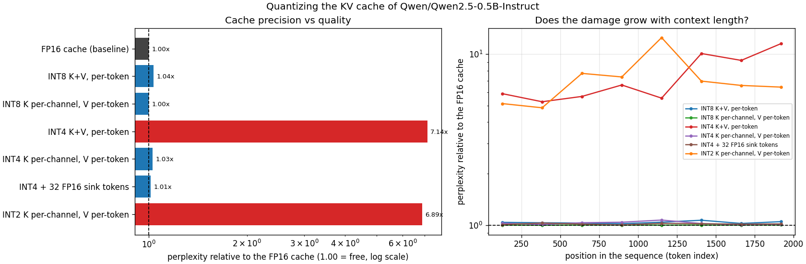
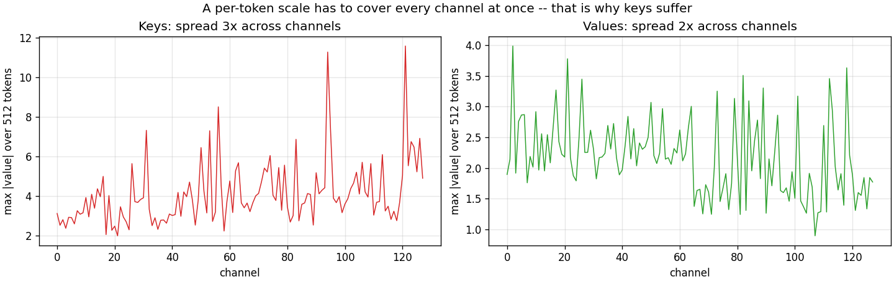

# KV-Cache Quantization

---

> The same [KV cache](/shared/glossary/#kv-cache) at the same 4 bits scores **13.31** or **92.65** [perplexity](/shared/glossary/#perplexity), a **7.0x** difference, depending on one choice that costs nothing: which axis the *key* scales run along. Get it right and INT4 keys and values are **1.03x** the FP16 baseline — cheaper than 8-bit done the usual way (**1.04x**). Get it wrong and the damage **compounds with context length**, growing from 5.9x at token 128 to 11.5x at token 1,920, while the correct version stays flat. At 32k tokens the arithmetic says INT4 fits **69 concurrent sequences** in the memory that held 17.

---

## Key Insight

Weight quantization ([project 34](../34-quantize-a-small-llm/README.md)) is a one-time offline decision about a tensor that never changes. Cache quantization is a decision about a tensor that **grows with every token the user types**, is written once and read a thousand times, and — crucially — is *half of the attention arithmetic itself*. That last part is why keys and values behave completely differently under the same quantizer: a value vector is averaged with hundreds of others and its errors cancel; a key vector goes through a dot product and a [softmax](/shared/glossary/#softmax), where a single distorted number can move an attention weight from 0.01 to 0.4.

## Why This Matters

The cache is the reason long-context serving is expensive. Model [weights](/shared/glossary/#weights) are a fixed cost you pay once; the cache is a per-user, per-token cost that scales with the product of batch size and context length. Section A shows the crossover for this model at **80,408 tokens** — beyond that, one conversation's cache outweighs the entire model. [Project 41](../41-kv-cache-memory-math/README.md) does that arithmetic for serving in general; this project measures what you can do about it.

---

**This is project 35.**

### The words first

- **[KV cache](/shared/glossary/#kv-cache)** — during generation, the keys and values computed for tokens 1…n are reused unchanged when generating token n+1. Caching them turns an O(n²) re-computation per token into O(n) — which is why every serving stack has one, and why memory becomes the bottleneck instead of arithmetic.
- **[Prefill](/shared/glossary/#prefill) / [decode](/shared/glossary/#decode)** — processing the whole prompt at once (fills the cache), then generating one token at a time (reads the whole cache every step).
- **Per-token scale** — one [scaling factor](/shared/glossary/#scaling-factor) covering one token's slice of the cache, i.e. across the `head_dim` axis.
- **Per-channel scale** — one scaling factor covering one channel across a block of tokens, i.e. across the *token* axis.
- **[Activation outlier](/shared/glossary/#activation-outlier)** — a channel whose values are far larger than the rest. Keys have them; that is the entire story of this project.
- **[Attention sink](/shared/glossary/#attention-sink)** — the first few tokens of a sequence, which attention heads reliably dump leftover probability mass onto. They matter more than their content suggests, so keeping them exact is a cheap fix.
- **KIVI** — the 2024 method this project reproduces: keys per-channel, values per-token, newest partial group kept in FP16.
- **Agreement** — the fraction of positions where the model with the quantized cache predicts the same next token as the model with the FP16 cache.

### "Isn't the cache just activations? Project 34 already quantized the model."

They are different tensors with opposite economics, which is why both projects exist.

Project 34 quantized **weights**: fixed, shared by every request, quantized once, offline, with as much compute as you like. The budget there is 357.8 M numbers, always the same 357.8 M.

This project quantizes the **cache**: created fresh per request, growing every token, and quantized *on the hot path* — you cannot spend 105 seconds on a [Hessian](/shared/glossary/#hessian) for a tensor that must be written the instant a token is produced. So the algorithm has to be [round-to-nearest](/shared/glossary/#round-to-nearest-rtn), and the only lever left is **granularity**.

The sizes also cross over. At 4,096 tokens the cache here is 0.05 GB against 0.99 GB of weights — irrelevant. At 131,072 tokens with a batch of 32 it is **51.5 GB**, and the weights are a rounding error.

### "Why do keys need a different scale layout from values? They come out of the same kind of layer."

Because they are *used* differently, and quantization error is only as harmful as what happens to it downstream.

A **value** vector is one term in a weighted average: `output = Σ softmax_weight_i · v_i`. Hundreds of value vectors are averaged with small weights, so independent rounding errors partly cancel. Averaging is forgiving.

A **key** vector goes into `q · k` and then through a [softmax](/shared/glossary/#softmax), which *exponentiates* the result. An error of 0.5 in a logit multiplies that token's attention weight by e^0.5 ≈ 1.65. Softmax is an amplifier, not an average.

On top of that, keys have [outlier channels](/shared/glossary/#activation-outlier) — section B measures the biggest key channel at **3.1x the median**, versus 1.9x for values. A per-token scale has to span every channel of that token at once, so the outlier channel sets the scale and the ordinary channels are left with a fraction of the levels. A per-channel scale gives the outlier its own scale and stops it taxing its neighbours.

Section C is the measurement: the *only* difference between the 92.65 row and the 13.31 row is that one keeps a scale per token and the other keeps a scale per channel.

### "If per-channel is better, why does anything use per-token?"

Because of *when* the numbers exist. During generation, token n's key vector is complete the moment token n is produced — a per-token scale can be computed immediately and never revisited. A per-channel scale spans *many tokens*, so it cannot be finalised until those tokens exist, and every new token would in principle change it.

The compromise (and what `q_per_channel` implements) is to work in blocks: one scale per channel per **128 tokens**. Once a block of 128 is complete its scales are frozen forever; the newest, still-growing block is held in FP16 until it fills. That costs `128 × 6,144 × 2` bytes ≈ 1.5 MB per sequence — negligible against the 400 MB a 32k cache would otherwise occupy.

---

## Running it

```bash
python run.py            # ~2 min
python run.py --plot     # redraw the figure from the committed findings.json
```

Needs `torch`, `transformers`, `pandas`, `huggingface_hub`, `matplotlib`, and `quantlib.py` from [project 34](../34-quantize-a-small-llm/README.md) (imported automatically). Same model as project 34, so the numbers are directly comparable.

> **About the numbers.** Everything below comes from the committed
> [`outputs/findings.json`](outputs/findings.json),
> [`outputs/findings.csv`](outputs/findings.csv) and
> [`outputs/run.log`](outputs/run.log).



---

## A. How big is a KV cache, exactly?

There is no mystery in this number, so compute it rather than looking it up. For every token, every layer stores one key and one value per key/value head:

```
elements per token = 2 × layers × kv_heads × head_dim
                   = 2 × 24     × 2        × 64      = 6,144
```

| precision | per token | per 32k-token sequence |
|---|---:|---:|
| FP16 | 12.0 KiB | 0.40 GB |
| INT8 | 6.0 KiB | 0.20 GB |
| INT4 | 3.0 KiB | 0.10 GB |

The model's own weights in FP16 are **988 MB**, so a single FP16 cache equals the whole model at **80,408 tokens** of context. Past that point, "how big is your model" stops being the interesting question.

The `kv_heads = 2` in that formula is worth noticing. Qwen2.5-0.5B has 14 attention heads but only 2 key/value heads — [grouped-query attention](/shared/glossary/#gqa), where several query heads share one key/value pair. GQA is *itself* a KV-cache compression technique, and it was applied before we arrived: without it this cache would be 7x larger. Cache quantization stacks on top of an architecture choice that already did most of the work.

| batch × context | FP16 | INT8 | INT4 |
|---|---:|---:|---:|
| 1 × 4,096 | 0.05 GB | 0.03 GB | 0.01 GB |
| 8 × 32,768 | 3.22 GB | 1.61 GB | 0.81 GB |
| 32 × 131,072 | **51.54 GB** | 25.77 GB | 12.88 GB |

---

## B. Keys and values do not look alike

Statistics of the tensors the cache actually stores, taken from the middle layer over 512 tokens. (These are read from *inside* the cache, not from the output of `k_proj`: rotary position embeddings are applied first, and rotation mixes channels, so the pre-rotary tensor is not the one that gets quantized.)

| | biggest channel ÷ median channel | biggest token ÷ median token |
|---|---:|---:|
| keys | **3.12x** | 1.46x |
| values | 1.86x | 1.82x |



Read the table by column, not by row. For **keys**, the spread across channels (3.12x) is more than double the spread across tokens (1.46x) — the variation lives in the channel axis, so that is the axis your scales should follow. For **values**, the two numbers are nearly equal (1.86 vs 1.82), so neither axis is obviously better and the cheaper one (per-token, computable online) wins by default.

A 3.12x spread does not sound catastrophic, and by itself it is not — this is a ratio of *maxima*, and section C's 7x perplexity blow-up comes from the compounding of that mismatch through the softmax and across 24 layers, not from the ratio directly. The statistic tells you which axis to use; only the end-to-end measurement tells you how much it matters.

---

## C. What quantizing the cache costs

4,096 tokens of WikiText-2, evaluated as two 2,048-token sequences:

| cache configuration | perplexity | vs FP16 | agreement |
|---|---:|---:|---:|
| FP16 (baseline) | 12.968 | 1.00x | 100% |
| INT8 K+V, both per-token | 13.440 | 1.04x | 92.7% |
| INT8 K per-channel, V per-token | **12.964** | **1.00x** | **99.5%** |
| **INT4 K+V, both per-token** | **92.648** | **7.14x** | **36.4%** |
| INT4 K per-channel, V per-token | 13.312 | 1.03x | 91.3% |
| INT4 + 32 FP16 sink tokens | 13.160 | 1.01x | 92.7% |
| INT2 K per-channel, V per-token | 89.340 | 6.89x | 35.5% |

Four things fall out of this table.

**The granularity choice is worth 7.0x.** Rows 4 and 5 are the same bit width, the same rounding rule, the same code. One keeps a scale per token; the other keeps a scale per channel per 128-token block. 92.648 versus 13.312.

**Done right, 4 bits beat 8 bits done the usual way.** INT4 per-channel keys score 13.312; INT8 per-token keys score 13.440. Halving the precision *and* fixing the layout is better than keeping the precision and not fixing it — while using half the memory.

**INT8 with per-channel keys is free.** 12.964 against a 12.968 baseline, with 99.5% agreement. That is below the measurement floor, and it is why INT8 cache is a default in production serving stacks rather than an option.

**INT2 is not usable, and the reason is interesting.** At 89.340 it is *slightly better* than INT4-per-token (92.648), which tells you the failure at 2 bits and the failure at 4-bits-badly-scaled are the same magnitude of catastrophe. Below a certain number of levels, no scale layout rescues you.

### The damage compounds with context

Perplexity by position in the sequence, relative to the FP16 baseline at the same position:

| token index | ~128 | ~384 | ~640 | ~896 | ~1152 | ~1408 | ~1664 | ~1920 |
|---|---:|---:|---:|---:|---:|---:|---:|---:|
| INT4 K+V per-token | 5.9x | 5.3x | 5.7x | 6.6x | 5.5x | **10.1x** | 9.2x | **11.5x** |
| INT4 K per-channel | 1.03x | 1.01x | 1.03x | 1.04x | 1.07x | 1.02x | 1.01x | 1.01x |

The broken configuration gets **worse the longer the conversation runs** — roughly doubling from the start of the sequence to the end — while the correct one is flat. The mechanism is straightforward once stated: a token at position 1,920 attends over 1,920 cached keys, every one of them damaged, and the softmax has to pick a winner from a longer list of corrupted scores. A quick benchmark on 512-token sequences would have reported "INT4 cache costs about 5x" and understated the problem by half.

This is the single most practical warning in the project: **cache quantization must be evaluated at the context length you intend to serve.**

### Attention sinks

Keeping just the first **32** tokens in FP16 — 0.4 MB per sequence, 1.6% of a 2,048-token cache — moves perplexity from 13.312 to **13.160** and agreement from 91.3% to 92.7%. Those tokens are the [attention sink](/shared/glossary/#attention-sink): heads with nothing in particular to look at dump their leftover softmax mass onto the first few positions, so those keys are read by *every* subsequent token and their errors are the most amplified in the whole cache. A tiny, precisely-targeted exception is worth more than a general bit-width increase.

---

## D. What the saving is for

The point of a smaller cache is not a smaller number in a report; it is **more users on the same card**. Suppose an 8 GB budget and 0.99 GB of weights, leaving 7.01 GB:

| cache precision | per 32k-token sequence | concurrent sequences |
|---|---:|---:|
| FP16 | 0.40 GB | 17 |
| INT8 | 0.20 GB | 34 |
| INT4 | 0.10 GB | **69** |

Four times the batch size for a 1.03x perplexity cost. And on a memory-bound decode step, four times the batch is close to four times the throughput, because the weights only have to be read from memory once per step no matter how many sequences share it — see [project 40](../40-latency-vs-throughput/README.md).

---

## What to take away

1. **The same 4 bits give 13.31 or 92.65 perplexity** depending only on which axis the key scales follow. Granularity is not a tuning detail here; it is the whole result.
2. **Keys and values need different treatment**, because a value is averaged (forgiving) and a key goes through a softmax (amplifying), and because keys have 3.12x channel outliers where values have 1.86x.
3. **INT4 done right beats INT8 done the usual way** — 13.312 vs 13.440 — at half the memory.
4. **INT8 with per-channel keys is free**: 12.964 against a 12.968 baseline.
5. **Bad cache quantization gets worse with context length** (5.9x → 11.5x across 2,000 tokens); good cache quantization stays flat. Benchmark at your real context length.
6. **32 FP16 "sink" tokens cost 1.6% of the cache and buy 1.4 points of agreement.** The first tokens are read by everything after them.
7. **A single FP16 cache equals this whole model at 80,408 tokens.** Past that, the model size is not what fills your card.
8. **GQA already did most of the compression** — 2 key/value heads instead of 14. Architecture choices and quantization multiply.

---

## What to try next

- Sweep the token group size (16 / 32 / 64 / 128 / 256) for per-channel keys and find where the quality stops improving. That is the number KIVI had to pick.
- Quantize *values* per-channel too and confirm that it buys nothing — the section B statistics predict it should not, and a control that correctly finds nothing is worth running.
- Measure actual generation, not teacher-forced perplexity: generate 200 tokens with each cache configuration and compare outputs. Perplexity is forgiving; a wrong token at step 3 changes everything after it.
- Combine with [project 34](../34-quantize-a-small-llm/README.md): INT4 weights *and* INT4 cache, and check whether the two errors add or interact.

---

Next: [project 36 — Calibration data study](../36-calibration-data-study/README.md), which goes back to weight quantization and interrogates the one input GPTQ needs that nobody thinks about.
