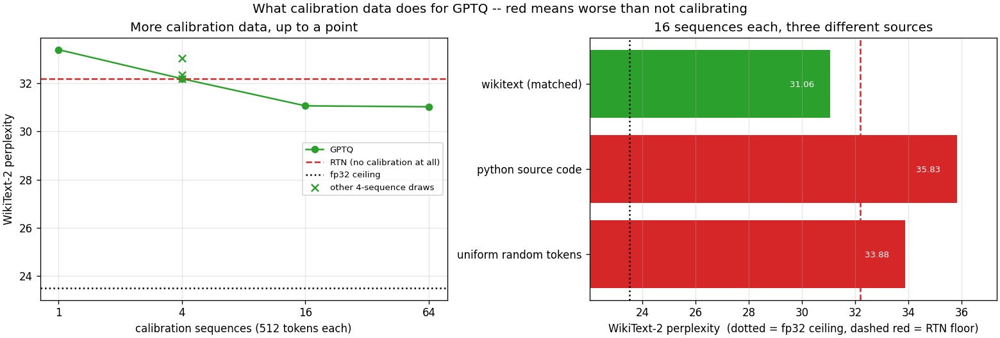

# Calibration Data Study

---

> Eight full [GPTQ](/shared/glossary/#gptq) passes over the same model, differing only in the text used to [calibrate](/shared/glossary/#calibration) them. The headline is a warning, not a win: **GPTQ with one calibration sequence is worse than not calibrating at all** — 33.39 [perplexity](/shared/glossary/#perplexity) against [round-to-nearest](/shared/glossary/#round-to-nearest-rtn)'s 32.18. Four sequences pull exactly level (32.18). Sixteen finally win (31.06), and sixty-four buy a further **0.04**. Meanwhile the *luck of the draw* at four sequences spans **0.84** perplexity — three quarters of everything the whole 4→64 sweep is worth. And calibrating on the wrong domain is worse than calibrating on nothing: Python source code scores **35.83**, and even **uniform random tokens** (33.88) beat it.

---

## Key Insight

[GPTQ](/shared/glossary/#gptq) does not learn from data — no labels, no [gradients](/shared/glossary/#gradients). It uses the calibration set for exactly one thing: to estimate `H = 2·XᵀX`, the covariance of the activations each layer sees. That is a matrix with thousands of rows and columns, and it is being estimated from a handful of samples. With too few, the estimate is noise, and GPTQ confidently compensates for correlations that are not there — which is *worse* than the data-free baseline that assumes nothing. **The failure mode of too little calibration data is not "less improvement"; it is negative improvement.**

## Why This Matters

[Project 34](../34-quantize-a-small-llm/README.md) ended on a puzzle: GPTQ won [WikiText-2](/shared/glossary/#wikitext-2) perplexity and *lost* [MMLU](/shared/glossary/#mmlu) by 9.4 points, and the suspect was the calibration set. This project puts that suspect on the stand. It cannot fully clear it — but it does show, quantitatively, that the calibration distribution is a first-order input and not a footnote, and that the standard advice ("128 random sequences from C4") is doing more work than it appears to.

---

**This is project 36.**

### The words first

- **[Calibration data](/shared/glossary/#calibration)** — sample inputs run through the model so a quantizer can watch the [activations](/shared/glossary/#activations). Unlabelled and unlearned-from; the model is only *observed*.
- **[Hessian](/shared/glossary/#hessian)** — the matrix of second derivatives of the layer's output error. For a linear layer it equals `2·XᵀX` where `X` stacks the calibration activations, so estimating it *is* estimating the activation covariance.
- **Covariance** — how strongly two input channels move together. If channels 3 and 47 always rise together, GPTQ can push error from one onto the other. If they only *appeared* to in your four samples, it will do that anyway and be wrong.
- **[Round-to-nearest (RTN)](/shared/glossary/#round-to-nearest-rtn)** — the data-free baseline. It is the floor GPTQ must clear to be worth running.
- **Domain mismatch** — calibrating on text that does not resemble what the model will be asked to do.
- **[Per-group quantization](/shared/glossary/#per-group-quantization)** — one scale per 64 weights here. Chosen because 576 and 1,536 (the model's two input widths) are both multiples of 64.

### "GPTQ has no labels and no gradients. What is the data even for?"

This is the question that makes GPTQ click, so it is worth being concrete.

Quantizing a weight matrix means rounding, and rounding a weight `w` to `ŵ` changes the layer's output by `(w − ŵ) · x`, where `x` is the activation multiplied by that weight. **How much a rounding error matters therefore depends entirely on how big `x` typically is** — and the only way to know that is to run some text through the model and look.

That is the first job of the data: a weight multiplied by an input channel that is almost always near zero can be rounded carelessly; a weight multiplied by a large channel cannot.

The second job is the one that needs *enough* data. GPTQ does not just weight the errors, it *redistributes* them: after rounding column *i*, it nudges columns *i+1…n* to cancel part of the damage. Whether that is possible depends on how the channels co-vary, which is the off-diagonal of `H`. A diagonal estimate needs only a few samples. A full covariance over 1,536 channels needs many, and with 512 tokens you are estimating 1.2 million numbers from 512 observations. Section B is what that looks like.

### "Isn't 'more data is better' obvious? Why measure it?"

Because the measurement contradicts the obvious version in two places.

**More data is not monotonically better — it is *necessary before it is useful*.** The curve does not start at "small improvement" and grow. It starts *below zero* (33.39 vs the 32.18 baseline), crosses zero at 4 sequences, and then improves. There is a threshold, and under it you are actively harming the model while believing you are running a state-of-the-art quantizer.

**And the returns stop abruptly.** 4 → 16 buys 1.12 perplexity; 16 → 64, a fourfold increase in both data and runtime, buys **0.04** — which section C shows is well inside the noise from which sequences you happened to pick. If you are tempted to run GPTQ with 1,024 calibration sequences, this is the measurement that says do not bother.

### "Why does calibrating on Python code make it worse than not calibrating?"

Because GPTQ's compensation is not neutral — it is a *deliberate distortion of the weights*, chosen to preserve behaviour on the distribution it was shown.

RTN is unbiased: it rounds each weight to its nearest level and has no opinion about what the model will see. GPTQ deliberately moves weights *away* from their nearest level, sometimes substantially, because doing so cancels errors in the specific activation pattern it measured. When the evaluation matches that pattern, the trade pays. When it does not, you have paid for a correction to a problem you do not have and taken the weight displacement as a pure loss.

That is why 35.83 (Python calibration) is worse than 32.18 (no calibration). It is the same reason a control group matters in any experiment: an intervention aimed at the wrong target is not neutral, it is harmful.

The random-token row is the amusing part. Uniform random tokens (33.88) beat real Python code (35.83) — because random tokens produce activations with no consistent structure, so `H` comes out close to diagonal and GPTQ mostly declines to redistribute anything, degenerating toward RTN. **Being confidently wrong about the covariance is worse than knowing nothing about it.**

---

## Running it

```bash
python run.py            # ~9 min: eight full GPTQ passes
python run.py --plot     # redraw the figure from the committed findings.json
```

Needs `torch`, `transformers`, `pandas`, `huggingface_hub`, `matplotlib`, and `quantlib.py` + `gptq.py` from [project 34](../34-quantize-a-small-llm/README.md).

**Why a smaller model here.** This project uses SmolLM2-135M rather than project 34's Qwen2.5-0.5B, because it runs GPTQ **eight times** and a single 0.5B pass takes 105–244 seconds. Eight of those would be a 25-minute run. The quantities being measured — how the Hessian estimate improves with samples, and what a domain mismatch costs — are properties of the estimation problem, not of the model size.

> **About the numbers.** Everything below comes from the committed
> [`outputs/findings.json`](outputs/findings.json),
> [`outputs/findings.csv`](outputs/findings.csv) and
> [`outputs/run.log`](outputs/run.log).



---

## A. Two baselines that need no calibration at all

| | WikiText-2 perplexity |
|---|---:|
| fp32, no quantization | **23.506** |
| RTN [INT4](/shared/glossary/#int4), group 64 | **32.185** |

These bracket everything that follows. 23.506 is the ceiling GPTQ can never beat; 32.185 is the floor it must beat to have been worth running. The whole contest happens in that 8.7-perplexity band — and note how much of the total damage grouping has *already* prevented: [project 37](../37-per-channel-vs-per-tensor/README.md) shows that per-tensor INT4 on a comparable model scores in the tens of millions.

That matters for reading this project: GPTQ is being asked to improve a configuration that is already reasonable. Its maximum available win here is small, and it is easy to turn negative.

---

## B. How many calibration sequences?

| calibration | tokens | perplexity | vs RTN |
|---|---:|---:|---:|
| none (RTN) | 0 | 32.185 | — |
| GPTQ, 1 × 512 | 512 | **33.388** | **worse by 1.20** |
| GPTQ, 4 × 512 | 2,048 | 32.185 | dead level |
| GPTQ, 16 × 512 | 8,192 | **31.061** | better by 1.12 |
| GPTQ, 64 × 512 | 32,768 | **31.023** | better by 1.16 |

**One sequence makes the model worse than not calibrating.** With 512 tokens, `H` for a 1,536-input layer is estimated from fewer observations than it has dimensions — it is *guaranteed* singular, held together only by the dampening term. GPTQ then redistributes error according to correlations that are artefacts of 512 tokens of Wikipedia.

**Four sequences land on the baseline to four decimal places** — 32.1846 against RTN's 32.1849. That near-exact tie is a coincidence of this run, but the qualitative message is not: at 2,048 tokens GPTQ's corrections are, on net, worth precisely nothing.

**Sixteen sequences are where it starts paying, and sixty-four is where it stops.** 8,192 tokens gives 31.061; quadrupling to 32,768 gives 31.023, a 0.04 improvement for 50 extra seconds of quantization time. Section C shows that 0.04 is an order of magnitude below the run-to-run noise, so it is not an improvement at all.

The standard recipes (GPTQ's paper uses 128 sequences of 2,048 tokens; llama.cpp and AutoGPTQ default to similar) sit comfortably past the knee. This measurement says that is the right call — and that going further is spending time on nothing.

---

## C. How much of this is luck?

Three different draws of four sequences, all from WikiText, all the same size:

| draw | perplexity |
|---|---:|
| sequences 8–11 | 32.185 |
| sequences 208–211 | 32.337 |
| sequences 408–411 | 33.022 |
| **spread** | **0.837** |

**The choice of which four paragraphs you happened to grab is worth 0.84 perplexity.** Compare that with the entire benefit of going from 4 sequences to 64 (1.16), and with the 16 → 64 difference (0.04).

This changes how the section B table should be read. The 1 → 4 → 16 steps are real: they exceed the noise band comfortably. The 16 → 64 step does not, and would be irresponsible to report as an improvement.

It is also a general lesson about quantization benchmarking. If you are comparing two quantization methods and the difference between them is under a perplexity point, you must run each with several calibration draws before claiming anything — otherwise you may be publishing which random seed you liked.

---

## D. Calibrating on the wrong kind of text

All three use 16 sequences of 512 tokens — the same *amount* of data, from different sources:

| calibration source | perplexity | vs RTN floor (32.185) |
|---|---:|---|
| **WikiText (matched)** | **31.061** | better by 1.12 |
| uniform random tokens | 33.882 | **worse by 1.70** |
| Python source code | **35.829** | **worse by 3.64** |

**Domain matters more than quantity.** Moving from 1 sequence to 64 of the *right* text is worth 2.37 perplexity. Moving from the right text to the wrong text at fixed quantity costs 4.77. If you have to choose between "more data" and "more representative data", the measurement here says representative wins, and it is not close.

**Wrong-domain calibration is worse than no calibration.** Not less good — actively worse than skipping the whole procedure. This is the practical warning of the project: if you quantize a code model with a general-web calibration set, or a chat model with raw Wikipedia, you may be shipping something worse than the trivial baseline, and the only way to find out is to run the trivial baseline as a control.

**Random tokens beat real code**, by 1.95. This is the diagnostic that explains the mechanism rather than just reporting it. Random tokens carry no consistent activation structure, so the off-diagonals of `H` average out and GPTQ makes only small, diagonal-weighted corrections — it quietly falls back toward RTN. Python code *does* have structure, just the wrong structure, so GPTQ commits hard to correlations that WikiText does not share. **Confidently wrong is more expensive than uninformed.**

A caveat worth stating: the evaluation here is WikiText, so "matched" means matched-to-the-test-set. That is exactly the arrangement that produced project 34's uncomfortable [MMLU](/shared/glossary/#mmlu) result, and this project inherits the same caveat rather than resolving it. What it establishes is the *sensitivity* — that the calibration distribution moves the result by nearly 5 perplexity — which is what makes the project 34 finding plausible rather than a fluke.

---

## What to take away

1. **GPTQ with one calibration sequence is worse than not calibrating** (33.39 vs 32.18). The failure mode is negative improvement, not small improvement.
2. **Four sequences is exactly break-even**; sixteen is where it starts to pay.
3. **Sixty-four buys 0.04 over sixteen**, which is inside the noise. The returns stop abruptly.
4. **Which sequences you drew is worth 0.84 perplexity** at n = 4 — most of what the whole size sweep is worth. Always run several draws before believing a sub-1-point difference.
5. **Calibrating on the wrong domain (35.83) is worse than calibrating on nothing (32.18).** Domain match beats quantity.
6. **Random tokens (33.88) beat real out-of-domain text (35.83)**, because they push GPTQ back toward the data-free baseline. Being confidently wrong costs more than knowing nothing.
7. **Always run the RTN control.** It costs nothing, needs no data, and is the only thing that tells you whether your fancy quantizer helped.

---

## What to try next

- Sweep sequence *length* at fixed total tokens: 64 × 512 against 16 × 2,048. The Hessian only sees tokens, so if the two are equal, sequence length is a free parameter — and if they are not, that says something about long-range activation structure.
- Mix domains: 8 WikiText + 8 Python, and see whether the result lands between the two pure runs or below both.
- Repeat section D with the evaluation on *Python* instead of WikiText and confirm the ranking flips. If it does not, something other than domain match is driving the result.
- Take the section D setup back to project 34's Qwen2.5-0.5B, add MMLU-style questions to the calibration mix, and check whether the 9.4-point MMLU gap closes. That is the experiment this project was built to make credible.

---

Next: [project 37 — Per-channel vs per-tensor](../37-per-channel-vs-per-tensor/README.md), which turns the granularity knob that has been quietly setting the floor for everything here.
