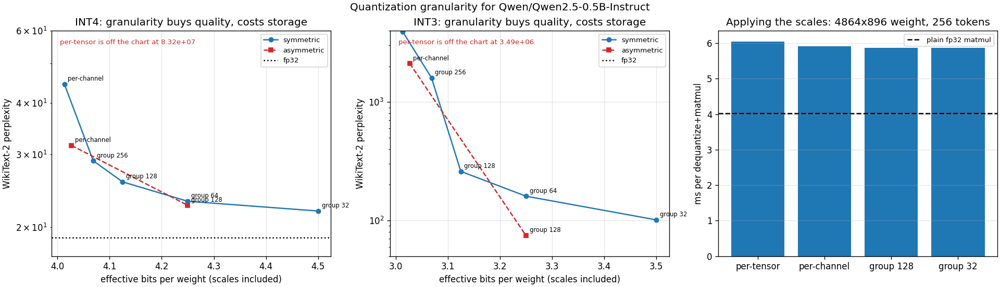
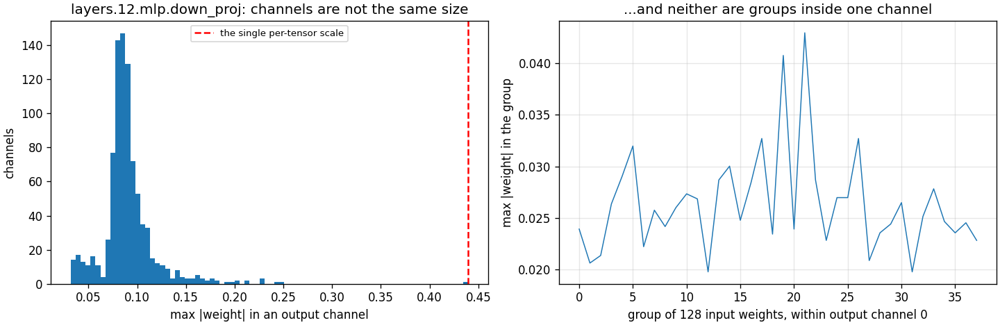

# Per-Channel vs Per-Tensor

---

> Sixteen [INT4](/shared/glossary/#int4) and [INT3](/shared/glossary/#int3) configurations of the same model, differing only in **how many weights share one scale**. [Per-tensor](/shared/glossary/#per-tensor-quantization) INT4 does not degrade the model, it **erases** it — [perplexity](/shared/glossary/#perplexity) **83,192,488** against an fp32 baseline of 18.87. [Per-channel](/shared/glossary/#per-channel-quantization) brings that to 44.46 for **0.014** extra [bits per weight](/shared/glossary/#bits-per-weight); [group-32](/shared/glossary/#per-group-quantization) reaches 21.88 for 0.5. Then the part nobody mentions: at equal storage, **[asymmetric](/shared/glossary/#symmetric-vs-asymmetric-quantization) group-128 beats symmetric group-64** (22.59 vs 23.11 at INT4, and 74.5 vs 160.4 at INT3 — a 2.15x gap). And the whole quality ladder is **free at inference time**: the finest granularity measured **1.00x** the coarsest.

---

## Key Insight

Granularity is the highest-leverage, lowest-cost knob in weight [quantization](/shared/glossary/#quantization), and the reason is a single fact about trained weight matrices: **the loudest output channel of one matrix in this model is 13.8x the quietest.** A scale is set by the largest magnitude it must cover, so one scale for the whole tensor is chosen by the loudest channel — and the quietest channel is then left with **0.51 of INT4's 7 positive levels**, which means its weights round to zero. Not "less accurately"; to zero. Every finer granularity is a way of not letting one outlier tax everything near it.

## Why This Matters

[Project 34](../34-quantize-a-small-llm/README.md) found that group size mattered more than swapping [round-to-nearest](/shared/glossary/#round-to-nearest-rtn) for [GPTQ](/shared/glossary/#gptq). This project turns that knob all the way in both directions to see the whole curve, adds the symmetric/asymmetric axis, and — the part that decides whether any of it is usable — measures what the extra scales cost when the kernel has to apply them.

---

**This is project 37.**

### The words first

- **Scale granularity** — how many weights share one [scaling factor](/shared/glossary/#scaling-factor). Coarse (one per tensor) → cheap to store, bad quality. Fine (one per 32 weights) → more storage, better quality.
- **[Per-tensor](/shared/glossary/#per-tensor-quantization)** — one scale for the entire weight matrix.
- **[Per-channel](/shared/glossary/#per-channel-quantization)** — one scale per output row. "Channel" here means one output feature; the row of weights that produces it.
- **[Per-group](/shared/glossary/#per-group-quantization)** — one scale per *g* consecutive weights inside a row (g = 32, 64, 128, 256).
- **[Symmetric](/shared/glossary/#symmetric-vs-asymmetric-quantization)** — the integer grid is centred on zero: `q = round(w / scale)`, values from −8 to 7.
- **[Asymmetric](/shared/glossary/#symmetric-vs-asymmetric-quantization)** — the grid can be slid: `q = round(w / scale) + zero_point`, values 0 to 15, with a stored [zero-point](/shared/glossary/#zero-point) saying where real zero sits.
- **[Bits per weight](/shared/glossary/#bits-per-weight)** — the honest storage cost. INT4 at group 128 with a 16-bit scale is 4 + 16/128 = **4.125** bits.
- **[Weight-only quantization](/shared/glossary/#weight-only-quantization)** — weights are stored small and expanded back to floats inside the kernel; the arithmetic is still floating-point. Sections B and C both assume this, because it is what every INT4 LLM kernel actually does.

### "Why does the group size run along the *input* dimension?"

Because that is the axis the [matmul](/shared/glossary/#matmul) sums over, and a scale has to survive that sum.

A linear layer computes `y[o] = Σ_i x[i] · W[o,i]`. If every weight in a group shares one scale, and the group lies along `i`, then the scale factors straight out of the sum: `y[o] = scale · Σ_i x[i] · q[o,i]`. The kernel can accumulate in integers and multiply by the scale **once at the end**.

If the group ran along `o` instead, weights being multiplied by the *same* activation and summed together would carry *different* scales, and the accumulator could no longer be a plain integer sum. The layout is not an arbitrary convention; it is the only one that keeps the inner loop cheap.

### "If finer scales are always better, why is anyone still using per-channel?"

Two costs, and only one of them turns out to be real here.

**Storage is real.** Group 32 costs 4.5 bits per weight against per-channel's 4.014 — a 12% larger file for the same nominal "INT4". On a 70B model that is several gigabytes, and on a memory-bound [decode](/shared/glossary/#decode) step, file size *is* speed.

**Compute turns out not to be.** Section C measures the dequantize-and-matmul path at every granularity and finds them all within 3% of each other — the finest is 1.00x the coarsest. Broadcasting one scale per 32 weights instead of one per row adds work that is invisible next to the matmul itself.

So the honest statement is: **granularity is a storage decision, not a speed decision.** The speed cost you should worry about is a different one — section C also shows the dequantize path is 1.50x a plain fp32 matmul, which is what [weight-only quantization](/shared/glossary/#weight-only-quantization) costs *in total* when the weights are already in memory. Its payoff comes when they are not, and reading 4 bits per weight instead of 16 is what saves the time.

### "Section D quantizes activations. Didn't project 35 already do that with the KV cache?"

Related question, different tensor, and the answer flips.

[Project 35](../35-kv-cache-quantization/README.md) quantized keys and values — activations that are **stored** for later reuse, so the choice is driven by memory. Section D here looks at an activation that is **consumed immediately** by the matmul on the next line; nothing is stored, and the only reason to quantize it is to use integer arithmetic and go faster.

That changes which layout is available. In project 35 a per-channel key scale was affordable because the cache is written in blocks of 128 tokens and can be looked at as a block. Here, the activation for token *n* has to be multiplied *now*, and a per-channel scale would need statistics over tokens that have not arrived. Section D measures all three anyway, precisely to show what per-token is giving up — and what [SmoothQuant](/shared/glossary/#smoothquant) exists to recover.

---

## Running it

```bash
python run.py            # ~3 min
python run.py --plot     # redraw the figure from the committed findings.json
```

Needs `torch`, `transformers`, `pandas`, `huggingface_hub`, `matplotlib`, and `quantlib.py` from [project 34](../34-quantize-a-small-llm/README.md).

> **About the numbers.** Everything below comes from the committed
> [`outputs/findings.json`](outputs/findings.json),
> [`outputs/findings.csv`](outputs/findings.csv) and
> [`outputs/run.log`](outputs/run.log).



---

## A. Why granularity exists at all

One weight matrix — `layers.12.mlp.down_proj`, shape 896 × 4,864:

| statistic | value |
|---|---:|
| largest \|w\| in the whole tensor | 0.4395 |
| largest \|w\| in the loudest output channel | 0.4395 |
| largest \|w\| in the median output channel | 0.0869 |
| largest \|w\| in the quietest output channel | 0.0317 |
| loudest ÷ quietest | **13.8x** |



Now do the arithmetic that decides the whole project. Symmetric INT4 has 7 positive levels, so a per-tensor scale is `0.4395 / 7 = 0.0628`. The quietest channel's *largest* weight is 0.0317 — which is **0.51 scale units**. Round to nearest, and it becomes **0**. Along with everything smaller in that channel. A per-tensor scale does not make the quiet channels imprecise; it deletes them.

The same logic repeats one level down. Inside a single output channel, the loudest group of 128 weights is on average **2.4x** the quietest, so even after per-channel scaling there is a 2.4x mismatch left for per-group scales to collect.

---

## B. The whole quality ladder

WikiText-2 perplexity, 3,072 tokens, [round-to-nearest](/shared/glossary/#round-to-nearest-rtn), fp32 baseline **18.872**:

| INT4 configuration | perplexity | bits/weight |
|---|---:|---:|
| per-tensor | **83,192,488** | 4.000 |
| per-channel | 44.456 | 4.014 |
| group 256 | 28.984 | 4.070 |
| group 128 | 25.759 | 4.125 |
| group 64 | 23.108 | 4.250 |
| group 32 | **21.882** | 4.500 |
| per-channel, asymmetric | 31.574 | 4.030 |
| group 128, asymmetric | **22.589** | 4.250 |

| INT3 configuration | perplexity | bits/weight |
|---|---:|---:|
| per-tensor | 3,491,772 | 3.000 |
| per-channel | 240,732 | 3.014 |
| group 256 | 1,600.4 | 3.070 |
| group 128 | 259.7 | 3.125 |
| group 64 | 160.4 | 3.250 |
| group 32 | 101.2 | 3.500 |
| per-channel, asymmetric | 2,110.3 | 3.030 |
| group 128, asymmetric | **74.5** | 3.250 |

**The first 0.014 bits are worth 1.9 million times.** Going from one scale per tensor to one scale per row costs a rounding error of storage and takes perplexity from 83 million to 44. Nothing else in this phase has that shape. If you remember one number from Phase 7, make it this one: *per-tensor weight quantization below 8 bits is not a trade-off, it is a bug.*

**After that, it is an ordinary curve with diminishing returns.** 44.46 → 28.98 → 25.76 → 23.11 → 21.88 as the group shrinks from a whole row to 32, at a cost rising from 4.014 to 4.5 bits. Group 128 is the industry default because it sits at the knee: most of the quality, an eighth of a bit.

**One bit is still a cliff.** At every granularity, INT3 is 4–1,000x worse than INT4 — the same cliff [project 34](../34-quantize-a-small-llm/README.md) found, now shown to be independent of granularity. Finer scales do not move the cliff; they only make the ledge you are standing on wider.

### Asymmetric wins at equal storage

Compare configurations that cost the *same* number of bits:

| bits/weight | symmetric | asymmetric | winner |
|---:|---|---|---|
| 4.25 | group 64: **23.108** | group 128: **22.589** | asymmetric, by 0.52 |
| 4.02–4.03 | per-channel: 44.456 | per-channel: 31.574 | asymmetric, by **1.41x** |
| 3.25 | group 64: 160.4 | group 128: **74.5** | asymmetric, by **2.15x** |
| 3.01–3.03 | per-channel: 240,732 | per-channel: **2,110** | asymmetric, by **114x** |

An asymmetric scheme stores a [zero-point](/shared/glossary/#zero-point) as well as a scale, so it costs twice the metadata — which is why "asymmetric group 128" and "symmetric group 64" land on the same 4.25 bits. Given that identical budget, spending it on a zero-point beats spending it on twice as many groups, at both bit widths, and the advantage *grows* as bits shrink.

The reason is that trained weights are not perfectly centred on zero. A symmetric grid must be wide enough for the larger of `|min|` and `|max|`, so a distribution leaning one way wastes levels on a tail that does not exist. With 15 levels (INT4) that waste is affordable; with 7 (INT3) it is a third of your resolution. Hence the 114x.

This is a genuine inversion of the usual advice, which says to prefer symmetric because the kernel is simpler. That advice is about *speed*; at 3 and 4 bits it is costing you real quality, and section C says the speed argument is worth about nothing here.

---

## C. What the extra scales cost at inference time

A weight-only kernel does not do integer arithmetic. It reads packed 4-bit weights, multiplies by their scales to get floats, and runs a normal float matmul. So "finer granularity is slower" is a claim about broadcasting more scales. Measured on a 4,864 × 896 weight with 256 tokens, best-of-5:

| configuration | dequantize + matmul | vs plain fp32 |
|---|---:|---:|
| per-tensor | 6.05 ms | 1.50x |
| per-channel | 5.91 ms | 1.47x |
| group 128 | 5.88 ms | 1.46x |
| group 32 | **5.87 ms** | 1.46x |
| plain fp32 matmul | 4.03 ms | 1.00x |

**Granularity is free.** All four are within 3% — and the *finest* is nominally the fastest, which is the clearest possible statement that the differences are measurement noise, not a trend. Reshaping and broadcasting scales is a memory-bound pass over the weight matrix; doing it with 152 scales per row instead of one changes nothing that a matmul can notice.

What *is* real is the 1.50x on the last row: expanding weights back to floats costs half a matmul again. That is the price of weight-only quantization when the weights are already sitting in cache, as they are in this microbenchmark. In actual [decode](/shared/glossary/#decode), where the weights must come from HBM every single step, reading 4 bits per weight instead of 16 saves far more time than the expansion costs — which is the entire reason the technique exists. This microbenchmark measures the cost side honestly and does not measure the benefit; [project 40](../40-latency-vs-throughput/README.md) is where the benefit shows up.

---

## D. The same question, asked about activations

Activations entering `layers.12.mlp.down_proj`, 512 tokens × 4,864 channels:

| | spread (max ÷ median) |
|---|---:|
| across channels | **19.3x** |
| across tokens | 5.1x |

| INT8 activation quantization | relative error |
|---|---:|
| per-tensor | 0.11914 |
| per-token | 0.02923 |
| per-channel | **0.01000** |

The channel spread (19.3x) is nearly four times the token spread (5.1x) — even more lopsided than the *weights* in section A, and the same shape [project 35](../35-kv-cache-quantization/README.md) found in the keys. These are [activation outliers](/shared/glossary/#activation-outlier): a handful of channels in every trained transformer carry values far above the rest.

So per-channel is clearly the right layout — 2.9x lower error than per-token, 12x lower than per-tensor — and it is the one you cannot have. A per-channel activation scale would have to be known *before* the token that fills that channel arrives. Real systems quantize activations per-token and accept the 2.9x.

This is exactly the gap [SmoothQuant](/shared/glossary/#smoothquant) closes, and knowing the numbers above makes its trick obvious: divide the activation channel by *s* and multiply the corresponding weight column by *s*, and the product is unchanged. The outlier is *moved* out of the tensor you cannot scale per-channel and into the tensor you can — weights, whose scales are computed offline where any layout is affordable.

---

## What to take away

1. **Per-tensor INT4 does not degrade a model, it erases it** — perplexity 83,192,488. The quietest output channel gets 0.51 of 7 levels and rounds to zero.
2. **The first 0.014 bits per weight are worth 1.9 million times.** Everything after that is an ordinary diminishing-returns curve.
3. **Group 128 sits at the knee** — 25.76 perplexity for 4.125 bits — which is why it is everyone's default.
4. **At equal storage, asymmetric beats symmetric**: 22.59 vs 23.11 at INT4, 74.5 vs 160.4 at INT3. The advantage grows as bits shrink, because a lopsided distribution wastes a larger fraction of a smaller grid.
5. **Granularity costs nothing at inference time** (1.00x from coarsest to finest). It is a storage decision, not a speed decision.
6. **Expanding INT4 weights back to floats costs 1.50x a plain matmul** when the weights are already in cache. The technique pays off only because reading them from memory is what actually dominates.
7. **Activations are 19.3x lopsided across channels and 5.1x across tokens**, and the better layout is the one you cannot use online — which is the whole motivation for SmoothQuant.
8. **One bit is still a cliff at every granularity.** Finer scales widen the ledge; they do not move the edge.

---

## What to try next

- Add group 16 and group 8 and find where the storage cost overtakes just using INT5. There is a crossover, and it is a good exercise to locate it.
- Rerun the INT3 asymmetric column with [GPTQ](/shared/glossary/#gptq) from [project 34](../34-quantize-a-small-llm/README.md) instead of round-to-nearest. Section B's ladder is the floor; how much of the remaining gap is algorithmic?
- Implement the SmoothQuant migration from section D — scale activations down and weights up by a per-channel factor — and measure whether the activation error drops toward the per-channel number without changing the model's output.
- Measure the dequantize path with weights that do *not* fit in cache (make the matrix 10x larger) and watch the 1.50x turn into a win.

---

Next: [project 38 — QLoRA fine-tune](../38-qlora-fine-tune/README.md), which stops serving quantized models and starts training on top of one.
