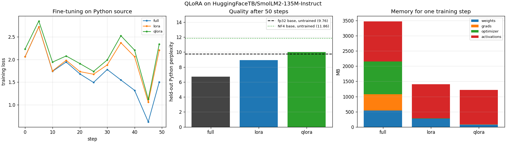

# QLoRA Fine-Tune

---

> [NF4](/shared/glossary/#nf4) derived from first principles rather than copied — the 16 levels come out matching the published [QLoRA](/shared/glossary/#qlora) table to **3e-07** — plus [LoRA](/shared/glossary/#lora), [double quantization](/shared/glossary/#double-quantization) and a byte-by-byte memory model, all written from scratch. The headline result is not the one the paper leads with. On a 135M model, QLoRA's memory saving over plain LoRA is only **1.16x**, because **80% of a LoRA training step is activations, not weights**. Run the same accounting at 7B and it becomes 3.1x, and the ranking flips from "does not fit a 24 GB card" (112 GB) to "fits four times over" (4.70 GB). And the fine-tuning quality tells its own story: after 50 steps the QLoRA run scores **10.03** against the fp32 base's 9.76 — it spent nearly its entire budget undoing the **21.5%** damage NF4 did on the way in.

---

## Key Insight

QLoRA is three tricks stacked, and they pay off in different places. **NF4** shrinks the frozen base 4x. **[LoRA](/shared/glossary/#lora)** shrinks gradients and optimizer state by 146x. **[Double quantization](/shared/glossary/#double-quantization)** shaves 0.37 [bits per weight](/shared/glossary/#bits-per-weight) off the scales. But none of them touches [activations](/shared/glossary/#activations) — and at small model sizes activations *are* the memory. The technique is designed for the regime where weights dominate, and this project measures both regimes so you can see the crossover instead of taking it on faith.

## Why This Matters

Projects 34 through 37 quantized models in order to *serve* them. This one quantizes in order to *train*, which is a strictly harder problem: the quantized weights must still support a useful backward pass. It is also the project that closes the phase, because it uses every piece of it — a non-uniform 4-bit grid, [per-group](/shared/glossary/#per-group-quantization) scales, and an honest accounting of where the bits actually go.

---

**This is project 38.**

### The words first

- **[QLoRA](/shared/glossary/#qlora)** — "Quantized LoRA". Freeze the base model in 4-bit, train small adapters on top in full precision. The 2023 paper that made single-GPU fine-tuning of 65B models possible.
- **[LoRA](/shared/glossary/#lora)** — "Low-Rank Adaptation". Instead of updating a weight matrix `W` directly, learn a correction `B·A` where `A` is `r × in` and `B` is `out × r` with `r` small (16 here). "Low-rank" is the mathematical claim: the update matrix can be written as a product of two thin matrices, i.e. it has rank at most *r*.
- **[NF4](/shared/glossary/#nf4)** — "4-bit NormalFloat". Sixteen levels placed at the *quantiles* of a normal distribution, rather than evenly spaced.
- **Quantile** — the value below which a given fraction of a distribution lies. The median is the 0.5 quantile. Placing levels at quantiles means equally many weights land in each bucket.
- **[Double quantization](/shared/glossary/#double-quantization)** — quantizing the [scaling factors](/shared/glossary/#scaling-factor) themselves. See section B.
- **[Paged optimizers](/shared/glossary/#paged-optimizers)** — QLoRA's third trick, not measured here: keep optimizer state in CPU memory and page it to the GPU on demand, so a memory spike does not crash the run. Irrelevant on a machine with no usable GPU.
- **[Activations](/shared/glossary/#activations)** — the intermediate tensors a forward pass produces. Autograd keeps them alive because the backward pass needs them, and on small models they dominate.
- **[Gradient checkpointing](/shared/glossary/#gradient-checkpointing)** — recompute activations during the backward pass instead of storing them. Not used here; section D explains why every real QLoRA recipe turns it on.

### "The base model is frozen. Why does quantizing it help — nobody is updating those weights anyway?"

Frozen means *not updated*, not *not stored*. The base weights still have to sit in memory and be read on every forward pass, and for a 7B model that is 14 GB in fp16 before you have allocated a single gradient. Section E's table is the point: full fine-tuning of a 7B model needs **112 GB**, LoRA on an fp16 base needs **14.76 GB**, and NF4 takes the same LoRA setup to **4.70 GB**. LoRA alone already fits a 24 GB card; NF4 is what makes it fit with room for a real batch and a long context.

### "Why NF4 instead of the INT4 from project 37 — 16 levels is 16 levels?"

Because *where* you put the 16 levels matters, and [INT4](/shared/glossary/#int4) puts them in the wrong places.

INT4's levels are evenly spaced, which is the right choice when values are uniformly distributed. Neural network weights are not: they pile up near zero and thin out toward the tails, close to a bell curve. Evenly spaced levels therefore spend a lot of their resolution on the tails, where hardly any weights live, and leave the crowded middle coarse.

NF4 places its levels at the quantiles of a standard normal, so each of the 16 buckets receives roughly the same *number of weights*. The buckets are narrow where the weights are dense and wide where they are sparse. Section A measures the payoff: on Gaussian data, **1.37x lower error at identical storage**.

The catch worth stating, because it is the assumption doing all the work: this is only better *if the weights really are roughly normal*. NF4 is a shape fitted in advance, not measured per tensor. It works because trained weights are reliably bell-shaped — and it would be worse than INT4 on a tensor that is not.

### "Sixteen levels, but the grid in section A is lopsided — 8 positive and 7 negative. Is that a bug?"

No, and the asymmetry is deliberate. Sixteen is an even number, so a grid cannot be both symmetric around zero *and* contain zero exactly. QLoRA chooses to keep zero, and spends the asymmetry elsewhere.

Keeping an exact zero matters more than the symmetry does: padding, masks and pruned weights are exactly 0.0 and occur in enormous numbers, so a grid that could only *approximate* zero would give each of them a small systematic bias that accumulates through the network. Compare the [zero-point](/shared/glossary/#zero-point) discussion in [project 37](../37-per-channel-vs-per-tensor/README.md) — same concern, different mechanism.

### "Section C already prints seconds per step. Why does section D2 measure it again?"

Because the section C numbers cannot be trusted, and section D2 is how you find that out.

Section C trains the three modes one after another, so each is timed under whatever else the machine happened to be doing at that moment. This machine is shared with other work whose load moves on a scale of minutes. Three runs of this identical code reported full fine-tuning at **4.47**, **13.66** and **2.57** s/step — and in the middle run the sequential numbers put LoRA (8.82) *faster* than full fine-tuning (13.66) only because full fine-tuning ran first, while the load was climbing.

Section D2 builds all three models and times one step of each **round-robin**, several rounds, reporting each mode's minimum. Interleaving spreads any interference across all three; taking the minimum reports the round that was interfered with least, which is the honest estimate because a step can only be slowed down, never sped up. Its ratios came out at 0.64x and 0.59x under heavy load and 0.64x and 0.61x on a quiet machine — stable, while the sequential numbers moved by 5x.

In the run committed here the machine happened to be quiet, so sections C and D2 agree (2.57 vs 2.22). **That agreement is the good case, not the guarantee** — and you only know which case you are in if you measure both ways.

---

## Running it

```bash
python run.py            # ~6 min on an idle machine
python run.py --plot     # redraw the figure from the committed findings.json
```

Needs `torch`, `transformers`, `pandas`, `huggingface_hub`, `matplotlib`, and `quantlib.py` from [project 34](../34-quantize-a-small-llm/README.md). `nf4.py` here is standalone and contains the NF4 derivation, double quantization, `LoRALinear`, and the activation-byte counter.

**Why a smaller model here.** The guide asks for a 7B model on a 24 GB GPU. There is no usable GPU on this machine, so 7B is not a memory problem but a *time* problem — one training step at 7B on 12 CPU threads would take minutes. This project therefore fine-tunes SmolLM2-135M and does the 7B version as **arithmetic** in section E, clearly labelled as such. Everything measured is measured; everything extrapolated says so.

> **About the numbers.** Everything below comes from the committed
> [`outputs/findings.json`](outputs/findings.json),
> [`outputs/findings.csv`](outputs/findings.csv) and
> [`outputs/run.log`](outputs/run.log).



---

## A. Deriving the NF4 grid

Rather than copying the sixteen constants out of the paper, `nf4.py` builds them: take 8 quantiles of a standard normal on the positive side, 7 on the negative side, add an exact 0.0, and normalize so the outermost level is ±1.

```
-1.0000, -0.6962, -0.5251, -0.3949, -0.2844, -0.1848, -0.0910, +0.0000,
+0.0796, +0.1609, +0.2461, +0.3379, +0.4407, +0.5626, +0.7230, +1.0000
```

Maximum difference from the published QLoRA table: **2.98e-07** — i.e. the float32 rounding of the same numbers. The derivation is the check.

Look at the spacing. Between 0 and 0.16 there are three levels; between 0.72 and 1.00 there is one. That is the whole idea, made visible.

| quantizer, blocks of 64 | relative MSE on Gaussian data |
|---|---:|
| INT4 (evenly spaced) | 0.01160 |
| **NF4 (quantile-spaced)** | **0.00846** |

**1.37x lower error for exactly the same 4 bits.** Not a huge factor — but it is free, it requires no calibration data, and it stacks with everything else in this phase.

---

## B. What NF4 costs to store, honestly

| scheme | bits per weight |
|---|---:|
| NF4, one FP32 scale per 64 weights | **4.500** |
| NF4 + double quantization (INT8 scales, blocks of 256) | **4.127** |

That first row is the number people forget. "4-bit" with a block size of 64 and an fp32 scale is really **4.5 bits** — the scales are *one ninth of the file*. [Double quantization](/shared/glossary/#double-quantization) stores those scales as INT8 with their own much rarer fp32 scale, taking the overhead from 0.5 bits to 0.127.

And it is nearly free in quality. Measured on one real weight matrix:

| | mean squared error |
|---|---:|
| NF4, fp32 scales | 3.431e-04 |
| NF4, double-quantized scales | 3.436e-04 |
| **cost** | **+0.15%** |

**0.373 bits per weight for a 0.15% error increase.** On this 135M model that is 5.0 MB; on a 65B model it is about 3 GB, which in 2023 was the difference between fitting on a 48 GB card and not.

---

## C. Three ways to fine-tune the same model

50 steps on Python source from the standard library, batch 2 × 256 tokens. The starting points:

| | held-out Python perplexity |
|---|---:|
| fp32 base, untrained | **9.762** |
| NF4 base, untrained | **11.860** (+21.5%) |

That second row is the tax QLoRA pays before it starts. The adapter's first job is not to learn Python; it is to climb back out of the hole NF4 dug.

| mode | trainable params | share | perplexity after | memory |
|---|---:|---:|---:|---:|
| full fine-tune | 134.515 M | 100% | **6.706** | 3,479.8 MB |
| LoRA (fp32 base) | 0.922 M | 0.68% | 8.943 | 1,410.3 MB |
| QLoRA (NF4 base) | 0.922 M | 0.68% | 10.030 | **1,217.0 MB** |

**Full fine-tuning wins decisively on quality at this scale**, and that is expected rather than a failure of LoRA. A 135M model has little redundant capacity, so restricting the update to rank 16 on the query and value projections gives up a lot. The gap narrows as models grow — LoRA's whole premise is that a large pretrained model's useful update is low-rank — but this measurement cannot show that, and it would be dishonest to imply otherwise.

**QLoRA's number needs its starting point to be read with it.** 10.030 is worse than the untrained fp32 model (9.762), which looks like a failure until you notice where it began: 11.860. The adapter recovered **87%** of the NF4 damage in 50 steps and 25,600 tokens. What it did *not* have budget left for was learning Python. Give it the thousands of steps a real fine-tune uses and the quantization penalty is amortised — that is the claim QLoRA's paper supports at scale, and this run shows the first 87% of it happening.

---

## D. Where the memory actually goes

Every byte a training step needs, by category. Weights are counted at the width a real deployment would store them (4.5 bits for NF4, 16 for an fp16 LoRA base, fp32 for anything trained); activations are **measured**, by hooking the tensors autograd stashes for the backward pass.

| mode | weights | grads | optimizer | activations | total |
|---|---:|---:|---:|---:|---:|
| full | 538.1 MB | 538.1 MB | 1,076.1 MB | 1,327.6 MB | **3,479.8 MB** |
| LoRA | 272.7 MB | 3.7 MB | 7.4 MB | 1,126.6 MB | **1,410.3 MB** |
| QLoRA | 79.4 MB | 3.7 MB | 7.4 MB | 1,126.6 MB | **1,217.0 MB** |

**LoRA's real trick is the optimizer, not the weights.** [AdamW](/shared/glossary/#adamw) keeps two fp32 moments per trainable parameter, so full fine-tuning pays 1,076 MB of optimizer state plus 538 MB of gradients — 1.6 GB, more than the weights themselves. Training 0.68% of the parameters takes that to 11.1 MB, a **146x** reduction. This is why "parameter-efficient" methods save so much more than their parameter count suggests: each trainable parameter costs 4 bytes of weight, 4 of gradient and 8 of optimizer state, so removing one removes 16 bytes, not 4.

**And here is the result that does not appear in the paper's headline.** QLoRA over LoRA is only **1.16x** at this size, because **80% of a LoRA step (1,126.6 of 1,410.3 MB) is activations**, and NF4 does not touch activations at all. The frozen weights are already the smaller half of the problem.

That ratio is a function of model size, and it inverts. Activations scale with batch × sequence length × hidden size; weights scale with the *square* of hidden size. Which is exactly why section E looks different — and why every production QLoRA recipe also enables [gradient checkpointing](/shared/glossary/#gradient-checkpointing), which attacks the red bar in the figure that NF4 cannot reach.

---

## D2. Step time, measured round-robin

| mode | s/step (min of 4 interleaved rounds) | vs full | section C, sequential |
|---|---:|---:|---:|
| full fine-tune | **2.22** | 1.00x | 2.57 |
| LoRA | **1.42** | **0.64x** | 1.43 |
| QLoRA | **1.35** | **0.61x** | 1.46 |

**Training 0.68% of the parameters makes the step 1.6x faster, not 100x faster.** The backward pass still walks through every frozen layer, because the *input* gradients of layer *n* are what layer *n−1* needs — freezing a weight removes the work of computing that weight's gradient, not the work of propagating through it. What LoRA actually removes is the weight-gradient matmul and the optimizer update, which is about a third of the step. If you were expecting parameter-efficient fine-tuning to be dramatically faster, this is the number that corrects the expectation: it is a *memory* technique that happens to save a third of the compute.

The last column is the same quantity measured sequentially, and in this run it agrees. It does not always. An earlier run of this identical script, on the same machine while a co-tenant workload was ramping up, reported **13.66 / 8.82 / 4.82** sequentially — putting the modes in the wrong order and overstating full fine-tuning by 5x — while the interleaved measurement in the same run still gave 1.00x / 0.64x / 0.59x. On a shared machine, **a sequential A-then-B timing is not a measurement**; interleaving and taking minima is the cheapest thing that turns it into one.

---

## E. The same accounting at 7B, as arithmetic

The section D model, evaluated for a 7-billion-parameter model with the same 0.68% adapter ratio. **These numbers are computed, not measured** — no 7B model was run on this machine.

| mode | weights + grads + optimizer | fits a 24 GB card? |
|---|---:|---|
| full fine-tune | **112.00 GB** | no — and not on four of them either |
| LoRA (fp16 base) | 14.76 GB | yes |
| **QLoRA (NF4 base)** | **4.70 GB** | yes, with 19 GB left for activations and batch |

Read the two ends together. Full fine-tuning a 7B model in fp32 with AdamW needs 16 bytes per parameter — 4 for the weight, 4 for the gradient, 8 for the two optimizer moments — which is 112 GB and requires a multi-node setup ([project 30](../30-fsdp-scaling/README.md) is about exactly that). QLoRA needs 4.70 GB, and the 19 GB it leaves over is what lets you train at a useful batch size and sequence length rather than merely start.

Note also what changed between sections D and E. At 135M, QLoRA saved 1.16x over LoRA; at 7B it saves **3.14x**. The technique gets *better* the bigger the model, because the weights it shrinks grow quadratically while the activations it ignores grow linearly. Small-scale experiments systematically understate it — worth knowing before you dismiss a method after testing it on a toy.

---

## What to take away

1. **The NF4 grid can be derived, and matches the published table to 3e-07.** Its 16 levels are quantiles of a normal distribution, which buys **1.37x** lower error than evenly spaced INT4 at identical storage.
2. **The grid is deliberately lopsided** — 8 positive, 7 negative, one exact zero — because an even number of levels cannot be both symmetric and contain zero, and zero is worth more.
3. **"4-bit" with block 64 is really 4.5 bits.** Double quantization takes it to 4.127 for a 0.15% error increase.
4. **LoRA's saving is dominated by optimizer state, not weights**: 1.6 GB → 11.1 MB, a 146x reduction, because each trainable parameter costs 16 bytes and not 4.
5. **At 135M, QLoRA beats LoRA by only 1.16x**, because 80% of the step is activations. At 7B it is 3.14x. Measure the regime you intend to use.
6. **NF4 costs 21.5% perplexity up front**, and 50 steps of adapter training recovered 87% of it. Quantized fine-tuning starts in a hole.
7. **Full fine-tuning wins on quality at this scale** (6.71 vs 8.94 vs 10.03). LoRA's premise is about large models; do not read a 135M result as a verdict on it.
8. **Parameter-efficient is only 1.6x compute-efficient.** The backward pass still traverses every frozen layer.
9. **On a loaded machine, sequential timings of the same script overstated one mode by 5x and reversed the ordering**, while the interleaved measurement held steady. Interleave, and take minima — and note that the committed run here is the *quiet* case where both agree.

---

## What to try next

- Turn on [gradient checkpointing](/shared/glossary/#gradient-checkpointing) and re-run section D. It should collapse the activation bar — the one part of the memory model NF4 cannot touch — and cost about 30% more time.
- Sweep the LoRA rank (4, 16, 64) and the target modules (`q,v` versus all seven projections) against the section C perplexities. Rank is the knob that trades LoRA's memory win for quality.
- Fit the NF4 grid to the *actual* distribution of one model's weights instead of assuming a normal, and see whether the 1.37x grows. That is a direct test of the assumption NF4 rests on.
- Merge the trained adapter into the base (`W + B·A`) and confirm the merged model gives identical outputs. That merge is what makes LoRA free at inference time, and it is an easy place to introduce a bug.

---

## Phase 7, closed

Six projects, one argument.

[Project 33](../33-format-sweep/README.md) took every format apart to its bits and found that precision fails gently while **range fails catastrophically** — 93.3% of gradients flushed to zero in FP8, fixed by one multiplication. [Project 34](../34-quantize-a-small-llm/README.md) quantized a real LLM and found that **granularity beat the algorithm** (1.71x vs 1.59x), then found the winner on perplexity losing MMLU by 9.4 points. [Project 35](../35-kv-cache-quantization/README.md) moved to the tensor that grows with the conversation and found the same 4 bits worth **13.31 or 92.65** depending on which axis the scales followed. [Project 36](../36-calibration-data-study/README.md) interrogated the one input GPTQ needs and found that **too little of it, or the wrong kind, is worse than none at all**. [Project 37](../37-per-channel-vs-per-tensor/README.md) turned the granularity knob to both stops — per-tensor INT4 scoring **83 million** — and then found the whole ladder costs nothing at inference time. And this project stacked a non-uniform grid, low-rank adapters and quantized scales into a training recipe, and measured the part the paper does not headline: **at small scale the saving mostly is not there, and it grows 2.7x by 7B**.

The through-line: **a quantized number is only as good as the scale next to it, and almost every result in this phase is decided by how many numbers share one.** Bit width is the knob everyone reaches for; granularity is the one that moves.

Next: [Phase 8 — Inference Systems and Serving](../../README.md#phase-8-inference-systems-and-serving), where these smaller numbers finally have to answer to a latency budget.
