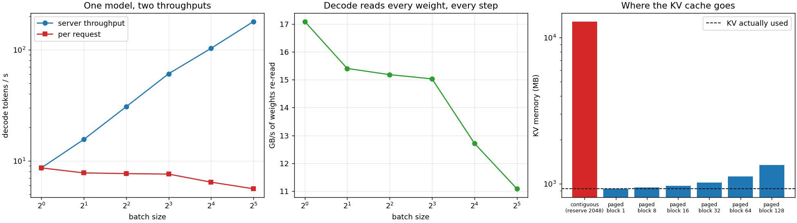

# Deploy with vLLM

---

> The real [vLLM](/shared/glossary/#vllm) installs here — a 313 MB wheel — and dies on the first line that touches the GPU, because this machine's card is eight years too old. So this project builds the engine instead: a 300-line serving loop with a [paged](/shared/glossary/#pagedattention) [KV cache](/shared/glossary/#kv-cache), verified token-for-token against Hugging Face, and then measured. Batch 32 moves **20.8x** more tokens per second than batch 1 while each individual user gets slower by only **1.54x**. That is the whole economics of LLM serving in one line — and the reason is visible in the numbers: [prefill](/shared/glossary/#prefill) runs at **509.6 GFLOP/s**, 77% of this machine's matmul ceiling, while [decode](/shared/glossary/#decode) at batch 1 reaches **8.5 GFLOP/s** and instead saturates memory at **17.1 GB/s**, 62% of the bandwidth ceiling. Same model, same code, two completely different machines.

---

## Key Insight

Serving large language models requires optimizing memory allocation for dynamic sequence lengths. By deploying a model using [vLLM](/shared/glossary/#vllm), this project demonstrates how [PagedAttention](/shared/glossary/#pagedattention) prevents physical memory fragmentation of the [KV cache](/shared/glossary/#kv-cache). Measuring throughput across various batch sizes reveals how amortizing weight loads from [HBM (High-Bandwidth Memory)](/shared/glossary/#hbm) over concurrent requests increases overall generation efficiency.

## Why This Matters

Phase 7 made the model smaller. Phase 8 asks the question that pays for the hardware: *how many people can talk to it at once, and how long do they wait?* Every serving system since 2022 is an attack on the same wall — the weights have to come out of memory faster than memory can deliver them — and this project builds the smallest thing that can measure that wall from both sides.

---

**This is project 39.**

### The words first

- **[Serving](/shared/glossary/#serving)** — running a trained model as a service: requests arrive, tokens come back. Different from *inference* in the lab sense, because now latency, concurrency and memory limits are the whole problem.
- **[Prefill](/shared/glossary/#prefill)** — the first forward pass over the user's prompt. All prompt tokens are processed *at once*, so it is one big matrix multiply.
- **[Decode](/shared/glossary/#decode)** — generating the reply, one token at a time. Each step is a *tiny* matrix multiply that still has to read every weight in the model.
- **[KV cache](/shared/glossary/#kv-cache)** — the keys and values computed for every token so far, kept so that each new token does not have to re-read the whole conversation. It grows with every token generated.
- **[PagedAttention](/shared/glossary/#pagedattention)** — vLLM's idea: store the KV cache in fixed-size **blocks** (pages) scattered anywhere in memory, and keep a [block table](/shared/glossary/#block-table) per sequence saying which block holds which positions. Borrowed directly from how an operating system does [virtual memory](/shared/glossary/#virtual-memory).
- **[Block table](/shared/glossary/#block-table)** — the little array that maps *logical* position → *physical* block. The indirection is what lets sequences of wildly different lengths share one pool without leaving holes.
- **[Fragmentation](/shared/glossary/#fragmentation)** — memory that is allocated but unusable. *Internal*: you reserved a whole block and only filled part of it. *External*: the free memory exists but not in one contiguous piece.
- **[Throughput](/shared/glossary/#throughput)** — tokens per second produced by the server, adding up all users.
- **[Roofline](/shared/glossary/#roofline)** — the model from [Phase 1](../02-roofline-by-hand/README.md): a kernel's speed is capped either by arithmetic or by memory bandwidth, whichever ceiling it hits first.

### "vLLM is a Python package. Why would it care what GPU I have?"

Because almost none of vLLM is Python. The wheel ships compiled [CUDA](/shared/glossary/#cuda) kernels — paged attention, fused layers, quantized matmuls — and a compiled kernel is built for specific GPU generations, identified by a *[compute capability](/shared/glossary/#compute-capability)* number like `sm_80`. A GPU whose number is not in the binary cannot run it, in the same way an ARM laptop cannot run an x86 executable.

This machine has a GTX 1070 Ti: compute capability **6.1**, from 2017. The bundled PyTorch lists `sm_70 sm_75 sm_80 sm_86 sm_90 sm_100 sm_120`. Not 6.1. Startup gets exactly as far as the first allocation:

```
torch.AcceleratorError: CUDA error: no kernel image is available for execution on the device
   at vllm/v1/worker/gpu/buffer_utils.py:137  ->  torch.zeros(size, dtype, device)
```

Forcing it onto the CPU with `CUDA_VISIBLE_DEVICES=` does not help either — the CUDA wheel has no CPU code path at all:

```
AssertionError: DP adjusted local rank 0 is out of bounds for 0 devices.
```

The full transcript is in [`outputs/vllm_attempt.log`](outputs/vllm_attempt.log). This is not a workaround story; it is the phase's ground truth. **Every number in projects 39–44 comes from an engine we can read, on hardware we can measure.**

### "If we are writing our own engine anyway, why bother matching Hugging Face's output exactly?"

Because otherwise every measurement afterwards is unfalsifiable. A serving engine is easy to make fast and wrong: skip a rotation, mask one position incorrectly, mix up two sequences in a batch, and it still emits fluent text — just not *this model's* text.

Section B therefore runs both stacks on the same prompt and compares. The largest disagreement in the raw [logits](/shared/glossary/#logits) is **2.5e-05** (relative **1.2e-06**, i.e. fp32 rounding noise), and the eight [greedy](/shared/glossary/#greedy-decoding) tokens are identical. After that, when the engine says 180 tokens/second, it is 180 tokens/second *of the right tokens*.

### "The KV cache is already a tensor. Why add blocks and a block table on top — isn't that just a slower way to index it?"

It is a slower way to index it, and that is the trade being made on purpose.

The straightforward implementation gives every sequence one contiguous slab sized for the longest reply it *might* produce. That slab is reserved when the request arrives and freed when it finishes, so a request that stops after 40 tokens still holds a 2048-token slab. Section D measures this on a realistic mix of 256 requests: **12,885 MB reserved for 926 MB of real cache — 1,291% waste.**

Paging fixes it by allocating in small fixed blocks (16 tokens each) as the sequence actually grows. Waste drops to **4.6%**, and the same memory now holds **13.3x** more requests. The cost is one level of indirection: the attention kernel must look up each block's address instead of walking a straight line. vLLM pays that cost *inside* a custom CUDA kernel, where it is nearly free. We have no such kernel, so we pay it as an explicit gather — and section D measures that too: **16–19% of a decode step**. Worth knowing, because it is the honest price of the abstraction, and it is the part that a GPU kernel makes disappear.

### "Why does batching help so much? The GPU still has to do 32 times the arithmetic."

It does — and the arithmetic was never the problem.

Generating one token with a 0.5B model in fp32 requires reading **1.98 GB** of weights out of memory and doing about 1 GFLOP of arithmetic with them. This machine can do 658 GFLOP/s but only stream 27.5 GB/s. That read alone accounts for ~72 ms of the measured 115.7 ms step; the arithmetic would take ~1.5 ms. The processor spends almost the whole step waiting for memory.

Now serve 32 users at once. The weights are read **once** and used for all 32 tokens. The arithmetic grows 32x — to about 48 ms — but it was hiding under the memory time anyway. Measured: the step goes from 115.7 ms to 178.2 ms (1.54x) while producing 32x the tokens. That is the whole trick, and it is why serving engines fight so hard to keep the batch full — which is [project 44](../44-continuous-batching-demo/README.md).

---

## Running it

```bash
python run.py            # ~1 min on an idle machine
python run.py --plot     # redraw the figure from the committed findings.json
```

Needs `torch`, `transformers`, `huggingface_hub` and `matplotlib`. `servelib.py` in this directory is the engine, and [projects 40–44](../40-latency-vs-throughput/README.md) import it.

**Why a 0.5B model and not the 7B the guide asks for.** With no usable GPU, a 7B model would need ~28 GB of fp32 weights read *per decode step*, i.e. more than a second per token. Qwen2.5-0.5B-Instruct keeps a full experiment under a minute while preserving every structure that matters: [GQA](/shared/glossary/#gqa) with 2 KV heads, 24 layers, a real tokenizer. Where a 7B or an H100 number is quoted, it is arithmetic, and it says so.

> **About the numbers.** Everything below comes from the committed
> [`outputs/findings.json`](outputs/findings.json),
> [`outputs/findings.csv`](outputs/findings.csv),
> [`outputs/run.log`](outputs/run.log) and
> [`outputs/vllm_attempt.log`](outputs/vllm_attempt.log).



---

## A. The engine, in one page

The whole serving loop is three ideas.

**One pool of blocks.** Per layer, the cache is a tensor of shape `(num_blocks, 16, kv_heads, head_dim)`. A sequence owns a *list* of block ids. Logical position `p` lives at block `table[p // 16]`, slot `p % 16`. Allocation is `list.pop()`; freeing is `list.extend()`. That is the entire memory manager.

**Ragged batches.** Every sequence in a step may contribute a different number of new tokens — 64 for a prompt being prefilled, 1 for a reply being decoded. They are concatenated into one flat `(total_tokens, hidden)` tensor, so the seven big matrices per layer are multiplied **once** for the whole batch. This is where batching pays.

**Attention per sequence, everything else per batch.** Attention cannot be shared across sequences (each one attends only to itself), so the block tables are used to gather each sequence's keys and values into a padded tensor and one masked [SDPA](/shared/glossary/#fscaled_dot_product_attention) call runs the batch.

For the KV cache the per-token cost is exact and worth memorising:

```
bytes/token = 2 (K and V) × layers × kv_heads × head_dim × bytes
            = 2 × 24 × 2 × 64 × 4  =  24,576 B/token   (this model, fp32)
```

[Project 41](../41-kv-cache-memory-math/README.md) does nothing but chase the consequences of that line.

---

## B. Does it agree with Hugging Face?

| check | result |
|---|---|
| max abs difference in final [logits](/shared/glossary/#logits) | **2.46e-05** |
| relative difference (L2) | **1.20e-06** |
| 8 greedy tokens identical | **yes** |
| text | `" Paris. It is the largest city in"` |

Two details that cost a debugging cycle each, and will cost you one too:

**Do not verify against `model.generate()`.** Qwen ships a `generation_config.json` with `repetition_penalty=1.05`, which is applied even when `do_sample=False`. The reference here is a plain greedy loop over Hugging Face's own modules, so both sides implement the same algorithm.

**A fully-masked attention row produces NaN, not zero.** When a ragged batch is padded, padding rows have nothing they are allowed to attend to; softmax over an all-`-inf` row divides by zero. The engine lets those rows see one slot they will never use, and slices them off afterwards. The NaN never exists.

---

## C. Serving it

The engine is wrapped in a 30-line `http.server` endpoint, because "deploy" should mean a request goes over a socket:

```
POST /generate {"prompt": "The capital of France is", "max_tokens": 12}
-> {"text": " Paris. It is the largest city in Europe and the third",
    "latency_s": 1.29}
```

Then the measurement the guide asks for — tokens/second across batch sizes, prompt 64 tokens, 24 generated:

| batch | prefill tok/s | decode tok/s | per request | step | weights re-read | gather |
|---|---|---|---|---|---|---|
| 1 | 332 | **8.65** | 8.65 | 115.7 ms | 17.1 GB/s | 4.0% |
| 2 | 378 | 15.59 | 7.79 | 128.3 ms | 15.4 GB/s | 2.5% |
| 4 | 468 | 30.73 | 7.68 | 130.2 ms | 15.2 GB/s | 3.0% |
| 8 | 508 | 60.84 | 7.61 | 131.5 ms | 15.0 GB/s | 4.0% |
| 16 | 516 | 102.96 | 6.44 | 155.4 ms | 12.7 GB/s | 3.5% |
| 32 | 493 | **179.56** | 5.61 | 178.2 ms | 11.1 GB/s | 3.6% |

**20.8x the throughput for 1.54x the step time.** Between batch 1 and 8 the step time barely moves at all (115.7 → 131.5 ms) — those seven extra users are served in the gaps of a memory stall that was happening anyway.

**The two phases hit two different ceilings.** This machine measures 658.4 GFLOP/s of fp32 matmul and 27.5 GB/s of streaming reads. Prefill peaks at **509.6 GFLOP/s = 77% of the compute roof**. Decode at batch 1 reaches **8.5 GFLOP/s — 1.3% of that roof** — while re-reading weights at **17.1 GB/s = 62% of the memory roof**. Same weights, same kernels, opposite bottlenecks. This is the [prefill/decode asymmetry](../../README.md#the-prefilldecode-asymmetry) in measured numbers, and every technique in this phase exists because of it.

**Why does prefill throughput sag at batch 32?** 2048 tokens at once no longer fit comfortably in cache, so the big matmuls start missing. This is the [L2 cliff from project 14](../14-hbm-saturation/README.md) arriving in a serving benchmark.

---

## D. Where the KV cache actually goes

256 requests with realistic, uneven lengths (log-normal, mean 147 tokens, capped at 2048) need **926 MB** of KV cache in total. What different allocators charge for that:

| allocation | reserved | waste |
|---|---|---|
| contiguous, reserve 2048 per request | **12,885 MB** | **1,291%** |
| paged, block 1 | 926 MB | 0.0% |
| paged, block 8 | 947 MB | 2.3% |
| **paged, block 16** (vLLM's default) | **969 MB** | **4.6%** |
| paged, block 32 | 1,018 MB | 9.9% |
| paged, block 64 | 1,123 MB | 21.3% |
| paged, block 128 | 1,346 MB | 45.4% |

Read the top two rows together: paging with block 16 fits **13.3x more requests in the same memory**, and the entire saving comes from *not reserving for a future that usually does not happen*. Turned into seats: 1 GB of KV holds **19** contiguous 2048-token slots, or about **276** paged requests of this length mix.

The rest of the table is the block-size trade, and it has two sides:

- **Bigger blocks waste more.** The waste is *internal fragmentation* — the unused tail of the last block. On average half a block per sequence, so waste ≈ `block_size / (2 × mean_length)`, which is 5.4% predicted at block 16 against 4.6% measured.
- **Smaller blocks cost more bookkeeping.** Block tables get longer and gathers get more scattered. Measured, decode at batch 16 with a 512-token context:

| block size | gather | step | gather share |
|---|---|---|---|
| 8 | 32.1 ms | 201.5 ms | 16.0% |
| 16 | 37.3 ms | 211.1 ms | 17.7% |
| 64 | 35.9 ms | 207.2 ms | 17.3% |
| 128 | 39.9 ms | 216.2 ms | 18.5% |

On this CPU the curve is nearly flat — the differences are inside the noise of a shared machine — which is itself the finding: **the block size is chosen for memory, not for speed.** 16 sits where waste is already small and tables are still short.

**And notice what the gather column costs at all: 16–19% of every decode step.** That is the price of *not* having a paged-attention kernel. vLLM's contribution was not the block table — operating systems have had those since the 1960s — it was writing an attention kernel that reads the block table directly, so the indirection costs nothing.

---

## What to take away

1. **The real vLLM installs and cannot start here** — compute capability 6.1 versus a binary built for 7.0+. Compiled kernels are hardware contracts, not portability suggestions.
2. **A from-scratch engine matching Hugging Face to 2.5e-05 makes every later number trustworthy.** Verify before you optimise.
3. **Batch 32 gives 20.8x the throughput for 1.54x the latency.** Decode is memory-bound, so extra users ride along in the stall.
4. **Prefill hits 77% of the compute roof; decode hits 62% of the memory roof at 1.3% of the compute roof.** One model, two machines.
5. **Reserving the maximum length per request wastes 1,291%.** Paged blocks of 16 take that to 4.6% and fit 13.3x more requests.
6. **Block size trades internal fragmentation against bookkeeping**, and on this hardware only the fragmentation side is measurable.
7. **The block-table gather costs 16–19% of a decode step in Python.** The idea is free; the kernel is the work.

---

## What to try next

- Raise `PROMPT_LEN` to 512 and re-run section C. Prefill stays flat and decode gets slower, because the KV gather now dominates — the same effect [project 40](../40-latency-vs-throughput/README.md) sweeps properly.
- Implement [prefix caching](/shared/glossary/#prefix-cache): give two sequences with the same prompt the *same* block ids for the shared part. The block table makes this a five-line change, and it is where paging pays a second time.
- Add an eviction policy. When the pool runs out, a real engine preempts a sequence (drops its blocks and re-prefills it later). Measure what that costs versus refusing the request.
- Store the pool in fp16 and check the bytes-per-token line halves. Then read [project 35](../35-kv-cache-quantization/README.md) again for what INT4 does to it.

---

Next: [project 40 — Latency vs throughput](../40-latency-vs-throughput/README.md), which takes this batch-size sweep and asks which point on it a product should actually run at.
