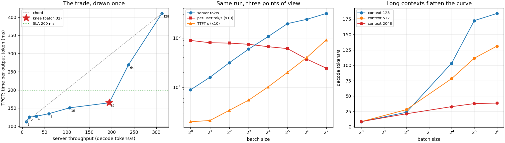

# Latency vs Throughput

---

> The same server, the same model, the same eight runs — read three ways. Throughput climbs **35x** from batch 1 to batch 128 while each individual user's token rate falls **3.6x** and the wait for the first token grows from 0.20 s to **9.09 s**. The geometric "knee" of the curve lands at batch 32, and so does a 200 ms latency budget — but that agreement is a coincidence, and the [SLA](/shared/glossary/#sla) table proves it: tightening the promise from 200 ms to **130 ms** per token costs **84% of the throughput** (194 → 31 tokens/s), and a 110 ms promise cannot be met at *any* batch size. And the whole curve moves when the conversations get longer: at a 2048-token context, going from batch 32 to 64 buys **2.4%** instead of **6.8%**, because by then the [KV cache](/shared/glossary/#kv-cache), not the weights, is what the hardware is reading.

---

## Key Insight

Large language model serving exhibits a fundamental trade-off between user-perceived response times and server processing efficiency. While a small batch size minimizes [TTFT (Time To First Token)](/shared/glossary/#ttft) and [ITL / TPOT](/shared/glossary/#itl--tpot), larger batches increase the system's [throughput](/shared/glossary/#throughput) at the cost of higher individual latency. Plotting this relationship helps identify the optimal operational point, or "knee," where hardware utilization is maximized without violating latency [SLA (Service Level Agreement)](/shared/glossary/#sla) budgets.

## Why This Matters

[Project 39](../39-deploy-with-vllm/README.md) showed that batching is nearly free. "Nearly" is where the money and the complaints live. This project turns one throughput curve into the three numbers a serving team is actually judged on — tokens/s billed, seconds until something appears on screen, and how fast the text then flows — and shows how to pick an operating point without fooling yourself.

---

**This is project 40.**

### The words first

- **[TTFT](/shared/glossary/#ttft)** — *time to first token*. From the moment the request arrives to the first visible character. Dominated by [prefill](/shared/glossary/#prefill) and by any time spent queueing.
- **[TPOT](/shared/glossary/#itl--tpot)** — *time per output token*, also called ITL (*inter-token latency*). How fast text flows once it starts. A user reads at roughly 5–10 tokens/s, so 100–200 ms per token is the comfort zone.
- **TBT** — *time between tokens*, the same quantity measured per gap rather than averaged. It matters separately because a stall is felt even when the average is fine.
- **[Throughput](/shared/glossary/#throughput)** — tokens per second across *all* users. This is what a GPU-hour buys.
- **[Goodput](/shared/glossary/#goodput)** — throughput counting only the requests that met their latency target. A server running at 300 tokens/s while violating every promise has a goodput of zero.
- **[SLA / SLO](/shared/glossary/#sla)** — the promise ("95% of requests get a token every 200 ms") and the internal objective behind it.
- **Knee** — the point on a curve where a small extra gain starts to cost a lot extra. Found here with **Kneedle** (Satopää et al., 2011): rescale both axes to [0, 1], draw the straight line between the endpoints, and take the point furthest from it. The rescaling matters — without it "furthest" just means "measured in the bigger unit".

### "If a bigger batch makes the server faster, why does it make the user slower? Nobody is waiting on anyone else's tokens."

They are, and in two different ways.

**Every step is shared.** All 32 sequences in a batch advance one token together, so a step is only finished when the slowest part of it is. Step time grows from 112.5 ms at batch 1 to 410.1 ms at batch 128, so the user's tokens arrive at 1/410 s instead of 1/112 s: **2.44 tok/s instead of 8.89**. Nobody is idle, but everyone is sharing.

**Prefill is not shared at all.** Prefill is [compute-bound](/shared/glossary/#compute-bound) ([project 39](../39-deploy-with-vllm/README.md) measured it at 77% of this machine's matmul ceiling), so processing 128 prompts really does cost 128 times as much arithmetic as one. TTFT rises almost perfectly linearly: **0.20 s → 9.09 s, 45x**. This is the asymmetry that surprises people: batching buys decode throughput and buys *nothing at all* in prefill, which is exactly why real systems separate the two ([chunked prefill](/shared/glossary/#chunked-prefill), [disaggregated serving](/shared/glossary/#disaggregated-serving)).

### "The knee and the SLA both said batch 32. So why not just use the knee?"

Because they agreed by accident, and one of them is a fact about your product while the other is a fact about a curve.

The knee is where the curve bends — a property of the hardware and the model. The right operating point is where your promise sits, and if the promise moves, the answer moves with it:

| TPOT budget | batch | server tok/s | per user |
|---|---|---|---|
| 110 ms | **none** | 0 | — |
| 130 ms | 4 | 31 | 7.8 tok/s |
| 150 ms | 8 | 59 | 7.4 tok/s |
| **200 ms** | **32** | **194** | **6.1 tok/s** |
| 300 ms | 64 | 238 | 3.7 tok/s |
| 500 ms | 128 | 312 | 2.4 tok/s |

The first row is the most instructive: **at 110 ms no batch size works at all**, because a single-user step already takes 112.5 ms. A budget below the batch-1 latency is not a scheduling problem — no amount of tuning fixes it, and the answer is a smaller model, a faster machine or a looser promise. From there a **16%** looser budget (130 → 150 ms) buys **1.9x** the throughput, 150 → 200 ms buys **3.3x** more, and past 200 ms the trade turns bad: +50% latency for +23% throughput. **The steep part of that table is where product decisions are worth the most money**, and no amount of curve geometry can tell you where on it to stand.

### "Why measure goodput at all? It looks like throughput with extra steps."

Because throughput alone rewards exactly the wrong behaviour. Batch 128 has the best throughput in the table (312 tok/s) and violates the 200 ms promise for every user in it. Scored as goodput — throughput counting only SLA-compliant requests — it is **zero**, and batch 32 wins with 194. Goodput is what turns "our GPU utilisation is up" into a number a product owner can argue with.

### "Section C reuses caches that were never filled by a real prompt. Isn't that cheating?"

It is a deliberate shortcut, and it is safe for exactly one purpose: timing. A decode step's cost depends on the *shapes* of the tensors — batch, context length, layer count — not on the numbers inside them. Filling 64 caches with 2048 real tokens would mean prefilling 131,072 tokens, four minutes of work, to measure something that does not depend on the result. So `synthetic_seqs` allocates the blocks, sets the length, and leaves the contents at zero.

The rule that comes with the shortcut: **never use those sequences for anything but timing.** Their outputs are meaningless. Every quality number in this phase comes from a real prefill.

---

## Running it

```bash
python run.py            # ~70 s on an idle machine
python run.py --plot     # redraw the figure from the committed findings.json
```

Needs `torch`, `transformers`, `matplotlib` and `servelib.py` from [project 39](../39-deploy-with-vllm/README.md).

> **About the numbers.** Everything below comes from the committed
> [`outputs/findings.json`](outputs/findings.json),
> [`outputs/findings.csv`](outputs/findings.csv) and
> [`outputs/run.log`](outputs/run.log).



---

## A. One sweep, three points of view

Prompt 32 tokens, 16 tokens generated, Qwen2.5-0.5B in fp32 on 12 CPU threads:

| batch | TTFT | TPOT | per-user tok/s | server tok/s | 200 ms SLA |
|---|---|---|---|---|---|
| 1 | 0.20 s | **112.5 ms** | 8.89 | 8.9 | ok |
| 2 | 0.21 s | 125.4 ms | 7.98 | 16.0 | ok |
| 4 | 0.34 s | 127.5 ms | 7.84 | 31.4 | ok |
| 8 | 0.55 s | 134.7 ms | 7.42 | 59.4 | ok |
| 16 | 1.02 s | 150.8 ms | 6.63 | 106.1 | ok |
| 32 | 2.00 s | 164.6 ms | 6.08 | **194.4** | ok |
| 64 | 4.01 s | 269.3 ms | 3.71 | 237.7 | **violated** |
| 128 | 9.09 s | 410.1 ms | 2.44 | **312.1** | **violated** |

Three readings of the same eight runs:

**The accountant's view.** 8.9 → 312.1 tokens/s, a **35x** return for buying nothing. This is the number that decides whether an inference service is profitable.

**The reader's view.** 8.89 → 2.44 tokens/s. At batch 1 the text arrives faster than most people read; at batch 128 it crawls.

**The impatient view.** 0.20 s → 9.09 s before *anything* appears. TTFT degrades **45x**, far worse than TPOT's 3.6x, because prefill work is genuinely proportional to the batch.

Notice the shape of the middle column: from batch 1 to 8, TPOT rises only 112.5 → 134.7 ms (20%) while throughput rises 6.7x. That is the free lunch, and it ends around batch 16, where each new user starts costing real time.

**Little's law, as a sanity check.** In any stable queue, `concurrency = throughput × latency`. At batch 32: 194.4 tokens/s × 0.1646 s per token ≈ 32 tokens in flight. The identity is trivial here because we set the concurrency by hand — but in a real server it is how you *infer* the batch size you are actually running from two numbers you can measure from outside.

---

## B. The knee, and why it is not the answer

Kneedle puts the knee at **batch 32: 194 tokens/s at 165 ms**, and the 200 ms SLA independently picks the same point. In the left panel of the figure it is the point that bulges furthest above the dashed chord — the last place where throughput is still cheap in latency.

The 200 ms SLA independently picks batch 32 too. It is tempting to conclude the knee "found" the right answer. It did not; the SLA table above shows the operating point walking from batch 1 to batch 128 as the promise loosens, while the knee never moves. **Use the knee to understand the hardware, use the SLA to configure the server.**

Goodput makes the same point in one line:

```
B1=9  B2=16  B4=31  B8=59  B16=106  B32=194  B64=0  B128=0
```

The two fastest configurations produce nothing anyone agreed to buy.

---

## C. Long contexts move everything

Decode step time at three context lengths (caches pre-allocated, timing only):

| batch | context 128 | context 512 | context 2048 |
|---|---|---|---|
| 1 | 8.3 tok/s | 8.5 tok/s | 8.6 tok/s |
| 4 | 23.7 | 28.0 | 21.3 |
| 16 | 103.5 | 78.4 | 32.9 |
| 32 | 172.5 | 111.5 | 37.8 |
| 64 | **184.2** | 131.1 | **38.7** |

At a 128-token context, batch 64 delivers 184 tokens/s. At 2048 it delivers **38.7 — 4.8x less**, and the last doubling of batch (32 → 64) buys only 2.4% instead of 6.8%. Read the first row too: at batch 1 the context length makes almost no difference (8.3 vs 8.6 tok/s), because one sequence's cache is tiny next to the weights. Context only becomes expensive once it is multiplied by a batch.

The reason is a second bottleneck taking over. A decode step reads two things: the weights (1.98 GB, fixed, shared by the whole batch) and the KV cache (24,576 B/token × context × **batch**, not shared at all). At batch 64 and context 2048 that is 64 × 2048 × 24,576 ≈ **3.2 GB of KV per step**, more than the 1.98 GB of weights. Batching amortises the first term and multiplies the second, so the curve flattens exactly when KV traffic overtakes weight traffic.

**This is the practical rule that comes out of it:** the batch size a server can profitably run is not a constant, it is a function of how long the conversations are. A chat product with 500-token contexts and a document-analysis product with 32k contexts want different schedulers on identical hardware.

---

## What to take away

1. **35x throughput, 3.6x slower tokens, 45x worse TTFT** — one sweep, three verdicts. Always state which one you mean.
2. **Prefill does not batch.** It is compute-bound, so TTFT grows nearly linearly with batch size. Decode does batch, which is why throughput grows at all.
3. **Batch 1 → 8 is the free lunch** (+20% TPOT for 6.7x throughput). After batch 16 each user starts paying.
4. **The knee is a property of the curve; the operating point is a property of your promise.** A 16% looser TPOT budget was worth 1.9x throughput here — and a budget tighter than the batch-1 step time (110 ms) is unreachable at any batch size.
5. **Goodput is the honest metric.** The two highest-throughput settings score zero against a 200 ms SLA.
6. **Long contexts flatten the throughput curve** — 4.8x less throughput at batch 64 when the context goes 128 → 2048, because per-step KV traffic overtakes weight traffic.
7. **Timing-only experiments may use synthetic caches; quality experiments may not.** Step cost depends on shapes, not values.

---

## What to try next

- Add queueing. Right now every request is admitted instantly, so TTFT contains no waiting time. Feed the sweep from a queue with Poisson arrivals and watch TTFT explode near saturation — the classic queueing curve, and the reason servers cap concurrency.
- Re-run section A with prompts of 512 tokens instead of 32. TTFT will dominate the entire experience and the SLA table will pick smaller batches.
- Implement [chunked prefill](/shared/glossary/#chunked-prefill): split a long prompt across several steps so decoding users are not stalled behind it. Then measure TBT jitter, not just mean TPOT.
- Measure the p99 of TPOT rather than the median. The mean hides exactly the stalls users complain about, and [project 44](../44-continuous-batching-demo/README.md) has the workload where they appear.

---

Next: [project 41 — KV-cache memory math](../41-kv-cache-memory-math/README.md), which explains where the second bottleneck in section C comes from, one byte at a time.
