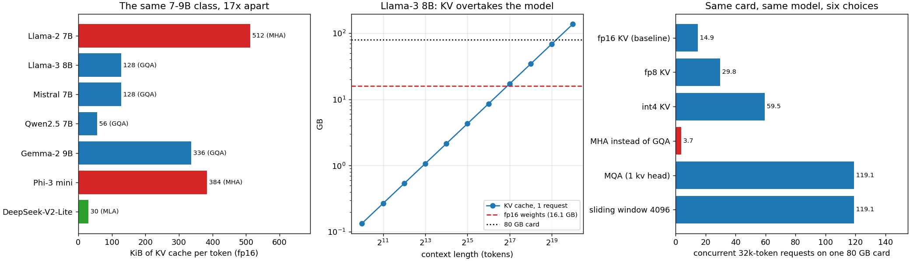

# KV-Cache Memory Math

---

> One formula, verified to **0.000%** against tensors that really exist, then pointed at seven real architectures. Llama-3 8B at a 32k context costs **4.29 GB of [KV cache](/shared/glossary/#kv-cache) per request** — batch 8 fits on an 80 GB card, batch 32 needs **137 GB** and does not. Across the same 7–9B class the cost per token ranges from **512 KiB** (Llama-2, plain [MHA](/shared/glossary/#multi-head-attention)) to **30 KiB** (DeepSeek's [MLA](/shared/glossary/#mla)) — a **17x** spread that has nothing to do with model quality and everything to do with how many people fit on your GPU. And the crossover everyone should know: on Llama-3 8B the KV cache outweighs the *entire model* past **122.5k tokens** of live context, which is fifteen ordinary 8k chats.

---

## Key Insight

Serving language models requires understanding how memory consumption scales with batch size and context length. During the [decode](/shared/glossary/#decode) phase, storing the [KV cache](/shared/glossary/#kv-cache) for all active sequences dominates the GPU's memory footprint. Performing the memory arithmetic for a given model architecture, such as a 8B parameter model, reveals how keys and values scale linearly, which is essential to prevent out-of-memory errors and maximize serving throughput.

## Why This Matters

[Project 40](../40-latency-vs-throughput/README.md) ended with a curve that flattened once KV traffic overtook weight traffic. This project is the arithmetic behind that moment. It is also the cheapest skill in the phase: five multiplications tell you, before you rent anything, how many users a given GPU can hold — and which of the last five years' architecture changes were really about memory rather than accuracy.

---

**This is project 41.**

### The words first

- **[KV cache](/shared/glossary/#kv-cache)** — for every token already in the conversation, attention needs its **key** and **value** vectors again on every future step. Recomputing them would make generation quadratic, so they are stored. The cache is per-request and grows by one entry per token.
- **[MHA](/shared/glossary/#multi-head-attention)** — *multi-head attention*, the original: every query head has its own key/value head. Maximum expressiveness, maximum cache.
- **[GQA](/shared/glossary/#gqa)** — *grouped-query attention*: several query heads **share** one key/value head. Llama-3 8B has 32 query heads and 8 KV heads, so the cache is 4x smaller than MHA.
- **[MQA](/shared/glossary/#mqa)** — *multi-query attention*: the extreme case, one KV head for all query heads.
- **[MLA](/shared/glossary/#mla)** — *multi-head latent attention* (DeepSeek): store one small **compressed** vector per token per layer and reconstruct keys and values from it when needed. "Latent" because what is cached is a hidden, low-dimensional summary rather than the keys and values themselves.
- **[Sliding-window attention](/shared/glossary/#sliding-window-attention)** — a layer that only attends to the last *W* tokens, so its cache stops growing at *W*.
- **[HBM](/shared/glossary/#hbm)** — the GPU's memory. 80 GB on an H100, and every gigabyte the weights take is a gigabyte the cache cannot have.

### The formula

```
bytes per token = 2 (one K and one V) × layers × kv_heads × head_dim × bytes_per_value
```

For Qwen2.5-0.5B in fp32: `2 × 24 × 2 × 64 × 4 = 24,576 B/token`.
For Llama-3 8B in fp16: `2 × 32 × 8 × 128 × 2 = 131,072 B/token = 128 KiB`.

Note what is **not** in it: the number of *query* heads, the hidden size, the MLP width, the vocabulary. The cache is a property of the attention layout alone — which is why an architect who wants to serve cheaply reaches for `kv_heads` first.

### "Isn't the KV cache just an optimisation? Why is a cache allowed to decide how many users fit?"

Because it is not optional in any practical sense, and because it is *per user*.

Without it, generating token *n* re-runs attention over all *n−1* previous tokens from scratch, making a reply quadratic in its own length; a 2000-token answer would take roughly a thousand times the work of the first token. Every serving system caches.

And unlike the weights — read by everybody, stored once — the cache belongs to one conversation. Ten users mean ten caches. So the memory bill has one fixed part and one part that scales with `users × context`, and past a certain conversation length the second part is the whole bill. Section E finds that point: **122.5k tokens for Llama-3 8B**.

### "GQA shares key/value heads between query heads. Doesn't that just make the model worse?"

A little, and much less than it sounds — which is the whole reason it took over.

Each query head still has its own queries, so heads still ask different questions; they just look them up in a shared index. The 2023 GQA paper found quality between MHA and MQA while sitting much closer to MHA, and by 2024 essentially every open model shipped with it. Section C shows what it bought: **4x** less cache at the same 7–8B scale, which turns 3 concurrent 32k requests into 14 on the same card.

MLA pushes the same idea further: instead of sharing whole heads, compress what is stored. DeepSeek-V2-Lite keeps **1,152 bytes per layer-token** where Llama-2 keeps **16,384** — 14x less — and reconstructs the heads on the fly, trading a little arithmetic (which decode has to spare) for a lot of memory (which it does not).

### "Section A allocates 2 GB and the resident memory does not move. Where did it go?"

Nowhere yet — and that difference is worth internalising before you trust any memory measurement.

```
torch.empty(2 GB):  RSS +0 MB on allocation, +2000 MB once written
torch.zeros(2 GB):  RSS +2000 MB on allocation, +2000 MB once written
```

`torch.empty` asks the operating system for address space; the pages are only attached to real memory when something touches them. `torch.zeros` writes zeros, so every page is touched immediately and the memory is genuinely yours.

This matters for serving in two ways. First, a KV pool that has merely been *allocated* may not be reserved at all, so an engine that pre-allocates lazily can still be killed later by an out-of-memory error — which is why vLLM profiles a real forward pass and then **pre-touches** its whole pool at startup. Second, when you measure a serving engine's memory, measure it after the pool has been written to, or you will report a number that has not happened yet.

---

## Running it

```bash
python run.py            # ~10 s
python run.py --plot     # redraw the figure from the committed findings.json
```

Needs `torch`, `transformers`, `huggingface_hub`, `matplotlib` and `servelib.py` from [project 39](../39-deploy-with-vllm/README.md). Model configurations are downloaded (config files only — a few kilobytes each, no weights).

**On "verify with `nvidia-smi`".** The guide asks for that check; this machine's GPU cannot run PyTorch at all ([project 39, section A](../39-deploy-with-vllm/README.md)), so section A verifies against three other things instead: the tensors inside Hugging Face's own `DynamicCache`, the paged pool of this phase's engine, and the resident memory the kernel reports through `/proc/self/statm`. Everything about *other* hardware — H100 capacities, Llama-3 numbers — is arithmetic from published configuration files, and is labelled as such.

> **About the numbers.** Everything below comes from the committed
> [`outputs/findings.json`](outputs/findings.json),
> [`outputs/findings.csv`](outputs/findings.csv) and
> [`outputs/run.log`](outputs/run.log).



---

## A. Verifying the formula

| source | bytes per token |
|---|---|
| formula `2 × 24 × 2 × 64 × 4` | 24,576 |
| Hugging Face `DynamicCache` after 128 real tokens | **24,576** |
| this phase's paged pool | 24,576 |
| error | **0.000%** |

Nothing subtle happens here, and that is the point: the cache really is one number per layer, per KV head, per head dimension, twice. Once you trust the formula on a model you can measure, you can apply it to models you cannot fit.

---

## B. The table the guide asks for

**Llama-3 8B, 32,768-token context, fp16 cache, 80 GB card** (fp16 weights: 16.06 GB):

| batch | KV cache | share of the card | verdict |
|---|---|---|---|
| 1 | 4.29 GB | 5.4% | fits |
| 8 | 34.36 GB | 42.9% | fits |
| 32 | **137.44 GB** | 171.8% | **does not fit** |

At 128 KiB per token, **a single 32k request costs 0.27x the entire model**. Four such users cost more than the weights do. That sentence is the reason "how much memory does the model need?" is a question that cannot be answered without knowing the context length and the concurrency.

Llama-3 8B's config actually declares an 8192-token window; 32k is what Llama-3.1 reaches with RoPE scaling. The arithmetic does not care, but it is worth knowing that the guide's number is a 2024-era request length applied to a 2024 model.

---

## C. Seven architectures, per token of context

| model | attention | layers | q / kv heads | KiB per token | at 32k | weights | KV = weights at | 32k seats on 80 GB |
|---|---|---|---|---|---|---|---|---|
| Llama-2 7B | MHA | 32 | 32 / 32 | **512.0** | 17.18 GB | 13.5 GB | 25.7k | **3** |
| Llama-3 8B | GQA 8 | 32 | 32 / 8 | 128.0 | 4.29 GB | 16.1 GB | 122.5k | 14 |
| Mistral 7B | GQA 8 + window | 32 | 32 / 8 | 128.0 | 4.29 → **0.54 GB** | 14.5 GB | 110.5k | 15 |
| Qwen2.5 7B | GQA 4 | 28 | 28 / 4 | 56.0 | 1.88 GB | 15.2 GB | 265.8k | 34 |
| Gemma-2 9B | GQA 8, 256-dim heads | 42 | 16 / 8 | 336.0 | 11.27 → **6.34 GB** | 18.5 GB | 53.7k | 5 |
| Phi-3 mini | MHA | 32 | 32 / 32 | 384.0 | 12.89 → **0.80 GB** | 7.6 GB | 19.4k | 5 |
| DeepSeek-V2-Lite | **MLA** | 27 | 16 / 16 | **30.4** | 1.02 GB | 31.4 GB | 1009.5k | **47** |

Four things fall out of this table.

**GQA is worth 4x, measured on models of the same size and year.** Llama-2 7B and Llama-3 8B are nearly the same shape; the only difference that matters here is 32 KV heads versus 8. Three concurrent long requests becomes fourteen.

**MLA is worth another 4x on top.** DeepSeek-V2-Lite stores 1,152 bytes per layer-token against Llama-2's 16,384. Its weights are the largest in the table (31.4 GB, because it is a [MoE](/shared/glossary/#moe)) and it *still* seats the most users, because at long context the weights are the small half of the bill.

**Head dimension is a hidden multiplier.** Gemma-2 9B has fewer heads than anything else in the table (16 query, 8 KV) yet the second-largest cache, because its heads are 256-dimensional instead of 128, and it has 42 layers. `layers × kv_heads × head_dim` is the product that matters; optimising one factor while another doubles buys nothing.

**Sliding windows change the answer completely, and are easy to miss.** Mistral 7B v0.1 caps every layer at 4096 tokens, so its 32k cost is not 4.29 GB but **0.54 GB — 8x less**. Gemma-2 alternates sliding and full layers (21 of 42 capped), so it saves 44%, not 87%. Phi-3 mini's 2047-token window takes 12.89 GB to 0.80 GB. A KV calculator that ignores `layer_types` will overstate these three models by up to 16x.

---

## D. What each trick buys on one card

Llama-3 8B, 32k context, 80 GB minus 16.06 GB of weights and 4 GB of working space:

| choice | KiB/token | GB per request | concurrent 32k requests |
|---|---|---|---|
| MHA instead of GQA | 512.0 | 17.18 | **3.7** |
| fp16 KV (what it ships as) | 128.0 | 4.29 | 14.9 |
| fp8 KV | 64.0 | 2.15 | 29.8 |
| int4 KV | 32.0 | 1.07 | 59.5 |
| MQA (1 KV head) | 16.0 | 0.54 | **119.1** |
| sliding window 4096 | 16.0 | 0.54 | **119.1** |

Two observations that are easy to state and hard to unlearn.

**These multiply.** GQA and KV quantization and a sliding window are independent decisions; a model with GQA 8, int4 cache and a 4096 window would seat several hundred. Modern serving stacks stack all three deliberately.

**Quantizing the cache is the only one you can apply after the fact.** The attention layout is frozen at training time. This is why [project 35](../35-kv-cache-quantization/README.md) — where INT4 keys cost 13.31 perplexity done right and 92.65 done wrong — is the lever a serving team actually owns, and why getting its granularity right is worth as much as an architecture change.

---

## E. The crossover

The number worth carrying around: for a given model, KV cache overtakes weights at

```
crossover_tokens = weight_bytes / kv_bytes_per_token
```

| model | crossover |
|---|---|
| Phi-3 mini (MHA) | 19.4k tokens |
| Llama-2 7B (MHA) | 25.7k |
| Gemma-2 9B | 53.7k |
| Mistral 7B | 110.5k |
| **Llama-3 8B** | **122.5k** |
| Qwen2.5 7B | 265.8k |
| DeepSeek-V2-Lite (MLA) | 1,009.5k |

For Llama-3 8B that is **fifteen simultaneous 8k chats, or one 128k document**. Below it, quantizing weights is the bigger win; above it, everything that matters is in the cache. Phi-3 mini crosses over at 19.4k, which is less than its own maximum context — a model that spends more memory remembering your conversation than being itself.

---

## What to take away

1. **`2 × layers × kv_heads × head_dim × bytes` — verified to 0.000%** against a real `DynamicCache` and a real paged pool.
2. **Query heads, hidden size and MLP width do not appear in it.** Only the attention layout does.
3. **Llama-3 8B at 32k: 4.29 GB per request.** Batch 8 fits an 80 GB card; batch 32 needs 137 GB and does not.
4. **A 17x spread across one model class** — 512 KiB/token (MHA) to 30 KiB/token (MLA) — decides concurrency, not quality.
5. **GQA bought 4x, MLA bought 4x more, and a sliding window buys up to 16x** — but only if your calculator reads `layer_types`.
6. **Head dimension and layer count are silent multipliers.** Gemma-2 has the fewest heads and the second-largest cache.
7. **KV overtakes the model at 122.5k tokens on Llama-3 8B.** Know which side of that line your product lives on.
8. **`torch.empty` does not cost memory until it is written.** Measure allocations after touching them, and pre-touch pools you intend to keep.

---

## What to try next

- Add your own model's config to `MODELS` and read its seat count. Three lines, and it is the number that decides your GPU bill.
- Recompute the whole table with an int4 cache and see which models change rank. Quantization is not a uniform discount when window layers are in play.
- Model **prefix sharing**: if 100 requests share a 2000-token system prompt, a paged engine can store it once. Work out how many seats that adds at 32k — and then read the [prefix cache](/shared/glossary/#prefix-cache) entry.
- Work out MLA's decode-time arithmetic cost (reconstructing K and V from the latent vector every step) and check it against decode's spare compute from [project 39](../39-deploy-with-vllm/README.md). That trade is the whole design.

---

Next: [project 42 — Quantization for serving](../42-quantization-for-serving/README.md), which spends this arithmetic: shrink the weights, and the freed bytes become seats.
