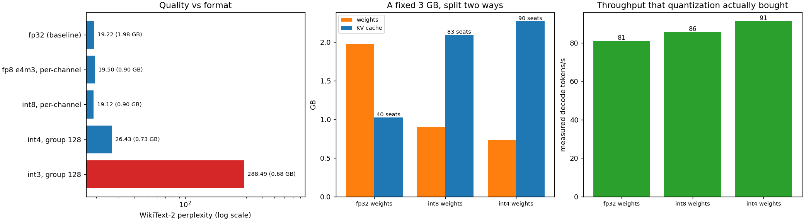

# Quantization for Serving

---

> [Project 34](../34-quantize-a-small-llm/README.md) asked what quantization costs. This one asks what it *buys a server*, and the answer on this machine is uncomfortable: reconstructing [INT8](/shared/glossary/#int8) weights on the fly makes a decode step **7.50x slower**, because a CPU with no low-precision matmul instruction pays for the unpacking and gets nothing back. The memory win is completely real — inside one fixed **3 GB** budget, int8 weights turn **40** concurrent requests into **83** — and yet measured end-to-end throughput moves by **1.06x**, because the unpacking tax eats almost exactly what the extra seats earn. The same arithmetic on an H100, where the [INT4](/shared/glossary/#int4) kernel is fused and decode is [bandwidth-bound](/shared/glossary/#memory-bound), gives **3.8x** for a single user and **4.5x** in total. Quantization is not a speedup; it is a *memory* technique that becomes a speedup only where a kernel exists to collect it.

---

## Key Insight

Deploying large language models for production requires balancing hardware throughput with model output quality. By converting model weights to lower-precision numeric formats like [FP8](/shared/glossary/#fp8) or [int4](/shared/glossary/#int4) via [post-training quantization (PTQ)](/shared/glossary/#ptq--qat), this project compares serving efficiency against native [bfloat16](/shared/glossary/#bfloat16) execution. Measuring throughput and perplexity under different quantization strategies illustrates how bit-width reduction directly lowers memory bandwidth pressure during the memory-bound decode phase.

## Why This Matters

Every serving guide says "quantize the weights, get more throughput". That sentence hides a hardware precondition, and this project makes it visible by running on a machine where the precondition fails. Knowing *why* it fails is what lets you predict whether INT4 will help on the hardware you actually have — and it explains why the same technique is a headline feature on an H100 and a pessimization on a laptop.

---

**This is project 42.**

### The words first

- **[Weight-only quantization](/shared/glossary/#weight-only-quantization)** — store the weights in 4 or 8 bits, do the arithmetic in higher precision. What AWQ and [GPTQ](/shared/glossary/#gptq) produce, and what almost every open "quantized model" is.
- **[PTQ](/shared/glossary/#ptq--qat)** — *post-training quantization*: shrink an already-trained model, with no retraining.
- **[FP8 E4M3](/shared/glossary/#fp8)** — an 8-bit float with 4 exponent and 3 mantissa bits, max value 448. Native on H100 and newer; emulated here.
- **[Dequantization](/shared/glossary/#dequantization)** — turning stored small integers back into the numbers the matmul multiplies. A *fused* kernel does this inside the matmul, in registers; an unfused one writes the reconstructed matrix to memory first, which is the whole problem below.
- **[Perplexity](/shared/glossary/#perplexity)** — how surprised the model is by real text. Lower is better; a ratio of 1.02 means "2% worse at predicting text".
- **Seats** — how many requests fit in memory at once. The unit that connects a memory saving to a throughput gain.

### "Fewer bits means fewer bytes to read, and decode is memory-bound. Why isn't it just faster?"

Because "fewer bytes to read" is only true if the arithmetic can consume the small format directly.

A fused INT4 kernel reads 4-bit weights from memory, unpacks them in registers, multiplies, and never writes the wide values anywhere. Bytes moved drop 4x, and since decode is [memory-bound](/shared/glossary/#memory-bound) the step gets ~4x faster.

Without such a kernel — this CPU has no INT4 or INT8 matmul instruction that PyTorch will use here — the sequence is: read 4-bit weights, **write a full fp32 copy to memory**, then run the ordinary fp32 matmul that reads it back. You have added a 1.98 GB write and a 1.98 GB read to a step whose only job was one 1.98 GB read. Measured: **7.50x slower at batch 1**.

This is the same lesson as [project 20](../20-fused-layernorm/README.md)'s fusion results and [project 37](../37-per-channel-vs-per-tensor/README.md)'s "granularity costs 1.00x", arriving from a third direction: **on memory-bound work, only the bytes that cross the memory bus count, and an unfused kernel does not remove them — it adds more.**

### "Then how can section C show a gain at all?"

Because it spends the saving somewhere the CPU cannot tax it: the [KV cache](/shared/glossary/#kv-cache).

Fix a total memory budget of 3 GB. In fp32 the weights take 1.98 GB, leaving 1.02 GB of cache — at 24,576 B/token and a 1024-token context, **40 concurrent requests**. In int8 the weights take 0.90 GB, leaving 2.10 GB — **83 requests**. The batch has doubled without buying a single byte of extra RAM, and doubling the batch is exactly what [project 39](../39-deploy-with-vllm/README.md) showed is nearly free.

Then the tax arrives. Each step now also reconstructs the weights, and measured throughput lands at **1.06x**. The memory win (2.08x seats) is genuine; the arithmetic tax happens to cancel it on this hardware. **Both halves of that sentence are the result** — and section D shows the same accounting with a fused kernel, where nothing cancels.

### "Section A shows int8 with *lower* perplexity than fp32. Did quantization improve the model?"

No. 19.117 versus 19.218 is a 0.5% difference on a four-sequence sample, which is noise of the same kind [project 34](../34-quantize-a-small-llm/README.md) saw (19.827 versus 19.930 there). Rounding weights perturbs the model slightly, and on a small evaluation slice a small perturbation can land either way.

The honest reading is **"INT8 per-channel is free"** — not "INT8 helps". Any claim that a quantized model beats its parent needs a much larger evaluation than this, and usually evaporates when it gets one.

### "Why is the fp32 baseline here 19.218 when project 34 reported 19.930 for the same model?"

Different measuring stick, same model. Project 34 evaluated 8 sequences of 512 tokens; this project evaluates 4, and through its own engine rather than Hugging Face's forward pass. Perplexity depends on which text you measure. **Compare rows within one table, never numbers across tables** — which is why every ratio in this project is taken against the baseline in its own run.

---

## Running it

```bash
python run.py            # ~70 s on an idle machine
python run.py --plot     # redraw the figure from the committed findings.json
```

Needs `torch`, `transformers`, `pandas`, `huggingface_hub`, `matplotlib`, plus `servelib.py` from [project 39](../39-deploy-with-vllm/README.md) and `quantlib.py` from [project 34](../34-quantize-a-small-llm/README.md).

**Why fp32 is the baseline rather than [bf16](/shared/glossary/#bfloat16).** The guide's comparison starts at bf16, which is what a GPU serves. This CPU has no 16-bit matmul instruction: [project 33](../33-format-sweep/README.md) measured bf16 matmul at **1.1 GFLOP/s against fp32's 518.7** — 466x slower. Serving in bf16 here would be a benchmark of emulation, not of quantization. Every measured row uses fp32 as its reference; the bf16/fp8/int4 comparison the guide asks for is done as arithmetic in section D, and labelled.

> **About the numbers.** Everything below comes from the committed
> [`outputs/findings.json`](outputs/findings.json),
> [`outputs/findings.csv`](outputs/findings.csv) and
> [`outputs/run.log`](outputs/run.log).



---

## A. Five formats, measured through the serving engine

WikiText-2 perplexity, 4 × 512 tokens, transformer-block matrices only (embeddings and [lm_head](/shared/glossary/#lm-head) stay fp32, as every production recipe leaves them):

| format | bits/weight | perplexity | vs fp32 | weights |
|---|---|---|---|---|
| fp32 | 32 | 19.218 | 1.000x | 1.976 GB |
| FP8 E4M3, per-channel | 8 | 19.502 | 1.015x | 0.903 GB |
| **INT8, per-channel** | 8.02 | **19.117** | **0.995x** | 0.903 GB |
| INT4, group 128 | 4.125 | 26.426 | 1.375x | 0.729 GB |
| INT3, group 128 | 3.125 | **288.485** | 15.011x | 0.685 GB |

**8 bits is free, 4 bits is a real but survivable 37.5% penalty, 3 bits is a cliff.** The same shape [project 34](../34-quantize-a-small-llm/README.md) found, reproduced through a different code path, which is a useful cross-check on both.

**INT8 and FP8 store the same 8 bits and land in the same place** (0.995x versus 1.015x). They spend those bits differently — INT8 spaces its levels evenly, FP8 spaces them logarithmically, finely near zero and coarsely in the tails — and for weights, which are bell-shaped and dominated by small values, both are fine. FP8's advantage on real hardware is not accuracy but that H100-class GPUs multiply it natively.

**Why the weights only shrink 2.19x when the bits shrink 4x.** Only the transformer-block matrices are quantized; the fp32 embedding table (`151,936 × 896` = 0.54 GB, shared with the output head) is not. On a 7B model the embeddings are a small fraction and the ratio approaches the bit ratio — small models pay a much bigger constant.

---

## B. Speed, with no low-precision kernel

Decode step time, 512-token context, weights reconstructed on the fly:

| weights | batch 1 | batch 16 | tokens/s at 16 |
|---|---|---|---|
| fp32 | **118.3 ms** | **207.7 ms** | 77.0 |
| INT8 per-channel | 887.1 ms (**7.50x**) | 949.7 ms (4.57x) | 16.8 |
| INT4 group 128 | 888.4 ms (**7.51x**) | 968.1 ms (4.66x) | 16.5 |

Two details worth reading carefully.

**INT4 is no worse than INT8** (7.51x versus 7.50x) even though it stores half as much. That is the signature of a *dequantization*-bound step rather than a *load*-bound one: the cost is dominated by producing the fp32 copy, which is the same size either way. The compression ratio is invisible to the clock.

**The penalty shrinks with batch size** (7.50x → 4.57x). Reconstruction happens once per step regardless of how many sequences are in it, so a bigger batch amortises it — the same amortisation logic as the weights themselves, applied to a cost we would rather not have at all.

---

## C. One 3 GB budget, split two ways

The flagship experiment. Fix the total memory, let quantization decide how it is divided, and *measure* what comes out. Context 1024 tokens, 24,576 B/token:

| weights | weight memory | KV memory | seats | step | measured throughput |
|---|---|---|---|---|---|
| fp32 | 1.98 GB | 1.02 GB | **40** | 494 ms | **80.9 tok/s** |
| INT8 | 0.90 GB | 2.10 GB | **83** | 970 ms | 85.6 tok/s |
| INT4 | 0.73 GB | 2.27 GB | **90** | 986 ms | 91.3 tok/s |

**2.08x the seats. 1.06x the throughput.**

That is the result, and it is worth sitting with. The memory arithmetic worked perfectly — quantizing the weights really did double the number of conversations that fit in 3 GB. The throughput did not follow, because each of those steps now pays the reconstruction tax from section B, and on this hardware the two effects nearly cancel.

**The general form of the lesson:** a memory saving becomes a throughput gain only when the freed memory is spent on something that increases work-per-byte-moved *faster* than the saving costs. Here the saving costs a full extra pass over the weights. On a GPU with a fused kernel it costs nothing, and the same 2.1x in seats shows up as 2.1x in throughput — plus another factor from the smaller weight reads themselves.

**Do not read this as "quantization is pointless without a kernel".** 2.1x more concurrent users on the same card is exactly what a serving team wants; it is the thing that makes a deployment possible at all. What this section measures is that the *speed* half of the promise is hardware-dependent while the *capacity* half is not.

---

## D. The same arithmetic on an H100

Llama-3 8B, 8192-token context, 80 GB at 3.35 TB/s, decode modelled as bandwidth-bound (one full pass over the weights per step) — **arithmetic, not measurement**:

| weights | size | concurrent 8k requests | one user | server total |
|---|---|---|---|---|
| fp16 | 16.06 GB | 55.8 | 209 tok/s | 11,644 tok/s |
| FP8 | 8.03 GB | 63.3 | 417 tok/s | 26,409 tok/s |
| INT4 (AWQ/GPTQ) | 4.27 GB | 66.8 | **785 tok/s** | **52,463 tok/s** |

**3.8x for a single user, 4.5x in total.** The single-user factor is almost exactly the bit ratio (16 / 4.25 = 3.76), because with a fused kernel a decode step *is* the weight read. The extra 0.7x comes from the freed memory buying more seats — the same mechanism as section C, now stacked on top of a real speedup instead of cancelling one.

Note also how small the seat gain is here (55.8 → 66.8, just 20%) compared with section C's 2.1x. At an 8k context on an 80 GB card the KV cache already dominates: 55.8 requests × 1.07 GB ≈ 60 GB of cache against 16 GB of weights. **When the cache is the bigger half, shrinking weights barely moves the seat count** — which is precisely why [project 35](../35-kv-cache-quantization/README.md) quantizes the cache instead, and why the two techniques are complements rather than alternatives.

---

## What to take away

1. **INT8 and FP8 are quality-free at 8 bits** (0.995x and 1.015x). INT4 group-128 costs 37.5%. INT3 collapses to 288.
2. **Unfused dequantization makes decode 7.50x slower.** Reading fewer bytes is worthless if you write the wide copy back out first.
3. **INT4 is not faster than INT8 when the step is dequantization-bound** (7.51x vs 7.50x) — the compression ratio never reaches the clock.
4. **The reconstruction tax amortises over batch** (7.50x → 4.57x), because it is paid once per step, not once per sequence.
5. **In a fixed 3 GB budget, int8 weights doubled the seats (40 → 83) and moved throughput by 1.06x.** The capacity half of quantization's promise is hardware-independent; the speed half is not.
6. **With a fused kernel the same accounting gives 3.8x per user and 4.5x in total.** The gap between 1.06x and 4.5x is entirely "does a kernel exist".
7. **When the KV cache is the bigger half of memory, shrinking weights barely adds seats** (55.8 → 66.8 on an H100 at 8k). Quantize the cache too.
8. **Small models get less compression than their bit ratio** (2.19x, not 4x) because the fp32 embedding table does not shrink.

---

## What to try next

- Write a fused int8 matmul with a Triton kernel in the style of [project 19](../19-triton-matmul/README.md) — dequantize inside the tiling loop and never materialise the fp32 matrix. Then re-run section C and see how much of the 1.06x turns into a real number.
- Apply [GPTQ](../34-quantize-a-small-llm/README.md) instead of round-to-nearest at INT4 and check whether the serving conclusion changes. It will not — the memory and speed arguments are identical — but the 26.4 perplexity should improve.
- Quantize the KV cache *and* the weights in the same budget experiment. That is the configuration real servers run, and the seats multiply.
- Set the budget to 8 GB instead of 3 and repeat. The weights become a smaller share, the seat ratio drops, and the whole conclusion shifts toward [project 35](../35-kv-cache-quantization/README.md)'s territory.

---

Next: [project 43 — Speculative decoding](../43-speculative-decoding/README.md), which attacks the same memory-bound step from the other end: not fewer bytes per token, but more tokens per pass.
