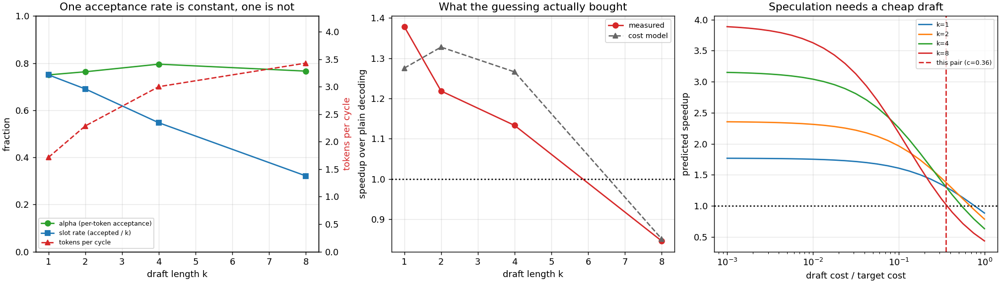

# Speculative Decoding

---

> A 0.5B model guesses; a 1.5B model checks. Every guess it agrees with is a token that cost nothing, and because the check is exact the output is **token-for-token identical** to plain greedy decoding — verified here on every configuration. The measurements behind it: verifying **16 tokens costs 1.27x** what verifying one costs (this is the hardware fact the whole technique stands on), the per-token acceptance probability between these two models is **α ≈ 0.77**, and the wall-clock result is **1.38x at k=1 falling to 0.85x at k=8** — speculation that stops paying when the guesses get too long. And the cheapest draft of all wins biggest: a 3-gram *string search* with no model at all gives **2.37x** on repetitive text and **0.94x** on ordinary prose.

---

## Key Insight

Language model inference is often bottlenecked by memory bandwidth during the token generation phase. [Speculative decoding](/shared/glossary/#speculative-decoding) bypasses this constraint by utilizing a small, fast draft model to propose a sequence of candidate tokens, which the larger target model verifies in parallel. Because a single forward pass of the target model can evaluate multiple tokens simultaneously, this technique significantly improves generation speed without changing the final output distribution.

## Why This Matters

[Project 42](../42-quantization-for-serving/README.md) attacked the memory-bound decode step by making each byte smaller. This project attacks it from the other side: keep the bytes, but get more tokens out of each pass over them. It is the one serving technique that improves *single-user* latency — batching, paging and quantization all help the server first — and it is the one whose payoff can be predicted from two numbers before you build anything.

---

**This is project 43.**

### The words first

- **[Draft model](/shared/glossary/#draft-model)** — the small, fast model that guesses. Here Qwen2.5-0.5B-Instruct (1.98 GB in fp32).
- **[Target model](/shared/glossary/#target-model)** — the model whose output you actually want. Here Qwen2.5-1.5B-Instruct (6.17 GB).
- **k** — how many tokens the draft proposes per cycle, also called the *speculation length* or *lookahead*.
- **[Acceptance rate](/shared/glossary/#acceptance-rate)** — how often the target agrees with a guess. Two versions of this number appear below and they are not the same; see the question about α.
- **[Rejection sampling](/shared/glossary/#rejection-sampling)** — the rule that makes speculation exact when sampling (rather than greedy): accept the draft's token `x` with probability `min(1, p(x)/q(x))`, and when you reject, sample from the normalised positive part of `p − q`. From Leviathan et al. (2023) and Chen et al. (2023).
- **[Prompt-lookup decoding](/shared/glossary/#prompt-lookup-decoding)** — speculative decoding whose "draft model" is a string search over the text so far.

### "If the big model has to check every token anyway, where does the saving come from?"

From the fact that checking *n* tokens costs almost the same as checking one.

A [decode](/shared/glossary/#decode) step is [memory-bound](/shared/glossary/#memory-bound): its time is dominated by dragging all 6.17 GB of the target's weights out of memory ([project 39](../39-deploy-with-vllm/README.md) measured this machine at 25.9 GB/s). Whether those weights are then multiplied by one vector or by nine barely changes the clock, because the arithmetic was hiding under the memory stall.

Section B measures exactly that, and it is worth reading before anything else in this project:

| tokens fed to the target in one pass | 1 | 2 | 4 | 8 | 16 |
|---|---|---|---|---|---|
| time | 304.7 ms | 352.5 ms | 388.6 ms | 381.0 ms | 386.5 ms |
| relative | 1.00x | 1.16x | 1.28x | 1.25x | **1.27x** |

**Sixteen tokens for 1.27x the price of one.** That is the entire economic basis of speculative decoding — and note it is the *same* fact that makes batching work in [project 39](../39-deploy-with-vllm/README.md). Batching amortises the weight read across users; speculation amortises it across *future tokens of one user*.

### "How can guessing not change the output? Surely a wrong guess leaks through sometimes."

It cannot, and the mechanism is simple enough to check by hand.

In greedy mode the target computes its own next-token distribution at each drafted position anyway — that is what "verifying" means. A drafted token is kept only if it equals the target's own arg-max there; at the first disagreement everything after it is thrown away and **the target's** token is emitted instead. So each emitted token is one the target would have produced, in the order it would have produced it. Section A confirms it: identical token sequences at k = 1, 2, 4 and 8.

Sampling is the more interesting case, because you cannot simply compare arg-maxes. The rejection rule is designed so that the *distribution* of the result is exactly the target's, no matter how bad the draft is. The Monte-Carlo check in section A takes two random distributions p (target) and q (draft), runs 200,000 draws through the rule, and compares the empirical result against p: **total-variation distance 0.00048**, which is sampling noise at this sample size. Its acceptance rate is **0.743** against the theoretical `Σ min(p, q) = 0.743`.

### "Section B2 prints two acceptance rates, α and a 'slot rate'. Why two?"

Because one of them is a property of the two models and the other is an artefact of how you count.

- **Slot rate** = accepted tokens / (cycles × k). It falls as k grows — 0.75, 0.69, 0.55, 0.32 — which looks like "longer guesses are worse guesses".
- **α** = accepted / (accepted + rejections): given that everything before it was accepted, how often is the *next* guess right? It is essentially flat: **0.750, 0.763, 0.795, 0.766**.

The slot rate falls only because a cycle stops at the first rejection, so slot 8 is scored only in the rare cycles that got through the first seven. α is the honest per-token number, it does not depend on k, and it is what the standard formula uses:

```
expected tokens per cycle = 1 + α + α² + ... + α^k
```

At α = 0.77 that predicts 1.75 / 2.35 / 3.33 / 3.88 tokens per cycle for k = 1 / 2 / 4 / 8, against measured **1.71 / 2.29 / 3.00 / 3.43**. Close, and slightly optimistic — real acceptances are not perfectly independent, because a hard passage is hard for several tokens in a row.

### "Then why not set k = 32 and generate huge bursts?"

Because every draft token costs a draft forward pass whether or not it survives, and rejected work is pure loss. With `c` = draft step / target step, one cycle costs `1 + k·c` target-steps and yields `1 + α + … + α^k` tokens, so

```
speedup = (1 + α + ... + α^k) / (1 + k·c)
```

The numerator saturates — α^k shrinks fast — while the denominator keeps growing linearly. There is always a best k, and past it speculation is a *slowdown*. Measured here at α ≈ 0.77 and **c = 0.357**, the break-even draft cost is 0.77x a target step at k=1 but only **0.36x at k=8**, which is right where this pair sits — and k=8 duly measures **0.85x**.

Real deployments use a much cheaper draft (a 68M model against a 7B, `c ≈ 0.01`), which is why they can afford k = 5–8 and report 2–3x. **The ratio of draft to target, not the acceptance rate, is what decides how far you can look ahead.**

---

## Running it

```bash
python run.py            # ~4 min on an idle machine
python run.py --plot     # redraw the figure from the committed findings.json
```

Needs `torch`, `transformers`, `huggingface_hub`, `matplotlib` and `servelib.py` from [project 39](../39-deploy-with-vllm/README.md). It downloads Qwen2.5-1.5B-Instruct (~3.1 GB) on first run.

**Why 1.5B/0.5B and not 7B/0.5B.** The guide asks for a 7B target. In fp32 on this CPU a 7B decode step would take about 1.1 s, making one 48-token run nearly a minute — and the *ratio* c, which is what the result depends on, would be 0.07 instead of 0.36, i.e. a much easier case. The pair used here is the honest hard case, and section C generalises it to any c.

> **About the numbers.** Everything below comes from the committed
> [`outputs/findings.json`](outputs/findings.json),
> [`outputs/findings.csv`](outputs/findings.csv) and
> [`outputs/run.log`](outputs/run.log).



---

## A. Exactness, twice

**Greedy.** Speculative decoding at k=4 produced exactly the same 48 tokens as plain greedy decoding of the target:

```
" parallelism. Caching is the process of storing frequently used data in a fast
 memory so that it can be accessed quickly. Pipelining is the process of breaking
 down a complex operation into smaller, simpler operations that can be executed
 in parallel"
```

and `exact=True` holds for every k in the sweep.

**Sampling.** 200,000 draws through the acceptance rule, target p and draft q both random:

| quantity | value |
|---|---|
| total-variation distance from p | **0.00048** |
| measured acceptance | 0.743 |
| theory `Σ min(p, q)` | 0.743 |

The second row is worth pausing on: the acceptance rate *predicted from the two distributions alone* matches the measurement to three decimals. That formula is also the reason a badly-matched draft hurts twice — it is rejected more often *and* every rejection costs a wasted draft pass.

---

## B. The hardware fact underneath everything

Cost of one target forward pass against the number of tokens fed to it (round-robin over the sizes, minimum of four rounds, because this machine is shared):

| tokens | 1 | 2 | 4 | 8 | 16 |
|---|---|---|---|---|---|
| ms | 304.7 | 352.5 | 388.6 | 381.0 | 386.5 |
| vs 1 token | 1.00x | 1.16x | 1.28x | 1.25x | 1.27x |

Flat after about 4 tokens. On a GPU it is flatter still, because the gap between memory bandwidth and arithmetic throughput is much wider than on a CPU. **If this table were linear instead of flat, speculative decoding could not exist.**

---

## B2. The sweep

48 tokens generated, each row re-measuring its own plain-decoding baseline immediately beforehand (the four baselines came out within 1.06x of each other, 316–336 ms per step):

| k | α | slot rate | tokens/cycle | model | tok/s | baseline | speedup | ideal model | with real verify cost | exact |
|---|---|---|---|---|---|---|---|---|---|---|
| 1 | 0.750 | 0.750 | 1.71 | 1.75 | 3.29 | 2.39 | **1.38x** | 1.28x | 1.14x | yes |
| 2 | 0.763 | 0.690 | 2.29 | 2.35 | 3.59 | 2.94 | 1.22x | 1.33x | 1.16x | yes |
| 4 | 0.795 | 0.547 | 3.00 | 3.33 | 3.31 | 2.92 | 1.13x | 1.27x | 1.14x | yes |
| 8 | 0.766 | 0.321 | 3.43 | 3.88 | 2.46 | 2.91 | **0.85x** | 0.85x | 0.80x | yes |

Read the last three columns together — they are the same formula with different assumptions:

- **ideal model** assumes verification costs exactly one target step, which is what a fully memory-bound accelerator delivers.
- **with real verify cost** substitutes the measured 1.16–1.27x from section B.

The second is the better predictor (1.14 / 1.16 / 1.14 / 0.80 against measured 1.38 / 1.22 / 1.13 / 0.85), and its k=8 row lands on the nose. The k=1 measurement is the outlier: its paired baseline was the slowest of the four, which flatters the ratio. **Treat individual speedups here as ±0.15 and the shape as the result** — a modest win that shrinks with k and turns into a loss at k=8.

Per-cycle time makes the mechanism visible:

| k | drafting | verifying |
|---|---|---|
| 1 | 125 ms | 395 ms |
| 2 | 243 ms | 393 ms |
| 4 | 482 ms | 423 ms |
| 8 | **979 ms** | 414 ms |

Verification is essentially constant. Drafting doubles every time k does. By k=8 the small model is doing 70% of the work in a scheme whose entire purpose is to avoid work — and it earns only 0.43 extra tokens per cycle over k=4 for it.

---

## C. When speculation can pay at all

Sweeping the cost model over draft/target cost ratios (right panel of the figure) gives the rule to carry away. With α = 0.77:

| k | tokens per cycle | draft must cost less than |
|---|---|---|
| 1 | 1.77 | 0.77x a target step |
| 2 | 2.36 | 0.68x |
| 4 | 3.16 | 0.54x |
| 8 | 3.92 | **0.36x** |

Our draft costs **0.357x**, which is why the useful range here stops at k=4 in practice. Three consequences:

1. **A draft that is only 3x smaller is a weak draft.** The 0.5B/1.5B pair is a 3x parameter ratio and c = 0.36. Production pairs are 50–100x apart.
2. **Improving α has limits; improving c does not.** Going from α = 0.77 to α = 0.9 at k=4 raises tokens per cycle from 3.16 to 4.10 (+30%). Going from c = 0.36 to c = 0.05 raises the speedup by 1.8x on its own.
3. **This is why the field moved to draft *heads*** — Medusa, EAGLE and friends attach extra prediction heads to the target model itself, so the draft costs a few percent of a step instead of a third of one.

---

## D. The cheapest draft is not a model

[Prompt-lookup decoding](/shared/glossary/#prompt-lookup-decoding) replaces the draft model with a string search: take the last 3 tokens, find where that 3-gram appeared earlier in the text, and propose whatever followed it. Cost: microseconds. Everything else — verification, acceptance, exactness — is unchanged.

| prompt | plain | 3-gram lookup | speedup | accepted per cycle (of 8) |
|---|---|---|---|---|
| repetitive ("Rule 1: … Rule 2: … Rule 3: …") | 2.90 tok/s | **6.85 tok/s** | **2.37x** | 1.94 |
| ordinary prose | 2.77 tok/s | 2.59 tok/s | **0.94x** | 0.021 |

**2.37x from a draft with no parameters, and a 6% loss when there is nothing to copy.** The second row is not a failure; it is the technique's honest domain statement. Prompt lookup wins exactly where the output repeats the input — summarisation, editing a file, quoting a document, filling in a structured format, or any code task where identifiers recur — and does nothing on original text, where its acceptance rate is **0.021 of 8** and the verification overhead is all that is left.

Compare against the model-based draft: 1.13x at k=4 with a 0.5B model that costs a third of a target step, versus 2.37x with a search that costs nothing. **On this hardware the free draft wins by 2x**, which is a good reminder that "use a smaller model" is one answer to "make the draft cheap", not the only one.

---

## What to take away

1. **A target forward over 16 tokens costs 1.27x a forward over 1.** Everything else follows from that.
2. **Speculation is exact.** Identical greedy tokens at every k, and a total-variation distance of 0.00048 for the sampling rule.
3. **α, not the slot rate, is the number to quote.** α held at 0.75–0.80 while the slot rate fell 0.75 → 0.32 as k grew.
4. **`speedup = (1 + α + … + α^k) / (1 + k·c)`** — the numerator saturates, the denominator does not, so there is always an optimal k and a cliff after it.
5. **Measured 1.38x at k=1 down to 0.85x at k=8**, matching the model once the real verification cost is used instead of the ideal one.
6. **At k=8 the draft model consumed 979 ms of a 1,393 ms cycle** — 70% of the work in a scheme designed to avoid work.
7. **The draft/target cost ratio is the binding constraint.** At c = 0.36 the break-even at k=8 is 0.36 — exactly on the line. Real systems run c ≈ 0.01.
8. **A parameter-free 3-gram draft beat the model-based one 2.37x to 1.13x** on repetitive text, and lost 6% on prose. Match the draft to the workload, not to the leaderboard.

---

## What to try next

- Swap the draft for Qwen2.5-0.5B **quantized to INT4** using [project 42](../42-quantization-for-serving/README.md)'s tooling. On hardware with a fused kernel that halves c and moves the optimal k right; on this CPU it will make it worse, and knowing which before you run it is the point of section C.
- Combine the two drafts: try the n-gram first, fall back to the model when the lookup finds nothing. That is roughly what production "hybrid" speculators do.
- Implement the sampling path end-to-end (not just the Monte-Carlo check) and confirm that with temperature 1.0 the token *distribution* matches, using a chi-squared test over many runs.
- Measure α between more distant pairs (0.5B drafting for 7B). It should fall — the models agree less — while c improves. The product of those two effects is the whole design space.

---

Next: [project 44 — Continuous batching](../44-continuous-batching-demo/README.md), the last piece of the serving stack: keeping the batch full when requests arrive and finish whenever they like.
