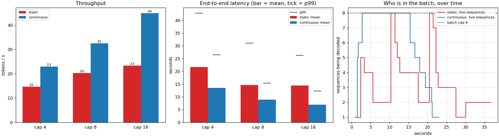

# Continuous Batching Demo

---

> Twenty-four requests arriving over six seconds, generating between 8 and 64 tokens each — the ordinary, uneven workload that every server actually gets. [Static batching](/shared/glossary/#static-batching) runs them in **337 decode steps**; [continuous batching](/shared/glossary/#continuous-batching) runs the same work in **196**, and at a batch cap of 16 it finishes in **half the time** (16.6 s versus 31.9 s) with **1.93x** the throughput, **2.09x** lower mean latency and a first token after **0.74 s instead of 7.74 s — 10.5x**. The number that explains all of the others: static batching spent **27–53% of its seats** computing rows for requests that had already finished, and raising its batch cap made that *worse*, not better. The honest surprise is at the end: limiting admissions to one new request per step, the obvious way to protect running users from prefill interruptions, bought **nothing** — same throughput, worse [TTFT](/shared/glossary/#ttft).

---

## Key Insight

Static batching is highly inefficient for serving language models due to the wide variability in prompt and generation lengths. Implementing [continuous batching](/shared/glossary/#continuous-batching) allows the serving engine to dynamically insert new requests and extract completed ones at the granularity of individual token steps. This project demonstrates how this scheduling strategy maximizes GPU utilization and increases overall throughput compared to waiting for entire batches to complete.

## Why This Matters

[Project 39](../39-deploy-with-vllm/README.md) showed that a full batch is nearly free and [project 40](../40-latency-vs-throughput/README.md) showed which batch size to want. Neither is worth anything if the batch cannot be *kept* at that size, and real traffic makes that hard: requests arrive whenever they like and finish after wildly different numbers of tokens. This project is the scheduler that closes the gap — the last piece of the serving stack, and the one with the largest measured win in the phase.

---

**This is project 44.**

### The words first

- **[Static batching](/shared/glossary/#static-batching)** — collect a group of requests, run them together until the *last* one finishes, then start the next group. Simple, and the default in every pre-2023 inference server.
- **[Continuous batching](/shared/glossary/#continuous-batching)** — also called *in-flight* or *iteration-level* batching: after every single decode step, drop whoever finished and admit whoever is waiting.
- **[Makespan](/shared/glossary/#makespan)** — total wall-clock time from the first arrival to the last completion. A scheduling term (from job-shop scheduling), and the honest summary of "how long did all this take".
- **Slot-step** — one seat in the batch, for one decode step. If the cap is 8 and the server runs 100 steps, it paid for 800 slot-steps. How many of them produced a token is *slot efficiency*.
- **[Admission control](/shared/glossary/#admission-control)** — deciding *when* to let a waiting request into the running batch, rather than always as soon as there is room.
- **[p99](/shared/glossary/#tail-latency)** — the value 99% of requests come in under. The number users complain about, and always worse than the mean.

### "Why does a finished request still cost anything? It is done."

Because in static batching it does not leave.

The batch is a fixed set of tensor rows. Row 3 belongs to a request that wanted 8 tokens; row 5 belongs to one that wanted 64. At step 9, row 3 has nothing left to say — but the batch still has 55 steps to go, and the matrix multiply still has a row 3 in it. The hardware computes it, the [KV cache](/shared/glossary/#kv-cache) still holds its blocks, and the result is discarded.

Measured here at a cap of 8: **1,096 of 1,816 slot-steps produced nothing** — 60% of the paid-for work. That is what "slot efficiency 40%" in the table below means, and it is entirely a scheduling failure, not a hardware one.

### "Then why does static batching get *worse* when I raise the cap from 4 to 16?"

This is the counter-intuitive part, and it is worth walking through slowly.

A bigger batch means more requests share one *finishing time*, and that finishing time is set by the longest generation in the group. With a cap of 4, a 64-token request drags 3 others along behind it. With a cap of 16, it drags 15. Slot efficiency duly falls **53% → 40% → 27%** as the cap goes 4 → 8 → 16, and throughput barely moves (14.7 → 20.3 → 23.3 tokens/s) even though the hardware is doing four times the work per step.

**Under static batching, the batch size you configure is not the batch size you get.** You get it at the start of each group and lose it steadily as members finish. Continuous batching is what makes the configured number mean something — its efficiency at the same caps is 92%, 74%, 55%, and the only reason *those* fall is that 24 requests arriving over 6 seconds cannot keep 16 seats filled. That is a shortage of traffic, not waste.

### "Continuous batching admits new requests mid-flight. Doesn't the new prefill stall everybody?"

Yes, and that is a real cost this project measures rather than hides.

Admitting a request means running its [prefill](/shared/glossary/#prefill) — up to 96 tokens here — before the next decode step can happen. Everyone already generating waits through it. That is why the phase's third technique, [chunked prefill](/shared/glossary/#chunked-prefill), exists: split a long prompt across several steps so no single step is dominated by one newcomer.

The obvious cheaper fix is admission control: admit at most one new request per step. Section D tried it, and it did **not** work: 33.0 tokens/s versus 32.5 (inside the noise) and a mean TTFT of **3.84 s versus 3.39 s** — slightly worse on the metric it was supposed to protect. The reason is arithmetic: throttling admissions delays the moment the batch reaches full size, and the throughput lost by running a half-empty batch for longer is about the same as the throughput gained by shortening each prefill stall. **A scheduling knob that "obviously" helps is worth measuring before shipping** — this one is a wash on this workload, and the technique that does work (chunked prefill) attacks the length of the stall rather than the number of stalls.

### "Both schedulers process the same 744 tokens. How can one be twice as fast?"

Because tokens are not the unit that costs money — *steps* are.

A decode step costs roughly the same whether it carries 4 sequences or 16 ([project 39](../39-deploy-with-vllm/README.md): 115.7 ms at batch 1, 178.2 ms at batch 32). So the way to go faster is not to do fewer tokens but to pack more of them into each step. At a cap of 16, static batching needed **164 steps** for the workload and continuous batching **82** — exactly half, for exactly the same output. Everything else in the table follows from that ratio.

---

## Running it

```bash
python run.py            # ~4 min on an idle machine
python run.py --plot     # redraw the figure from the committed findings.json
```

Needs `torch`, `transformers`, `matplotlib` and `servelib.py` from [project 39](../39-deploy-with-vllm/README.md).

**About repeatability.** The workload's arrival times are fixed by a seed, but they are played against the *real* clock, so the schedulers see the same arrival pattern only if the machine runs them at similar speed. Under a shared machine the absolute seconds move by 10–20% between runs; the *ratios* between the two schedulers are stable, and they are what the conclusions rest on.

> **About the numbers.** Everything below comes from the committed
> [`outputs/findings.json`](outputs/findings.json),
> [`outputs/findings.csv`](outputs/findings.csv) and
> [`outputs/run.log`](outputs/run.log).



---

## A. The workload

24 requests, deliberately uneven, because uniform workloads hide the entire effect:

| property | value |
|---|---|
| prompt lengths | 16, 24, 32, 64 or 96 tokens |
| generation lengths | 8, 12, 16, 24, 48 or 64 tokens (744 in total) |
| arrivals | Poisson, ~4 per second, all within 5.6 s |

The generation spread is the point: 8 versus 64 is an 8x range, and it is *conservative* next to production traffic, where one user asks for a word and another asks for an essay.

---

## B. Two schedulers, three batch caps

| scheduler | cap | makespan | throughput | mean latency | p99 latency | mean TTFT | p99 TTFT | slot efficiency | steps |
|---|---|---|---|---|---|---|---|---|---|
| static | 4 | 50.6 s | 14.7 tok/s | 21.7 s | 42.8 s | 17.47 s | 36.16 s | 53% | 337 |
| **continuous** | 4 | 32.5 s | 22.9 tok/s | 13.5 s | 26.5 s | 8.73 s | 17.87 s | **92%** | 196 |
| static | 8 | 36.7 s | 20.3 tok/s | 14.6 s | 31.0 s | 10.14 s | 24.25 s | 40% | 227 |
| **continuous** | 8 | 22.9 s | 32.5 tok/s | 8.9 s | 15.4 s | 3.39 s | 7.92 s | 74% | 122 |
| static | 16 | 31.9 s | 23.3 tok/s | 14.4 s | 26.3 s | 7.74 s | 19.79 s | **27%** | 164 |
| **continuous** | 16 | **16.6 s** | **44.9 tok/s** | **6.9 s** | **12.3 s** | **0.74 s** | **1.40 s** | 55% | **82** |

Side by side, at each cap:

| cap | throughput | mean latency | p99 latency | mean TTFT | steps |
|---|---|---|---|---|---|
| 4 | **1.56x** | 1.61x lower | 1.62x lower | 2.00x lower | 1.72x fewer |
| 8 | **1.60x** | 1.64x lower | 2.01x lower | 2.99x lower | 1.86x fewer |
| 16 | **1.93x** | 2.09x lower | 2.14x lower | **10.5x lower** | 2.00x fewer |

**Continuous batching wins on every metric at every cap, and wins by more as the cap grows.** That last part is the useful shape: static batching cannot spend a larger batch, so the two curves diverge. If you only ever tested at batch 4 you would conclude the difference is 1.5x and move on.

**The TTFT column is the one users feel.** At cap 16, static batching makes the average request wait **7.74 s** for its first token and the unluckiest **19.79 s**, because a request that arrives just after a group starts must wait for the whole group to drain. Continuous batching admits it at the next step boundary: **0.74 s** mean, **1.40 s** at p99.

**And notice static batching's cap-16 row is barely better than its cap-8 row** (23.3 versus 20.3 tokens/s) while continuous batching gained 38% from the same change. Buying a bigger GPU does nothing for a scheduler that cannot fill it.

---

## C. Where the slots went

Slot efficiency counts decode steps only: of the `cap × steps` seats the hardware paid for, how many produced a token?

| cap | static | continuous |
|---|---|---|
| 4 | 53% (628 wasted) | **92%** (64 wasted) |
| 8 | 40% (1,096 wasted) | 74% (256 wasted) |
| 16 | **27%** (1,904 wasted) | 55% (592 wasted) |

The two columns waste seats for opposite reasons, and the distinction matters:

- **Static** wastes them on requests that have already finished but cannot leave. More capacity means more seats held by the dead — 1,904 slot-steps at cap 16, more than the 720 that did useful work.
- **Continuous** wastes them on seats nobody has arrived to fill. Its cap-16 number is a statement about the *workload* (24 requests over 6 seconds is not enough traffic for 16 seats), not about the scheduler. Give it more arrivals and that efficiency climbs; give static batching more arrivals and its stays where it is.

This is the same measurement discipline as [project 39](../39-deploy-with-vllm/README.md)'s gather share: name the wasted resource, then say *why* it was wasted, because two identical percentages can mean opposite things.

---

## D. Admission control, and a negative result

The hypothesis: admitting several requests at once means a long combined prefill, which stalls everyone already generating. Admitting at most one per step should smooth that out.

At cap 8, against continuous batching admitting everyone:

| policy | throughput | mean TTFT | mean latency | slot efficiency |
|---|---|---|---|---|
| admit everyone | 32.5 tok/s | 3.39 s | 8.9 s | 74% |
| admit ≤ 1 per step | 33.0 tok/s | **3.84 s** | 9.2 s | 73% |

**No gain, and the metric it targeted got slightly worse.** Throttling admissions keeps the batch below its cap for longer, and the throughput lost there cancels the stalls avoided. It is a genuine negative result, and it is the reason production engines went a different way: [chunked prefill](/shared/glossary/#chunked-prefill) splits *one* long prompt across several steps, attacking the length of each stall rather than the number of them, and it does not delay anyone's admission to do it.

---

## What to take away

1. **Continuous batching won every metric at every cap** — up to 1.93x throughput, 2.09x lower mean latency, and 10.5x lower TTFT at cap 16.
2. **The mechanism is steps, not tokens.** Same 744 tokens, 164 steps versus 82.
3. **Static batching gets *less* efficient as the cap grows** (53% → 40% → 27%), because a bigger group waits on a longer straggler. Its throughput went 20.3 → 23.3 for 2x the capacity.
4. **1,904 of 2,624 slot-steps at cap 16 computed rows for requests that had already finished.** The waste is in the scheduler, not the kernel.
5. **The two schedulers waste seats for opposite reasons** — seats held by the dead versus seats nobody arrived to fill. Say which one you are looking at.
6. **TTFT is where the user-visible difference lives**: 7.74 s versus 0.74 s at cap 16, because a static batch admits nobody until it drains.
7. **Admission control bought nothing** (33.0 versus 32.5 tokens/s, TTFT 3.84 versus 3.39 s). The obvious fix for prefill interference is not the fix production uses.

---

## What to try next

- Implement chunked prefill: cap the number of prompt tokens processed per step and spread a long prefill over several steps. Then measure TBT jitter for the requests already running — that is the metric it improves, and mean TPOT will hide it.
- Add [preemption](/shared/glossary/#preemption): when the KV pool runs out, evict the newest sequence (drop its blocks, re-prefill it later) instead of refusing the request. Measure what the re-prefill costs against the throughput of never blocking.
- Turn the arrival rate up until the server saturates. Continuous batching's efficiency should climb toward 100% and its latency should start rising — the queueing curve [project 40](../40-latency-vs-throughput/README.md) deliberately left out.
- Add [prefix caching](/shared/glossary/#prefix-cache) with a shared system prompt across all 24 requests, and watch the admission cost of new requests fall.

---

## Phase 8, closed

Six projects, one wall.

The real [vLLM](/shared/glossary/#vllm) never started here — sm_61 against a binary built for sm_70 and up — so [project 39](../39-deploy-with-vllm/README.md) built the engine instead, checked it against Hugging Face to **2.5e-05**, and measured the fact that the rest of the phase spends: [prefill](/shared/glossary/#prefill) at **77% of the compute roof**, [decode](/shared/glossary/#decode) at **1.3%** of it and **62% of the memory roof**. One model, two machines. [Project 40](../40-latency-vs-throughput/README.md) turned that into an operating point and found the knee agreeing with a 200 ms SLA by coincidence, while a 110 ms promise turned out to be unreachable at *any* batch size. [Project 41](../41-kv-cache-memory-math/README.md) counted the bytes — `2 × layers × kv_heads × head_dim`, verified to **0.000%** — and found a **17x** spread across one model class, plus the crossover at **122.5k tokens** where a Llama-3 8B's cache outweighs Llama-3 8B. [Project 42](../42-quantization-for-serving/README.md) shrank the weights and discovered the capacity win is hardware-independent (**2.08x** seats) while the speed win is not (**1.06x**, against 4.5x with a fused kernel). [Project 43](../43-speculative-decoding/README.md) attacked the same step from the other side, proved exactness twice, and found the payoff bounded by one ratio — the draft's cost — with a **parameter-free 3-gram** beating the 0.5B draft **2.37x to 1.13x**. And this project kept the batch full, which was worth more than any of them.

The through-line: **every technique in this phase is a different way of getting more tokens out of one pass over the weights.** Batching amortises that pass across users. Paging makes room for more users. Quantization makes the pass smaller. Speculation gets several tokens out of one pass. Continuous batching makes sure the pass is never half empty. The wall never moves — HBM delivers what HBM delivers — and every serving innovation since 2022 is a fresh angle of attack on it.

Next: [Phase 9 — DIY AI Hardware](../../README.md#phase-9-diy-ai-hardware--whats-actually-possible), where the machine stops being a given and becomes something you choose.
