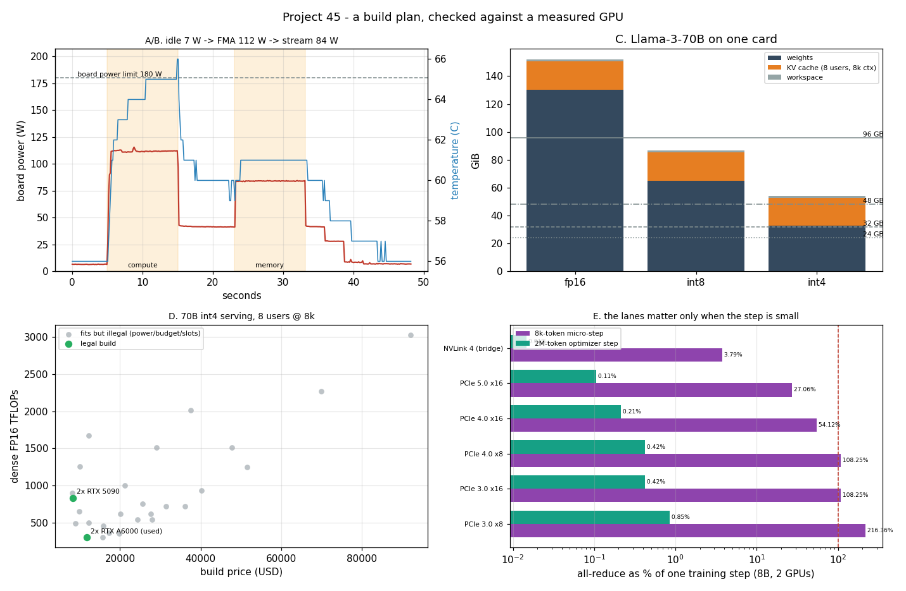

# 2-GPU Build Plan

---

> A build plan is a spreadsheet until something measures it. This project writes the planner — a search over a parts catalogue under budget, [PSU](/shared/glossary/#psu), wall-circuit, slot and [VRAM](/shared/glossary/#vram) constraints — and then checks its assumptions against the one real GPU this machine has. Findings: the card delivers **8.72 TFLOP/s** FP32, **1.08x its own spec sheet**, and **196.8 GB/s** of DRAM bandwidth, **77%** of spec. Its heaviest arithmetic load draws **111.9 W** — only **62%** of its **180 W** limit — while the *memory-bound* load that real deep learning actually runs draws **84.1 W**, **0.75x** less. The famous power *transient* is invisible at **100 ms** sampling (**1.03x** steady). And the constraint that kills the most builds is not money: for a US 15 A wall circuit the answer is **2 cards**, no matter how many you can afford.

---

## Key Insight

Designing a multi-[GPU](/shared/glossary/#gpu) workstation requires careful balancing of power, cooling, and [PCIe](/shared/glossary/#pcie) lane allocation to prevent hardware [bottlenecks](/shared/glossary/#bottleneck). A system that looks fast on paper can underperform if the motherboard cannot supply enough PCIe lanes for both GPUs to communicate at full bandwidth, or if the power supply unit cannot sustain the combined draw under heavy training loads. By planning a build around specific compute and [VRAM](/shared/glossary/#vram) requirements — and checking that every component (CPU, motherboard, PSU, cooling) supports the target workload — developers learn how each hardware choice directly affects [throughput](/shared/glossary/#throughput), memory capacity, and long-term stability.

## Why This Matters

Phase 9 is the honest phase: what can one person actually build? The answer is "not silicon, but systems" — and the first system is a machine. Every number in a build post you will read online (watts, lanes, VRAM, tokens per second) is either a spec-sheet number, an arithmetic consequence of one, or a measurement. This project sorts them into those three piles, so you can tell which parts of a plan are facts and which are hopes.

It also gives the rest of the phase its instruments. `riglib.py` (telemetry) and `gpuload.cu` (a controllable load) are written here and reused by [project 46](../46-build-and-benchmark/README.md) and [project 47](../47-power-and-thermals/README.md).

---

**This is project 45.**

### The words first

- **[VRAM](/shared/glossary/#vram)** — the memory soldered onto the graphics card. The model's weights must physically fit here; the CPU's RAM is not a substitute (section E prices that substitute at **0.36 tokens/second**).
- **[PSU](/shared/glossary/#psu) (power supply unit)** — the box that converts wall AC into the DC rails the components eat. Rated in watts of *continuous* output.
- **[TDP](/shared/glossary/#tdp) (thermal design power)** — the sustained watts a chip's cooler must remove. Not "maximum power", not "typical power": it is a *design target* for the cooling and the PSU. Section B shows a card sitting far below it.
- **[Power limit](/shared/glossary/#power-limit)** — the *enforced* ceiling in the GPU's firmware. When power draw reaches it, the chip lowers its own clock. This card's limit is 180 W and can be raised to 217 W (if you are root — we are not; see [project 47](../47-power-and-thermals/README.md)).
- **[Boost clock](/shared/glossary/#boost-clock)** — the frequency a GPU picks *at run time* when temperature and power allow. The "boost clock" printed on a spec sheet is a guaranteed minimum, not a maximum, which is why section A beats the spec sheet.
- **[Transient](/shared/glossary/#power-transient)** — a very short power spike, tens of microseconds, above the steady draw. PSUs trip on these. Section B explains why our instrument cannot see them and what to do about it anyway.
- **[Continuous load (the 80% rule)](/shared/glossary/#continuous-load)** — electrical codes treat any load running over 3 hours as *continuous* and allow it to use only 80% of a circuit's rating. A training run is exactly that. This one rule reshapes the whole plan.
- **[PCIe lanes](/shared/glossary/#pcie)** — the wires between CPU and GPU. A slot can be x16, x8 or x4; a lane's bandwidth doubles each PCIe generation.
- **[KV cache](/shared/glossary/#kv-cache)** — memory a serving engine keeps per token per user so it does not recompute past attention. It is the part of your VRAM budget that grows with *users*, not with the model.
- **[Tensor parallelism](/shared/glossary/#tensor-parallelism-tp)** — splitting each layer's matrices across GPUs so a model too big for one card runs on several. This is what makes "2 x 32 GB" useful for a 54 GiB model.
- **[Ring all-reduce](/shared/glossary/#ring-all-reduce)** — how data-parallel training sums gradients across GPUs. For 2 GPUs it moves exactly one copy of the gradients across the link in each direction.
- **[MFU](/shared/glossary/#mfu) (model FLOPs utilization)** — the fraction of the GPU's peak arithmetic a real training step achieves. 40% is a good real number; 100% never happens.

### "The vendor publishes TFLOPs and GB/s. Why measure them again?"

Because the published number and the number your code sees are produced by different processes, and both directions of error are common.

- Spec-sheet FLOPs are `cores x 2 x boost clock`, where "boost clock" is the *guaranteed* frequency. A healthy card in a cool case runs above it. Measured here: 8.72 TFLOP/s where the spec says 8.1 — the card is **8% faster than its own advertisement** because it actually ran at 1848 MHz, not the promised 1683 MHz.
- Spec-sheet bandwidth is `memory clock x bus width`, an electrical maximum that assumes no refresh, no row misses, no read/write turnaround. Measured here: 196.8 GB/s of 256.3 GB/s = **77%**, which is normal and is the number you should put in a roofline, not the 256.

So the point of measuring is not distrust. It is that a plan built on spec sheets is wrong in *both* directions at once — optimistic on memory, pessimistic on arithmetic — and those two errors do not cancel.

### "Isn't 'watts' just the TDP number on the box?"

No, and the gap is the whole reason section B exists. TDP is what the *cooler* must remove. What the card *draws* depends on what your kernel does:

| load | measured power | % of the 180 W limit |
|---|---|---|
| idle | 6.6 W | 3.7% |
| pure FMA arithmetic (`fma_load`) | 111.9 W | 62% |
| pure memory streaming (`mem_load`) | 84.1 W | 47% |

Two lessons a spec sheet cannot give you. First, a stress test built from arithmetic — which is what most "GPU burn-in" tools are — under-states the worst case for a *mixed* kernel and over-states it for the memory-bound kernels that dominate deep learning ([project 39](../39-deploy-with-vllm/README.md) measured decoding to be 62% memory-bound). Second, when you size a PSU for four cards, `4 x TDP` is the right conservative number *because* your future workload is unknown — but do not be surprised when the meter reads 60% of it.

### "Why bother with a KV-cache term? The model's weights are the big number."

Only until you have users. The KV cache grows with tokens *and* with concurrent conversations, and for a 70B model the per-token cost is fixed and large:

```
KV bytes/token = 2 (K and V) x layers x kv_heads x head_dim x bytes
               = 2 x 80 x 8 x 128 x 2 = 327,680 B = 320 KiB per token
```

Eight users at 8k context is `320 KiB x 8192 x 8 = 20.0 GiB` — *more than a whole RTX 4090*, on top of the weights. And notice what does **not** shrink when you quantize: the weights drop 4x from fp16 to int4 (130.4 → 32.6 GiB), while the KV cache stays at 20.0 GiB unless you quantize it separately ([project 35](../35-kv-cache-quantization/README.md)). At int4 the cache is **37%** of the model's footprint. Plan for users, not just for weights.

### "Everyone says you need x16 lanes on both GPUs. Do you?"

It depends on one thing nobody states: how many tokens are in a training step.

The all-reduce moves a fixed number of bytes (one copy of the gradients, 16 GB for an 8B model in fp16). The compute in a step grows with the batch. So the *ratio* is entirely a scheduling decision:

| schedule | compute per step | all-reduce on PCIe 3.0 x16 | overhead |
|---|---|---|---|
| 2M-token optimizer step (gradients accumulated) | 300.3 s | 1.27 s | **0.42%** |
| 8k-token micro-step (all-reduce every backward) | 1.17 s | 1.27 s | **108%** |

Same cable, same model, same GPUs: either a rounding error or *more than doubling* your step time. This is why "do I need x16?" has no answer without "what is your global batch size?". Section E has the full table.

---

## Running it

```bash
python run.py            # ~50 s: compiles gpuload.cu, measures, then plans
python run.py --plot     # redraw the figure from the committed findings.json
```

Needs `nvcc` (the CUDA toolkit), `nvidia-smi` and `matplotlib`. Hardware here: an **NVIDIA GTX 1070 Ti** (Pascal, [compute capability](/shared/glossary/#compute-capability) 6.1, 19 [SMs](/shared/glossary/#sm), 8 GB, 180 W limit) in an **Intel i7-8700K** host. Everything measured is from *that* card; every claim about a part we do not own is arithmetic and is labelled `arithmetic` in `findings.csv`.

> **About the numbers.** Everything below comes from the committed
> [`outputs/findings.json`](outputs/findings.json) and
> [`outputs/findings.csv`](outputs/findings.csv).



---

## A. What one real GPU does

| quantity | spec sheet | measured | ratio |
|---|---|---|---|
| FP32 peak | 8.1 TFLOP/s (at 1683 MHz boost) | **8.72 TFLOP/s** (at 1848 MHz) | 1.08x |
| DRAM bandwidth | 256.3 GB/s (8008 MT/s x 256 bit) | **196.8 GB/s** | 0.77x |
| [arithmetic intensity](/shared/glossary/#ai-arithmetic-intensity) at the ridge |  31.9 FLOP/byte | **44.3 FLOP/byte** | 1.4x |

The last row is the one to carry forward. The [roofline](/shared/glossary/#roofline) ridge point — the arithmetic intensity where a kernel stops being memory-bound and starts being compute-bound — is `peak FLOPs / peak bandwidth`. Using spec numbers you would place it at 31.9 FLOP/byte; the machine's real ridge is at 44.3. Every kernel between those two values would be misclassified by the spec sheet.

## B. The power transient, and what the instrument can and cannot see

The recording is one continuous 48-second telemetry trace at 10 samples/second (top-left panel): 5 s cold idle, 10 s FMA load, 8 s idle, 10 s streaming load, 15 s idle.

| measurement | value |
|---|---|
| cold idle | 6.6 W |
| FMA load, steady | 111.9 W (62% of the 180 W limit) |
| streaming load, steady | 84.1 W (0.75x the FMA load) |
| highest single sample | 115.6 W = **1.03x** steady |
| time to reach 95% of steady | 0.55 s |
| time to fall back to idle after the load stops | 8.29 s |
| core temperature, FMA load | 64.4 °C |

**The honest limitation.** The PSU failures people describe online are caused by transients lasting tens of *microseconds*. `nvidia-smi` reports an internally averaged value roughly ten thousand times slower than that. Our 1.03x therefore does **not** disprove the transient story — it shows that this instrument is the wrong one for the question. Catching a real transient needs a current clamp and an oscilloscope on the 12 V rail. What the plan should do instead is buy the margin without measuring it: pick a PSU rated for the *transient* behaviour of modern cards (ATX 3.x units are specified for 200% excursions for 100 µs), and do not run a 575 W card on a supply whose steady rating you have already spent.

**The finding that does survive.** The card takes **8.3 seconds** to drop back to idle after work stops, and holds an elevated power state the whole time. In a 4-GPU box, a bursty inference service leaves four cards idling at their *elevated* state, not their cold state — energy you pay for and heat the case must still move.

## C. Does the model fit?

Three terms, which grow for three different reasons (top-right panel):

```
VRAM = weights (bytes-per-weight x parameters)
     + KV cache (320 KiB/token x context x concurrent users, for a 70B)
     + workspace (CUDA context, activations, allocator slack: ~1.5 GiB)
```

Llama-3-70B, 8 users at 8k context:

| precision | weights | KV cache | workspace | total | smallest card set that holds it |
|---|---|---|---|---|---|
| fp16 | 130.4 GiB | 20.0 | 1.5 | **151.9 GiB** | 2 x 96 GB |
| [int8](/shared/glossary/#int8) | 65.2 GiB | 20.0 | 1.5 | **86.7 GiB** | 2 x 48 GB |
| int4 | 32.6 GiB | 20.0 | 1.5 | **54.1 GiB** | 2 x 32 GB |

The `fits()` helper is deliberately pessimistic in two ways that beginners' spreadsheets are not: it charges 6% of each card for the driver, context and allocator fragmentation, and it charges a fresh workspace on *every* card, because splitting a model across GPUs does not split the CUDA context.

## D. The planner, and what actually rejects a build

For each target the search walks every (GPU, count) pair and applies the constraints in the order they bite: fit → budget → PSU exists → **wall circuit** → slots.

**Target: 70B int4 serving, 8 users at 8k, budget $12,000** — 2 legal builds out of 36 candidates.

| rank | build | price | VRAM | load | PSU | decode ceiling |
|---|---|---|---|---|---|---|
| 1 | 2 x RTX 5090 | $8,300 | 64 GB | 1350 W | 1600 W | 110 tok/s |
| 2 | 2 x RTX A6000 (used) | $11,700 | 96 GB | 800 W | 1200 W | 47 tok/s |

Rejections: **9** did not fit the model, **21** were over budget, **2** had no PSU big enough, **2** were over the wall circuit.

**Target: 70B fp16 serving, budget $30,000** — exactly **1** legal build: 2 x RTX PRO 6000 Blackwell, $21,150, 192 GB, **1400 W**. That is 40 W under the legal continuous limit of a US 15 A circuit. Skipping quantization costs 2.5x the money and takes the electrical margin to nearly zero — a concrete answer to "why does everyone quantize?" ([Phase 7](../33-format-sweep/README.md)).

**Target: 8B fp16 fine-tune with a 300-TFLOP floor** — 6 legal builds; the winner is again 2 x RTX 5090 at $8,300.

**The ranking check.** Every plan is ranked twice: by TFLOPs per $1000 (the right metric for training) and by decode tokens/s per $1000 (the right metric for serving, because generating a token means *reading every weight*, not doing much arithmetic — [project 39](../39-deploy-with-vllm/README.md)). Here the two rankings agree on the winner in all three targets, which is a real result rather than a boring one: at 2026 street prices a single card dominates both metrics. The reason to compute both anyway is that the *price of a token* moves 10x across targets that look similar — 13.2 tok/s per $1000 for the int4 build, 1.3 for the fp16 one.

### D2. The constraint nobody puts in the spreadsheet: the wall

A circuit's rating is not its continuous rating. Codes allow 80% for loads over three hours, and a training run is by definition one:

| circuit | continuous budget | RTX 5090 (575 W) | RTX A6000 (300 W) |
|---|---|---|---|
| US 15 A / 120 V | 1440 W | **2 cards** | 4 cards |
| US 20 A / 120 V | 1920 W | **2 cards** | 5 cards |
| EU 16 A / 230 V | 2944 W | **4 cards** | 9 cards |
| US 30 A / 240 V (dryer circuit) | 5760 W | 9 cards | 18 cards |

Read the first two rows again: upgrading a US household circuit from 15 A to 20 A buys you **zero** extra RTX 5090s (1350 W for two, 1925 W for three against a 1920 W budget). The same wallet in Europe gets **4**, purely because 230 V doubles the power at the same current. If you want more than two 575 W cards in North America, the next step is not a bigger PSU — it is an electrician, or a 240 V circuit, or renting cloud time.

## E. Lanes: worth everything, or nothing

**When the model fits** (data-parallel training, 8B, 2 GPUs, 40% MFU):

| link | effective (80% of spec) | all-reduce | % of a 2M-token step | % of an 8k-token micro-step |
|---|---|---|---|---|
| PCIe 3.0 x8 | 6.3 GB/s | 2.54 s | 0.85% | 216% |
| PCIe 3.0 x16 | 12.6 GB/s | 1.27 s | 0.42% | 108% |
| PCIe 4.0 x16 | 25.2 GB/s | 0.63 s | 0.21% | 54% |
| PCIe 5.0 x16 | 50.4 GB/s | 0.32 s | 0.11% | 27% |
| [NVLink](/shared/glossary/#nvlink) 4 bridge | 360 GB/s | 0.044 s | 0.01% | 3.8% |

The 80% factor is not invented: it is what [project 46](../46-build-and-benchmark/README.md) measures on this machine's own link (12.72 GB/s pinned on a 15.75 GB/s PCIe 3.0 x16 slot).

**When the model does not fit**, the same lanes become the entire performance. Streaming weights from host RAM means every token pulls the whole model across PCIe:

| link | Llama-3-70B int4 (35 GiB) | Llama-3-8B fp16 (16 GiB) |
|---|---|---|
| PCIe 3.0 x16 | **0.36 tok/s** | 0.79 tok/s |
| PCIe 4.0 x16 | 0.72 tok/s | 1.58 tok/s |
| PCIe 5.0 x16 | 1.44 tok/s | 3.15 tok/s |

Compare 0.36 tok/s with the 110 tok/s of the 2 x 5090 build that holds the same model in VRAM: **305x**. "Just add system RAM" is not a cheaper GPU; it is a 300x slower one.

---

## What to take away

1. **Measure the machine you have before trusting the sheet for one you don't.** This card is 8% *faster* than spec at arithmetic and 23% *slower* at memory. Both errors matter, and they do not cancel.
2. **Power is a property of the kernel, not of the card.** 111.9 W arithmetic, 84.1 W streaming, 6.6 W idle — on the same silicon, same clock.
3. **Your PSU is not the binding constraint. Your wall is.** 15 A at 120 V = two 575 W GPUs, and a 20 A upgrade adds none.
4. **Quantization is a build decision, not a modelling one.** 70B fp16 needs $21k and 1400 W; 70B int4 needs $8.3k and 1350 W and is 4x faster to decode.
5. **The KV cache is a first-class VRAM line item** — 20 GiB for eight users, 37% of an int4 70B deployment.
6. **Lane width matters exactly when your step is small or your model does not fit.** Otherwise it is 0.42%.

## What I would do differently

The catalogue is 2026 street prices, and prices are the least durable part of this analysis. The *structure* — fit, then budget, then PSU, then wall, then slots — is what to keep. If you re-run this in a year, edit `GPUS` and leave everything else alone.

The transient measurement is the honest weak spot: our instrument is 10,000x too slow for the phenomenon. It is included anyway because knowing *why* a measurement cannot answer a question is worth more than a number that pretends to.

---

Next: [project 46](../46-build-and-benchmark/README.md) builds the acceptance test — the one that tells you whether the machine you just assembled is actually wired the way you think it is.
