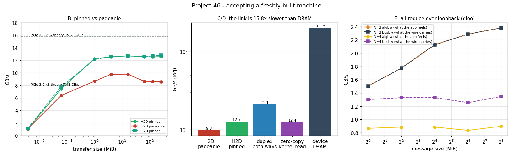

# Build and Benchmark

---

> The machine is assembled. Is it *right*? This project writes the acceptance test — the one you run before trusting a box with a week-long job — and every check finds something. `nvidia-smi` reports the [PCIe](/shared/glossary/#pcie) link as **Gen1** at idle and **Gen3 x16** two seconds into a load, so reading the slot at idle is worthless. Host-to-device transfers hit **12.72 GB/s** with [pinned memory](/shared/glossary/#pinned-memory) (**81%** of the 15.75 GB/s ceiling) and **9.79 GB/s** without (**62%**) — a healthy slot that *fails* a naive "≥75% or RMA it" criterion purely because of one forgotten flag. The link runs both directions at once at **83%** of the sum of each direction alone, a kernel reading host RAM instead of [VRAM](/shared/glossary/#vram) is **17.0x** slower, and an [all-reduce](/shared/glossary/#allreduce) that falls back from [NCCL](/shared/glossary/#nccl) to [gloo](/shared/glossary/#gloo) delivers **2.38 GB/s** where the wire could carry 12.7.

---

## Key Insight

Assembling a multi-[GPU](/shared/glossary/#gpu) workstation and running [NCCL](/shared/glossary/#nccl) benchmarks reveals the gap between a component's theoretical bandwidth and its real-world performance. An [AllReduce](/shared/glossary/#allreduce) throughput test with `nccl-tests` measures how quickly the GPUs can synchronize [gradients](/shared/glossary/#gradients) across the [PCIe](/shared/glossary/#pcie) bus — the step that dominates wall-clock time during [distributed training](/shared/glossary/#data-parallelism). Low numbers point to concrete problems: a GPU seated in an ×8 slot instead of ×16, a misconfigured BIOS setting, or a faulty riser cable. Catching these issues before starting a multi-day training run saves both time and electricity.

## Why This Matters

A wrongly-seated GPU does not crash. A GPU whose slot negotiated x8 instead of x16 does not warn you. A `DataLoader` that forgot `pin_memory=True` does not error. All three simply make your machine slower in ways that look like "deep learning is slow", and all three are found in ten seconds by a benchmark that knows what number to expect.

The trap this project is really about is the second kind of error: a benchmark that reports a *bad* number about a *good* machine. Section F shows a measurement of a perfectly healthy slot that any reasonable acceptance threshold would reject.

---

**This is project 46.**

### The words first

- **Acceptance test** — a fixed set of measurements run on new hardware, compared against numbers you decided *in advance*. The discipline is the "in advance" part: a number with no expectation attached cannot fail.
- **[PCIe](/shared/glossary/#pcie) generation and width** — `Gen3 x16` means 16 lanes each running the third-generation signalling rate. Bandwidth per direction ≈ `lanes x rate x 128/130 / 8`; for Gen3 x16 that is **15.75 GB/s**. The `128/130` is the [line code](/shared/glossary/#line-code): every 128 bits of payload is sent as 130 bits on the wire, so 1.5% of the link is spent telling the receiver where the bits begin.
- **[Link training](/shared/glossary/#link-training)** — the negotiation where the two ends of a PCIe link agree on a speed. It happens at boot *and* whenever power management changes state, which is why a link can be Gen1 one second and Gen3 the next.
- **[ASPM](/shared/glossary/#aspm) (Active State Power Management)** — the PCIe power-saving feature that drops an idle link to a lower speed or turns lanes off. Responsible for the scary Gen1 reading in section A.
- **[Pinned (page-locked) memory](/shared/glossary/#pinned-memory)** — host memory the operating system promises never to move or swap out. The GPU's [DMA](/shared/glossary/#dma) engine can read it directly; ordinary ("pageable") memory has to be copied into a hidden pinned staging buffer first, which costs a whole extra pass through the CPU's memory system.
- **[DMA](/shared/glossary/#dma) (Direct Memory Access)** — hardware on the GPU that moves bytes across PCIe without the CPU touching them. It can only address memory that cannot move — hence pinning.
- **Full duplex** — both directions of the link carry data simultaneously, on separate wires. PCIe is; a naive benchmark that only measures one direction never notices.
- **[Zero-copy](/shared/glossary/#zero-copy) memory** — host memory mapped into the GPU's address space, so a [kernel](/shared/glossary/#kernel) can read it directly with no explicit copy. Convenient, and on a discrete card, slow: every access is a PCIe transaction.
- **[algbw and busbw](/shared/glossary/#algbw)** — the two bandwidths `nccl-tests` prints. `algbw = bytes / time` is what your training loop feels. `busbw = algbw x 2(N-1)/N` is what each wire carries, because a [ring all-reduce](/shared/glossary/#ring-all-reduce) sends each byte around the ring twice (once to reduce, once to broadcast), minus the piece each rank already owns.
- **[gloo](/shared/glossary/#gloo)** — PyTorch's CPU collective library, and the *fallback* when NCCL is unavailable. Correct, portable, and much slower.

### "nvidia-smi already prints the link speed. Why run a bandwidth benchmark at all?"

Because the two answer different questions, and the cheap one is the one that lies. Measured here, seconds apart on the same slot:

| when | `pcie.link.gen.current` | `pstate` | power |
|---|---|---|---|
| idle | **Gen1** x16 | P8 | 6.59 W |
| 2.5 s into a CUDA load | **Gen3** x16 | P2 | 112.11 W |

Nothing was wrong at idle. [ASPM](/shared/glossary/#aspm) had down-trained the link to save a fraction of a watt, exactly as designed, and the driver reported the *current* state truthfully. Read that number on a quiet machine and you will file a support ticket about a slot that works.

The bandwidth benchmark cannot be fooled this way, because running it *is* the load. This is the general rule the section teaches: **when a status field and a measurement disagree, the measurement is describing your workload and the status field is describing this microsecond.**

### "Pinning memory is a software detail. Why is it in a *hardware* acceptance test?"

Because on this machine it moves the reported hardware number by 1.3x, and in the wrong direction for your sanity:

| transfer (16 MiB+, best of 3) | GB/s | % of PCIe 3.0 x16 theory |
|---|---|---|
| H2D pinned | **12.72** | 81% |
| H2D pageable | **9.79** | 62% |
| D2H pinned | 12.80 | 81% |

A sensible acceptance rule is "a healthy link delivers 75–90% of theory". The pinned number passes. The pageable number **fails**, on the same slot, the same cable, the same second. If your test harness forgot the flag, your conclusion is "this slot is broken" and your next action is to pull the machine apart.

Why does pinning matter so much? A [DMA](/shared/glossary/#dma) engine reads physical addresses and cannot tolerate the OS moving a page mid-transfer. For pageable memory the driver therefore copies your data into a hidden pinned buffer first, then DMAs *that*. You pay one extra full pass through host memory, done by the CPU, per transfer. Pinning simply removes that pass.

### "Section E runs on one machine's loopback interface. What can that possibly tell me about a 2-GPU box?"

Three things, none of which need a second GPU:

1. **The harness is correct.** All-reducing a vector of ones must give exactly `N`. Every size, both world sizes: `correct=True`. A benchmark you have not verified is a random-number generator.
2. **The algbw/busbw arithmetic becomes visible.** At N=2 the factor `2(N-1)/N` equals exactly 1, so the two numbers are identical — measured: 2.38 and 2.38 GB/s. At N=4 the factor is 1.5, and the measurement splits: **0.90 GB/s algbw, 1.35 GB/s busbw**. If you have ever wondered why `nccl-tests` prints two columns that agree on 2 GPUs and diverge on 4, that is the whole reason.
3. **It prices a real failure mode.** When NCCL is missing or misconfigured, PyTorch does not stop — it falls back to gloo over TCP. Measured: **2.38 GB/s**. The PCIe link next to it does **12.72 GB/s**, and a real NCCL peer-to-peer path would do better still. A silent 5.3x is exactly the kind of thing an acceptance test exists to catch.

This machine has one GPU and its [compute capability](/shared/glossary/#compute-capability) 6.1 is too old for the shipped NCCL binaries, so the fabric here *is* loopback. On a real 2-GPU box you would run the same script with `nccl` in place of `gloo` and compare against the same measured PCIe ceiling.

---

## Running it

```bash
python run.py            # ~30 s: link state, transfers, duplex, zero-copy, all-reduce
python run.py --plot     # redraw the figure from the committed findings.json
```

Needs `nvcc`, `nvidia-smi`, `torch` and `matplotlib`, and expects [project 45](../45-2-gpu-build-plan/README.md) to have been run once (it uses `riglib.py` and the compiled `gpuload` from there). Hardware: **GTX 1070 Ti** on **PCIe 3.0 x16**, Intel i7-8700K host.

> **About the numbers.** Everything below comes from the committed
> [`outputs/findings.json`](outputs/findings.json) and
> [`outputs/findings.csv`](outputs/findings.csv).



---

## A. The bring-up checklist

Run these in order. Each line has an expected answer *before* you look.

| check | command | expected | measured here |
|---|---|---|---|
| card enumerated | `nvidia-smi -L` | all cards present | 1 x GTX 1070 Ti |
| link width | `--query-gpu=pcie.link.width.current` **under load** | x16 | x16 |
| link generation | same, **under load** | the slot's max | Gen3 (max Gen3) |
| power limit | `--query-gpu=power.limit` | vendor default | 180 W (max 217 W) |
| H2D pinned | `linkprobe` | 75–90% of theory | 12.72 GB/s = 81% |
| D2H pinned | `linkprobe` | within 10% of H2D | 12.80 GB/s |
| duplex | `linkprobe` | ~1.6–1.9x one direction | 21.1 GB/s = 1.66x |
| device DRAM | `linkprobe` | 70–85% of spec | 201.5 GB/s = 79% |
| all-reduce correctness | `run.py` section E | exact | `True` at every size |

**Under load** is doing real work in that table. Both link fields are meaningless at idle; see the numbers above.

## B. Transfers: size, direction, and one flag

The sweep runs 4 KiB to 256 MiB, best of 3, in both directions (left panel).

- Small transfers are **latency**-bound, not bandwidth-bound: a 4 KiB copy reaches ~1.1 GB/s, and a 4-byte copy takes **3.73 µs** regardless of size. That fixed cost is why frameworks batch their transfers and why [project 45](../45-2-gpu-build-plan/README.md)'s gradient all-reduce is bucketed rather than per-tensor.
- Bandwidth saturates by ~4 MiB and stays flat to 256 MiB.
- Pinned beats pageable by **1.30x** at large sizes.
- A [kernel launch](/shared/glossary/#kernel-launch-overhead) costs **1.17 µs** — a number [project 49](../49-fpga-inference/README.md) uses to make an uncomfortable point about small models.

## C. Full duplex

| direction | GB/s |
|---|---|
| host → device alone | 12.6 |
| device → host alone | 12.8 |
| both at once (2 streams) | **21.1** |

21.1 is **83%** of the 25.4 GB/s sum, i.e. the two directions really do run in parallel on separate wires. This matters for a build because overlapping upload of the next batch with download of the previous result is nearly free — but only if your code uses two [CUDA streams](/shared/glossary/#cuda-stream) and pinned buffers. If your measured "both" is about equal to one direction alone, something (a switch, a riser, a single-stream benchmark) has serialized them.

## D. Zero-copy: the option that looks free

A kernel can read host memory directly, no copy required. Measured with the identical kernel over the identical data:

| where the data lives | GB/s |
|---|---|
| device VRAM | **210.9** |
| host RAM, mapped (zero-copy) | **12.4** |

**17.0x.** The mapped read is not merely "slower than VRAM" — it is *exactly* PCIe speed (12.4 vs the 12.72 GB/s of an explicit pinned copy), because that is what it is: every load instruction becomes a PCIe transaction. Zero-copy saves the copy and buys nothing else.

Remember this number when reading [project 48](../48-jetson-deployment/README.md): a [Jetson](/shared/glossary/#jetson) has no discrete VRAM, CPU and GPU share one memory, and this 17x penalty does not exist at all. That single architectural difference is why edge SoCs are built the way they are — and it also caps what they can ever do, because the shared memory's bandwidth is all the GPU will ever get.

## E. All-reduce, with the arithmetic shown

```
algbw = bytes / time                 # what the training loop experiences
busbw = algbw x 2(N-1)/N             # what each link actually carries
```

Why `2(N-1)/N`? A [ring all-reduce](/shared/glossary/#ring-all-reduce) splits the buffer into N chunks and passes them around the ring twice: `N-1` steps of *reduce-scatter* (each rank accumulates one chunk) and `N-1` steps of *all-gather* (each rank receives the other chunks). Each step moves `1/N` of the buffer. Total per link: `2(N-1)/N` buffers.

| N | 256 MiB time | algbw | busbw | correct |
|---|---|---|---|---|
| 2 | 112.7 ms | 2.38 GB/s | **2.38** GB/s | ✅ |
| 4 | 298.9 ms | 0.90 GB/s | **1.35** GB/s | ✅ |

At N=2 the factor is 1 and the columns agree; at N=4 it is 1.5 and they do not. Note also that algbw *fell* from 2.38 to 0.90 when the world grew — four processes are sharing six physical CPU cores and one loopback stack, so this is a measurement of *this* fabric, not a law about all-reduce.

## F. So which link do I actually have?

Turning a measured number back into a verdict, assuming a healthy link delivers 75–90% of theory:

| candidate link | theory | healthy window | our pinned 12.72 | our pageable 9.79 |
|---|---|---|---|---|
| PCIe 3.0 x8 | 7.88 GB/s | 5.9–7.1 | — | — |
| PCIe 3.0 x16 | 15.75 GB/s | 11.8–14.2 | ✅ **match** | ✗ too slow |
| PCIe 4.0 x8 | 15.75 GB/s | 11.8–14.2 | ✅ **match** | ✗ too slow |
| PCIe 4.0 x16 | 31.5 GB/s | 23.6–28.4 | — | — |

Two things fall out.

**The good news:** the measurement correctly identifies the link — as either Gen3 x16 or Gen4 x8, which are the *same bandwidth* and therefore genuinely indistinguishable by a bandwidth test. To separate them you need the status field (under load), which is precisely the case where the status field is the right tool.

**The bad news, and the point of the project:** the pageable measurement of this perfectly healthy x16 slot lands at 62% of theory — below every healthy window in the table. It matches no link at all. An acceptance script that measured it this way would report "the slot is underperforming; check seating", and the machine is fine. The only defect is `cudaMemcpy` from unpinned memory.

---

## What to take away

1. **Never read PCIe link state at idle.** Gen1 x16 idle, Gen3 x16 busy, same slot, same minute.
2. **Pin your host buffers before you judge your hardware.** 1.30x here, and enough to fail a reasonable acceptance threshold.
3. **Measure both directions and then both at once.** Full duplex is real (83% of the sum) and free if your code uses two streams.
4. **Zero-copy runs at exactly PCIe speed**, 17.0x below VRAM. It is a convenience feature, not a memory-capacity feature.
5. **Verify the collective before you time it.** Ours all-reduces to exactly `N`; a benchmark that has not checked is timing an unknown function.
6. **Know which of the two bandwidths you are quoting.** They are equal at N=2 and differ by 1.5x at N=4.
7. **A fallback is a failure.** gloo at 2.38 GB/s instead of the link's 12.72 is the kind of 5.3x that never raises an exception.

## What I would do differently

The all-reduce section wants a second GPU and NCCL, and this machine has neither. What it can honestly deliver — a verified harness, the algbw/busbw arithmetic made visible, and a measured cost for the gloo fallback — is worth having, but the headline number on a real build (`busbw` on 2 GPUs over PCIe P2P, expected ~11–12 GB/s here) is the one you should collect on yours.

If you run this on real hardware, add one more check the single-GPU version cannot do: `nvidia-smi topo -m`, which prints how the cards are connected (through a switch, through the CPU, or over [NVLink](/shared/glossary/#nvlink)). Two cards on different CPU sockets can halve your all-reduce for reasons no bandwidth test on one card will ever reveal — [project 32](../32-topology-study/README.md) is the whole story.

---

Next: [project 47](../47-power-and-thermals/README.md) keeps the load running long enough for the machine to get hot, and watches what the card does about it.
