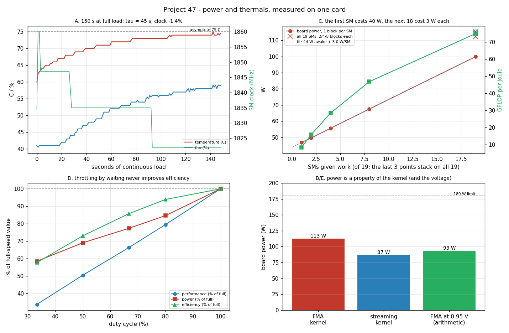

# Power and Thermals

---

> Six minutes of telemetry on one card, and most of the folklore turns out to be measurable. Over **150 seconds** of continuous load the [GPU](/shared/glossary/#gpu) heats from 64 °C to 74 °C with a time constant of **45 s**, loses **1.4%** of its clock — and trips **no [throttle](/shared/glossary/#thermal-throttling) flag at all**. The same chip draws **112.6 W** on arithmetic and **86.7 W** on a memory-bound kernel, so "power" is a property of your kernel, not of your card. Waking *one* of nineteen [SMs](/shared/glossary/#sm) costs **46.8 W** against a 7.1 W idle, and the remaining eighteen cost **2.95 W** each: **38%** of a fully loaded board is paid before any arithmetic happens. And the cheap way to save power — running less often — makes efficiency **worse monotonically** (100% → **57.8%** at a third duty), while [undervolting](/shared/glossary/#undervolting), which we could not perform without root, is worth a calculated **−17% power at identical performance**.

---

## Key Insight

Running multiple high-performance [GPUs](/shared/glossary/#gpu) in a single workstation creates serious power and heat challenges that can silently degrade performance through [thermal throttling](/shared/glossary/#thermal-throttling) — the chip automatically slowing itself to avoid overheating. [Undervolting](/shared/glossary/#undervolting) lets developers lower each GPU's voltage-frequency curve to reduce power draw (often by 50–100 watts per card) while maintaining stable clock speeds and nearly identical [throughput](/shared/glossary/#throughput). This project teaches how to measure real-time power consumption with `nvidia-smi`, monitor junction temperatures, and configure system-level power limits so that a multi-GPU setup runs continuously under heavy training loads without exceeding the cooling system's capacity or the power supply's rated output.

## Why This Matters

Power is the constraint that does not go away. [Project 45](../45-2-gpu-build-plan/README.md) found the wall socket, not the wallet, deciding how many cards a build can hold. This project goes one level down: *where do those watts go, what do they buy, and which of the knobs people reach for actually helps?*

The answers matter well beyond a home build. "Perf per watt" is the metric datacenters are planned around, and every claim about it is a claim about a curve like the one in section C — where the first watt buys nothing and the last watt buys very little.

---

**This is project 47.**

### The words first

- **[Boost clock](/shared/glossary/#boost-clock)** — the frequency the GPU chooses moment to moment. Modern cards do not run at one speed; they run at the highest speed their temperature, power and voltage budget allows, re-decided many times a second.
- **[Thermal throttling](/shared/glossary/#thermal-throttling)** — the chip cutting its clock because it is too hot. It is an emergency measure with an explicit flag; section A shows a card that slows down *without* it, which is a different mechanism entirely.
- **[Power limit](/shared/glossary/#power-limit)** — the enforced watt ceiling in firmware. `nvidia-smi -pl` changes it, if you are root.
- **[Undervolting](/shared/glossary/#undervolting)** — running the same clock at a lower voltage. Since switching power goes as `C V² f`, a 10% voltage cut removes ~19% of the dynamic power *at unchanged speed*. That squared term is the whole reason the technique exists.
- **Static vs dynamic power** — *dynamic* is the energy spent charging and discharging transistors, proportional to how much switching happens. *Static* is everything that is paid just for being powered on: leakage, memory refresh, [VRM](/shared/glossary/#vrm) losses, fans. Section C separates them by measurement rather than by assumption.
- **[VRM](/shared/glossary/#vrm) (voltage regulator module)** — the circuitry on the card that converts 12 V from the PSU to the ~1 V the chip wants. It is not free; its losses are part of "static" here.
- **Duty cycle** — the fraction of time a device is actually working. 100 ms on and 100 ms off is a 50% duty cycle.
- **Thermal time constant (τ)** — how quickly something reaches its final temperature. Newton's law of cooling says temperature approaches its asymptote exponentially: `T(t) = T∞ − (T∞ − T₀)·e^(−t/τ)`. After one τ you are 63% of the way there, after 3τ about 95%. Section A fits τ from the measurement.
- **CFM (cubic feet per minute)** — the unit case fans are rated in. Airflow and heat are linked by `ΔT(°C) ≈ watts / (1.76 × CFM)`.

### "The card has a 180 W limit and an 83 °C limit. Isn't 'don't exceed them' the whole story?"

That is the story if the limits bind. Here neither does, and the card *still* slows down:

| | start of the 150 s run | end |
|---|---|---|
| temperature | 64 °C | 74 °C |
| SM clock | 1848 MHz | 1822 MHz |
| performance | 8668 GFLOP/s | 8544 GFLOP/s |
| `sw_power_cap` flag | not active | not active |
| `hw_thermal_slowdown` flag | not active | not active |

A 1.4% loss with every throttle flag clear. The mechanism is not throttling but the **boost algorithm**: on this Pascal generation the card steps down through fixed clock "bins" as temperature rises, well before any protective limit. That is normal, healthy behaviour — and it is why benchmark numbers taken in the first ten seconds of a run are systematically optimistic. Only the fan tells you something is happening: it ramps from 41% to 59%.

The practical rule: **warm up before you measure, and measure long enough that the temperature has settled.** With τ = 45 s, "settled" means at least two minutes.

### "Why measure a memory kernel too? Power is power."

Because the same card, at the same clock, in the same second, draws different power depending on which units are switching:

| kernel | achieved | power | clock |
|---|---|---|---|
| pure FMA arithmetic | 8544 GFLOP/s | **112.6 W** | 1822 MHz |
| pure memory streaming | 196.8 GB/s | **86.7 W** | 1835 MHz |

The memory-bound kernel — the kind [most deep learning actually runs](../39-deploy-with-vllm/README.md) — draws **0.77x** the power of the arithmetic one, because most of its time is spent waiting rather than switching multipliers. Two consequences. For **sizing**: a stress test made of pure arithmetic is not your workload, in either direction. For **efficiency claims**: "GFLOP per watt" measured on a FLOP benchmark tells you almost nothing about the joules your training run will burn.

### "Half a GPU should use half the power. Why measure that?"

Because it does not, and the shape of the error is the interesting part. The `width` mode runs the identical kernel on 1, 2, 4, 8, 19, 38, 76 and 152 blocks — 1 block per SM up to 19, then stacking:

| blocks | SMs awake | GFLOP/s | watts | GFLOP per joule |
|---|---|---|---|---|
| — (idle) | 0 | 0 | 7.1 | 0 |
| 1 | 1 | 397 | **46.8** | 8.5 |
| 2 | 2 | 793 | 49.6 | 16.0 |
| 4 | 4 | 1584 | 55.6 | 28.5 |
| 8 | 8 | 3160 | 67.5 | 46.8 |
| 19 | 19 | 7483 | 99.9 | 74.9 |
| 38 | 19 (2 blocks each) | 8537 | 112.3 | **76.0** |
| 76 | 19 | 8594 | 114.0 | 75.4 |
| 152 | 19 | 8608 | 115.3 | 74.7 |

Fitting watts against SMs awake over the linear part gives **43.8 W just for being awake + 2.95 W per SM**. Three things follow.

1. **The first SM costs 39.7 W more than idle.** Turning the chip on is most of the bill; the actual arithmetic is cheap.
2. **38% of a fully loaded board's power is that fixed cost.** An idle-but-awake GPU is nearly as expensive as a busy one, which is why serving systems fight so hard to keep the batch full ([project 44](../44-continuous-batching-demo/README.md)) and why [project 45](../45-2-gpu-build-plan/README.md) warns about a card that takes 8 seconds to fall back to idle.
3. **Efficiency peaks at 38 blocks, not 152.** Two blocks per SM is enough to hide latency; everything after that adds power without adding work. If you are chasing perf per watt, "fill the GPU" is subtly wrong advice — "wake the GPU and give it just enough" is closer.

### "If I cannot undervolt, can't I just run the GPU less often?"

You can, and section D prices it. `duty` mode keeps the load on for 100 ms and then idles for a chosen gap:

| duty cycle | GFLOP/s | watts | GFLOP per joule | efficiency vs full speed |
|---|---|---|---|---|
| 100% | 8588 | 114.4 | 75.0 | 100% |
| 80% | 6829 | 96.9 | 70.5 | 93.9% |
| 66.7% | 5695 | 88.5 | 64.3 | 85.7% |
| 50% | 4338 | 79.1 | 54.9 | 73.1% |
| 33.3% | 2902 | 67.0 | 43.3 | **57.8%** |

**Efficiency falls monotonically.** There is no sweet spot, and the reason is section C: the ~44 W of "awake" power keeps being paid during the idle gaps, so less work is divided by nearly the same overhead. Waiting is not a power-saving strategy; it is a power-*spending* strategy with less to show for it.

This is exactly why undervolting is the technique people actually use. It attacks the `V²` term, so the chip does the *same* work per second while spending less on each switch.

### "So how much would undervolting be worth here?"

We could not measure it — the card exposes no voltage telemetry, and setting even a power limit needs root:

```
$ nvidia-smi -pl 150
Failed to set power management limit for GPU 00000000:01:00.0: Insufficient Permissions
```

(committed as [`outputs/power_limit_attempt.log`](outputs/power_limit_attempt.log)).

So section E is arithmetic on measured quantities, with its assumption stated. Measured: 7.1 W static, 112.6 W under the FMA load, so **105 W is dynamic**. Dynamic power scales with `V²` at fixed frequency, so a typical Pascal undervolt from ~1.05 V to 0.95 V multiplies it by `(0.95/1.05)² = 0.819`:

```
new board power = 7.1 + 105 x 0.819 = 93 W      (-17%)
perf per watt   = 112.6 / 93                     (+20%)
```

Same clock, same work, one fifth better efficiency. Multiply by four cards and a year, and this is why the technique is standard practice in mining and home-lab circles. The 1.05 V figure is an assumption, not a measurement, and the answer scales directly with it — halve the voltage cut and you halve the saving.

---

## Running it

```bash
python run.py            # ~6 min: 150 s long run + kernel comparison + sweeps
python run.py --plot     # redraw the figure from the committed findings.json
```

Needs `nvcc`, `nvidia-smi` and `matplotlib`, and expects [project 45](../45-2-gpu-build-plan/README.md) to have been run once (it uses `riglib.py` and the compiled `gpuload` binary). Hardware: **GTX 1070 Ti**, 180 W limit (raisable to 217 W), open-air cooler, in an Intel i7-8700K tower.

> **About the numbers.** Everything below comes from the committed
> [`outputs/findings.json`](outputs/findings.json),
> [`outputs/findings.csv`](outputs/findings.csv),
> [`outputs/run.log`](outputs/run.log) and
> [`outputs/power_limit_attempt.log`](outputs/power_limit_attempt.log).



---

## A. 150 seconds at full load

Fitting `T(t) = T∞ − (T∞ − T₀)·e^(−t/τ)` to the measured temperature curve:

| | value |
|---|---|
| asymptote T∞ | **75 °C** |
| time constant τ | **45 s** |
| fit error (RMSE) | 0.42 °C |
| fan | 41% → 59% |
| power | 112 W → 113 W |
| clock | 1848 → 1822 MHz (−1.4%) |
| performance | 8668 → 8544 GFLOP/s (−1.4%) |

The 0.42 °C fit error is worth noticing on its own: a GPU heating up is, to within half a degree, a first-order system — the same equation as a cup of coffee cooling. That is what makes the number useful. With τ = 45 s, a benchmark shorter than ~2 minutes is measuring a colder, faster machine than the one that will run your job for a week.

Clock and performance fall by *exactly* the same 1.4%, which is the tidy confirmation that nothing else changed: the kernel is clock-bound, so performance tracks frequency one-for-one.

## B. Two kernels, one card

Covered in the question above. The number to carry forward: **0.77x** power for the memory-bound kernel, at a *higher* clock (1835 vs 1822 MHz — it ran cooler, 69 °C vs 74 °C, so the boost algorithm let it keep an extra bin).

## C. Where the watts go

**43.8 W awake + 2.95 W per SM**, fitted from measurement. See the table above. The efficiency peak at 38 blocks (two per SM) is the actionable part.

## D. Duty cycling: the knob that always loses

See the table above. From 100% to 33% duty, efficiency drops to **57.8%**. Reported here because it is the thing people try first when they cannot change voltage, and it is worth knowing that it is strictly a trade of throughput for peak power — never a gain in energy per unit of work.

## E. Undervolting (arithmetic)

**93 W instead of 112.6 W, +20% perf per watt.** Derivation above; the permission failure is committed.

## F. Two cards in one case (arithmetic)

Air can only carry so much heat: `ΔT ≈ W / (1.76 × CFM)`. With each card drawing the measured 112.6 W (225 W of GPU in the case) and 22 °C room air:

| case | airflow | air temperature rise | card 2 inlet | card 2 core (predicted) |
|---|---|---|---|---|
| open frame | 120 CFM | 1.1 °C | 23 °C | 76 °C |
| tower | 60 CFM | 2.1 °C | 24 °C | 77 °C |
| quiet tower | 30 CFM | 4.3 °C | 26 °C | 79 °C |

**And this model is too optimistic, on purpose, so that its failure is instructive.** It says bulk airflow is nearly a non-issue — 4 °C in the worst case — which contradicts everyone's experience of stacked GPUs cooking. The gap is *recirculation*: a top card mounted directly above an open-air bottom card does not breathe the case's mixed air at 26 °C, it breathes the exhaust blowing straight up at 55 °C. The bulk-flow equation cannot see that, because it assumes one well-mixed volume.

The fix is the one every multi-GPU builder converges on: separate the cards (slot spacing, risers, vertical mounts) or use blower-style cards that exhaust out the back. Both are geometry fixes, not airflow fixes, which is why "add more fans" so often disappoints.

---

## What to take away

1. **A GPU slows down long before it throttles.** −1.4% over 150 s with every throttle flag clear.
2. **Measure after τ, not before.** τ = 45 s here; a 10-second benchmark measures a machine you will never run.
3. **Power belongs to the kernel.** 112.6 W arithmetic vs 86.7 W streaming, same card.
4. **Being awake is 38% of the bill**, and the first SM costs 39.7 W.
5. **Perf per watt peaks below full occupancy** — 38 blocks, not 152.
6. **Duty cycling never improves efficiency**; it falls monotonically to 57.8%.
7. **Undervolting is the only knob that gets something for nothing** — arithmetic says −17% power at the same speed — and it is the one that needs root.

## What I would do differently

The one experiment this machine could not run is the one the project is named after. With root, the honest version is a sweep: set `nvidia-smi -pl` to 60%, 70%, 80%, 90%, 100% of the limit, and plot achieved GFLOP/s against power. On modern cards that curve is famously flat at the top — often 90% of the performance at 70% of the power — and it can be measured in ten minutes. Every number in section C and D is the groundwork for that plot; only the permission is missing.

---

Next: [project 48](../48-jetson-deployment/README.md) takes the same measuring habit to the other end of the power scale, where the whole board must live inside 15 watts.
