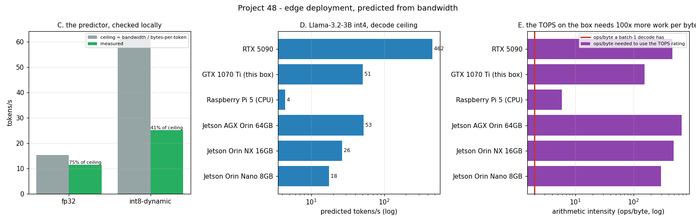

# Jetson Deployment

---

> There is no [Jetson](/shared/glossary/#jetson) on this machine, so this project builds the thing a Jetson deployment actually needs: a predictor of decode speed from *one* number — the device's [memory bandwidth](/shared/glossary/#memory-bandwidth) — and checks it against measurements here before pointing it at edge modules. Measured: this CPU reads at **30.2 GB/s**; a real Qwen2.5-0.5B decodes at **11.5 tok/s** in fp32 and **25.2 tok/s** in [int8](/shared/glossary/#int8), reaching **75%** and **41%** of what its bandwidth allows. Applying the same predictor: an Orin Nano 8 GB runs Llama-3-8B int4 at about **7 tok/s**, and a 3B at **17.5**. The uncomfortable result is section E: to use the **20 dense [TOPS](/shared/glossary/#tops)** behind an Orin Nano's "40 TOPS" label you would need **294 operations per byte**, and a batch-1 [decode](/shared/glossary/#decode) has **2** — so the number that sells the board describes **0.68%** of what your model will do with it.

---

## Key Insight

Deploying deep learning models on resource-constrained [edge](/shared/glossary/#edge-inference) hardware forces developers to optimize for a fundamentally different set of trade-offs than cloud or desktop inference. An NVIDIA [Jetson](/shared/glossary/#jetson) board packs a [CUDA](/shared/glossary/#cuda)-capable [GPU](/shared/glossary/#gpu) into a module that runs on 5–40 watts — orders of magnitude less than a desktop card — by sharing a single pool of memory between CPU and GPU (eliminating [PCIe](/shared/glossary/#pcie) transfer overhead). [Quantizing](/shared/glossary/#quantization) a model to [INT8](/shared/glossary/#int8) or [FP8](/shared/glossary/#fp8) precision and compiling it with [TensorRT](/shared/glossary/#tensorrt) squeezes maximum performance from this limited hardware, enabling real-time inference for robotics and computer vision applications where low [latency](/shared/glossary/#latency) and power efficiency matter more than raw [throughput](/shared/glossary/#throughput).

## Why This Matters

Edge deployment is where hardware-awareness stops being an optimization and becomes the design. On a datacenter GPU you can be wrong about bandwidth by 3x and still ship. On a 15 W module, being wrong by 3x is the difference between a product and a demo that overheats.

The method here — predict from bandwidth, validate the predictor, then extrapolate — is also the only honest way to answer "will this run on X?" without owning X. It is worth learning as a habit, because the alternative (trusting the TOPS number) is wrong by two orders of magnitude, and section E shows exactly why.

---

**This is project 48.**

### The words first

- **[Edge inference](/shared/glossary/#edge-inference)** — running the model on the device that collects the data (robot, camera, car) instead of sending data to a server. The constraints are power, heat, size, and often no network at all.
- **[Jetson](/shared/glossary/#jetson)** — NVIDIA's family of small CUDA-capable modules. An Orin Nano is a credit-card-sized board with a 1024-core GPU and 8 GB of LPDDR5, running on 7–15 W.
- **[TOPS](/shared/glossary/#tops) (tera-operations per second)** — the headline number on every edge accelerator, always for the smallest supported integer type. Section E is about how little it tells you.
- **[LPDDR](/shared/glossary/#lpddr)** — low-power DDR memory, the kind soldered next to a mobile SoC. Much slower than a GPU's [GDDR](/shared/glossary/#gddr) or [HBM](/shared/glossary/#hbm), and much cheaper in watts.
- **[Unified memory](/shared/glossary/#unified-memory)** (as an SoC means it) — CPU and GPU share the same physical RAM, so passing a tensor between them costs nothing. On a discrete card the same operation crosses [PCIe](/shared/glossary/#pcie); [project 46](../46-build-and-benchmark/README.md) measured that crossing at **17.0x** slower than the GPU's own memory.
- **[Dynamic quantization](/shared/glossary/#dynamic-quantization)** — store weights as int8, and quantize each activation on the fly using its own observed range. No calibration data needed, which is why it is the default choice when you are deploying someone else's model ([project 36](../36-calibration-data-study/README.md) measures what calibration buys).
- **[Arithmetic intensity](/shared/glossary/#ai-arithmetic-intensity)** — operations performed per byte of memory traffic. The single number that decides whether a device's compute rating or its memory bandwidth is your limit.
- **[Roofline](/shared/glossary/#roofline)** — the picture of that decision: performance is capped by `min(peak ops/s, bandwidth × arithmetic intensity)`.
- **[Power mode](/shared/glossary/#power-mode)** — on Jetson, a named configuration (`nvpmodel`) that caps CPU cores, GPU clock and memory clock to fit a watt budget: 7 W, 15 W, 25 W and so on.

### "Why predict from bandwidth? Surely the GPU's speed is what matters."

Because for [decoding](/shared/glossary/#decode) one token, the GPU is almost entirely idle. Generating a single token means multiplying the input by every weight matrix once — so **every weight must be read out of memory**, and each weight byte is used for one multiply and one add. Two operations per byte, and no way to get more without more work to share the read.

That gives a ceiling that needs nothing but arithmetic:

```
tokens/second  ≤  memory bandwidth / bytes of weights read per token
```

Measured on this machine, with a real Qwen2.5-0.5B-Instruct:

| precision | weights traversed per token | ceiling at 30.2 GB/s | measured | fraction of ceiling |
|---|---|---|---|---|
| fp32 | 1885 MiB | 15.3 tok/s | **11.5 tok/s** | **75%** |
| int8-dynamic | 471 MiB | 61.0 tok/s | **25.2 tok/s** | **41%** |

The ceiling is real: neither run comes close to exceeding it. And the gap between the two efficiencies is itself the finding — see the next question.

(Only weights that are *traversed* count. The embedding table is 136 M parameters but a token lookup reads a single row of 896 numbers, so it contributes nothing. In this model the embedding is tied to the output layer, which *is* traversed in full, and the counting handles that exactly once.)

### "int8 is 4x fewer bytes. Why is it only 2.2x faster?"

This is the most useful measurement in the project, because the naive expectation is off by nearly a factor of two and the reason is not the hardware.

At fp32 the runtime achieves **75%** of the machine's memory bandwidth. At int8 it achieves **41%**. The bytes did fall 4x, but the work per byte went up: every quantized matrix multiply has to compute a scale for the activations, convert them, do the integer multiply, and convert the result back. That extra arithmetic is not free on a CPU without dedicated int8 matrix units.

The consequence for a deployment plan is concrete: **quantization does not buy you its compression ratio in speed.** Budget 2–2.5x for a 4x size reduction unless the target has hardware int8 support (which is exactly what a Jetson's tensor cores and [TensorRT](/shared/glossary/#tensorrt) provide, and this CPU does not).

There is also a quality cost, visible even in a 24-token sample: fp32 wrote "A Jetson module is…" and the int8 model wrote "A jeton module…". One garbled word in twenty is what an unmeasured, uncalibrated quantization can cost you ([Phase 7](../33-format-sweep/README.md) measures this properly).

### "The Orin Nano says 40 TOPS. Isn't that the number I should plan with?"

No, and this is the section worth remembering. A device's TOPS rating is only reachable if your workload has enough arithmetic per byte to keep the multipliers fed. The break-even — the [roofline](/shared/glossary/#roofline) *ridge point* — is `TOPS / bandwidth`:

| device | int8 TOPS (dense) | bandwidth | ops/byte needed | ops/byte a batch-1 decode has | % of the rating usable |
|---|---|---|---|---|---|
| Jetson Orin Nano 8GB | 20 | 68 GB/s | **294** | 2 | **0.68%** |
| Jetson Orin NX 16GB | 50 | 102 GB/s | 490 | 2 | 0.41% |
| Jetson AGX Orin 64GB | 137 | 204 GB/s | 672 | 2 | 0.30% |
| Raspberry Pi 5 (CPU) | 0.1 | 17 GB/s | 6 | 2 | 34% |
| GTX 1070 Ti (this box) | 30.5 (measured) | 197 GB/s | 155 | 2 | 1.3% |
| RTX 5090 | 838 | 1792 GB/s | 468 | 2 | 0.43% |

Read the Orin Nano row as: *you would need to be doing 147 tokens at once* before its advertised compute became the limiting factor. Below that, the board is a memory-bandwidth device with an expensive matrix unit sitting idle.

Notice the Raspberry Pi row too. It is the only device in the table whose ratings are *balanced* for this workload — because it has so little compute that its bandwidth can nearly feed it. Balance is not the same as good; it just means nothing is being wasted.

The honest planning rule: for single-stream LLM decoding, **choose an edge device by its GB/s, not its TOPS**. For a vision model — a CNN with high arithmetic intensity, or any workload where you batch — the TOPS number starts to matter, which is exactly the workload Jetsons were designed for.

### "If the model is on the same chip's memory anyway, why does unified memory matter?"

Because on a discrete card it *isn't*, and the cost of that is measurable. [Project 46](../46-build-and-benchmark/README.md) ran the identical kernel over identical data in two places:

| where the data lives | GB/s |
|---|---|
| the GPU's own VRAM | 210.9 |
| host RAM, mapped over PCIe | 12.4 |

**17.0x.** On a Jetson that penalty does not exist: there is one pool of LPDDR5, and a pointer handed from CPU to GPU is just a pointer. That is the architectural advantage, and it is why edge SoCs look the way they do.

The same design decision is also the ceiling. Because CPU and GPU share the memory, they also share its **68 GB/s** — and that number, not the TOPS, is what section D's predictions are built on. Unified memory removes a copy; it does not add bandwidth.

---

## Running it

```bash
python run.py            # ~35 s: bandwidth, two decodes, predictions, batching
python run.py --plot     # redraw the figure from the committed findings.json
```

Needs `torch`, `transformers` and `matplotlib`; the model (`Qwen/Qwen2.5-0.5B-Instruct`, ~1 GB) downloads on first use. Hardware here: **Intel i7-8700K**, 6 cores / 12 threads, DDR4. Everything about a Jetson is arithmetic and marked `arithmetic` in `findings.csv`.

> **About the numbers.** Everything below comes from the committed
> [`outputs/findings.json`](outputs/findings.json) and
> [`outputs/findings.csv`](outputs/findings.csv).



---

## A. The devices

| device | bandwidth | int8 TOPS | power | memory | price |
|---|---|---|---|---|---|
| Jetson Orin Nano 8GB | 68 GB/s | 20 | 7–15 W | shared LPDDR5 | $249 |
| Jetson Orin NX 16GB | 102 GB/s | 50 | 10–25 W | shared LPDDR5 | $699 |
| Jetson AGX Orin 64GB | 204 GB/s | 137 | 15–60 W | shared LPDDR5 | $1999 |
| Raspberry Pi 5 | 17 GB/s | 0.1 | 5–12 W | shared LPDDR4X | $80 |
| GTX 1070 Ti (this box) | 197 GB/s *(measured)* | 30.5 *(measured, [project 49](../49-fpga-inference/README.md))* | 30–180 W | discrete GDDR5 | ~$150 used |
| RTX 5090 | 1792 GB/s | 838 | 60–575 W | discrete GDDR7 | $2200 |

TOPS are dense (NVIDIA quotes with sparsity, which doubles the headline; halved here).

## B. The local ground truth

| measurement | value |
|---|---|
| CPU copy bandwidth (read + write) | 21.5 GB/s |
| CPU **read** bandwidth | **30.2 GB/s** |
| Qwen2.5-0.5B fp32 decode | 11.5 tok/s (1885 MiB/token) |
| Qwen2.5-0.5B int8-dynamic decode | 25.2 tok/s (471 MiB/token) |

Read bandwidth is the number the predictor uses, because loading weights is pure reading. Copy is slower because a write costs a read too (the cache line has to be fetched before it is modified).

## C. Does the predictor work?

**75%** of the ceiling at fp32, **41%** at int8. Discussed above. Section D deliberately uses the *lower* of the two efficiencies — 41% — for all edge predictions, so the numbers are conservative rather than flattering.

## D. What a Jetson would do

Predicted tokens/second at 41% of peak bandwidth:

| model | precision | weights | Orin Nano (68 GB/s) | Orin NX (102) | AGX Orin (204) | RTX 5090 (1792) |
|---|---|---|---|---|---|---|
| Qwen2.5-0.5B | int8 | 0.5 GiB | 56.1 | 84.1 | 168.3 | 1478 |
| Llama-3.2-3B | int8 | 3.0 GiB | 8.8 | 13.1 | 26.3 | 231 |
| Llama-3.2-3B | int4 | 1.5 GiB | **17.5** | 26.3 | 52.6 | 462 |
| Llama-3-8B | int8 | 7.5 GiB | 3.5 *(does not fit 8 GB)* | 5.3 | 10.5 | 92 |
| Llama-3-8B | int4 | 3.7 GiB | **7.0** | 10.5 | 21.1 | 185 |

Two practical readings. **7 tok/s is slower than reading aloud** — fine for a batch job, painful for a chat interface, and this is the *ceiling*, before the runtime's own overhead. And the 8B int8 row does not fit in 8 GB at all once you add the KV cache and workspace ([project 45](../45-2-gpu-build-plan/README.md) does that arithmetic), which is why int4 is the default on small modules rather than an optimization.

## E. Why TOPS is the wrong number

Covered above: **294 ops/byte needed, 2 available, 0.68% of the rating usable** on an Orin Nano. The number in the table that fixes it is the last column of the code's output: **batch 147**. Serve 147 conversations at once and the board finally becomes compute-bound — which no 15 W edge deployment ever does, and every datacenter does by lunchtime.

## F. What actually helps: batching, measured

The same model, same machine, more sequences at once:

| batch | total tok/s | speedup | ms per step |
|---|---|---|---|
| 1 | 11.3 | 1.00x | 88.5 |
| 4 | 37.7 | **3.33x** | 106.1 |
| 8 | 72.1 | **6.38x** | 111.0 |

Eight times the work for 1.25x the time per step, because the weights are read **once** and used eight times. This is the same economics [project 39](../39-deploy-with-vllm/README.md) measured on the serving side, and it is the answer to section E: batching is how you raise arithmetic intensity, and arithmetic intensity is how you reach the TOPS on the box.

On an edge device you usually cannot: there is one camera, one microphone, one user. That is the real difference between edge and datacenter inference — not the size of the chip, but whether there is anyone else to share the memory read with.

---

## What to take away

1. **Predict from bandwidth, then check the predictor.** Two measurements were enough to calibrate every edge estimate here.
2. **Quantization buys less speed than size.** 4x fewer bytes, 2.2x faster, because efficiency fell from 75% to 41%.
3. **TOPS describes a workload you do not have.** 0.68% of an Orin Nano's rating is reachable at batch 1.
4. **Pick edge hardware by GB/s for LLMs**, by TOPS for batched vision.
5. **Unified memory removes a 17x penalty and adds no bandwidth.** It is why edge SoCs exist and why they plateau.
6. **Batching is the only way up the roofline**, and it is the thing an edge deployment usually cannot do.

## What I would do differently

With a real Orin Nano, the first thing to measure is not tokens per second but the *power-mode curve*: run the same model under `nvpmodel` 7 W, 15 W and 25 W and plot tok/s against watts. The prediction from this project is that performance tracks the **memory** clock rather than the GPU clock, because decoding never uses the GPU's arithmetic — a prediction that a $249 board and an afternoon would confirm or kill.

The second is [thermal throttling](/shared/glossary/#thermal-throttling) on a passively cooled module. [Project 47](../47-power-and-thermals/README.md) measured a 45-second thermal time constant on a card with a 100 mm fan; a fanless Jetson in a plastic case has a far longer one and a far lower ceiling, which means a benchmark that runs for a minute and a product that runs for an hour will not agree.

---

Next: [project 49](../49-fpga-inference/README.md) leaves the world of buying chips and starts designing one — a convolution engine, written as hardware, simulated cycle by cycle.
