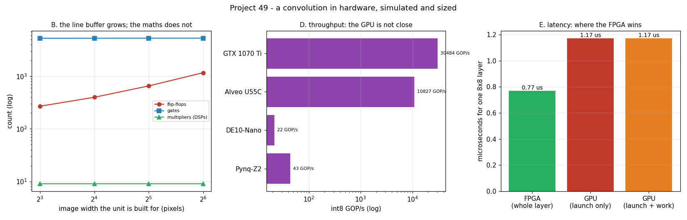

# FPGA Inference

---

> A 3×3 convolution engine, written as hardware, simulated cycle by cycle, synthesized, and then priced honestly against the [GPU](/shared/glossary/#gpu) in this machine. The design matches a Python reference **bit for bit** on every output pixel, sustains **6.6 of a possible 9 [MACs](/shared/glossary/#mac) per clock**, and costs **9 multipliers, 270 flip-flops and 5,288 gates**. Growing it from an 8-pixel-wide image to 64 leaves the arithmetic *identical* and quadruples the flip-flops — the [line buffer](/shared/glossary/#line-buffer), not the maths, is what you pay for. A full **Pynq-Z2** would hold **24** of these units: **43.2 GOP/s**, against this eight-year-old GPU's measured **30,484 GOP/s** — **705x** more throughput and **31x** better per watt. The FPGA still wins exactly one contest, and it is the one that matters for control loops: it finishes the whole layer in **0.77 µs**, while the GPU's [kernel launch](/shared/glossary/#kernel-launch-overhead) alone takes **1.17 µs**.

---

## Key Insight

A [Field-Programmable Gate Array (FPGA)](/shared/glossary/#fpga) offers a middle ground between a general-purpose [CPU](/shared/glossary/#cpu)/[GPU](/shared/glossary/#gpu) and a fixed-function [ASIC](/shared/glossary/#asic): its logic gates can be rewired after manufacturing to implement a custom hardware accelerator without the multi-million-dollar cost of fabricating a new chip. Designing a small [convolutional neural network](/shared/glossary/#cnn) inference pipeline on an FPGA demonstrates how hardwiring the data movement and arithmetic operations directly into the chip's logic fabric eliminates the instruction-fetch and scheduling overhead that slows down software-based execution. This project exposes developers to hardware description languages (like Verilog) or high-level synthesis (HLS) tools, and the process of compiling a design into a [bitstream](/shared/glossary/#bitstream) — the binary configuration file that physically rewires the FPGA's logic cells.

## Why This Matters

Phase 9 is about what one person can actually build. Writing a CNN layer as hardware is the point where "custom accelerator" stops being a word and becomes a file you can simulate: a line buffer, nine multipliers, an adder tree, and a valid signal that has to be right to the cycle.

It is also where the phase's honesty is tested. The guide's own summary says an FPGA "at ~$2k might match a $400 GPU at ~10x the dev time". This project checks that with numbers, and for dense int8 convolution the answer is worse than advertised — while a completely different advantage, latency, turns out to be real and large. Knowing *which* claim survives contact with a measurement is the skill.

---

**This is project 49.**

### The words first

- **[FPGA](/shared/glossary/#fpga) (field-programmable gate array)** — a chip full of small configurable logic blocks and wires between them. "Field-programmable" means the wiring is decided *after* manufacturing, by you, in the field — as opposed to an [ASIC](/shared/glossary/#asic), whose wiring is etched at the factory and can never change.
- **[LUT](/shared/glossary/#lut) (look-up table)** — the FPGA's basic logic element. A 6-input LUT is a 64-entry memory that can implement *any* Boolean function of 6 inputs; you program logic by filling in truth tables. This is why FPGA capacity is quoted in LUTs.
- **[DSP slice](/shared/glossary/#dsp-slice)** — a hardened multiply-accumulate block. Multipliers built out of LUTs are big and slow, so FPGA vendors scatter a few hundred real multipliers across the fabric. For any AI design, the DSP count is usually the budget that runs out first — as it does in section C.
- **[BRAM](/shared/glossary/#bram) (block RAM)** — small dedicated memories inside the FPGA (36 kbit each on Xilinx parts). This is where a [line buffer](/shared/glossary/#line-buffer) lives on a real board.
- **[Line buffer](/shared/glossary/#line-buffer)** — a delay line holding the last two rows of an image so that a 3×3 window can be formed from a one-pixel-at-a-time stream. It is the streaming accelerator's answer to a cache, sized exactly and known at design time.
- **[MAC](/shared/glossary/#mac) (multiply-accumulate)** — one multiply plus one add, the unit of work in any neural network. Counted as 2 operations, which is where GOP/s numbers come from.
- **[RTL](/shared/glossary/#rtl) (register-transfer level)** — the way hardware is described: what value each register takes on the next clock edge. [Verilog](/shared/glossary/#verilog) and VHDL are RTL languages; [Amaranth](/shared/glossary/#amaranth) (used here) is a Python library that generates the same thing.
- **[HLS](/shared/glossary/#hls) (high-level synthesis)** — compiling C or C++ into RTL. Faster to write, harder to predict; the alternative to writing RTL by hand.
- **[Synthesis](/shared/glossary/#logic-synthesis)** — turning an RTL description into a netlist of gates. **[Place and route](/shared/glossary/#place-and-route)** then decides where each gate physically goes and how the wires run; **[timing closure](/shared/glossary/#timing-closure)** is the step where you find out whether the result actually runs at your clock speed.
- **[Bitstream](/shared/glossary/#bitstream)** — the final binary that configures every LUT and wire on the FPGA. The FPGA equivalent of an executable.
- **Weight-stationary** — keeping the weights in registers and streaming only the data past them. The same idea as a [TPU](/shared/glossary/#tpu)'s [systolic array](/shared/glossary/#systolic-array) ([project 23](../23-run-a-tpu-notebook/README.md)), at a much smaller scale.

### "The GPU already convolves. Why build hardware that does the same thing?"

Because they are doing genuinely different work for the same result, and the difference is what an accelerator *is*.

A GPU convolution is a program: each thread fetches an instruction, decodes it, reads registers, computes an address, checks a cache, and eventually multiplies two numbers. All of that machinery exists so the same silicon can also run a physics simulation or a web browser. Our design has no instructions, no address calculation, no cache, and no scheduler. It has nine multipliers wired to nine specific registers, and a counter that says when the answer is valid. Everything that could be decided at design time was.

That is the trade in one line: **the FPGA spends flexibility to buy determinism and latency, and pays for it in throughput.** Section D and section E measure both halves of that sentence, and they disagree with each other, which is the interesting part.

### "Why a line buffer? Can't the design just read the image?"

Read it from where? On a streaming accelerator there is no "the image" — pixels arrive one per clock from a camera or a DMA engine, in reading order, and are gone. A 3×3 window needs three pixels from three *different* rows at the same instant.

The line buffer solves this by keeping exactly the last two rows: `2 × width` bytes. With those, the three taps of the current column are available simultaneously, and the 3×3 window is formed by shifting three columns of registers. Nothing is ever re-read.

This is the same job a CPU's cache does, with two differences that define the style: the size is *chosen*, not discovered, and there are no misses. Section B shows the price — from width 8 to width 64 the flip-flop count goes 270 → 1169, while the multiplier count stays exactly 9.

### "Yosys instead of Vivado? Isn't that cheating?"

It is a real limit, stated plainly. Vendor tools (Vivado, Quartus) are tens of gigabytes, need a licence, and produce three things: **counts** (how many LUTs/DSPs/BRAMs), **timing** (does it meet the clock), and a **bitstream**. `yowasp-yosys` is a 16 MB pip install and produces the first of those three.

So this project reports counts and is silent about timing and bitstreams. That is honest rather than fatal, because the counts are what decide feasibility: if 9 multipliers per unit means 24 units on a Pynq-Z2, no timing report is going to turn that into 240. Where timing *would* matter — could this design actually hit 100 MHz? — the answer is "almost certainly, since the critical path is one 8×8 multiply and a 4-level adder tree", but it is an argument, not a measurement, and it is labelled as such.

One more caveat in the same spirit: yosys' ABC optimizer is a separate binary that this WebAssembly build cannot launch, so the gate counts here are unoptimized. A real flow would be 20–40% smaller. Every area number below is therefore **pessimistic**, which is the safe direction for a feasibility argument.

---

## Running it

```bash
python run.py            # ~7 s: simulate, synthesize, measure the GPU, compare
python run.py --plot     # redraw the figure from the committed findings.json
```

Needs `amaranth`, `yowasp-yosys` (`pip install amaranth yowasp-yosys`), `nvcc` for the GPU comparison, and `matplotlib`. The GPU measurement is this machine's **GTX 1070 Ti**; board resources are datasheet numbers.

> **About the numbers.** Everything below comes from the committed
> [`outputs/findings.json`](outputs/findings.json) and
> [`outputs/findings.csv`](outputs/findings.csv).



---

## A. Does the hardware compute the right thing?

Every output pixel from the simulator is compared with a Python reference — not a tolerance, an equality:

| image | outputs | exact match | total cycles | fill latency | MACs | sustained MACs/cycle |
|---|---|---|---|---|---|---|
| 8×8 | 36 | ✅ | 77 | 20 | 324 | 4.2 |
| 16×16 | 196 | ✅ | 269 | 36 | 1764 | **6.6** |

The 77 cycles for an 8×8 image break down exactly: **9** to load the weights, **64** to stream the pixels (one per clock), **4** to drain the pipeline. The **fill latency** of 20 cycles is `2 × width + 4` — you cannot produce the first output until two full rows plus two pixels have arrived, because that is when the first complete 3×3 window exists.

The sustained rate rises from 4.2 to 6.6 MACs/cycle when the image gets bigger, and the ceiling is 9. Nothing changed in the hardware; the fixed 20-cycle fill is simply amortized over more pixels. This is the hardware version of a familiar software fact: small batches never reach peak.

## B. How big is it?

| built for width | multipliers | adders | flip-flops | gates | sky130 area |
|---|---|---|---|---|---|
| 8 | 9 | 10 | 270 | 5288 | 38.6 k µm² |
| 16 | 9 | 10 | 399 | 5297 | 41.2 k µm² |
| 32 | 9 | 10 | 656 | 5305 | 46.4 k µm² |
| 64 | 9 | 10 | **1169** | 5314 | 56.7 k µm² |

**The arithmetic is constant and the memory is not.** Nine multipliers convolve a 4K image exactly as well as an 8-pixel one; what grows is the two rows you have to remember. On a real FPGA those flip-flops would move into [BRAM](/shared/glossary/#bram) (a 4K line buffer is 8 KB, a rounding error against the Pynq's 4.9 Mbit) — which is itself the lesson: **the resource you run out of depends on which one you spend it in.** Keep the line buffer in registers and you run out of flip-flops; put it in BRAM and you are back to being multiplier-limited.

## C. How many fit on a real board?

Each unit needs 9 multipliers and 270 flip-flops:

| board | by DSPs | by flip-flops | units | MACs | clock | throughput | limited by |
|---|---|---|---|---|---|---|---|
| Pynq-Z2 (Zynq-7020) | 24 | 394 | **24** | 216 | 100 MHz | **43.2 GOP/s** | DSP slices |
| DE10-Nano (Cyclone V) | 12 | 155 | **12** | 108 | 100 MHz | 21.6 GOP/s | DSP slices |
| Alveo U55C (UltraScale+) | 2005 | 9629 | **2005** | 18,045 | 300 MHz | 10,827 GOP/s | DSP slices |

Every board is DSP-limited by a wide margin — 16x on the Pynq. The Alveo row credits its DSP48E2 blocks with 2 int8 MACs each (Xilinx' INT8 packing trick, which fits two 8-bit products in one 27×18 multiplier); the older parts get one.

## D. Against the GPU in this machine

The GPU numbers are measured here with `dp4a.cu`, timing int8 and fp32 in **alternating rounds** so a drifting boost clock cannot favour one of them ([project 47](../47-power-and-thermals/README.md) measured that drift at 1.4% over 150 s):

| | throughput | per watt | per dollar |
|---|---|---|---|
| Pynq-Z2, fully packed | 43.2 GOP/s | 8.64 GOP/s/W | 0.22 GOP/s/$ |
| DE10-Nano, fully packed | 21.6 GOP/s | 4.32 GOP/s/W | 0.12 GOP/s/$ |
| Alveo U55C, fully packed | 10,827 GOP/s | 72.2 GOP/s/W | 2.17 GOP/s/$ |
| **GTX 1070 Ti (measured)** | **30,484 GOP/s** int8 | **266 GOP/s/W** | **203 GOP/s/$** |

*(The same card measures 7,559 GFLOP/s in fp32 — the int8 number is 4.03x that, which is exactly the ratio Pascal's [dp4a](/shared/glossary/#dp4a) instruction promises: four 8-bit products and their sum in one instruction.)*

The comparison is brutal and worth stating plainly. A **$199 dev board** loses to an eight-year-old **$150 used GPU** by **705x** on throughput, **31x** per watt, and **936x** per dollar. Even a **$5,000 datacenter FPGA** reaches only **0.36x** the GPU's throughput and **0.27x** its performance per watt on this workload.

Two caveats, both real, neither rescuing the headline. First, our estimate uses DSPs only; a serious design also builds MACs out of LUTs, and vendors quote roughly 4x these numbers for the U55C. Even so, the Alveo lands near a used GTX 1070 Ti, at 33x the price. Second, dense int8 convolution is the GPU's best case — it is *the* workload GPUs were optimized for. Which is the actual conclusion: **do not bring an FPGA to a GPU's fight.**

## E. Latency: the contest the FPGA wins

Now the same workload, one small layer, measured as *how long until the answer exists*:

| | time |
|---|---|
| FPGA: whole 8×8 layer, weights included | **0.77 µs** |
| FPGA: fill latency before the first output | 0.20 µs |
| GPU: kernel launch overhead alone (measured, [project 46](../46-build-and-benchmark/README.md)) | **1.17 µs** |
| GPU: the arithmetic itself | 0.00002 µs |
| GPU: total | 1.17 µs |

**The FPGA has finished the entire layer before the GPU has started it.** The GPU's arithmetic is 50,000x faster and completely irrelevant, because 324 MACs is nothing and the fixed cost of *asking* for them is everything.

This is not a trick of small numbers; it is the whole case for FPGAs in robotics, trading, and radio. When the work is small, arrives constantly, and must complete inside a hard deadline, a device with no launch overhead, no scheduler, and no cache — and therefore no *variance* — wins. And the FPGA's 0.77 µs is not an average: it is the number, every time, which is a guarantee a GPU cannot make at any price.

## F. The FPGA's own roofline

A multiplier that is not fed does no work. Each MAC needs one activation byte plus (without reuse) one weight byte per cycle, and a Zynq-7020's BRAM can supply roughly `140 blocks × 2 ports × 4 bytes × 100 MHz = 112 GB/s`:

| configuration | MACs | on-chip bytes/s needed | verdict |
|---|---|---|---|
| 1 unit, weights stationary | 9 | 1.0 GB/s | fits |
| all 24 DSP units, weights stationary | 216 | 24 GB/s | fits |
| all 24 DSP units, no weight reuse | 216 | 43 GB/s | fits |
| if LUTs also became MACs (5,000) | 5,000 | 556 GB/s | **needs 5.0x the BRAM bandwidth** |
| the same, with no weight reuse | 5,000 | 1,000 GB/s | **needs 8.9x** |

The DSP-limited design is comfortably fed — but the moment you get ambitious and build multipliers out of LUTs, the memory runs out first. This is [project 02](../02-roofline-by-hand/README.md)'s roofline argument, on the inside of a chip: **peak arithmetic is only reachable if the memory below it can keep up, and the fix is reuse, not more multipliers.** Weight-stationary already buys a 1.8x reduction in traffic here; a real design adds output-stationary accumulation and tiling on top, for exactly the same reason a GPU matmul is tiled.

---

## What to take away

1. **Hardware can be verified like software.** Bit-exact against a 20-line Python reference, on the first run, and every claim afterwards rests on that.
2. **In a streaming design, memory is the size and arithmetic is the cheap part.** 9 multipliers at every image width; 4.3x the flip-flops.
3. **DSP slices are the budget that runs out.** 24 units on a Pynq-Z2, 16x below its flip-flop capacity.
4. **On throughput, per watt, and per dollar, a dev-board FPGA loses to a used GPU by 2–3 orders of magnitude** for dense int8 convolution.
5. **On latency it wins outright** — 0.77 µs for the whole layer against 1.17 µs of GPU launch overhead — and it wins with no variance.
6. **The roofline follows you inside the chip.** More multipliers stop helping once the on-chip memory cannot feed them.

## What I would do differently

The three things this environment cannot do are the three things that decide a real FPGA project: place-and-route (does it fit *physically*?), timing closure (does it run at 100 MHz?), and a bitstream on a board (does it work?). If you have a Pynq-Z2, the honest next step is to run this same Amaranth design through Vivado and compare its LUT/DSP report against section B — the counts should be close, the timing report will be the new information, and the first attempt at 200 MHz will probably fail on the adder tree.

The design itself has an obvious next move too: it convolves one input channel with one output channel. Real layers have 32 or 64 of each, and the interesting question — which loop do you unroll across the DSPs? — is the entire subject of FPGA CNN accelerator papers.

---

Next: [project 50](../50-tinytapeout-submission/README.md) removes even the "field-programmable" part and designs something that gets *fabricated* — where the constraint stops being multipliers and becomes eight wires.
