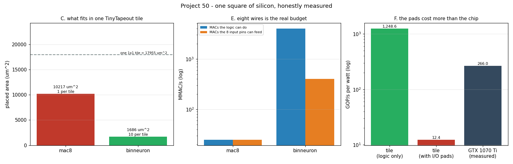

# TinyTapeout Submission

---

> Custom silicon, for real, at the smallest scale that exists — and the numbers are humbling in an instructive way. An 8×8 signed [MAC](/shared/glossary/#mac) synthesizes to **824 cells** and **5,619 µm²**, which at a realistic density fills **57% of one [TinyTapeout](/shared/glossary/#tinytapeout) tile**: exactly one fits. At 50 MHz that tile computes **25 MMAC/s** — the GPU in this same machine does **609,682x** more. Spend the identical tile on **1-bit** arithmetic instead, where a multiply is an XNOR and a sum is a [popcount](/shared/glossary/#popcount), and **10 neurons** fit and do **160x** the operations. Then the real constraint appears: with only **8 input pins** at 50 MHz, the chip can be fed **400 MMAC/s** of operands while the binary logic could do **4,000** — **pin-limited by 10x**. And the energy estimate ends the romance: the core logic burns **40 µW**, the I/O pads burn **4 mW** — **100x more** — so the tile is 4.7x *better* than the GPU per watt if you count only the logic, and **21x worse** once you count getting the answers off the chip.

---

## Key Insight

Participating in a [TinyTapeout](/shared/glossary/#tinytapeout) shared multi-project wafer run makes custom silicon design accessible to individual developers at a fraction of the usual cost. A full [ASIC](/shared/glossary/#asic) [tapeout](/shared/glossary/#tapeout) — the process of sending a finalized chip design to a semiconductor foundry for fabrication — typically costs millions of dollars. TinyTapeout sidesteps this by dividing a single chip into hundreds of tiny slots and combining many designers' work onto one wafer. Preparing a small digital design for submission teaches the fundamentals of ASIC design: writing logic in a hardware description language, running design-rule checks against the open-source SkyWater 130nm [process design kit (PDK)](/shared/glossary/#pdk), and understanding how [standard cells](/shared/glossary/#standard-cell) are placed and routed on physical silicon.

## Why This Matters

This is the last project of the "DIY AI hardware" phase, and it exists to calibrate. The phase opened by saying you cannot build a GPU. This project shows you *can* build a chip — and then measures precisely how far that chip is from a GPU, so the gap becomes a number instead of a feeling.

The three numbers that come out (609,682x less throughput, 160x more work from a cheaper number format, 100x more energy in the pads than in the logic) are also the three lessons that scale all the way up to a B200: specialization is cheap, precision is expensive, and moving data costs more than computing on it.

---

**This is project 50.**

### The words first

- **[ASIC](/shared/glossary/#asic) (application-specific integrated circuit)** — a chip whose wiring is fixed at manufacture. Unlike an [FPGA](/shared/glossary/#fpga) ([project 49](../49-fpga-inference/README.md)) it cannot be reprogrammed, which is exactly why it is smaller, faster and lower-power for the one thing it does.
- **[Tapeout](/shared/glossary/#tapeout)** — sending a finished design to the factory. The name is literal history: before digital masks, layouts were cut from red *rubylith* film and taped onto sheets, and shipping the design meant taping it out and mailing it.
- **[Multi-project wafer](/shared/glossary/#multi-project-wafer) (MPW) / shuttle** — one manufacturing run shared by many designs, so each pays a slice of the mask cost. Called a *shuttle* because it departs on a schedule, like a bus: miss the date and you wait months for the next one.
- **[PDK](/shared/glossary/#pdk) (process design kit)** — everything the foundry must tell you about its process: the design rules, the transistor models, and the [standard cell](/shared/glossary/#standard-cell) library. **[SkyWater 130](/shared/glossary/#sky130)** is an open-source PDK for a 130 nanometre process — "130 nm" being roughly the smallest feature the process can print, a generation from around 2001.
- **[Standard cell](/shared/glossary/#standard-cell)** — a pre-designed, pre-verified small logic gate (a NAND, a flip-flop) with a fixed height so cells snap into rows like Lego. Digital design is almost entirely the art of assembling these. In sky130 every cell is 2.72 µm tall and a whole number of 0.46 µm columns wide, so areas come in multiples of **1.2512 µm²**.
- **[Place and route](/shared/glossary/#place-and-route)** — deciding where each cell physically sits and how the wires connect them. Never 100% dense: about **55%** of a block's area ends up as cells, and the rest is wiring, which is why section C divides by 0.55.
- **[GDSII](/shared/glossary/#gdsii)** — the file format a foundry accepts: polygons per layer. The output of the flow, the input to the mask shop.
- **[DRC / LVS](/shared/glossary/#drc-lvs)** — *design rule check* (are all shapes manufacturable?) and *layout versus schematic* (does the layout match the netlist you meant?). Failing either means the chip does not get made.
- **[OpenLane](/shared/glossary/#openlane)** — the open-source flow (yosys + OpenROAD + Magic + KLayout) that turns Verilog into GDSII. TinyTapeout runs it for you in a GitHub Action.
- **I/O pad** — the big driver circuit connecting an internal wire to a physical pin. It has to charge the capacitance of a package pin and a circuit-board trace, which is thousands of times more than an internal wire — the fact behind section F.
- **[Popcount](/shared/glossary/#popcount)** — "population count": how many bits of a word are 1. A single instruction on CPUs, a small tree of adders in hardware, and the entire multiply-accumulate of a binarized network.

### "TinyTapeout gives you 8 input pins. Why does that dominate the design?"

Because eight wires at 50 MHz is **50 MB/s**, total, forever — and every design decision on the tile is a decision about how to spend it.

An 8-bit MAC needs two operands per multiply. If both arrive through the pins, one MAC costs two clock cycles, so the pins can feed **25 MMAC/s** — which is exactly what one MAC unit can do. Perfectly balanced, by accident of the protocol, and not improvable: adding a second multiplier would double the compute and change nothing, because the data cannot arrive any faster.

There are only three ways out, and they are the same three that every real accelerator uses:

1. **Send fewer bits per number.** The binary neuron reads eight 1-bit activations in the same byte that carried one int8 value — 8x more operands per pin-cycle.
2. **Keep one operand on chip** (weight-stationary). Then only activations stream, halving the pin traffic per MAC. Both designs here do it.
3. **Reuse each byte more than once** — the systolic array's trick ([project 23](../23-run-a-tpu-notebook/README.md)), where one value flows past many multipliers.

That is the [roofline](/shared/glossary/#roofline) argument again, at its smallest possible scale: 8 pins is your bandwidth, and if your arithmetic intensity is too low, extra multipliers are decoration. Measured here, the binary design is **pin-limited by 10x** — its logic could do 4,000 MMAC/s and the pins can only feed 400.

### "Isn't a binary neuron just a worse MAC? Why is it in the same project?"

It computes something different, and cheaply enough that the comparison is the point.

Encode −1 as bit 0 and +1 as bit 1. Then multiplying two of these values is *exactly* XNOR (agree → +1, disagree → −1), and summing eight products is *exactly* `2 × popcount(XNOR(x, w)) − 8`. No multiplier at all — just eight XNOR gates and an adder tree:

| design | gates | flip-flops | cells | area of cells | per tile | MAC rate |
|---|---|---|---|---|---|---|
| 8×8 MAC | 792 | 32 | 824 | 5,619 µm² | **1** | 25 MMAC/s |
| binary neuron | 104 | 16 | 120 | 927 µm² | **10** | 4,000 MMAC/s |

**6.9x fewer cells, and 160x the operations from the same square of silicon.** That is the entire argument for binarized and low-bit networks, and it is a hardware argument, not a machine-learning one: 1-bit weights are less accurate, but they turn the most expensive cell in the chip into a wire.

Two honest qualifications. A 1-bit "operation" is worth much less than an int8 one, so the 160x is not 160x of useful model quality — it is the exchange rate at which you may trade precision for parallelism, and the network has to be trained for it. And the binary design's advantage is capped at 10x anyway by the pins, as above.

### "The chip is 130 nm and 50 MHz. How can it possibly be efficient?"

It is, if you measure only the logic — and that turns out to be the wrong thing to measure. Switching energy is `½ C V² ` per toggle, so with the sky130 core at 1.8 V, ~4 fF of switched capacitance per cell and 15% of cells toggling per clock:

| | MAC8 tile |
|---|---|
| core logic | **40 µW** |
| I/O pads (8 outputs, 20 pJ per transition) | **4.0 mW** |
| pads ÷ core | **100x** |
| efficiency counting logic only | 1,249 GOP/s per watt |
| efficiency counting the pads | **12.4 GOP/s per watt** |
| GTX 1070 Ti, measured ([project 49](../49-fpga-inference/README.md)) | **266 GOP/s per watt** |

Read the last three rows together. Ignore the pads and the 130 nm tile looks **4.7x more efficient than a 16 nm GPU** — specialization really is that powerful. Count the pads and it is **21x worse**, because it spends 100 times more energy shipping each answer off-chip than computing it.

This is the single most transferable fact in the project. It is why real accelerators are enormous: not to have more multipliers, but so that the data crossing the expensive boundary is amortized over an enormous amount of on-chip work. It is why [HBM](/shared/glossary/#hbm) sits on the same package as the GPU, why [FlashAttention](/shared/glossary/#flashattention) exists ([project 21](../21-mini-flashattention/README.md)), and why the last five phases of this guide kept arriving at the same sentence: **moving the data costs more than the arithmetic.**

The energy numbers are order-of-magnitude estimates with the assumptions written into `run.py` (`VDD`, `C_CELL_F`, `ACTIVITY`, `PAD_ENERGY_J`). Change them and the ratios move; the 100x pad-to-core gap survives anything reasonable, because it is three orders of magnitude of capacitance.

---

## Running it

```bash
python run.py            # ~3 s: simulate, synthesize, size, and write the artifacts
python run.py --plot     # redraw the figure from the committed findings.json
```

Needs `amaranth`, `yowasp-yosys` and `matplotlib`, and reads [project 49](../49-fpga-inference/README.md)'s `findings.json` for the measured GPU comparison (it also borrows that project's `hdl_lib.py`).

> **About the numbers.** Everything below comes from the committed
> [`outputs/findings.json`](outputs/findings.json) and
> [`outputs/findings.csv`](outputs/findings.csv). Simulation, synthesis and the
> exported Verilog are real; area, energy and throughput on silicon are
> arithmetic and labelled `arithmetic` in the CSV.



---

## A. Both designs, verified

| design | test | result |
|---|---|---|
| MAC8 | 12 random signed pairs accumulated | **exact match**, 24 cycles (2.000 per MAC) |
| BinaryNeuron | 16 random activation bytes against a random weight byte | **exact match**, 16 cycles (0.125 per MAC) |

The testbenches drive the same pins a real chip would have — `ui_in`, `uio_in`, `uo_out` — so the simulation is of the interface, not just the arithmetic.

## B/C. Synthesis and the tile budget

A TinyTapeout 1×1 tile is **161.0 × 111.5 µm = 17,955 µm²** of placeable area.

| design | cells | cell area | at 55% density | fraction of a tile | copies per tile |
|---|---|---|---|---|---|
| MAC8 | 824 | 5,619 µm² | 10,217 µm² | **56.9%** | **1** |
| binary neuron | 120 | 927 µm² | 1,686 µm² | 9.4% | **10** |

An 8×8 multiplier with a 24-bit accumulator is *most of a tile*. That single fact is the scale of TinyTapeout: one tile is one MAC, or ten binary neurons, and nothing resembling a layer of anything. (Larger submissions buy 2×1, 4×1 or 8×2 tiles; the arithmetic scales linearly.)

## D/E. What a tile computes, and what the pins allow

| design | copies | logic can do | pins can feed | verdict |
|---|---|---|---|---|
| MAC8 | 1 | 25 MMAC/s | 25 MMAC/s | compute-limited (exactly balanced) |
| binary neuron | 10 | 4,000 MMAC/s | 400 MMAC/s | **pin-limited by 10x** |

Discussed above. The design lesson is that on a tiny chip your *interface* is the architecture, and 8 wires is a smaller budget than 824 gates.

## F. Energy

**40 µW of logic, 4.0 mW of pads, 100x.** Discussed above.

## G. What a submission actually consists of

`run.py` writes the parts that can be generated here:

| file | what it is |
|---|---|
| [`outputs/tt_um_mac8.v`](outputs/tt_um_mac8.v) | the Verilog, exported from Amaranth via yosys |
| [`outputs/tt_um_binneuron.v`](outputs/tt_um_binneuron.v) | the same for the binary neuron |
| [`outputs/info_mac8.yaml`](outputs/info_mac8.yaml), [`outputs/info_binneuron.yaml`](outputs/info_binneuron.yaml) | the project description and pinout TinyTapeout asks for |

And the parts that need the real flow, listed so the gap is explicit:

1. **Wrap the module** in TinyTapeout's exact port list (`ui_in`, `uo_out`, `uio_in`, `uio_out`, `uio_oe`, `ena`, `clk`, `rst_n`). Ours has `clk` and an active-high `rst`; TinyTapeout uses active-**low** `rst_n`, so the wrapper inverts it.
2. **A cocotb testbench** — TinyTapeout's CI runs your tests against the Verilog. The Amaranth testbenches in `run.py` are the same tests in a different language.
3. **GDSII via OpenLane**, run by the project's GitHub Action: synthesis, floorplan, placement, clock-tree synthesis, routing, and the timing report we cannot produce here.
4. **DRC and LVS clean** — non-negotiable; the shuttle will not accept polygons the foundry cannot print.
5. **Submit before the shuttle deadline**, pay for the tile (roughly $50–100 for 1×1 at recent shuttles), and wait: silicon comes back in **months**, on a board with the other few hundred designs, addressed by a scan chain.

That last point is the difference in kind between this and every other project in the guide. There is no re-running it. Whatever you submit is what the atoms will do.

---

## What to take away

1. **One tile is one 8-bit MAC.** 824 cells, 57% of the tile, 25 MMAC/s.
2. **The GPU in this machine does 609,682x the work of that tile.** Custom silicon at hobby scale buys understanding, not throughput.
3. **Cheaper number formats buy area directly**: 6.9x fewer cells, 10 copies per tile, 160x the operations.
4. **Your pins are your roofline.** 8 wires at 50 MHz = 50 MB/s, and the binary design is starved 10x by it.
5. **The pads cost 100x the logic.** Efficiency claims about small chips that ignore I/O are meaningless, and this is why real accelerators are big.
6. **Tapeout is one-way.** Every other lesson in this guide is about iterating faster; this one is about not needing to.

## What I would do differently

Two of the four constraints — area and pins — were visible from the first synthesis. The other two, **timing** and **DRC/LVS**, are invisible in this environment and are what actually sink first submissions. If you are doing this for real, run OpenLane locally on the exported Verilog *before* you fall in love with a design; it takes minutes and it tells you whether your adder tree closes timing at 50 MHz.

And design for the pins from the start. The obvious impulse is to pick a computation and then figure out how to get data in and out. On a tile with 8 input wires, that ordering produces a beautiful multiplier that spends most of its life waiting — which, at 609,682x behind a used GPU, is not the part of the experience worth optimizing.

---

That closes Phase 9. [Phase 10](../../README.md#phase-10-frontier-topics) is the frontier — co-packaged optics, chiplets, compute-in-memory, and the hyperscalers' custom silicon — where the ideas measured in these six projects (power, links, bandwidth, area, pins) reappear at a scale of billions of dollars and unchanged physics.
